# 从零开始的朴素贝叶斯与 TensorFlow

> 原文：[`towardsdatascience.com/naive-bayes-from-scratch-with-tensorflow-6e04c5a25947`](https://towardsdatascience.com/naive-bayes-from-scratch-with-tensorflow-6e04c5a25947)

## 概率深度学习

[](https://medium.com/@luisroque?source=post_page-----6e04c5a25947--------------------------------)[](https://towardsdatascience.com/?source=post_page-----6e04c5a25947--------------------------------) [路易斯·罗克](https://medium.com/@luisroque?source=post_page-----6e04c5a25947--------------------------------)

·发表于 [Towards Data Science](https://towardsdatascience.com/?source=post_page-----6e04c5a25947--------------------------------) ·10 分钟阅读·2023 年 1 月 18 日

--

# 介绍

本文属于“概率深度学习”系列。该系列每周涵盖深度学习的概率方法。主要目标是扩展深度学习模型以量化不确定性，即了解它们不知道的内容。

在本文中，我们对使用葡萄酒样本数据集的朴素贝叶斯分类算法进行了考察。朴素贝叶斯算法是一种基于贝叶斯定理的概率机器学习技术，假设在给定目标标签的情况下特征之间是独立的。为了便于可视化类别的分离，我们将模型限制为仅使用两个特征。

我们的目标是基于选定的特征对葡萄酒样本进行分类。为实现这一目标，我们首先探索数据并选择有效区分各类别的特征。然后，我们构建类别先验分布和类别条件密度，从而能够预测具有最高概率的类别。该研究使用的数据集包含葡萄酒的各种特征，如色调、酒精、类黄酮以及一个目标类别，并且数据集来自 scikit-learn 库 [1]。

迄今为止发表的文章：

1.  [TensorFlow Probability 的温和介绍：分布对象](https://medium.com/towards-data-science/gentle-introduction-to-tensorflow-probability-distribution-objects-1bb6165abee1)

1.  [TensorFlow Probability 的温和介绍：可训练参数](https://medium.com/towards-data-science/gentle-introduction-to-tensorflow-probability-trainable-parameters-5098ea4fed15)

1.  从零开始的最大似然估计，使用 TensorFlow Probability

1.  从零开始的概率线性回归，使用 TensorFlow

1.  [Tensorflow 中的概率性与确定性回归](https://medium.com/towards-data-science/probabilistic-vs-deterministic-regression-with-tensorflow-85ef791beeef)

1.  [频率学派与贝叶斯统计在 Tensorflow 中的应用](https://medium.com/towards-data-science/frequentist-vs-bayesian-statistics-with-tensorflow-fbba2c6c9ae5)

1.  确定性与概率性深度学习

1.  从头开始使用 TensorFlow 实现朴素贝叶斯


图 1：今天的格言：在葡萄酒分类方面要保持**天真**？ ([source](https://unsplash.com/photos/3uJt73tr4hI))

我们使用 TensorFlow 和 TensorFlow Probability 开发我们的模型。TensorFlow Probability 是一个建立在 TensorFlow 之上的 Python 库。我们将从 TensorFlow Probability 中的基本对象开始，理解如何操作它们。接下来的几周里，我们将逐步增加复杂性，并将我们的概率模型与现代硬件（例如 GPU）上的深度学习结合起来。

如常，代码可以在我的[GitHub](https://github.com/luisroque/probabilistic_deep_learning_with_TFP)上找到。

# 探索性数据

```py
import pandas as pd
import numpy as np
import matplotlib.pyplot as plt
import seaborn as sns
%matplotlib inline

import tensorflow as tf
import tensorflow_probability as tfp
tfd = tfp.distributions

from sklearn.metrics import accuracy_score
from sklearn import datasets, model_selection
from sklearn.datasets import load_wine
```

我们的目标是调查使用朴素贝叶斯算法根据选择的特征对葡萄酒样本进行分类。为了实现这一目标，我们首先进行数据的探索性分析。让我们开始识别两个有效区分目标变量的特征，并利用它们预测葡萄酒的类别。

```py
dataset = load_wine(as_frame=True)
dataset = pd.concat((dataset['data'], dataset['target']), axis=1)
sns.pairplot(dataset[['alcohol','alcalinity_of_ash', 'flavanoids', 'color_intensity', 'hue', 'target']],hue='target');
```

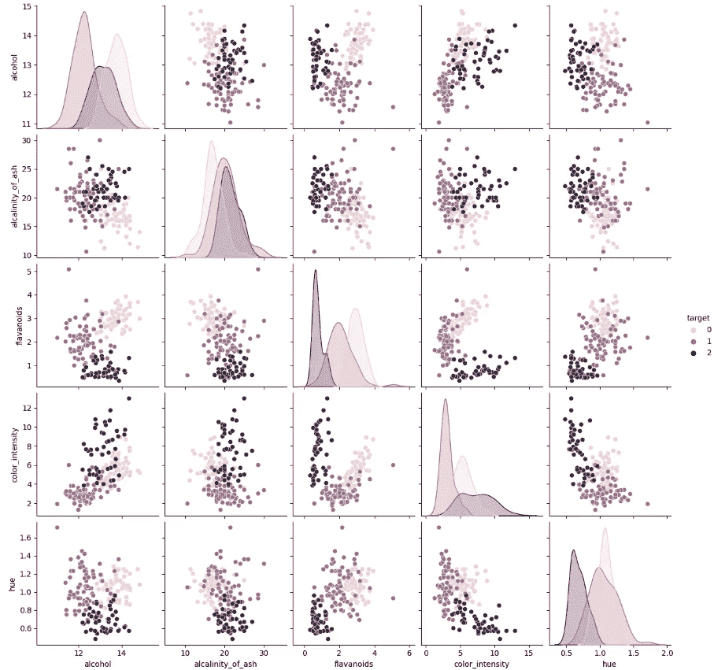

图 2：分析葡萄酒数据集中的特征对。

酒精度和色调是有效区分类别的特征。因此，这些就是我们将用于构建朴素贝叶斯模型的两个特征。

```py
sns.jointplot(x='alcohol',y='hue', hue='target', data=dataset);
```

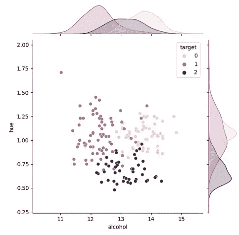

图 3：按酒精度和色调分布的目标样本。

我们现在可以将数据分成训练集和测试集。

```py
data = dataset[['alcohol', 'hue']].to_numpy()
targets = dataset[['target']].to_numpy()

label_colors = ['darkred', 'peachpuff', 'black']
x_train, x_test, y_train, y_test = model_selection.train_test_split(data, targets, test_size=0.2)
```

# 朴素贝叶斯分类器

朴素贝叶斯是一种广泛使用的概率机器学习算法，基于贝叶斯定理。它特别适用于分类任务，并以其简单性和高效性著称。尽管名字中有“朴素”，但特征之间的“朴素”独立性假设并不总是限制，并且在实践中通常能取得良好结果。在这篇文章中，我们将全面回顾朴素贝叶斯算法及其变体，并从基本原理上实现它。

我们首先简要介绍贝叶斯定理，这是朴素贝叶斯算法的基础。贝叶斯定理表明，在给定一些证据（E）的情况下，假设（H）的概率与假设的先验概率乘以证据在给定假设下的似然性成正比。朴素贝叶斯算法使用这个定理通过计算每个类别的后验概率来分类新实例，然后选择概率最高的类别。

朴素贝叶斯算法的基本原理是假设给定实例的特征在给定类别标签的情况下是条件独立的。这一假设，也称为“朴素”假设，使得算法在计算上更为高效，因为它减少了需要估计的参数数量。然而，当特征实际上并非独立时，这也可能导致准确率下降。

朴素贝叶斯算法有几种变体，每种都适用于不同类型的数据。例如，高斯朴素贝叶斯用于连续数据，而多项式朴素贝叶斯用于离散数据。伯努利朴素贝叶斯用于二元数据。在这种情况下，我们将专注于实现高斯朴素贝叶斯。

朴素贝叶斯算法已被应用于广泛的领域，包括自然语言处理、计算机视觉和生物信息学。在自然语言处理领域，它通常用于文本分类，例如垃圾邮件检测和情感分析。在计算机视觉中，它用于图像分类和目标检测。在生物信息学中，它用于蛋白质分类和基因预测。

正如我们上述所述，朴素贝叶斯分类器基于贝叶斯规则：

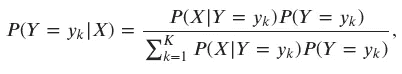

其中 *𝑋* 是输入特征，*𝑌* 是输出类别，*𝐾* 是类别的数量。更具体地说，*𝑃*(*𝑌*) 表示类别先验分布，*𝑃*(*𝑋*|*𝑌*) 是输入的类别条件分布，而 *𝑃*(*𝑌*|*𝑋*) 是给定输入特征的类别概率。

独立性假设大大简化了算法，因为我们不需要估计完整的联合分布 *𝑃*(*𝑋*|*𝑌*=*𝑦𝑘*)。相反，类别条件分布可以写作：

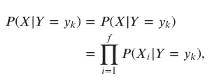

其中 *𝑓* 表示特征的数量。

# 先验

在朴素贝叶斯算法中，类别先验分布是一个概率分布，描述了训练数据中每个类别的概率。它是算法的一个基本组成部分，因为它用于计算给定一些证据的类别后验概率。

类别先验分布定义为给定训练数据中实例总数的类别概率。它通常表示为 *𝑃*(*𝑌*=*𝑦𝑘*), 其中 *𝑘* 是类别标签。类别先验分布通过训练数据中每个类别的相对频率来估计。例如，如果训练数据中有 100 个实例，其中 60 个属于类别 A，那么类别 A 的先验概率估计为 P(Y=A) = 0.6。

类别先验分布在朴素贝叶斯算法中起着至关重要的作用，因为它用于计算在给定一些证据的情况下某一类别的后验概率。后验概率的计算是将类别先验和在给定类别下证据的似然度相乘，并通过证据的边际似然度进行归一化。换句话说，类别先验分布作为一个权重因子，调整似然函数的相对重要性。

然而，如果类别先验分布是从有偏的训练数据中估计的，它可能会导致算法性能不佳，特别是当测试数据来自不同的分布时。这被称为类别不平衡问题，可以通过使用过采样、欠采样或合成数据生成等技术来缓解。

类别先验分布是属于类别 *𝑘* 的数据示例的比例。我们可以将其写成以下形式：

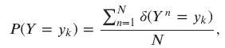

其中，*𝑛* 表示第 *𝑛* 个数据集示例，*𝑁* 是数据集中示例的总数，*𝛿* 是克罗内克δ函数（当类别匹配时返回 1，否则返回 0）。它返回一个与 *𝑃*(*𝑌*=*𝑦𝑘*) 相对应的分类分布。

```py
def prior_fn(y):
    n_classes = np.unique(y).shape[0]
    counts = np.zeros(n_classes)
    for c_k in range(n_classes):
        counts[c_k] = np.sum(np.where(y==c_k, 1, 0))
        priors = counts/np.sum(counts)
    dist = tfd.Categorical(probs=priors)
    return dist

prior = prior_fn(y_train)
prior

<tfp.distributions.Categorical 'Categorical' batch_shape=[] event_shape=[] dtype=int32>
```

让我们绘制我们的先验分布。

```py
plt.bar([0, 1, 2], prior.probs.numpy(), color=label_colors)
plt.xlabel("Class")
plt.ylabel("Prior probability")
plt.title("Class prior distribution")
plt.xticks([0, 1, 2],)
plt.show()
```

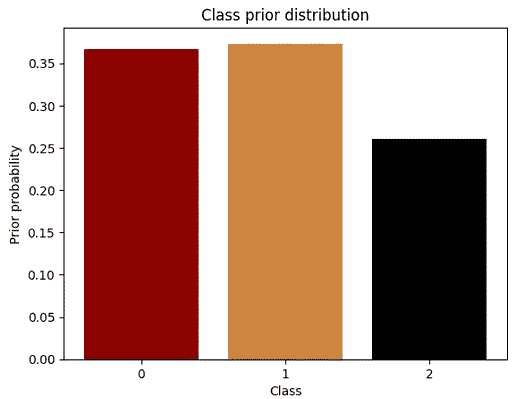

图 4：每个目标类别的先验概率。

# 似然性

在朴素贝叶斯算法中，类别条件密度是描述给定类别标签下每个特征的似然性的概率分布。它们用于计算在给定一些证据的情况下某一类别的后验概率，是算法的一个基本组成部分。类别条件密度定义为给定类别标签下每个特征的概率密度函数（pdf）。它们通常表示为 *𝑃*(*𝑋𝑖*|*𝑌*=*𝑦𝑘*), 其中 *𝑋𝑖* 是一个特征，*𝑘* 是类别标签。类别条件密度是通过各种技术从训练数据中估计出来的，具体取决于数据的类型。例如，对于连续数据，类别条件密度可以使用高斯分布估计，而对于离散数据，可以使用多项式分布或伯努利分布进行估计。正如我们之前所述，在我们的案例中，我们有连续特征，因此我们将探索高斯方法。

类别条件密度在朴素贝叶斯算法中起着关键作用，因为它们用于计算给定类别标签下证据的似然性。这一似然性是通过评估证据的每个特征的类别条件密度来计算的，然后将它们相乘。类别条件密度作为一个权重因子，调整每个特征在分类任务中的相对重要性。

现在是定义*𝑃*(*𝑋*|*𝑌*)——输入的类别条件分布的时候了。在这种情况下，我们使用单变量高斯分布（请记住独立性假设）：

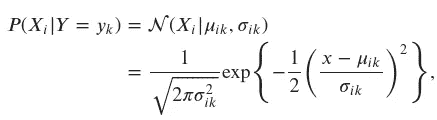

其中*𝜇𝑖𝑘*和*𝜎𝑖𝑘*是需要估计的参数。使用最大似然估计，估计值就是每个类别样本数据点的均值和方差：

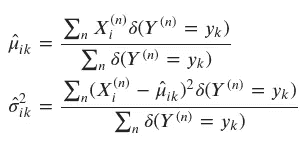

```py
def class_conditionals_fn(x, y):
    n_classes = np.unique(y).shape[0]
    n_features = x.shape[1]
    counts = np.zeros(n_classes)
    mean_feature_given_class = []
    std_feature_given_class = []
    for c_k in range(n_classes):
        mean_feature_given_class.append(np.mean(x[np.squeeze(y==c_k)], axis=0))
        std_feature_given_class.append(np.std(x[np.squeeze(y==c_k)], axis=0))

    class_cond = tfd.MultivariateNormalDiag(loc = np.asarray(mean_feature_given_class).reshape(n_classes, n_features),
                             scale_diag=np.asarray(std_feature_given_class).reshape(n_classes, n_features))

    return class_cond

class_conditionals = class_conditionals_fn(x_train, y_train)
class_conditionals

<tfp.distributions.MultivariateNormalDiag 'MultivariateNormalDiag' batch_shape=[3] event_shape=[2] dtype=float64>
```

下方的等高线图展示了类别条件密度。请注意每个分布的等高线如何对应于具有对角协方差矩阵的高斯分布，因为模型假设在给定类别的情况下每个特征是独立的。

```py
def contour_plot(x0_range, x1_range, prob_fn, batch_shape, colors, levels=None, num_points=100):
    x0 = np.linspace(x0_range[0], x0_range[1], num_points)
    x1 = np.linspace(x1_range[0], x1_range[1], num_points)
    X0, X1= np.meshgrid(x0, x1)
    Z = prob_fn(np.expand_dims(np.array([X0.ravel(), X1.ravel()]).T, 1))
    Z = np.array(Z).T.reshape(batch_shape, *X0.shape)
    for batch in np.arange(batch_shape):
        if levels:
            plt.contourf(X0, X1, Z[batch], alpha=0.2, colors=colors, levels=levels)
        else:
            plt.contour(X0, X1, Z[batch], colors=colors[batch], alpha=0.3)

plt.figure(figsize=(10, 6))
plot_data(x_train, y_train, alpha=0.3)
x0_min, x0_max = x_train[:, 0].min()-0.2, x_train[:, 0].max()+0.2
x1_min, x1_max = x_train[:, 1].min()-0.2, x_train[:, 1].max()+0.2
contour_plot((x0_min, x0_max), (x1_min, x1_max), class_conditionals.prob, 3, label_colors)
plt.title("Training set with class-conditional density contours")
plt.show()
```

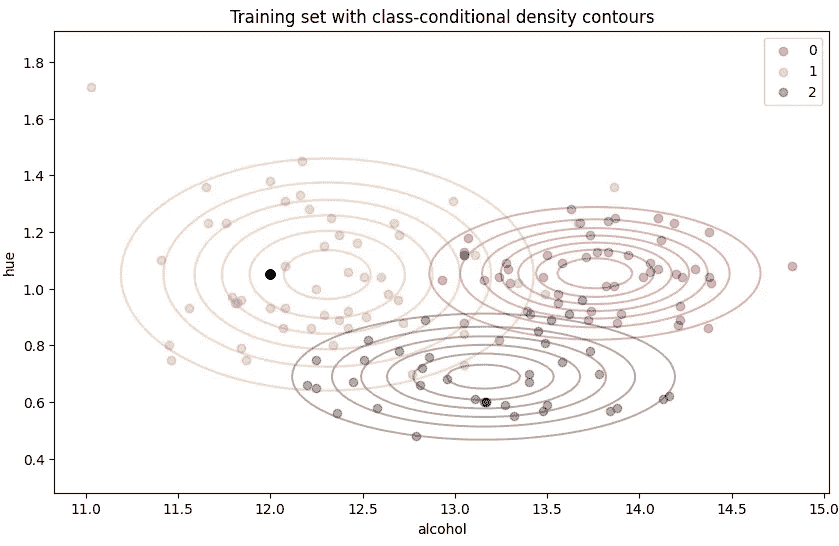

图 5：带有类别条件密度等高线的训练集。

在执行上述计算后，算法的最后一步是预测新的数据输入*𝑋*̃ :=(*𝑋*̃ 1,…,*𝑋*̃ *𝑓*)的类别*𝑌*̂。可以通过以下方式完成：

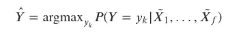

```py
def predict_class(prior, class_conditionals, x):
    log_prob_list = []
    for sample in x:
        cond_probs = class_conditionals.log_prob(sample)
        joint_likelihood = tf.add(prior.probs.numpy(), cond_probs)
        norm_factor = tf.math.reduce_logsumexp(joint_likelihood, axis=-1, keepdims=True)
        log_prob = joint_likelihood - norm_factor
        log_prob_list.append(log_prob)
    return np.argmax(np.asarray(log_prob_list), axis=-1)

predictions = predict_class(prior, class_conditionals, x_test)
```

# 结果

在这篇文章中，我们应用了朴素贝叶斯算法来根据选定的特征对葡萄酒样本进行分类。具体来说，我们使用了两个特征：色调和酒精，来预测葡萄酒的类别。我们的结果表明，该模型在这项任务中的准确率超过了 91%。

```py
accuracy = accuracy_score(y_test, predictions)
print("Test accuracy: {:.4f}".format(accuracy))

Test accuracy: 0.9167
```

为了进一步分析模型的性能，我们还绘制了模型的决策区域，即分隔不同类别的边界。决策区域有助于可视化算法执行的类别分离。如我们所见，模型能够相当有效地分隔数据集中的三个类别。

值得注意的是，朴素贝叶斯算法假设特征之间是独立的，这在实际场景中可能不成立。特征之间的相关性可以帮助提高模型的准确性。因此，考虑在模型特征之间引入相关性可能有助于提升性能。此外，还可以考虑允许特征之间相关性的其他算法来改善结果。

```py
plt.figure(figsize=(10, 6))
plot_data(x_train, y_train)
x0_min, x0_max = x_train[:, 0].min()-0.2, x_train[:, 0].max()+0.2
x1_min, x1_max = x_train[:, 1].min()-0.2, x_train[:, 1].max()+0.2
contour_plot((x0_min, x0_max), (x1_min, x1_max), 
             lambda x: predict_class(prior, class_conditionals, x), 
             1, label_colors, levels=[-0.5, 0.5, 1.5, 2.5, 3.5],
             num_points=200)
plt.title("Training set with decision regions")
plt.show()
```

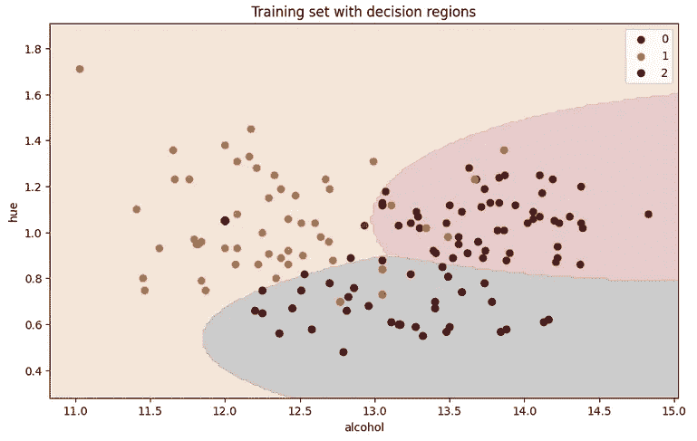

图 6：训练集决策区域。

# 结论

在这篇文章中，我们使用 TensorFlow Probability 从零开始实现了朴素贝叶斯算法。我们将其应用于使用葡萄酒样本数据集的分类任务。我们选择了两个特征，色调和酒精，来预测葡萄酒的类别，并且达到了超过 91%的准确率。我们还可视化了模型的决策区域，这有助于理解算法执行的类别分离。

这个简单的例子展示了朴素贝叶斯算法在分类任务中的简单性和有效性。然而，朴素贝叶斯算法假设特征之间是独立的，这在实际场景中可能并不成立。

# 参考文献和资料

[1] — [葡萄酒数据集](https://scikit-learn.org/stable/modules/generated/sklearn.datasets.load_wine.html#sklearn.datasets.load_wine)

[2] — [Coursera: 深度学习专业课程](https://www.coursera.org/specializations/deep-learning)

[3] — [Coursera: TensorFlow 2 深度学习](https://www.coursera.org/specializations/tensorflow2-deeplearning) 专业课程

[4] — [TensorFlow 概率指南与教程](https://www.tensorflow.org/probability/overview)

[5] — [TensorFlow 博客中的 TensorFlow 概率帖子](https://blog.tensorflow.org/search?label=TensorFlow+Probability&max-results=20)
