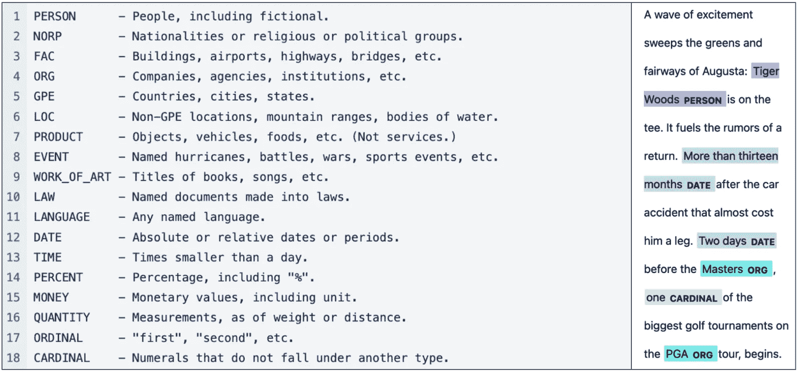
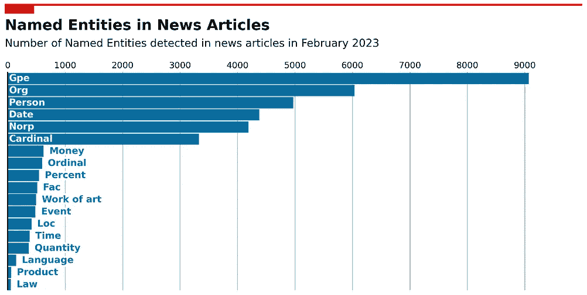
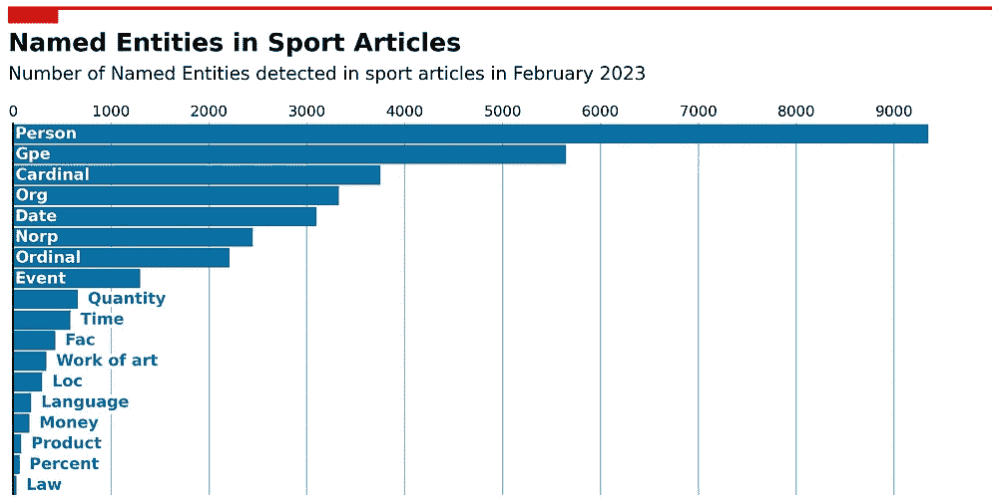
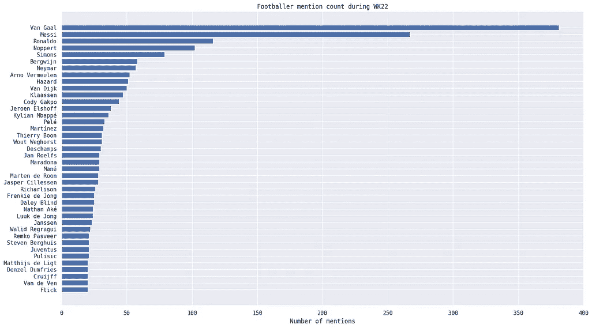
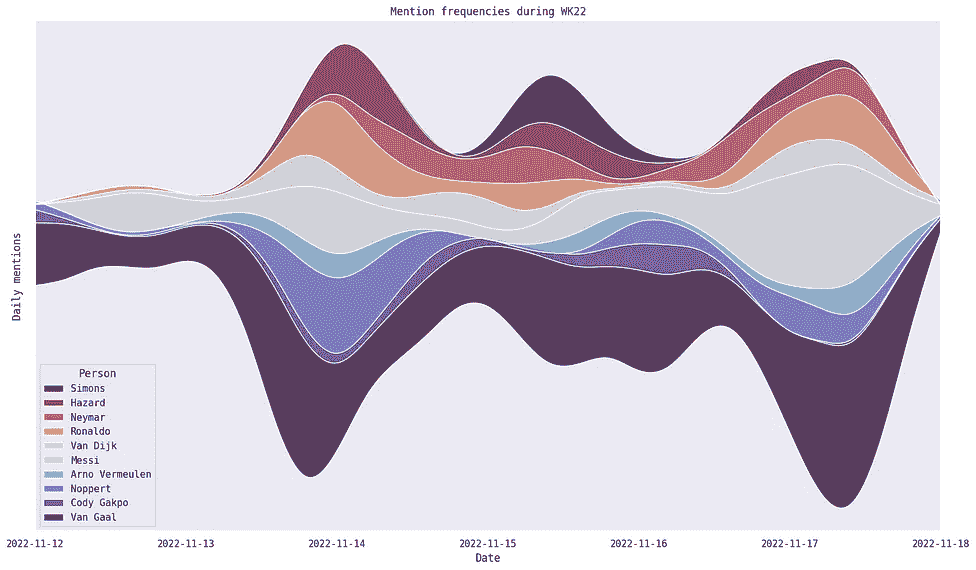
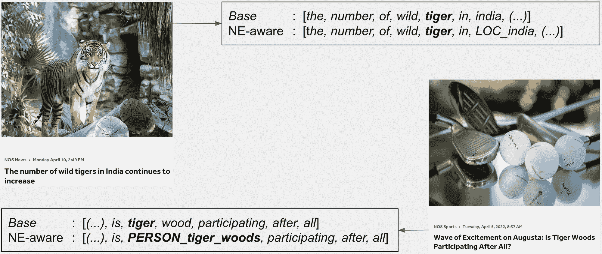
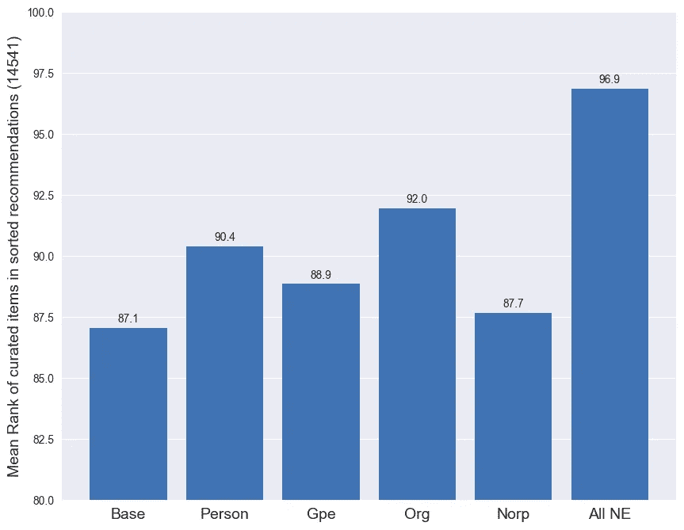

# 命名实体与新闻

> 原文：[`towardsdatascience.com/named-entities-and-the-news-ac9009601095?source=collection_archive---------5-----------------------#2023-07-04`](https://towardsdatascience.com/named-entities-and-the-news-ac9009601095?source=collection_archive---------5-----------------------#2023-07-04)

## 探索命名实体在荷兰新闻数据集中的应用

[](https://medium.com/@felixvd?source=post_page-----ac9009601095--------------------------------)[](https://towardsdatascience.com/?source=post_page-----ac9009601095--------------------------------) [Felix van Deelen](https://medium.com/@felixvd?source=post_page-----ac9009601095--------------------------------)

·

[关注](https://medium.com/m/signin?actionUrl=https%3A%2F%2Fmedium.com%2F_%2Fsubscribe%2Fuser%2Fdfe1ea06bab8&operation=register&redirect=https%3A%2F%2Ftowardsdatascience.com%2Fnamed-entities-and-the-news-ac9009601095&user=Felix+van+Deelen&userId=dfe1ea06bab8&source=post_page-dfe1ea06bab8----ac9009601095---------------------post_header-----------) 发表在 [Towards Data Science](https://towardsdatascience.com/?source=post_page-----ac9009601095--------------------------------) ·10 min read·Jul 4, 2023[](https://medium.com/m/signin?actionUrl=https%3A%2F%2Fmedium.com%2F_%2Fvote%2Ftowards-data-science%2Fac9009601095&operation=register&redirect=https%3A%2F%2Ftowardsdatascience.com%2Fnamed-entities-and-the-news-ac9009601095&user=Felix+van+Deelen&userId=dfe1ea06bab8&source=-----ac9009601095---------------------clap_footer-----------)

--

[](https://medium.com/m/signin?actionUrl=https%3A%2F%2Fmedium.com%2F_%2Fbookmark%2Fp%2Fac9009601095&operation=register&redirect=https%3A%2F%2Ftowardsdatascience.com%2Fnamed-entities-and-the-news-ac9009601095&source=-----ac9009601095---------------------bookmark_footer-----------)

一个新闻推荐系统的例子，确实可以从命名实体识别（NER）中受益。来源：[文章](https://nos.nl/artikel/2470902-aantal-wilde-tijgers-in-india-blijft-toenemen)由[NOS](https://nos.nl/)提供，照片由[Rick L](https://unsplash.com/@rickyyyl?utm_source=unsplash&utm_medium=referral&utm_content=creditCopyText)在[Unsplash](https://unsplash.com/photos/037fCBgZB10?utm_source=unsplash&utm_medium=referral&utm_content=creditCopyText)（左），作者创建的图像（中），[文章](https://nos.nl/artikel/2423950-golf-van-opwinding-op-augusta-doet-tiger-woods-toch-mee)由[NOS](https://nos.nl/)，照片由[Cristina Anne Costello](https://unsplash.com/@lightupphotos?utm_source=unsplash&utm_medium=referral&utm_content=creditCopyText)在[Unsplash](https://unsplash.com/photos/ZnBBDPO2mbQ?utm_source=unsplash&utm_medium=referral&utm_content=creditCopyText)（右）。

在 NOS——荷兰公共广播基金会——我们的编辑团队每天撰写数百篇新闻文章。这些文章向荷兰公民提供新闻，同时从自然语言处理的角度来看，也形成了一个有趣且高质量的数据集。在这篇博客中，我作为 NOS 的数据科学家，报告了通过将命名实体识别（NER）应用于我们荷兰新闻文章的数据集所进行的几个实验，并提出了在新闻背景下应用 NER 的几个想法。

# 什么是命名实体？

命名实体（NE）是一种特殊的词，指代具有专有名称的现实世界对象，例如*人物*、*地点*或*组织*。存在自动识别这些类型词语的模型，这些模型称为命名实体识别（NER）模型。右侧图示展示了一个应用于我们文章摘录的 NER 模型，其中 NE 被突出显示并标注了 NE 类型。

在荷兰，有一些预训练模型可用，如[spaCy](https://spacy.io/models/nl#nl_core_news_lg) [1]、[Flair](https://huggingface.co/flair/ner-dutch-large) [2] 或[NTLK](https://www.nltk.org/book/ch07.html) [3]。我们对这三种模型进行了定性评估，通过将它们应用于我们文章的随机样本并手动检查结果。由此我们决定在剩余实验中使用 spaCy。此模型可能识别的所有 NE 类型的概述见下图 1 左侧。



图 1：由[spaCy](https://spacy.io/api/entityrecognizer)提供的 NER 模型中的 NE 类型概述（左）。应用于从荷兰语翻译的新闻文章摘录的 NER 示例（右）。

使用来自 spaCy 的预训练模型，我们对数据集的几个子集应用了 NER。我们首先收集了一个月（2023 年 2 月）的所有文章，将数据分为*新闻*和*体育*（分别为 1,030 篇和 596 篇），然后应用 NER 以获得每种 NE 类型的总频率计数。*新闻*和*体育*的结果显示在图 2 中，立即展示了 NE 在新闻中的重要性。可以看出，仅在一个月的文章中，就提到了数万条 NE。为提供一个视角，平均每篇文章包含 404 个词，大约 10%的词是 NE。下图也显示了*新闻*和*体育*中最常提到的 NE 类型有所不同。对于新闻，大多数 NE 类型是国家，其次是组织和人物。而对于体育，最常提到的 NE 类型是人物，其次是国家和数字。这可能是因为*体育*涉及比分（基数）和个人运动员（人物），而*新闻*报道事件时，通常需要提到地点（gpe）。



图 2：新闻文章（左）和体育文章（右）中检测到的 NE 类型频率计数。

## NER 为我们的数据提供了新的视角

我们对 2022 年世界杯足球赛的所有文章进行了案例研究，总共包含 482 篇文章。NER 被应用于数据集，以检测所有类型为*Person*的 NE。发现 2,171 个独特的 NE，其中 1,296 个只被提到过一次。在图 3A 中，我们展示了这一事件中最常提到的人物的概述。此外，对于最常提到的人物，我们创建了一个流图，以展示提及频率随时间的发展，见图 3B。这表明，如*范加尔*在整个比赛中频繁被提到，而其他人物则主要在特定日期被提到。这类图表可能为我们的编辑团队提供新的洞察，因为它们是 NOS 报道内容的定量反映。这些洞察是通过 NER 高效提供的。目前我们特别应用于世界杯 22，但可以想到许多不同的设置，这些图表可能会很有趣。例如，想一想在选举期间提到哪些政治家或政党，或更普遍地，某个较长时间范围内国家、城市、组织等的提及频率。



图 3A & B：通过 NER 获得的世界杯 22 中提到的人物频率计数。左侧显示总数，右侧显示随时间的发展。

## 关于[您的命名实体这里]

我们将案例研究扩展到使用所有 2022 年世界杯的文章，并提出了“*我们能否利用 NER 为命名实体生成摘要？*”的问题。我们首先开发了一个模块，该模块收集所有提到给定 NE 的文章，这可以作为用户特别感兴趣的 NE 的所有信息集合。但更有趣的是，该模块收集了所有提到 NE 的句子，从而生成了该集合的摘要。例如，我们将该模块应用于*安德里斯·诺普特*，荷兰国家队的守门员。从图 3 中可以看出，诺普特在赛事中被提及的频率相当高。应用该模块后，生成了一个很好的概述，展示了我们守门员的非凡故事，如下所示，翻译自荷兰语。

```py
-------------------------------------------------- -------------------------------------------------- --------------------
2022-11-11
   - Noppert joining as a penalty killer?
-------------------------------------------------- -------------------------------------------------- --------------------
2022-11-16
   - sc Heerenveen goalkeeper Andries Noppert is the nineteenth premier league player in Qatar.
-------------------------------------------------- -------------------------------------------------- --------------------
2022-11-20
   - 'Don't worry about Qatar and Ecuador' and 'Failure on goal is a gamble' Analysts Leonne Stentler and Pierre van Hooijdonk agree.
   - Van Gaal does not say anything about Noppert's base place, but hints at Gakpo 'at 10' According to various media, 28-year-old Andries Noppert, who plays for sc Heerenveen, would make his debut for the Orange squad against Senegal on Monday.
-------------------------------------------------- -------------------------------------------------- --------------------
2022-11-21
   - Is Noppert the base goalkeeper now?
   - Noppert: 'This is what you dream of as a boy' Goalkeeper Andries Noppert turned out not to suffer from stage fright against Senegal.
   - Will Noppert succeed first World Cup debutant Schoenaker?
   - Goalkeeper Andries Noppert makes his debut in Orange and can look back on a successful first international match.
-------------------------------------------------- -------------------------------------------------- --------------------
2022-11-22
   - 'Disarming' Noppert takes the stage: 'In the Netherlands we are all whining' The 28-year-old goalkeeper of sc Heerenveen made his debut on Monday in the World Cup match against Senegal in the Dutch national team.
-------------------------------------------------- -------------------------------------------------- --------------------
2022-11-23
   - Noppert?
-------------------------------------------------- -------------------------------------------------- --------------------
2022-11-24
   - The Foggia episode of Orange keeper Noppert: 'He smoked like a chimney' Andries Noppert is suddenly a well-known Dutchman after the World Cup match of the Netherlands against Senegal.
-------------------------------------------------- -------------------------------------------------- --------------------
2022-11-25
   - Jurriën Timber, Virgil van Dijk and Nathan Aké had their defenses well organized and Andries Noppert once again proved to be a reliable goalkeeper.
-------------------------------------------------- -------------------------------------------------- --------------------
2022-12-03
   - View the reactions of Virgil van Dijk and Andries Noppert here: In that team, one of the important players is just back in his familiar spot in the attack.
   - Andries Noppert made a good save with his left leg.
-------------------------------------------------- -------------------------------------------------- --------------------
2022-12-07
   - Noppert lives soberly towards Argentina: 'Messi can also miss penalties, can't he?'
-------------------------------------------------- -------------------------------------------------- --------------------
2022-12-09
   - So yes..." Noppert's fairy tale ended It could have been so beautiful for sc Heerenveen goalkeeper Andries Noppert, but the keeper on the other side, Emiliano Martinez, became the great hero.
   - The Argentinian wingback Molina ran away from the back of his Dutch colleague Blind, Virgil van Dijk was just too late to correct and Molina passed Andries Noppert.
-------------------------------------------------- -------------------------------------------------- --------------------
2022-12-16
   - Six striking World Cup facts: Amrabat conquers, Modric dribbles, Noppert saves Remarkable statistics everywhere during the World Cup in Qatar.
-------------------------------------------------- -------------------------------------------------- --------------------
2022-12-18
   - Andries Noppert (Netherlands) Vermeulen: "The same goes for Noppert, of course.
```

# 一个 NE 感知的推荐系统

到目前为止，我们已经看到 NE 在新闻文章中非常普遍，应用 NER 可以提供一些有趣的见解。我们认为还有一个实验很值得在此博客中分享，涉及研究问题“*我们能否利用 NER 改进基于内容的推荐系统？*”。之前我们开发了一个基于内容的推荐系统，该系统最近已集成到我们的新闻应用中。通过在线和离线测试，我们比较了各种模型和优化，现在我们观察到应用中的点击率有所增加。这一切都是好消息，但我们一直在寻找进一步改进推荐系统的方法。我们收到编辑团队的反馈，称推荐系统对包含人名或地点名的文章感到困惑，这些名字在荷兰语中也是常见词汇。在接下来的部分中，我们报告了一个使用 NER 解决这种歧义的实验。

## 实验

我们当前的推荐系统基于使用 TF-IDF 进行文本向量化的余弦相似度。这基本上意味着它在识别相似文章时严重依赖词语重叠，但对稀有词语赋予更高的相关性。可以想象，当词语具有多重含义时，这种方法的效果可能不佳，这在 NE 的情况下尤为如此。举个例子，考虑一篇关于高尔夫球手*泰格·伍兹*的文章：一个基本的推荐系统可能会找到提到动物*老虎*或关于*树林*的文章。这些显然不会是有用的推荐。我们假设通过在推荐系统中引入 NE 感知，即通过按类型标注文本中的 NE，可以解决这个问题。在这种情况下，令牌将不再重叠，如图 5 所示。



图 5：当前推荐系统（基础）与 NE 感知系统的示例对比。当前系统因两篇文章中都提到了“tiger”一词而将这两篇文章关联起来，而 NE 感知系统则解决了这一歧义。来源：[文章](https://nos.nl/artikel/2470902-aantal-wilde-tijgers-in-india-blijft-toenemen)由[NOS](https://nos.nl/)提供，照片由[Rick L](https://unsplash.com/@rickyyyl?utm_source=unsplash&utm_medium=referral&utm_content=creditCopyText)在[Unsplash](https://unsplash.com/photos/037fCBgZB10?utm_source=unsplash&utm_medium=referral&utm_content=creditCopyText)拍摄（左），[文章](https://nos.nl/artikel/2423950-golf-van-opwinding-op-augusta-doet-tiger-woods-toch-mee)由[NOS](https://nos.nl/)提供，照片由[Cristina Anne Costello](https://unsplash.com/@lightupphotos?utm_source=unsplash&utm_medium=referral&utm_content=creditCopyText)在[Unsplash](https://unsplash.com/photos/ZnBBDPO2mbQ?utm_source=unsplash&utm_medium=referral&utm_content=creditCopyText)拍摄（右）。

我们使用 NE 类型*person*、*location*、*organisation*及其组合来实现 NE 感知。我们使用由编辑团队手动标注的测试集来评估各种模型，该测试集包含了哪些文章相关的信息。该测试集包含 14,541 篇独特的文章，平均每篇文章链接到约 2 篇其他文章。作为评估指标，我们计算了在排序推荐中的策划链接文章的平均排名。

图 6 显示了我们的基础模型与各种 NE 感知模型的结果。可以看出，实际上我们的基础模型优于所有类型的 NE 感知模型。理论上，引入 NE 感知应能改善推荐系统，但实际上我们发现它引入了比解决的歧义更多的歧义。我们详细检查了各种模型的输出，发现我们受限于 NER 模型的性能。spaCy NER 模型在其自身测试集上的 F-score 为 0.77，但在应用于其他数据集时，该得分可能更低，因此模型偶尔可能不准确。从对一些 NE 感知模型输出的手动检查中，我们看到，结合 TF-IDF 时，错误检测到的 NE 的影响相当强。对于错误检测到的 NE 的文章，输出推荐经常包含相同的错误分类 NE。例如，我们看到一篇包含词汇*hindsight*的文章被错误分类为 Person 类型的 NE，导致推荐中包含相同错误分类的 NE*hindsight*。虽然在这种情况下 NER 并未启用，但推荐是有意义的，因为 TF-IDF 会给像*hindsight_Person*这样在语料库中非常稀有的标记分配更高的相关性。我们的结论是，目前预训练的荷兰 NER 模型不够准确，无法融入我们的推荐系统。



图 6：我们当前推荐系统（基础版）与 NE 感知系统的性能比较。

我们未来可能会从自己微调预训练模型中受益。目前，我们探索了另一种解决 NE 模糊性的方法，使用诸如类别和关键词等元数据作为无噪音但关联性较弱的 NE 测量，这显著改善了我们的推荐系统。

## 结论

在本博客中，我们探讨了将命名实体识别应用于荷兰新闻数据集时可以做些什么。我们发现它在获取数据集的一般见解方面效果良好，例如构建 NE 频率图和流图。然而，当应用于我们的推荐系统时，我们发现模型的准确性不够。虽然引入 NE 感知解决了一些 NE 模糊性问题，但同时也引入了 NE 检测错误的新模糊性。未来我们可能会尝试微调预训练模型或从头开始训练自己的模型，或者如果你有任何建议，请在评论中告诉我们！

除非另有说明，否则所有图片均为作者提供。

**参考文献** [1] spaCy NER 模型：[`spacy.io/models/nl#nl_core_news_lg`](https://spacy.io/models/nl#nl_core_news_lg)

[2] Flair NER 模型：[`huggingface.co/flair/ner-dutch-large`](https://huggingface.co/flair/ner-dutch-large)

[3] NLTK NER 模型：[`www.nltk.org/book/ch07.html`](https://www.nltk.org/book/ch07.html)

**关于 NOS** NOS 是荷兰的一个独立公共媒体组织，通过电视、广播、网站和移动应用等平台报道新闻和体育。我们有专门的专业团队为多个品牌创建数字服务。本博客中描述的研究是在 NOS 数据团队的成员身份下进行的，该团队负责探索新闻背景下新兴数据科学和 AI 技术的应用。
