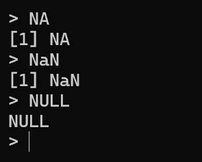
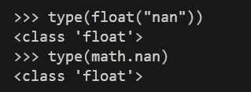
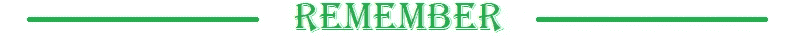

# Python 标准库中的 NaN 值

> 原文：[`towardsdatascience.com/nan-values-in-the-python-standard-library-798d9ed946c0`](https://towardsdatascience.com/nan-values-in-the-python-standard-library-798d9ed946c0)

## PYTHON 编程

## NaN 意味着 Not-a-Number。你可以在数值库中使用它——但也可以在 Python 标准库中使用。

[](https://medium.com/@nyggus?source=post_page-----798d9ed946c0--------------------------------)[](https://towardsdatascience.com/?source=post_page-----798d9ed946c0--------------------------------) [Marcin Kozak](https://medium.com/@nyggus?source=post_page-----798d9ed946c0--------------------------------)

·发布在 [Towards Data Science](https://towardsdatascience.com/?source=post_page-----798d9ed946c0--------------------------------) ·11 分钟阅读·2023 年 10 月 7 日

--


照片由 [cyrus gomez](https://unsplash.com/@cyrusgomez?utm_source=medium&utm_medium=referral) 提供，来源于 [Unsplash](https://unsplash.com/?utm_source=medium&utm_medium=referral)

`NaN` 代表 *Not-a-Number*。因此，`NaN` 对象表示它的名字所传达的意思——某物不是一个数字。它可以是一个缺失值，也可以是数值变量中的非数值值。由于我们不应该在纯数值容器中使用非数值值，因此我们将这样的值标记为 *not-a-number*，即 `NaN`。换句话说，我们可以说 `NaN` 代表一个 *缺失的数值*。

在本文中，我们将讨论 Python 标准库中可用的 `NaN` 对象。

`NaN` 值在数值数据中经常出现。如果你对这个值的细节感兴趣，你可以在这里找到它们：

[](https://en.wikipedia.org/wiki/NaN?source=post_page-----798d9ed946c0--------------------------------) [## NaN - 维基百科

### 在计算中，NaN（代表 Not a Number）是数字数据类型的一种特定值（通常是浮点数）……

en.wikipedia.org](https://en.wikipedia.org/wiki/NaN?source=post_page-----798d9ed946c0--------------------------------)

在本文中，我们不会讨论 `NaN` 值的所有细节。¹ 相反，我们将讨论一些如何在 Python 中处理 `NaN` 值的示例。

每种编程语言对 `NaN` 值有自己独特的方法。在以计算为重点的编程语言中，`NaN` 值是基本的。例如，在 R 语言中，你有 `NULL`（相当于 Python 的 `None`）、`NA`（表示 *not available*）和 `NaN`（表示 *not-a-number*）：



来自 R 会话的截图。图片由作者提供。

在 Python 中，你有`None`和多个表示`NaN`的对象。值得注意的是，Pandas 区分`NaN`和`NaT`，后者代表缺失的时间。本文将讨论标准库中的`NaN`值；主流数值 Python 框架中的`NaN`（以及`NaT`）——例如 NumPy 和 Pandas——将在未来的文章中讨论。

如果你没有在 Python 中处理过数值数据，可能根本没有遇到过`NaN`。然而，`NaN`值在 Python 编程中无处不在，因此了解如何处理它们非常重要。

# Python 中`NaN`的介绍

当你处理一个`list`对象时，可以使用数字值和非数字值。因此，它可以是`[1, 2, "three"]`或`[1, 2, None]`等。你甚至可以这样做：

```py
>>> [1, "two", list, list(), list.sort]
[1, 'two', <class 'list'>, [], <method 'sort' of 'list' objects>]
```

所以，列表可以接受任何对象。如果你想对这些列表进行数字计算，可以做到，但需要调整代码：

```py
>>> x = [1, 2, "three"]
>>> sum(x)
Traceback (most recent call last):
  File "<stdin>", line 1, in <module>
TypeError: unsupported operand type(s) for +: 'int' and 'str'
>>> sum(xi for xi in x if isinstance(xi, (float, int)))
3
```

如你所见，非数字对象在这里可以保持原样，你仍然可以进行数字计算——这不是简单或简洁的代码，但它有效。

> `NaN`——非数字——代表一个*缺失的数值*。

然而，对于只接受特定数字类型对象的容器类型来说情况并非如此。这包括`array.array`、`numpy.array`或`pandas`系列（以及`pandas`数据框中的数值列）。如果定义为数字，它们不接受非数字值，唯一的例外是：`NaN`值。

`NaN`表示一个非数字值，但正如你将很快看到的，它的类型是数字类型——准确地说是`float`。为什么？原因很简单，因为这样你可以在数字容器中使用`NaN`。

# 为什么不去掉它们呢？

为什么不干脆去掉所有这些值呢？干嘛要费这个劲呢？

`NaN`值的一个常见用例是数据分析和可视化。例如，考虑一个数据集，其中几列有某些行的缺失值。你不能从数据框中删除一个单元格，因此你可以选择保留所有这些行并以某种方式处理缺失值，或者删除所有包含一个或多个`NaN`值的行。删除缺失值的行是一个常见的做法，但它有代价：它会删除某些列中的非`NaN`值，通常不明智地丢弃我们已经拥有的信息。

`NaN` 值的另一个用途是在错误处理。例如，如果一个函数期望一个数值输入，但接收到一个字符串或其他非数值的值，它可能会返回一个 `NaN` 值以表示输入无效。我们很快会看到一个例子。这使得调用代码可以优雅地处理错误，而不是引发异常或返回意外结果。通过使用 `NaN` 值来表示错误或缺失的数据，可以对可能包含无效或缺失值的数据集进行计算和处理。你可以返回 `None`，但在 Python 中，`None` 可能表示各种不同的含义，而 `NaN` 传达了更具体的信息，直接与值的数值特性相关——这*不是一个数字*。

当你处理数值和工具时，你应该知道如何使用 `NaN`。然而，当你的应用是通用性质的，因此不需要数值框架（如 NumPy 或 Pandas）时，你会发现 `NaN` 常常可以被忽略，或者用 `None` 表示。如果这样可以使代码更简单而不牺牲任何功能，考虑这样做。

# 示例

`NaN` 值可以意味着各种事情：

+   一个普通的缺失值——它没有提供，未传输，等等。在你的笔记本中，你会将其标记为“NA”或“N/A”：不适用。*不适用*，即你无法应用它。它是缺失的，因此我们需要将其标记为缺失。你可以使用 `NaN`。

+   一个函数的结果得到了数值类型参数的错误值。函数返回 `NaN`，而不是抛出错误。

+   一个错误。这可能是输入错误；信不信由你，输入错误比我们大多数人想象的要频繁得多，[它们可能会对后续分析产生很大影响](https://www.tandfonline.com/doi/abs/10.1080/02664763.2015.1016410)。例如，许多人仍然认为菠菜是铁的良好来源。实际上并不是，那为什么这么多人认为如此呢？这源于[一个输入错误——一个错误的十进制点](https://uamshealth.com/medical-myths/is-spinach-a-great-source-of-iron/)。你可以使用 `NaN` 来表示有错误的数据元素——除非你确定可以纠正这个错误。

+   一个注释。这是一个被错误地输入到数值变量中的字符串值。当输入数据的人想解释某个特定值缺失的原因时，比如“读取不清”或“我睡过头了”。虽然这些仍然是缺失的数据，但它们提供的信息比单纯的空白值要多。有时这些信息很重要，但有时则不然。然而，对于数值计算来说，这样的注释值通常是微不足道的。因此，如果你需要使用数值容器来表示这个变量，你可以使用 `NaN` 来表示注释。

这些是四个例子，但也有其他情况。虽然每种情况略有不同，但从数值计算的角度来看，它们都是相同的：这个值不是一个数字。我们需要对它做点什么，使用 `NaN` 是一个常见的选择。

# 标准库中的 NaN

Python 提供了几种类型的 `NaN` 值，我们将在下文中讨论它们。本文重点关注标准库，但请注意，如果你使用数值框架，它很可能有自己对 `NaN` 的实现（或说是表示）以及与之配套的函数/方法。²

尽管 Python 标准库不是进行数值计算的最佳工具，但它确实提供了数值容器和专用工具。一个数值容器的例子是 `array` 模块及其 `array.array` 容器类型。虽然它不是直接使用的最佳工具，但它使你可以高效地使用 Cython，而无需使用像 NumPy 这样的非标准库工具。一个标准库中的专用数值工具的例子是 `math` 模块：

[## math — 数学函数 — Python 3.10.8 文档

### 该模块提供了 C 标准定义的数学函数的访问。这些函数不能被使用…

[docs.python.org](https://docs.python.org/3/library/math.html?source=post_page-----798d9ed946c0--------------------------------)

在 Python 标准库中使用 `NaN` 值有两种方式：`float("nan")` 和 `math.nan`。我读过许多关于 Python 的书，但我不记得看到过这两个值的提及。我的记忆并不完美，但我怀疑即使这些值在一些书中被提到，也没有得到足够的关注。因此，我认为许多数据科学家，甚至是数据科学领域之外的 Python 开发者，可能对 `float("nan")` 和 `math.nan` 并不知晓，尽管他们可能熟悉 `np.nan`，这是在 NumPy 数组和 pandas DataFrame 中表示 NaN 值的标准方式（见下文）。一个可能的原因是这两个值不像 `np.nan` 那样广泛使用。

这两个 `NaN` 对象都是值，都是 `float` 类型：



float(“nan”) 和 math.nan 的类型都是 float。图像由作者提供。

顺便提一下，现在你不应该感到惊讶，了解到 `np.nan` 的类型也是 `float`。

记住两个 `NaN` 值的比较是很重要的：

```py
>>> float("nan") is float("nan")
False
>>> float("nan") == float("nan")
False
>>> math.nan is math.nan
False
>>> math.nan == math.nan
False
```

这是因为我们只知道 `NaN` 不是一个数字，但我们不知道它是什么类型的值。在一种情况下，它可以是一个字符串；在另一种情况下，它可以是一个不同的字符串；还有一种，它可以是一个长字典；再一种，它可以是一个缺失值，因为 `NaN` 经常用于表示 `NA`。因此，我们不能假设两个 `NaN` 值彼此相等。这在处理数值向量和矩阵时可能会产生相当大的差异：

```py
>>> [1, 2, 3] == [1, 2, 3]
True
>>> [1, 2, float("nan")] == [1, 2, float("nan")]
False
```



然而，如果我们创建一个新的`NaN`对象，我们将看到：

```py
>>> NaN = float("nan")
>>> NaN is NaN
True
>>> NaN == NaN
False
>>> NaN = math.nan
>>> NaNmath = math.nan
>>> NaNmath is NaNmath
True
>>> NaNmath == NaNmath
False
```

你有没有注意到，即使`is`比较返回`True`，`==`比较却返回`False`？所以，这个对象是它自己，但它却不等于自己……

记住使用新定义的哨兵值如`NaN`或`NaNmath`时的这种行为。我知道这很诱人，我自己也做过不止一次。因此，只有当这种行为是你想要实现的时，才这样做。


让我们回到这个例子：

```py
>>> x = [1, 2, "three"]
>>> sum(xi for xi in x if isinstance(xi, (float, int)))
3
```

让我们看看`NaN`值的实际应用。我们可以用`NaN`值替换掉`"three"`，而不是调整`sum()`函数。为此，我们可以使用以下函数：³

```py
from collections.abc import Sequence
from typing import Any

def use_nan(__x: Sequence[float | Any]) -> Sequence[float]:
    """Replace non-numerical values with float("nan").

    >>> NaN = float("nan")
    >>> use_nan([1, 2, 3])
    [1, 2, 3]
    >>> use_nan([1., 2., 3.])
    [1.0, 2.0, 3.0]
    >>> use_nan([1, 2., 3.])
    [1, 2.0, 3.0]
    >>> use_nan([1, 2, "str"])
    [1, 2, nan]
    >>> use_nan((1, 2, str))
    (1, 2, nan)
    >>> use_nan(1., 2, Any, str, (1, 2,)))
    (1.0, 2, nan, nan, nan)
    """
    return type(__x)([xi
                      if isinstance(xi, (float, int))
                      else float("nan")
                      for xi in __x])
```

现在，让我们在使用`sum()`函数之前使用该函数，如上所述，它不接受非数值型的值：

```py
>>> x = use_nan([1, 2, float("nan")])
>>> sum(x)
nan
>>> import math
>>> sum([1, 2, math.nan])
nan
```

哈？发生了什么？我们使用了`NaN`值来使`sum()`工作，确实它不像之前那样抛出错误。但它只是返回了`nan`……

从数学角度来看，这完全合理：将一个数字加到不是数字的东西上不会得到一个数字，对吧？这就是我们上面得到`nan`的原因。但这真的是我们想要实现的结果吗？

这要视情况而定。通常，我们可以选择如何处理`NaN`值。最典型的方法是删除`它们`。这通过从数据框中删除整行或整列，或从变量中删除单元格来完成。另一种方法——在统计学中常用——是用其他值填充缺失值，这称为插补。

本文并不打算详细讨论这些方法。你可以在许多统计学书籍中阅读这些方法，也可以在各种文章中找到它们；下面的两篇文章描述了在 Python 中使用这些方法：

[](/3-ultimate-ways-to-deal-with-missing-values-in-python-ac5a17c53787?source=post_page-----798d9ed946c0--------------------------------) [## 3 种处理 Python 中缺失值的终极方法]

### 在插补和数据删除之间明智地选择

towardsdatascience.com](/3-ultimate-ways-to-deal-with-missing-values-in-python-ac5a17c53787?source=post_page-----798d9ed946c0--------------------------------) [](https://www.analyticsvidhya.com/blog/2021/05/dealing-with-missing-values-in-python-a-complete-guide/?source=post_page-----798d9ed946c0--------------------------------) [## 如何处理 Python 中的缺失数据？ [5 个简单步骤说明]]

### 学习如何处理 Python 中的缺失数据。识别、评估并处理缺失数据，以便你能最大限度地发挥……

www.analyticsvidhya.com](https://www.analyticsvidhya.com/blog/2021/05/dealing-with-missing-values-in-python-a-complete-guide/?source=post_page-----798d9ed946c0--------------------------------)

如上所述，标准库中的方法确实能处理 `NaN` 值，但它们会简单地返回 `nan`，这是 `float("nan")` 的 `repr` 和 `str` 表示。因此，我们需要手动从容器中移除不是数字的值。不幸的是，鉴于 `NaN` 值的比较方式，以下方法将无效

```py
>>> x = use_nan([1, 2, "three"])
>>> sum(xi for xi in x if xi is not float("nan"))
nan
>>> sum(xi for xi in x if xi != float("nan"))
nan
```

那么，`nan` 又来了。这是怎么回事？

我们已经知道发生了什么：`NaN` 在与其他 `NaN` 值进行比较时返回 `False`，这发生在 `if xi is not NaN` 和 `if xi != NaN` 中。因此，我们需要一个专门的函数来检查 `NaN` 值。标准库提供了这样的一个函数，在 `math` 模块中：

```py
>>> sum(xi for xi in x if not math.isnan(xi))
3
```

# 结论

我们讨论了在 Python 标准库中使用 `NaN` 值。这些知识应该足够你在标准库工具中处理 `NaN` 值。然而，数值框架可以实现自己的 `NaN` 值。例如 NumPy 的 `np.nan`。

正如之前提到的，我不认为作为 Python 程序员，你会频繁使用标准库中的这两个 `NaN` 哨兵。然而，你应该知道如何处理它们，因为有时你可能需要使用它们，即使你在使用像 NumPy 这样的数值框架。此外，我认为仅为了使用 `np.nan` 而安装 NumPy 并不明智。我希望这篇文章能帮助你处理这样的情况。

# 脚注

¹ 值得注意的是，像 `None` 一样，`NaN` 值也是哨兵值：

[## 哨兵值 — 维基百科

### 在计算机编程中，哨兵值（也称为标志值、三值、恶意值、信号值或…

[en.wikipedia.org](https://en.wikipedia.org/wiki/Sentinel_value?source=post_page-----798d9ed946c0--------------------------------)

² 一个例子是 `np.nan` 和处理 `NaN` 值数据的 Numpy 函数，如 `np.nansum()`、`np.nanmean()`、`np.nanmax()`、`np.nanmin()` 和 `np.nanstd()`。

³ 函数的文档字符串包含多个 doctest；你可以在以下文章中阅读关于这个出色的文档测试工具的信息，它也可以用于单元测试：

[](/python-documentation-testing-with-doctest-the-easy-way-c024556313ca?source=post_page-----798d9ed946c0--------------------------------) ## 使用 doctest 进行 Python 文档测试：简便方法

### doctest 允许进行文档、单元和集成测试，以及测试驱动开发。

[towardsdatascience.com

感谢阅读。如果你喜欢这篇文章，你可能也会喜欢我写的其他文章；你可以在 [这里](https://medium.com/@nyggus) 查看。如果你想加入 Medium，请使用我下面的推荐链接：

[](https://medium.com/@nyggus/membership?source=post_page-----798d9ed946c0--------------------------------) [## 使用我的推荐链接加入 Medium - Marcin Kozak

### 作为 Medium 会员，你的一部分会员费会转给你阅读的作者，并且你可以完全访问所有故事……

[medium.com](https://medium.com/@nyggus/membership?source=post_page-----798d9ed946c0--------------------------------)
