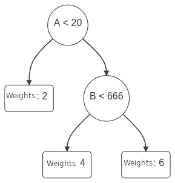

# XGBoost 如何原生支持分类？

> 原文：[`towardsdatascience.com/native-support-of-categories-in-xgboost-how-does-it-work-d359096bd003?source=collection_archive---------7-----------------------#2023-03-22`](https://towardsdatascience.com/native-support-of-categories-in-xgboost-how-does-it-work-d359096bd003?source=collection_archive---------7-----------------------#2023-03-22)

 [Saupin Guillaume](https://medium.com/@guillaume.saupin?source=post_page-----d359096bd003--------------------------------)

·

[关注](https://medium.com/m/signin?actionUrl=https%3A%2F%2Fmedium.com%2F_%2Fsubscribe%2Fuser%2F891e27328f3a&operation=register&redirect=https%3A%2F%2Ftowardsdatascience.com%2Fnative-support-of-categories-in-xgboost-how-does-it-work-d359096bd003&user=Saupin+Guillaume&userId=891e27328f3a&source=post_page-891e27328f3a----d359096bd003---------------------post_header-----------) 发布于 [Towards Data Science](https://towardsdatascience.com/?source=post_page-----d359096bd003--------------------------------) ·6 min read·2023 年 3 月 22 日

--

图片由[Jon Tyson](https://unsplash.com/fr/@jontyson?utm_source=medium&utm_medium=referral)拍摄，发布在[Unsplash](https://unsplash.com/?utm_source=medium&utm_medium=referral)

使用梯度提升训练的 XGBoost 和其他基于决策树的方法采用比较来做决策。为分类定义一个比较操作符在数学上并不简单。

在这篇文章中，我们将解释可用的选项，详细说明它们的优缺点，并重点介绍最近在 XGBoost（以及 LightGBM）中引入的对分类特征的原生支持。

如果你对梯度提升及其在决策树训练中的应用感兴趣，请考虑我的书籍：

 [## 实用梯度提升：深入探讨 Python 中的梯度提升

### 这本关于梯度提升方法的书籍旨在为希望深入了解这一领域的学生、学者、工程师和数据科学家提供参考…

[amzn.to](https://amzn.to/3LDmbKM?source=post_page-----d359096bd003--------------------------------)

# 决策树

如下图所示，决策树基于比较来做出决策：

一个简单的决策树。图由作者提供。

例如，在这个简单的示例中，如果输入是一行数据，其中两列为`A=21`和`B=111`，则输出值将是权重`4`。
