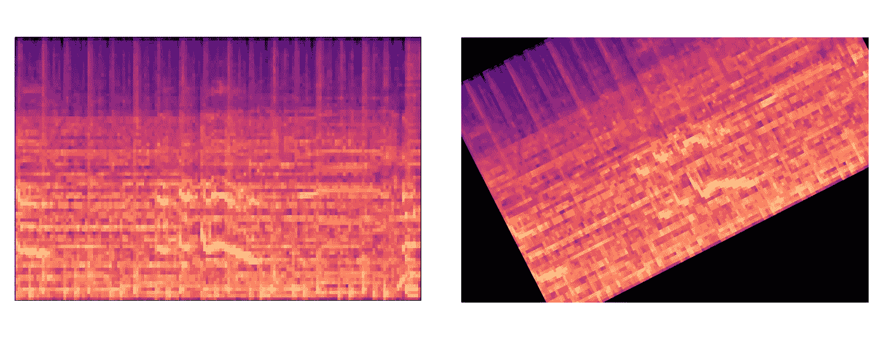

# 使用 Spotify 的 Pedalboard 进行自然音频数据增强

> 原文：[`towardsdatascience.com/natural-audio-data-augmentation-using-spotifys-pedalboard-212ea59d39ce`](https://towardsdatascience.com/natural-audio-data-augmentation-using-spotifys-pedalboard-212ea59d39ce)

## 包含现成的 Python 代码和预设

[](https://medium.com/@maxhilsdorf?source=post_page-----212ea59d39ce--------------------------------)[](https://towardsdatascience.com/?source=post_page-----212ea59d39ce--------------------------------) [Max Hilsdorf](https://medium.com/@maxhilsdorf?source=post_page-----212ea59d39ce--------------------------------)

·发表于[Towards Data Science](https://towardsdatascience.com/?source=post_page-----212ea59d39ce--------------------------------) ·10 分钟阅读·2023 年 1 月 9 日

--


图片改编自[**户山 神奈**](https://unsplash.com/de/fotos/Qi32ATTSwp4)**.**

作为数据科学家，处理音频数据常常是一项艰巨的任务。一个常见的问题是**数据缺乏**，这会影响构建有效模型（如语音识别、音乐推荐和语音转文本）的能力。通常，**音频数据是敏感的**，可能包含人声或受版权保护的音乐。最后，相比其他数据类型，音频数据是高维的，通常需要**巨大的计算资源**。因此，充分利用现有数据至关重要。音频数据增强是一种很好的方法来实现这一目标！

在本文中，我们将讨论以下主题：

1.  **（音频）数据增强基础**

1.  **Spotify Pedalboard 简介**

1.  **音频数据增强的最佳实践**

1.  **利用现成代码和预设的高级用法**

# 数据增强

数据增强是通过轻微修改数据集中部分或所有示例来增加训练数据总量的过程。如果做得正确，增强数据集可以有效地**防止过拟合**。这意味着，即使数据量相对较小，你的机器学习模型也很可能会产生更具**普遍适用性的结果**。数据增强通常仅应用于训练数据，因为如果将增强混入验证和测试数据中，度量指标将变得无效。

最重要的是，增强示例必须仍然足够类似于原始示例，以便被视为*“同一类别”*。这就是我们所说的**自然**或**分布内**增强。以下是图像识别中的一个示例，数据增强被广泛应用：如果你旋转和平移猫的图像，你可以生成各种经过修改的图像，这些图像在技术上是“不同”的，但仍然明显是猫。


为数据增强而对猫的图像进行平移和旋转，这一灵感来源于 Suki Lau 的介绍文章。猫的图像由[Alexander London](https://unsplash.com/de/@alxndr_london)提供。

> 如果你的增强示例看起来在模型部署时可能会遇到“现实世界”的示例，那就可以了。

这一经验法则很有用，但这对音频数据意味着什么呢？

# 音频数据增强

我有个好消息要告诉你：在机器学习中，音频数据通常表现为图像，例如谱图。那么它与猫的例子有多大不同呢？嗯，这里也有一个坏消息：平移或旋转这些图像都没有用。只需看看下面的图像：



应用在谱图上的旋转和平移。图像由作者提供。

你不需要任何信号处理方面的专业知识就能看出，平移和旋转后的谱图**不是自然增强**。你的模型在“现实生活”中永远不会看到平移/旋转的谱图，因此你不应使用这些进行训练。

有三种音频数据增强方法被广泛采用：

1.  在将音频转换为图像表示后，使用**遮罩**来“隐藏”图像中的某些部分。

1.  如果你的音频文件比你想用作模型输入的长度要长，你可以从单个音频文件中提取**多个片段**。

1.  对你的示例应用信号修改，如**音频效果**，以稍微改变它们。

在这三种方法中，我认为**第三种选项最好**，它能够可靠地产生所有类型音频数据的自然增强。然而，它需要大量的努力和细致的思考才能正确完成。这就是为什么我把它作为本文的主题。

无论是语音还是音乐，声音文件通常可以用音频效果如压缩器、均衡器或混响来编辑。实际上，这些是任何声音工程师的“基本功”。好消息是，这些效果在我们处理的数据中非常固有，因此**特别适合数据增强**。如果我增加了摇滚歌曲的整体混响，它仍然是一首摇滚歌曲，但生成的谱图可能看起来明显不同。

# **踏板板**


吉他踏板板。图像由[Frankie Lopez](https://unsplash.com/de/fotos/NEmRMr0e2TQ)提供。

Pedalboard 于 2021 年 9 月相对较新发布，附有 [介绍文章](https://engineering.atspotify.com/2021/09/07/introducing-pedalboard-spotifys-audio-effects-library-for-python/) 和 [github 仓库](https://github.com/spotify/pedalboard)。术语 “pedalboard” 源于电吉他手，他们通常使用多个吉他效果器，比如失真或混响，通常以脚踏板的形式连接到效果板上。尽管 pedalboard 显然是为音乐应用而构建的，但它也非常适合语音增强。

## 安装

你可以在终端中运行以下命令来安装 pedalboard。

```py
pip install pedalboard
```

要使用 Pedalboard 的效果，你需要将音频文件加载到 Python 中，作为其波形的数组表示形式。“librosa”和“soundfile” 在这方面尤其有用。

```py
pip install librosa
pip install soundfile
```

为了使 librosa 正常工作，你还需要下载并安装 [**FFmpeg**](https://www.ffmpeg.org/download.html) 并 [将其添加到你的 PATH 环境变量](https://www.java.com/en/download/help/path.html)** 中**。

## 加载音频

要加载音频文件，只需使用：

```py
import librosa

audio, sr = librosa.load("path/to/file")
```

“librosa.load” 返回波形数组和音频采样率。我们将使用以下短音乐示例贯穿本文，以演示 pedalboard 的功能：

这是我在不久前制作的一段短小的放克风格的器乐片段。如果你想跟随操作，可以直接从 [SoundCloud](https://soundcloud.com/user-726858933/spotify_pedalboard_base_example) 下载音频文件。

## 应用单个效果踏板

首先，我们从 pedalboard 库中导入 “Pedalboard” 和 “Reverb”。即使我们只想应用一个效果，也需要首先实例化一个 “Pedalboard”，然后将我们的效果添加到其中。作为效果，我们将使用具有默认 pedalboard 设置的混响效果。

```py
from pedalboard import Pedalboard, Reverb

# Create a pedalboard with one pedal
board = Pedalboard()
board.append(Reverb()) # instantiate with default parameters

# Apply pedal to audio signal
audio_reverbed = board(audio, sr)", audio_reverbed, sr)
```

有许多方法可以将音频波形导出为 .mp3 或 .wav 文件。这里是一种常见的方法：

```py
import soundfile as sf

sf.write("path/to/file.wav", audio_reverbed, sr)
```

这是应用标准混响效果后的示例声音：

很容易听出，尽管混响效果已经相当强烈，但我们保留了相关的音乐参数和整体的曲目表现。

如果我们想要不同类型的混响效果怎么办？Pedalboard 允许我们为每个效果踏板使用自定义参数。例如，这里是如何创建一个比之前使用的混响效果更为突出的效果：

```py
board = Pedalboard()
board.append(Reverb(room_size=0.15, damping=0.8, wet_level=0.9))

audio_reverbed = board(audio, sr)
```

如果你听下面的示例，你会发现混响效果非常突出，以至于掩盖了基础音乐。这是一个不自然增强的例子，至少对于大多数使用情况来说是这样。

## 应用多个效果踏板

我们可以使用更多效果并将它们组合成一个效果链。例如，**PitchShift** 会将整个音频的音高提高或降低，比如提升两个半音。**Compressor** 会将信号中较响的部分降低，从而使声音的动态范围减少，更加紧凑。除此之外，我们还可以再次添加具有自定义参数的混响效果。

```py
from pedalboard import Pedalboard, Compressor, PitchShift, Reverb

# Create board with multiple pedals
board = Pedalboard(
    [
        PitchShift(semitones=2),
        Compressor(threshold_db=-20, ratio=2),
        Reverb(wet_level=0.3)
    ]
)

# Apply board
audio_multieffect = board(audio, sr)
```

这是结果音频的声音示例：

我们是否已经对效果处理过度了？当然，这需要在机器学习任务的背景下讨论。如果我想检测歌曲的调性，显然我们不应该改变音高，以保持相同的音高标签。如果我们尝试检测一首曲目的风格，它仍然可以明显被识别为——制作不佳的——放克曲目。

# 问题和最佳实践


图片改编自 [Olia Danilevich](https://www.pexels.com/de-de/@olia-danilevich/)。

到此为止，应该可以清楚地看到，踏板板非常适合自然音频数据增强。然而，在实际使用案例中，还有一些额外的事项需要考虑。

## “好”的预设

如果我们想保持增强效果自然，我们需要找到一个（或多个）预设，能够**可靠地创建自然的增强效果**，适用于我们数据集中的所有示例。例如，为重金属曲目添加更多失真可能是一个可行的选择，但将古典音乐中的小提琴失真处理真的自然吗？

## **增强多样性**

当然，我们可以对所有我们想增强的示例使用相同的效果链。然而，对每个示例在效果链中引入一些随机性有两个显著的优点：

1.  你可以创建相同示例的多个增强效果，它们会有所不同。

1.  模型学习处理更多样化的效果，这可以提高其鲁棒性。

在保持增强自然性的同时使用随机效果链是这里的**关键挑战**。

## **速度**

如果我们想处理成千上万的音频示例，我们需要考虑一个高效的实现方式。我们当然可以增强每个文件并将增强后的示例存储为音频文件。然而，我们真的有兴趣将增强效果存储在某个地方吗？如果没有，我们可以在数据处理脚本或管道中计算增强效果。例如，如果我们想计算每个音频示例的梅尔谱图，我们可以

1.  将音频加载到 numpy 数组中。

1.  随机生成一个踏板板并将其应用于数组。

1.  计算原始音频和增强示例的梅尔谱图。

1.  将两个梅尔谱图都存储在训练数据集中。

这样，**不会浪费时间**在导出和加载我们不会再使用的音频文件上。

# **踏板板增强 GitHub 仓库**


截图由作者提供。

为了帮助你开始进行音频增强，我写了一些代码并将其发布在[这个 GitHub 仓库](https://github.com/MaxHilsdorf/pedalboard_audio_augmentation)中。该仓库包括

+   一个实现**随机、自然效果链**的音频增强模块。

+   示例脚本用于将这些随机、自然的增强应用于单个文件或作为梅尔谱图特征提取管道的一部分

+   从 GTZAN 数据集中获得了一些示例音频文件，你可以用来玩弄增强效果。

虽然我无法在这篇文章中详细讲解代码，但我仍然想展示如何将随机效果链应用于单个音频文件。有关进一步的指导，请查看仓库中的“README.md”文件。

## **构建随机效果链**

首先，我们将音频增强模块（库中的“code/audio_augmentation.py”）的路径添加到 sys.path 中，并导入相关功能。

```py
import sys
sys.path.append("../code/")
from audio_augmentation import roll_pedal, pedal_dict, process_track
```

接下来，我们通过指定正确顺序中希望使用的效果来定义效果链。此外，我们为每个踏板分配一个概率值，表示每次踏板板滚动时该踏板被激活的可能性。如果你希望每次都应用所有踏板，请将所有概率设置为 1。

```py
pedal_config = [("compressor", .3),
                ("chorus", .3),
                ("reverb", .3),
                ("distortion", .3),
                ("lowpassfilter", .3),
                ("highpassfilter", .3),
                ("pitchshift", .3)
                ]
```

接下来，我们定义一个备用效果链。这在没有踏板通过随机滚动的情况下需要，即没有效果被选择。在这种情况下，模块将使用这个备用效果链作为默认设置。

```py
from pedalboard import Compressor, PitchShift, HighpassFilter

fallback = [HighpassFilter(cutoff_frequency_hz=300),
            PitchShift(semitones=1),
            Compressor(threshold_db=-10, ratio=1.3)]
```

## 滚动踏板板

要“滚动”我们的踏板板，我们可以使用这段代码，它调用了增强模块中的“roll_pedal”函数：

```py
pedal_rolls = [roll_pedal(pedal=pedal_dict[pedal]["pedal"],
                          param_dict=pedal_dict[pedal]["param_dict"],
                          pedal_prob=prob,
                          random_seed=None)
               for pedal, prob in pedal_config]
```

请注意，“pedal_dict”是从增强模块导入的。它保存了参数范围的信息，并为每个踏板应用了随机设置。

## 应用随机踏板板

现在，最后，我们可以加载我们的音频文件，并使用增强模块中的“process_track”函数将随机踏板板应用于它。

```py
audio, sr = librosa.load("path/to_file")
audio_processed = process_track(
  audio, sample_rate=sr,
  pedals=pedal_rolls, fallback=fallback
)
```

让我们听听这段代码会对我们的示例音轨做什么！

这个效果有轻微的合唱效果以及一些轻微的失真。它听起来明显不同于原始版本，但仍然非常接近。在此期间，让我们再尝试另一种随机增强滚动！

这里，我们对信号应用了压缩器、低通滤波器、高通滤波器和音高移位。这次差异更为明显。然而，音轨的自然性仍然得到保持。

# 结论

在这篇文章中，我们

+   学习了数据增强是什么以及为何使用它。

+   讨论了自然增强为何如此重要。

+   看到音频数据增强与其他数据类型的增强有所不同。

+   获得了将踏板板库应用于音频信号的实际经验。

+   概述了音频数据增强的最佳实践。

+   初步了解了一个基于踏板板的音频增强模块。

**希望你学到了一些新知识，并觉得这篇文章有用！**

如果你对其他形式的音频数据增强感兴趣，可以查看我写的 这篇文章，讲述了如何使用“分而治之”方法进行音乐类型分类。
