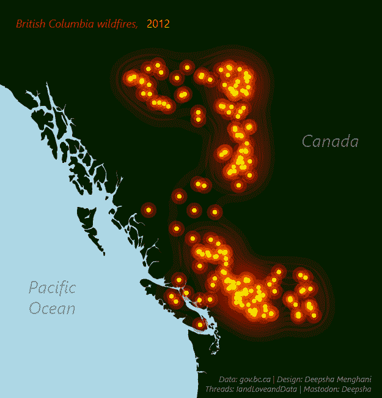
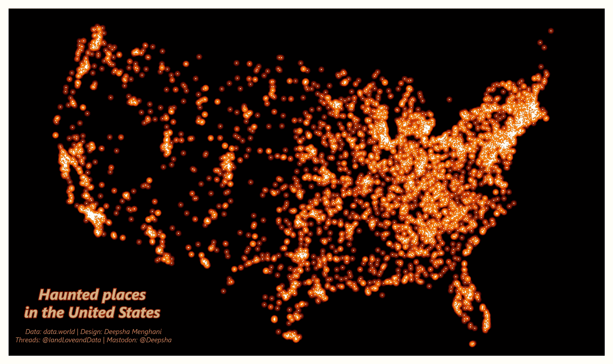
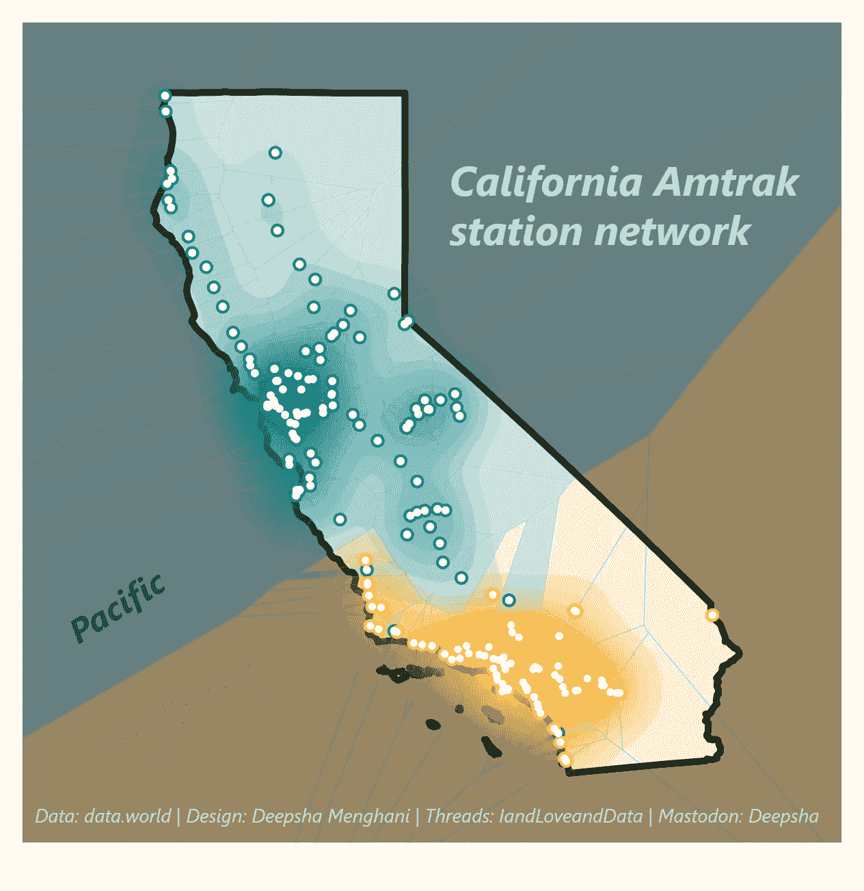
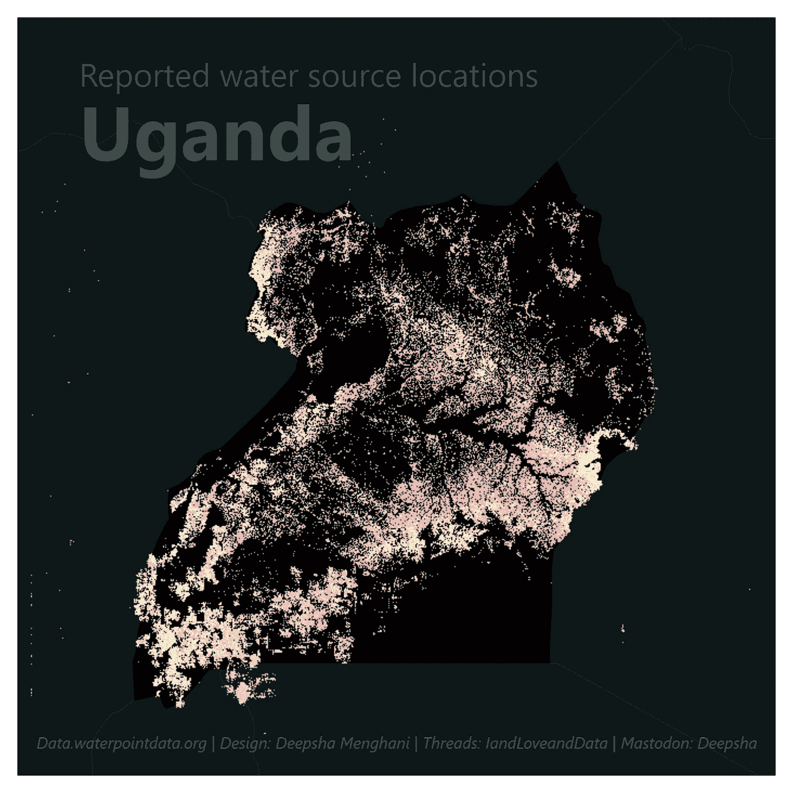
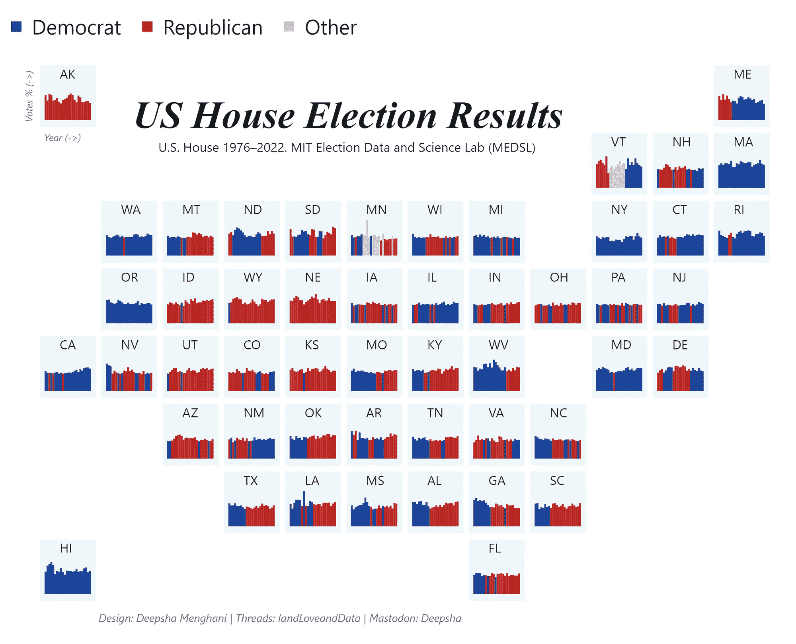
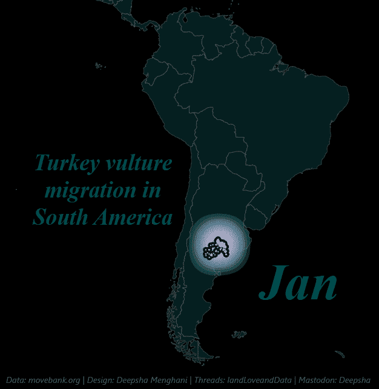
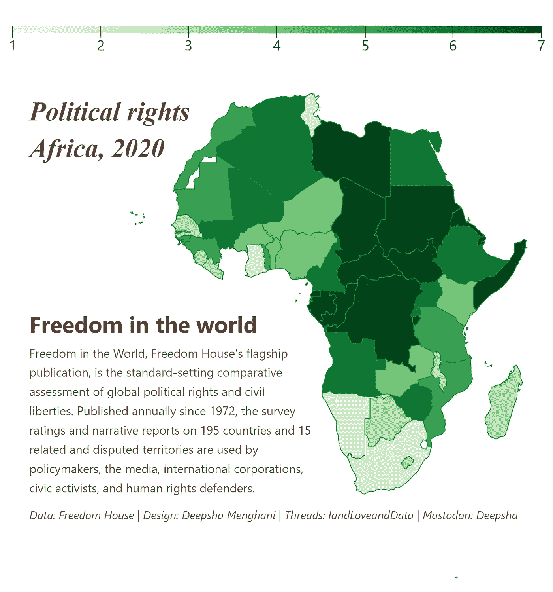

# 导航制图挑战：#30 天地图挑战中途进行中

> 原文：[`towardsdatascience.com/navigating-the-cartographic-challenge-halfway-through-the-30daymapchallenge-ee96e02aaf95?source=collection_archive---------13-----------------------#2023-11-17`](https://towardsdatascience.com/navigating-the-cartographic-challenge-halfway-through-the-30daymapchallenge-ee96e02aaf95?source=collection_archive---------13-----------------------#2023-11-17)

[Deepsha Menghani](https://medium.com/@menghani.deepsha?source=post_page-----ee96e02aaf95--------------------------------)

·

[关注](https://medium.com/m/signin?actionUrl=https%3A%2F%2Fmedium.com%2F_%2Fsubscribe%2Fuser%2Fb0c00845bcfa&operation=register&redirect=https%3A%2F%2Ftowardsdatascience.com%2Fnavigating-the-cartographic-challenge-halfway-through-the-30daymapchallenge-ee96e02aaf95&user=Deepsha+Menghani&userId=b0c00845bcfa&source=post_page-b0c00845bcfa----ee96e02aaf95---------------------post_header-----------) 发表在[Towards Data Science](https://towardsdatascience.com/?source=post_page-----ee96e02aaf95--------------------------------) ·7 min read·Nov 17, 2023

--

作者提供的图片

每张地图都讲述一个故事，每个故事都让我们更接近理解我们的世界。

视觉化世界的广阔是一项了不起的壮举。但为了更接近它，今年十一月，我参加了[#30 天地图挑战](https://30daymapchallenge.com/)。我一直迷恋远处的地理可视化，并自己尝试过一些，但我想更深入地学习如何制作能讲述故事的美丽地图。因此，我参加了#30 天地图挑战。

# 什么是#30 天地图挑战？

#30DayMapChallenge 是一个由社区驱动的活动，每年 11 月举行。这个活动的想法是围绕不同的每日主题创建地图，并使用标签#30DayMapChallenge。对于制作地图所用的工具、技术或数据没有限制。

这个挑战为我提供了一个完美的机会，让我深入探索制图的世界（双关语）。我们已经进入了十一月中旬，我最喜欢的部分是从社区中学习并受到启发，同时每天挑战自己的创造力。

在这篇文章中，我将分享一些我至今最喜欢的地理可视化图，这些图是我使用[Observable Plot](https://observablehq.com/plot/)这一 JavaScript 库为探索性数据可视化而创作的。你可以在我的[#30DayMapChallenge](https://observablehq.com/collection/@deepsha/30-day-map-challenge)集合中找到所有可视化图以及数据源和代码。我选择使用 Observable Plot，因为我在参加今年早些时候的[#30DayChartChallenge](https://medium.com/towards-data-science/how-i-used-my-first-30daychartchallenge-to-learn-observable-plot-78141929e3e2)时对其简洁性和易用性爱不释手。

本文中的所有图片均由作者创作。

# 第 1 天 — 点位

第 1 天 — 点位

十月已经过去，但灵异事件仍在继续。对于这个主题，我选择了在美国绘制鬼魂地点。我从[数据世界](https://data.world/timothyrenner/haunted-places)网站获取数据，这是我最喜欢的数据集发现来源之一。这个数据集包括了每个报告的鬼魂地点的纬度和经度，非常适合绘制成“点”。

我使用了 Albers 投影来绘制美国地图，并给它设置了黑色背景以形成鲜明的对比效果。这个图的主要目标不仅是绘制每个位置的点位，还要创造一种发光效果，以契合我的“鬼魂”主题。为此，我将每个报告的地点用三个点层叠在一起。首先是一个大“红色”点，透明度最低；然后是一个“橙色”点，半径较小且透明度较高；最后是一个“白色”点，半径最小且透明度最高。这些层叠的点位产生了一个带有火焰光环和发光效果的白色点。我不认为这种组合在每个图上都会产生类似的效果，但所有点位的紧密度创造了我想要达到的完美效果。

这个图确实把许多东海岸的地点加入了我未来旅行的清单，也许在这一生中，或者也可能作为一个幽灵。

# 第 7 天 — 导航

第 7 天 — 导航

我最喜欢的导航方式是 Amtrak 系统，因此在导航主题中，我决定绘制加州的 Amtrak 车站，它是车站最多的州，数据来源于[data.world](https://data.world/adamhelsinger/amtrak-stations)。

在可视化加州的 Amtrak 车站网络时，我旨在突出铁路旅行在金州内的连通性和覆盖范围。我选择了墨卡托投影以准确表示州级网络，背景使用从太平洋到西南的颜色渐变。每个车站都用一个‘点’标记，主要枢纽用更大、更显眼的标记区分。为了进一步展示铁路系统的扩展和覆盖范围，我叠加了 Voronoi 网络图。这张地图不仅作为潜在旅行者的工具，还展示了支持在这个广阔州内移动的基础设施。

# 第 8 天 — 非洲

第 8 天 — 非洲

处理非洲的主题时，我聚焦于乌干达的水源数据，数据来源于[水点数据交换](https://waterpointdata.org/)通过[TidyTuesday](https://github.com/rfordatascience/tidytuesday/blob/master/data/2021/2021-05-04/readme.md)。

数据提供了一个全面的水点列表，我使用墨卡托投影绘制了这些水点，以准确表示它们的分布。地图的深色背景使水源点突出，吸引注意力到水源密度较高的区域。我将这些位置绘制为栅格地图，以添加纹理层。这张地图不仅展示位置；它讲述了获取水的故事，点的聚集可以指示潜在的水资源压力或丰富区域。

# 第 10 天 — 北美

第 10 天 — 北美

美国众议院选举结果地图是对美国五十多年来政治潮流的紧凑可视化。我从[麻省理工学院选举数据与科学实验室](https://electionlab.mit.edu/)通过[TidyTuesday](https://github.com/rfordatascience/tidytuesday/blob/master/data/2023/2023-11-07/readme.md)获取了数据，提供了按州详细的投票统计信息。

挑战在于以一种既有信息性又引人入胜的方式展示这个庞大的数据集。我选择了网格布局，每个州的投票趋势通过迷你条形图表示，允许立即在年份和州之间进行视觉比较。颜色编码非常简单——蓝色代表民主党，红色代表共和党，灰色代表其他——以便一眼就能清晰地洞察政治格局。这个地图作为美国政治的视觉历史，展示了可能无法仅从数字中看出的变化和模式。

# 第 12 天 — 南美

第 12 天 — 南美

对于这个主题，我找到了一组强大的数据集，来自于[movebank.org](https://www.movebank.org/cms/movebank-main)，通过[data.world](https://data.world/makeovermonday/2018-w-4-turkey-vulture-migration-in-north-and-south-america)关于南美土耳其秃鹫迁徙的数据。

这幅数据可视化图旨在捕捉鸟类移动的动态特性。数据包括标记秃鹫的时间戳位置，使我能够绘制它们随时间的旅程。我选择了暗色背景来象征覆盖的广阔区域，迁徙路径则用颜色渐变突出，便于眼睛跟踪模式。这幅地图并非静态的；它设计为代表迁徙的涨落，更集中的点可能显示重要的休息地。它提供了自然模式的一瞥，并作为保护主义者追踪这些迁徙路线健康状况的工具。

这绝对是我创建的最喜爱的动画可视化之一，因为它如此轻松地促进了清晰的迁徙模式的观察。这些数据还有很多可以做的，而我感觉自己只是刚刚触及表面。

# 第 13 天 — 分级地图

第 13 天 — 分级地图

2020 年非洲政治权利的区域分级地图，深刻描绘了这个大陆多样的政治景观。使用来自[Freedom House](https://freedomhouse.org/reports/publication-archives)通过[TidyTuesday](https://github.com/rfordatascience/tidytuesday/blob/master/data/2022/2022-02-22/readme.md)的数据，我旨在展示大陆各地政治权利不同层次的差异。

这幅地图使用绿色调来表示政治权利的渐变，较深的色调表示更大的自由。这种颜色选择是象征性的，在许多文化中，绿色被视为‘继续前进’，表明政治权利在进步的地区。除了其美学价值外，这幅地图还作为分析工具，呈现了复杂且不断发展的政治气候的快照。

# 中途反思

当我们达到#30daymapchallenge 的中点时，这正是停下来反思迄今为止旅程的完美时刻。每天制作地图，而不是图表，是一种不同类型的探索 —— 将数据和地理，故事和符号融合在一起。

在继续挑战的下半程中，我很兴奋地深入探索地图制作艺术，运用迄今为止学到的教训。对未来的挑战者们：让每个主题激发灵感，向社区学习，并将每一幅地图视为数据可视化旅程中的一步。

完成整个挑战后，我期待分享更丰富的可视化内容及其给予我的洞察。在此之前，我鼓励读者深入挖掘这些数据集，创造并分享他们自己的解读，以及参与这一全球地图挑战。

您可以在我的[Observable collection](https://observablehq.com/collection/@deepsha/30-day-map-challenge)中找到本文中所有可视化的代码和数据复现。

如果您愿意，可以在[Linkedin](https://www.linkedin.com/in/deepshamenghani/)上找到我。
