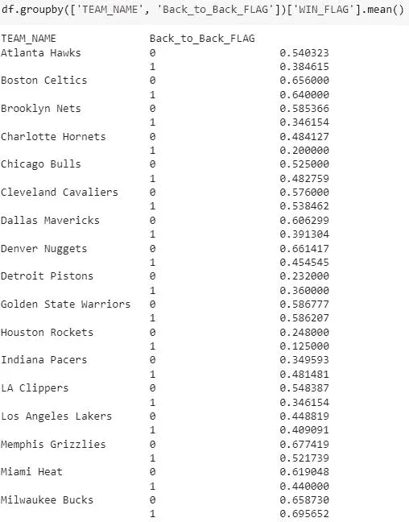

# 使用 PySpark 的 NBA 分析

> 原文：[`towardsdatascience.com/nba-analytics-using-pyspark-a1699ae1117a`](https://towardsdatascience.com/nba-analytics-using-pyspark-a1699ae1117a)

## 背靠背比赛的胜率、比赛得分的均值和标准差，以及更多的 Python 代码

[](https://jin-cui.medium.com/?source=post_page-----a1699ae1117a--------------------------------)[](https://towardsdatascience.com/?source=post_page-----a1699ae1117a--------------------------------) [Jin Cui](https://jin-cui.medium.com/?source=post_page-----a1699ae1117a--------------------------------)

·发表于 [Towards Data Science](https://towardsdatascience.com/?source=post_page-----a1699ae1117a--------------------------------) ·7 min read·2023 年 4 月 14 日

--


图片由 [Emanuel Ekström](https://unsplash.com/@emanuelekstrom?utm_source=medium&utm_medium=referral) 提供，来源于 [Unsplash](https://unsplash.com/?utm_source=medium&utm_medium=referral)

# 动机

一周多前，我观看了一场 NBA 比赛，密尔沃基雄鹿对阵波士顿凯尔特人。这是联赛前两名球队的对决，许多人认为这场比赛是东部决赛的前奏。作为一个篮球和 NBA 的狂热粉丝，这场比赛令人相当失望，因为密尔沃基雄鹿以 99–140 输给了波士顿凯尔特人，这是密尔沃基在 2022–2023 赛季中为数不多的惨败之一，而密尔沃基在常规赛中持有最佳战绩。

尽管这对于密尔沃基来说显得有些不寻常，尤其是考虑到这是在主场的惨败，但比赛的评论员提醒我他们实际上是在打背靠背比赛，即在前一天比赛之后进行的比赛（在这种情况下，是前一天在印第安纳的客场比赛）。换句话说，疲劳可能在他们的失利中发挥了作用，因为背靠背比赛对运动员身体要求很高，加上比赛间的旅行（从印第安纳回到密尔沃基）可能加剧了这一点。

查看球队赛程，在一个赛季的 80 多场比赛中，NBA 球队确实会进行多场背靠背比赛。你是否曾经好奇这些比赛中球队的表现如何，以及当球队在客场或主场比赛时这种情况是否有所变化？本文展示了使用 [PySpark](https://spark.apache.org/docs/latest/api/python/) — 一个即用型的 Python Apache Spark 接口 — 来获取这些通常在公共领域中不可用的统计数据的一种方法。

# 数据

为了确定背靠背比赛的胜率，我们需要每支 NBA 球队背靠背比赛的历史记录及其结果。虽然这些统计数据可以在官方 NBA 网站和其他社区网站上找到，但它们不允许商业使用，因此我模拟了一个包含以下字段的合成数据集。

+   比赛进行的日期

+   主队名称

+   客队名称，以及

+   比赛分数，以及主客队的相应结果

下表显示了合成数据集的一个片段。你应该能够通过官方 NBA 比赛时间表核实这些并不是实际的比赛。


表 1：合成比赛数据。作者提供的表格。

# 数据转换

本节提供了一个逐步的 Python 指南，讲解如何将上述数据集转换为识别某场比赛是否为背靠背比赛的数据集，并随后计算每支球队这些比赛的胜率。

**步骤 1：加载包和数据**

```py
#Load required Python packages

import numpy as np 
import pandas as pd 

!pip install pyspark #Install PySpark
import pyspark
from pyspark.sql.window import Window  #For use of Window Function
from pyspark.sql import functions as F #For use of Window Function
from pyspark.sql import SparkSession   #For initiating PySpark API in Python
```

```py
#Read in game.csv

path_games = "/directory/game_synthetic.csv"  #Replace with your own directory and data
data_raw_games = pd.read_csv(path_games, encoding = 'ISO-8859-1')
```

**步骤 2：格式化并创建日期列**

```py
#Format the 'game_date' column (if it was defaulted to string at ingestion)
#into Date format

data_raw_games['GAME_DATE'] = pd.to_datetime(data_raw_games['game_date'], \
                              format='%Y-%m-%d')
```

```py
#Create a 'GAME_DATE_minus_ONE' column for each row

data_raw_games['GAME_DATE_minus_ONE'] = pd.DatetimeIndex(data_raw_games['GAME_DATE']) \
                              + pd.DateOffset(-1)
```

上述创建的‘GAME_DATE_minus_ONE’列表示数据集中每场比赛的前一个日历日期。这将在稍后（**步骤 4**）详细讨论，并用于识别是否为背靠背比赛。

**步骤 3：按队伍分割数据集**

由于数据集的每一行都处于比赛级别（即显示两队之间的比赛结果），因此需要进行分割以在队伍级别上表示结果（即将每一行分割为两个，表示每队的比赛结果）。可以使用下面的 Python 代码实现这一点。

```py
#Create two dataframes, one for results of home teams and 
#one for results of away teams, and merge at the end

data_games_frame_1 = data_raw_games.sort_values(['game_id'])
data_games_frame_2 = data_raw_games.sort_values(['game_id'])

data_games_frame_1['TEAM_ID'] = data_games_frame_1['team_id_home']
data_games_frame_2['TEAM_ID'] = data_games_frame_2['team_id_away']

data_games_frame_1['WIN_FLAG'] = (data_games_frame_1['win_loss_home'] == 'W')
data_games_frame_2['WIN_FLAG'] = (data_games_frame_1['win_loss_home'] != 'W')

data_games_frame_1['TEAM_NAME'] = data_games_frame_1['team_name_home']
data_games_frame_2['TEAM_NAME'] = data_games_frame_2['team_name_away']

data_games_frame_1['TEAM_NAME_OPP'] = data_games_frame_1['team_name_away']
data_games_frame_2['TEAM_NAME_OPP'] = data_games_frame_2['team_name_home']

data_games_frame_1['HOME_FLAG'] = 'Home'
data_games_frame_2['HOME_FLAG'] = 'Away'

#Merge the two dataframes above
data_games = pd.concat([data_games_frame_1, data_games_frame_2], axis = 0).drop(['team_id_home', 'team_id_away'], axis = 1)\
                              .sort_values(['game_id']).reset_index(drop = True)
```

**步骤 4：返回每场比赛的日期，标记出该队上一次比赛的日期**

这时，PySpark 就显得特别有用。特别是，我们将利用 PySpark 中窗口函数下的*lag*函数。实际上，如下面的 **表 2** 所示，*lag*函数提供了对所选列的偏移值的访问。在这种情况下，它返回亚特兰大老鹰队相对于当前比赛的上一场比赛的日期，通过一个**窗口**，该窗口显示了亚特兰大老鹰队所有的比赛记录。

例如，在索引 1 的行中，亚特兰大老鹰队在 23/10/2021 与克利夫兰骑士队进行了比赛（“当前比赛”），如‘GAME_DATE’列所示，其上一场比赛是在 21/10/2021 对阵达拉斯小牛队，如‘GAME_DATE’列所示，该数据通过*lag*函数在当前比赛所在的行中返回，显示在“GAME_DATE_PREV_GAME”列。


表 2：*lag*函数演示。作者提供的表格

上面返回的‘GAME_DATE_PREV_GAME’列，当其等于在**步骤 2**中创建的‘GAME_DATE_minus_ONE’列时，表示这是一场连续比赛（即上场比赛的日期等于当前比赛的前一个日历日）。这在表 1 中索引 8（和 14）的行中是这样的，因为亚特兰大老鹰队在 2021 年 4 月 11 日对阵犹他爵士队——在 2021 年 3 月 11 日对布鲁克林篮网队之后的一天。

返回‘GAME_DATE_PREV_GAME’列以及标记所有球队的连续比赛的 Python 代码如下所示。

```py
#Select relevant columns from the dataset

col_spark = [

               'GAME_DATE'
              ,'GAME_DATE_minus_ONE'
              ,'TEAM_ID'
              ,'TEAM_NAME'
              ,'TEAM_NAME_OPP'
              ,'HOME_FLAG'
              ,'WIN_FLAG'
              ,'SCORE'
              ,'season_id'             

              ]

df_spark_feed = data_games[col_spark]
```

```py
#Initiate PySpark session

spark_1= SparkSession.builder.appName('app_1').getOrCreate()
df_1 = spark_1.createDataFrame(df_spark_feed)

#Create window by each team
Window_Team_by_Date = Window.partitionBy("TEAM_ID").orderBy("GAME_DATE")

#Return date of previous game using the lag function
df_spark = df_1.withColumn("GAME_DATE_PREV_GAME", F.lag("GAME_DATE", 1).over(Window_Team_by_Date)) \
#Flag back-to-back games using a when statement  
               .withColumn("Back_to_Back_FLAG", F.when(F.col("GAME_DATE_minus_ONE") == F.col("GAME_DATE_PREV_GAME"), 1) \
               .otherwise(0)) 

#Convert Spark dataframe to Pandas dataframe
df = df_spark.toPandas()
```

**步骤 5：计算连续比赛的胜率**

```py
#Select relevant columns

col = [
         'TEAM_NAME'
        ,'TEAM_NAME_OPP'
        ,'GAME_DATE'
        ,'HOME_FLAG'
        ,'WIN_FLAG'

      ]

#Filter for back-to-back games
df_b2b_interim = df[df['Back_to_Back_FLAG'] == 1]

#Show selected columns only
df_b2b = df_b2b_interim[col].sort_values(['TEAM_NAME', 'GAME_DATE']).reset_index(drop = True)
```

**各队连续比赛的胜率是多少？**


表 3：按球队的连续比赛胜率。表格由作者提供

基于合成数据集，似乎连续比赛的胜率因球队而异。休斯顿火箭队在连续比赛中的胜率最低（12.5%），其次是奥兰多魔术队（14.8%）。

**连续比赛是在客场还是主场进行的重要吗？**


表 4：按球队和主客场的连续比赛胜率。表格由作者提供

基于合成数据集，似乎在**表 4**中的大多数球队，球队在主场赢得连续比赛的可能性更大，而不是在客场（这是一个合理的观察）。布鲁克林篮网队、芝加哥公牛队和底特律活塞队是这一观察结果的少数例外。

其他拆分也可以计算，例如使用下面的 Python 代码计算连续比赛与非连续比赛的胜率。输出的片段表明，球队更有可能赢得非连续比赛（这仍然是一个合理的观察，尽管有一些例外）。



表 5：连续比赛与其他比赛的胜率。表格由作者提供

# 其他统计

在**步骤 4**中使用的 PySpark 会话及相关窗口函数可以进一步自定义，以返回其他比赛统计数据。

例如，如果我们想按赛季查询胜率（无论是连续比赛还是非连续比赛），只需按球队和赛季 ID 引入一个窗口，并像下面这样对其进行分区。

```py
#Create window by season ID

Window_Team_by_Season = Window.partitionBy("TEAM_ID").orderBy("season_id")
```

此外，我们都知道 NBA 比赛的得分波动性很大，但究竟有多大？这可以通过得分的标准差来衡量，而这在公共领域中可能不可用。我们可以通过引入数据集中可用的得分，并应用 *avg* 和 *stddev* 窗口函数来轻松校准，这将返回预定义窗口上的标准差。

举例来说，如果 NBA 比赛的标准差约为 20 分，那么有 70% 的概率得分会在 NBA 比赛平均得分线的 +/- 20 分以内（假设正态分布）。

返回该统计数据的示例 Python 代码如下所示。

```py
 spark_1= SparkSession.builder.appName('app_1').getOrCreate()
df_1 = spark_1.createDataFrame(df_spark_feed)

Window_Team = Window.partitionBy("TEAM_ID").orderBy("HOME_FLAG")
df_spark = df_1.withColumn("SCORE_AVG", F.avg("SCORE").over(Window_Team)) \
               .withColumn("SCORE_STD", F.stddev("SCORE").over(Window_Team))

df = df_spark.toPandas()
df.groupby(['TEAM_NAME', 'HOME_FLAG'])["SCORE_AVG", "SCORE_STD"].mean()
```

*当我乘风破浪于 AI/ML 领域时，我喜欢以通俗易懂的语言编写和分享逐步指导和操作教程，并附有可运行的代码。如果你想访问我所有的文章（以及来自其他实践者/作者在 Medium 上的文章），你可以通过* [*这个链接*](https://medium.com/@jin-cui/membership) *进行注册！*
