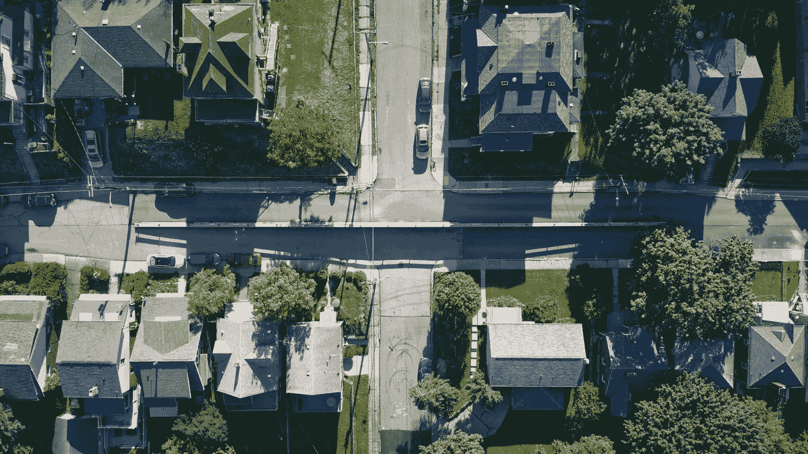

# 最近邻回归器 — 可视化指南

> 原文：[`towardsdatascience.com/nearest-neighbors-regressors-a-visual-guide-78595b78072e`](https://towardsdatascience.com/nearest-neighbors-regressors-a-visual-guide-78595b78072e)

## 模型的视觉理解及超参数的影响

 [Angela 和 Kezhan Shi](https://medium.com/@angela.shi?source=post_page-----78595b78072e--------------------------------)

·发布于 [Towards Data Science](https://towardsdatascience.com/?source=post_page-----78595b78072e--------------------------------) ·阅读时间 8 分钟·2023 年 3 月 31 日

--

K 最近邻（KNN）是机器学习中最简单的模型之一。实际上，在某种程度上，它没有模型，因为对于新观测的预测，它将使用整个训练数据集来根据距离（通常是欧几里得距离）找到“最近邻居”。然后在回归任务中，预测值是通过对这些邻居的目标变量值取平均来计算的。

由于我们使用的是距离的概念，所以应该只使用数值特征。当然，你可以通过独热编码或标签编码转换分类特征，距离计算算法仍然可以工作，但距离可能会变得没有意义。

还值得注意的是，目标变量的值并未用于寻找邻居。

在本文中，我们将使用一些简单的数据集来可视化 KNN 回归器的工作原理，以及超参数 k 如何影响预测。我们还将讨论特征缩放的影响。我们还将探索一个较少为人知的邻近版本，即半径最近邻。最后，我们将讨论更自定义的距离版本。

# 一个连续特征

我们将使用一个具有非线性行为的简单数据集，因为我们知道 KNN 能够处理这种情况。

最近邻回归器数据集 — 作者提供的图片

对于那些读过我关于 决策树回归器 可视化文章的人，你可以注意到这就是相同的数据。我们将与决策树回归器模型进行快速比较。

我们可以创建并拟合一个 KNeighborsRegressor 模型，使用 KNeighborsRegressor(n_neighbors = 3)，然后用 model.fit(X, y) 来“拟合”模型。

为了使所有模型的拟合过程相同，你可以注意到模型是通过经典的拟合方法“拟合”的。但对于 KNeighborsRegressor，拟合过程仅仅是保存数据集 X 和 y，没有其他内容。是的，这是最快的拟合！模型也是最大的一次！

现在，我们可以测试一个观测值的“模型”。在以下代码中，我们将使用一个单点。经典预测方法是计算预测值，而 kneighbors 方法允许我们获取邻居。

然后我们可以绘制邻居。我将展示 x = 10 和 x = 20 的图形。请随意进行更多测试。

最近邻回归器与 kneighbors — 图片作者

现在，我们也可以使用一系列 x 值来获取所有预测结果。

这里是前述代码生成的结果图。对于红色段上的每一个点，y 值代表 k 个最近邻的平均值（这里 k = 3）

带预测的最近邻回归器 — 图片作者

现在，让我们为不同的 k 值创建模型预测。

不同 k 值下的最近邻回归器 — 图片作者

我们还可以与决策树回归模型进行比较

最近邻回归器与决策树回归器 — 图片作者

我们可以注意到，对于决策树回归器，边界总是干净利落的，而对于 k 最近邻回归器，边界则更加细腻。

# 两个连续特征

我们将使用以下数据集，具有两个连续特征，来创建一个 KNN 模型。对于测试数据集，我们将使用 meshgrid 生成网格。

然后我们可以使用 plotly 创建交互式 3D 图。在下图中，我们可以看到不同 k 值的 3D 图。

带有两个特征的最近邻回归器 — 图片作者

在这里，我们可以再次与决策树回归模型进行比较。我们可以*看*到并*感受到*这两个模型的行为差异。

最近邻回归器与决策树回归器 — 图片作者

# 缩放的影响

与决策树不同，特征的缩放对模型有直接影响。

例如，对于两个特征的情况，我们可以进行以下变换。值得注意的是，对于一个连续特征，缩放没有影响，因为相对距离没有变化。

不同特征尺度下的最近邻回归器 — 图片作者

我们可以直观地得出这两组模型非常不同。我们可以计算通常的模型性能来比较它们。但在这里，我的方法确实是通过视觉上展示模型如何表现不同。你能感受到吗？距离发生了变化，因为特征的尺度发生了变化。最终，邻居也发生了变化。

有人可能会说我们应该使用标准化或最小-最大缩放。但你可以看到，上面的图像中，某些情况可能是标准化（或最小-最大缩放）数据集。而你无法事先判断标准化是否有助于模型性能的提升。

实际上，为了考虑每个特征在距离计算中的相对重要性，我们应该为不同的特征赋予不同的权重。但这会使调优过程变得过于复杂。

想象一下在线性回归模型中，关键是为每个特征找到系数。在 k NN 的距离计算中，所有特征被视为同等重要。从直觉上讲，我们可以感受到这个 kNN 模型的表现不会太好！

# 半径邻居

在 scikit-learn 的 `[neighbors](https://scikit-learn.org/stable/modules/classes.html#module-sklearn.neighbors)` 模块中，有一个鲜为人知的模型叫做 RadiusNeighborsRegressor，你可以从它的名字轻易理解到，与 K 近邻模型不同，我们使用一个固定半径的圆圈来围绕新的观察点找到它的邻居。

现在，何时半径邻居模型可能会更有趣？让我们以一个包含异常值的数据集为例。我们可以看到这两种模型的表现不同。由于这个异常值“远”离其他点，在 KNN 的情况下，邻居数量是固定的，因此邻居之间也相距较远。但对于半径邻居，异常值的影响更为重要。

最近邻回归器 KNN vs. 半径 NN — 图片由作者提供

在这里请注意，当我使用“异常值”一词时，并不一定意味着我们应该去除这个异常值。我只是想展示一些数据点远离其他点的情况。

影响对于非异常值也同样显著。因为我们无法满足这两种情况。

当半径过小时，你可能会注意到上图中有些奇怪的现象。是的，在这种情况下，对于某些点，没有邻居。然后，分配了一个巨大的负值。事实上，在这种情况下没有解决方案。但我仍然认为这是一个应该在 scikit-learn 中纠正的错误。产生错误总比默认给出这个值要好。

在完成半径邻居之前，什么时候它会真正有趣？想象一下，当你在城市的一个区域有大量数据，而在附近的另一个区域数据较少，但你知道你本可以收集更多数据。此时半径邻居可能更相关。

类似地，如果你为一个区域有一个值（将分配给该区域的所有地址），那么我们可以使用邻居来平滑该值。这里再次，半径邻居将更相关。下面是使用最近邻模型进行值平滑的示例。

地理邻居平滑 — 作者图像

# 关于距离的更多信息

关于距离的最后一个有趣讨论，你可能在可视化前述制图时已经考虑过。距离的概念可能非常具体，因为如果你用经纬度计算欧几里得距离，那么这种距离可能无法正确反映地理邻域（这是你可能希望使用的距离）。

你可能已经知道，但看到总是更好。从下面的图像中，红色圆圈是中央位置的“真实圆”，由与中央位置具有相等地理距离的位置形成的红色区域。蓝色“圆圈”是通过计算经纬度的欧几里得距离得到的。在赤道附近，这两个圆圈几乎相同。但在远离赤道的地方，它们会有很大不同。因此，下次你在数据集中使用经纬度并使用最近邻模型时，你必须考虑这一点。

地球上的真实圆形与经纬度的“圆形” — 作者图像

现在，你可以想象在其他情况下，更自定义的距离可能是必要的。因此，这种简单模型可能会变得更高效。

邻居的加权也是可能的。你可以使用**weights**参数来实现。以下是来自官方文档对该参数的描述：

> **weights :** *{‘uniform’, ‘distance’}, callable 或 None, 默认=‘uniform’*
> 
> 预测中使用的权重函数。可能的值：
> 
> - ‘uniform’ : 均匀权重。每个邻域中的所有点都被赋予相等的权重。
> 
> - ‘distance’ : 通过距离的倒数来加权点。在这种情况下，查询点的较近邻居将比较远的邻居具有更大的影响。
> 
> - [callable] : 用户定义的函数，该函数接受一个距离数组，并返回一个包含相同形状的权重数组。
> 
> 默认使用均匀权重。

K 最近邻回归器，权重 = “distance” — 作者图像

然而，距离设计可能变得非常复杂，这时采用其他方法如决策树和基于数学函数的模型可能更为简单。

# 结论

我正在撰写一系列类似的文章，演示如何通过可视化帮助我们更好地理解机器学习模型的工作原理而无需数学。请通过下面的链接关注我，获取我文章的全部访问权限：[`medium.com/@angela.shi/membership`](https://medium.com/@angela.shi/membership)

如果你想获取生成本文图形的代码，你可以在这里支持我：[`ko-fi.com/s/4cc6555852`](https://ko-fi.com/s/4cc6555852)

因此，在本文中，我们展示了最近邻“模型”对于简单数据集来说，借助可视化是相当直观的，因为邻居的概念是直观且简单的。

超参数 K 或半径的选择对最近邻模型的性能有重要影响。如果 K（或半径）太小，模型可能会过拟合数据中的噪声；而如果 K（或半径）太大，模型可能会欠拟合，无法捕捉数据中的潜在模式。

当使用最近邻模型时，数据的缩放也很重要，因为该算法对输入特征的缩放非常敏感。
