# 嵌套字典 Python——Python 嵌套字典的完整指南

> 原文：[`towardsdatascience.com/nested-dictionary-python-a-complete-guide-to-python-nested-dictionaries-756a7822cb4f`](https://towardsdatascience.com/nested-dictionary-python-a-complete-guide-to-python-nested-dictionaries-756a7822cb4f)

## 如何在 Python 中使用嵌套字典？本文将教你关于 Python 嵌套字典的一切知识。

[](https://medium.com/@radecicdario?source=post_page-----756a7822cb4f--------------------------------)[](https://towardsdatascience.com/?source=post_page-----756a7822cb4f--------------------------------) [达里奥·拉德奇](https://medium.com/@radecicdario?source=post_page-----756a7822cb4f--------------------------------)

·发表于[数据科学的前沿](https://towardsdatascience.com/?source=post_page-----756a7822cb4f--------------------------------) ·12 分钟阅读·2023 年 4 月 18 日

--


图片由[凯利·西克马](https://unsplash.com/@kellysikkema?utm_source=medium&utm_medium=referral)提供，来源于[Unsplash](https://unsplash.com/?utm_source=medium&utm_medium=referral)

# 什么是 Python 中的嵌套字典？

Python 中一种常见的数据结构是嵌套字典，或者说字典的值可以是其他字典。初学者不喜欢嵌套字典，因为它们需要更多的时间来处理和正确解析，但只要稍加练习，你就能掌握它。

> [*刚接触 Python？首先学习基础字典。*](https://betterdatascience.com/python-dictionaries/)

今天你将学习什么是嵌套字典，为什么在 Python 中使用嵌套字典，如何在 Python 中遍历嵌套字典，等等。关于库的导入，将其放在你的脚本或笔记本的顶部：

```py
import pprint
pp = pprint.PrettyPrinter(depth=4)
```

它将在打印嵌套字典时处理格式，使其更易于阅读。

# 如何在 Python 中创建嵌套字典

有许多方法可以创建嵌套字典，但如果你从头开始在 Python 中创建它们，你主要会使用两种方法。

## 使用常规 Python 符号

创建嵌套 Python 字典的第一种方法是利用常规 Python 符号。这意味着你不需要使用任何特定的函数或库来创建字典。只需将其分配给一个变量名，并将整个内容格式化为 JSON。

这是一个示例——以下代码片段创建了一个员工的嵌套字典，其中员工的电子邮件被用作字典的键，附加信息作为字典值。正如你所看到的，字典值本身也是一个字典：

```py
employees = {
    "bdoe@email.com": {
        "first_name": "Bob", 
        "last_name": "Doe",
        "address": {
            "city": "New York",
            "street": "1st Street",
            "house_number": 1
        }
    },
    "mmarkson@email.com": {
        "first_name": "Mark", 
        "last_name": "Markson",
        "address": {
            "city": "San Diego",
            "street": "2nd Street",
            "house_number": 2
        }
    }
}

pp.pprint(employees)
```

这就是这个嵌套字典的样子：

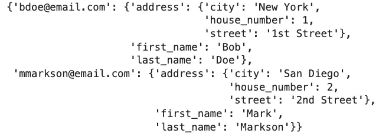

*图像 1 — 员工的嵌套字典（作者提供的图像）*

总体而言，我们有一个包含两个键（电子邮件）的字典。每个键都有一个字典作为值，甚至还有一个第三个字典分配给`address`键。

**字典是无序的**，所以你看到的数据没有反映代码中指定的排序。对此不必担心。

## 使用 zip() 函数

在 Python 中创建嵌套字典的另一种方法是使用`zip()`函数。它用于同时迭代两个或多个迭代器。

为了演示，我们将声明两个列表：

+   `employee_emails` - 一个电子邮件列表，将作为字典的键

+   `employee_details` - 每个员工的详细信息列表，如名字、姓氏和地址。

如果你以这种方式声明数据，你可以将它们传递给`zip()`并将所有内容包装在`dict()`调用中。这将分配适当的键值对。代码如下：

```py
employee_emails = ["bdoe@email.com", "mmarkson@email.com"]

employee_details = [
    {
        "first_name": "Bob", 
        "last_name": "Doe", 
        "address": {
            "city": "New York", 
            "street": "1st Street", 
            "house_number": 1
        }
    },
    {
        "first_name": "Mark", 
        "last_name": "Markson", 
        "address": {
            "city": "San Diego", 
            "street": "2nd Street", 
            "house_number": 2
        }
    }
]

employees = dict(zip(employee_emails, employee_details))
pp.pprint(employees)
```

结果数据看起来与之前的一样：


*图像 2 — 员工的嵌套字典（2）（作者提供的图像）*

实际上，没有理由使用这种方法来声明嵌套字典。这很混乱，编写起来也更费时间。只需坚持使用第一个方法，你就可以了。

接下来，让我们看看如何在 Python 中访问嵌套字典的元素。

# 如何访问嵌套字典的元素

你可以像访问普通字典一样访问嵌套字典的元素，唯一的例外是**你现在需要添加额外的一组括号。**

下面是你可以做的一些示例：

+   访问单个元素

+   访问一个也作为字典的单个元素

+   连接多个嵌套字典值

或者在代码中：

```py
# Access element that contains a string
print(employees["bdoe@email.com"]["first_name"])

# Access element that contains a string
print(employees["bdoe@email.com"]["last_name"])

# Access element that contains a dictionary
print(employees["bdoe@email.com"]["address"])

# Combine multiple elements
print(f"{employees['bdoe@email.com']['first_name']} {employees['bdoe@email.com']['last_name']} from {employees['bdoe@email.com']['address']['city']}")
```

这是你应该看到的输出：

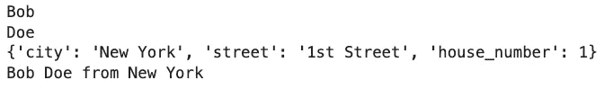

*图像 3 — 访问嵌套 Python 字典的元素（作者提供的图像）*

总的来说，如果你想到达嵌套字典的最底层，你需要与嵌套字典的层级数相同的括号。例如，要获取`bdoe@email.com`的城市，你需要写`employees["bdoe@email.com"]["address"]["email"]`。很简单！

# 如何更改嵌套字典中的值

你现在知道如何访问嵌套字典中的元素，但如何更改这些值呢？这非常简单，你可以逐个更改值，也可以一次处理多个值。

## 更改嵌套字典中的单个值

你可以通过访问嵌套字典并分配一个新值来更改单个值。

以下示例展示了如何一次更改一个员工的完整`address`：

```py
# Change values one by one
employees["bdoe@email.com"]["address"]["city"] = "San Francisco"
employees["bdoe@email.com"]["address"]["street"] = "5th Street"
employees["bdoe@email.com"]["address"]["house_number"] = 5

pp.pprint(employees["bdoe@email.com"])
```

更新后的员工数据现在如下所示：

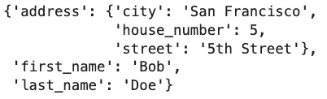

*图像 4 — 更改嵌套字典中的单个值（作者提供的图像）*

很好，但你能在一行中更改 `address` 吗？当然可以，接下来我们将探讨如何实现。

## 在嵌套字典中更改多个值

`address` 属性本身就是一个字典，这意味着你可以在一行 Python 代码中完全更改它：

```py
# Change multiple values at once
employees["mmarkson@email.com"]["address"] = {"city": "Los Angeles", "street": "15th Street", "house_number": 15}

pp.pprint(employees["mmarkson@email.com"])
```

更新后的员工记录如下：

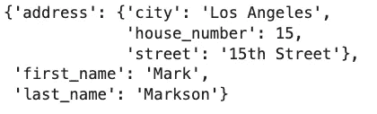

*图 5 — 更改嵌套字典中的多个值（图片作者提供）*

你现在知道如何访问和更改嵌套字典元素了，接下来我们将讨论如何在 Python 中向嵌套字典中添加新元素。

# 如何向嵌套字典中添加元素

在 Python 中向嵌套字典中添加新元素就是赋值一个新的键值对。就是这么简单！

以下代码片段声明了两个变量来存储新的嵌套字典项的键和值，然后使用 `dictionary[key] = value` 赋值运算符添加这个键值对：

```py
new_employee_email = "jswift@email.com"
new_employee_details = {
    "first_name": "Jane", 
    "last_name": "Swift", 
    "address": {
        "city": "Boston", 
        "street": "10th Street", 
        "house_number": 10
    }
}

# dictionary[key] = value
employees[new_employee_email] = new_employee_details

pp.pprint(employees)
```

更新后的嵌套字典现在有 3 个记录：

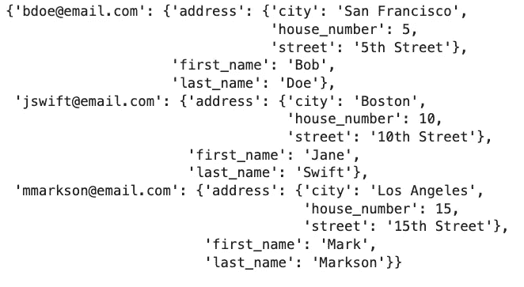

*图 6 — 在 Python 中向嵌套字典中添加元素（图片作者提供）*

那是添加操作，所以接下来我们来讨论删除操作。

# 如何从嵌套字典中删除元素

你可以使用 Python 的 `del` 关键字，后跟字典的名称和你想删除的键。例如，运行 `del d["name"]` 来删除字典 `d` 中键为 `name` 的键值对。

在我们的示例中，让我们使用 `del` 删除刚刚添加的员工：

```py
del employees["jswift@email.com"]

pp.pprint(employees)
```

现在我们只剩下两个记录了：

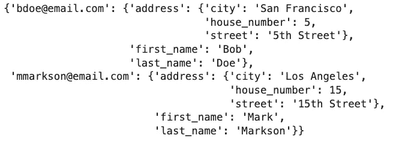

*图 7 — 从嵌套字典中删除元素（图片作者提供）*

接下来，让我们讨论如何合并两个或多个字典。

# 如何合并两个嵌套字典

字典合并就是将两个或多个字典合并成一个。字典的结构相同会有所帮助，但不是必须的，因为这是 Python。

为了演示，我们来声明一个新的嵌套字典的员工记录：

```py
new_employees = {
    "jswift@email.com": {
        "first_name": "Jane", 
        "last_name": "Swift",
        "address": {
            "city": "Boston",
            "street": "25th Street",
            "house_number": 25
        }
    },
    "pjohnson@email.com": {
        "first_name": "Patrick", 
        "last_name": "Johnson",
        "address": {
            "city": "Miami",
            "street": "50th Street",
            "house_number": 50
        }
    }
}

pp.pprint(new_employees)
```

这就是它的样子：

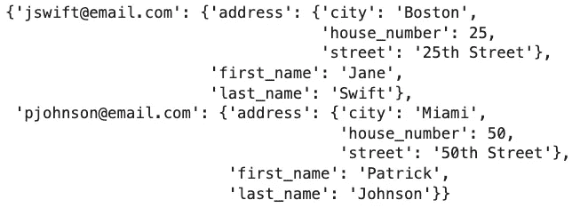

*图 8 — 两名新员工（图片作者提供）*

这个想法是将这个字典添加到我们已有的字典中，有两种方法可以实现。

## 使用 `update()` 函数合并两个字典

`update()` 函数 *更新* 一个字典的内容到另一个字典。更新是就地进行的，这意味着你不需要重新赋值变量。

这是一个例子：

```py
employees.update(new_employees)

pp.pprint(employees)
```

更新后的嵌套字典现在有四个记录：

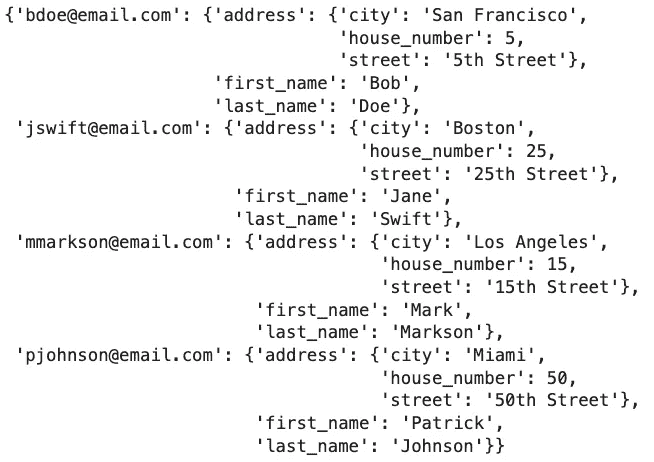

*图 9 — 合并嵌套字典（图片作者提供）*

这个函数很容易使用，但缺点是 **你一次只能添加一个字典**。下一种方法则更灵活一些。

## 使用 **kwargs** 合并两个字典

`**kwargs`方法对新手来说可能看起来很奇怪，但它本质上只是解包字典。通过这样做，你可以将尽可能多的字典解包到一个新的字典中。

这里是一个例子：

```py
emps_merged = {**employees, **new_employees}

pp.pprint(emps_merged)
```

合并后的嵌套字典与我们之前的字典完全相同：


*图 10 — 合并嵌套字典（2）（作者提供的图片）*

最终，决定最佳合并方法还是取决于你。我们推荐使用`**kwargs`，因为你可以在一行 Python 代码中合并数十个字典。

# 如何遍历嵌套字典

在 Python 中，处理嵌套字典时没有一种适用于所有情况的解决方案。字典项的结构会有所不同，这意味着你每次都需要定制代码。

为了演示，我们将介绍两个例子，一个较简单，另一个代码稍复杂一些。

第一个例子遍历所有字典项并打印键，然后也遍历相应的值并打印它。以下是代码：

```py
# Keys and values
for emp_email, emp_info in employees.items():
    print(f"EMAIL: {emp_email}")

    # For each key that belongs to a dictionary at the given email
    for key in emp_info:
        # Print the corresponding key and value
        print(f"{key} = {emp_info[key]}")

    print()
```

你应该看到如下结果：

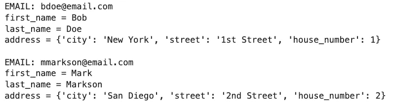

*图 11 — 遍历嵌套字典（作者提供的图片）*

如果你没有额外的嵌套层级，类似于我们所拥有的`address`，这种方法可能有效。*处理*这个问题会更加具有挑战性，但接下来我们可以尝试一下。

## 更高级的迭代示例

现在的想法是进入`address`字典，并打印它包含的所有元素。

为了让代码更健壮一点，我们将检查项目是否为字典，如果是，则遍历其项。如果项目不是字典，我们将简单地打印它：

```py
# Keys and values
for emp_email, emp_info in employees.items():
    print(f"EMAIL: {emp_email}")

    # For every key in the inner dictionary
    for key in emp_info:

        # Check if a type is a dictionary
        if type(emp_info[key]) is dict:
            print(f"{key}:")

            # Print nested items
            for item in emp_info[key]:
                print(f"\t{item} = {emp_info[key][item]}")
        # Not a dictionary, print the value
        else:
            print(f"{key} = {emp_info[key]}")

    print()
```

你应该在屏幕上看到如下内容：

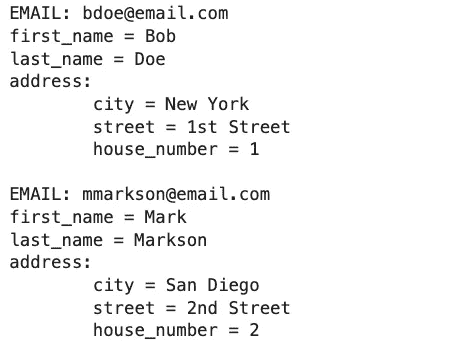

*图 12 — 遍历嵌套字典（2）（作者提供的图片）*

总体而言，我们已经成功解析了我们的嵌套字典结构，但再次强调，**这并不适用于所有嵌套字典**。你必须定制代码片段以适应你的用例，这可能会很棘手且耗时。

# 如何扁平化嵌套字典

扁平化嵌套字典意味着你希望获得一个不包含任何字典或列表的字典。

这是在将嵌套 JSON 文档解析为 Pandas DataFrame 时非常常见的数据预处理技术。如果你正在处理这样的数据，你会知道输入数据的结构会有很大不同。

大多数情况下，你会有一个**字典列表**。我们将在下方声明这样一个列表，并在每个员工对象内部添加`email`属性，而不是将其用作字典键：

```py
employees = [
    {
        "first_name": "Bob", 
        "last_name": "Doe",
        "email": "bdoe@email.com",
        "address": {
            "city": "New York",
            "street": "1st Street",
            "house_number": 1
        }
    },
    {
        "first_name": "Mark", 
        "last_name": "Markson",
        "email": "mmarkson@email.com",
        "address": {
            "city": "San Diego",
            "street": "2nd Street",
            "house_number": 2
        }
    }
]
```

一旦你拥有这样的数据格式，就该进行扁平化处理了。以下递归函数将一个记录或列表中的一个字典元素进行扁平化。对于任何嵌套字典，它会将其扁平化，使键重命名为完整的*路径*。

`flatten_dict()`函数必须应用于字典列表中的每一条记录，这意味着你可以使用 Python 循环或列表推导式。

这里有一个示例：

```py
def flatten_dict(d: dict) -> dict:
    out = {}

    def flatten(x, name: str = ''):
        if type(x) is dict:
            for a in x:
                flatten(x[a], name + a + '_')
        elif type(x) is list:
            i = 0
            for a in x:
                flatten(a, name + str(i) + '_')
                i += 1
        else:
            out[name[:-1]] = x
    flatten(d)

    return out

# Apply the function to each row
employees_flat = [flatten_dict(emp) for emp in employees]
pp.pprint(employees_flat)
```

我们现在有了一个完全扁平的结构：

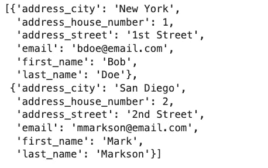

*图 13 — 展开嵌套字典 (作者提供的图片)*

请注意如何在其内部键值对之前添加了`address`，这样我们仍然能够理解它最初所属的位置。

现在，当你有了一个扁平化的字典列表时，你可以将其转换为 Pandas DataFrame。

# 嵌套字典 Python 转 Pandas DataFrame

如果你想将嵌套字典转换为 Pandas DataFrame，你必须先将其扁平化。否则，你会得到奇怪的索引，并且可能会得到单个单元格的字典作为值。

让我们首先展示一个不良的做法，以便你能理解为什么要扁平化数据。下面是与我们在文章中使用的员工字典相同的字典。然后我们在调用`pd.DataFrame()`时使用它：

```py
import pandas as pd

employees = {
    "bdoe@email.com": {
        "first_name": "Bob", 
        "last_name": "Doe",
        "address": {
            "city": "New York",
            "street": "1st Street",
            "house_number": 1
        }
    },
    "mmarkson@email.com": {
        "first_name": "Mark", 
        "last_name": "Markson",
        "address": {
            "city": "San Diego",
            "street": "2nd Street",
            "house_number": 2
        }
    }
}

pd.DataFrame(employees)
```

这就是结果 DataFrame 的样子：

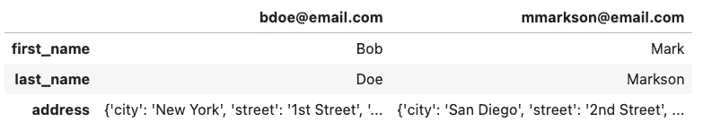

*图 14 — 嵌套字典转 Pandas DataFrame (作者提供的图片)*

糟糕且不可用。 **你需要将一个扁平化的字典列表传递给** `**pd.DataFrame()**` 以将数据恢复为适当的格式。

你已经知道如何展开嵌套字典了，所以这应该感觉像是轻松的散步：

```py
employees = [
    {
        "first_name": "Bob", 
        "last_name": "Doe",
        "email": "bdoe@email.com",
        "address": {
            "city": "New York",
            "street": "1st Street",
            "house_number": 1
        }
    },
    {
        "first_name": "Mark", 
        "last_name": "Markson",
        "email": "mmarkson@email.com",
        "address": {
            "city": "San Diego",
            "street": "2nd Street",
            "house_number": 2
        }
    }
]

# Flatten the records first
employees_flat = [flatten_dict(emp) for emp in employees]
pd.DataFrame(employees_flat)
```

现在，DataFrame 更容易理解和分析：

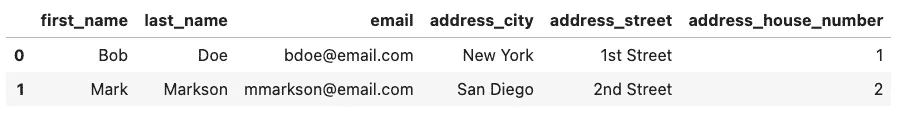

*图 15 — 嵌套字典转 Pandas DataFrame (2) (作者提供的图片)*

最后，让我们讲讲嵌套字典到 JSON 转换。

# 嵌套字典 Python 转 JSON 文件

JSON 和 Python 字典是相辅相成的，这意味着你可以轻松地在 JSON 文件和 Python 字典之间转换。

我们将展示如何将嵌套的 Python 字典转换为 JSON 文件。你需要导入`json`模块，并将字典传递给`json.dumps()`。可选的`indent`参数控制字典内部嵌套结构的缩进。

下面是代码：

```py
import json

employees = {
    "bdoe@email.com": {
        "first_name": "Bob", 
        "last_name": "Doe",
        "address": {
            "city": "New York",
            "street": "1st Street",
            "house_number": 1
        }
    },
    "mmarkson@email.com": {
        "first_name": "Mark", 
        "last_name": "Markson",
        "address": {
            "city": "San Diego",
            "street": "2nd Street",
            "house_number": 2
        }
    }
}

json_object = json.dumps(employees, indent=4) 
print(json_object)
```

这就是你的 JSON 对象应该呈现的样子：

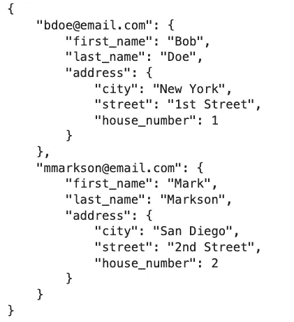

*图 16 — 嵌套字典转 JSON 对象 (作者提供的图片)*

你现在可以使用 Python 的上下文管理器语法将 JSON 对象写入文件。以下代码片段将其写入名为`employees.json`的文件：

```py
with open("employees.json", "w") as f:
    json.dump(employees, f)
```

你可以在任何文本编辑器或 JupyterLab 中打开 JSON 文件。你会看到类似下面的内容：

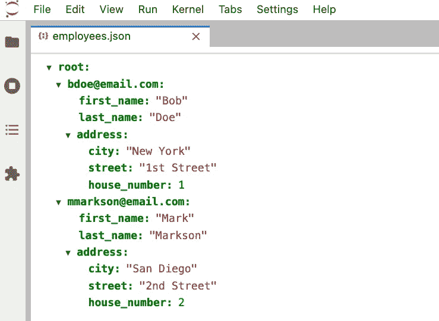

*图 17 — 嵌套字典转 JSON 文件 (作者提供的图片)*

这就是你可以在 Python 中处理嵌套字典的方法。接下来，让我们简短回顾一下。

# 总结嵌套字典 Python

在 Python 中处理嵌套字典涉及很多内容。你可以访问单个值、修改它们、添加新行、删除旧行、合并多个字典、遍历它们，甚至将整个内容转换为 Pandas DataFrame 或 JSON 文件。

不幸的是，处理嵌套字典并没有一刀切的解决方案。每个项目的结构会有所不同，这意味着你需要定制代码以适应你的场景。特别是在遍历嵌套字典时，这一点尤其重要。

本文应该为你提供一个良好的起点，并涵盖 95%的场景，你可以随时自行深入探讨。

*你对嵌套字典最喜欢的是什么？它们在日常数据科学任务中是否让你头疼？* 请在评论区告诉我。

*喜欢这篇文章？成为* [*Medium 会员*](https://medium.com/@radecicdario/membership) *，继续无限制地学习。如果你使用以下链接，我将获得你会员费用的一部分，而不会增加你的额外费用。*

[](https://medium.com/@radecicdario/membership?source=post_page-----756a7822cb4f--------------------------------) [## 使用我的推荐链接加入 Medium - Dario Radečić

### 阅读 Dario Radečić的每一个故事（以及 Medium 上成千上万其他作家的作品）。你的会员费用将直接支持…

medium.com](https://medium.com/@radecicdario/membership?source=post_page-----756a7822cb4f--------------------------------)

*最初发表于* [*https://betterdatascience.com*](https://betterdatascience.com/nested-dictionary-python/) *于 2023 年 4 月 18 日。*
