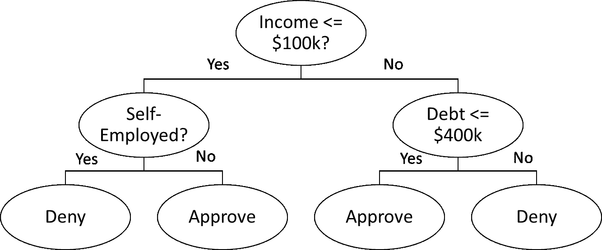
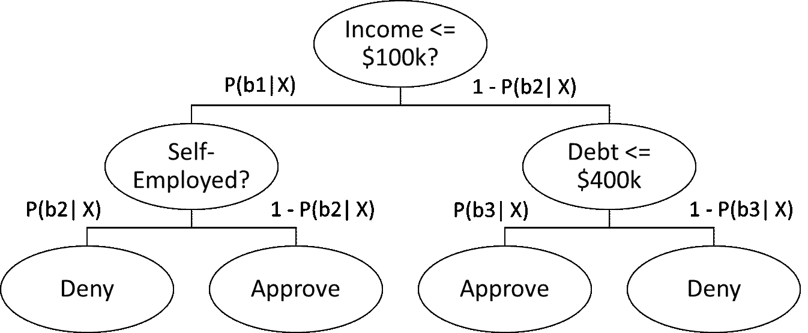
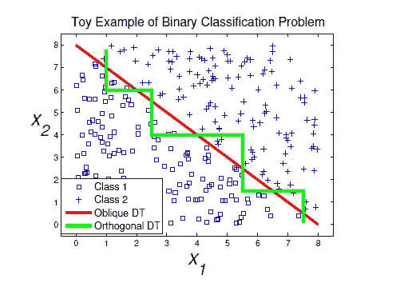
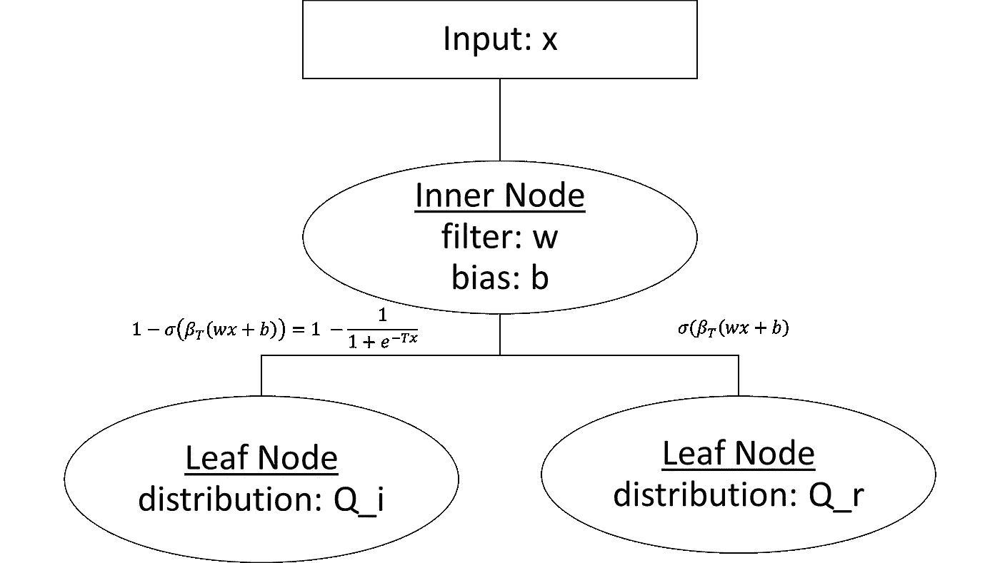
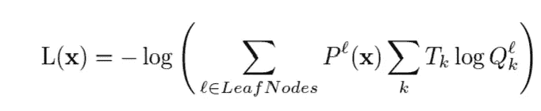
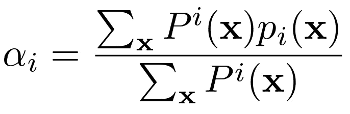
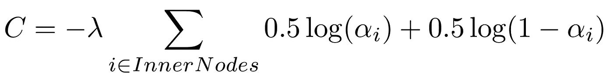
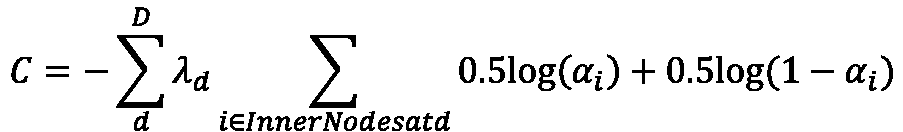
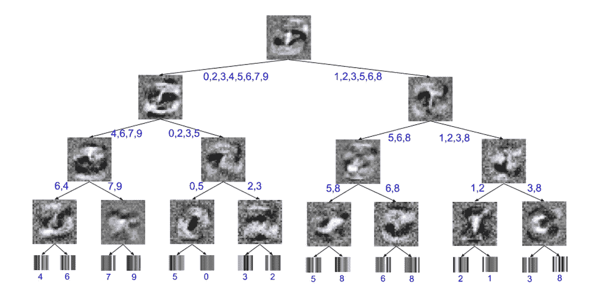
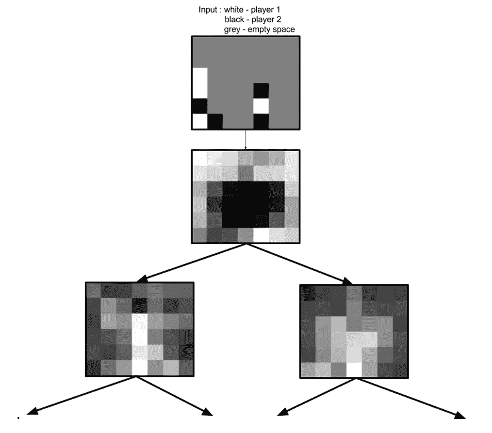

# 神经网络作为决策树

> 原文：[`towardsdatascience.com/neural-networks-as-decision-trees-89cd9fdcdf6a?source=collection_archive---------5-----------------------#2023-04-03`](https://towardsdatascience.com/neural-networks-as-decision-trees-89cd9fdcdf6a?source=collection_archive---------5-----------------------#2023-04-03)

图片由 [Jens Lelie](https://unsplash.com/@madebyjens?utm_source=medium&utm_medium=referral) 提供，来源于 [Unsplash](https://unsplash.com/?utm_source=medium&utm_medium=referral)

## 将神经网络的强大功能与决策树的可解释结构结合起来

 [Nakul Upadhya](https://medium.com/@upadhyan?source=post_page-----89cd9fdcdf6a--------------------------------)

·

[关注](https://medium.com/m/signin?actionUrl=https%3A%2F%2Fmedium.com%2F_%2Fsubscribe%2Fuser%2F4d9dddc62a80&operation=register&redirect=https%3A%2F%2Ftowardsdatascience.com%2Fneural-networks-as-decision-trees-89cd9fdcdf6a&user=Nakul+Upadhya&userId=4d9dddc62a80&source=post_page-4d9dddc62a80----89cd9fdcdf6a---------------------post_header-----------) 发布于 [数据科学之路](https://towardsdatascience.com/?source=post_page-----89cd9fdcdf6a--------------------------------) · 9 分钟阅读 · 2023 年 4 月 3 日

--

人工智能的近期繁荣清楚地展示了深度神经网络在各种任务中的强大能力，尤其是在数据维度高且与目标变量之间存在复杂非线性关系的分类问题领域。然而，解释任何神经分类器的决策是一个非常困难的问题。虽然许多后置方法如 DeepLift [2] 和 Layer-Wise Relevance Propagation [3] 可以帮助解释单个决策，但解释全局决策机制（即模型通常寻找的内容）则更加困难。

因此，许多高风险领域的从业者更倾向于选择更具可解释性的模型，如基本的决策树，因为决策层级可以被利益相关者清晰地可视化和理解。然而，基本的决策树往往不能提供足够的准确性，通常会使用集成方法如 Bagging 或 Boosting 来提高模型的性能。不过，这又牺牲了一些可解释性，因为要理解一个单一的决策，从业者需要查看数百棵树。然而，这些方法仍然比深度网络更受欢迎，因为至少特征重要性（无论是局部还是全局）可以被轻松提取和展示。

因此，目前的问题是我们想要神经网络的区分能力，但又希望具备决策树的可解释性。那么，为什么不把网络结构化成一棵树呢？这就是 Fross 和 Hinton（2017）在他们的论文“将神经网络提炼成软决策树”[1]中采用的主要方法。在这篇文章中，我将深入探讨神经决策树背后的关键机制，并解释这种方法的一些优点以及在实际应用中可能需要考虑的一些因素。虽然我们主要讨论分类树，但详细的方法也可以应用于回归树，只需进行一些相对较小的调整。

# 方法论

## 软决策树与硬决策树

在深入了解如何将神经网络构建成软决策树之前，让我们首先定义什么是软决策树。

当人们想到决策树（例如 sklearn 中实现的决策树）时，他们想到的是每个决策都是确定性的硬决策树。

硬决策树的示例（图片由作者提供）

如果满足某个条件，我们将走向左分支，否则我们走向右分支。每个叶子节点都有一个类别，通过简单地遍历树并选择我们最终到达的类别来进行预测。我们允许树生长得越大，可以采取的路径就越多，从而实现最终决策。

软决策树有许多相似之处，但工作方式略有不同

软决策树的示例（图片由作者提供）

在硬决策树中，每个分支是确定性的，而软决策树定义了在满足条件的情况下进入某个分支的概率。因此，虽然硬决策树输出一个单一值，**软决策树则输出所有可能类别的概率分布，其中类别的概率是我们通过到达叶子的概率的乘积。** 例如，上面树的批准概率等于 *P(b1|X)(1-P(b2|X)) + (1-P(b2|X))(P(b3|X))。* 分类决策就是选择具有最高概率的类别。

这种结构有许多优点。首先，非确定性决策使用户了解给定分类中的不确定性。此外，从技术上讲，硬树只是软树的特殊变体，其中所有分支概率都等于 1。

这些树的一个缺点是解释性略有下降。从利益相关者的角度来看，“我们批准了一个贷款，因为个人年收入为 $100k，债务少于 $400k”比起：

> 如果收入是 $110k，我们有 0.7 的概率向右分支；如果债务低于 400k，我们有 0.8 的概率批准，这样结果就是 0.56 的概率加上左分支中发生的情况。

这并不意味着这些树不可解释（因为仍然可以确切看到模型关注的内容），只是需要模型开发者提供更多的帮助。

## 倾斜决策树

在了解神经决策树之前，第二个需要掌握的概念是“倾斜”决策树的概念。

传统的决策树被认为是“正交”树，因为它们的决策是相对于给定的轴进行的。简单来说，每次决策中只使用一个变量。另一方面，倾斜树在决策过程中使用多个变量，通常是线性组合的形式。

倾斜决策边界的示例（图源：Zhang et. al 2017 [4]）

决策节点中的一些示例值可能是“收入 — 债务 > 0”。这可以导致更强的决策边界。一个缺点是，如果没有适当的正则化，这些边界可能会变得越来越复杂。

## 将它们结合起来

现在我们理解了软决策树和倾斜决策树，我们可以将它们结合起来理解神经公式。

第一个组成部分是决策节点。对于每个节点，我们需要基于输入值的一些概率。为了实现这一点，我们可以使用神经网络的基本工具：权重和激活。在每个决策节点中，我们首先对输入变量进行线性组合，然后对总和应用一个 sigmoid 函数，得到分支概率。

为了防止极软的决策（使决策树更像硬决策树），可以使用[温和的 sigmoid](https://ojs.aaai.org/index.php/AAAI/article/view/17123)（或在应用 sigmoid 之前对线性组合进行乘法运算）。

每个叶节点包含一个 N 维张量，其中 N 是类别的数量。这个张量表示样本属于某一类别的概率分布。

神经网络作为决策树（图像复制自 Frosst & Hinton 2017 [1]）

与软决策树一样，这棵神经树的输出是类别的概率分布。输出分布等于分布的总和乘以到达该分布的路径概率。

## 训练树

神经树的一个好处是可以通过像梯度下降这样的连续优化算法进行训练，而不是像普通决策树需要构建的贪婪算法。我们需要做的就是定义损失函数：

神经树的损失函数（图像来自 Frosst & Hinton 2017 [1]）

这棵树的损失函数类似于交叉熵损失。在这个方程中，*P^l(***x***)* 是在给定数据点 **x** 的情况下到达叶节点 *l* 的概率，*T_k* 是目标类别 *k* 的概率（1 或 0），而 Q_k^l 是叶节点 *l* 中与类别 *k* 对应的张量（概率分布）元素。

关于这一结构的一个重要说明是**树形结构是固定的**。与使用贪婪算法逐个拆分节点并生长树的普通决策树不同，使用这种软决策树时，我们首先设置树的大小，然后使用梯度下降同时更新所有参数。这种方法的一个好处是更容易在不损失太多判别能力的情况下约束树的大小。

在训练过程中可能遇到的一个潜在陷阱是模型可能过度偏向单个分支，而未能利用树的全部力量。为了避免陷入不良解决方案，建议在损失函数中引入惩罚，鼓励树同时利用左右子树。

惩罚是期望平均分布（左右树各 50/50）与实际平均分布（定义为 alpha）之间的交叉熵。

节点 i 的 alpha 定义（图像来自 Frosst & Hinton 2017 [1]）

在这个方程中，*P^i*(**x**) 是从根节点到节点 *i* 的路径概率。我们然后对所有内部节点的惩罚进行求和。

惩罚的定义（图像来自 Frosst & Hinton 2017 [1]）

在这个方程中，lambda 是一个超参数，决定了惩罚的强度。然而，这可能会导致一些问题，因为随着树的下降，数据分裂成 50/50 的机会减少，因此建议使用根据树的深度变化的自适应 lambda。这将修改惩罚为：

修改后的惩罚函数（图片由作者提供，摘自 Frosst & Hinton 2017 [1]）

当我们深入树中时，建议根据 2^-d 比例衰减 lambda。

## 结果可视化

虽然将神经网络重新表述为树形结构很有趣，但追求这种方法的主要原因是提供更多的模型可解释性。

首先看看经典问题的解释——MNIST 中的数字分类：

MNIST 示例（图片来自 Frosst & Hinton 2017 [1]）

在上图中，内部节点的图像是学习到的过滤器，叶节点的图像是学习到的类别概率分布的可视化。对于每个叶节点和节点，最可能的分类用蓝色标注。

从这棵树来看，我们可以看到一些有趣的特征。例如，如果我们查看最右边的内部节点，潜在的分类是 3 和 8。实际上，我们可以在决策节点可视化中看到 3 的轮廓。白色区域似乎表明模型寻找能够闭合 3 的内部循环的线条，从而将其转换为 8。我们还可以看到模型在左侧倒数第三个节点中寻找 0 的形状。

另一个有趣的例子是预测 Connect4 游戏中的胜利

可视化神经决策树前 2 层预测 Connect4 游戏胜者（图片来自 Frosst & Hinton 2017）

这个例子中的学习到的过滤器表明，游戏可以分为两种不同类型：一种是玩家主要集中在棋盘边缘的游戏，另一种是玩家在棋盘中心放置棋子的游戏。

# 结论

将神经网络构建为软决策树使我们能够利用神经网络的强大能力，同时仍保留一些可解释性。正如 MNIST 数据集上的结果所示，学习到的过滤器可以提供局部和全局的解释能力，这对于高风险任务也是一种受欢迎且有帮助的特性。此外，训练方法（一次优化和更新整个树）使我们能够在保持树的大小固定的情况下获得更多的区分能力，这是我们在正常决策树中无法实现的。

尽管如此，神经树仍然不完美。树的软性特征意味着使用这些树的数据科学家需要在向非技术利益相关者展示之前“预处理”树，而普通决策树可以直接展示（因为它们相对自解释）。此外，虽然树的斜向特性有助于准确性，但在给定节点中变量过多会使解释变得更加困难。这意味着正则化不仅是推荐的，而且在一定程度上是必要的。此外，无论模型多么可解释，仍然存在对利益相关者可理解的解释性特征的需求。

然而，这些缺点并未削弱这些模型在推动解释性与性能前沿方面的潜力。我强烈建议大家在下一个数据科学任务中尝试这些模型。我也推荐大家[阅读原始论文](https://arxiv.org/abs/1711.09784#)。

# 资源与参考文献

1.  [在 PyTorch 中实现软决策树](https://github.com/kimhc6028/soft-decision-tree)

1.  想了解更多关于 XAI 和时间序列预测的信息，请关注

## 参考文献

[1] N. Frosst, G. Hinton. [将神经网络蒸馏为软决策树](https://arxiv.org/abs/1711.09784#) (2017). 2017 人工智能行动会议

[2] A. Shrikumar, P. Greenside, A. Jundjae. [通过传播激活差异学习重要特征](https://arxiv.org/abs/1704.02685) (2017). 国际机器学习会议 PMLR 2017。

[3] S.Bach, A. Binder, G. Montavon, F. Klauschen, K-R. Muller, W. Samek. [基于层级相关传播的非线性分类器像素级解释](https://journals.plos.org/plosone/article?id=10.1371%2Fjournal.pone.0130140) (2015). PloS one, 10(7), e0130140

[4] L. Zhang, J. Varadarajan, P. N. Suganthan, N. Ahuja, P. Moulin. [使用斜向随机森林的鲁棒视觉跟踪](https://ieeexplore.ieee.org/abstract/document/8100100) (2017). 2017 计算机视觉与模式识别会议。
