# 新数据表明 2023 年是有史以来最热的夏天

> 原文：[`towardsdatascience.com/new-data-demonstrates-that-2023-was-the-hottest-summer-ever-d92d500a8f01`](https://towardsdatascience.com/new-data-demonstrates-that-2023-was-the-hottest-summer-ever-d92d500a8f01)

## 气候变化|数据可视化

## **我们在 Python 和 Plotly 中开发可视化，以分析 2023 年 6 月至 8 月期间记录的最高气温**

[](https://medium.com/@alan-jones?source=post_page-----d92d500a8f01--------------------------------)[](https://towardsdatascience.com/?source=post_page-----d92d500a8f01--------------------------------) [艾伦·琼斯](https://medium.com/@alan-jones?source=post_page-----d92d500a8f01--------------------------------)

·发布于[面向数据科学](https://towardsdatascience.com/?source=post_page-----d92d500a8f01--------------------------------) ·阅读时间 11 分钟·2023 年 9 月 28 日

--


图片来源：[路易斯·格拉特罗](https://unsplash.com/@iguanaphoto?utm_source=medium&utm_medium=referral)于[Unsplash](https://unsplash.com/?utm_source=medium&utm_medium=referral)

今年夏天比 1880 年以来的任何时候都要热！

数据科学家如何帮助展示我们的气候正在迅速变化，并帮助传达情况的严重性？我们将探讨如何通过分析和可视化有效地呈现数据，并对数据的表示进行优化。

但首先，让我们简要探讨一下全球变暖的一些后果。然后，我们将考虑如何使用 Plotly 和 Python 有效地可视化数据，并展示这些数据如何与 CO₂排放相关。

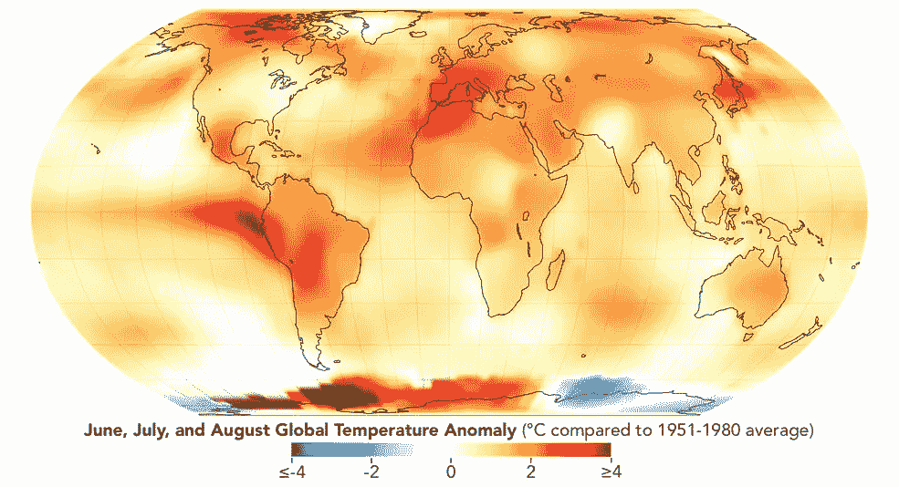

这张地图展示了 2023 年气象夏季（6 月、7 月和 8 月）的全球温度异常情况。它显示了地球不同区域相对于 1951 年至 1980 年基准平均值的温暖或凉爽程度。***来源：NASA 地球观测台/劳伦·多芬***，[*经授权使用*](https://www.nasa.gov/multimedia/guidelines/index.html)

这张来自 NASA 的地图显示了与 1951 年至 1980 年平均值相比，今年夏天的全球温度异常情况，我并不感到惊讶，因为我所在的欧洲地区是全球温度变化最高的区域之一——西班牙的气温高达 40 摄氏度（约 104 华氏度）并不罕见。

## 影响

高温加剧了加拿大、夏威夷、欧洲部分地区以及其他地方的野火，并可能促成了全球范围内的强降雨事件。


“Drevenochoria” 火灾从阿提卡的伊利翁看到的图像，拍摄时间大约为 7 月 18 日凌晨 2 点。图片由[Sthivaios](https://commons.wikimedia.org/w/index.php?title=User%3ASthivaios&action=edit&redlink=1)提供 [CC BY-SA 4.0](https://creativecommons.org/licenses/by-sa/4.0)

欧洲的野火在夏季并不罕见，但今年特别猛烈，尤其是在希腊，岛屿如罗德岛和科孚岛等地区进行了疏散，许多人死伤。而且，在夏威夷，一个小镇被完全摧毁了。

除了野火，欧洲还遭遇了大规模的暴雨（特别是来自丹尼尔风暴的暴雨），希腊再次受到严重影响——洪水造成了数百万欧元的损失。

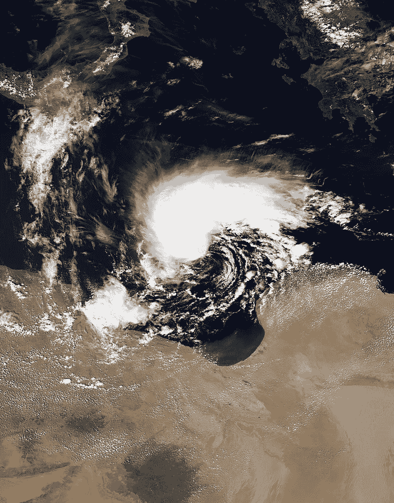

2023 年 9 月 9 日，丹尼尔气旋（也称为丹尼尔风暴）在利比亚北部。来自 NOAA-20 卫星的 VIIRS 影像——[`worldview.earthdata.nasa.gov/`](https://worldview.earthdata.nasa.gov/)，公共领域

由于丹尼尔风暴，利比亚的洪水造成了巨大的破坏，并造成了数千人遇难，当时两个大坝崩溃，摧毁了地中海沿岸的德尔纳大部分地区。电视新闻播报了幸存者从曾经的家园废墟中被救出的悲惨场景。

虽然不可能明确证明这些灾难与气候变化之间的联系，[一项由 NASA 主导的研究](https://www.nature.com/articles/s44221-023-00040-5.epdf?sharing_token=e9F5Sie2caj_xK3I98iJx9RgN0jAjWel9jnR3ZoTv0PgIO8qj4_9Dplvo9OtFAjxls5R1eUQbdMp8g1hckKImwWw3OwCmH7Phu01nlkQI_fSsElxTYewMbrxD-gwTOeEMenTXlLvcQnFhYfzTkacdkMj7c0dlXuLTVp9s46ua9Y%3D) 确认了随着气温升高，严重干旱和过度降水的发生频率增加。

而[Carbon Brief](https://www.carbonbrief.org/mapped-how-climate-change-affects-extreme-weather-around-the-world/)（一个总部位于英国的网站，涵盖气候科学、气候政策和能源政策的最新发展）建议，93% 的极端高温事件经科学家评估都因为气候变化而变得更可能发生或更严重。

这并不令人惊讶：较高的温度意味着森林变得更干燥，更易燃，而当下雨时，这些较高的温度意味着大气能容纳更多的水蒸气，从而有更多的 H₂O 可降雨。

## 统计数据展示

根据他们的[新闻稿](https://www.nasa.gov/press-release/nasa-announces-summer-2023-hottest-on-record)，今年 6 月、7 月和 8 月的综合温度比任何其他记录中的夏季高出 0.23 摄氏度，比 1951 年至 1980 年的平均夏季温度高出 1.2 摄氏度。

数据由 NASA 戈达德太空研究所（GISS）[1]的科学家在纽约记录，记录了 6 月、7 月和 8 月的温度异常——这些月份被认为是北半球的气象夏季。

数据覆盖了从 1880 年至当前年份，并记录了与 1951 年至 1980 年计算的平均值相比的夏季温度变化。

我们可以绘制一个简单的折线图，从中可以清晰地看到温度的逐渐上升。1980 年后的温度逐渐上升，而 1951 年之前的温度大多低于平均水平，而 1951 年至 1980 年之间的温度则趋于接近平均温度。

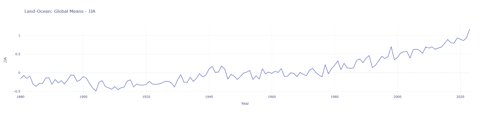

2023 年 6 月、7 月和 8 月的全球温度。数据来源于 NASA 的 GISS [1] — 作者图片

然而，由于数据取自每年三个月的时间段，其连续性不如代表一系列相邻月份的数据。因此，也许对于这种数据，柱状图可能是更好的选择。

下图更清楚地展示了自 1880 年以来全球温度在 6 月、7 月和 8 月的变化情况，柱状图更好地表现了数据。你可以更容易地看到，今年的温度明显高于任何近期年份，并且比 1951 年至 1980 年的平均夏季温度高出很多。

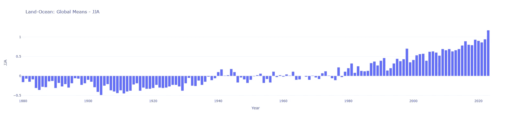

2023 年 6 月、7 月和 8 月的全球温度。数据来源于 NASA 的 GISS [1] — 作者图片

因此，柱状图可能比折线图更好地传达数据。但我们仍然可以通过使用颜色来使其更加清晰。

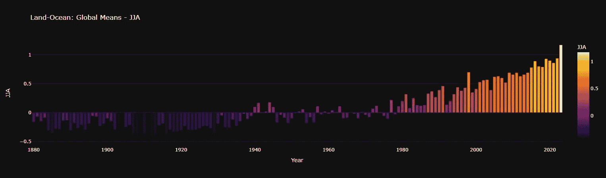

2023 年 6 月、7 月和 8 月的全球温度。数据来源于 NASA 的 GISS [1] — 作者图片

上面的图表比之前的图表更戏剧性地展示了温度变化。

图表中的颜色编码（尽管严格来说是多余的）强调了上升趋势，较高的温度由更暖的颜色表示，深色主题与浅色形成鲜明对比，并突出了近期更热的年份。

我使用 Plotly 创建了柱状图，采用了深色方案和 Plotly 的‘inferno’颜色范围——我们将在下面看到 Python 代码。

## 数据

数据[1]覆盖了 1880 年至 2023 年，包括每年每个月的温度异常以及例如我们上面看到的 6 月至 8 月的月均温度。有一个全球数据文件，还有两个分别针对北半球和南半球的文件。

我已将数据复制到一个 GitHub 仓库，并编写了一个 Jupyter Notebook，该 Notebook 读取这些数据并生成我在这里使用的所有图表（文章顶部的地图除外——那张图片是由 NASA/GISS 的好人们制作的）。你可以在那里下载任何或所有的材料，我将在本文末尾提供一个链接。

这是一个将全球数据读取到 Pandas 数据框中的代码副本。

```py
title, df = readdata.read_GLB()
```

我创建了一些辅助函数来读取文件，这些函数将文件的标题和数据分开，你将在仓库中找到它们。

这是数据的截图：

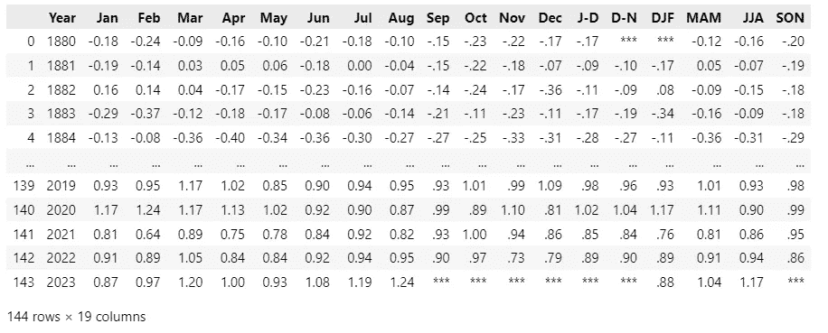

2023 年 6 月、7 月和 8 月的全球气温作为数据框。数据来自 NASA 的 GISS [1] — 图片由作者提供

一些数据缺失——主要是尚未发生的月份——但我们不必担心这些，因为我们不会使用任何包含缺失数据的列。

创建条形图只需三行代码。

```py
period = 'JJA'
scale = 'inferno'
px.bar(df, x='Year', y = period, color="JJA", title = f"{title} - {period}", 
       color_continuous_scale=scale, template='plotly_dark')
```

图表绘制了北半球夏季的数据，这些数据在 `JJA` 列中找到。由于我在尝试不同的颜色比例，所以我还使用了一个变量 `scale` 来定义这个比例。该时期和标题（在之前的代码中设置）用于为图表创建标题，除此之外，它只是一个简单的 Plotly Express 条形图。

线图的代码类似于：

```py
px.line(df, x='Year', y = period,  title = f"{title} - {period}", 
            template='plotly_white')
```

我对默认的 Plotly 颜色方案不太感冒，所以在这里我使用了我更喜欢的 `plotly_white`。

## CO₂ 排放

我们能展示全球气温持续上升的原因吗？恐怕不能简单地做到这一点。但我们可以展示 CO₂ 排放量的上升与气温上升之间的相关性，并指出我们知道 CO₂ 排放量由于人为活动而增加，并且大气中的 CO₂ 增加会导致变暖。

我使用了一个 Our World in Data 的 GitHub 仓库 [3] 来创建我们接下来将使用的数据。同样，它被复制到我自己的一个仓库中，我将其处理成较小的文件。链接将在文章末尾出现。

我们将创建一个这样的全球 CO₂ 排放线图：

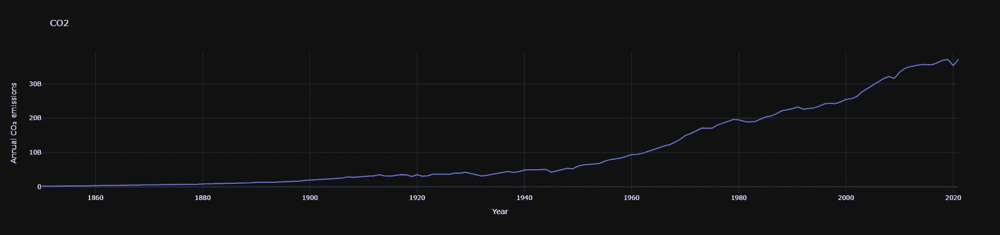

全球 CO2 排放。数据来自 OWID [3]，图片由作者提供

首先，让我们获取数据：

```py
f = "https://raw.githubusercontent.com/alanjones2/CO2/master/data/world_df.csv"
co2 = pd.read_csv(f)
```

它看起来像这样：

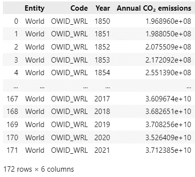

我们只对“年份”和“年度 CO₂ 排放量”列感兴趣，从中我们可以绘制图表。

该图表类似于温度变化图。它有相同的平坦开始，并且在图表的后半部分上升更陡。它们在这里一起展示。

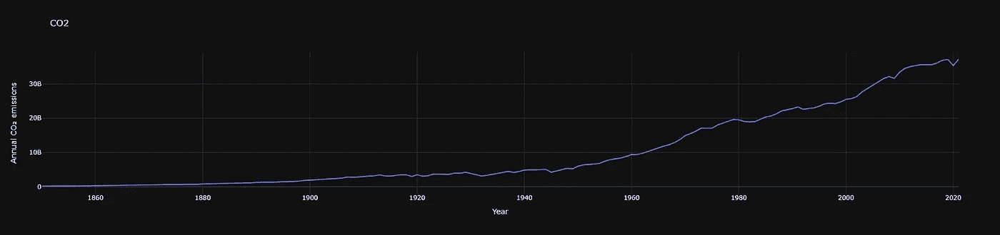

全球 CO2 排放。数据来自 OWID [3]，图片由作者提供

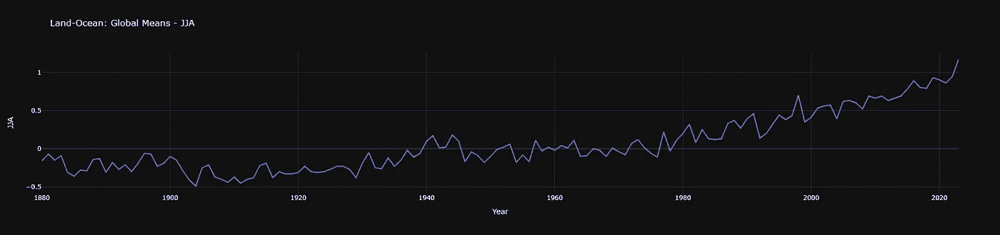

2023 年 6 月、7 月和 8 月的全球气温。数据来自 NASA 的 GISS [1] — 图片由作者提供

我们可以接受科学共识，即 CO₂排放增加了全球变暖，但同时我们也需要接受其他因素的影响。

温度变化不仅仅是由于人类将温室气体排放到大气中。正如[美国环境保护署](https://www.epa.gov/climatechange-science/causes-climate-change)（EPA）所明确指出的，还有其他因素，例如太阳活动和由于例如森林砍伐造成的地球反射率变化。还有除了二氧化碳之外的其他温室气体，如甲烷和一氧化二氮。

美国环境保护署（EPA）还明确表示，除了人为排放的温室气体之外，没有其他原因能够解释当前气候变化的水平。

然而，这些其他因素使图表不完全相同。温度线的波动上下，这些不太剧烈的影响可能是原因。

## 数据相关性

数据科学家或统计学家确定相关性的方法可能是绘制 CO₂排放与温度变化的散点图，并在点之间绘制趋势线。

我们可以稍后再查看，但我不确定散点图是否为一般读者所理解，仅仅将两个图放在一起可能对非专业读者来说是更好的方法。

温度和排放图表的相似性很容易看出，但如果我们能在同一图表上绘制这些数据会更有用。这并不是完全简单，因为虽然两个图的 x 轴都是类似的年份区间，但 y 轴差异很大。温度异常覆盖了几度摄氏度，而 CO₂排放量在大约 20 到 40 亿吨之间。

## 双轴图

解决方案是绘制一个双轴图，其中有两个 y 轴和一个共同的 x 轴。不幸的是，Plotly Express 不支持双轴图，因此我们利用了 Plotly Express 构建的 Graph Objects 包。

如下代码所示，我们首先创建一个包含次级 y 轴的空图，然后将两个数据轨迹添加到该图中，第一个轨迹是温度数据，第二个轨迹是 CO₂数据。

你可能会发现 emissions 轨迹是一个散点图，但 Graph Objects 中的`Scatter`轨迹默认用线连接这些点，所以它实际上是一个线图。

代码的其余部分仅仅设置了标题和标签。

```py
import plotly.graph_objects as go
from plotly.subplots import make_subplots

# Create figure with secondary y-axis
fig = make_subplots(specs=[[{"secondary_y": True}]])

# Add traces
fig.add_trace(
    go.Bar(x=df['Year'], y=df['JJA'], name="Temp anomaly"),
    secondary_y=False,
)

fig.add_trace(
    go.Scatter(x=co2['Year'], y=co2['Annual CO₂ emissions'], name="CO2 Emissions"),
    secondary_y=True,
)

# Add figure title
fig.update_layout(
    title_text="Temperature / CO2 Emissions"
)

# Set x-axis title
fig.update_xaxes(title_text="Year")

# Set y-axes titles
fig.update_yaxes(title_text="Temperature ºC", secondary_y=False)
fig.update_yaxes(title_text="CO2 Emissions tonnes", secondary_y=True)
fig.update_layout(template='plotly_dark')

fig.show()
```

结果如下：

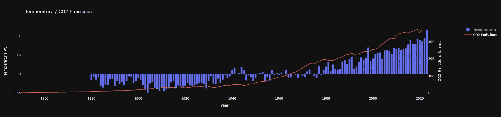

2023 年 6 月、7 月和 8 月的全球温度。数据来自 NASA 的 GISS [1]，全球 CO2 排放数据来自 OWID [3] —— 作者提供的图像

两组数据之间的关系相当明确。

## 数据科学家的散点图相关性

为了完整性，我们还需要一个散点图，不是吗？这就是它：

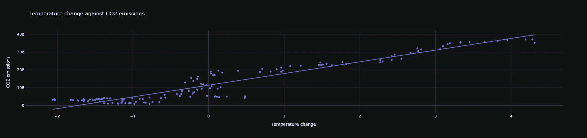

2023 年 6 月、7 月和 8 月的全球温度。来自 NASA 的 GISS[1]与全球 CO2 排放数据，数据来自 OWID[3] — 图像由作者提供

要绘制此图，我们需要匹配数据集的长度，因此我们需要将两个数据集都截断，从 1880 年（温度数据的第一年）到 2021 年（CO₂数据的最后一年）

```py
# To draw a scatter plot we need to make the data the same length
# So we need to truncate both from 1880 (the first temp yr) to 2021 (the last co2 yr)
# Check that years are correct
co2yrs=list(co2['Year'][30:])
tyrs = list(df['Year'][:-2])
print(f"CO2 Years {min(co2yrs)} to {max(co2yrs)}")
print(f"Temperature Years {min(tyrs)} to {max(tyrs)}")
```

```py
CO2 Years 1880 to 2021
Temperature Years 1880 to 2021
```

这完成了任务并检查了范围是否相同。

散点图还显示了两个数据集之间的相关性，但至少对于一般观众，我认为双线和条形图更具说服力。

## 结论

关于气候变化的争论常常充满情感、政治和经济动机以及个人偏见。因此，我们有责任以尽可能清晰的方式呈现事实，以便科学论点能够占上风。

我将最后的话留给气候科学家和 GISS 主任加文·施密特。在[NASA 新闻稿](https://www.nasa.gov/press-release/nasa-announces-summer-2023-hottest-on-record)中，他被引用说，“不幸的是，气候变化正在发生。我们说会发生的事情正在发生，”他补充道，“如果我们继续向大气中排放二氧化碳和其他温室气体，情况会变得更糟。”

## 下载

感谢阅读，希望这篇文章对你有帮助，并且你会查看我 GitHub 存储库中的数据和代码。

你可以在我网站的链接中找到数据和包含本文所有代码（及更多）的 Jupyter Notebook。作为额外福利，还有一些图表的 Matplotlib 版本，包括双轴图。

[](https://alanjones2.github.io/?source=post_page-----d92d500a8f01--------------------------------) [## Alan Jones

### 编码、数据科学和数据可视化 - 文章和教程

[alanjones2.github.io](https://alanjones2.github.io/?source=post_page-----d92d500a8f01--------------------------------)

你也可以订阅我的[数据可视化、数据科学和 Python](http://technofile.substack.com)通讯以获取更多内容。

## 参考文献

1.  GISTEMP 团队，2023: GISS 地表温度分析（GISTEMP），第 4 版。NASA 戈达德太空研究所。数据集于 2023-09–19 访问，地址为 data.giss.nasa.gov/gistemp/。*请注意，NASA 的数据集没有特定的使用许可。NASA 将其免费提供用于非商业目的，但应给出归属（如上所示）。*

1.  Lenssen, N., G. Schmidt, J. Hansen, M. Menne, A. Persin, R. Ruedy, 和 D. Zyss, 2019: GISTEMP 不确定性模型的改进。J. Geophys. Res. Atmos., 124, 第 12 期, 6307–6326, doi:10.1029/2018JD029522.

1.  全球 CO₂排放数据源自[我们世界的数据（OWID）co2-data GitHub 存储库](https://github.com/owid/co2-data)，[创作共用 BY 许可](https://creativecommons.org/licenses/by/4.0/)
