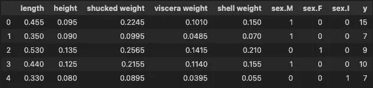

# 新的 SHAP 图：小提琴图和热图

> 原文：[`towardsdatascience.com/new-shap-plots-violin-and-heatmap-20f647313b64`](https://towardsdatascience.com/new-shap-plots-violin-and-heatmap-20f647313b64)

## SHAP 版本 0.42.1 中的图表可以告诉你关于模型的哪些信息

[](https://conorosullyds.medium.com/?source=post_page-----20f647313b64--------------------------------)[](https://towardsdatascience.com/?source=post_page-----20f647313b64--------------------------------) [Conor O'Sullivan](https://conorosullyds.medium.com/?source=post_page-----20f647313b64--------------------------------)

·发表于 [Towards Data Science](https://towardsdatascience.com/?source=post_page-----20f647313b64--------------------------------) ·6 分钟阅读·2023 年 8 月 14 日

--


（来源：作者）

对于 SHAP 最大的担忧之一与软件包本身有关。它已经有一段时间没有更新了，GitHub 上的问题也不断增加。让许多用户感到欣慰的是，贡献者们变得更加活跃。事实上，他们给我们带来了新的图表——小提琴图和热图。我们将：

+   提供这些图的代码

+   讨论我们可以从中获得哪些新见解

你还可以观看关于这个主题的简介：

# 现有的 SHAP 图

我们从之前的 SHAP 教程继续。你可以在下面的文章中找到这篇教程。你还可以在 [GitHub](https://github.com/conorosully/SHAP-tutorial) 上找到完整的项目。要使用新的图表，你需要更新 SHAP 软件包。我使用的是版本 **0.42.1**。

[](/introduction-to-shap-with-python-d27edc23c454?source=post_page-----20f647313b64--------------------------------) ## 使用 Python 介绍 SHAP

### 如何创建和解释 SHAP 图：瀑布图、力图、平均 SHAP 图、蜜蜂散点图和依赖图

towardsdatascience.com

总结来说，我们使用 SHAP 来解释一个基于 [abalone 数据集](https://archive.ics.uci.edu/ml/datasets/abalone) 构建的模型。该数据集包含 4,177 个实例，你可以在下方看到特征的示例。我们使用这 8 个特征来预测 y——**螺旋纹数**。



X 特征矩阵（来源：[UCI 机器学习库](https://archive.ics.uci.edu/ml/datasets/abalone)）（许可证：CC0：公共领域）

本教程继续计算 SHAP 值并显示各种 SHAP 图。理解其中的一些图对于理解新的 SHAP 图是有帮助的。我们将看到它们提供了类似的信息。

第一个是**均值 SHAP**图，见**图 1**。对于每个特征，这给出了所有实例的绝对均值 SHAP 值。对预测贡献显著的特征，其均值 SHAP 值会很高。换句话说，这张图告诉我们哪些特征在一般情况下最为重要。


图 1：绝对均值图（来源：作者）

另一种图是**蜜蜂散点图**，见**图 2**。这是所有 SHAP 值的可视化。在 y 轴上，值按特征分组。对于每个组，点的颜色由特征值决定（即特征值较高的点颜色较红）。现在，让我们看看新的 SHAP 图与这些图的比较情况。


图 2：蜜蜂散点图（来源：作者）

# SHAP 小提琴图

**小提琴图**的代码类似于我们在其他 SHAP 图中看到的内容。我们只需输入我们的**shap_values**对象（第 2 行）。为了明确，这些值是我们在之前的教程中计算的。你可以在**图 3**中查看输出。与**图 2**相比，我们可以看到小提琴图是蜜蜂散点图的一种不同风格。

```py
# violin plot
shap.plots.violin(shap_values)
```


图 3：小提琴图（来源：作者）

另一种风格是**分层小提琴图**，见**图 4**。在这种图中，每个 SHAP 值下的特征值变化更为清晰。也就是说，与原始的小提琴图和蜜蜂散点图相比。

```py
# layered violin plot
shap.plots.violin(shap_values, plot_type="layered_violin")
```


图 4：分层小提琴图（来源：作者）

由于相似性，我们从这些图中获得的见解类似于蜜蜂散点图。这些图可以突出显示重要的关系，因为我们可以看到哪些特征往往具有较大的 SHAP 值。通过按特征值着色，我们还可以开始理解特征与模型预测之间的关系。现在，让我们看看热图是否能提供更多见解。

# SHAP 热图

你可以在**图 5**中看到热图函数的输出。这里有很多内容：

+   在 x 轴上，我们对所有 4,177 个实例进行了标记

+   y 轴表示特征

+   每个实例上方的线条按该特征的*SHAP 值*进行着色

+   **f(x)** 线表示该实例的预测环数

+   右侧的条形图显示了我们在**图 1**中看到的平均 SHAP 值

与蜜蜂散点图类似，这是一种每个 shap 值的图。但现在我们关注的是 SHAP 值与实例组之间的模式。

```py
# heatmap
shap.plots.heatmap(shap_values)
```


图 5：SHAP 热图（来源：作者）

默认情况下，实例是使用层次聚类算法进行排序的。开发者表示，“这会将因相同原因得到相同模型输出的样本分组在一起”。我发现选择自己的实例排序对于发现模式更为有用。

## 热图排序

为此，我们传递一个**instance_order**参数。这必须是与数据集长度相同的整数数组（即 4,177）。这些值给出实例的顺序。在下面的代码中，我们将实例从预测值最低到最高排序。

```py
# order by predictions
order = np.argsort(y_pred)
shap.plots.heatmap(shap_values, instance_order=order)
```

在**图 6**的输出中，我们看到了一些模式的出现。注意**去壳重量**的 SHAP 值有 3 个组。存在两个正值组——一个是当**壳体重量**的 SHAP 值既小又大时。一个潜在的交互作用？我们可以通过 SHAP 交互值进一步探索。


图 6：按预测值排序的 SHAP 热图（来源：作者）

另一种选择是按特征的值对实例进行排序。下面，我们使用**壳体重量**对它们进行排序。我们可以看到，预测的环数随着该特征的增加而增加。我们还可以看到该特征的 SHAP 值也有增加的趋势。换句话说，壳体重量值越大，预测的环数越高。

```py
# order by feature's values
order = np.argsort(data['shell weight'])
shap.plots.heatmap(shap_values, instance_order=order)
```


图 7：按特征值排序的 SHAP 热图（来源：作者）

我们可以以任何我们想要的方式排序热图。这种灵活性可以帮助我们以其他图表无法提供的方式理解我们的模型。就个人而言，我很兴奋看到这些发展的出现。更多的特征和可视化选项将受到包的众多用户的赞赏。你希望在未来的更新中看到什么？

如果你想了解更多关于 SHAP 的信息，请查看下面的文章：

[](/analysing-interactions-with-shap-8c4a2bc11c2a?source=post_page-----20f647313b64--------------------------------) ## 使用 SHAP 分析交互作用

### 使用 SHAP Python 包识别和可视化数据中的交互作用

[towardsdatascience.com [](/from-shapley-to-shap-understanding-the-math-e7155414213b?source=post_page-----20f647313b64--------------------------------) ## 从 Shapley 到 SHAP — 理解数学

### 关于 SHAP 特征贡献计算的概述

[towardsdatascience.com [](/the-limitations-of-shap-703f34061d86?source=post_page-----20f647313b64--------------------------------) ## SHAP 的局限性

### SHAP 如何受到特征依赖、因果推断和人为偏差的影响

[towardsdatascience.com

希望你喜欢这篇文章！你可以通过成为我的[**推荐会员**](https://conorosullyds.medium.com/membership)来支持我**:)**

[](https://conorosullyds.medium.com/membership?source=post_page-----20f647313b64--------------------------------) [## 通过我的推荐链接加入 Medium — Conor O’Sullivan

### 作为 Medium 会员，你的部分会员费用将用于你阅读的作家，同时你可以全面访问所有故事……

conorosullyds.medium.com](https://conorosullyds.medium.com/membership?source=post_page-----20f647313b64--------------------------------)

| [Twitter](https://twitter.com/conorosullyDS) | [YouTube](https://www.youtube.com/channel/UChsoWqJbEjBwrn00Zvghi4w) | [Newsletter](https://mailchi.mp/aa82a5ce1dc0/signup) — 免费注册获取 [Python SHAP 课程](https://adataodyssey.com/courses/shap-with-python/)

## 参考资料

S. Lundberg **SHAP****Python 包** [`github.com/slundberg/shap`](https://github.com/slundberg/shap)

S. Lundberg & S. Lee, **统一解释模型预测的方法** [`arxiv.org/pdf/1705.07874.pdf`](https://arxiv.org/pdf/1705.07874.pdf)

SHAP **热图** [`shap.readthedocs.io/en/latest/example_notebooks/api_examples/plots/heatmap.html`](https://shap.readthedocs.io/en/latest/example_notebooks/api_examples/plots/heatmap.html)

SHAP **小提琴图总结** [`shap.readthedocs.io/en/latest/example_notebooks/api_examples/plots/violin.html`](https://shap.readthedocs.io/en/latest/example_notebooks/api_examples/plots/violin.html)
