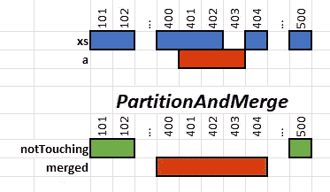

# 用 Dafny 正式验证 Rust 算法的九个规则（第一部分）

> 原文：[`towardsdatascience.com/nine-rules-to-formally-validate-rust-algorithms-with-dafny-part-1-5cb8c8a0bb92?source=collection_archive---------3-----------------------#2023-10-04`](https://towardsdatascience.com/nine-rules-to-formally-validate-rust-algorithms-with-dafny-part-1-5cb8c8a0bb92?source=collection_archive---------3-----------------------#2023-10-04)

## **验证 range-set-blaze 木板的经验教训**

[](https://medium.com/@carlmkadie?source=post_page-----5cb8c8a0bb92--------------------------------)[](https://towardsdatascience.com/?source=post_page-----5cb8c8a0bb92--------------------------------) [Carl M. Kadie](https://medium.com/@carlmkadie?source=post_page-----5cb8c8a0bb92--------------------------------)

·

[Follow](https://medium.com/m/signin?actionUrl=https%3A%2F%2Fmedium.com%2F_%2Fsubscribe%2Fuser%2Fa5e87027005f&operation=register&redirect=https%3A%2F%2Ftowardsdatascience.com%2Fnine-rules-to-formally-validate-rust-algorithms-with-dafny-part-1-5cb8c8a0bb92&user=Carl+M.+Kadie&userId=a5e87027005f&source=post_page-a5e87027005f----5cb8c8a0bb92---------------------post_header-----------) 发表于 [Towards Data Science](https://towardsdatascience.com/?source=post_page-----5cb8c8a0bb92--------------------------------) ·14 min 阅读·2023 年 10 月 4 日[](https://medium.com/m/signin?actionUrl=https%3A%2F%2Fmedium.com%2F_%2Fvote%2Ftowards-data-science%2F5cb8c8a0bb92&operation=register&redirect=https%3A%2F%2Ftowardsdatascience.com%2Fnine-rules-to-formally-validate-rust-algorithms-with-dafny-part-1-5cb8c8a0bb92&user=Carl+M.+Kadie&userId=a5e87027005f&source=-----5cb8c8a0bb92---------------------clap_footer-----------)

--

[](https://medium.com/m/signin?actionUrl=https%3A%2F%2Fmedium.com%2F_%2Fbookmark%2Fp%2F5cb8c8a0bb92&operation=register&redirect=https%3A%2F%2Ftowardsdatascience.com%2Fnine-rules-to-formally-validate-rust-algorithms-with-dafny-part-1-5cb8c8a0bb92&source=-----5cb8c8a0bb92---------------------bookmark_footer-----------)

由 Carl M. Kadie 和 Divyanshu Ranjan 撰写


蟹证明毕达哥拉斯定理 — 源自：[`openai.com/dall-e-2/`](https://openai.com/dall-e-2/) & [CC BY-SA 3.0](http://creativecommons.org/licenses/by-sa/3.0/) [File:Pythagorean.svg](https://commons.wikimedia.org/wiki/File:Pythagorean.svg)

我的 Rust crate `[range-set-blaze](https://crates.io/crates/range-set-blaze)` 依赖于一个名为`internal_add`的关键函数。该函数应当将一系列整数插入到 crate 的数据结构中。但它是否*正确*地完成了这个任务？当然，我会进行测试，但测试可能会漏掉错误。理想情况下，我希望获得数学上的正确性保障。

> 附注：作为 Rust 程序员，我们欣赏确定性。Rust 类型系统保证我们不会解引用空指针。Rust 借用检查器保证我们不会在内存被释放后继续使用它。像[Kani Rust crate](https://medium.com/@carlmkadie/check-ai-generated-code-perfectly-and-automatically-d5b61acff741)这样的工具在某些情况下保证算术不会溢出。但如果我们想要确定一个算法的正确性呢？

为了实现这种确定性，Divyanshu Ranjan 和我将`internal_add`的算法移植到 Dafny 语言中。然后我们验证了 Dafny 版本的算法。（我们选择 Dafny 是因为它的强大和易用性。稍后我们会多谈谈这个选择。）

在验证过程中，我们学习了九条规则，可以帮助你使用 Dafny 验证算法——无论是用 Rust 还是其他语言编写的。你也可能会发现这些规则作为使用现代工具验证的难易程度的参考非常有趣。

规则如下：

1.  不要学习 Dafny。

1.  学习 Dafny。

1.  定义你算法的基本概念。

1.  规范你的算法。

1.  从 Dafny 社区获取帮助。

1.  验证一个不同的、更简单的算法。

*见* [*第二部分*](https://medium.com/towards-data-science/nine-rules-to-formally-validate-rust-algorithms-with-dafny-part-2-f2a279686700) *了解这些规则：*

*7\. 将你的实际算法移植到 Dafny。*

*8\. 验证你算法的 Dafny 版本。*

*9\. 重新工作你的验证以确保可靠性。*

> 附注：为了避免模棱两可，我们称这些为“规则”，但它们当然只是建议。

`internal_add`函数试图将一个新的整数范围高效地插入到已排序且不重叠的整数范围列表中。例如，如果我们从`[101..=102, 400..=402, 404..=405]`开始，并添加`402..=404`，我们期望的结果是`[101..=102, 400..=405]`。


来源：本文及所有后续图片均由作者提供。

理想情况下，我会使用 Rust 特定的工具[[1](https://rust-formal-methods.github.io/tools.html),[2](https://alastairreid.github.io/automatic-rust-verification-tools-2021/)]正式验证这个算法。然而，这些工具似乎难以使用。因此，我选择了[Dafny](https://dafny.org/)。Dafny 是一种语言和验证系统。它在世界各地的大学本科课程中教授，也在工业界使用。我发现它具有令人上瘾的交互性和对程序员友好的特点。

> 附带说明：Dafny 的创始人 Rustan Leino 博士与 Rust 的联系不仅仅是名字的巧合。他帮助创建了 Spec#，这是第一个使用类型系统来避免空指针的语言。Rust 当然采纳了这个想法，并取得了巨大成功。

本文涵盖规则 1 到 6。 [第二部分](https://medium.com/towards-data-science/nine-rules-to-formally-validate-rust-algorithms-with-dafny-part-2-f2a279686700) 涵盖规则 7 到 9。

# 规则 1：不要学习 Dafny。

在尝试证明算法的数学正确性之前，决定这种努力是否值得。

Dafny 不是 Rust。使用 Dafny 需要将感兴趣的算法从 Rust 移植到 Dafny。这种移植可能会遗漏细节并引入错误。鉴于这种风险，*你* 是否应该使用 Dafny 来验证 Rust 算法？我大胆地声称“这要看情况”。

+   你的算法的正确性有多重要？如果你正在打印报告且它看起来正确，那么它可能确实是正确的。`internal_add` 算法涉及一个数据结构，我希望其他人能够自信地使用它，这给了我额外的动机去验证它。

+   也许所有形式验证在当前工具下都太难了。然而，我相信 Dafny 使形式验证变得尽可能简单。如果你已经熟悉类型（例如，来自 Rust）和递归/归纳（在 Rust 中不常用），你会发现形式验证代码更容易。你可以阅读本文并自行决定何时形式验证足够简单，值得对你有价值。

+   也许模糊测试（例如 `[cargo-fuzz](https://github.com/rust-fuzz/cargo-fuzz)`）和基于属性的测试（例如 `[QuickCheck](https://github.com/BurntSushi/quickcheck)`）已经足够好。虽然这些方法不能提供数学上的确定性，但它们聪明、有用且易于使用。（`range-set-blaze` crate 已经使用了 `QuickCheck`。有关详细信息，请参见 [之前文章中的规则 9.5](https://medium.com/towards-data-science/nine-rules-for-creating-fast-safe-and-compatible-data-structures-in-rust-part-2-da5e6961a0b7)。）

+   也许形式验证注定是失败的，因为编写规范和编写代码一样困难。我不同意这个观点。想一想 [重构](https://en.wikipedia.org/wiki/Code_refactoring)。我通常通过编写简单的代码来开始编程。然后，我将这些简单的代码重构以提高效率。对于 `internal_add`，我发现规范比任何代码都要简单。（你可以在规则 4 中自行判断这一点。）

> 附带说明：验证变成了从简单规范到最终高效算法的计算机检查重构。

+   也许形式化验证注定是失败的，因为[停机问题](https://en.wikipedia.org/wiki/Halting_problem)正式告诉我们形式化通常是不可能的。停机问题并没有注定我们的失败。虽然我们不能总是理解*任意*代码，但我们不需要这样做。我们只需要理解我们自己的代码，而我们（希望）写的代码是易于理解的。从规则 2 开始，我们将看到 Dafny 如何轻松验证*特定*的循环和递归是否会停止。

+   也许迁移到 Dafny 太困难了。这不是我的经历。像 Rust 一样，Dafny 混合了命令式和函数式编程。我发现将我的算法迁移到 Dafny 是简单的。

假设你仍然希望用 Dafny 验证你的算法，那么下一步是学习 Dafny。

# 步骤 2：学习 Dafny。

Dafny 是一种编程语言和交互式验证系统。我推荐你[将其作为 VS Code 扩展安装](https://marketplace.visualstudio.com/items?itemName=dafny-lang.ide-vscode)。

要学习 Dafny，从[`dafny.org/`](https://dafny.org/)开始。特别值得关注的是[在线教程](http://dafny.org/dafny/OnlineTutorial/guide.html)和[参考手册](https://dafny.org/latest/DafnyRef/DafnyRef)。我还发现 YouTube 上的[Verification Corner 视频](https://www.youtube.com/watch?v=oLS_y842fMc&t=823s)很有帮助。（可能感兴趣的还有大学教材《*程序证明*》，Kindle 版售价 $49）。我发现 Dafny 的编程语言部分比 Rust 更容易学习，可能与 C# 的难度相当。

Dafny 和 Rust 一样是完全类型化的。Dafny 像 Python 一样进行垃圾回收。这里有一个[“Hello World”](https://github.com/CarlKCarlK/range-set-blaze/tree/oct23/tests/formal)示例：

```py
// hello.dfy
method Main()
{
  var s := "Hello World";
  print s, "\n";
}
```

Dafny，像 Python 一样，提供任意大小的整数。这里有一个[程序](https://github.com/CarlKCarlK/range-set-blaze/tree/oct23/tests/formal)，它通过重复递增来*可证明*地加两个自然数。


一些关注点：

+   Dafny 编码规范遵循 C#，而不是 Rust。因此，我们将函数命名为 `SlowAdd` 而不是 `slow_add`（尽管两者都能运行）。

+   Dafny 支持子类型。例如，任何可以证明是非负的 `int` 也是一个 `nat`。

+   赋值用 `:=`，等式用 `==`。（没有 `=`。）

+   函数参数，例如上面的`x`和`y`，是不可变的。

+   Dafny 使用 `ensures` 和 `invariant` 语句在编译时验证代码。然后，它会移除这些语句以完成编译。

+   绿色的对勾标记显示这段代码已通过验证。Dafny 的 VS Code 扩展默认会持续尝试验证每个方法。这为使用 Dafny 的工作增添了几乎像赌博一样的兴奋感。在上面的例子中，如果我将`y`改为`int`而不是`nat`，那么验证应该会失败。 （你能找出原因吗？）Dafny 会用红色 X 标记我的函数，并告诉我“`这个后置条件可能不成立：r == x + y`”。

+   Dafny 了解一些整数、数组、集合、映射、序列等的数学。这通常使它能够自行完成验证的最后细节。

现在你了解了 Dafny，你应该让它了解你的算法。

# 规则 3：定义算法的基本概念。

`range-set-blaze` crate 将整数集合表示为已排序的、不重叠的范围。例如，这个包含三个范围的列表：

`100..=2_393, 20_303..=30_239_000, 501_000_013..=501_000_016`

表示一个包含 30,220,996 个整数的集合。

在 Rust 中，`RangeSetBlaze` 结构体内部用标准的 `[BTreeMap](https://doc.rust-lang.org/std/collections/struct.BTreeMap.html)` 表示这个数据结构。请记住，`BTreeMap` 表示按键排序的键/值对列表。在这里，我们的键是范围的起始值（例如，`100`、`20_303`、`501_000_013`），值是范围的包含结束值（例如，`2_393`、`30_239_000`、`501_000_016`）。`RangeSetBlaze` 使用 `BTreeMap` 而非 `vec` 来存储列表，以使键查找更适合缓存。

`RangeSetBlaze` 依赖于 `BTreeMap`，那么我们必须在 Dafny 中实现 `BTreeMap` 吗？幸运的是，不需要。我们可以改用 Dafny 的类似 `vec` 的 `seq` 数据类型。这个替代方案有效，因为 `BTreeMap`、`vec` 和 `seq` 都可以表示排序列表——只是效率不同。对于形式验证的目的，我们只关心正确性，可以忽略效率。

`RangeSetBlaze` 需要范围列表是已排序且互不重叠的。我们如何在 Dafny 中表示“已排序且互不重叠”？我们可以通过这个 [*幽灵谓词*（及相关代码](https://github.com/CarlKCarlK/range-set-blaze/tree/oct23/tests/formal) 来表示：

```py
ghost predicate ValidSeq(sequence: seq<NeIntRange>) {
  (forall i:nat, j:nat | i < j < |sequence| :: sequence[i].0 < sequence[j].0)
  && (forall i:nat, j:nat | i < j < |sequence| :: !Touch(sequence[i], sequence[j]))
}

type IntRange = (int, int)
type NeIntRange = x: IntRange | !IsEmpty(x) witness (0,0)

function IsEmpty(r: IntRange): bool
{
  r.0 > r.1
}
```

*谓词* 是返回 `bool` 的方法的另一种说法。*幽灵* 方法（或谓词）是只能用于验证而不能用于运行最终代码的方法。

从高层次来看，`ValidSeq` 谓词以非空整数范围的序列作为输入。它随后测试起始值是否排序，并且范围是否不重叠。具体来说，

+   `IntRange` 是一个由两个 `int` 值组成的元组。

+   当且仅当 `IntRange` 的起始值大于结束值时，它才是空的。（这遵循了 [Rust 的约定](https://doc.rust-lang.org/std/ops/struct.RangeInclusive.html)）。

+   `NeIntRange`（非空整数范围）是一个非空的 `IntRange`，例如，`(0,0)`。 [我们所有的范围都是包含结束值的。]

+   这个表达式测试起始值是否已排序：

```py
forall i:nat, j:nat | i < j < |sequence| :: sequence[i].0 < sequence[j].0
```

它可以被解读为“对所有自然数 *i* 和 *j* —— 使得 *i* 小于 *j* 且 *j* 小于序列的长度 —— 测试索引 *i* 处的起始值是否小于索引 *j* 处的起始值”。

> 附注：注意 Rust 的 `BTreeMap` 不支持（随机访问）索引，但这里我们使用了这种索引。这是可以的，因为 `*ValidSeq*` 是一个幽灵谓词，因此仅用于验证。

+   这个表达式测试范围是否互不重叠：

```py
forall i:nat, j:nat | i < j < |sequence| :: !Touch(sequence[i], sequence[j])
```

它可以读作“对于所有自然数*i*和*j* — 使得*i*小于*j*且*j*小于序列的长度 — 测试索引*i*的范围是否不触及索引*j*的范围。但`Touch`是什么？

我们将`Touch`定义为两个层次。在数学层面，如果范围*i*中存在整数*i0*，范围*j*中存在整数*j0*，并且*i0*和*j0*彼此距离为一，那么范围*i*被认为触及范围*j*。在高效编程层面，我们希望避免依赖“存在”的定义。[这是一个 Dafny 谓词](https://github.com/CarlKCarlK/range-set-blaze/tree/oct23/tests/formal)，它既符合数学定义又高效：

```py
predicate Touch(i: NeIntRange, j: NeIntRange)
  ensures Touch(i, j) == exists i0, j0 ::
                    Contains(i, i0) && Contains(j, j0) && -1 <= i0 - j0 <= 1
{
  assert Contains(i, i.0) && Contains(i, i.1) && Contains(j, j.0) && Contains(j, j.1);
  if i.1 < j.0 then
    assert  (-1 <= i.1 - j.0 <= 1) == (i.1+1 == j.0);
    i.1+1 == j.0
  else if j.1 < i.0 then
    assert (-1 <= j.1 - i.0 <= 1) == (j.1+1 == i.0);
    j.1+1 == i.0
  else
    var k0 := Max(i.0, j.0);
    assert Contains(i, k0) && Contains(j, k0);
    true
}

function Contains(r: IntRange, i: int): bool
{
  r.0 <= i && i <= r.1
}

function Max(a: int, b: int): int
{
  if a < b then b else a
}
```

一些关注点：

+   `Touch`不是幽灵。换句话说，我们可以在常规代码和验证代码中使用它。

+   `assert`语句帮助 Dafny 证明常规代码符合数学`ensures`语句。

+   为了提高效率，Dafny 证明器分别验证`method`的内部和外部。只有`ensures`（以及尚未出现的`requires`）语句跨越这个边界。与`method`不同，Dafny`function`对验证器是透明的。（我认为它类似于在验证方面内联代码。）

在定义了`ValidSeq`和`Touch`等概念后，我们接下来要指定我们的算法应该做什么。

# 规则 4：指定你的算法。

最终，我希望证明我的 Rust 算法在将新范围插入`RangeSetBlaze`中是正确的。然而，在此之前，我们先定义一下[什么是“正确”的范围插入](https://github.com/CarlKCarlK/range-set-blaze/tree/oct23/tests/formal)。

```py
method InternalAdd(xs: seq<NeIntRange>, a: IntRange) returns (rs: seq<NeIntRange>)
  requires ValidSeq(xs)
  ensures ValidSeq(rs)
  ensures SeqToSet(rs) == SeqToSet(xs) + RangeToSet(a)
{
  if IsEmpty(a)
  {
    rs := xs;
  }
  else
  {
    assume false; // cheat for now
  }
}
```

这表示`InternalAdd`是一个方法，它接受`xs`，一个非空整数范围序列，以及`a`，一个整数范围（可能为空）。该方法输出`rs`，一个新的非空整数范围序列。

我们需要说明`xs`和`rs`必须是已排序且不重叠的。这可以通过`ValidSeq`在`requires`和第一个`ensures`中轻松完成。

我们还需要说明`rs`包含了正确的内容。这难吗？其实不难。我们只需说明`rs`中的整数集合必须等于`xs`中的整数集合并与`a`中的整数集合并集。

> 旁注：在 Dafny 中，“+”应用于集合时表示“并集”。

一个范围中的整数集合是：

```py
ghost function RangeToSet(pair: IntRange): set<int>
{
  set i {:autotriggers false} | pair.0 <= i <= pair.1 :: i
}
```

非空范围序列中的整数集合可以递归定义（即递归）：

```py
ghost function SeqToSet(sequence: seq<NeIntRange>): set<int>
  decreases |sequence|
  requires ValidSeq(sequence)
{
  if |sequence| == 0 then {}
  else if |sequence| == 1 then RangeToSet(sequence[0])
  else RangeToSet(sequence[0]) + SeqToSet(sequence[1..])
}
```

一些关注点：

+   这行代码：`assume false; // cheat for now` [使验证即使在实际上不应该工作时也能工作](https://www.oxfordreference.com/display/10.1093/oi/authority.20110803095804354)。我们将其用作临时占位符。

+   我们将`RangeToSet`和`SeqToSet`设为*幽灵*，以防止我们在常规代码中使用它们。我们将它们设为*函数*（而不是*方法*），以便在验证时内联它们。

+   因为 Dafny 对创建和操作集合和序列了解颇多，我们经常通过在规格说明中使用集合和序列获益。

+   即使我们常规代码使用循环而不是递归，我们的验证代码通常会使用递归类似的归纳法。

+   `{:autotriggers false}` 相关于避免警告信息。更多信息请参见 Prof. James Wilcox 的[这个 Stack Overflow 回答](https://stackoverflow.com/a/50671326/5976009)。

我们现在有了 `InternalAdd` 的正式规格说明。我发现这个规格简短且直观。但如果你需要帮助理解规格说明或其他 Dafny 代码呢？

# 规则 5：寻求 Dafny 社区的帮助。

Dafny 问题的主要论坛是 [Stack Overflow](https://stackoverflow.com/)。令我惊讶的是，我在这里实际获得了许多有用的帮助。

我建议在问题标题前加上“Dafny:”。同时，确保为你的问题添加 `dafny` 标签，可能还要加上 `formal-verification` 标签。

> 附带说明：在网站上，你可以看到[我的 11 个问题](https://stackoverflow.com/users/5976009/carl?tab=questions&sort=newest)和[Divyanshu Ranjan 的 48 个与 Dafny 相关的回答](https://stackoverflow.com/search?q=user%3A14413069+%5Bdafny%5D)。

作为一个在 GitHub 上的开源项目，[Dafny](https://github.com/dafny-lang) 也托管了 GitHub Discussions 和 Issues。

Dafny 社区虽然小，但似乎热衷于帮助用户和改进项目。

在有帮助的情况下，我们接下来必须找到一个符合规格的算法。

# 规则 6：验证一个不同、更简单的算法。

作为正式验证的初学者，我决定推迟对我 Rust 代码中实际 `internal_add` 的工作。相反，我开始着手开发一个我希望更容易验证的 `InternalAdd` 算法。最后，我得到的是[这个](https://github.com/CarlKCarlK/range-set-blaze/tree/oct23/tests/formal)：

```py
method InternalAdd(xs: seq<NeIntRange>, a: IntRange) returns (rs: seq<NeIntRange>)
  requires ValidSeq(xs)
  ensures ValidSeq(rs)
  ensures SeqToSet(rs) == SeqToSet(xs) + RangeToSet(a)
{
  if IsEmpty(a)
  {
    rs := xs;
  }
  else
  {
    var notTouching, merged := PartitionAndMerge(xs, a);
    var indexAfter := NoTouchIndexAfter(notTouching, merged);
    rs := InsertAt(notTouching, [merged], indexAfter);
  }
}
```

这个想法是，如果范围 `a` 为空，我们返回未更改的输入序列。否则，我们将工作分成三个步骤，我们可以独立验证。第一步，`PartitionAndMerge,` 返回：

+   `notTouching` 是一个不触及范围 `a` 的范围序列，且

+   `merged` 是由 `a` 及其触及到的所有内容创建的单一范围。

这里是一个示例输入和输出：



`InternalAdd` 接着寻找插入 `merged` 的位置，并最终插入它。

这里是[代码](https://github.com/CarlKCarlK/range-set-blaze/tree/oct23/tests/formal) `[PartitionAndMerge](https://github.com/CarlKCarlK/range-set-blaze/tree/oct23/tests/formal)：`

```py
method PartitionAndMerge(xs: seq<NeIntRange>, a: NeIntRange) returns (notTouching: seq<NeIntRange>, merged: NeIntRange)
  requires ValidSeq(xs)

  ensures ValidSeq(notTouching)
  ensures RangeToSet(merged) >= RangeToSet(a)
  ensures forall range | range in notTouching :: !Touch(range, merged)
  ensures SeqToSet(xs) + RangeToSet(a) == SeqToSet(notTouching) + RangeToSet(merged)
{
  // Split into touching and not touching seqs
  var touching: seq<NeIntRange>;
  touching, notTouching := Partition(a, xs);

  // Merge the touching seq into one range with our original range
  merged := UnionSeq(a, touching);
}
```

这说明 `PartitionAndMerge` `要求` `xs` 是一个有效的非空整数范围序列，并且 `a` 是一个非空整数范围。它确保 `nonTouching` 是另一个有效的非空整数范围序列。它确保 `merged` 范围中的整数是 `a` 范围中整数的超集。它确保 `notTouching` 中的任何范围都不接触 `merged` 范围。最后，它确保 `xs` 和 `a` 中的整数与 `notTouching` 和 `merged` 中的整数完全相同。

`PartitionAndMerge` 还将工作分为两个步骤（`Partition` 和 `UnionSeq`），这两个步骤可以独立验证。这些步骤继续将工作细分。它在哪里结束？让我们看一个例子。

方法 `UnionSeq` 调用 `[UnionRange](https://github.com/CarlKCarlK/range-set-blaze/tree/oct23/tests/formal)` 来合并两个范围：

```py
function UnionRange(x: IntRange, y: IntRange): IntRange
  requires IsEmpty(x) || IsEmpty(y) || Touch(x, y)
  ensures RangeToSet(x) + RangeToSet(y) == RangeToSet(UnionRange(x,y))
{
  if IsEmpty(x) then y
  else if IsEmpty(y) then x
  else (Min(x.0, y.0), Max(x.1, y.1))
}
```

`UnionRange` 代码处理了空情况，然后返回最小的包围范围。（最小的包围范围是从两个开始中较小的那个到两个结束中较大的那个。）但这怎么可能正确呢？一般来说，两个范围的最小包围范围可能包含额外的整数。我们可能会得到比输入的并集更大的范围，如下所示：


代码是正确的，因为它`要求`两个输入范围相接触或为空。这`确保`了范围 `x` 中的整数与范围 `y` 中的整数的并集正好是输出范围中的整数。

在编译时，Dafny 证明了这个函数是正确的。除此之外，它证明了所有调用这个函数的地方都提供了空或相接触的输入。

我认为这可以看作是 Rust 借用检查器的一个概括。在编译时，Rust 检查我们是否安全，避免了许多内存错误。在编译时，验证系统，如 Dafny，可以证明几乎任意的属性。当然，正如我们所见，这种能力是以复杂性为代价的。

[这个经过验证的算法的完整代码](https://github.com/CarlKCarlK/range-set-blaze/blob/oct23/tests/formal/Rule6.dfy)大约有 200 行，分成大约十几个方法和函数。

这个规则显示了我们可以验证*一个* `InternalAdd` 算法，但这不是我在 Rust 中使用的算法。我们将接下来讨论那个算法。

**这些是使用 Dafny 验证 Rust 算法的前六条规则。请参阅** **第二部分** **获取规则 7 到 9。**

*请* [*关注 Carl 的 Medium 账号*](https://medium.com/@carlmkadie)*。我撰写关于 Rust 和 Python 的科学编程、机器学习和统计学的文章。我通常每月写一篇文章。*

*阅读 Divyanshu Ranjan 的更多工作，访问* [*他的博客*](https://rdivyanshu.github.io/)*。除了形式化方法，博客还涉及几何学、统计学等内容。*
