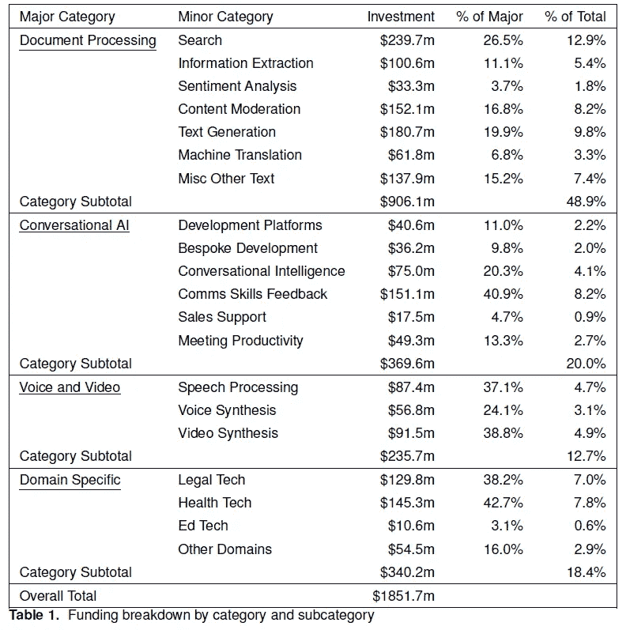

# 2022 年 NLP 初创公司融资情况

> 原文：[`towardsdatascience.com/nlp-startup-funding-in-2022-caad77cb0f0?source=collection_archive---------8-----------------------#2023-01-09`](https://towardsdatascience.com/nlp-startup-funding-in-2022-caad77cb0f0?source=collection_archive---------8-----------------------#2023-01-09)

 [Robert Dale](https://language-technology.medium.com/?source=post_page-----caad77cb0f0--------------------------------)

·

[关注](https://medium.com/m/signin?actionUrl=https%3A%2F%2Fmedium.com%2F_%2Fsubscribe%2Fuser%2Fd37be175c358&operation=register&redirect=https%3A%2F%2Ftowardsdatascience.com%2Fnlp-startup-funding-in-2022-caad77cb0f0&user=Robert+Dale&userId=d37be175c358&source=post_page-d37be175c358----caad77cb0f0---------------------post_header-----------) 发表在 [Towards Data Science](https://towardsdatascience.com/?source=post_page-----caad77cb0f0--------------------------------) ·32 分钟阅读·2023 年 1 月 9 日

--

照片由 [Jason Leung](https://unsplash.com/@ninjason?utm_source=medium&utm_medium=referral) 提供，发布在 [Unsplash](https://unsplash.com/?utm_source=medium&utm_medium=referral)

> NLP 技术的商业应用近年来急剧增长已不是什么秘密。从聊天机器人和虚拟助手到机器翻译和情感分析，NLP 技术现在被广泛应用于各种行业。随着对能够处理人类语言的技术需求的增加，投资者也迫不及待地想要参与其中。本文将回顾过去一年 NLP 初创公司的融资情况，识别出获得投资的应用和领域。

*这篇文章的一个版本将会在* [*《自然语言工程杂志》*](https://www.cambridge.org/core/journals/natural-language-engineering/industry-watch) *于 2023 年初刊登。*

# 1\. 引言

在策划 [*This Week in NLP*](https://www.language-technology.com/twin) 的内容过程中，这是一份关于 NLP 工具和技术商业应用的通讯（免费订阅请 [点击这里](https://www.language-technology.com/twin)！），我跟踪了自然语言处理领域的公司融资和收购情况。在 2022 年，我发现了 340 多个相关的融资事件，从种子轮融资到晚期的 E 轮和 F 轮融资。本文重点关注早期公司：具体而言，是那些报告了种子轮融资、种子轮融资或 A 轮融资的公司。这些公司尚未在市场上建立他们的产品或服务，可以明确地被描述为初创公司；它们对投资者构成了最高风险，同时我们也期望它们能成为创新思想的优秀来源。在我所掌握的数据中，略超过 50%的融资事件发生在种子轮、种子轮或 A 轮阶段；在本文中，我试图对这 173 家公司提供的产品进行一定的组织和结构化，以突显过去十二个月中被认为值得投资的技术和应用领域。

# 2\. 这里的内容

一份包含 170 多家公司的平面列表以及它们的业务内容将会非常难以阅读且缺乏洞察力。因此，本文围绕 NLP 初创公司的分类组织，旨在为对这一领域感兴趣的读者提供帮助。这样一个领域可以有多种结构方式，我并不声称这里使用的分类是唯一的方式；这只是一个对我而言有意义的领域地图，也可能使你更容易确定哪些部分的文章对你最相关。

在理想的世界里，我们可能会选择通过应用类型或应用领域来组织技术产品，将这两者视为两个正交的详尽解决方案。但正如在 [我对 2021 年 NLP 初创公司融资的回顾](https://www.cambridge.org/core/journals/natural-language-engineering/article/nlp-how-to-spend-a-billion-dollars/D2BB59DA4B6FE37CFA6309EC75F22A93) 中所述，我认为采用一种略显不舒服的混合方法更具信息量和实用性，这种方法提取了一种技术类型的层级，但保留了一部分我们审查的公司在应用领域方面的更好组织。因此，本文结构如下：

+   在第三部分中，我们关注那些主要处理文本而非语音的产品和服务：这包括搜索、信息提取、内容审核、文本生成和机器翻译等子类别。

+   在第四部分中，我们关注那些以某种方式涉及对话的应用程序：这里识别的子类别包括开发平台、定制开发提供商、对话智能、沟通技能反馈、销售支持和会议生产力工具。

+   在第五部分中，我们讨论了视听处理，子类别包括语音处理、语音合成和视频合成。

+   在第六部分中，我们考察了领域特定的解决方案，涵盖了法律科技、健康科技、教育科技以及一些只有一两个参与者的松散领域。

+   最后，在第七部分中，我们对该领域的发展方向进行了总结性结论。

如果上面列出的类别都是相互排斥的，那就好了，但实际上并非如此；在各个地方都有交叉和边界模糊，因此你可能不同意我选择将某些公司放在特定类别的位置。特别是，第 3、4 和 5 节中讨论的一些公司本可以被视为领域特定应用，但为了识别活动集群，我认为将它们归类于技术类型下更为有用。

还需要进一步说明一些方法学的评论和一些警告事项。

+   这里呈现的信息来自对约 150 个相关新闻来源的手动和自动处理的综合搜寻。我不太可能捕捉到每一个相关的融资事件，但我相信这些结果是比较全面的；如果你认为我遗漏了一个在 2022 年获得种子轮或 A 轮融资的 NLP 初创公司，请给我发邮件，以便我可以调查遗漏的原因。

+   我认为一家公司的产品或服务提供 NLP 功能，如果语言处理技术在该产品或服务中扮演了重要角色。不可避免地，有些情况处于边缘地带；例如，许多基于网络的产品现在都集成了简单的聊天机器人功能，但我仅在聊天机器人是一个重要功能或具有有趣和创新的功能时，才将其纳入范围。

+   我对公司业务的描述基于写作时对每个公司网站的简要审查。但情况可能迅速变化，公司也可能会显著转型，因此根据你阅读本文的时间，任何给定公司的网站现在可能讲述了不同的故事。此外，我尽量在短时间内提供尽可能多的信息，通常不超过一句话；但也有几个例子，我花了过多的时间和精力在一个网站上，试图明确公司提供的内容，结果未能成功，导致描述不够清晰。

+   对于每家公司，我都标明了公司的成立年份，以及该公司获得了哪些轮次的融资、何时获得融资以及融资金额。所有金额均以美元计，尽管应注意到许多公司位于美国以外，并且获得了其他货币的融资；这里显示的美元等值金额基于撰写时的汇率，因此可能与融资时报告的金额略有不同。

不管怎样，废话不多说。我们开始吧。

# 3\. 文档处理

在行业中使用的术语“文档 AI”通常指的是需要处理文档中的物理格式问题的方法（例如，从表格中提取信息），而“文本处理”通常更关注文档的语言内容，与其物理呈现方式抽象开来。然而，我的印象是，越来越多的解决方案正在将这两种范式结合在一起，因此我在这里将它们视为一个综合类别。

## 3.1 搜索

许多初创公司提供面向开发者的搜索引擎，这些开发者希望将搜索功能添加到他们的项目中。[ZincSearch](https://zincsearch.com/)（成立于 2022 年；种子轮，360 万美元，2022 年 3 月）和[Meilisearch](https://www.meilisearch.com/)（成立于 2018 年；A 轮，1500 万美元，2022 年 10 月）提供可下载的搜索引擎，Meilisearch 还提供完全托管的云版本。[SeMI Technologies](https://semi.technology)（成立于 2019 年；A 轮，1650 万美元，2022 年 2 月），[Hebbia](https://hebbia.ai/)（成立于 2020 年；A 轮，3000 万美元，2022 年 6 月）和[Vectara](https://vectara.com)（成立于 2020 年；种子轮，2000 万美元，2022 年 10 月）强调他们使用向量搜索，也称为神经搜索或语义搜索，这与基于术语索引的旧方法形成对比；[Pinecone Systems](https://www.pinecone.io/)（成立于 2019 年；A 轮，2800 万美元，2022 年 3 月）提供一种可以作为搜索基础设施的向量数据库产品，[Nuclia](https://nuclia.com)（成立于 2019 年；种子轮，540 万美元，2022 年 4 月）是一个端到端的 API，允许团队使用他们自己的向量化和标准化算法，同时提供存储、索引和查询功能。[Deepset](https://deepset.ai)（成立于 2018 年；A 轮，1400 万美元，2022 年 4 月）提供一个开源 NLP 框架 Haystack，帮助开发者为各种搜索用例构建管道，而[Opster](https://opster.com)（成立于 2019 年；A 轮，500 万美元，2022 年 7 月）提供一个自动化和管理企业搜索引擎及数据库的平台。

更大胆的策略是将你的搜索技术定位为对现有技术的替代方案：[You.com](https://you.com)（成立于 2020 年；A 轮，2500 万美元，2022 年 7 月），旨在成为一个开放的搜索平台，允许其他人基于其搜索技术进行开发，包括 AI 驱动的功能，如 YouCode，可以根据搜索查询生成代码，类似于 GitHub 的 Copilot，以及 YouWrite，由 OpenAI 的 GPT-3 驱动，可以生成文章、博客帖子和模板信件。但更常见的是针对特定用例：[Ocean.io](https://ocean.io/)（成立于 2017 年；风险轮，630 万美元，2022 年 1 月）和[Grata](https://grata.com)（成立于 2016 年；A 轮，2500 万美元，2022 年 2 月）都旨在帮助企业找到合适的业务目标；[Vetted](https://vetted.ai)（成立于 2019 年；A 轮，1400 万美元，2022 年 8 月）是一个产品搜索引擎，旨在帮助消费者发现最符合需求的品牌和产品；[Outmind](https://outmind.ai)（成立于 2019 年；种子轮，210 万美元，2022 年 9 月）专注于在各种工作场所应用中跨相关数据的聚合搜索；[Mem](https://get.mem.ai/)（成立于 2021 年；A 轮，2350 万美元，2022 年 11 月）是一个生产力应用程序，能够在用户的笔记中进行搜索；[Hypertype](https://hypertype.co)（成立于 2021 年；前种子轮，130 万美元，2022 年 5 月）搜索电子邮件档案，以自动化新邮件的撰写。

在文本搜索领域之外，[Twelve Labs](https://twelvelabs.io/)（成立于 2021 年；种子轮，500 万美元，2022 年 3 月）提供了一个视频搜索和理解平台，利用语义搜索在大规模视频档案中定位相关场景。

## 3.2 信息提取

提取和汇总信息是许多初创公司的关键关注点：[KnowledgeNet.ai](https://knowledgenet.ai/)（成立于 2021 年；A 轮，940 万美元，2022 年 2 月）旨在通过整合电子邮件、客户关系管理系统、文件存储、职业网络和行业新闻源中的分散对话和数据，来支持交易者和高管；[Ask-AI](https://www.ask-ai.com)（成立于 2021 年；种子轮，900 万美元，2022 年 10 月）汇总了大量文本公司知识来源和客户沟通，通过问答界面使数据变得易于访问。

现在，通用工作流自动化产品中包含某种程度的文档 AI 能力已相当普遍。[NanoNets](https://nanonets.com)（成立于 2017 年；A 轮融资，1000 万美元，2022 年 2 月）允许开发者创建可以从文档中提取数据并自动填充数据库的机器学习模型；[Krista](https://kristasoft.com)（成立于 2016 年；A 轮融资，1500 万美元，2022 年 2 月）强调其低代码自动化平台的对话性质；而[Alkymi](https://www.alkymi.io)（成立于 2017 年；A 轮融资，2100 万美元，2022 年 10 月）提供一个统一的平台，从各种不同的非结构化数据源中提取数据，并提供大量“蓝图”用于常见文档类型。

一些信息提取产品的关注点更为狭窄：[Neuron7.ai](https://www.neuron7.ai/)（成立于 2020 年；A 轮融资，1000 万美元，2022 年 6 月）将自己定位为服务智能平台，利用技术从组织中的数据和人员中提取信息，并利用这种“集体智能”帮助人们诊断和解决客户问题；[Sensible](https://www.sensible.so)（成立于 2020 年；种子轮融资，650 万美元，2022 年 11 月）提供一个文档编排平台，提供预先构建的模板，用于从 150 多种保险文档类型中提取数据；[Stimulus](https://www.getstimulus.io/)（成立于 2017 年；种子轮融资，250 万美元，2022 年 8 月）是一个关系智能平台，利用数据和分析通过专有的评分机制帮助公司做出更好的采购决策；[Prophia](https://www.prophia.com)（成立于 2018 年；A 轮融资，1020 万美元，2022 年 12 月）的平台搜寻商业房地产合同，并提取关键条款，如平方英尺和租赁日期；以及[theGist](https://www.thegist.ai/)（成立于 2022 年；前种子轮融资，700 万美元，2022 年 11 月）的首款产品 theGist for Slack，提供 Slack 讨论的结构化、个性化摘要，过滤噪音，以免员工错过重要信息。

## 3.3 情感分析

情感分析仍然吸引着新的初创公司，通常是在评估和衡量消费者或用户反馈的背景下。一个常见的焦点是通过多渠道或来源聚合和分类反馈，现在使用 AI 模型：[Viable](https://askviable.com)（成立于 2020 年；种子轮，500 万美元，2022 年 5 月）在后台使用 GPT-3，提供综合反馈的书面分析服务，以及对反馈的自然语言查询；[Idiomatic](https://idiomatic.com)（成立于 2016 年；种子轮，400 万美元，2022 年 5 月）使用为每个特定业务案例量身定制的模型来分类反馈；[Spiral](https://www.spiralup.co)（成立于 2018 年；种子轮，130 万美元，2022 年 11 月）将其反馈技术出售给中大型公司，涉及银行、金融科技、连接设备和保险行业。[Lang](https://www.lang.ai/)（成立于 2018 年；A 轮，1050 万美元，2022 年 5 月）、[Unwrap](https://www.unwrap.ai/)（成立于 2021 年；种子轮，320 万美元，2022 年 7 月）和[Sturdy AI](https://www.sturdy.ai)（成立于 2019 年；种子轮，310 万美元，2022 年 6 月）也类似地对检测到的问题和关注点进行分类，并提供各种形式的分析。

一个相关的重点是品牌管理：[My Telescope](https://www.mytelescope.io)（成立于 2018 年；前种子轮，260 万美元，2022 年 3 月）是一个市场情报和搜索平台，为营销人员和品牌提供市场趋势、品牌强度和活动效果的长期影响预测，[Knit](https://goknit.com/)（成立于 2015 年；种子轮，360 万美元，2022 年 6 月）通过年轻消费者网络提供基于视频反馈和定量调查的详细消费者洞察；该公司的视频分析 AI 声称能在几分钟内分析数小时的视频反馈。

## 3.4 内容审核

尽管以上讨论的技术类别在一定程度上是传统和长期存在的，但“内容审核”是一个近年来才出现的类别，并且随着对虚假信息和有害语言使用问题的关注增加，预计将会增长。

[Fairwords](https://www.fairwords.com)（成立于 2014 年；A 轮融资，530 万美元，2022 年 2 月）使用类似拼写检查的界面，提醒用户在输入时有害语言，并提供该语言可能被解释的信息；该软件还可以检测贿赂和腐败、串通及歧视的迹象；[mpathic](https://www.mpathic.ai)（成立于 2021 年；种子轮融资，400 万美元，2022 年 6 月）类似地帮助员工识别沟通中的潜在误解或曲解，并实时调整；[Checkstep](https://www.checkstep.com/)（成立于 2020 年；种子轮融资，500 万美元，2022 年 5 月）专注于虚假信息、仇恨言论、儿童性虐待材料（CSAM）、欺凌和垃圾邮件，同时具有版权侵权管理功能；[Areto Labs](https://www.aretolabs.com)（成立于 2020 年；前种子轮融资，73 万美元，2022 年 6 月）帮助公司识别和监控在线滥用，并通过自动化反制措施，如静音、封锁和举报负责的账户，处理这些问题；[Modulate](https://modulate.ai/)（成立于 2017 年；A 轮融资，3000 万美元，2022 年 8 月）是 ToxMod 的开发者，这是一种用于实时视频游戏语音聊天中检测和处理暴力或其他冒犯性言论的工具。[Diversio](https://www.diversio.com)（成立于 2018 年；A 轮融资，600 万美元，2022 年 1 月）衡量和跟踪关于多样性、公平性和包容性的语言，识别员工编写文本中的“包容性痛点”。

[VineSight](https://www.vinesight.com)（成立于 2018 年；种子轮融资，400 万美元，2022 年 9 月）跟踪、分析并减轻针对品牌、活动和事业的在线虚假信息和毒性；[Alethea](https://www.aletheagroup.com/)（成立于 2019 年；A 轮融资，1000 万美元，2022 年 11 月）检测和减轻虚假信息和社交媒体操控的实例；[Logically](https://www.logically.ai/)（成立于 2017 年；A 轮融资，2400 万美元，2022 年 3 月）将人工智能与专家分析师结合，发现、筛选和应对信息威胁；[Pendulum](https://www.pendulumfn.com/)（成立于 2021 年；种子轮融资，590 万美元，2022 年 1 月）的平台利用“叙事跟踪”在多种媒体中揭示叙事形成初期的威胁和机会，并跟踪其在网上传播的情况。

相关领域之一是隐私管理：[Redactable](https://www.redactable.com)（成立于 2018 年；种子轮，120 万美元，2022 年 5 月）和[Private AI](https://www.private-ai.com)（成立于 2019 年；A 轮，800 万美元，2022 年 11 月）自动检测文档中的个人可识别信息（PII）并进行删除；[Lightbeam.ai](https://www.lightbeam.ai)（成立于 2020 年；种子轮，450 万美元，2022 年 4 月）尝试识别信息所属的具体客户或身份，以便安全团队可以更有效地自动化保护这些数据；[Protopia AI](https://www.protopia.ai)（成立于 2020 年；种子轮，200 万美元，2022 年 12 月）专注于数据在机器学习推理过程中使用时的风险，通过模糊化个人信息来避免信息被识别或泄露给未经授权的第三方。

另一个相关领域是风险管理。[Shield](https://www.shieldfc.com/)（成立于 2018 年；A 轮，1500 万美元，2022 年 1 月）为合规团队提供了一个工作场所智能平台：其技术利用 NLP 来检测员工沟通渠道中的行为违规，如市场操控；[Concentric AI](https://www.concentric.ai)（成立于 2018 年；A 轮，1450 万美元，2022 年 5 月）识别并分类敏感信息，通过一种叫做‘风险距离’的度量来评估风险并解决安全问题；[VISO Trust](https://www.visotrust.com/)（成立于 2020 年；A 轮，1100 万美元，2022 年 3 月）是一个安全尽职调查平台，通过使用文档启发式方法、NLP 和 ML 自动化编制第三方网络风险数据的过程。这些是公司内部关注的解决方案；另一方面，[KYP](https://kyp.io/)（成立于 2021 年；种子轮，96 万美元，2022 年 10 月）是一个第三方风险情报平台，旨在提供业务所依赖的合作伙伴的完整情况。

## 3.5 文本生成

如果你错过了最近对生成性 AI 的强烈关注，尤其是大语言模型在文本预测中的应用，那你真是与世隔绝了。今年在这一领域最引人注目的初创公司是内容平台[Jasper](https://jasper.ai)（成立于 2021 年；A 轮，1.25 亿美元，2022 年 10 月）；这是我所知 2022 年最大的一次单笔 NLP 初创公司融资事件。此外，还有[Regie.ai](https://www.regie.ai/)（成立于 2020 年；种子轮，480 万美元，2022 年 6 月），其 GPT-3 驱动的文案写作平台专注于销售和营销团队。

仍在吸引资金的解决方案中，有些似乎基于较旧的文本生成方法：[Linguix](https://linguix.com/)（成立于 2018 年；Pre-seed 轮融资，100 万美元，2022 年 2 月）是一个写作助手，提供拼写和语法检查以及文本重写和各种评分指标；[Magical](https://www.getmagical.com)（成立于 2020 年；A 轮融资，3500 万美元，2022 年 6 月）是一个类似文本扩展器的生产力工具，软件可以检测网页上的元素，并允许创建自定义缩写以移动相应的文本。[QorusDocs](https://www.qorusdocs.com)（成立于 2012 年；风险投资轮融资，1000 万美元，2022 年 10 月）是一个基于云的提案管理软件，简化 RFP 响应并自动生成提案；该软件利用 NLP 技术通过从公司文档档案中选择最重要和相关的内容来简化 RFP 响应过程。

相关的还有[Mintlify](https://mintlify.com)（成立于 2020 年；种子轮融资，280 万美元，2022 年 5 月），其平台读取代码并创建文档以解释代码，并检测用户如何与文档互动以提高其可读性；以及[Findable](https://www.findable.no)（成立于 2020 年；种子轮融资，210 万美元，2022 年 6 月），其技术通过分析标题、图片和图纸来自动化建筑文档的组织。

## 3.6 机器翻译

[Language I/O](https://languageio.com)（成立于 2011 年；A 轮融资，650 万美元，2022 年 1 月）提供一个翻译平台，允许客户用超过 100 种语言提供实时客户支持；[Viva Translate](https://www.vivatranslate.com)（成立于 2020 年；种子轮融资，400 万美元，2022 年 2 月）是一个跨语言翻译工具，专注于自由职业者与客户沟通中的翻译；[Weglot](https://weglot.com)（成立于 2016 年；A 轮融资，4800 万美元，2022 年 3 月）是一个无代码网站本地化技术提供商，其平台支持通过后期编辑功能进行人工优化；[XL8](https://XL8.ai)（成立于 2019 年；Pre-Series A 轮融资，300 万美元，2022 年 7 月）提供优化的媒体内容机器翻译技术，包括合成配音或语音覆盖；以及[WritePath](https://www.writepath.co/)（成立于 2009 年；种子轮融资，34 万美元，2022 年 12 月），是一个基于云的 B2B 翻译平台，针对商业、ESG 和投资者关系披露。

## 3.7 其他杂项应用

还有一些公司以不同方式处理自然语言文本输入，但这些公司并不完全符合上述已经扩展的类别。在文本到图像领域，有视觉艺术初创公司 [Stability AI](https://www.stability.ai)（成立于 2019 年；种子轮，1.07 亿美元，2022 年 10 月），该公司是 Stable Diffusion 的背后团队。[Spiritt](https://spiritt.io/)（成立于 2020 年；前种子轮，550 万美元，2022 年 7 月）将文本描述转化为应用，通过与聊天机器人的对话获取所需的信息。[Zenlytic](https://zenlytic.com/)（成立于 2018 年；种子轮，540 万美元，2022 年 11 月）是一款无代码商业智能工具，提供自然语言界面。还有 [Unlikely AI](https://unlikely.ai/)（成立于 2018 年；种子轮，2000 万美元，2022 年 9 月），他们以追求大型神经网络的替代方案为噱头，推出了他们的第一个产品——一个解决和解释隐晦填字谜的应用。

# 4\. 对话 AI

## 4.1 开发平台

市场上似乎仍然有空间容纳新的自助式对话 AI 开发平台。其中一些平台专注于基于文本的聊天机器人开发：[Druid](https://www.druidai.com)（成立于 2018 年；A 轮，1500 万美元，2022 年 5 月）和 [OpenDialog AI](https://opendialog.ai/)（成立于 2019 年；种子轮，480 万美元，2022 年 5 月）提供无代码聊天机器人创建平台；[Zowie](https://zowie.ai)（成立于 2019 年；种子轮，500 万美元，2022 年 1 月）针对在线销售的企业，将无代码自动化能力与一套工具结合，允许客服人员提供个性化服务和产品推荐。

其他公司增加了语音功能：[NLX](https://nlx.ai)（成立于 2018 年；种子轮，500 万美元，2022 年 1 月）和 [Parloa](https://parloa.com)（成立于 2017 年；种子轮，425 万美元，2022 年 5 月）提供无代码/低代码平台，用于自动化包括电话和聊天在内的全渠道客户服务，[Flip CX](https://flipcx.com)（最初为 RedRoute；成立于 2017 年；种子轮，650 万美元，2022 年 2 月）强调能够处理语音电话的重要性，提供易于使用的配置工具，利用已经设计好的呼叫流程模式。

## 4.2 定制开发

也有不少新兴公司会利用他们自己的平台和工具集为你构建对话应用程序。[Futr](https://futr.ai/)（成立于 2017 年；种子轮融资，250 万美元，2022 年 4 月）强调其平台支持所有社交渠道的多语言实时聊天；[Tenyx](https://www.tenyx.com)（成立于 2021 年；种子轮融资，1500 万美元，2022 年 5 月）利用所谓的‘神经科学启发’人工智能构建基于语音的虚拟客服代理；[Curious Thing](https://www.curiousthing.io)（成立于 2018 年；种子轮融资，470 万美元，2022 年 5 月），其技术之前专注于人力资源相关的互动，现在转向提供更广泛的语音驱动对话人工智能解决方案，包括入站和出站电话；而[Tymely](https://www.tymely.ai)（成立于 2020 年；种子轮融资，700 万美元，2022 年 9 月）则使用 AI-人类混合技术来自动化客户服务能力，每个机器生成的响应都由人工代理进行验证。

[Chatdesk](https://chatdesk.com/)（成立于 2016 年；A 轮融资，700 万美元，2022 年 1 月）有一个有趣的模式：完全摒弃聊天机器人，它寻找、招聘和培训品牌的‘超级粉丝’成为‘Chatdesk 专家’，并在后台使用机器学习分析之前的支持消息，创建一个符合品牌的知识库，使这些超级粉丝能够以品牌的声音和政策回应客户问题。

## 4.3 对话智能

继续几年来一直可见的趋势，一些公司提供技术，对对话互动进行某种形式的分析，无论这些互动涉及虚拟代理还是人工代理。

[Wiz.ai](https://www.wiz.ai)（成立于 2019 年；A 轮，2000 万美元，2022 年 1 月），专注于东南亚语言的对话 AI，使用前端对话机器人鼓励客户参与对话，同时后端实时筛选数据并将对话中的洞察存储到公司的现有 CRM 系统中以供后续分析；[Talkmap](https://talkmap.com/)（成立于 2017 年；A 轮，800 万美元，2022 年 2 月）对与客户的互动进行标记、结构化和分析，旨在提供接近实时的对话洞察；[Affogata](https://affogata.com)（成立于 2018 年；种子轮，950 万美元，2022 年 3 月）提供一个语音分析平台，允许企业识别异常模式，以简化实时响应并采取预防措施；[Winn.AI](https://winn.ai/)（成立于 2021 年；种子轮，1700 万美元，2022 年 9 月）监控销售通话，自动跟踪、捕获和更新 CRM 条目，减少销售人员自行记笔记的需求；[Operative Intelligence](https://www.operativeintelligence.com)（成立于 2021 年；种子轮，350 万美元，2022 年 12 月）提供旨在帮助呼叫中心操作员克服对客户联系原因的误解的技术，通过识别真实原因来减少等待时间并改善问题解决。[Jiminny](https://www.jiminny.com)（成立于 2016 年；A 轮，1700 万美元，2022 年 8 月）是一个对话智能平台，分析视频中的情绪，自动评分通话互动并生成实时洞察。

## 4.4 沟通技巧反馈

对人类代理对话贡献的分析，以提供关于沟通技巧的反馈，可以被视为一种特定形式的对话智能。

[Abstrakt](https://abstrakt.ai/)（成立于 2020 年；前种子轮，12 万美元，2022 年 3 月）提供实时电话辅导，监听通话并提出有用的建议；[Klaus](https://www.klausapp.com/)（成立于 2017 年；A 轮，1200 万美元，2022 年 9 月）通过跟踪各种沟通 KPI 来辅导代理，识别辅导机会并衡量支持质量。

[Call Simulator](https://www.callsimulator.com/)（成立于 2021 年；种子轮，57.5 万美元，2022 年 1 月）是一个对话模拟平台，旨在为呼叫中心代理准备现实场景；[Second Nature](https://secondnature.ai/)（成立于 2018 年；A 轮，1250 万美元，2022 年 1 月）提供一个模拟器，通过与销售代表对话的虚拟角色来测量代表们对关键话题的覆盖深度。

更广泛地说，[Yoodli](https://www.yoodli.ai/)（成立于 2021 年；种子轮，600 万美元，2022 年 8 月）分析语音以提供改进沟通技能的建议：该平台为用户提供文字记录，并分析填充词的使用、非包容性语言、节奏、肢体语言和其他可操作的见解。该公司最近与 [Toastmasters International 达成协议，为其提供演讲辅导](https://mediacenter.toastmasters.org/2022-09-08-Toastmasters-International-Partners-with-AI-powered-Public-Speaking-Platform,-Yoodli)，这是一个知名的公众演讲和领导力培训组织。

## 4.5 销售支持

还有许多公司提供各种形式的我们在这里称之为销售支持的服务。[Tactic](https://tactic.fyi)（成立于 2020 年；种子轮，450 万美元，2022 年 3 月）通过允许销售和营销人员用普通语言询问客户和市场数据，并应用过滤器以优先排序和排名结果来自动化客户和市场研究；[Connectly.ai](https://www.connectly.ai)（成立于 2020 年；种子轮，金额未公开，2022 年 7 月）是一个无需编码的工具，允许企业通过 AI 驱动的“小型机器人”创建和发送互动和个性化的营销活动；[Demoleap](https://www.demoleap.com/)（成立于 2020 年；种子轮，440 万美元，2022 年 8 月）是一个现场演示助手和销售发现平台，指导销售人员在现场演示过程中遵循销售流程；[Heyday](https://heyday.ai/)（成立于 2021 年；种子轮，650 万美元，2022 年 6 月）是一个用于零售商的对话 AI 平台，自动化 FAQ；[AdTonos](https://www.adtonos.com)（成立于 2016 年；种子轮，210 万美元，2022 年 8 月）通过其 YoursTruly 平台通过智能音响和移动设备播放互动广告来货币化音频流。

## 4.6 会议生产力工具

由于 Covid 驱动的虚拟会议平台（如 Zoom 和 Teams）的使用增加，出现了一个相对较新的工具类别市场，这些工具旨在支持会议生产力；在许多方面，这些工具是对在对话智能背景下开发的工具和技术的重新利用。

[Sembly AI](https://www.sembly.ai/)（成立于 2019 年；种子轮，金额未公开，2022 年 3 月）、[Headroom](https://www.goheadroom.com/)（成立于 2020 年；种子轮，900 万美元，2022 年 8 月）、[Xembly](https://www.xembly.com/)（成立于 2020 年；A 轮，1500 万美元，2022 年 10 月）、[Fathom](https://fathom.video/)（成立于 2020 年；种子轮，470 万美元，2022 年 11 月）和 [tl;dv](https://www.tldv.io/)（成立于 2020 年；种子轮，460 万美元，2022 年 6 月）都提供一些功能组合，用于转录和分析会议，提取主题和行动项目，以及生成摘要和会议记录。

[Airgram](https://www.airgram.io/)（成立于 2020 年；A 轮融资，1000 万美元，2022 年 8 月）是一款音视频录制工具，可以设置为自动加入预定的 Zoom、Google Meet 或 Microsoft Teams 会议，在用户不在场时进行录制；该工具提供灵活的播放选项，并配有转录、话题检测和行动项识别功能；[Amy](https://myamy.io/)（成立于 2019 年；种子轮融资，600 万美元，2022 年 6 月）是一个销售智能平台，旨在通过利用公开的潜在客户信息来简化会议准备，将这些数据转化为会议简报，提供对潜在客户的有价值洞察。

# 5.2 音视频处理

我们引入这一类别以涵盖语音技术除支持对话式人工智能之外的应用，同时也包括与视频结合使用的情况。

## 5.1 语音处理

[NeuralSpace](https://www.neuralspace.ai/)（成立于 2019 年；种子轮融资，170 万美元，2022 年 2 月）专注于低资源语言的语音技术开发，提供覆盖 90 多种语言的自助工具包，并包括自动语言检测；[Ava](https://www.ava.me/)（成立于 2014 年；A 轮融资，1000 万美元，2022 年 3 月）是一款实时字幕平台，能够在会议或视频中听取音频，为听障人士提供字幕，并标记每条字幕的发言者；[Sounder](https://sounder.fm/)（成立于 2019 年；A 轮融资，770 万美元，2022 年 2 月）是一款端到端的播客管理平台，涵盖品牌安全和品牌适宜性分析、话题分析、内容总结和动态分段；[AssemblyAI](https://www.assemblyai.com/)（成立于 2017 年；A 轮融资，2800 万美元，2022 年 3 月）提供一组基于 LLM 的“音频智能”API，用于转录和理解音频数据，应用包括内容审核、情感检测、总结和个人信息遮盖。

[Sanas](https://sanas.ai)（成立于 2020 年；A 轮融资，3200 万美元，2022 年 6 月）提供实时口音翻译，帮助多语言用户通过口音矫正实现清晰沟通；[Namecoach](https://cloud.name-coach.com)（成立于 2014 年；A 轮融资，800 万美元，2022 年 11 月）提供嵌入上下文感知音频姓名发音按钮的软件，使用户能够自信地发音。

## 5.3 语音合成

[Murf AI](https://murf.ai)（成立于 2020 年；A 轮融资，1000 万美元，2022 年 9 月）是一家合成语音技术初创公司，开发逼真的 AI 语音用于播客、幻灯片演示和专业演讲，拥有 120 多种语言的精选语音库。在具体应用层面，[ping](https://www.pingLOUD.com)（成立于 2016 年；种子轮融资，500 万美元，2022 年 6 月）允许商业司机听到他们的智能手机消息和电子邮件以超过 105 种语言朗读。

语音合成的一大用途是在其他语言中进行音频配音。[Dubverse](https://dubverse.ai/)（成立于 2021 年；种子轮，80 万美元，2022 年 6 月）是一个自动化配音平台，允许用户几乎实时地将视频配音成多种语言，目前支持 10 种印度语言和 20 种“全球”语言；[Dubdub](https://www.dubdub.ai/)（成立于 2021 年；种子轮，100 万美元，2022 年 9 月）使用人工智能和机器学习为企业创建多语言视频内容，覆盖 40 种语言；[Deepdub](https://deepdub.ai)（成立于 2019 年；A 轮，2000 万美元，2022 年 2 月）提供娱乐内容的配音服务，使用合成的原演员声音版本，使配音版本听起来更像原版；[Papercup](https://www.papercup.com/)（成立于 2017 年；A 轮，2000 万美元，2022 年 6 月）类似地通过生成听起来像原讲者的声音来翻译视频。这些应用通常提供一个人工环节功能，专业翻译人员可以执行质量检查，编辑和修订翻译及语音，以提高质量。

## 5.3 视频合成

我们在此包含了那些专注于视频输出创作的公司，因为这些公司通常也涉及语音合成。

[Pictory](https://pictory.ai)（成立于 2019 年；种子轮，210 万美元，2022 年 1 月）将长形式内容如网络研讨会、博客和白皮书转换为短社交视频；[ShortTok](https://shorttok.com/)（成立于 2021 年；前种子轮，未披露金额，2022 年 10 月）开发自动化视觉讲故事技术，从客户的视频和多模态内容库中创建短视频；[Peech](https://www.peech-ai.com/)（成立于 2020 年；种子轮，830 万美元，2022 年 8 月）提供一个视频编辑工具，专为内容营销团队设计，可以自动合成与内容匹配的品牌视觉，并去除填充词；[Rephrase.ai](https://rephrase.ai/)（成立于 2019 年；A 轮，1060 万美元，2022 年 9 月）也为营销和内容团队构建生成式人工智能工具，用于合成视频制作。

一种特定形式的视频合成是虚拟角色的生成。[Metaphysic](https://metaphysic.ai)（成立于 2021 年；种子轮，750 万美元，2022 年 1 月），这家公司以其[汤姆·克鲁斯深度伪造](https://www.youtube.com/watch?v=iyiOVUbsPcM)而闻名，开发用于创建可以融入元宇宙的数字头像的工具；[Inworld AI](https://inworld.ai)（成立于 2021 年；种子轮，1250 万美元，2022 年 3 月）是另一个创建人工智能驱动的虚拟角色、沉浸式现实和元宇宙空间的平台，使非技术用户能够通过自然语言描述来创建角色个性；[Deep Voodoo](https://www.deepvoodoo.com/)（成立于 2020 年；种子轮，2000 万美元，2022 年 12 月）是由《南方公园》创作者特雷·帕克和马特·斯通创办的深度伪造初创公司。

[Speech Graphics](https://www.speech-graphics.com/)（成立于 2010 年；A 轮，700 万美元，2022 年 2 月）提供基于音频的面部动画技术，使游戏和其他应用中的动画角色在讲话时能够正确地移动嘴巴；[Hour One](https://www.hourone.ai/)（成立于 2019 年；A 轮，2000 万美元，2022 年 4 月）的技术将人类转化为虚拟人类角色，这些角色可以以逼真的表现力被激活。[Carter](http://www.carterapi.com/)（成立于 2022 年；种子轮，200 万美元，2022 年 12 月）正在研发对话式 AI，以帮助游戏开发者使计算机化的游戏角色更具生动性。[NeuralGarage](https://www.neuralgarage.com)（成立于 2021 年；种子轮，150 万美元，2022 年 11 月）是一个视频配音平台：给定音频输入和人脸，它会将人的唇部和下巴动作转化为匹配的语言，无论语言是什么。

# 6\. 领域特定解决方案

## 6.1 法律技术

法律与语言密切相关，因此法律技术长期以来一直是语言处理技术应用的重要领域。

一个受欢迎的领域是文档分析和审查，其中 AI 支持的分析可以减少传统手动处理所需的大量时间。[TermScout](https://termscout.com)（成立于 2018 年；种子轮，500 万美元，2022 年 5 月）从合同中提取关键信息，以便于审查、评级和与行业标准的比较；[Terzo](https://www.terzocloud.com)（成立于 2020 年；A 轮，1630 万美元，2022 年 11 月）从合同中提取关键数据，帮助组织优化其供应商和客户关系中的支出和收入；[Nammu21](https://nammu21.com)（成立于 2017 年；A 轮，1580 万美元，2022 年 10 月）将贷款文件拆解成结构化数据；[Summize](https://summize.com)（成立于 2018 年；A 轮，600 万美元，2022 年 10 月）是一种合同审查解决方案，旨在通过与 Teams、MS Word 和 Slack 的集成来改善内部法律部门与业务用户之间的协作；以及 [Della](https://www.dellalegal.com/)（成立于 2018 年；种子轮，250 万美元，2022 年 3 月）专注于复杂的单一文档，而不是大型文档审查项目。[Zero](https://zerosystems.com/)（成立于 2014 年；A 轮，1200 万美元，2022 年 3 月）是基于 iOS 移动设备的生产力工具，集成了电子邮件收件箱和文档管理系统，提取关键信息，如可计费的交互，并自动将电子邮件归档到文件夹中。

另一个热门领域是提供法律文件起草支持。[Henchman](https://www.henchman.io/)（成立于 2020 年；种子轮，320 万美元，2022 年 2 月）是一个合同起草初创公司，提供一个 Microsoft Word 插件，在你工作时从公司的数据库中建议条款；[LexCheck](https://www.lexcheck.com/)（成立于 2015 年；种子轮，500 万美元，2022 年 3 月）提供一个合同谈判解决方案，分析合同以建立问题清单和合同语言修订；[Harvey](https://harvey.ai/)（成立于 2022 年；种子轮，500 万美元，2022 年 11 月）使用 GPT-3 根据任务描述为律师起草文档；该应用还可以回答法律问题。

许多公司将这些审查和起草功能与其他活动结合起来，以提供更全面的法律自动化平台。[Uhura Solutions](https://uhurasolutions.com/)（成立于 2018 年；种子轮，180 万美元，2022 年 4 月）是一个低代码合同智能平台，使用 NLP 来简化合同和协议的分析及起草过程；[Goodlegal](https://goodlegal.io/)（成立于 2021 年；前种子轮，130 万美元，2022 年 11 月）提供一套自动化工具，包括一个用于构建法律文本的拖放编辑器，并能够检查每个法律文本是否符合合法标准；[PocketLaw](https://pocketlaw.com)（成立于 2018 年；A 轮，1060 万美元，2022 年 5 月）是一个主要面向中小企业的合同自动化 SaaS 法律技术平台；[Klarity](https://www.tryklarity.com)（成立于 2017 年；A 轮，1800 万美元，2022 年 1 月）为财务和会计团队提供自动化文档处理和管理平台；[Josef](https://joseflegal.com)（成立于 2017 年；种子轮，520 万美元，2022 年 11 月）是一个无代码软件平台，允许法律专业人士自动化重复任务，包括文档起草、提供法律指导和建议，并构建客户访谈的机器人。[Legal OS](https://legalos.io)（成立于 2018 年；种子轮，700 万美元，2022 年 1 月）是一个无代码法律自动化平台，将专家知识转化为数字知识图谱，之后可以用来构建各种法律产品和流程。

还有一些法律科技解决方案不完全符合上述类别。[Alchemy Machines](https://www.alchemymachines.ai/)（成立于 2021 年；种子轮，40 万美元，2022 年 3 月）使用 NLP 和语音识别转录、分析和总结法律特定的网络会议和电话；[Neur.on](https://neur-on.ai/)（成立于 2022 年；种子轮，170 万美元，2022 年 8 月）为法律专业人士提供定制的机器翻译解决方案；[Ex Parte](https://exparte.com)（成立于 2017 年；A 轮，750 万美元，2022 年 2 月）使用机器学习预测诉讼结果，推荐客户可以采取的行动以优化胜诉机会；而[Proof Technology](https://www.proofserve.com)（成立于 2017 年；A 轮，550 万美元，2022 年 3 月）是一个相当独特的端到端解决方案，分析法院文件以提取案件标题信息，确定离被告或证人地址最近的送达人员，远程打印相关材料，并捕捉有关送达尝试的照片和描述数据。

## 6.2 健康科技

另一个与 NLP 有长期关系的领域是健康科技。这里的两个关键领域是医疗环境中对话式 AI 的使用以及医疗记录的处理。

在对话式 AI 方面，[HeyRenee](https://renee.com/)（成立于 2021 年；种子轮，440 万美元，2022 年 1 月）是一个以患者为中心的个人健康助理，可以提醒用户需要服用的药物，监测健康指标，处理处方续药，并安排与医生的虚拟或面对面访谈；[Apowiser](https://www.apowiser.com)（成立于 2021 年；种子轮，150 万美元，2022 年 6 月）制作了 PharmAssist，一个基于聊天机器人的系统，用于支持客户在线购买非处方药，识别需要升级到医疗服务提供者的问题，以及检查对 OTC 药物成分的过敏和潜在敏感性；[BirchAI](https://birch.ai)（成立于 2020 年；种子轮，310 万美元，2022 年 1 月）旨在通过总结和分析客户与代表之间电话交谈的内容，简化医疗公司的客户支持；[WhizAI](https://whiz.ai/)（成立于 2017 年；A 轮，800 万美元，2022 年 9 月）提供了一个面向生命科学和医疗行业的分析平台的对话接口；而[Kahun](https://kahun.com/)（成立于 2018 年；种子轮，800 万美元，2022 年 9 月）开发了一个临床评估聊天机器人，基于公司超过 3000 万条证据基础的医学见解地图。

关于医疗记录处理，[DigitalOwl](https://www.digitalowl.com/)（成立于 2017 年；A 轮融资，2000 万美元，2022 年 1 月）提供一个医疗记录分析平台，能够从大量文档中提取相关信息；[Dyania Health](https://www.dyaniahealth.com)（成立于 2019 年；种子轮融资，530 万美元，2022 年 9 月）提供一个 NLP 平台，执行疾病专用的临床文本提取；[Wisedocs](https://www.wisedocs.ai)（成立于 2018 年；种子轮融资，300 万美元，2022 年 3 月）使用智能字符识别技术读取和分析各种医疗记录审查相关文档；[XpertDox](https://www.xpertdox.com/)（成立于 2015 年；种子轮融资，150 万美元，2022 年 8 月）开发了 XpertCoding 工具，该工具利用 AI 自动编码医疗索赔。[DeepScribe](https://www.deepscribe.ai)（成立于 2017 年；A 轮融资，3000 万美元，2022 年 1 月）是一种环境医疗抄写员，记录医生与患者的对话，汇总并将其整合到健康记录系统中；[Abridge](https://www.abridge.com)（成立于 2018 年；A 轮融资，1250 万美元，2022 年 8 月）是一家对话 AI 初创公司，结构化并总结医生和患者的医疗对话，帮助填充健康记录中的相关信息；[Eleos Health](https://www.eleos.health/)（成立于 2019 年；A 轮融资，2000 万美元，2022 年 4 月）构建了在行为健康临床医师与患者对话背景中环境运行的临床应用，生成会后临床进展记录和保险编码。

最后，一些不符合上述类别的健康科技初创公司：[Kintsugi](https://kintsugihealth.com)（成立于 2019 年；A 轮融资，2000 万美元，2022 年 2 月）利用机器学习和声音生物标志物检测临床抑郁症和焦虑的迹象；[Marigold Health](https://www.marigoldhealth.com/)（成立于 2016 年；种子轮融资，600 万美元，2022 年 2 月）通过聊天支持小组帮助从物质使用或心理健康状况中恢复的个人，NLP 辅助同行管理他们的在线社区；以及 [WeWalk](https://www.wewalk.io/)（成立于 2019 年；资助，200 万美元，2022 年 7 月）是一家为视障人士开发智能手杖的初创公司：其语音助手可以回答有关用户位置、附近公共交通、识别附近建筑物和地标、预约 Uber，并提供适合视力有限或无视力者的实时步行导航。

## 6.3 其他领域

第三个领域是教育技术。[FoondaMate](https://foondamate.com/)（成立于 2020 年；种子轮融资，200 万美元，2022 年 5 月）是一个聊天机器人，通过 Facebook 和 WhatsApp 让发展中国家的学生可以提问，从而使教育变得更加可及； [Prof Jim](https://www.profjim.com/)（成立于 2020 年；种子轮融资，110 万美元，2022 年 1 月）与教科书出版商和教育提供商合作，将教科书和其他文本学习材料转化为在线课程，包括自动生成的评估和头像讲师； [Language Confidence](https://www.languageconfidence.ai/)（成立于 2016 年；种子轮融资，150 万美元，2022 年 3 月）提供一个 API，监听学生并评估和纠正他们的英语发音，提供视觉反馈； [Copyleaks](https://www.copyleaks.com)（成立于 2015 年；A 轮融资，600 万美元，2022 年 5 月）是一个抄袭检测解决方案，能够识别和跟踪 100 多种语言的在线抄袭内容。

还有一系列其他针对不同领域的应用：

+   金融服务： [Aviva](https://www.avivacredito.com/)（成立于 2022 年；种子轮融资，220 万美元，2022 年 12 月）使用自然语言处理将客户的口语与实时信用申请中的字段匹配； [Webio](https://webio.com)（成立于 2016 年；A 轮融资，400 万美元，2022 年 6 月）为信用、催收和支付业务提供无代码对话式人工智能平台，允许客户提问、改变付款日期或安排新的还款计划。

+   房地产：[DOSS](https://www.AskDoss.com)（成立于 2015 年；种子轮融资，金额未公开，2022 年 10 月）提供一个对话助手，允许客户咨询房地产建议和提示，搜索房源，并获取邻里信息和近期销售数据。

+   DevOps： [Kubiya](https://www.kubiya.ai/)（成立于 2022 年；种子轮融资，600 万美元，2022 年 10 月）为 DevOps 团队提供对话式人工智能解决方案，允许用户用自然语言表达意图，并让虚拟助手自动化简单和繁琐的任务。

+   无桌面工作环境： [Datch](https://www.datch.io)（成立于 2018 年；A 轮融资，1000 万美元，2022 年 7 月）在工业环境中作为智能语音接口运作。

+   零售：[Evabot](https://www.evabot.ai/)（成立于 2016 年；A 轮融资，830 万美元，2022 年 7 月）为企业礼品提供创意，通过聊天机器人管理的问卷建议最适合用户客户的礼物；它还利用 GPT-3 为每个礼物撰写个性化的‘手写’笔记。

+   餐馆：[Valyant AI](https://www.valyant.ai/)（成立于 2017 年；种子轮，400 万美元，2022 年 4 月）开发了一个用于餐馆、零售和服务行业的专有对话 AI 平台；[ConverseNow](https://www.conversenow.ai/)（成立于 2018 年；A 轮融资，1000 万美元，2022 年 8 月）提供了一个对话平台，用于餐馆自动化从高容量语音渠道中接单的过程。

+   儿童：[Snorble](https://snorble.com)（成立于 2019 年；种子轮，1000 万美元，2022 年 4 月）制造了一款儿童就寝机器人，配备了可以讲故事、带孩子进行呼吸练习，并播放伴有灯光秀的舒缓音乐的语音驱动助手。

# 7\. 总结

所以你可以看到：2022 年有 173 家公司获得了用于利用 NLP 技术的工具和应用程序的启动资金，总投资额刚刚超过 18 亿美元。表 1 展示了根据这里用来结构化领域的类别进行的投资细分，但请记住第二部分中关于覆盖范围和分类的各种警告。最好的情况是，我们可以将这一区分视为大致指示活动所在的地方。

对我来说，有几个点特别引人注目。以下是我从这次活动中总结出的十大要点。

1.  尽管谷歌在搜索领域几乎垄断——通常报道显示其占有超过 80%的搜索引擎使用率——投资者仍然认为搜索领域值得投入资金。这里的大部分活动并不直接与谷歌竞争，而是更多地面向企业搜索和其他特定用途，但正当这篇文章撰写时，据报道[谷歌的管理层已宣布‘红色警戒’](https://www.nytimes.com/2022/12/21/technology/ai-chatgpt-google-search.html)，以应对 OpenAI 的 ChatGPT 问答聊天机器人的出现，以及担心这种方法可能会重新发明或取代传统的互联网搜索引擎。值得注意的是，[You.com 迅速将类似 ChatGPT 的模型和界面集成到其搜索引擎中](https://venturebeat.com/ai/as-google-weighs-in-on-chatgpt-you-com-enters-the-ai-chat/)，[Perplexity.ai](https://www.perplexity.ai/)和[Neeva](https://neeva.com/)也在尝试将传统搜索与 LLM 结合起来。

1.  文档 AI 似乎因深度学习技术的应用而经历了近期的复兴；越来越多的应用表明，文档处理领域的实际解决方案不能仅限于无实体的文本，而必须采取“整体文档”立场，以产生价值。我怀疑我们会看到智能字符识别与基于大型语言模型的文本处理的进一步进展，尽管目前还处于初期阶段：我今年早些时候有机会尝试了多种文档 AI 产品，但对它们在从被认为相当简单的表格中可靠提取信息的困难感到失望。

1.  广义上的情感分析关注的是语言使用的实用方面。我们已经从早期仅仅确定电影评论或产品推荐的极性中走了很远，情感分析技术的变体在两个关键领域引起了显著关注，这两个领域在十年前无人察觉：沟通效果分析（无论是在销售电话还是会议场合中），以及内容审核。特别是后者在面对社交媒体平台的分裂性和恶意性，以及像[欧洲数字服务法](https://www.politico.eu/article/5-things-to-know-about-the-eu-content-moderation-law-digital-services-act/)这样的法规影响时，似乎充满了增长的潜力。

1.  文本生成的商业应用正处于剧烈的范式转变的边缘，过去十年中以模板为基础的技术相比于最近在大型语言模型基础上的文本生成技术显得如此平凡，以至于它们现在难以被认为是 AI 的一部分。这些早期的方法在可预见的未来仍将发挥作用，但它们正越来越远离前沿。当然，我们仍然需要克服大型语言模型不是可靠真相来源的问题。

1.  机器翻译感觉上像是一个基本解决的问题，或者至少是一个在投资前值得再三考虑的问题。总是有改进的空间，但这些改进可能来自于谷歌和微软等大型公司之间的竞争；从投资者的角度来看，未来在于与其他技术的有趣配置功能的打包，或者解决有趣且创新的用例。

1.  对话 AI 通常是一个令我困惑的领域：这是一个非常密集的空间，往往很难看出任何给定公司的独特卖点。我不愿意在这个领域寻找开发工具或应用程序开发人员，我也很难理解这里的投资决策动机。也许像 ChatGPT 这样的技术会在这个领域带来变化，尽管再次提到的关于需要说实话的棘手警告仍然存在。就目前而言，我认为这里的创新发展空间在于对话分析，以服务于目标，比如识别问题、沟通技能培训以及我们尚未想到的其他用途。

1.  关于 Covid 没有什么积极的说法，但它确实推动了在线会议技术应用程序的发展，如 Zoom、Microsoft Teams 和 Google Meet；这反过来又开辟了一个全新的技术领域，即会议生产力工具。如上所述，这些工具通常是为对话智能开发的多方变体，但鉴于其处理的内容性质——我们可能称之为“长篇对话”——它提供了利用几乎所有类型的 NLP 技术的机会。我认为这是一个值得密切关注的领域。

1.  与几年前相比，语音合成现在达到了非常高的标准，我认为这是一个我们只能期待逐步改进的领域。现在语音配音已经成为了一个重点，尤其是在与视频中的合成唇动相结合时；例如 Netflix 的整个目录中逼真的视听翻译潜力巨大。

1.  法律科技和健康科技一直是 NLP 的关键应用领域，并且可能会继续如此。值得注意的是——从我来看，这有点令人担忧——LLMs 正在进入法律科技领域，健康科技也肯定会跟随。我不想听起来像是老生常谈，但如果要出现问题，这就是问题显现的地方：疲惫或不专注的人类编辑可能会在 LLM 起草的合同中漏掉严重的不实信息，导致昂贵的修正，或者——更糟糕——在健康报告中，导致伤害甚至生命丧失。我们可能会看到支持者争辩，类似于自动驾驶汽车的主张，这些 LLMs 的使用在这些背景下总体上减少了错误和损害。

1.  教育部门将如何应对大型语言模型？ChatGPT 引发了关于“大学论文终结”的媒体广泛报道，担心代写服务将变得对即使是最贫困的学生也极为容易获得；就在这篇文章撰写时，媒体纷纷报道了[一位南卡罗来纳州教授发现一名学生使用该应用写哲学论文的事件](https://canadatoday.news/ca/student-uses-chatgpt-to-write-an-essay-for-philosophy-class-in-south-carolina-professor-warns-of-flood-of-chatbot-scams-as-ai-improves-204484/)。这将值得关注：技术要么朝着解决传统教育关切的方向发展，要么传统教育评估实践将不得不进行根本性的改变。

总体而言，2022 年引入了一些引人入胜的技术和解决方案。随着 GPT-4 的到来，2023 年有望成为更有趣的一年。

如果你想跟上商业 NLP 世界的最新动态，可以考虑订阅免费的*This Week in NLP* 新闻通讯，网址是 [`www.languagetechnology.com/twin`](https://www.language-technology.com/twin)。
