# 使用 Python 进行 NLP：知识图谱

> 原文：[`towardsdatascience.com/nlp-with-python-knowledge-graph-12b93146a458`](https://towardsdatascience.com/nlp-with-python-knowledge-graph-12b93146a458)


作者提供的图片

## SpaCy、句子分割、词性标注、D**ependency parsing**、命名实体识别等……

[](https://maurodp.medium.com/?source=post_page-----12b93146a458--------------------------------)[](https://towardsdatascience.com/?source=post_page-----12b93146a458--------------------------------) [Mauro Di Pietro](https://maurodp.medium.com/?source=post_page-----12b93146a458--------------------------------)

·发表于[Towards Data Science](https://towardsdatascience.com/?source=post_page-----12b93146a458--------------------------------) ·14 分钟阅读·2023 年 4 月 19 日

--

## 摘要

在这篇文章中，我将展示如何使用 Python 和自然语言处理构建知识图谱。


照片由[Moritz Kindler](https://unsplash.com/@moritz_photography?utm_source=medium&utm_medium=referral)提供，[Unsplash](https://unsplash.com/?utm_source=medium&utm_medium=referral)

[**网络图**](https://en.wikipedia.org/wiki/Graph_theory)是一种数学结构，用于展示点之间的关系，可以通过无向图/有向图结构进行可视化。这是一种映射连接节点的数据库形式。

[**知识库**](https://en.wikipedia.org/wiki/Knowledge_base)是来自不同来源的信息的统一存储库，如*维基百科*。

[**知识图谱**](https://en.wikipedia.org/wiki/Knowledge_graph)是一种使用图结构数据模型的知识库。简单来说，它是一种网络图，展示了现实世界实体、事实、概念和事件之间的定性关系。“知识图谱”一词首次由*谷歌*在 2012 年使用，以介绍[他们的模型](https://en.wikipedia.org/wiki/Google_Knowledge_Graph)。

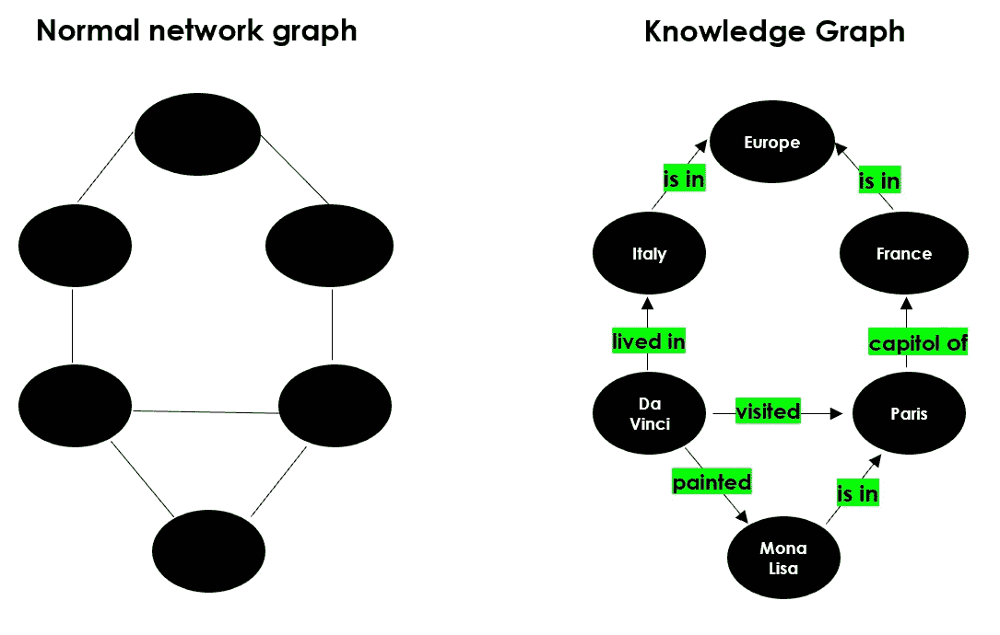

作者提供的图片

目前，大多数公司正在构建[数据湖](https://en.wikipedia.org/wiki/Data_lake)，这是一个中央数据库，用于存储从不同来源获取的各种原始数据（即结构化和非结构化数据）。因此，人们需要工具来理解这些不同信息片段。知识图谱变得越来越流行，因为它们可以简化对大型数据集的探索和洞察发现。换句话说，知识图谱将数据和相关的元数据连接起来，因此可以用来构建组织信息资产的全面表示。例如，知识图谱可以替代你需要浏览的所有文档堆，以便找到某一特定信息。

知识图谱被认为是自然语言处理领域的一部分，因为为了构建“知识”，必须经过一个叫做“**语义丰富化**”的过程。由于没有人愿意手动执行这个过程，我们需要机器和 NLP 算法来为我们完成这项任务。

我将展示一些有用的 Python 代码，这些代码可以轻松地应用于其他类似的情况（只需复制、粘贴、运行），并逐行讲解代码的注释，以便你可以复制这个示例（完整代码的链接如下）。

[## DataScience_ArtificialIntelligence_Utils/example_knowledge_graph.ipynb at master ·…](https://github.com/mdipietro09/DataScience_ArtificialIntelligence_Utils/blob/master/natural_language_processing/example_knowledge_graph.ipynb?source=post_page-----12b93146a458--------------------------------)

### 你现在无法执行该操作。你在另一个标签页或窗口中登录了。在另一个标签页中注销了…

[github.com](https://github.com/mdipietro09/DataScience_ArtificialIntelligence_Utils/blob/master/natural_language_processing/example_knowledge_graph.ipynb?source=post_page-----12b93146a458--------------------------------)

我将解析维基百科并提取一个页面，该页面将用作本教程的数据集（链接如下）。

[## 俄乌战争 - 维基百科](https://en.wikipedia.org/wiki/Russo-Ukrainian_War?source=post_page-----12b93146a458--------------------------------)

### 俄乌战争是俄罗斯及其支持的分裂主义者之间正在进行的国际冲突…

[维基百科](https://en.wikipedia.org/wiki/Russo-Ukrainian_War?source=post_page-----12b93146a458--------------------------------)

具体来说，我将介绍：

+   设置：通过[*Wikipedia-API*](https://pypi.org/project/Wikipedia-API/)读取数据和数据包。

+   使用[*SpaCy*](https://spacy.io/usage/linguistic-features)进行 NLP：句子分割、词性标注、依存句法分析、命名实体识别。

+   使用[*Textacy*](https://spacy.io/universe/project/textacy)提取实体及其关系。

+   带有[*NetworkX*](https://networkx.org/documentation/stable/auto_examples/index.html)的网络图构建。

+   带有[*DateParser*](https://dateparser.readthedocs.io/en/latest/)的时间线图。

## 设置

首先，我需要导入以下库：

```py
## for data
import pandas as pd  #1.1.5
import numpy as np  #1.21.0

## for plotting
import matplotlib.pyplot as plt  #3.3.2

## for text
import wikipediaapi  #0.5.8
import nltk  #3.8.1
import re   

## for nlp
import spacy  #3.5.0
from spacy import displacy
import textacy  #0.12.0

## for graph
import networkx as nx  #3.0 (also pygraphviz==1.10)

## for timeline
import dateparser #1.1.7
```

*Wikipedia-api* 是一个 Python 包装器，可以轻松解析 Wikipedia 页面。我将提取我需要的页面，排除页面底部的所有“注释”和“参考书目”：

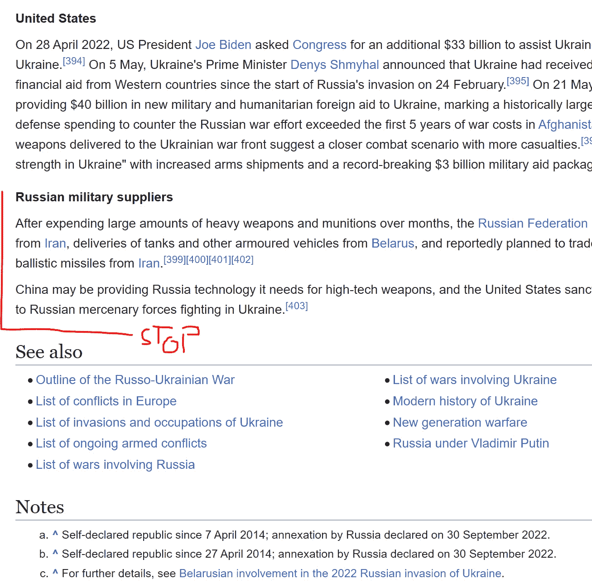

来源于 Wikipedia

我们可以简单地写出页面的名称：

```py
topic = "Russo-Ukrainian War"

wiki = wikipediaapi.Wikipedia('en')
page = wiki.page(topic)
txt = page.text[:page.text.find("See also")]
txt[0:500] + " ..."
```

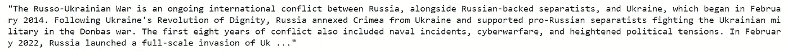

在这个用例中，我将尝试通过识别和提取文本中的主题-动作-对象（因此动作即为关系）来映射历史事件。

## NLP

为了构建知识图谱，我们首先需要识别实体及其关系。因此，我们需要使用 NLP 技术处理文本数据集。

当前，用于此类任务的最常用库是 *SpaCy*，这是一个用于高级 NLP 的开源软件，利用 *Cython* (C+Python)。*SpaCy* 使用预训练的语言模型将文本分词，并将其转换为一个通常称为 “[document](https://spacy.io/api/doc)” 的对象，基本上是一个包含模型预测的所有注释的类。

```py
#python -m spacy download en_core_web_sm

nlp = spacy.load("en_core_web_sm")
doc = nlp(txt)
```

NLP 模型的第一个输出是 [**句子分割**](https://spacy.io/usage/linguistic-features#sbd)：确定一个句子开始和结束的位置的问题。通常，通过基于标点符号拆分段落来完成。让我们看看 *SpaCy* 将文本拆分成了多少个句子：

```py
# from text to a list of sentences
lst_docs = [sent for sent in doc.sents]
print("tot sentences:", len(lst_docs))
```


作者提供的图片

现在，对于每个句子，我们将提取实体及其关系。为此，我们首先需要理解 [**词性标注 (POS tagging)**](https://spacy.io/usage/linguistic-features#pos-tagging)**:** 将句子中的每个单词标记上适当的语法标签的过程。以下是可能的标签的完整列表（截至今天）：

> - ***ADJ***: 形容词，例如 big, old, green, incomprehensible, first
> 
> - ***ADP***: 介词（前置词/后置词）例如 in, to, during
> 
> - ***ADV***: 副词，例如 very, tomorrow, down, where, there
> 
> - ***AUX***: 助动词，例如 is, has (done), will (do), should (do)
> 
> - ***CONJ***: 连词，例如 and, or, but
> 
> - ***CCONJ***: 并列连词，例如 and, or, but
> 
> - ***DET***: 限定词，例如 a, an, the
> 
> - ***INTJ***: 感叹词，例如 psst, ouch, bravo, hello
> 
> - ***NOUN***: 名词，例如 girl, cat, tree, air, beauty
> 
> - ***NUM***: 数字，例如 1, 2017, one, seventy-seven, IV, MMXIV
> 
> - ***PART***: 语气词，例如 ‘s, not
> 
> - ***PRON***: 代词，例如 I, you, he, she, myself, themselves, somebody
> 
> - ***PROPN***: 专有名词，例如 Mary, John, London, NATO, HBO
> 
> - ***PUNCT***: 标点符号，例如 ., (, ), ?
> 
> - ***SCONJ***: 从属连词，例如 if, while, that
> 
> - ***SYM***: 符号，例如 $, %, §, ©, +, −, ×, ÷, =, :), 表情符号
> 
> - ***VERB***: 动词，例如 run, runs, running, eat, ate, eating
> 
> - ***X***: 其他，例如 sfpksdpsxmsa
> 
> - ***SPACE***: 空格，例如

仅仅进行词性标注是不够的，模型还试图理解词对之间的关系。这项任务称为 [**依存句法分析**](https://spacy.io/usage/linguistic-features#dependency-parse)。以下是所有可能的标记列表（截至今天）：

> - ***从句修饰名词：*** clausal modifier of noun
> 
> - ***形容词补足语：*** adjectival complement
> 
> - ***副词从句修饰语：*** adverbial clause modifier
> 
> - ***副词修饰语：*** adverbial modifier
> 
> - ***施事者：*** agent
> 
> - ***形容词修饰语：*** adjectival modifier
> 
> - ***同位修饰语：*** appositional modifier
> 
> - ***属性：*** attribute
> 
> - ***辅助词：*** auxiliary
> 
> - ***辅助动词（被动）：*** auxiliary (passive)
> 
> - ***格标记：*** case marker
> 
> - ***并列连词：*** coordinating conjunction
> 
> - ***从句补足语：*** clausal complement
> 
> - ***复合修饰语：*** compound modifier
> 
> - ***连接词：*** conjunct
> 
> - ***从句主语：*** clausal subject
> 
> - ***从句主语（被动）：*** clausal subject (passive)
> 
> - ***与格：*** dative
> 
> - ***依存词：*** unclassified dependent
> 
> - ***限定词：*** determiner
> 
> - ***直接宾语：*** direct object
> 
> - ***虚词：*** expletive
> 
> - ***感叹词：*** interjection
> 
> - ***标记：*** marker
> 
> - ***元修饰语：*** meta modifier
> 
> - ***否定修饰语：*** negation modifier
> 
> - ***名词修饰语：*** modifier of nominal
> 
> - ***名词短语作为副词修饰语：*** noun phrase as adverbial modifier
> 
> - ***名词主语：*** nominal subject
> 
> - ***名词主语（被动）：*** nominal subject (passive)
> 
> - ***数量修饰语：*** number modifier
> 
> - ***对象谓词：*** object predicate
> 
> - ***并列语法：*** parataxis
> 
> - ***介词补足语：*** complement of preposition
> 
> - ***介词宾语：*** object of preposition
> 
> - ***所有格修饰语：*** possession modifier
> 
> - ***前关联连词：*** pre-correlative conjunction
> 
> - ***前限定词：*** pre-determiner
> 
> - ***介词修饰语：*** prepositional modifier
> 
> - ***词素：*** particle
> 
> - ***标点：*** punctuation
> 
> - ***数量词修饰语：*** modifier of quantifier
> 
> - ***关系从句修饰语：*** relative clause modifier
> 
> - ***根：*** root
> 
> - ***开放从句补足语：*** open clausal complement

让我们举个例子来理解词性标注和依存句法分析：

```py
# take a sentence
i = 3
lst_docs[i]
```


让我们检查一下 NLP 模型预测的词性和依存标记：

```py
for token in lst_docs[i]:
    print(token.text, "-->", "pos: "+token.pos_, "|", "dep: "+token.dep_, "")
```

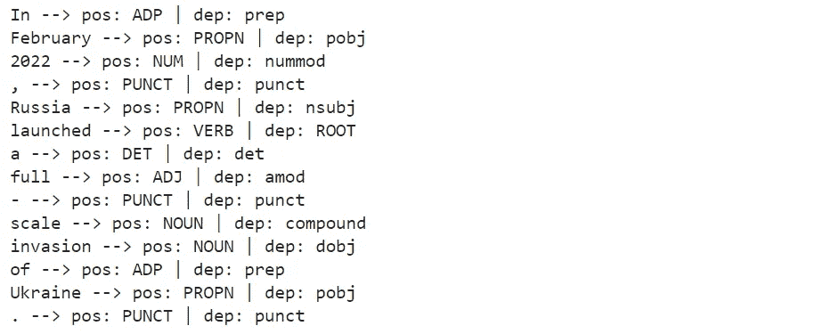

作者提供的图片

*SpaCy* 还提供了一个 [图形工具](https://spacy.io/usage/visualizers) 来可视化这些标注：

```py
from spacy import displacy

displacy.render(lst_docs[i], style="dep", options={"distance":100})
```

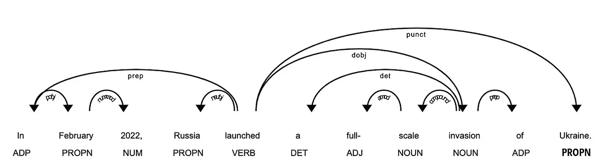

作者提供的图片

最重要的词素是动词（*POS=VERB*），因为它是句子意义的根源（*DEP=ROOT*）。

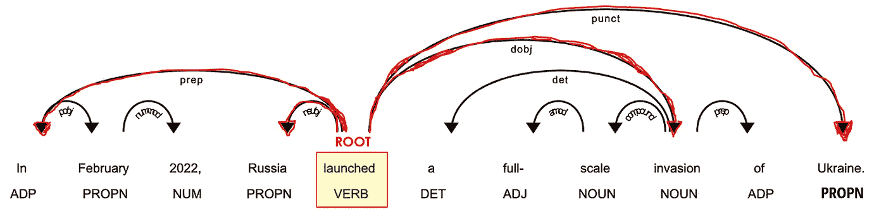

作者提供的图片

辅助粒子，例如副词和介词（*POS=ADV/ADP*），通常作为修饰语与动词相连（*DEP=*mod*），因为它们可以修饰动词的意义。例如，“*travel to*” 和 “*travel from*” 尽管根词相同（“*travel*”），却有不同的含义。

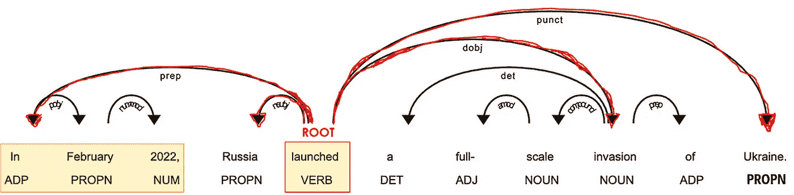

作者提供的图片

在与动词相关联的词中，必须有一些名词（*POS=PROPN/NOUN*），它们充当句子的主语和宾语（*DEP=nsubj/*obj*）。

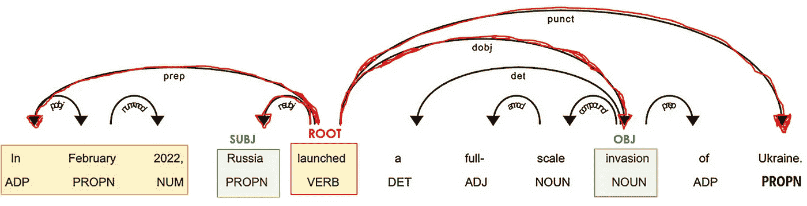

作者提供的图片

名词通常靠近一个形容词（*POS=ADJ*），这个形容词充当它们意义的修饰词（*DEP=amod*）。例如，在“*好人*”和“*坏人*”中，形容词给名词*“人”*带来了相反的含义。

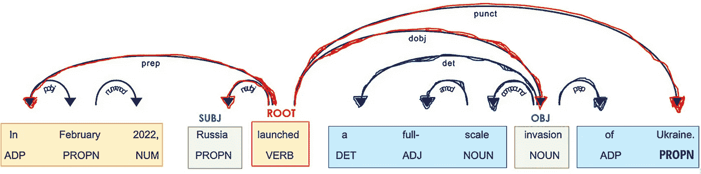

作者提供的图片

*SpaCy* 执行的另一个酷炫任务是 [**命名实体识别（NER）**](https://spacy.io/usage/linguistic-features#named-entities)。命名实体是一个“现实世界的对象”（即人、国家、产品、日期），模型可以识别文档中的各种类型。以下是可能标签的完整列表（截至今日）：

> - ***人物:*** 人，包括虚构的。
> 
> - ***国家/宗教/政治组织:*** 国籍、宗教或政治团体。
> 
> - ***设施:*** 建筑物、机场、公路、桥梁等。
> 
> - ***组织:*** 公司、机构、组织等。
> 
> - ***GPE:*** 国家、城市、州。
> 
> - ***地点:*** 非 GPE 位置、山脉、水体。
> 
> - ***产品:*** 物品、车辆、食品等。（不是服务。）
> 
> - ***事件:*** 命名的飓风、战役、战争、体育赛事等。
> 
> - ***艺术作品:*** 书籍、歌曲等的标题。
> 
> - ***法律:*** 成为法律的命名文档。
> 
> - ***语言:*** 任何命名的语言。
> 
> - ***日期:*** 绝对或相对的日期或时期。
> 
> - ***时间:*** 小于一天的时间。
> 
> - ***百分比:*** 包括“%”的百分数。
> 
> - ***货币:*** 包括单位的货币值。
> 
> - ***数量:*** 以重量或距离为单位的测量值。
> 
> - ***序数:*** “第一”、“第二”等。
> 
> - ***基数:*** 不属于其他类型的数字。

让我们看看我们的例子：

```py
for tag in lst_docs[i].ents:
    print(tag.text, f"({tag.label_})") 
```

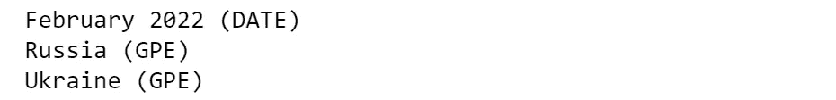

作者提供的图片

或者使用 *SpaCy* 的图形工具：

```py
displacy.render(lst_docs[i], style="ent")
```


作者提供的图片

这在我们想要向知识图谱中添加几个属性时非常有用。

继续，使用 NLP 模型预测的标签，我们可以提取实体及其关系。

## **实体与关系提取**

这个想法非常简单，但实现起来可能会很棘手。对于每个句子，我们将提取主语和宾语及其修饰词、复合词和它们之间的标点符号。

这可以通过两种方式完成：

1.  **手动**地，你可以从基线代码开始，这些代码可能需要稍微修改和适应你的特定数据集/用例。

```py
def extract_entities(doc):
    a, b, prev_dep, prev_txt, prefix, modifier = "", "", "", "", "", ""
    for token in doc:
        if token.dep_ != "punct":
            ## prexif --> prev_compound + compound
            if token.dep_ == "compound":
                prefix = prev_txt +" "+ token.text if prev_dep == "compound" else token.text

            ## modifier --> prev_compound + %mod
            if token.dep_.endswith("mod") == True:
                modifier = prev_txt +" "+ token.text if prev_dep == "compound" else token.text

            ## subject --> modifier + prefix + %subj
            if token.dep_.find("subj") == True:
                a = modifier +" "+ prefix + " "+ token.text
                prefix, modifier, prev_dep, prev_txt = "", "", "", ""

            ## if object --> modifier + prefix + %obj
            if token.dep_.find("obj") == True:
                b = modifier +" "+ prefix +" "+ token.text

            prev_dep, prev_txt = token.dep_, token.text

    # clean
    a = " ".join([i for i in a.split()])
    b = " ".join([i for i in b.split()])
    return (a.strip(), b.strip())

# The relation extraction requires the rule-based matching tool, 
# an improved version of regular expressions on raw text.
def extract_relation(doc, nlp):
    matcher = spacy.matcher.Matcher(nlp.vocab)
    p1 = [{'DEP':'ROOT'}, 
          {'DEP':'prep', 'OP':"?"},
          {'DEP':'agent', 'OP':"?"},
          {'POS':'ADJ', 'OP':"?"}] 
    matcher.add(key="matching_1", patterns=[p1]) 
    matches = matcher(doc)
    k = len(matches) - 1
    span = doc[matches[k][1]:matches[k][2]] 
    return span.text
```

让我们在这个数据集上试试，并查看常见的例子：

```py
## extract entities
lst_entities = [extract_entities(i) for i in lst_docs]

## example
lst_entities[i]
```

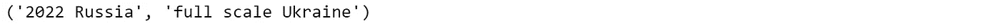

```py
## extract relations
lst_relations = [extract_relation(i,nlp) for i in lst_docs]

## example
lst_relations[i]
```

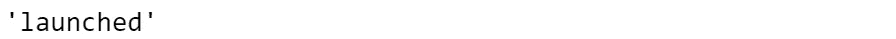

```py
## extract attributes (NER)
lst_attr = []
for x in lst_docs:
    attr = ""
    for tag in x.ents:
        attr = attr+tag.text if tag.label_=="DATE" else attr+""
    lst_attr.append(attr)

## example
lst_attr[i]
```


2\. 你也可以使用 ***Textacy***，这是一个建立在 *SpaCy* 之上的库，用于扩展其核心功能。这更友好且通常更准确。

```py
## extract entities and relations
dic = {"id":[], "text":[], "entity":[], "relation":[], "object":[]}

for n,sentence in enumerate(lst_docs):
    lst_generators = list(textacy.extract.subject_verb_object_triples(sentence))  
    for sent in lst_generators:
        subj = "_".join(map(str, sent.subject))
        obj  = "_".join(map(str, sent.object))
        relation = "_".join(map(str, sent.verb))
        dic["id"].append(n)
        dic["text"].append(sentence.text)
        dic["entity"].append(subj)
        dic["object"].append(obj)
        dic["relation"].append(relation)

## create dataframe
dtf = pd.DataFrame(dic)

## example
dtf[dtf["id"]==i]
```

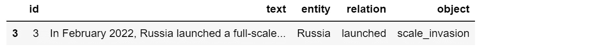

作者提供的图片

让我们也使用 NER 标签（即日期）提取属性：

```py
## extract attributes
attribute = "DATE"
dic = {"id":[], "text":[], attribute:[]}

for n,sentence in enumerate(lst_docs):
    lst = list(textacy.extract.entities(sentence, include_types={attribute}))
    if len(lst) > 0:
        for attr in lst:
            dic["id"].append(n)
            dic["text"].append(sentence.text)
            dic[attribute].append(str(attr))
    else:
        dic["id"].append(n)
        dic["text"].append(sentence.text)
        dic[attribute].append(np.nan)

dtf_att = pd.DataFrame(dic)
dtf_att = dtf_att[~dtf_att[attribute].isna()]

## example
dtf_att[dtf_att["id"]==i]
```

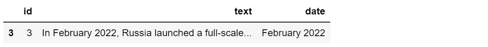

作者提供的图片

现在我们已经提取了“知识”，可以构建图谱。

## 网络图

标准的 Python 库用于创建和操作图网络是***NetworkX***。我们可以从整个数据集开始创建图，但如果节点太多，视觉效果会变得混乱：

```py
## create full graph
G = nx.from_pandas_edgelist(dtf, source="entity", target="object", 
                            edge_attr="relation", 
                            create_using=nx.DiGraph())

## plot
plt.figure(figsize=(15,10))

pos = nx.spring_layout(G, k=1)
node_color = "skyblue"
edge_color = "black"

nx.draw(G, pos=pos, with_labels=True, node_color=node_color, 
        edge_color=edge_color, cmap=plt.cm.Dark2, 
        node_size=2000, connectionstyle='arc3,rad=0.1')

nx.draw_networkx_edge_labels(G, pos=pos, label_pos=0.5, 
                         edge_labels=nx.get_edge_attributes(G,'relation'),
                         font_size=12, font_color='black', alpha=0.6)
plt.show()
```


图片由作者提供

知识图谱使得从大局上看到事物之间的关系成为可能，但像这样是相当无用的……所以最好是根据我们要寻找的信息应用一些过滤器。对于这个例子，我将只取涉及最频繁实体（基本上是最连接的节点）的图的一部分：

```py
dtf["entity"].value_counts().head()
```

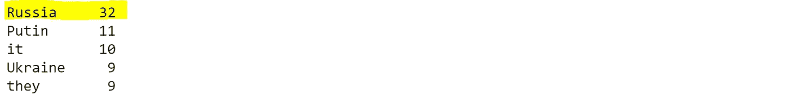

图片由作者提供

```py
## filter
f = "Russia"
tmp = dtf[(dtf["entity"]==f) | (dtf["object"]==f)]

## create small graph
G = nx.from_pandas_edgelist(tmp, source="entity", target="object", 
                            edge_attr="relation", 
                            create_using=nx.DiGraph())

## plot
plt.figure(figsize=(15,10))

pos = nx.nx_agraph.graphviz_layout(G, prog="neato")
node_color = ["red" if node==f else "skyblue" for node in G.nodes]
edge_color = ["red" if edge[0]==f else "black" for edge in G.edges]

nx.draw(G, pos=pos, with_labels=True, node_color=node_color, 
        edge_color=edge_color, cmap=plt.cm.Dark2, 
        node_size=2000, node_shape="o", connectionstyle='arc3,rad=0.1')

nx.draw_networkx_edge_labels(G, pos=pos, label_pos=0.5, 
                        edge_labels=nx.get_edge_attributes(G,'relation'),
                        font_size=12, font_color='black', alpha=0.6)
plt.show()
```

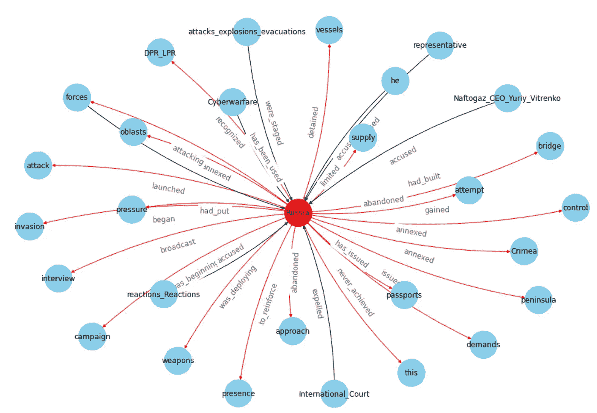

图片由作者提供

这样更好。如果你想将其做成 3D，使用以下代码：

```py
from mpl_toolkits.mplot3d import Axes3D

fig = plt.figure(figsize=(15,10))
ax = fig.add_subplot(111, projection="3d")
pos = nx.spring_layout(G, k=2.5, dim=3)

nodes = np.array([pos[v] for v in sorted(G) if v!=f])
center_node = np.array([pos[v] for v in sorted(G) if v==f])

edges = np.array([(pos[u],pos[v]) for u,v in G.edges() if v!=f])
center_edges = np.array([(pos[u],pos[v]) for u,v in G.edges() if v==f])

ax.scatter(*nodes.T, s=200, ec="w", c="skyblue", alpha=0.5)
ax.scatter(*center_node.T, s=200, c="red", alpha=0.5)

for link in edges:
    ax.plot(*link.T, color="grey", lw=0.5)
for link in center_edges:
    ax.plot(*link.T, color="red", lw=0.5)

for v in sorted(G):
    ax.text(*pos[v].T, s=v)
for u,v in G.edges():
    attr = nx.get_edge_attributes(G, "relation")[(u,v)]
    ax.text(*((pos[u]+pos[v])/2).T, s=attr)

ax.set(xlabel=None, ylabel=None, zlabel=None, 
       xticklabels=[], yticklabels=[], zticklabels=[])
ax.grid(False)
for dim in (ax.xaxis, ax.yaxis, ax.zaxis):
    dim.set_ticks([])
plt.show()
```

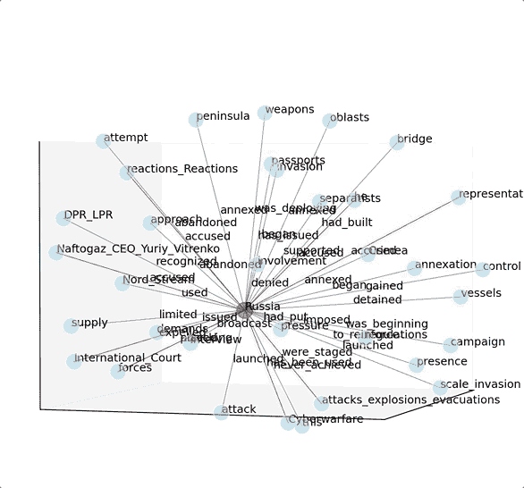

图片由作者提供

请注意，图表可能很有用且可视化效果很好，但这不是本教程的主要焦点。知识图谱最重要的部分是“知识”（文本处理），然后结果可以以数据框、图形或其他图表的形式展示。例如，我可以使用 NER 识别的日期来构建一个时间轴图。

## 时间轴图

首先，我必须将被识别为“日期”的字符串转换为 datetime 格式。库***DateParser***可以解析几乎所有在网页上常见的字符串格式的日期。

```py
def utils_parsetime(txt):
    x = re.match(r'.*([1-3][0-9]{3})', txt) #<--check if there is a year
    if x is not None:
        try:
            dt = dateparser.parse(txt)
        except:
            dt = np.nan
    else:
        dt = np.nan
    return dt
```

让我们将其应用于属性的数据框：

```py
dtf_att["dt"] = dtf_att["date"].apply(lambda x: utils_parsetime(x))

## example
dtf_att[dtf_att["id"]==i]
```

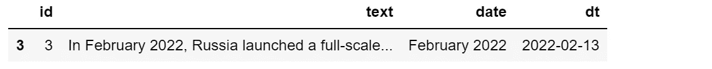

图片由作者提供

现在，我将其与主要的实体-关系数据框合并：

```py
tmp = dtf.copy()
tmp["y"] = tmp["entity"]+" "+tmp["relation"]+" "+tmp["object"]

dtf_att = dtf_att.merge(tmp[["id","y"]], how="left", on="id")
dtf_att = dtf_att[~dtf_att["y"].isna()].sort_values("dt", 
                 ascending=True).drop_duplicates("y", keep='first')
dtf_att.head()
```

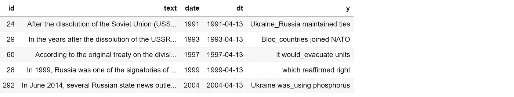

图片由作者提供

最后，我可以绘制时间轴。正如我们已经知道的，完整的图表可能不会很有用：

```py
dates = dtf_att["dt"].values
names = dtf_att["y"].values
l = [10,-10, 8,-8, 6,-6, 4,-4, 2,-2]
levels = np.tile(l, int(np.ceil(len(dates)/len(l))))[:len(dates)]

fig, ax = plt.subplots(figsize=(20,10))
ax.set(title=topic, yticks=[], yticklabels=[])

ax.vlines(dates, ymin=0, ymax=levels, color="tab:red")
ax.plot(dates, np.zeros_like(dates), "-o", color="k", markerfacecolor="w")

for d,l,r in zip(dates,levels,names):
    ax.annotate(r, xy=(d,l), xytext=(-3, np.sign(l)*3), 
                textcoords="offset points",
                horizontalalignment="center",
                verticalalignment="bottom" if l>0 else "top")

plt.xticks(rotation=90) 
plt.show()
```

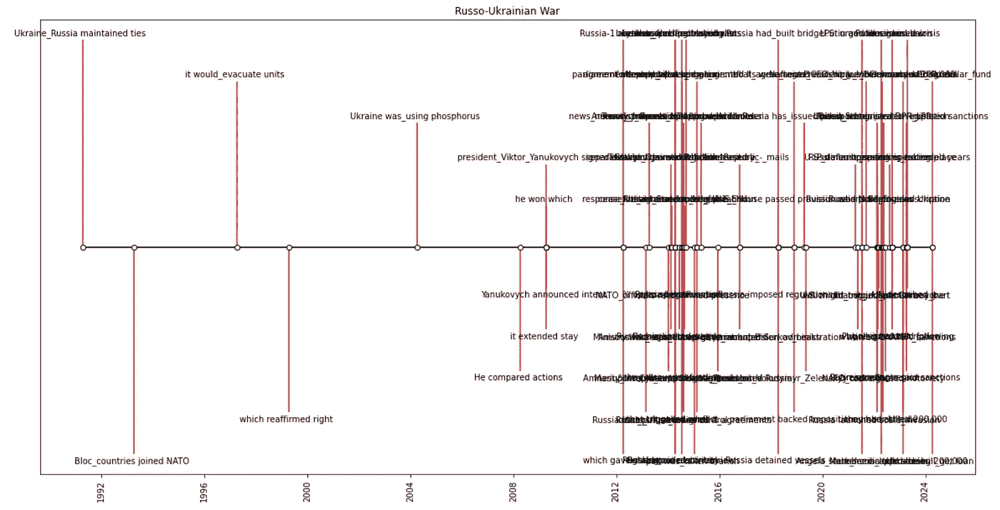

图片由作者提供

所以最好是过滤出特定时间段：

```py
yyyy = "2022"
dates = dtf_att[dtf_att["dt"]>yyyy]["dt"].values
names = dtf_att[dtf_att["dt"]>yyyy]["y"].values
l = [10,-10, 8,-8, 6,-6, 4,-4, 2,-2]
levels = np.tile(l, int(np.ceil(len(dates)/len(l))))[:len(dates)]

fig, ax = plt.subplots(figsize=(20,10))
ax.set(title=topic, yticks=[], yticklabels=[])

ax.vlines(dates, ymin=0, ymax=levels, color="tab:red")
ax.plot(dates, np.zeros_like(dates), "-o", color="k", markerfacecolor="w")

for d,l,r in zip(dates,levels,names):
    ax.annotate(r, xy=(d,l), xytext=(-3, np.sign(l)*3), 
                textcoords="offset points",
                horizontalalignment="center",
                verticalalignment="bottom" if l>0 else "top")

plt.xticks(rotation=90) 
plt.show()
```

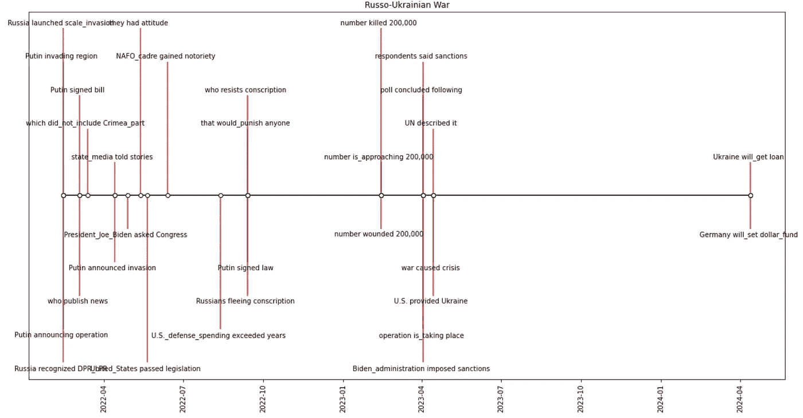

图片由作者提供

正如你所见，一旦“知识”被提取出来，你可以用任何方式绘制它。

## 结论

本文是关于**如何用 Python 构建知识图谱**的教程。我使用了几种 NLP 技术处理从维基百科解析的数据，以提取“知识”（即实体和关系），并将其存储在一个网络图对象中。

现在你明白了为什么公司正在利用 NLP 和知识图谱来映射来自多个来源的相关数据，并找到对业务有用的洞察。试想一下，通过在与单一实体（例如 Apple Inc）相关的所有文档（例如财报、新闻、推文）上应用这种模型，可以提取出多少价值。你可以快速了解所有与该实体直接相关的事实、人物和公司。然后，通过扩展网络，甚至可以获取与起始实体（A — > B — > C）不直接相关的信息。

希望你喜欢这个！如有任何问题或反馈，或想分享你的有趣项目，欢迎随时联系我。

> 👉 [让我们联系](https://linktr.ee/maurodp) 👈
> 
> 本文是**使用 Python 进行 NLP**系列的一部分，还可以查看：

[](/text-summarization-with-nlp-textrank-vs-seq2seq-vs-bart-474943efeb09?source=post_page-----12b93146a458--------------------------------) ## 使用 NLP 进行文本总结：TextRank 与 Seq2Seq 与 BART

### 使用 Python 进行自然语言处理、Gensim、Tensorflow、Transformers

[towardsdatascience.com [](/text-classification-with-nlp-tf-idf-vs-word2vec-vs-bert-41ff868d1794?source=post_page-----12b93146a458--------------------------------) ## NLP 的文本分类：Tf-Idf 与 Word2Vec 与 BERT

### 预处理、模型设计、评估、Bag-of-Words、词嵌入、语言模型的可解释性

[towardsdatascience.com [](/text-analysis-feature-engineering-with-nlp-502d6ea9225d?source=post_page-----12b93146a458--------------------------------) ## NLP 的文本分析与特征工程

### 语言检测、文本清理、长度、情感、命名实体识别、N-gram 频率、词向量、主题……

[towardsdatascience.com [](/text-classification-with-no-model-training-935fe0e42180?source=post_page-----12b93146a458--------------------------------) ## BERT 用于无模型训练的文本分类

### 当你没有标记训练集时，使用 BERT、词嵌入和向量相似性

[towardsdatascience.com [](/ai-chatbot-with-nlp-speech-recognition-transformers-583716a299e9?source=post_page-----12b93146a458--------------------------------) ## 使用 NLP 构建 AI 聊天机器人：语音识别+Transformers

### 使用 Python 构建一个会话聊天机器人，与 AI 进行对话

[towardsdatascience.com
