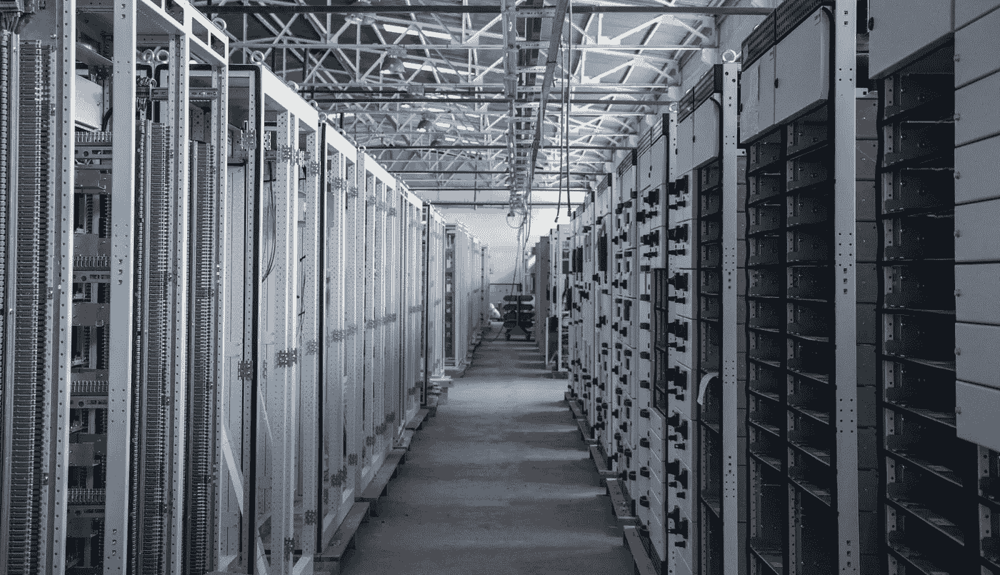
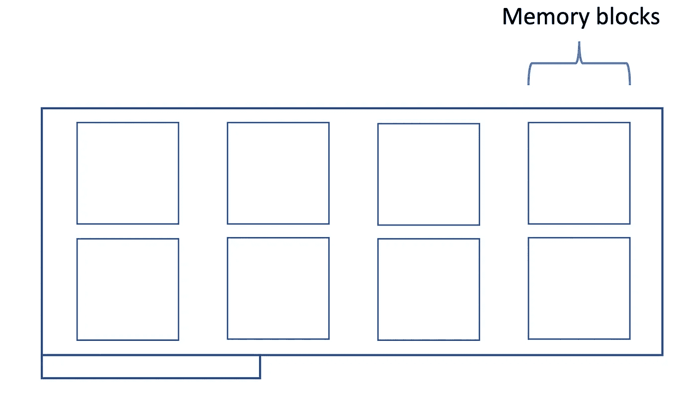
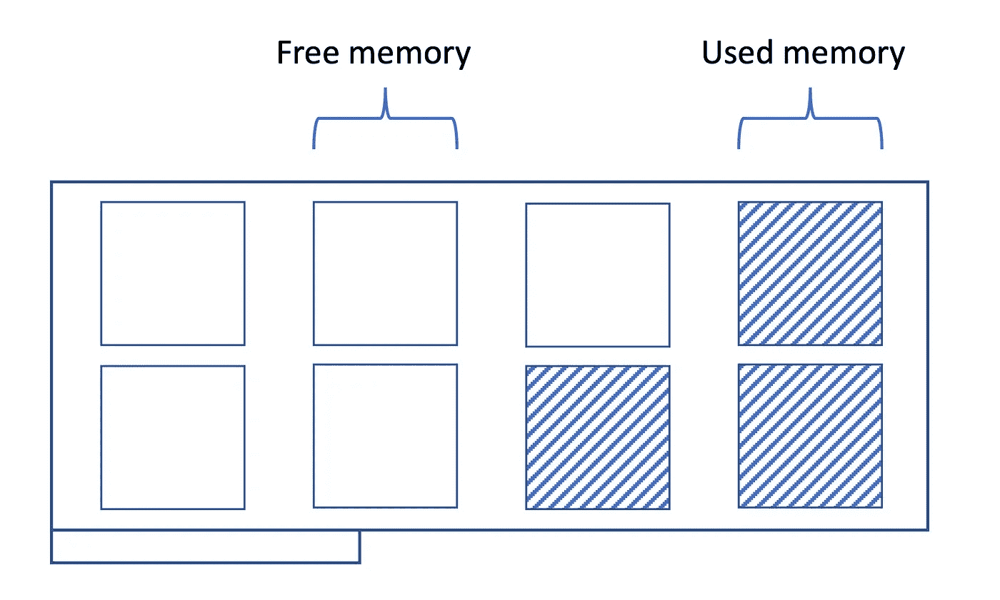
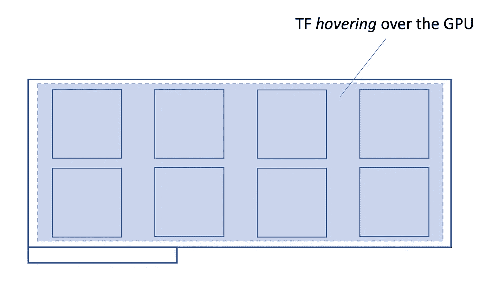
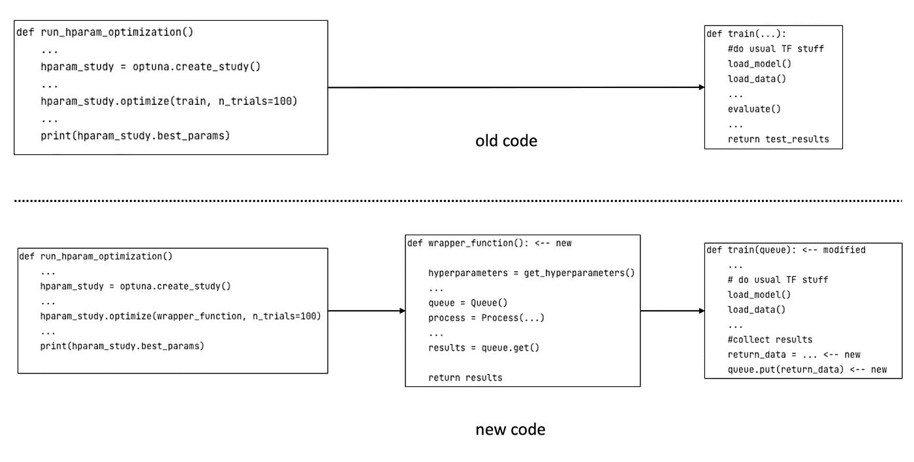

# TensorFlow 中不再出现 OOM 异常

> 原文：[`towardsdatascience.com/no-more-oom-exceptions-during-hyperparameter-searches-in-tensorflow-26e6e3069bc9`](https://towardsdatascience.com/no-more-oom-exceptions-during-hyperparameter-searches-in-tensorflow-26e6e3069bc9)

## 使用包装函数来避免 OOM 异常

[](https://pascaljanetzky.medium.com/?source=post_page-----26e6e3069bc9--------------------------------)[](https://towardsdatascience.com/?source=post_page-----26e6e3069bc9--------------------------------) [Pascal Janetzky](https://pascaljanetzky.medium.com/?source=post_page-----26e6e3069bc9--------------------------------)

·发表于 [Towards Data Science](https://towardsdatascience.com/?source=post_page-----26e6e3069bc9--------------------------------) ·阅读时间 8 分钟·2023 年 4 月 1 日

--

现在是 2023 年。机器学习不再是炒作，而是日常产品的核心。越来越快的硬件使得训练更大规模的机器学习模型成为可能——而且时间更短。每天在 [arXiv](https://arxiv.org/list/cs.LG/pastweek?skip=0&show=635) 提交的关于机器学习或相关领域的论文约有 100 篇，至少三分之一的论文利用了硬件的能力进行超参数搜索以优化其使用的模型。这不是很简单吗？只需选择一个框架——[Optuna](https://optuna.org), [wandb](https://wandb.ai/site)，随便哪个——接入你的常规训练循环，然后…

OOM 错误。

至少，这种情况在 TensorFlow 中经常发生。



图片由 [İsmail Enes Ayhan](https://unsplash.com/@ismailenesayhan?utm_source=medium&utm_medium=referral) 提供，来源于 [Unsplash](https://unsplash.com/?utm_source=medium&utm_medium=referral)

# 当前状态

缺乏适当释放 GPU 内存的功能引发了许多讨论和问题，特别是在 StackOverflow 或 GitHub 等问答论坛中 ([1](https://stackoverflow.com/questions/39758094/clearing-tensorflow-gpu-memory-after-model-execution), [2](https://github.com/tensorflow/tensorflow/issues/36465), [3](https://stackoverflow.com/questions/69296496/clear-the-graph-and-free-the-gpu-memory-in-tensorflow-2), [4](https://discuss.tensorflow.org/t/clear-the-graph-and-free-the-gpu-memory-in-tensorflow-2/4731), [5](https://github.com/keras-team/keras/issues/12625), [6](https://stackoverflow.com/questions/75644097/is-there-a-way-to-clear-gpu-memory-after-training-the-tf2-model))。对于每个问题，都提出了一组类似的解决方法：

- 限制 GPU 内存增长

- 使用 numba 库清除 GPU

- 使用本地 TF 函数，它们*应该*可以做到这一点

- 切换到 PyTorch

本博文提出了我对这一长期存在且烦人的 OOM 异常问题的解决方案。在过去几年中进行了一些超参数优化运行后，我最近遇到了编程中最令人生畏的问题之一：

不易重复的异常，通常发生在百次运行中的某一次。在我的情况下，它偶尔发生在优化运行中选择了特别具有挑战性的参数组合时。比如，较大的批量大小和较多的卷积滤波器，这两者都对 GPU 内存造成压力。

有趣但更令人恼火的是，当我从新系统本地初始化这样的模型时——即之前没有运行其他 TF 代码——我可以成功运行模型。在检查了其他影响因素，如 GPU 大小、CUDA 版本和其他要求后，我没有发现此部分的错误。因此，必须是同一程序内神经网络的重复初始化导致了 OOM 错误。

在继续之前，我想澄清：OOM 错误可能有其他原因，迄今为止这些原因尚未明确指出。特别是，显然不可能将一个内存占用过大的模型放到一个内存过小的 GPU 上。

当模型在物理上过大时，解决方案是修改模型——相关关键词包括 [混合精度训练](https://arxiv.org/abs/1710.03740)、[逐层训练](https://machinelearningmastery.com/greedy-layer-wise-pretraining-tutorial/)、[蒸馏](https://arxiv.org/abs/1802.05668) 和 [剪枝](https://arxiv.org/abs/2101.09671)——以及在多个加速器上运行训练——关键词：[分布式训练，模型并行](https://www.beyondthelines.net/machine-learning/distributed-training-of-neural-networks/)——或者切换到具有更多可用内存的计算设备。但这超出了本文的范围。

# 问题

返回到在超参数优化期间遇到的可怕 OOM 异常，我认为首先从概念上展示导致这种错误的原因是至关重要的。因此，请考虑以下可视化，其中我绘制了一个 GPU 及其内存块：



GPU 及其内存块的草图。图片由作者提供。

虽然这是一个简化的描述，但每次初始化新模型时，都会消耗另一块内存。



每个新模型都会占用 GPU 内存。图片由作者提供。

最终，加速器上的空间将不再剩余，导致 OOM 错误。模型越大，这种情况发生得越快。理想情况下，我们应在超参数试验结束时调用清理函数，为下一个模型释放内存。即使是可能适配到干净 GPU 上的网络，在没有进行垃圾回收时也会失败，因为宝贵的内存已经被之前模型的碎片占用。

我想称之为*TensorFlow 在 GPU 上的作用域*的部分在之前的草图中没有显示。默认情况下，TensorFlow 保留整个资源——这很聪明，因为后续请求增加配额将导致执行瓶颈。在下图中，TensorFlow 进程被勾画为“悬停”在整个 GPU 上：



TF 进程占用 GPU 以实现快速数据访问。图片由作者提供。

在其生命周期内，悬停的 TF 进程就像是即将到来的 TF 操作的占位符，这些操作在 GPU 及其内存上运行。

然后，一旦进程终止，TF 释放内存，使其可供其他程序使用。问题是：通常，作为超参数研究的一部分，所有网络初始化都是在同一个进程中（例如，在一个 for 循环中）进行的，这个进程悬停在 GPU 上。

解决方案，我希望，很明显：为每个试验/模型配置使用不同的进程。

这种方法适用于所有 TensorFlow 版本，尤其是旧版本（这些版本自然不会收到功能更新）。新的版本可能会增加适当的内存清理功能，但旧版本将缺乏这一可能性。所以，事不宜迟，这里是解决方案。

# 解决方案

为了在每个超参数试验中运行自己的进程，我们需要使用本地的 python multiprocessing 库。更新代码以使用这个包所需的努力出乎意料地少。

从全局视角来看，负责运行代码的过程——即主要驱动函数——需要修改以接受一个额外的参数，即队列。我们无需进一步深入，但这个队列对象作为调用函数（即调用 main()、run()、train() 或类似函数的函数）与主函数之间的桥梁。在主函数中，我们基本上可以保持现状。正如在参数搜索中常见的做法，改进训练/评估代码的返回值是优化实践的目标。

我们之前通过*return*语句返回这个值，而现在我们将这个目标值放入队列对象中。然后，我们从调用函数中提取它，并将其传递给超参数框架。

从优化框架的角度来看，变化不大。最显著的变化是它不再直接与训练函数“通信”，而是通过一个中介函数进行。概念上，这种更新的设置如下所示。



旧的默认代码（顶部）和更新后的代码（底部）的比较。在新代码中，优化框架通过包装函数与机器学习代码进行通信。

但除了这个变化之外，我们可以像往常一样进行参数搜索。从概念上讲，使用 python/伪代码的混合，让我向你展示修改后的代码的样子。

首先，我们必须将选择当前试验的参数组合的逻辑从主函数中移除（如果它曾被放在那儿）。这部分应该在我们添加进程管理之前完成。然后，我们使用多进程工具为 TF 相关代码生成一个进程，包装常用的 main()/train()/run()/等 函数：

```py
def wrapper_function(): ← new
  hyperparameters = get_hyperparameters()
  …
  queue = Queue()
  process = Process(…)
  …
  results = queue.get()
  return results
```

与 TF 的通信，特别是结果的收集，通过队列对象完成，这就是为什么我们也将其传递给函数（稍后详细说明）。然后我们开始模型训练，等待其完成，并从队列对象中获取结果，将其传递给调用函数（通常是超参数框架）。这个值 —— 或者在多目标优化的情况下，这些值 —— 是超参数框架最终看到的；它对进程的细节一无所知。

在训练代码中，我们需要包含一种将参数优化目标传递到队列对象中的方法。在这里，我假设通常会返回模型在验证集上的表现，因为该指标（在该子集上）通常被用作优化目标。

（适应你的用例；概念是相同的）。

为此：

1.  查找你退出训练/评估函数并将结果返回给调用者的地方。

1.  在这里，将优化框架需要知道的一切信息收集到一个列表或其他数据集合中。

1.  在下一步，将此列表传递给队列。

如前面段落所述，这些值可以从队列中查询，并从那里传递回优化框架：

```py
def train(queue): ← modified
  …
  # do usual TF stuff
  load_model()
  load_data()
  …
  #collect results
  return_data = … ← new
  queue.put(return_data) ← new
```

关键点是：当我们获得评估结果时，TF 进程已经完成 —— 清除 GPU 内存。因此，训练和评估过程可以在下一次调用中访问干净的（内存方面的）GPU，并且使用新的超参数集。特别是，创建待评估的模型不会争夺剩余的 GPU 内存，因为之前的模型及其痕迹已经被移除。这样，我们避免了 OOM 问题。

# 一个简单的例子

此时，你可能会想知道如何将这些内容转化为代码。我听到了，虽然每个人的需求不同，但我构建了以下简单的设置来给你一个如何工作的概念。我们将使用 Optuna 来优化卷积神经网络的超参数。通过这些代码，你可以加载你喜欢的数据集，并在其上优化 CNN。

这里是 Optuna 代码的部分：

在这段代码中，请注意 Optuna 调用的函数。它不是实际的训练代码，而是一个中间函数，即*包装函数*。如前一节所述，包装函数会使用将要评估的超参数集调用底层训练代码。

至于训练代码，这段代码基本遵循标准设置：加载数据子集、初始化模型、训练并评估模型。新颖之处在于函数的最后几行。在这里，验证子集上的结果被传递到队列中。

这就是 OOM-free 超参数优化的核心代码**。完整代码可以在 [这里](https://gist.github.com/6a7e7031b5f548f602bc369e9fd98841) 找到。

*我的经验表明，应该在调用函数中选择超参数，即在进程修改生效之前。

**唯一的例外是当模型实在太大而无法适应 GPU 内存时。

# 总结

在这篇博客文章中，我介绍了我对 TensorFlow 中长期存在的 OOM 异常挑战的解决方案。虽然自然地，我们不能将物理上过大的模型放入 GPU 中，但这种方法适用于研究关键的超参数搜索。从概念上讲，这个解决方案很简单：为每次试验（超参数组合）启动一个新进程。使用本地 Python 库，只需添加几行新代码和对现有设置进行一些更改即可实现。最后，将优化框架指向一个中间包装函数，而不是直接指向训练代码。
