# 非负矩阵分解（NMF）用于图像数据的降维

> 原文：[`towardsdatascience.com/non-negative-matrix-factorization-nmf-for-dimensionality-reduction-in-image-data-8450f4cae8fa`](https://towardsdatascience.com/non-negative-matrix-factorization-nmf-for-dimensionality-reduction-in-image-data-8450f4cae8fa)

## 使用 Python 和 Scikit-learn 讨论理论和实现

[](https://rukshanpramoditha.medium.com/?source=post_page-----8450f4cae8fa--------------------------------)[](https://towardsdatascience.com/?source=post_page-----8450f4cae8fa--------------------------------) [Rukshan Pramoditha](https://rukshanpramoditha.medium.com/?source=post_page-----8450f4cae8fa--------------------------------)

·发表于 [Towards Data Science](https://towardsdatascience.com/?source=post_page-----8450f4cae8fa--------------------------------) ·9 分钟阅读·2023 年 5 月 6 日

--

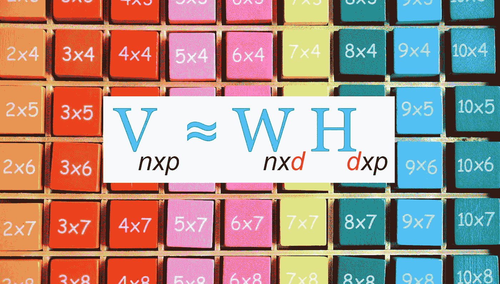

原图来自 [an_photos](https://pixabay.com/users/an_photos-3160435/?utm_source=link-attribution&utm_medium=referral&utm_campaign=image&utm_content=4503287) 从 [Pixabay](https://pixabay.com//?utm_source=link-attribution&utm_medium=referral&utm_campaign=image&utm_content=4503287)（作者稍作编辑）

我已经详细讨论了不同类型的降维技术。

**主成分分析（PCA）**、**因子分析（FA）**、**线性判别分析（LDA）**、**自编码器（AEs）**和**核主成分分析**是最受欢迎的几种。

非负矩阵分解（NMF 或 NNMF）也是一种*线性*降维技术，可以用于减少特征矩阵的维度。

所有降维技术都属于无监督机器学习的范畴，通过这种方法，我们可以揭示数据中隐藏的模式和重要的关系，而不需要标签。

因此，降维算法处理的是无标签的数据。在训练这种算法时，**fit()** 方法只需要特征矩阵 **X** 作为输入，不需要标签列 **y**。

正如其名称所示，非负矩阵分解（NMF）需要特征矩阵为非负值。

由于这种非负性约束，NMF 的使用范围被限制在非负值的数据上，例如图像数据（像素值总是介于 0 和 255 之间，因此图像数据中没有负值！）。

```py
**What you will learn:
----------------------------------------------------**
1\. Maths behind NMF
2\. NMF equation
3\. Feature matrix, V
4\. Transformed data matrix, W
5\. Factorization matrix, H
6\. Scikit-learn NMF() class
7\. Arguments, methods and attributes of NMF() class
8\. Load the MNIST with Scikit-learn
9\. Perform dimensionality reduction in image data

**Other matrix decomposition methods:
----------------------------------------------------** 1\. Eigendecomposition
2\. Singular value decomposition
```

# 非负矩阵分解（NMF）的数学原理

非负矩阵分解来源于线性代数。简单来说，它是将一个矩阵分解为两个小矩阵的乘积的过程。

更准确地说，

> 非负矩阵分解（NMF）是将一个非负特征矩阵 V (nxp) 分解为两个非负矩阵 W (nxd) 和 H (dxp) 的乘积的过程。这三个矩阵都应包含非负元素。

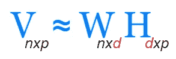

**非负矩阵分解方程**（作者图片）

**W** 和 **H** 矩阵的乘积仅能给出矩阵 **V** 的近似值。因此，在应用 NMF 时应预期会有一些信息损失。

+   **V (*n x p*):** 表示**特征矩阵**，其中 ***n*** 是观察（样本）的数量，***p*** 是特征（变量）的数量。这是我们要分解的数据矩阵。

+   **W (*n x d*):** 表示**应用 NMF 后的转化数据矩阵**。我们可以用这个转化后的矩阵代替原始特征矩阵**V**。因此，**W** 是 NMF 的最重要输出。它通过调用 Scikit-learn NMF 的 ***fit_transform()*** 方法获得。***n*** 是观察（样本）的数量，***d*** 是潜在因素或组件的数量。换句话说，***d*** 描述了我们希望保留的维度量。实际上，这是一个超参数，我们需要在 Scikit-learn NMF 的 ***n_components*** 参数中指定。这个整数值应该小于特征数量 ***p***，且大于 0。选择合适的 ***d*** 值是执行 NMF 时的一个真正挑战。我们需要考虑信息量与我们希望保留的组件数量之间的平衡。

```py
from sklearn.decomposition import NMF

# W = transformed data matrix, V = original feature matrix
W = NMF(n_components=d).fit_transform(V)
```

+   **H (*d x p*):** 表示**分解矩阵**。***d*** 和 ***p*** 的定义如上所述。这个矩阵不是特别重要。然而，可以通过调用 Scikit-learn NMF 的 ***components_*** 属性来获得。

```py
from sklearn.decomposition import NMF

# H = factorization matrix
H = NMF(n_components=d).fit(V).components_
```

# 非负矩阵分解（NMF）的 Python 实现

在 Python 中，NMF 通过使用 Scikit-learn 的 **NMF()** 类来实现。如你所知，Scikit-learn 是 Python 的机器学习库。

你只需导入 **NMF()** 类，并通过指定所需的参数来创建其实例。

```py
# Import
from sklearn.decomposition import NMF

# Create an instance
nmf_model = NMF(n_components, init, random_state)
```

## NMF() 类的重要参数

+   **n_components:** 定义组件或潜在因素的数量或我们希望保留的维度量的整数值。最重要的超参数！该值小于原始特征数量，并且大于 0。

+   **init:** 初始化过程的一种方法。NMF 模型返回的结果会因所选择的 ***init*** 方法而显著不同。

+   **random_state:** 在初始化方法为 *‘nndsvdar’* 或 *‘random’* 时使用。使用一个整数以确保不同执行之间结果的一致性。

> **注意：** **NMF()** 类中有许多参数。如果我们没有指定它们，调用**NMF()**函数时将采用默认值。要了解更多关于这些参数的信息，请参阅 Scikit-learn 文档。

## NMF() 类的重要方法

+   **fit(V):** 从特征矩阵**V**中学习 NMF 模型。这里不应用任何转换。

+   **fit_transform(V):** 从特征矩阵**V**中学习 NMF 模型，并返回转换后的数据矩阵**W**。

```py
W = nmf_model.fit_transform(V)
```

+   **transform(V):** 返回经过拟合模型后的转换数据矩阵**W**。

```py
nmf_model.fit(V) # Fitted model
W = nmf_model.transform(V)
```

+   **inverse_transform(W):** 将数据矩阵**W**转换（恢复）回原始空间。对可视化非常有用！

```py
recovered_data = nmf_model.inverse_transform(W)
```

## NMF() 类的重要属性

+   **components_:** 返回分解矩阵**H**。这个矩阵不是非常重要。

```py
H = nmf_model.components_
```

+   **reconstruction_err_:** 返回一个浮点数表示的 beta 散度，该值衡量**V**与**WH**的乘积之间的距离。求解器在训练过程中尝试最小化此误差。通过设置不同的**n_components**值来分析此误差是选择正确的组件数量的一个好方法，***d***。

# 使用非负矩阵分解（NMF）减少图像数据的维度

我们将使用 MNIST 数字数据集来完成这个任务。我们将对 MNIST 数据进行 NMF 处理，通过选择不同数量的组件来降低维度，然后将每个输出与原始数据进行比较。

## 第 1 步：使用 Scikit-learn 加载 MNIST 数据集

MNIST 数字数据集可以使用 Scikit-learn 按如下方式加载。

```py
from sklearn.datasets import fetch_openml

mnist = fetch_openml('mnist_784', version=1)
image_data = mnist['data']

print("Shape:", image_data.shape)
print("Type:", type(image_data))
```

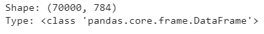

（图片由作者提供）

数据集被加载为 Pandas 数据框。形状为（70000, 784）。数据集中有 70000 个观测值（图像）。每个观测值有 784 个特征（像素值）。图像的大小为 28 x 28。以这种方式加载 MNIST 数据集时，每张图像被表示为一个包含 784（28 x 28）元素的一维数组。这是我们完成此任务所需的格式，数据集无需进一步修改。

或者，你也可以使用 Keras 加载 MNIST 数据集。那样的话，你将获得每张图像的 28 x 28 二维数组，而不是一维数组。你可以在[这里](https://medium.com/data-science-365/acquire-understand-and-prepare-the-mnist-dataset-3d71a84e07e7)了解更多信息。

## 第 2 步：可视化原始图像的样本

现在，我们将可视化 MNIST 数据集中前五张图像的样本。这个样本可以用来与 NMF 模型的输出进行比较。

```py
import matplotlib.pyplot as plt

n = 5
plt.figure(figsize=(6.75, 1.5))
for i in range(n):
  ax = plt.subplot(1, n, i+1)
  plt.imshow(image_data.iloc[i].values.reshape(28, 28), cmap="binary")
  ax.axis('off')

plt.show()
```

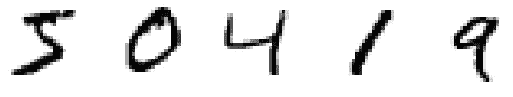

**原始 MNIST 数字的样本**（图片由作者提供）

## 第 3 步：应用具有 9 个组件的 NMF（d = 9）

```py
from sklearn.decomposition import NMF

nmf_model = NMF(n_components=9, init='random', random_state=0)
image_data_nmf = nmf_model.fit_transform(image_data)

print("Shape:", image_data_nmf.shape)
print("Type:", type(image_data_nmf))
```

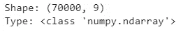

（图片由作者提供）

现在，新的维度是 9。原始维度为 784。因此，维度已经显著降低！

要获取**V**、**W**和**H**矩阵的形状，我们可以运行以下代码。

```py
print("V_shape:", image_data.shape)
print("W_shape:", image_data_nmf.shape)
print("H_shape", nmf_model.components_.shape)
```


（图片由作者提供）

要获取重建误差或**V**与**WH**乘积之间的β散度，我们可以运行以下代码。

```py
nmf_model.reconstruction_err_
```

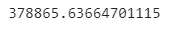

（图片由作者提供）

重建误差非常高。这是因为我们只选择了 784 中的 9 个组件。我们可以通过可视化输出来验证这一点。

```py
image_data_nmf_recovered = nmf_model.inverse_transform(image_data_nmf)

n = 5
plt.figure(figsize=(6.75, 1.5))
for i in range(n):
  ax = plt.subplot(1, n, i+1)
  plt.imshow(image_data_nmf_recovered[i, :].reshape(28, 28), cmap="binary")
  ax.axis('off')

plt.show()
```

**NMF 输出：9 个组件或 d = 9**

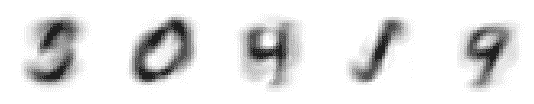

**NMF 输出：9 个组件或 d = 9**（图片由作者提供）

数字不清晰。你可以将此输出与原始图像的样本进行比较。

我运行了 NMF 算法，选择了 100、225 和 784 个组件。以下是结果。

**NMF 输出：100 个组件或 d = 100**

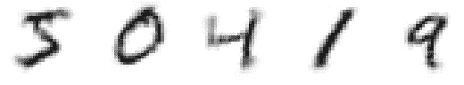

**NMF 输出：100 个组件或 d = 100**（图片由作者提供）

重建误差为 174524.20。

**NMF 输出：225 个组件或 d = 225**

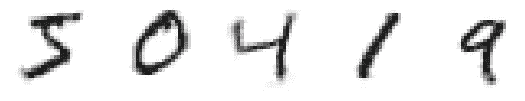

**NMF 输出：225 个组件或 d = 225**（图片由作者提供）

重建误差为 104024.62。

**NMF 输出：784 个组件或 d = 784（所有组件）**

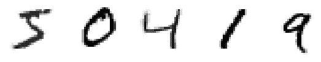

**NMF 输出：784 个组件或 d = 784**（图片由作者提供）

重建误差为 23349.67。

# 结论

> 当运行非负矩阵分解（NMF）时，组件数量增加，图像变得更清晰，重建误差变得更低。

通过查看输出和重建误差，可以选择一个合适的***d***值。为此，你需要多次运行 NMF 算法，这可能会根据你计算机的资源而耗时。

使用 d = 784（所有组件），你***仍然***会得到 23349.67 的重建误差，而不是零。

> 显然，W 和 H 矩阵的乘积仅仅给出了特征矩阵 V 的非负矩阵近似。

***我们能在负矩阵上运行 NMF 吗？***

答案是***不***。如果你尝试使用含有负值的特征矩阵进行 NMF，你将得到以下**ValueError!**

```py
import numpy as np
from sklearn.decomposition import NMF

V = np.array([[1, 1, -2, 1], [2, 1, -3, 2], [3, 1.2, -3.3, 5]])

nmf_model = NMF(n_components=2, init='random', random_state=0)
W = nmf_model.fit_transform(V)

print("V_shape:", V.shape)
print("W_shape:", W.shape)
print("Reconstruction error:", nmf_model.reconstruction_err_)
```

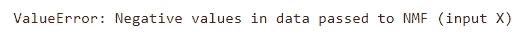

**ValueError!**（图片由作者提供）

> 在运行非负矩阵分解（NMF）时，不能打破非负性约束。特征矩阵应始终包含非负元素。

这是今天文章的结束。

**如果你有任何问题或反馈，请告诉我。**

## 你可能感兴趣的其他矩阵分解方法

+   [**特征分解**](https://medium.com/data-science-365/eigendecomposition-of-a-covariance-matrix-with-numpy-c953334c965d)

+   **奇异值分解**

## 阅读下一篇（推荐）

+   [**PCA 与降维专题合集**](https://rukshanpramoditha.medium.com/list/pca-and-dimensionality-reduction-special-collection-146045a5acb5)

+   **RGB 与灰度图像在 NumPy 数组中的表示**

+   [**获取、理解与准备 MNIST 数据集**](https://medium.com/data-science-365/acquire-understand-and-prepare-the-mnist-dataset-3d71a84e07e7)

## 来一门 AI 课程怎么样？

+   [**神经网络与深度学习课程**](https://rukshanpramoditha.medium.com/list/neural-networks-and-deep-learning-course-a2779b9c3f75)

## 加入我的私人邮件列表

*永远不要再错过我的精彩故事。通过* [***订阅我的邮件列表***](https://rukshanpramoditha.medium.com/subscribe)*，你将直接收到我发布的故事。*

非常感谢你们的持续支持！下篇文章见。祝大家学习愉快！

## MNIST 数据集信息

+   **引用：** Deng, L., 2012\. The mnist database of handwritten digit images for machine learning research. **IEEE Signal Processing Magazine**, 29(6), pp. 141–142.

+   **来源：** [`yann.lecun.com/exdb/mnist/`](http://yann.lecun.com/exdb/mnist/)

+   **许可证：** *Yann LeCun*（纽约大学 Courant 研究所）和*Corinna Cortes*（谷歌实验室，纽约）持有 MNIST 数据集的版权，该数据集在*Creative Commons Attribution-ShareAlike 4.0 International License*（[**CC BY-SA**](https://creativecommons.org/licenses/by-sa/4.0/)）下提供。你可以在[这里](https://rukshanpramoditha.medium.com/dataset-and-software-license-types-you-need-to-consider-d20965ca43dc#6ade)了解更多不同的数据集许可证类型。

**设计与撰写：**

[Rukshan Pramoditha](https://medium.com/u/f90a3bb1d400?source=post_page-----8450f4cae8fa--------------------------------)

**2023–05–06**
