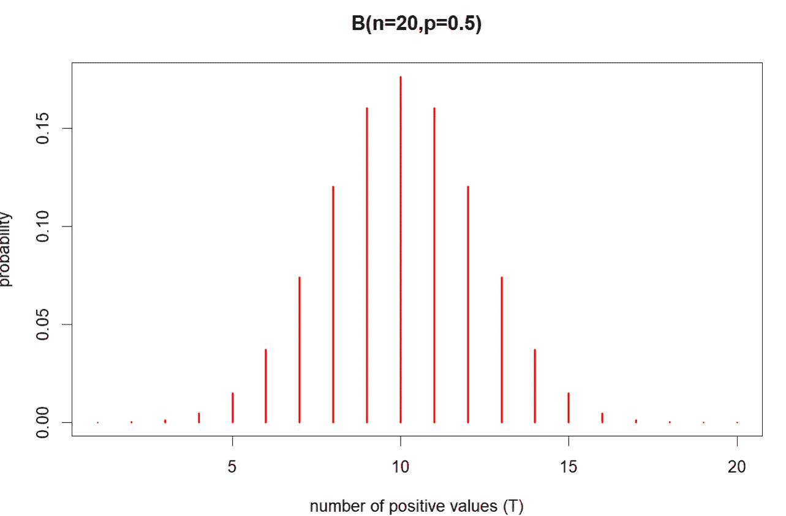
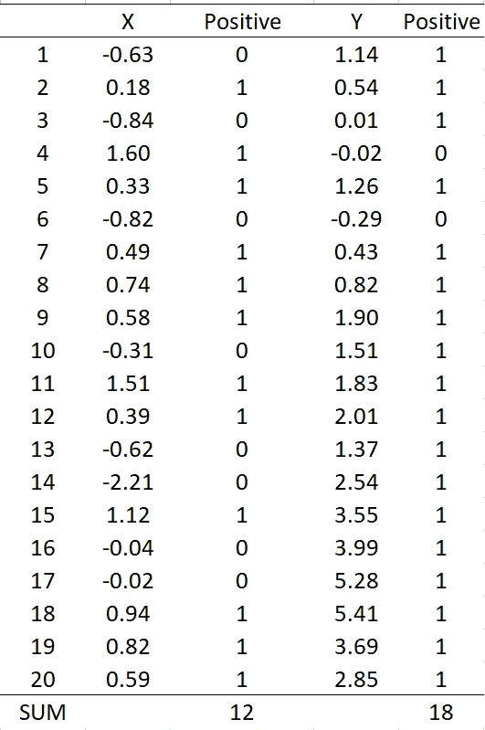
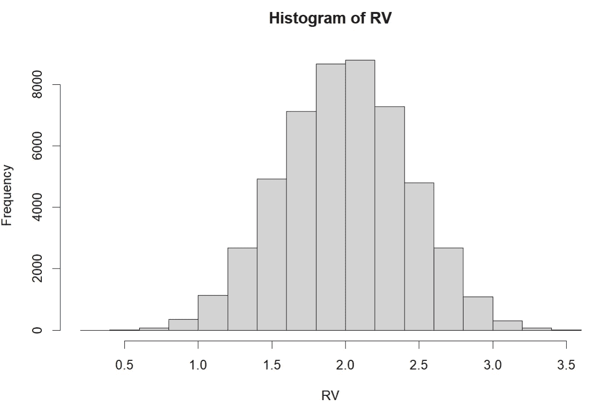
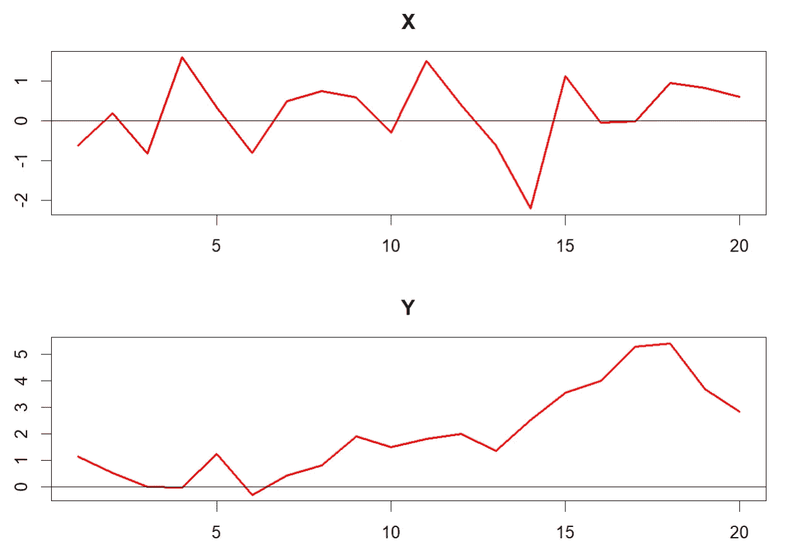
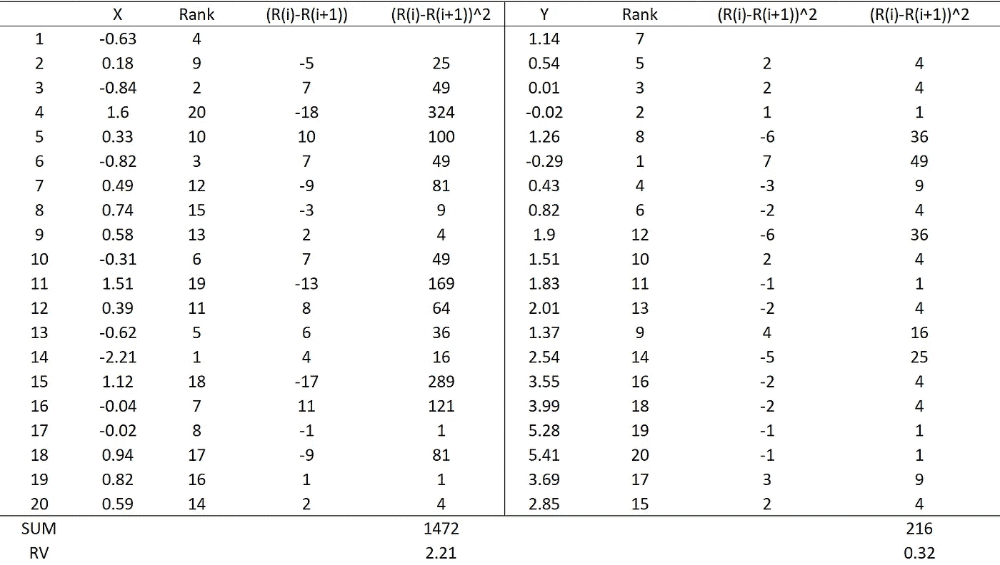

# 非参数检验入门（第一部分：秩和符号检验）

> 原文：[`towardsdatascience.com/non-parametric-tests-for-beginners-part-1-rank-and-sign-tests-629704f27f2f`](https://towardsdatascience.com/non-parametric-tests-for-beginners-part-1-rank-and-sign-tests-629704f27f2f)

## 附有示例和 R 代码

[](https://medium.com/@jaekim8080?source=post_page-----629704f27f2f--------------------------------)[](https://towardsdatascience.com/?source=post_page-----629704f27f2f--------------------------------) [Jae Kim](https://medium.com/@jaekim8080?source=post_page-----629704f27f2f--------------------------------)

·发表于[Towards Data Science](https://towardsdatascience.com/?source=post_page-----629704f27f2f--------------------------------) ·阅读时长 9 分钟·2023 年 6 月 1 日

--


图片由[Joshua Earle](https://unsplash.com/@joshuaearle?utm_source=medium&utm_medium=referral)提供，来源于[Unsplash](https://unsplash.com/?utm_source=medium&utm_medium=referral)

非参数检验是推断统计的一个重要分支。然而，许多数据科学家和分析师对它的使用还不广泛，也没有完全理解它。它是传统 t 检验等参数检验的自然替代方法，具有一系列优点，并在现代应用如 A/B 测试中具有很大的潜力。

非参数检验基于数据点的秩或符号，或使用如自助法（bootstrap）等重采样方法构建。在这篇文章中，讨论了基于秩和符号的检验，并提供了示例和 R 代码。自助法将在系列的第二部分中讨论。我想感谢 Venkat Raman，他最近的[LinkedIn 帖子](https://www.linkedin.com/feed/update/urn:li:activity:7068311379614593024/)激发了这篇文章的写作。

# 1\. 参数检验与非参数检验

推断统计或假设检验的关键元素如下：

1.  零假设和备择假设（H0 和 H1）

1.  检验统计量

1.  在 H0 下的检验统计量的采样分布

1.  决策规则（p 值或临界值，在给定的显著性水平下）

## 参数检验

包括诸如 t 检验、F 检验和卡方检验等知名检验。参数检验的一个典型特征是

+   这需要估计未知参数，如均值和方差；以及

+   它的采样分布遵循正态分布或由正态分布衍生出的其他分布（例如，F 分布或卡方分布）。

为确保采样分布的正态性，总体应遵循正态分布。如果总体不正态，则当样本量足够大时，采样分布可以通过正态分布进行近似。这称为*渐近近似*，其有效性基于在一系列参数假设下的中心极限定理。

## 非参数检验

非参数检验以不同于其参数对等方法的方式计算检验统计量及其采样分布：

+   这些分布是通过完全依赖数据的方法获得的，例如数据点的秩和符号，而不需要估计总体参数。

+   非参数检验具有*精确*的采样分布，即它可以在不依赖任何近似的情况下获得。该分布要么完全通过解析获得，要么可以通过蒙特卡罗模拟计算获得。

非参数检验的优点包括以下几点：

+   它不需要强参数假设，如总体的正态性；

+   它不需要对其采样分布进行渐近近似；

+   由于采样分布是精确的，因此显著性水平（第一类错误的概率）在重复采样中始终是正确的（无规模失真）；

+   它的 p 值和临界值也是精确的；

+   它的检验功效（拒绝虚假零假设的概率）通常高于其参数替代方法，尤其是在样本量较小的情况下。

它的主要缺点是当样本量较大或非常大时，计算精确的采样分布（以及精确的 p 值和临界值）可能会很耗时。然而，这在现代计算能力日益增强的情况下是一个小问题。此外，许多非参数检验采用解析公式或高效算法，当计算负担较重时，可以准确地近似其精确 p 值或临界值。

# 2\. 简单的非参数检验

## 中位数的符号检验

考虑一个完全随机从其总体中生成的变量 X。使用其样本实现 (X1, …, Xn)，研究者希望进行检验

H0: 中位数 = 0；H1: 中位数 ≠ 0。

在 H0 下，每个 X 值应为正（或负），概率为 0.5。或者，在 H0 下，X 的正案例的期望数为 n/2。

设测试统计量 T(X,n) 为 X > 0 的总案例数。假设 H0 下 T(X,n) 的采样分布服从一个具有 n 次试验的二项分布，每次试验的成功概率 (p) 等于 0.5，记作 B(n, p = 0.5)。分布 B(n=20, p = 0.5) 如下图所示：



T(X, n=20) 的精确采样分布，图片由作者创建

上述是 n = 20 时在 H0 下检验统计量 T(X,n) 的精确采样分布。如果 T(X,n) 的观测值接近 10，则不能拒绝原假设。检验的精确 p 值可以使用 R 中的 *binom.test* 函数计算。

作为一个例子，考虑以下的 X 和 Y 值，其中 n = 20。



表 1（如果 X > 0 则 Positive = 1；否则 Positive = 0），图像由作者创建

从上表 1 可知，T(X) = 12 和 T(Y) = 18，X 的中位数为 0.36，Y 的中位数为 1.67。显然，X 与 H0 高度兼容，而 Y 不兼容。X 的检验精确 p 值为 0.5034，Y 的检验精确 p 值为 0.0004，这些可以使用下面的 R 函数获得：

```py
x = c(-0.63, 0.18,-0.84,1.60,0.33, -0.82,0.49,0.74,0.58,-0.31,
      1.51,0.39,-0.62,-2.21,1.12,-0.04,-0.02,0.94,0.82,0.59)

y=c(1.14,0.54,0.01,-0.02,1.26,-0.29,0.43,0.82,1.90,1.51,
    1.83,2.01,1.37,2.54,3.55, 3.99,5.28,5.41,3.69,2.85)

# Test statistics
Tx=sum(0.5*(sign(x)+1)); Ty=sum(0.5*(sign(y)+1))

# Sign test
binom.test(x=Tx,n=20,p=0.5); binom.test(x=Ty,n=20,p=0.5)
```

当 n 较大时，采样分布仍然精确地遵循 B(n, p = 0.5)。然而，该分布接近于均值为 0.5n 和方差为 0.25n 的正态分布。因此，当 n 较大时，正态分布可以作为精确分布 B(n, p=0.5) 的近似。

## 2\. 随机性秩检验

可以使用数据的秩对一组时间序列观测进行简单的随机性检验。秩是样本观测值（X1, …, Xn）按升序排列的排名值。即，值 1 被分配给 X 的最小值；值 2 被分配给 X 的下一个最小值；依此类推，直到值 n 被分配给最大值。

原假设是时间序列是完全随机的，而备择假设是时间序列不是完全随机的。[Bartels (1982)](https://www.researchgate.net/publication/230639951_The_Rank_Version_of_von_Neumann's_Ratio_Test_for_Randomness) 提出了以下形式的检验统计量：

方程 (1)

其中 Ri 是第 i 个值 (Xi) 在 n 次观测序列中的秩。在原假设下，（R1, …, Rn）以相等的概率遵循（1, …., n）的任何排列。这是因为如果时间序列观测是完全随机的，其秩也应是完全随机的。基于这一点，RV 的精确分布可以使用以下 R 代码进行模拟：

```py
nit=50000   # number of Monte Carlo iterations
n=20        # Sample size

# Calculating RV statistic
RV=matrix(NA,ncol=1,nrow=nit)
for (i in 1:nit) {
ranking <- sample(1:n, n, replace = FALSE)
RV[i,] = sum(diff(ranking)²)/(n*(n²-1)/12)
}

# Histogram
hist(RV)

# Critical Values replicating the values in Table 2 of Bartels (1982)
quantile(RV,probs = c(0.01,0.05,0.10))

1%       5%      10% 
1.013534 1.285714 1.439098 
```

上述 R 代码生成了在 H0 下 n = 20 时的 RV 精确采样分布，绘制在下方：



RV 的精确采样分布，图像由作者创建

精确的 p 值或临界值是按照通常的方式从上述分布中获得的。请注意，临界值（用上面的 R 代码给出）与 Bartels（1982）列出的值几乎相同。

如果方程 (1) 中给出的计算 RV 统计量小于显著性水平下的临界值，则拒绝完全随机的原假设。这是因为完全随机的序列的秩值也应是完全随机的，这会导致 RV 统计量的值较大（见下面的例子）。

当样本量较大或巨大的时候，上述模拟仍然可以进行，以生成确切的采样分布，而不会带来很大的计算负担。Bartels（1982）还提供了这些确切临界值的近似公式。

例如，考虑表 1 中的 X 和 Y，如下图所示：



X 和 Y 的时间图（图片由作者创建）

变量 X 围绕 0 随机变化，而 Y 则显示出上升趋势，这是非纯随机时间序列的特征。以下 R 代码绘制了 X 和 Y，并计算了 RV 统计量及其 p 值：

```py
# plots
plot.ts(x,col="red",lwd=2,main="X"); abline(h=0)
plot.ts(y,col="red",lwd=2,main="Y"); abline(h=0)

# RV statistics and p-values
library(trend)
bartels.test(x); bartels.test(y)
```

X 的 RV 统计量为 2.21，p 值为 0.6844；而 Y 的为 0.32，p 值为 0.0000。这意味着在常规显著性水平下，不能拒绝 X 是纯随机的零假设，但 Y 的零假设被拒绝。

计算过程也在下表中说明：



X 和 Y 的 RV 统计量的说明（图片由作者创建）

作为一个纯随机序列，X 的秩值完全随机且高度变化（导致 RV 的分子值很大）。相反，Y 不是纯随机的，其秩值变化不大。由于这一特性，X 的 RV 统计量比 Y 的要大得多。

## 3. 威尔科克森检验

威尔科克森检验（[McDonald, 2014](http://www.biostathandbook.com/wilcoxonsignedrank.html)）是 Welch 两样本 t 检验的非参数替代方法。零假设是两个总体的中位数值相等，对立假设是它们不相等。检验有两个版本：

+   威尔科克森秩和检验（也称为 Mann–Whitney–Wilcoxon 检验），当 X 和 Y 独立时；以及

+   威尔科克森符号秩检验，当 X 和 Y 配对时。

设(X1, …, Xn)和(Y1, …, Ym)为来自各自总体的随机样本。独立样本的检验统计量（威尔科克森秩和检验）为

其中 S(X,Y) = 1，如果 X > Y；S(X,Y) = 0.5，如果 X = Y；S(X,Y) = 0，如果 X < Y。

依赖样本情况下的统计量（威尔科克森符号秩检验）计算为

其中 Zi = Xi — Yi；如果 Zi > 0，则 sgn(Zi) = 1；否则 sgn(Zi) = —1；Ri 为|Zi|（Zi 的绝对值）的秩。注意有不同版本的 T 统计量，但它们都是等效的。

对于 U 和 T 统计量，H0 下的确切采样分布可以通过蒙特卡罗模拟获得，也可以进行近似。

对于表 1 中给出的 X 和 Y，威尔科克森检验的 R 代码为

```py
# Wilcoxon rank-sum test (U)
wilcox.test(x,y,mu=0,paired = FALSE,exact=TRUE)

# Wilcoxon signed rank test (T)
wilcox.test(x,y,mu=0,paired = TRUE,exact=TRUE)
```

其中 H0: μ = 0 且μ = median(X) — median(Y)。U 检验统计量为 67.5，p 值为 0.0004；T 统计量为 11，p 值为 0.0001。因此，在 5%的显著性水平下，两者均拒绝了中位数相等的零假设。

本文回顾了三种基于秩和符号的简单非参数检验。非参数检验和参数检验之间的主要区别在于检验统计量及其在 H0 下的采样分布的计算方式。也就是说，

+   非参数检验的检验统计量和采样分布是使用完全依赖数据的方法获得的，如秩和符号，而不需要估计未知的总体参数。

+   它们是在没有依赖任何参数假设或基于中心极限定理的渐近近似的情况下获得的。

+   非参数检验的采样分布是精确的。因此，检验在没有任何规模失真的情况下进行，其 p 值和临界值都是精确的。

+   非参数检验通常比其参数检验对照显示出更好的统计性质（例如，更高的统计功效和没有规模失真），尤其是当样本量较小或参数检验的假设被违反时。

强烈建议研究人员在他们的应用中（例如 A/B 测试）采用这些非参数检验作为参数检验的替代方案。在这篇文章中，介绍了几个简单的非参数检验，附有示例和 R 代码。

参考文献：

Bartels, R. (1982). 《冯·诺伊曼随机性比率检验的秩版本》。*美国统计学会杂志*, *77*(377), 40–46。

McDonald, J. H. (2014). *生物统计学手册*. 纽约。 [`www.biostathandbook.com/wilcoxonsignedrank.html`](http://www.biostathandbook.com/wilcoxonsignedrank.html)
