# 非线性维度降低、核 PCA（kPCA）和多维尺度分析— Python 简单教程

> 原文：[`towardsdatascience.com/nonlinear-dimension-reduction-kernel-pca-kpca-and-multidimensional-scaling-an-easy-tutorial-63429ee9d0ae`](https://towardsdatascience.com/nonlinear-dimension-reduction-kernel-pca-kpca-and-multidimensional-scaling-an-easy-tutorial-63429ee9d0ae)

## 如何在不破坏瑞士卷的情况下将其展平!!

[](https://medium.com/@biman.pph?source=post_page-----63429ee9d0ae--------------------------------)[](https://towardsdatascience.com/?source=post_page-----63429ee9d0ae--------------------------------) [Biman Chakraborty](https://medium.com/@biman.pph?source=post_page-----63429ee9d0ae--------------------------------)

·发表于 [Towards Data Science](https://towardsdatascience.com/?source=post_page-----63429ee9d0ae--------------------------------) ·阅读时长 11 分钟·2023 年 12 月 11 日

--

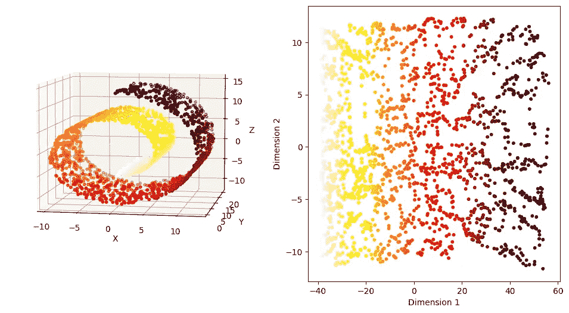

瑞士卷数据（作者提供的图片）

在我的文章 [**主成分分析（PCA）— Python 简单教程**](https://medium.com/@biman.pph/principal-component-analysis-pca-an-easy-tutorial-with-python-c623b583cf29) 中，我讨论了如何使用 PCA 来减少数据的维度，同时尽可能保留点对点之间的距离。我用 MNIST 手写数据集举了一些例子，说明 PCA 如何将数据的维度从 784 降到 35，并且仍然能够使用高准确度的监督学习技术。

在这篇文章中，我们以一个简单的**瑞士卷**数据的三维示例开始，其中数据的真实流形具有 2 维，我们将从 PCA 开始。

# 示例：瑞士卷数据集

图 1 显示了使用`sklearn`库模拟的瑞士卷数据，包含𝑛=2000 个点。散点图显示了不同颜色的点分布在螺旋的不同部分。

```py
#Load the libraries
import pandas as pd
import numpy as np
import matplotlib.pyplot as plt
import seaborn as sns

#Generate the Swiss Roll Dataset
from sklearn.datasets import make_swiss_roll

np.random.seed(42)
n_samples = 2000
X, t = make_swiss_roll(n_samples, noise=0.0)

fig = plt.figure(figsize=(10,8))
ax = fig.add_subplot(projection='3d')
ax.scatter(X[:,0], X[:,1], X[:,2], c=t, s=10, cmap='hot_r')
ax.set_xlabel('X')
ax.set_ylabel('Y')
ax.set_zlabel('Z')
#ax.set_zlim(-1,1)
ax.view_init( elev=7, azim=-80)
plt.show()
```

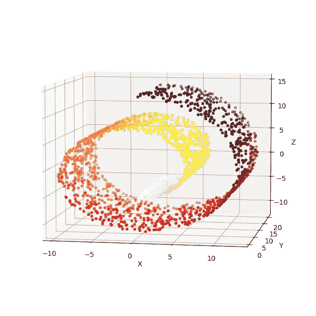

图 1：瑞士卷数据的三维视图（作者提供的图片）

我们首先对这个数据集应用 PCA，并在图 2 中可视化前两个主成分。我们观察到它仍然保留了数据的螺旋形状。螺旋的不同部分的点无法使用线性边界分离，大多数分类方法在降维后的数据上将会失败。

```py
from sklearn.decomposition import PCA
pca_X = PCA(n_components=2)
prcomps_X= pca_X.fit_transform(X)

fig = plt.figure(figsize=(6,4))
plt.scatter(prcomps_X[:,0], prcomps_X[:,1],c=t, s=10, cmap='hot_r')
plt.xlabel('PCA Dimension 1')
plt.ylabel('PCA Dimension 2')
plt.show()
```

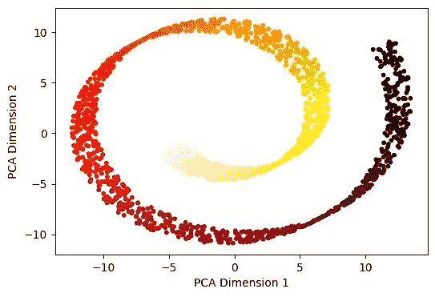

图 2：瑞士卷数据的前两个主成分维度（作者提供的图片）

它没有展开潜在的二维空间。为什么会这样？为了理解这一点，我们来看一下图 3，其中两点 A 和 B 之间的欧几里得距离用蓝色虚线表示。尽管这两点位于螺旋的完全不同部分，它们在欧几里得距离上却很接近。

```py
u = np.linspace(0,1,100)
t1 = 1.5*np.pi*(1+2*u)
x1 = t1*np.cos(t1)
z1 = t1*np.sin(t1)
y1 = 10*np.ones((len(t1),))

fig = plt.figure(figsize=(10,8))
ax = fig.add_subplot(projection='3d')
ax.scatter(X[:,0], X[:,1], X[:,2], s=2,c='gray')
ax.plot(x1[20:90],y1[20:90],z1[20:90], c='red',linewidth=2.0)
ax.plot(x1[[20,89]],y1[[20,89]],z1[[20,89]], 'b--',linewidth=2.0)
ax.scatter(x1[[20,89]],y1[[20,89]],z1[[20,89]], 'o',s=50, alpha=1)
ax.text(x1[20], y1[20], z1[20]+1, s='A',c='k',fontweight='bold',size=12,alpha=1 )
ax.text(x1[89], y1[89], z1[89]+1, s='B',c='k',fontweight='bold',size=12,alpha=1 )
ax.set_xlabel('X')
ax.set_ylabel('Y')
ax.set_zlabel('Z')
ax.view_init(7,-80)
plt.show()
```

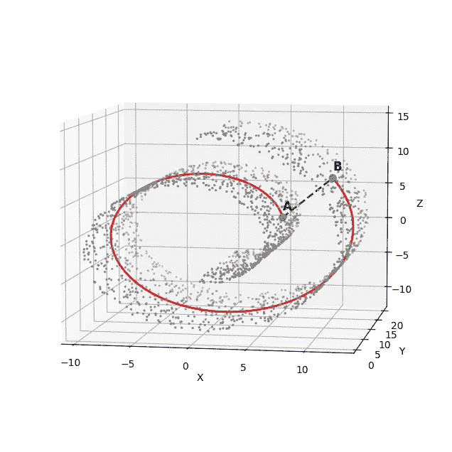

图 3：瑞士卷数据的测地距离与欧几里得距离（图片由作者提供）

在 PCA 中，欧几里得距离被保留。然而，这两点 A 和 B 沿螺旋流形的距离由红线显示，表明这两点在流形上相距较远。关键区别在于流形不是线性的。当我们处理线性流形时，欧几里得距离或 PCA 的效果非常好。但数据往往不在直线流形上，如这个示例数据集所示。其他图像数据，如手写数字数据，是高维数据中非线性流形的好例子。

我们需要以不同的方式定义距离以捕捉这种差异。但在此之前，我们先讨论一下如何利用距离构建主成分。

# 主成分：数学公式

给定一个 𝑛×𝑝 数据矩阵 𝐗，*主成分方向* 被定义为在这些方向上，𝐗 的样本方差依次被最大化的 𝑝 维正交向量。对于中心化的 𝐗，即 𝐗 的每一列之和为 0，第 𝑘 个主成分方向是

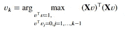

𝑛 维向量 𝐗𝑣_𝑘 称为 𝐗 的第 𝑘 个 *主成分得分*，且 𝑢_𝑘=(𝐗𝑣_𝑘)/𝑑_k 是归一化的第 𝑘 个主成分得分，其公式为

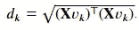

数量 *d²_k/n* 是 𝑣_𝑘 解释的方差量。

𝐗 的 *奇异值分解* 𝐗 = 𝑈𝐷𝑉^⊤ 描述了所有主成分得分和方差，其中 𝑈 是一个 𝑛×𝑝 维矩阵，列为 𝑢_1,𝑢_2,…,𝑢_𝑝，𝑉 是一个 𝑝×*p* 维矩阵，列为 𝑣_1,𝑣_2,…,𝑣_𝑝，𝐷 是一个 𝑝×𝑝 的对角矩阵，对角元素为 𝑑_1,𝑑_2,…,𝑑_𝑝。

让我们考虑前 𝑘 个主成分得分 𝐗𝑣_1=𝑑_1𝑢_1, …, 𝐗𝑣_𝑘=𝑑_𝑘𝑢_𝑘 作为新的特征向量。然后我们可以将其写成 𝐙=𝐗𝑉_𝑘=(𝑈𝐷)_𝑘，也就是矩阵 (𝑈𝐷) 的前 𝑘 列，并将 **Z** 视为 𝐗 的新低维表示。

𝐙 的行 𝑧_1,…,𝑧_𝑛 是这个新低维表示中的数据点。我们之前讨论过

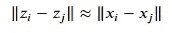

在低维表示中，𝑖 和 𝑗 点之间的欧几里得距离大致等于这两点之间的原始欧几里得距离。

# 内积矩阵

𝑛×𝑛 维矩阵 𝐗𝐗^⊤ 被称为 *内积矩阵*，其 (𝑖,𝑗) 元素由 *𝑥_i*^⊤*x_j* 给出，即矩阵 𝐗 的第 𝑖 行和第 𝑗 行之间的内积。从上面我们可以得出

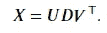

因此我们可以写道，

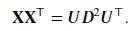

这称为 𝐗𝐗^⊤ 的 *特征分解*，因为 𝑈 的列是 𝐗𝐗^⊤ 的特征向量。从这个表示中，我们可以简单地计算特征分解或 *分解* 内积矩阵 𝐗𝐗^⊤，然后主成分得分由 𝑈𝐷 的列给出，即 𝑑_𝑗𝑢_𝑗，𝑗=1,…,𝑝。这表明，如果仅给出内积矩阵而不是原始数据点，则可以计算主成分得分。

# 仅从距离中获得的低维表示

假设我们只有数据点之间的距离，而没有原始数据。也就是说，我们有欧几里得距离。

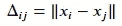

或者所有 𝑖 和 𝑗。我们还能从这些距离中恢复主成分方向吗？

首先定义一个 𝑛×𝑛 维的距离矩阵 Δ，其中 (𝑖,𝑗) 元素由 Δ_𝑖𝑗 给出。我们可以从距离矩阵 Δ 恢复内积矩阵 𝐵=𝐗𝐗^⊤。

1.  创建 𝑛×𝑛 矩阵 𝐴，其 (𝑖,𝑗) 元素由


2\. 对 𝐴 进行双重中心化，即同时中心化 𝐴 的列和行，通过使用变换 *B* = (*I* — *M*)*A*(*I* — *M*) 来恢复矩阵 𝐵，其中

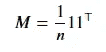

# 核主成分分析

核主成分分析通过用核矩阵 𝐾=((𝐾_𝑖𝑗)) 替换内积矩阵 𝐵 来简单模拟此过程，其中 𝐾_𝑖𝑗=<𝜙(𝑥_𝑖),𝜙(𝑥_𝑗)>，即特征向量 𝜙(𝑥_𝑖) 和 𝜙(𝑥_𝑗) 之间的内积。这里 𝜙 是从 ℝ^𝑝 → 𝐹 的非线性映射，𝐹 是任意维度的特征空间。这个想法类似于用于分类问题的支持向量机（SVM）中的核函数。我们将观察值投影到一个更高维的空间中，然后在该空间中获得主成分。我们可以简单地定义 𝐾_𝑖𝑗=Φ(𝑥_𝑖,𝑥_𝑗)，对于径向基核，

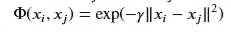

对于多项式核，

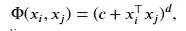

其中 𝛾、𝑐 和 𝑑 是相应核函数的参数。

算法可以描述如下：

1.  将 𝑛×𝑛 核内积矩阵 𝐾 定义为 𝐾=((Φ(𝑥_𝑖,𝑥_𝑗))。

1.  使用 𝐾 的特征分解来提取 𝐾 的特征值和特征向量。

1.  𝐾 的特征向量将给出主成分得分。

这是一种非线性降维，我们可以通过在前面示例中讨论的 **瑞士卷** 数据来说明核主成分分析的使用。

```py
from sklearn.decomposition import KernelPCA
kpca_X = KernelPCA(n_components=2, kernel='rbf', gamma=0.002)
prcomps_kX= kpca_X.fit_transform(X)

fig = plt.figure(figsize=(6,4))
plt.scatter(prcomps_kX[:,0], prcomps_kX[:,1],c=t, s=10, cmap='hot_r' )
plt.xlabel('Kernel PCA Dimension 1')
plt.ylabel('Kernel PCA Dimension 2')
plt.show()
```

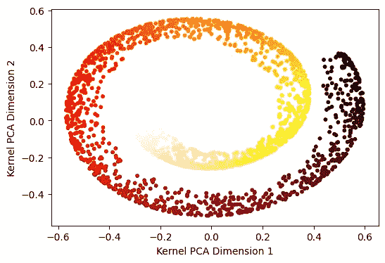

图 4：瑞士卷数据的核主成分分析维度（作者提供的图片）

在上述内容中，我们使用了一个`rbf`核，𝛾 = 0.002。尽管结果相比主成分分析有所改进，但它仍然没有展开瑞士卷数据，而是很好地捕捉了流形。

我们在下面用不同的模拟数据集展示了核主成分分析。

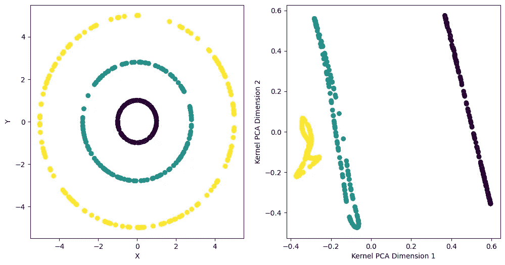

图 5：左侧模拟数据的核 PCA 维度。（作者提供的图片）

在左侧，我们有一个包含半径分别为 1.0、2.8 和 5.0 的 3 个同心圆的模拟数据，分布均匀。在右侧，我们绘制了使用`rbf`核和𝛾=0.3 的核 PCA 组件。我们观察到数据的三个簇之间有很好的分离。

# 多维缩放

我们在[关于 PCA 的文章](https://medium.com/@biman.pph/principal-component-analysis-pca-an-easy-tutorial-with-python-c623b583cf29)中讨论过，它试图在低维表示中保留观察之间的距离。换句话说，如果 𝑧_1,𝑧_2,…,𝑧_𝑛 是 𝑥_1,𝑥_2,…,𝑥_𝑛 的低维表示，那么 PCA 最小化

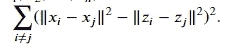

我们现在通过定义一个*压力*函数来推广这个想法，如下所示：

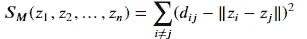

其中 𝑑_𝑖𝑗 是 𝑥_𝑖 和 𝑥_𝑗 之间的距离。通常，我们选择欧几里得距离，但也可以使用其他距离。

**多维缩放**寻求值 𝑧_1,𝑧_2,…,𝑧_𝑛∈ℝ^𝑘，以最小化*压力函数* 𝑆_𝑀(𝑧_1,𝑧_2,…,𝑧_𝑛)。

这被称为*最小二乘*或*Kruskal–Shephard 缩放*。这个想法是找到一个低维的数据表示，尽可能保留成对的距离。请注意，这种近似是基于距离而不是平方距离的。

让我们看看它在**瑞士卷**数据上的实现。

```py
from sklearn.manifold import MDS

embedding = MDS(n_components=2, normalized_stress='auto')
X_MDS = embedding.fit_transform(X)

fig = plt.figure(figsize=(6,4))
plt.scatter(X_MDS[:,0], X_MDS[:,1],c=t, s=10, cmap='hot_r' )
plt.xlabel('MDS Dimension 1')
plt.ylabel('MDS Dimension 2')
plt.show()
```

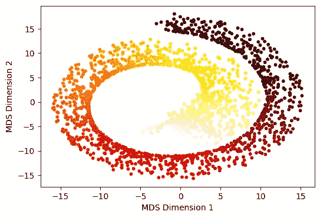

图 6：经典多维缩放的前两个维度。（作者提供的图片）

我们观察到结果与核主成分分析（kernel PCA）非常相似。

到目前为止，我们还没有超越欧几里得距离。但我们之前提到，在瑞士卷数据中，欧几里得距离并不理想。

有一类方法构造一个更复杂的距离 𝑑_𝑖𝑗 来度量高维点 𝑥_1,…,𝑥_𝑛∈ℝ^𝑝 之间的距离，然后将这些 𝑑_𝑖𝑗 通过多维缩放处理，以获得低维表示 𝑧_1,…,𝑧_𝑛∈ℝ^𝑘。这样，我们不仅得到主成分得分，我们的低维表示可能最终成为数据的*非线性函数*。

# 切向距离

*切向距离*是一个我们可以通过多维缩放（虽然也用于其他地方）运行的更复杂的度量。

一个激励示例是我们之前使用的 *手写数字数据*。这里，我们有 *16 \times 16* 的图像，将其视为点 𝑥_𝑖∈ℝ²⁵⁶（即，它们被展开成向量）。例如，如果我们取一个“3”并 *旋转* 它一个小角度，我们希望旋转后的图像被认为接近原始图像。这在欧几里得距离中不一定成立。

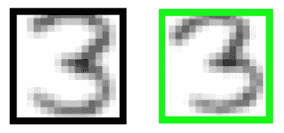

图 7：原始“3”和旋转后的“3”图像（图片由作者提供）

我们可以定义 Δ_𝑖𝑗^rotation 为旋转后的 𝑥_𝑖 和旋转后的 𝑥_𝑗 之间的最短欧几里得距离。然而，你可以立即发现旋转数字“6”和“9”存在问题。

我们需要一些更容易计算的东西，并且将注意力限制在 *小旋转* 上。可以将图像的旋转集视为定义了 ℝ^𝑝 中的曲线——一个图像 𝑥_𝑖 是 ℝ^𝑝 中的一个点，当我们在任意方向上旋转它时，我们得到一条曲线。

**切线距离** Δ_𝑖𝑗^tangent 通过首先计算每条曲线在观察到的图像处的切线，然后使用切线之间的最短欧几里得距离来定义。

# 等距特征映射（Isomap）

*等距特征映射*（Isomap）在更一般的设置中学习结构以定义距离。基本思想是构造一个图 𝐺=(𝑉,𝐸)，即在顶点 𝑉={1,…,𝑛} 之间构造边 𝐸，基于 𝑥_1,…,𝑥_𝑛∈ℝ^𝑝 之间的结构。然后我们定义 𝑥_𝑖 和 𝑥_𝑗 之间的图距离 Δ_𝑖𝑗^Isomap，并使用多维缩放进行低维表示。

**构造图**：对于每对 𝑖,𝑗，如果满足以下任一条件，我们将 𝑖,𝑗 用边连接：

+   𝑥_𝑖 是 𝑥_𝑗 的 𝑚 个最近邻之一，或者

+   𝑥_𝑗 是 𝑥_𝑖 的 𝑚 个最近邻之一。这条边 𝑒 = {𝑖,𝑗} 的权重为 𝑤_𝑒=‖𝑥_𝑖−𝑥_𝑗‖。

**定义图距离**：现在我们已经构建了图，即我们已经构建了边集 𝐸，我们定义图距离 Δ_𝑖𝑗^Isomap 为从 𝑖 到 𝑗 的最短路径：

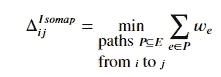

（这可以通过例如 *迪杰斯特拉算法* 或 *弗洛伊德算法* 计算）

让我们现在深入研究其在 **瑞士卷** 数据上的实现。

```py
from sklearn.manifold import Isomap

embedding = Isomap(n_components=2, n_neighbors=7)
X_iso = embedding.fit_transform(X)

fig = plt.figure(figsize=(6,4))
plt.scatter(X_iso[:,0], X_iso[:,1],c=t, s=10, cmap='hot_r' )
plt.xlabel('Isomap Dimension 1')
plt.ylabel('Isomap Dimension 2')
plt.show()
```

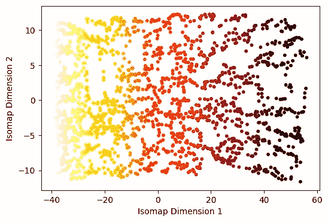

图 8：瑞士卷数据的二维表示。（图片由作者提供）

在邻居数量 𝑚=7 的情况下，多维缩放与 **isomap** 距离现在展开了 **瑞士卷** 数据。

# 局部线性嵌入

另一种非线性维度约减方法是 **局部线性嵌入**（LLE），它在精神上类似但细节却大相径庭。它不使用多维缩放。

基本思想分为两个步骤：

1.  学习一组局部近似来描述 𝑥_1,…,𝑥_𝑛∈ℝ^𝑝 之间的结构

1.  学习一个低维表示 𝑧_1,…,𝑧_𝑛∈ℝ^𝑘，最好与这些局部近似匹配

什么是局部近似？我们只是尝试用附近点𝑥_𝑗的线性函数来预测每个𝑥_𝑖（因此得名局部线性嵌入）。

对于每个𝑥_𝑖，我们首先找到它的𝑚个最近邻，并将它们的索引收集为 N(𝑖)。然后我们构建一个权重向量𝑤_𝑖∈ℝ^𝑛，设置𝑤_𝑖𝑗=0（当𝑗∉N(𝑖)时），并通过最小化来设置𝑤_𝑖𝑗（当𝑗∈N(𝑖)时）。

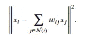

最后，我们取这些权重𝑤_1,…,𝑤_𝑛∈ℝ^𝑛，并通过最小化来拟合低维表示𝑧_1,…,𝑧_𝑛∈ℝ^𝑘。

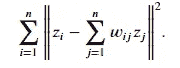

我们再次使用*局部线性嵌入*（Local Linear Embedding）来说明如何处理瑞士卷数据。

```py
from sklearn.manifold import LocallyLinearEmbedding

embedding = LocallyLinearEmbedding(n_components=2, n_neighbors=25)
X_lle = embedding.fit_transform(X)

fig = plt.figure(figsize=(6,4))
plt.scatter(X_lle[:,0], X_lle[:,1],c=t, s=10, cmap='hot_r' )
plt.xlabel('LLE Dimension 1')
plt.ylabel('LLEp Dimension 2')
plt.show()
```

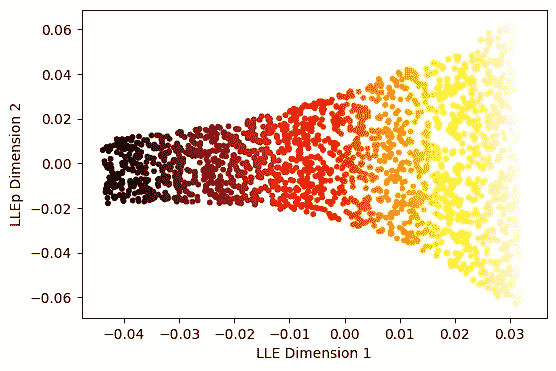

图 9：瑞士卷数据的局部线性嵌入维度。（作者提供的图像）

*局部线性嵌入*的降维效果优于核 PCA 或经典 MDS，尽管不如*Isomap*。

在这篇文章中，我们通过对 PCA 概念的推广学习了一些非线性降维技术。然而，没有一种单一的方法可以适用于所有类型的数据降维。根据数据的性质，我们应选择合适的降维技术。

希望你喜欢这篇文章！！

有关数据科学问题的咨询，请联系 biman.pph@gmail.com
