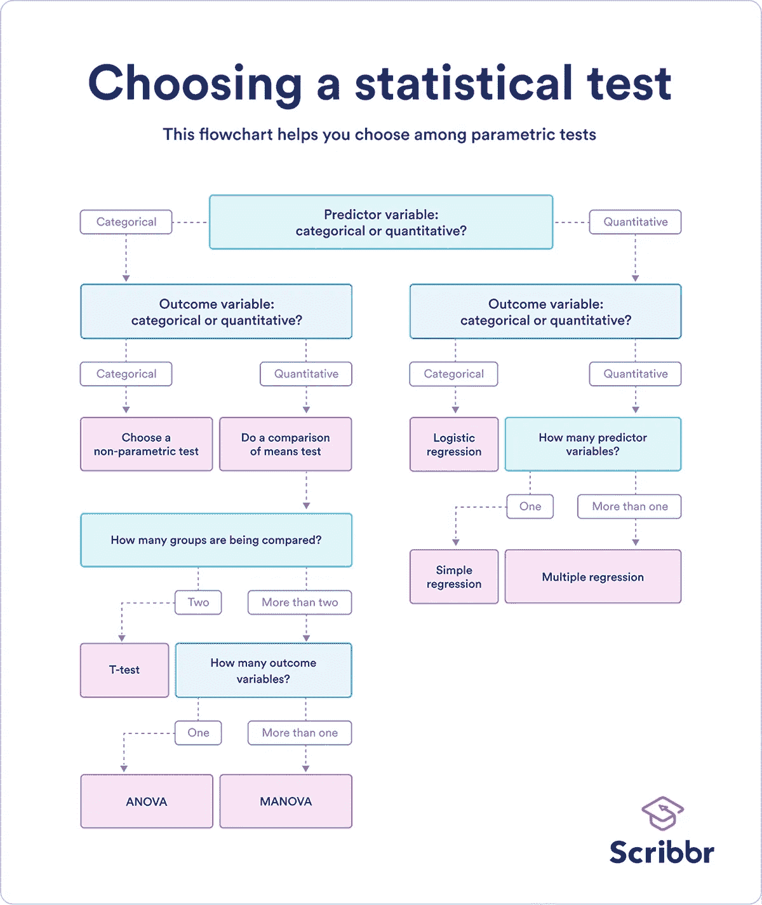
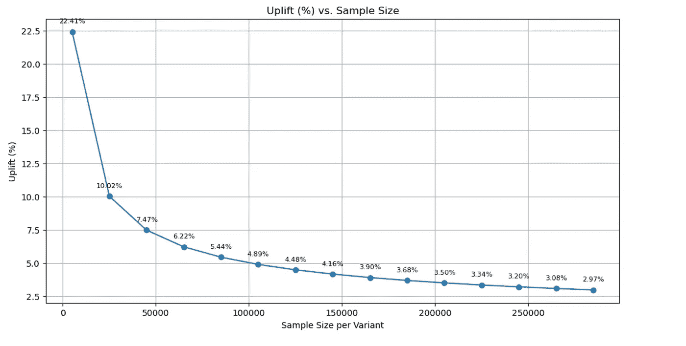
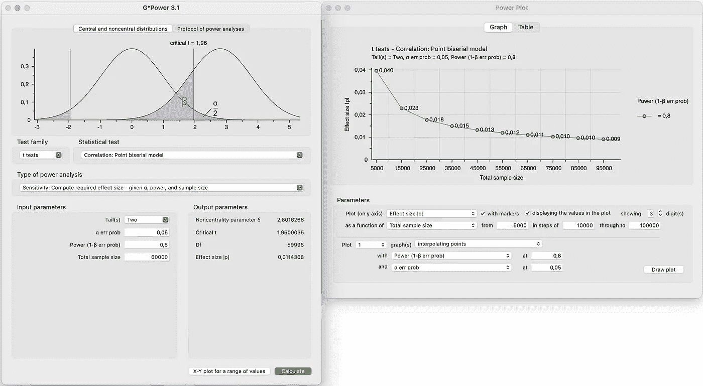
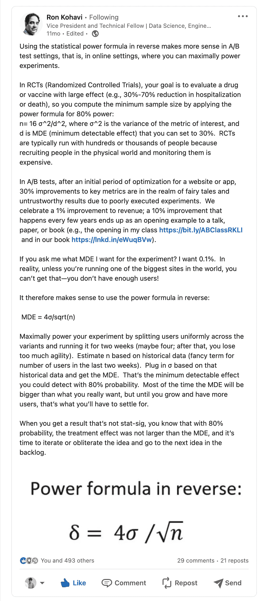
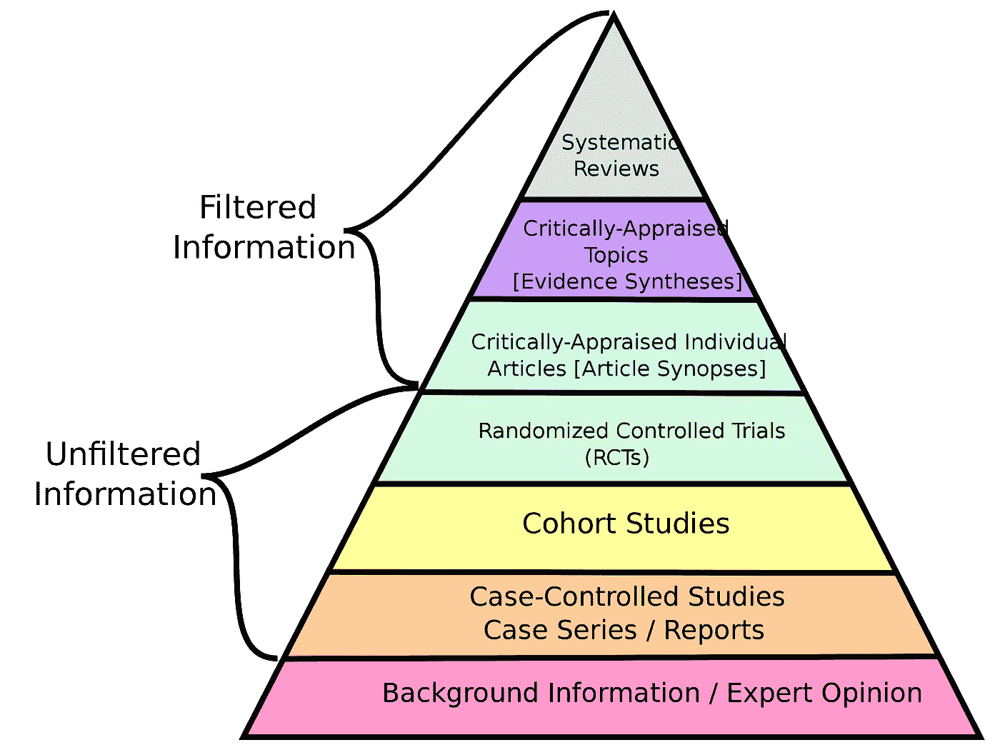
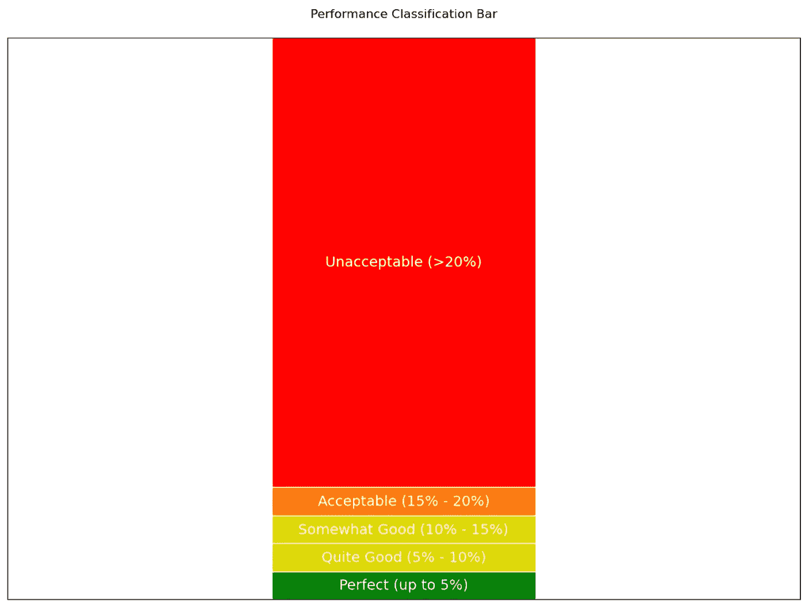

# 不必 A/B 测试一切都是好的

> 原文：[`towardsdatascience.com/not-a-b_testing-everything-is-fine-7f67378428be?source=collection_archive---------2-----------------------#2023-12-20`](https://towardsdatascience.com/not-a-b_testing-everything-is-fine-7f67378428be?source=collection_archive---------2-----------------------#2023-12-20)

## 实验领域的主流观点建议你测试一切。然而，一些关于 A/B 测试的不便真相表明，最好还是不要测试所有内容。

 [Yevhen Kralych](https://kralych.com/?source=post_page-----7f67378428be--------------------------------)

·

[关注](https://medium.com/m/signin?actionUrl=https%3A%2F%2Fmedium.com%2F_%2Fsubscribe%2Fuser%2F52b601e9b9b&operation=register&redirect=https%3A%2F%2Ftowardsdatascience.com%2Fnot-a-b-testing-everything-is-fine-7f67378428be&user=Yevhen+Kralych&userId=52b601e9b9b&source=post_page-52b601e9b9b----7f67378428be---------------------post_header-----------) 发表在 [Towards Data Science](https://towardsdatascience.com/?source=post_page-----7f67378428be--------------------------------) ·17 分钟阅读·2023 年 12 月 20 日

--

图片由 OpenAI 的 DALL-E 创建

在在线和产品营销领域工作的人可能听说过 A/B 测试和在线实验。近年来出现了无数的 A/B 测试平台，它们鼓励你注册并利用实验的力量来提升你的产品。许多行业领导者和小型影响者都详细讲述了 A/B 测试的成功实施及其如何改变了某些业务。我相信实验的力量吗？是的，我相信。但同时，在提高统计学水平并经历了大量的试错后，我发现，就像生活和商业中的任何事情一样，有些问题有时会被忽视，这些通常是实验中不方便的缺陷，削弱了它们作为神奇工具的地位。

为了更好地理解问题的根源，我需要从在线 A/B 测试的起源开始讲起。早期，在线 A/B 测试并不存在，但一些以创新著称的公司决定将实验转移到在线领域。当然，到那时 A/B 测试已经是科学中用来发现真相的成熟方法。这些公司包括 Google（2000 年）、Amazon（2002 年）、以及一些其他大公司如 Booking.com（2004 年），微软也很快加入。我们不难发现这些公司有一个共同点，那就是它们拥有对任何业务至关重要的两个要素：资金和资源。资源不仅仅包括基础设施，还有具备专业知识和经验的人。而且他们已经拥有了数百万的用户。顺便提一句，A/B 测试的正确实施需要上述所有条件。

直到今天，他们仍然是在线实验领域最受认可的行业声音之一，和后来出现的公司，如 Netflix、Spotify、Airbnb 等相比也不遑多让。他们的想法和方法被广泛认可和讨论，他们在在线实验中的创新也同样受到关注。他们所做的事情被认为是最佳实践，虽然不可能将所有这些内容都放入一篇小文章中，但有些内容被提及得更多，它们基本可以归纳为：

+   测试一切

+   在测试之前绝不要发布更改

+   即使是最小的变化也可能产生巨大影响

这些规则确实很有用，但并不适用于每个公司。事实上，对于许多产品和在线营销经理来说，盲目跟随这些规则可能会导致混乱甚至灾难。这是为什么呢？首先，盲目跟随任何东西都是一个坏主意，但有时我们必须依赖专家意见，因为我们在某些领域缺乏自己的专业知识和理解。我们通常忘记的是，并非所有专家意见都能很好地转化到我们自己的业务领域。这些成功的 A/B 测试基本原则的根本缺陷在于它们来源于多亿万公司，而你，读者，可能并不与其中任何一家相关联。

这篇文章将重点讨论统计功效这一已知概念及其扩展——实验的敏感性。这个概念是我在实验生活中每日决策的基础。

# 资源

> “知识的幻觉比缺乏知识更糟” (某位聪明人)

如果你对 A/B 测试一无所知，这个想法可能看起来很简单——只需拿两个版本的东西进行比较。显示更高转化率（每用户收入、点击、注册等）的那个版本被认为更好。

如果你稍微了解一些，[统计功效](https://cxl.com/blog/statistical-power/)以及运行 A/B 测试所需样本量的计算，那么你会对检测所需效应大小的功效有所了解。如果你理解早期停止和[窥探](https://www.evanmiller.org/how-not-to-run-an-ab-test.html)的警告——你就走在了正确的道路上。

当你进行一系列 A/A 测试时，对 A/B 测试简单性的误解会迅速被打破。在这些测试中，我们将两个完全相同的版本进行比较，并将结果展示给需要了解 A/B 测试的人。如果你有足够多的这些测试（例如 20–40 个），他们会发现有些测试显示处理组（也称为替代变体）比对照组（原始版本）有所改进，而有些测试则显示处理组实际上更差。当不断监控正在进行的实验时，我们可能会在大约 20%的时间看到显著结果。但如果我们比较的是两个相同的版本，这怎么可能呢？实际上，作者让公司的利益相关者进行了这个实验，并展示了这些误导性的结果，其中一位利益相关者回复说，这无疑是一个“错误”，如果一切设置得当，我们不会看到这样的情况。

这只是冰山一角，如果你已有一些经验，你会知道：

+   实验远非简单

+   测试不同的事物和不同的指标需要远超普通传统 A/B 测试的方法。一旦超出了简单的转化率测试，事情会变得成倍困难。你会开始关心方差及其减少，估计[新奇效应](https://medium.com/geekculture/the-novelty-effect-an-important-factor-to-be-aware-of-when-running-a-b-tests-c080856130d3)和首因效应，评估分布的正态性等等。实际上，即使你知道如何处理问题，你也无法正确测试某些事物（稍后会详细说明）。

+   你可能需要一位合格的数据科学家/统计学家。实际上，你肯定需要不止一位他们，以确定在你的具体情况下应该使用什么方法，以及需要考虑哪些注意事项。这包括确定要测试什么以及如何进行测试。

+   你还需要一个合适的数据基础设施来收集分析数据并执行 A/B 测试。你选择的 A/B 测试平台的 JavaScript 库，最简单的解决方案，并不是最佳选择，因为它与已知的[闪烁问题](https://www.kameleoon.com/en/blog/ab-testing-flicker)和增加的页面加载时间相关联。

+   如果不完全理解背景和在各个方面偷工减料，很容易得到误导性结果。

以下是一个简化的流程图，说明了设置和分析实验过程中涉及的决策过程。实际上，事情变得更加复杂，因为我们必须[处理不同的假设](https://www.scribbr.com/statistics/statistical-tests/)，如同质性、观察独立性、正态性等。如果你已经在这个领域待了一段时间，这些词汇你是熟悉的，你知道考虑所有因素可能有多么困难。如果你对实验还不熟悉，这些词汇对你来说可能毫无意义，但希望它们能暗示你，也许事情并不像看起来那么简单。

图片由[Scribbr](https://www.scribbr.com/statistics/statistical-tests/)提供，已获许可

中小型公司可能会在分配设置适当 A/B 测试环境所需资源时遇到困难，每次启动 A/B 测试可能是一个耗时的任务。但这只是问题的一部分。希望在本文结束时，你能理解为什么在所有这些情况下，当经理给我发消息说“我们需要测试这个”时，我经常会回复“我们可以吗？”。真的，为什么我们不能？

# 用户和敏感性

> 在像微软和 Airbnb 这样的公司，成功实验的多数提升幅度低于 3%

那些熟悉统计功效概念的人知道，每组中的随机化单位（为简化起见，我们称之为“用户”）越多，你能够检测变体之间差异的机会就越高（其他条件相同），这也是像 Google 这样的巨大公司和你们这些普通在线业务之间的另一个关键区别——你的业务可能没有足够多的用户和流量来检测高达 3%的小差异，即使是检测 5%的提升，拥有足够统计功效（行业标准为 0.80）也是一种挑战。

在 alpha 0.05、功效 0.80、基准均值 10 和标准差 40、方差相等的情况下，不同样本大小的可检测提升。（作者提供的图片）

在上述敏感性分析中，我们可以看到，检测大约 7%的提升相对容易，只需每个变体 50000 名用户，但如果我们想要检测 3%的提升，则需要大约 275000 名用户每个变体。

温馨提示：[G*Power](https://www.psychologie.hhu.de/arbeitsgruppen/allgemeine-psychologie-und-arbeitspsychologie/gpower)是一个非常方便的软件，用于进行功效分析和各种功效计算，包括测试两个独立均值之间的差异的敏感性。尽管它以[Cohen’s d](https://www.datanovia.com/en/lessons/t-test-effect-size-using-cohens-d-measure/)的形式显示效应大小，但转换为提升是直接的。

在 G*Power 中执行的测试敏感性计算的屏幕截图。（作者提供的图片）

有了这些知识，我们可以采取两条路线：

+   我们可以提出一个可接受的实验持续时间，计算 MDE，启动实验，如果未检测到差异，我们放弃更改，并假设如果存在差异，它不会高于 0.99 功效和给定显著性水平（0.05）的 MDE。

+   我们可以决定实验的持续时间，计算 MDE，如果 MDE 对于给定的持续时间太高，我们可以选择不启动实验或在不测试的情况下发布更改（第二种选项是我通常的做法）。

事实上，第一种方法在 LinkedIn 上由 Ronny Kohavi[提到过](https://www.linkedin.com/posts/ronnyk_using-the-statistical-power-formula-in-reverse-activity-7027144092459438080-2FTy/)：

第一种方法的缺点，尤其是对于资源有限的初创企业或小型企业，是你不断将资源投入到几乎没有机会提供可操作数据的领域。

> 进行不够敏感的实验可能导致参与实验的团队成员疲劳和士气低落

因此，如果你决定追求那个“圣杯”并测试所有推向生产的内容，你最终会得到的是：

+   设计师花费数天，有时数周，设计改进版本的着陆页或产品部分

+   开发人员通过你的 A/B 测试基础设施实施更改，这也需要时间

+   数据分析师和数据工程师设置额外的数据跟踪（实验所需的额外指标和分段）

+   QA 团队测试最终结果（如果你足够幸运，一切正常，无需重新修改）

+   测试被推送到生产环境中，在那里保持活动状态一到两个月

+   你和相关利益方未能检测到显著差异（除非你运行实验的时间过长，从而危及其有效性）。

在经历了一系列这样的测试之后，包括公司的顶级增长声音在内的每个人都会失去动力，并因花费如此多的时间和精力进行测试而感到沮丧，最终却得出“变体之间没有差异”的结论。但在这里，措辞扮演了至关重要的角色。请看这里：

+   变体之间没有显著差异

+   我们未能检测到变体之间的差异。如果差异为 30%或更高，我们很可能（0.99）会检测到，如果差异为 20%或更高，则概率稍低（0.80）。

第二种措辞稍微复杂一些，但信息量更多。0.99 和 0.80 是不同的统计功效水平。

+   这更符合已知的实验声明：“证据的缺乏并不是缺乏证据”。

+   这揭示了我们的实验最初有多敏感，并可能暴露公司经常遇到的问题——进行充分实验的流量有限。

加上 Ronny Kohavi 在其白皮书中提供的知识，他声称他工作过的公司中大多数实验的提升不到 3%，这让我们感到困惑。实际上，他在其出版物中建议将 MDE 保持在 5%。

> 我在微软、Airbnb 和亚马逊见过成千上万的实验，极少看到关键指标的提升超过 10%。[[source](https://docs.google.com/document/d/1IDcLEr58QoQU2VJPc-TefLMLegdQMnh3/edit)]
> 
> **我推荐的大多数电子商务网站的默认 MDE 是 5%。[**[**source**](https://docs.google.com/document/d/1IDcLEr58QoQU2VJPc-TefLMLegdQMnh3/edit)**]**
> 
> 在必应，每月的改进
> 
> 多次实验的收入通常在个位数范围内。[[source](https://drive.google.com/file/d/1oK2HpKKXeQLX6gQeQpfEaCGZtNr2kR76/view), section 4]

我仍然认为，对于那些产品优化不足且仅从 A/B 测试开始的小公司来说，可能会有更高的提升，但我觉得大多数情况下不会接近 30%。

# 问题

> 在制定 A/B 测试策略时，你需要从更大的角度来看待：可用资源、流量数量以及你手头的时间。

所以，我们最终得到的结果，以及我所说的“我们”指的是那些刚开始实验之旅的相当多的企业，就是大量资源用于设计、开发测试变体，资源用于设置测试本身（包括设置指标、细分等）——所有这些加起来实际上很难在合理的时间内检测到任何东西。我可能应该再强调一下，不应该过于相信平均测试的真实效果会有 30%的提升。

我经历过这个过程，我们在 SendPulse 尝试启动实验时有过许多失败的尝试，这些尝试总是显得徒劳，直到不久前，我意识到应该跳出 A/B 测试，看到更大的图景，而更大的图景就是这样。

+   你拥有有限的资源

+   你拥有有限的流量和用户

+   你不会总是拥有进行适当实验的条件，事实上，如果你是一个较小的企业，这些条件会更为稀少。

+   你应该在自己公司的背景下计划实验，仔细分配资源，并且要合理，避免将资源浪费在徒劳的任务上

+   不对下一个变更进行实验是可以的，虽然不是理想的做法——企业在在线实验成为一种手段之前早已取得成功。你的一些变更会产生负面影响，一些则会产生积极影响，但只要积极影响大于负面影响，这也是可以接受的。

+   如果你不小心，并且对实验作为唯一真实的方法过于热衷，你可能会把大部分资源投入到一个徒劳的任务中，使公司处于不利的位置。

以下是一个被称为“证据层级”的图示。虽然个人观点位于金字塔的底部，但它仍然有一定的参考价值，但更好的做法是接受这样的事实：有时这是唯一合理的选项，尽管它有缺陷。随机实验当然在金字塔的层级中更高。

科学中的证据层级。（图片由 [CFCF](https://commons.wikimedia.org/wiki/User:CFCF) 提供，通过 Wikimedia Commons，按 CC BY-SA 4.0 许可证授权）

# 解决方案

在更传统的设置中，启动 A/B 测试的流程大致如下：

+   有人提出了某项变更的想法

+   你估算实施变更所需的资源

+   涉及到的人使变革成为现实（设计师、开发人员、产品经理）

+   你设置最小可检测效应（MDE）和其他参数（alpha、beta、测试类型——双尾、单尾）

+   你计算所需的样本量，并根据参数确定测试需要运行多久

+   你启动测试

如上所述，这种方法是“实验优先”设计的核心——实验优先，无论代价如何，所需资源将被分配。完成实验所需的时间也不是问题。但如果你发现实施改变需要两周和三个人，而实验需要运行 8 到 12 个月才能敏感足够，你会怎么想？记住，利益相关者并不总是理解 A/B 测试的敏感性概念，因此为其持续一年进行合理化可能是一个挑战，而且世界变化迅速，这可能无法接受。更不用说技术问题会妨碍测试有效性，过期的 cookies 就是其中之一。

在资源、用户和时间有限的条件下，我们可以反转流程，将其改为“资源优先”设计，这可能在你的情况下是一个合理的解决方案。

假设：

+   基于伪用户 ID（基于 cookies，这些 cookies 有时会过期和被删除）的 A/B 测试在较短的运行时间内更稳定，所以我们将其设置为最长 45 天。

+   基于稳定标识符如 user-id 的 A/B 测试可以承受更长的运行时间（例如，基于转化指标为 3 个月，基于收入指标为 5 个月）。

我们接下来要做的是：

+   查看我们在 45 天内为每个变体能收集多少单位，假设每个变体 30,000 个访问者。

+   计算在可用样本量、alpha、功效和基础转化率下你的 A/B 测试的敏感性。

+   如果效果足够合理（1%到 10%的提升），你可以考虑分配所需资源来实施改变和设置测试。

+   如果效果高于 10%，特别是高于 20%，分配资源可能不是明智的决定，因为你改变后的实际提升可能会更低，而且你也无法可靠地检测到它。

我应该注意，最大实验长度和效果阈值由你决定，但我发现这些对我们来说效果很好。

+   网站上 A/B 测试的最长时间为 45 天。

+   基于产品中转化指标和持久标识符（如 user_id）的 A/B 测试最长时间为 60 天。

+   基于产品收入指标的 A/B 测试的最长时间为 120 天。

决策的敏感性阈值：

+   高达 5%——完美，启动是完全合理的，我们可以在这方面分配更多资源。

+   5%-10%——不错，我们可以启动它，但我们应该小心投入多少资源。

+   10%-15%——可接受，如果我们不需要花费太多资源——有限的开发时间、有限的设计时间、设置额外的指标和测试的细分不多，可以启动它。

+   15%-20%——勉强可接受，但如果你需要更少的资源，并且你对成功有强烈的信念，启动可能是合理的。然而，你可能需要告知团队测试的敏感性较差。

+   >20% — 不可接受。进行如此低敏感性的测试仅在少数情况下是合理的，考虑一下你可以改变实验设计的哪些方面以提高敏感性（例如，可能将更改实施在多个着陆页而不是一个上，等等）。

基于敏感性的实验分类（图像由作者提供）

注意，在我的业务环境中，我们允许基于收入的实验运行更长时间，因为：

+   收入增加是最高优先级

+   基于收入的指标具有更高的方差，因此相比于转化率指标，敏感性较低，其他条件相同

一段时间后，我们对哪些测试足够敏感有了了解：

+   跨整个网站或一组页面的更改（而不是单个页面）

+   “折叠线”上的更改（即着陆页的第一个屏幕上的更改）

+   服务中的入门流程更改（因为这是用户旅程的开始，此处用户数量达到最大值）

+   我们主要在新用户身上进行实验，忽略旧用户（以免处理可能的首因效应和新奇效应）。

## 更改的来源

我还应该介绍“更改的来源”这一术语，以进一步扩展我的思想和方法论。在 SendPulse，与其他公司一样，产品持续推向生产环境，包括涉及用户界面、可用性和其他外观的更改。这些更改在我们引入实验之前就已经发布了，因为，商业不能停滞不前。同时，还有一些我们特别希望测试的更改，例如有人提出了一个有趣但有风险的想法，我们不会在没有测试的情况下发布。

+   在第一种情况下，无论如何都要分配资源，并且坚信必须实施更改。这意味着我们花费在测试上的资源只是为了设置测试本身，而不是开发/设计更改，我们称之为“自然更改”。

+   在第二种情况下，所有用于测试的资源包括设计、开发更改和设置实验，我们称之为“实验性更改”。

为什么要进行这种分类？记住，我描述的哲学是从敏感性和资源的角度测试那些值得测试的内容，而不对公司现有流程造成太大干扰。我们不想让所有事情都依赖于实验，直到业务准备好为止。考虑到我们迄今所涵盖的一切，将实验逐步融入团队和公司的生活是有意义的。

上述分类允许我们在处理“自然更改”时使用以下方法：

+   如果我们考虑测试“自然变化”，我们只看设置测试需要多少资源，即使敏感度超过 20%，但所需资源最小，我们也会进行测试。

+   如果我们在指标上没有看到下降，我们坚持新的变体并将其推广到所有用户（记住，我们计划在决定测试之前就要发布它）。

+   因此，即使测试不够敏感以检测变化，我们也只是为自己设定了一个“护栏”——以防变化真的大幅度下降了指标。我们不会通过寻找确凿证据来阻止推广变化——这只是一个预防措施。

另一方面，在处理“实验性变化”时，协议可能有所不同：

+   我们需要基于“敏感度”来做决策，这在这里起着关键作用，因为我们要考虑分配多少资源来实施变化和测试本身，只有在我们有很好的机会检测到效果时，才应承诺进行工作。

+   如果我们在指标上看不到提升，我们倾向于放弃变化并保留原始版本，因此，资源可能会浪费在后续会被舍弃的东西上——这些资源应该得到仔细管理。

# 结果（希望是积极的）

这种策略如何帮助一个成长中的企业适应实验心态？我觉得读者此时应该已经明白，但回顾一下也没坏处。

+   你通过逐步引入 A/B 测试，给团队时间适应实验。

+   你不会将有限的资源用于那些没有足够敏感度的实验，而资源对于成长中的初创公司来说是一个问题——你可能需要将它们用于其他地方。

+   因此，你不会通过不断催促你的团队进行从未达到统计显著性的实验来迫使拒绝 A/B 测试，即使在启动它们时花费了大量时间——当你的大部分测试显示出显著的东西时，你会意识到这些努力并非徒劳。

+   通过测试“自然变化”，即团队认为应该推出的即使没有实验的东西，只有在它们显示出统计学上显著下降时才拒绝，这样你不会造成太大干扰，但如果测试确实显示出下降，你会播下怀疑的种子，表明我们的决策并非全都完美。

重要的是要记住——A/B 测试并非微不足道，它们需要巨大的努力和资源来做到正确。像世界上的任何事物一样，我们应该了解自己的极限和在特定时间的能力。仅仅因为我们想攀登珠穆朗玛峰，并不意味着我们应该在不了解自己极限的情况下去做——有很多创业公司的尸体在比喻的珠穆朗玛峰上，他们超出了自己的能力范围。

祝你实验顺利！
