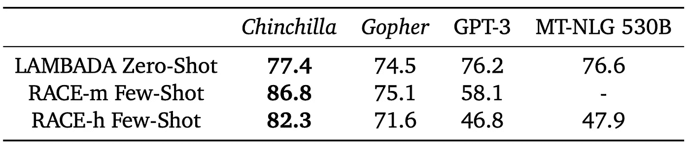
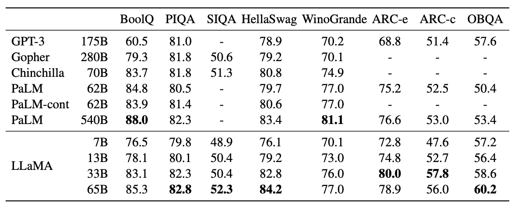

# **不那么庞大的语言模型：优质数据打败巨人**

> 原文：[`towardsdatascience.com/not-so-large-language-models-good-data-overthrows-the-goliath-a8226bd1ae61?source=collection_archive---------6-----------------------#2023-08-23`](https://towardsdatascience.com/not-so-large-language-models-good-data-overthrows-the-goliath-a8226bd1ae61?source=collection_archive---------6-----------------------#2023-08-23)

（图像由 DALL·E 生成）

## 如何制造一个百万级别的语言模型来超越十亿级别的模型

 [Gennaro S. Rodrigues](https://medium.com/@gennsev?source=post_page-----a8226bd1ae61--------------------------------)

·

[关注](https://medium.com/m/signin?actionUrl=https%3A%2F%2Fmedium.com%2F_%2Fsubscribe%2Fuser%2F603bda3d0d35&operation=register&redirect=https%3A%2F%2Ftowardsdatascience.com%2Fnot-so-large-language-models-good-data-overthrows-the-goliath-a8226bd1ae61&user=Gennaro+S.+Rodrigues&userId=603bda3d0d35&source=post_page-603bda3d0d35----a8226bd1ae61---------------------post_header-----------) 发表在 [Towards Data Science](https://towardsdatascience.com/?source=post_page-----a8226bd1ae61--------------------------------) · 6 min read · 2023 年 8 月 23 日 

--

在这篇文章中，我们将探讨语言模型（LM）如何通过关注更好的数据和训练策略，而不仅仅依赖庞大的规模，来实现类似 LLM 的结果（有时甚至更好），以及人们如何已经成功且民主地做到这一点。

大型语言模型（LLMs）已经显著发展。它们带来了从生成类似人类的文本到理解复杂上下文的显著特性。虽然最初的兴奋主要集中在具有大量参数的模型上，但最近的发展表明，大小并不是唯一重要的因素。最近，一个新的概念“小型语言模型”（SLM）应运而生，致力于更智能地开发语言模型。

# 大模型的兴起

随着 LLMs 的出现，叙事变得简单明了——更大更好。具有更多参数的模型被期望能够更好地理解上下文，减少错误，提供更好的答案。但随着模型的增长，它们对计算资源的需求也增加了。训练这些巨型模型变得非常昂贵，这不是每个人都愿意（也不一定能）支付的。

# 对质量和效率的强调

认识到仅仅增加参数的不可持续性和递减回报，研究人员开始重新思考策略。与其只是将钱投入云端（增加更多的参数），一些研究人员转而利用更好的数据和更高效的训练策略。这个想法很优雅：一个训练良好的小模型可能会超越一个训练不良的大模型。但这可能吗？

## Chinchilla 和 LLMs 训练的最佳点

“Chinchilla 论文” [1] 是对该领域的重要贡献，提供了对 LLMs 训练的有趣见解。实验似乎表明，在训练 LLMs 时存在一个“最佳点”。超过这个点，投入更多的资源（如更多参数）不一定会导致性能的成比例提高。论文强调，定义模型性能的不仅仅是模型的大小，而是数据的质量和使用的数据量。作者发现，为了实现计算最优训练，模型大小和训练令牌的数量应当等比缩放：每增加一倍的模型大小，训练令牌的数量也应增加一倍。

他们通过训练 Chinchilla（一个 70 亿参数的模型，训练于 1.4 万亿令牌）来测试这一点。尽管 Chinchilla 小得多，但在几乎所有评估中，包括语言建模、问答、常识任务等，Chinchilla 的表现都优于 Gopher。

Chinchilla 的大小和训练令牌与 SOTA LLMs 的比较。（来源：[1]）

即使在其减少的规模下，Chinchilla 在各种任务上的表现也优于其 SOTA 对手：

大规模多任务语言理解（MMLU）。报告了 57 项任务中的平均 5-shot 准确率，并与来自[2]的模型和人类准确率比较，以及来自[3]的 73 名竞争性人类预测者在 2022/2023 年 6 月的 SOTA 准确率的平均预测。（来源：[1]）

阅读理解和自动推理是语言模型通常会测试的标准任务。它测试模型理解文本更广泛背景的能力。在我们的案例中，可以通过预测那些仅在模型能够理解单词与之前上下文关系的情况下才会预期到的单词来进行示例。通常使用基准测试和数据集，如 RACE-h、RACE-m [4] 和 LAMBADA [5] 进行评估。即使在这种难以定义和测试的任务中，Chinchilla 也超越了更大的模型。

在阅读理解方面，Chinchilla 相比于 *Gopher* 显著提升了性能。（来源：[1]）

Chinchilla 是许多尽管没有注重扩展规模但仍展现出有希望结果的语言模型之一。

## LLaMA

LLaMA[6] 甚至更进一步。作者引入了从 7B 到 65B 参数的较小基础语言模型。它们在超过 1 万亿个标记的数据上进行训练，使用的仅是公开数据，使其兼容开源。

LLaMA-13B 在大多数基准测试中超过了参数多达 175B 的 GPT-3，而其体积小于 GPT-3 的 10 倍。作者认为，考虑到目标性能水平，训练时间更长的小型模型在给定计算预算下比大型模型更具优势，因为推理效率更高。

LLaMA 在常识推理任务中的零-shot 表现。（来源：[6]）

一些项目甚至成功在预算有限的安卓智能手机上运行 LLaMA（或其版本），进一步证明我们正走在通过低计算资源实现语言模型民主化的正确道路上（LLaMA.c [7]）。

LLaMA-65B（我知道，现在不算那么小，但仍然……）在与使用专有数据集的现有最先进模型如 PaLM-540B 的竞争中表现良好。这清楚地表明，优质数据不仅能提升模型的性能，还能使其变得民主化。机器学习工程师无需巨额预算就能在优质数据集上获得良好的模型训练。

## 优质数据胜过巨无霸

进一步巩固了语言模型不需要庞大才能表现良好的论点，TinyStories [8] 提供了一个合成数据集，其中包含仅供小孩子（最多四岁）理解的单词。它可以用来训练参数少于 1000 万的小型语言模型（SLMs），这些模型能够生成语法、推理和连贯性良好的多段故事。这与先前的研究形成对比，125M+ 参数的模型——如 GPT-Neo（小型）和 GPT-2（小型）——在生成连贯文本方面存在困难。

训练了 TinyStories 的模型能产生与参数大两个数量级的模型相当的输出。（来源：[8]）

TinyStories 的一个令人兴奋的方面是数据集本身是由 GPT-3.5 和 GPT-4 创建的。作者们还引入了一种新的 SLM 评估范式，使用 GPT-4 对生成的故事在语法、情节和创意等维度上进行“评分”。这克服了标准基准测试要求受限输出的局限性。

# 结论

语言模型的发展展示了 AI 中的一个关键教训：更大并不总是更好。随着社区的持续进化和创新，人们意识到效率、数据质量和优化的训练策略是机器学习未来的关键。

## 关键要点

+   Chinchilla 证明了在训练语言模型时，令牌数量和训练数据质量之间存在一个最佳点。这一点与（或更重要于）模型参数的数量定义同样重要；

+   LLaMa 显示了使用仅公开数据就能达到类似 Chinchilla 的结果，证明了这一策略具有普遍可用性；

+   像 TinyStories 这样的数据集可以用于训练小型语言模型（少于 1 亿），在特定任务上超越了十亿规模的模型。

## 参考文献

[1] Hoffmann, Jordan 等. “训练计算最优的大型语言模型。” *arXiv 预印本 arXiv:2203.15556*（2022 年）。

[2] D. Hendrycks 等. “测量大规模多任务语言理解。” *arXiv 预印本 arXiv:2009.03300*（2020 年）。

[3] J. Steinhardt. 来自 AI 预测的更新和经验教训，2021 年。URL https://bounded-regret.ghost.io/ai-forecasting/。

[4] Lai, Guokun 等. “RACE: 大规模阅读理解数据集来自考试。” *2017 年自然语言处理会议论文集*，页码 785–794，哥本哈根，丹麦。计算语言学协会。

[5] Paperno 等，2016 “LAMBADA 数据集：需要广泛语篇背景的单词预测。” *arXiv:1606.06031*（2016 年）。

[6] Touvron, Hugo 等. “LLaMA: 开放且高效的基础语言模型。” *ArXiv* abs/2302.13971（2023 年）

[7] [`github.com/karpathy/llama2.c`](https://github.com/karpathy/llama2.c)

[8] Eldan, Ronen 和 Yuan-Fang Li. “TinyStories：语言模型可以小到什么程度仍然能够说出连贯的英语？” *ArXiv* abs/2305.07759（2023 年）
