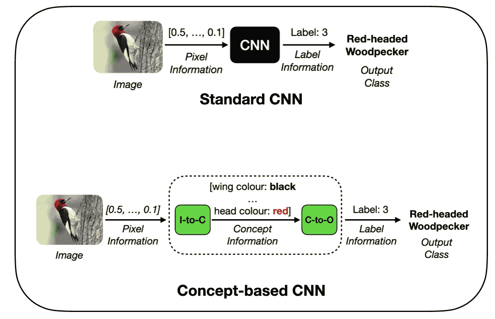
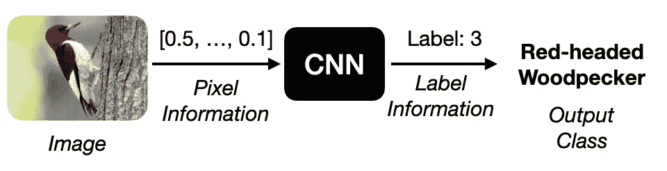
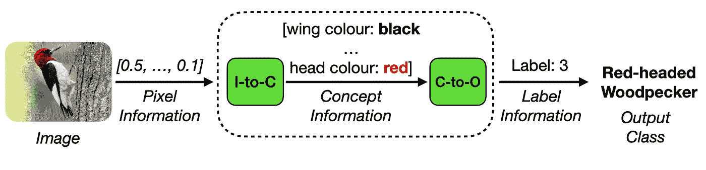
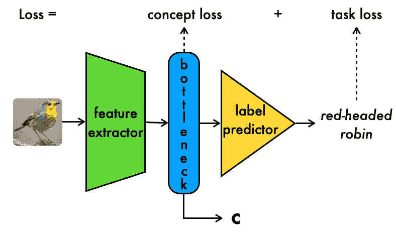
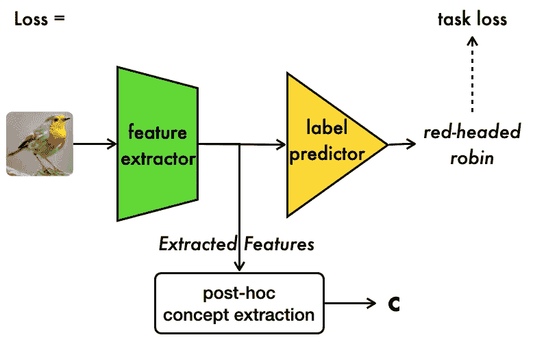
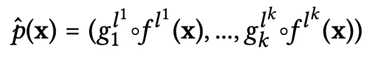
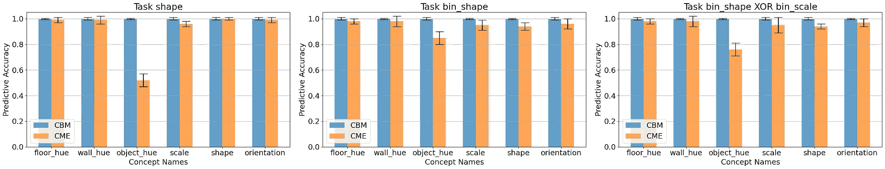
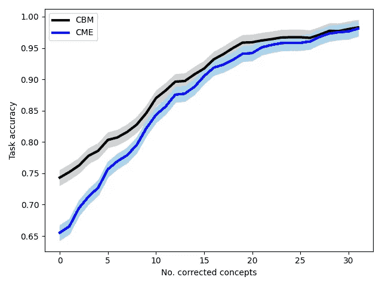
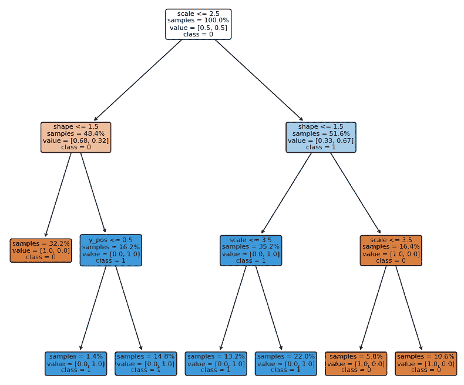
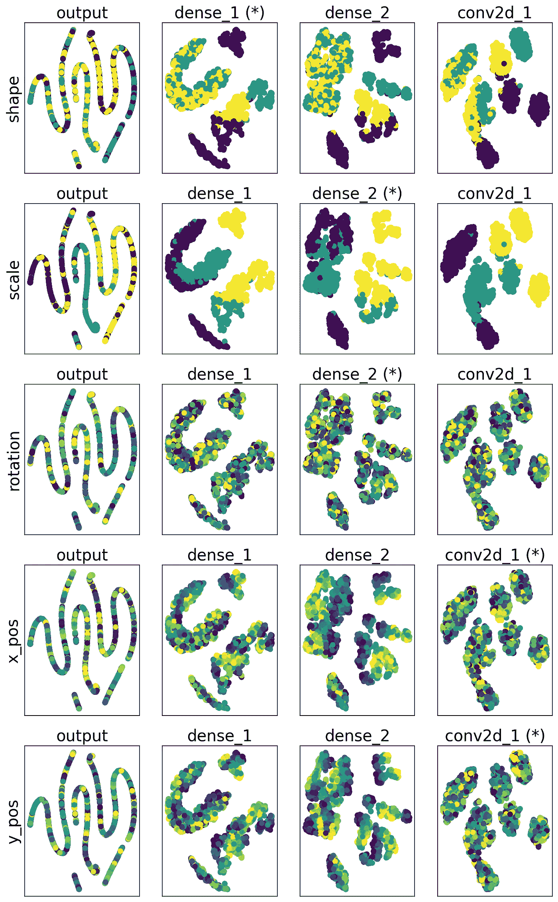

# 现在你看到我 (CME): 基于概念的模型提取

> 原文：[`towardsdatascience.com/now-you-see-me-cme-concept-based-model-extraction-97231105f8fa?source=collection_archive---------5-----------------------#2023-09-22`](https://towardsdatascience.com/now-you-see-me-cme-concept-based-model-extraction-97231105f8fa?source=collection_archive---------5-----------------------#2023-09-22)

## 一种标签高效的基于概念的模型方法

 [Dmitry Kazhdan](https://medium.com/@kazhdan.dmitry?source=post_page-----97231105f8fa--------------------------------)

·

[关注](https://medium.com/m/signin?actionUrl=https%3A%2F%2Fmedium.com%2F_%2Fsubscribe%2Fuser%2Fe322093479&operation=register&redirect=https%3A%2F%2Ftowardsdatascience.com%2Fnow-you-see-me-cme-concept-based-model-extraction-97231105f8fa&user=Dmitry+Kazhdan&userId=e322093479&source=post_page-e322093479----97231105f8fa---------------------post_header-----------) 发表在 [Towards Data Science](https://towardsdatascience.com/?source=post_page-----97231105f8fa--------------------------------) ·6 分钟阅读·2023 年 9 月 22 日

--

来自 CIKM 会议上展示的 AIMLAI 研讨会论文：“[Now You See Me (CME): 基于概念的模型提取](https://arxiv.org/abs/2010.13233)” ([GitHub](https://github.com/dmitrykazhdan/concept-based-xai))

视觉摘要。图片由作者提供。

## **总结** 

**问题 —** 深度神经网络模型是黑箱，无法直接解释。因此 — 很难建立对这些模型的信任。现有方法，如概念瓶颈模型，能够使这些模型更具可解释性，但需要高昂的标注成本来标注基础概念。

**关键创新 —** 一种以 *弱监督方式* 生成基于概念的模型的方法，从而显著减少注释需求

**解决方案 —** 我们的 [基于概念的模型提取（CME）框架](https://arxiv.org/abs/2010.13233)，能够以 *半监督* 方式从预训练的原始卷积神经网络（CNN）中提取基于概念的模型，同时保持最终任务性能。

原始 CNN 的端到端输入处理。作者提供的图像。

两阶段概念模型处理。作者提供的图像。

## **概念瓶颈模型（CBMs）**

近年来，解释性人工智能（XAI）[1] 领域对概念瓶颈模型（CBM）方法 [2] 的兴趣激增。这些方法引入了一种创新的模型架构，其中输入图像分为两个不同的阶段处理：*概念编码* 和 *概念处理*。

在概念编码过程中，概念信息从高维输入数据中提取。随后，在概念处理阶段，提取的概念信息用于生成所需的输出任务标签。CBMs 的一个显著特点是它们依赖于具有语义意义的 *概念表示*，作为下游任务预测的中间、可解释的表示，如下所示：

概念瓶颈模型处理。作者提供的图像。

如上所示，CBM 模型通过结合 *任务损失* 确保准确的任务标签预测，以及 *概念损失* 确保准确的中间概念预测进行训练。重要的是，CBMs 增强了模型的透明度，因为底层概念表示提供了一种解释和更好理解模型行为的方法。

> 概念瓶颈模型提供了一种新型的设计可解释的 CNN，允许用户通过概念将现有领域知识编码到模型中。

总体而言，CBMs 是一项重要的创新，使我们更接近于更透明和可信的模型。

## **挑战：CBMs 具有高概念注释成本**

不幸的是，CBMs 在训练期间需要大量的概念注释。

目前，CBM 方法要求对 *所有* 训练样本进行显式注释，*同时* 包括最终任务和概念注释。因此，对于一个包含 *N* 个样本和 *C* 个概念的数据集，注释成本从 *N* 个注释（每个样本一个任务标签），增加到 *N*(C+1)* 个注释（每个样本一个任务标签，且每个概念一个概念标签）。在实践中，这可能迅速变得难以管理，特别是对于具有大量概念和训练样本的数据集。

例如，对于一个包含 10,000 张图片和 50 个概念的数据集，注释成本将增加 50*10,000=500,000 个标签，即增加 *半百万* 个额外注释。

> 不幸的是，概念瓶颈模型需要大量的概念标注进行训练。

## **利用 CME 的半监督概念模型**

CME 依赖于 [3] 中强调的类似观察，其中观察到原始 CNN 模型通常在其 *隐藏空间* 中保留大量有关概念的信息，这可以用于无额外标注成本的概念信息挖掘。重要的是，这项工作考虑了基础概念 *未知* 的场景，并且必须以无监督的方式从模型的隐藏空间中提取。

使用 CME，我们利用上述观察，考虑一个场景，在该场景中，我们 *已经* 了解基础概念，但每个概念只有少量样本标注。类似于 [3]，CME 依赖于给定的预训练原始 CNN 和少量概念标注，以 *半监督的方式* 提取进一步的概念标注，如下所示：

CME 模型处理。图片来源于作者。

如上所示，CME 使用预训练模型的隐藏空间以 *事后* 方式提取概念表示。详细信息见下文。

***概念编码器训练***：与 CBMs 处理原始数据的概念编码器从零开始训练不同，我们以 *半监督的方式* 设置概念编码器模型训练，使用原始 CNN 的隐藏空间：

+   我们首先预先指定一组层 L，从原始 CNN 中用于概念提取。这可以是 *所有* 层，也可以只是最后几层，具体取决于可用的计算能力。

+   接下来，对于每个概念，我们在 L 中 *每个* 层的隐藏空间上训练一个独立的模型，以预测该概念的值。

+   我们继续选择具有最佳模型准确度的模型和相应层作为“最佳”模型和层来预测该概念。

+   因此，在为概念 *i* 做出预测时，我们首先检索该概念的最佳层的隐藏空间表示，然后将其通过相应的预测模型进行推断。

总体来说，*概念编码器* 功能可以总结如下（假设总共有 *k* 个概念）：

CME 概念编码器方程。图片来源于作者。

+   这里，LHS 上的 p-hat 代表概念编码器函数。

+   ***g***ᵢ 项代表在不同层隐藏空间上训练的隐藏空间到概念模型，*i* 代表概念索引，范围从 1 到 *k*。在实际应用中，这些模型可以非常简单，例如线性回归器或梯度提升分类器。

+   *f(***x***)* 项代表原始原始 CNN 的子模型，提取输入在特定层的隐藏表示。

+   在以上两种情况下，*lʲ* 上标指定了这两种模型操作的“最佳”层

***概念处理器训练***：CME 中的概念处理器模型训练是通过使用任务标签作为输出、*概念编码器* 预测作为输入来设置的。重要的是，这些模型操作在更紧凑的输入表示上，因此可以通过*可解释的*模型（如决策树（DTs）或逻辑回归（LR）模型）直接表示。

## **CME 实验与结果**

我们在合成数据集（[dSprites](https://github.com/google-deepmind/dsprites-dataset) 和 [shapes3d](https://github.com/google-deepmind/3d-shapes)）以及具有挑战性的真实数据集（[CUB](https://paperswithcode.com/dataset/cub-200-2011)）上的实验表明，CME 模型：

+   **实现高概念预测准确度**，在许多情况下可与 CBM 相媲美，*即使在与最终任务无关的概念上：*

CBM 和 CME 模型的概念准确度，绘制了三个不同预测任务中的所有概念。图像由作者提供。

+   **允许对概念进行人为干预** — 即允许人们通过修正少量选定概念来快速改善模型性能：

CME 和 CBM 模型性能在不同概念干预程度下的变化。图像由作者提供。

+   **从概念的角度解释模型决策，** 允许实践者直接绘制概念处理器模型：

一个概念处理器模型直接可视化的示例，针对一个选定任务。图像由作者提供。

+   **通过分析模型层间的隐藏空间，帮助理解模型对概念的处理：**

一个简单 CNN 的隐藏空间可视化示例。列代表不同的层，行代表不同的概念，每行的颜色对应于该概念的值。标有 * 的为“最佳” CME 层。图像由作者提供。

> 通过在弱监督领域定义基于概念的模型（CME），我们可以开发出显著更具标签效率的基于概念的模型

## **主要结论**

通过利用预训练的普通深度神经网络，我们可以在*极大*降低注释成本的情况下获得概念注释和基于概念的模型，与标准 CBM 方法相比。

此外，这不仅严格适用于与最终任务高度相关的概念，在某些情况下，也适用于与最终任务*独立*的概念。

## **参考文献**

[1] Chris Molnar. 解释性机器学习。 [`christophm.github.io/interpretable-ml-book/`](https://christophm.github.io/interpretable-ml-book/)

[2] Pang Wei Koh, Thao Nguyen, Yew Siang Tang, Stephen Mussmann, Emma Pierson, Been Kim, 和 Percy Liang. 概念瓶颈模型。*在国际机器学习会议*，第 5338–5348 页。PMLR*（2020）。

[3] Amirata Ghorbani, James Wexler, James Zou, 和 Been Kim. 朝向自动化基于概念的解释。*在* *神经信息处理系统的进展*，*32*。
