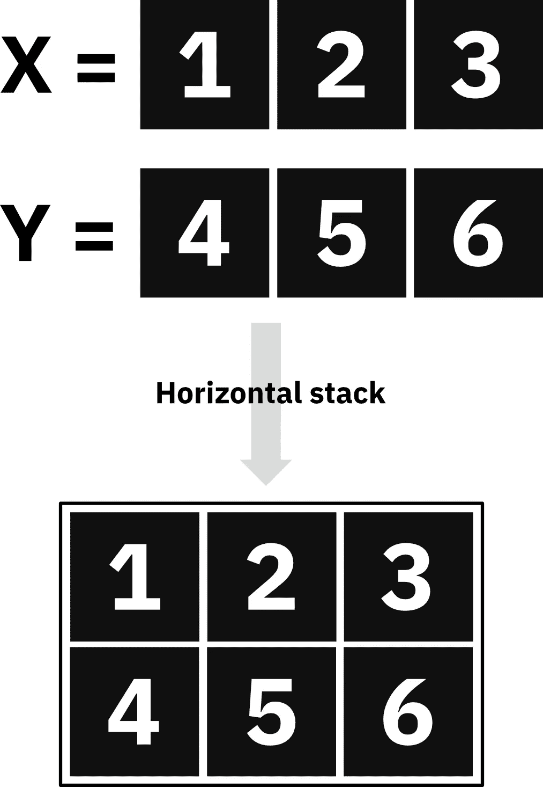
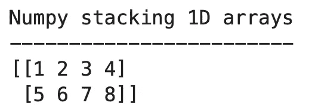

# np.stack() — 如何在 Numpy 和 Python 中堆叠两个数组

> 原文：[`towardsdatascience.com/np-stack-how-to-stack-two-arrays-in-numpy-and-python-fc910dd2d57a`](https://towardsdatascience.com/np-stack-how-to-stack-two-arrays-in-numpy-and-python-fc910dd2d57a)

## **Numpy 中堆叠的初学者和高级示例——学习如何轻松地连接数组序列**

[](https://medium.com/@radecicdario?source=post_page-----fc910dd2d57a--------------------------------)[](https://towardsdatascience.com/?source=post_page-----fc910dd2d57a--------------------------------) [Dario Radečić](https://medium.com/@radecicdario?source=post_page-----fc910dd2d57a--------------------------------)

·发表于[Towards Data Science](https://towardsdatascience.com/?source=post_page-----fc910dd2d57a--------------------------------) ·阅读时间 7 分钟·2023 年 1 月 10 日

--


图片由[Brigitte Tohm](https://unsplash.com/@brigittetohm?utm_source=medium&utm_medium=referral)提供，来源于[Unsplash](https://unsplash.com/?utm_source=medium&utm_medium=referral)

Numpy 是一个在数据科学和机器学习中非常出色的库，因此如果你想成为数据专业人士，就必须掌握它。掌握这个包的方方面面是必要的，因为重新发明轮子是没有意义的——几乎你能想到的任何东西都已经实现了。

今天你将了解所有关于 np stack 的信息——即 Numpy 的`stack()`函数。简单来说，它允许你按行（默认）或按列连接数组，具体取决于你指定的参数值。我们将讨论基础知识和函数签名，然后进入 Python 中的示例。

# 什么是 np stack？

Numpy 的 np stack 函数用于在新轴上堆叠/连接数组。它将返回一个单一数组，作为堆叠多个形状相同的序列的结果。你也可以堆叠多维数组，稍后你将很快学到这一点。

但首先，让我们解释一下水平堆叠和垂直堆叠的区别。

## Numpy 中的水平堆叠与垂直堆叠

水平堆叠数组意味着你将具有相同维度的数组堆叠在彼此之上。每个*输入*数组将在结果数组中成为一行。

查看下面的图像以更好地理解：



图 1 — 解释水平堆叠（图像由作者提供）

垂直堆叠则完全相反。两个垂直堆叠数组的一行包含来自两个数组的对应元素。

例如，垂直堆叠数组 Z 的第一行将包含输入数组 X 和 Y 的第一个元素。

也许你会发现视觉上更容易理解：


图 2 — 垂直堆叠解释（图片由作者提供）

说到这里，让我们看看 `np.stack` 函数的签名。

## 函数参数解释

`np.stack` 函数最多可以接受三个参数，其中只有第一个是必需的：

+   `arrays` - 数组的序列，或你想要堆叠的数组数组

+   `axis` - 整数，沿着你想要堆叠数组的轴（0 = 按行堆叠，1 = 对于一维数组按列堆叠，或使用 -1 使用最后一个轴）

+   `out` - 可选的结果存放位置。如果提供，输出数组的形状必须与堆叠结果的形状匹配

理论讲解够了！现在我们来看看一些实际的示例。

# Numpy 堆叠实战 — 函数示例

我们讨论了很多关于水平和垂直堆叠的内容，所以让我们看看它在实践中的表现。

## Numpy 水平堆叠（按行）

要水平堆叠两个 numpy 数组，只需调用 `np.stack` 函数并传入这些数组。无需其他参数：

```py
import numpy as np

arr1 = np.array([1, 2, 3, 4])
arr2 = np.array([5, 6, 7, 8])

# Horizontal (row-wise) stacking #1
arr_stacked = np.stack([arr1, arr2])
print('Numpy horizontal stacking method #1')
print('-----------------------------------')
print(arr_stacked)
```

这是得到的结果：


图 3 — Numpy 中的水平堆叠 (1)（图片由作者提供）

如你所见，输出看起来很像 Pandas DataFrame 的 Numpy 版本，这意味着一个数组几乎等于矩阵的一行。

更明确地说，你可以通过将 `axis=0` 作为第二个参数来实现相同的结果：

```py
import numpy as np

arr1 = np.array([1, 2, 3, 4])
arr2 = np.array([5, 6, 7, 8])

# Horizontal (row-wise) stacking #2
arr_stacked = np.stack([arr1, arr2], axis=0)
print('Numpy horizontal stacking method #2')
print('-----------------------------------')
print(arr_stacked)
```

结果是相同的：


图 4 — Numpy 中的水平堆叠 (2)（图片由作者提供）

接下来，让我们探索垂直堆叠。

## Numpy 垂直堆叠（按列）

要垂直堆叠两个 numpy 数组，只需将 `axis` 参数的值更改为 1：

```py
import numpy as np

arr1 = np.array([1, 2, 3, 4])
arr2 = np.array([5, 6, 7, 8])

# Vertical (column-wise) stacking #1
arr_stacked = np.stack([arr1, arr2], axis=1)
print('Numpy vertical stacking method #1')
print('---------------------------------')
print(arr_stacked)
```

现在，数组按列堆叠，这意味着你将有与提供的数组数量相等的列：


图 5 — Numpy 中的垂直堆叠 (1)（图片由作者提供）

使用简单的一维数组，你还可以设置 `axis=-1` 来垂直堆叠数组：

```py
import numpy as np

arr1 = np.array([1, 2, 3, 4])
arr2 = np.array([5, 6, 7, 8])

# Vertical (column-wise) stacking #2
arr_stacked = np.stack([arr1, arr2], axis=-1)
print('Numpy vertical stacking method #2')
print('---------------------------------')
print(arr_stacked)
```

结果是相同的：


图 6 — Numpy 中的垂直堆叠 (2)（图片由作者提供）

接下来，让我们讨论一些关于堆叠 N 维数组的内容。

## 使用 `stack()` 合并一维数组

你已经看到如何堆叠一维数组了，下面是回顾：

```py
import numpy as np

arr1 = np.array([1, 2, 3, 4])
arr2 = np.array([5, 6, 7, 8])

# Stacking 1D arrays
arr_stacked = np.stack([arr1, arr2])
print('Numpy stacking 1D arrays')
print('------------------------')
print(arr_stacked)
```

输出结果：



图 7 — 堆叠一维数组（图片由作者提供）

记住，如果你想按列堆叠数组，可以更改 `axis` 参数的值。

## 使用 `stack()` 合并二维数组

对于使用 `np.stack` 堆叠二维数组，过程是一样的。这是一个示例：

```py
import numpy as np

arr1 = np.array([
    [1, 2, 3, 4],
    [5, 6, 7, 8]
])
arr2 = np.array([
    [9, 10, 11, 12],
    [13, 14, 15, 16]
])

# Stacking 2D arrays #1
arr_stacked = np.stack([arr1, arr2])
print('Numpy stacking 2D arrays method #1')
print('----------------------------------')
print(arr_stacked)
```

我们现在得到一个三维数组，每个元素是两个水平堆叠数组的二维数组：


图 8 — 堆叠二维数组 (1)（图片由作者提供）

一如既往，你可以垂直堆叠二维数组：

```py
import numpy as np

arr1 = np.array([
    [1, 2, 3, 4],
    [5, 6, 7, 8]
])
arr2 = np.array([
    [9, 10, 11, 12],
    [13, 14, 15, 16]
])

# Stacking 2D arrays #2
arr_stacked = np.stack([arr1, arr2], axis=1)
print('Numpy stacking 2D arrays method #2')
print('----------------------------------')
print(arr_stacked)
```

以下是输出结果：


图像 9 — 堆叠 2D 数组（2）（作者提供的图像）

这就是 numpy 堆叠的基本知识了。接下来，我们将介绍一些高级用法示例和常见问题。

# 高级：循环中的 np stack

常见的问题之一是如何在循环中使用 np stack。这里有一个示例 —— 它将两个二维数组首先合并为一个三维数组：

```py
import numpy as np

arr1 = np.array([[1, 2, 3], [4, 5, 6], [7, 8, 9], [10, 11, 12]])
arr2 = np.array([[13, 14, 15], [16, 17, 18]])
matrix = [arr1, arr2]

print('Numpy stacking in a loop - intermediary matrix')
print('----------------------------------------------')
print(matrix)
```

这是中间输出：


图像 10 — 循环中的 Numpy 堆叠（1）（作者提供的图像）

现在，要生成一个水平堆叠元素的二维数组，你可以使用循环：

```py
arr3 = np.empty(shape=[0, matrix[0].shape[1]])

for m in matrix:
    arr3 = np.append(arr3, m, axis=0)

print('Numpy stacking in a loop')
print('------------------------')
print(arr3)
```

结果如下：


图像 11 — 循环中的 Numpy 堆叠（2）（作者提供的图像）

现在我们将讨论一些关于 Python 中 np stack 函数的常见问题。

# 常见问题

## stack 和 concatenate 有什么区别？

简而言之，当传入两个一维数组时，np stack 函数将返回一个二维数组。而 np concatenate 函数则将所有输入数组的元素合并为一个一维数组。

## 什么是 numpy dstack？

numpy dstack 函数允许你按索引合并数组，并将结果存储为堆栈。这是一个示例：

```py
import numpy as np

arr1 = np.array([1, 2, 3, 4])
arr2 = np.array([5, 6, 7, 8])

# Numpy depth stacking - dstack
arr_stacked = np.dstack([arr1, arr2])
print('Numpy depth stacking')
print('--------------------')
print(arr_stacked)
print()
print(f'Shape = {arr_stacked.shape}')
```

输出结果：


图像 12 — Numpy dstack（作者提供的图像）

因此，我们有两个 1x4 的数组进来，`dstack` 将它们垂直地合并成一个三维数组格式。这对于某些用例来说非常方便。

*喜欢这篇文章吗？成为* *Medium 会员* *以继续无限学习。如果你使用以下链接，我将获得你的会员费的一部分，但对你没有额外费用。*

[`medium.com/@radecicdario/membership`](https://medium.com/@radecicdario/membership)

*最初发表于* [*https://betterdatascience.com*](https://betterdatascience.com/np-stack/) *，日期为 2023 年 1 月 10 日。*
