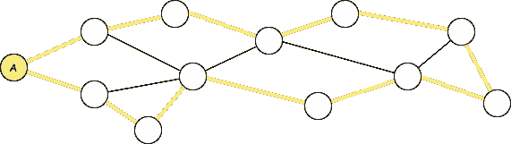

# NP-什么？优化问题的复杂性类型解释

> 原文：[`towardsdatascience.com/np-what-complexity-types-of-optimization-problems-explained-558d43276044`](https://towardsdatascience.com/np-what-complexity-types-of-optimization-problems-explained-558d43276044)


复杂的建筑。图片由作者使用 [Midjourney](https://www.midjourney.com/) 创建。

## 计算机科学中的一个核心问题介绍

[](https://hennie-de-harder.medium.com/?source=post_page-----558d43276044--------------------------------)[](https://towardsdatascience.com/?source=post_page-----558d43276044--------------------------------) [Hennie de Harder](https://hennie-de-harder.medium.com/?source=post_page-----558d43276044--------------------------------)

·发布于 [Towards Data Science](https://towardsdatascience.com/?source=post_page-----558d43276044--------------------------------) ·阅读时间 11 分钟·2023 年 8 月 17 日

--

**为什么** **最短路径问题** **容易解决，而** [**旅行推销员问题**](https://medium.com/towards-data-science/local-search-with-simulated-annealing-from-scratch-9f8dcb6c2e06) **却不容易？这些问题的数学原理是什么？如何确定如果问题规模增加，是否会需要不可管理的步骤？在这篇文章中你将了解这个主题的基础知识。如果你想深入了解，我在文章末尾还附上了与这个主题相关的千年大奖难题的简要说明。**

在我们开始讨论 NP 难度之前，你应该了解时间复杂度的基础。如果你熟悉时间复杂度、大 O 符号和最坏情况分析，你可以跳过以下部分。

# 时间复杂度

当我们使用计算机编程时，我们经常会遇到可以用不同方式解决的问题。我们需要考虑的一个重要方面是这些解决方案的效率。时间复杂度帮助我们理解当问题规模变大时，算法运行的速度如何。

*大 O 符号* 可以比作用一个简单的标签来标记算法，这个标签告诉我们算法完成所需的时间，基于我们处理的事物数量。这是一种描述算法步骤数量相对于问题输入规模增长的方式。

> 注意：时间复杂度本质上与步骤数量有关，而不是实际时间，因此这个名字不太准确。否则你可以使用更快的计算机和相同的算法。


给箱子（算法）贴上标签：你有多快？作者提供的图片。

我们通常关注*最坏情况*，因为我们希望确保无论我们给算法什么输入，它都不会花费超过一定的时间。这有助于确保我们的解决方案在情况变得困难时仍然可靠。


如果你正在寻找一本书中的特定页面，而你的算法从书的开头查到结尾，最坏的情况就是那一页是最后一页。作者提供的图片。

就像我们驾驶时选择最快路线一样，我们也希望为我们的问题选择最有效的算法。我们根据算法的时间复杂度来比较算法。一个运行更快（时间复杂度更低）的算法就像是选择更快的路线到达目的地。如前所述，一个更快的算法在最坏情况下需要的步骤更少。

现在，让我们通过一些实际的例子来探讨这些概念，使其更清晰。

## 常数时间：O(1)

想象一下你在计划去附近的公园旅行。你就住在公园旁边，所以无论你邀请多少朋友，步行到公园所需的时间始终不变。无论是你一个人还是一群 10 人，前往公园所需的时间都是恒定的——它不会因人数的不同而改变。


去公园的时间大致相同，不论人数多少。作者提供的图片。

常数时间的编程例子是使用一个键在字典中找到对应的值。

## 线性时间：O(n)

现在，想象一下计划一次野餐并召集所有朋友。当你邀请每个朋友时，你需要单独打电话或发消息。所以，如果你邀请 10 个朋友，你就打 10 个电话；如果你邀请 50 个朋友，你就打 50 个电话。联系朋友所需的时间随着朋友数量的增加而线性增长。


邀请一个朋友或 10 个朋友是有区别的：邀请 10 个朋友需要的时间大约是邀请 1 个朋友的 10 倍。作者提供的图片。

如果你遍历列表中的所有项目一次，这需要线性时间。

## 对数时间：O(log n)

在公园里，你将玩一个需要寻找隐藏宝藏的游戏。游戏会给你线索，帮助你缩小搜索区域。每个线索帮助你排除掉公园的一半。随着你找到更多的线索，搜索区域变得更小。另一种看法是：如果公园的面积是 100 平方米，那么找到宝藏最多需要 7 步（2⁷ = 128）。即使公园面积增加了 1 平方米，也没有关系，它仍然需要 7 步（101 < 128）。直到我们达到 128 之前，最坏情况下我们永远不需要额外的步骤（这里的最坏情况是什么？）。


每一步将搜索空间减少 50%。额外的一平方米不会有太大区别。图片由作者提供。

这类似于二分搜索的工作原理，其中每个线索都将可能的位置数量减少一半，导致对数时间复杂度。

## 二次时间：O(n²)

你正在尝试规划一个公路旅行，访问城市中的各种旅游景点。为了找出每对位置之间的最短路线，你需要将每个位置与其他每个位置进行比较。因此，如果你有 5 个位置，你需要进行 5 * 4 = 20 次比较；如果你有 10 个位置，你需要进行 10 * 9 = 90 次比较。随着位置数量的增加，比较次数会二次增长。

```py
mylist = [1, 2, 3, 4, 5]

for n in mylist:
    for m in mylist:
        print(n*m) 
```

嵌套的 for 循环是一个例子，它需要二次时间。你要对所有元素进行两次循环，因此需要 n * n 次迭代。上面的代码示例将打印 5 * 5 = 25 个数字。

## 阶乘时间：O(n!)

最后但同样重要的是：阶乘时间。想象一下，你正在和朋友们组织一次盛大的旅行冒险。你想规划一个访问所有愿望列表上的国家的最佳路线。然而，找到最佳路线涉及考虑所有可能的国家排列。随着你在列表中添加更多国家，可能路线的数量会按阶乘增长。例如，如果你有 3 个国家，有 3! = 6 种可能的路线（ABC，ACB，BAC，BCA，CAB，CBA）。如果你有 4 个国家，则有 4! = 24 条路线，依此类推。

在这种情况下，随着你在列表中增加国家的数量，考虑所有可能路线所需的时间会因阶乘增长而急剧增加。这反映了阶乘时间复杂度，其中所需的时间随着输入规模的增加而极快增长。正如规划行程随着你添加更多国家而变得繁重一样，阶乘时间复杂度由于其快速增长在处理大问题时变得不可行。

我们可以在图表中可视化时间复杂度。绿色的是快速的，而橙色和红色的是在 n 增加时难以处理的。如果可能的话，你应该尽量避免这些。


与输入大小相关的不同 Big O 时间复杂度的操作数量。图片由作者提供。

让我们深入了解这与 NP-难度的关系。

# NP-难度

常数、线性和二次时间是*多项式时间*的例子。多项式时间的形式是 O(nˣ)。如果我们将多项式时间与指数和阶乘时间进行比较，你会发现对于大值 n 有很大的差异：


看看粉色数字，它们展示了随着数据大小的增加，指数和阶乘时间复杂度函数如何增加。点击放大。图片由作者提供。

如表所示，多项式时间与指数时间和阶乘时间之间存在巨大差异。对于大值 n，多项式时间是相对快速的，对于 n < 100 不超过 1 秒，而指数时间和阶乘时间则无法管理。（尽管如果 n 的值非常大，多项式时间仍可能需要相当长的时间。）

NP-难度的概念有助于根据计算复杂度对问题进行分类。问题分为四个类别，其中最简单的区分是 P 问题和 NP 问题之间的区别。

## P 问题

P 问题，其中 P 代表多项式，是可以在多项式时间内解决的。换句话说，它们的解决方案可以相对快速地找到，解决它们所需的时间最多是问题规模的多项式函数。

> 一个数学优化问题的例子，它属于 P 问题，是最短路径问题。如何在最小化距离的情况下从点 A 到点 B？[迪杰斯特拉算法](https://medium.com/towards-data-science/optimizing-connections-mathematical-optimization-within-graphs-7364e082a984) 是一个可以在多项式时间内解决这个问题的算法（或者通过优先队列更少的时间）。


从 A 到 B 的最短路径是什么？图像由作者提供。

## NP 问题

另一方面，NP 问题（或非确定性多项式问题）涵盖了更广泛的挑战。这些问题的特点是提出的解决方案可以在多项式时间内*有效验证*。然而，找到解决方案本身可能需要指数级或甚至阶乘时间，使得它们比 P 问题更难解决。换句话说：如果你处理的是一个大型 NP 问题，尝试暴力破解是愚蠢的。

> NP 问题是[汉密尔顿路径问题](https://en.wikipedia.org/wiki/Hamiltonian_path_problem)：给定一个图，是否存在一条路径访问每个顶点一次并返回到起始顶点？如果有人声称他们找到了一个汉密尔顿路径，你可以通过检查它是否确实访问了每个顶点一次来验证。



验证黄色路径是否为汉密尔顿路径很简单。图像由作者提供。

在 NP 问题的范围内，我们遇到两个子类别：NP 完全问题和 NP 难问题。

## NP 完全问题

在 NP 问题中，NP 完全问题是最具挑战性的。NP 完全问题是指属于 NP 且具有一个特殊属性的问题：如果你能找到一个多项式时间算法来解决它，你就能在多项式时间内解决所有 NP 问题。实质上，NP 完全问题是 NP 中“最难”的，因为它们至少与 NP 中的其他任何问题一样困难。

> 最著名的 NP-完全问题之一是旅行商问题（TSP），你需要找到一条最短的路线，同时访问所有给定的位置一次。可能的路线数量可以用 n!计算，其中 n 是要访问的位置数量。在之前的文章中，我使用了[混合整数规划](https://medium.com/towards-data-science/how-to-handle-optimization-problems-daf97b3c248c)（第二个示例）和[模拟退火](https://medium.com/towards-data-science/local-search-with-simulated-annealing-from-scratch-9f8dcb6c2e06)（第一个示例）对 TSP 进行了编码。与之密切相关的是中国邮差问题，你需要至少访问图中的每条边一次。


TSP：访问每个节点。中国邮差问题：至少访问每条边一次。这两个都是 NP-完全问题。图片由作者提供。

## NP-困难问题

NP-困难问题虽然相关，但与 NP-完全问题不同。NP-困难问题是指至少与 NP 中最难的问题一样困难的问题，不管它是否在 NP 中。换句话说，NP-困难问题不一定具有像 NP 中那样的高效验证过程。相反，它们作为极其困难的计算问题的基准。

> [停机问题](https://en.wikipedia.org/wiki/Halting_problem)询问的是，给定一个程序和输入，该程序是否会在该输入上停止（停止执行）或无限运行。它是不可判定的，这意味着没有算法可以在所有情况下解决它。停机问题是 NP-困难的，但不在 NP 中，因为它的解决方案无法高效验证。在下一个代码片段中，你会看到停机问题的两个简单示例，对于其他程序，确定其是否为停机问题可能是有问题的。

```py
# Example 1\. Program with the following code will keep running
while True:
  continue

# Example 2\. Program with only a print statement will halt after printing
print('Halt')
```

总结来说，计算复杂度的范围包括从易于解决到极具挑战性的问题。虽然 P 问题可以高效解决，但 NP 问题引入了一层复杂性，其中 NP-完全问题代表了 NP 类中计算难度的巅峰。此外，NP-困难问题提供了对计算可行性边界的见解，即使它们不直接属于 NP 类。


如果我们假设 P ≠ NP（更多内容在最后一部分），这就是 P、NP、NP-完全和 NP-困难问题集合的欧拉图。图片由作者提供。

不幸的是，NP 问题在现实生活中无处不在。例如，优化配送卡车的路线、高效安排任务、设计电子电路，甚至蛋白质折叠都是 NP 问题的实例。这些问题的难处理性使得寻找最佳解决方案成为一项巨大的挑战：它们在大输入下 notoriously 难以解决。这种困难通常导致了近似算法、启发式方法和专门技术的发展，以寻找可能不是最优但在某些范围内可接受的解决方案。


如何书写历史？继续阅读以了解更多！照片由 [Natalia Y.](https://unsplash.com/@foxfox?utm_source=medium&utm_medium=referral) 提供，来源于 [Unsplash](https://unsplash.com/?utm_source=medium&utm_medium=referral)

## 千年奖问题：P 对 NP

NP 硬度与其中一个未解的千年奖问题有关。这个问题很容易理解。如果你能证明 P = NP 或者 P ≠ NP，你就解决了它！这意味着什么？正如你现在所知道的，P 问题在大 n 下需要的步骤远少于 NP 完全问题。但从未证明 P 问题与 NP 问题确实不同，这意味着尚不确定是否存在多项式时间算法来解决 NP 问题。如何解决这个问题？有两种可能的结果：

1.  如果你能找到一个解决 NP 完全问题（例如旅行商问题）的多项式时间算法，你就证明了 P = NP。

1.  如果你能证明不存在多项式时间算法来解决特定的 NP 问题，你就证明了 P ≠ NP。你可能需要提出一个新的 NP 完全问题来实现这一点。

证明第一个观点将震撼世界，因为互联网安全是建立在 NP 硬度的基础上的。如果能够找到破解代码的多项式时间算法，那将是灾难性的。许多科学家认为第二种结果是正确的，即不存在能够解决 NP 完全问题的多项式时间算法。但这从未被证明。如果你想书写历史，这就是你的机会！

# 结论

深入探讨计算复杂性的细节揭示了计算机科学中问题解决的挑战。时间复杂性让我们能够在问题规模增长时评估算法效率。通过这种视角，我们探讨了常数、线性、对数、平方和阶乘复杂度等场景。

转向 NP-困难性，我们探索了各种复杂度的问题。P 与 NP 问题尤为突出——P 问题可以在多项式时间内解决，而 NP 问题则提供快速验证，但通常需要指数级或阶乘时间才能找到解决方案。NP 完全问题和 NP-困难问题成为计算挑战的巅峰。NP 完全问题涵盖了 NP 中的“最难”问题，提供了高效解决所有 NP 问题的捷径。NP-困难问题不局限于 NP，代表了计算复杂性的顶峰。

最后，P 与 NP 问题的谜团——一个难以捉摸的千年难题——有潜力重塑我们对计算复杂性的理解。这个问题的深远影响使得证明 P = NP 或 P ≠ NP 的探索者有可能改变历史的进程。

## 相关

[](/why-every-data-scientist-should-learn-mathematical-optimization-3ac102663456?source=post_page-----558d43276044--------------------------------) ## 为什么每位数据科学家都应该学习数学优化

### 数据科学课程目前关注数据可视化、特征工程、数据处理、（有/无）监督学习……

towardsdatascience.com [](/four-ways-to-combine-mathematical-optimization-and-machine-learning-8cb874276254?source=post_page-----558d43276044--------------------------------) ## 五种将数学优化与机器学习结合的方法

### 结合两种力量的实际例子。

towardsdatascience.com [](/exact-algorithm-or-heuristic-20d59d7fb359?source=post_page-----558d43276044--------------------------------) ## 精确算法还是启发式算法?

### 逐步指南，帮助你为数学优化问题做出正确选择

towardsdatascience.com
