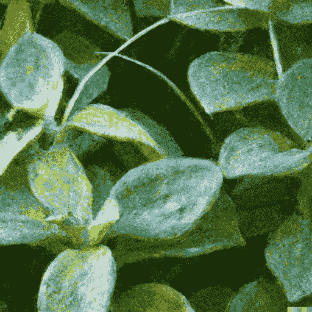
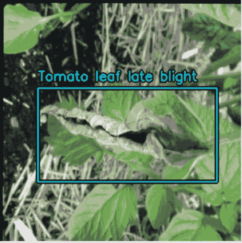
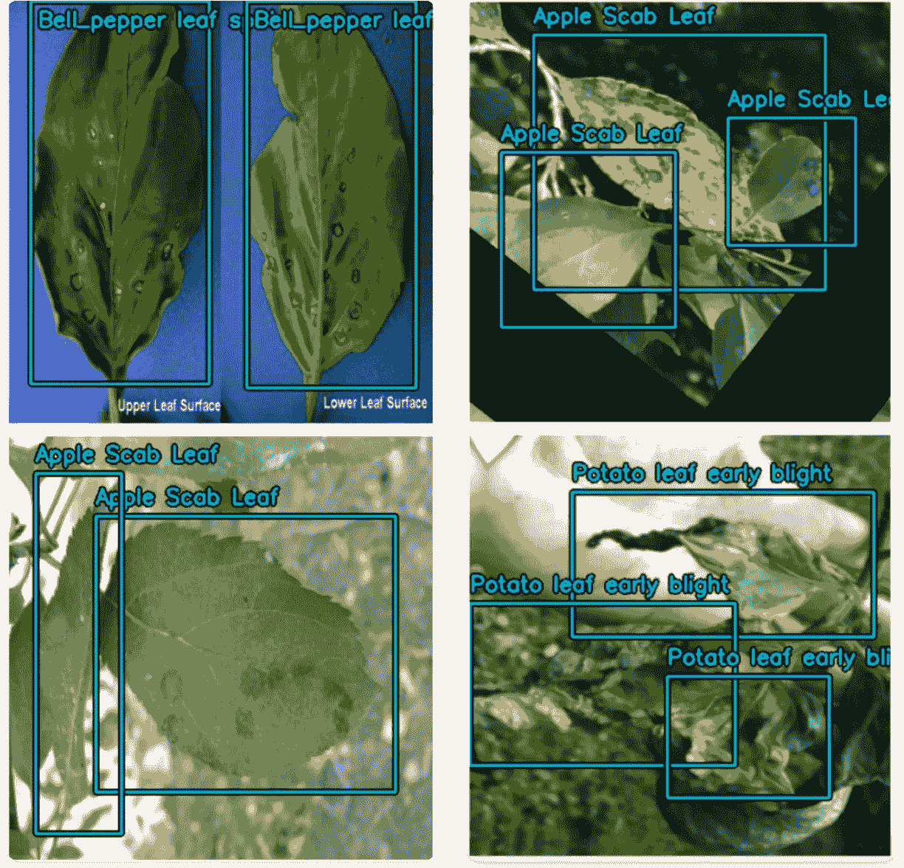
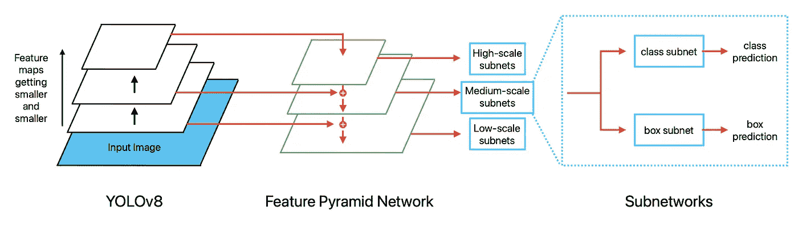
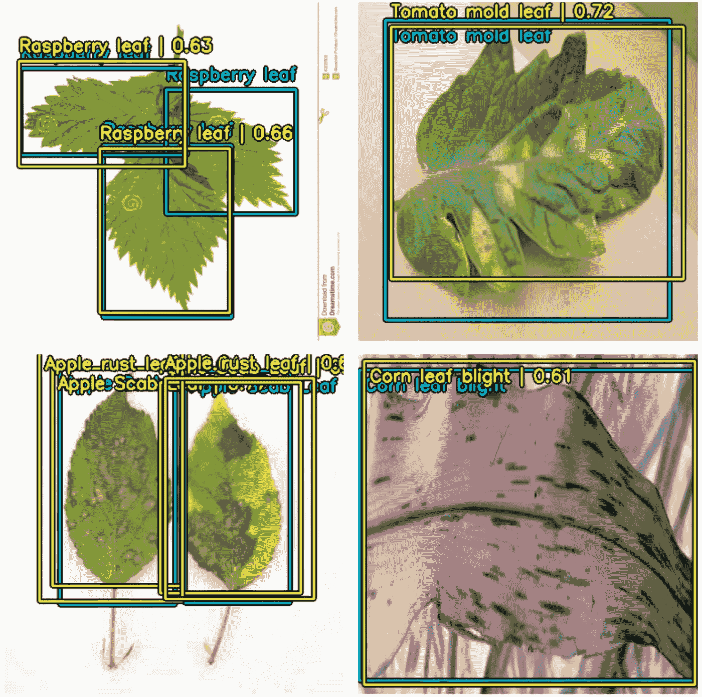
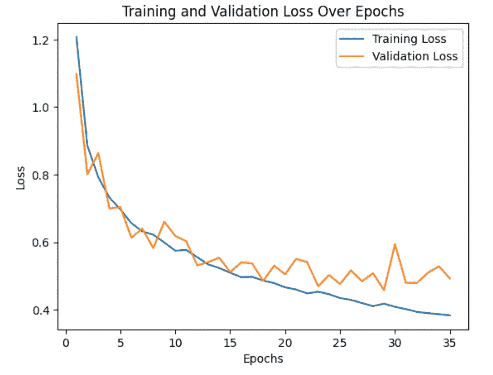
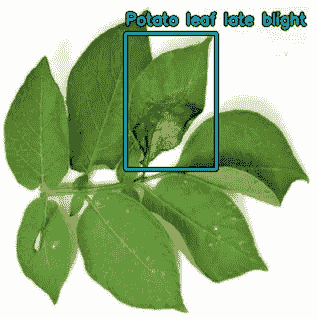
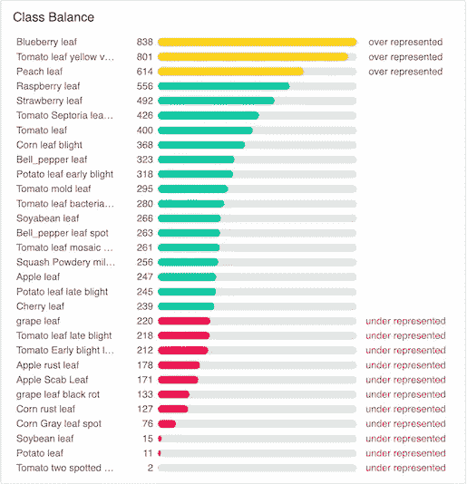

# 使用 RetinaNet 和 KerasCV 的目标检测

> 原文：[`towardsdatascience.com/object-detection-using-retinanet-and-kerascv-b07940327b6c?source=collection_archive---------3-----------------------#2023-12-06`](https://towardsdatascience.com/object-detection-using-retinanet-and-kerascv-b07940327b6c?source=collection_archive---------3-----------------------#2023-12-06)

## 使用 KerasCV 库的力量和简便性进行目标检测。

[](https://medium.com/@ed.izaguirre?source=post_page-----b07940327b6c--------------------------------)[](https://towardsdatascience.com/?source=post_page-----b07940327b6c--------------------------------) [Ed Izaguirre](https://medium.com/@ed.izaguirre?source=post_page-----b07940327b6c--------------------------------)

·

[关注](https://medium.com/m/signin?actionUrl=https%3A%2F%2Fmedium.com%2F_%2Fsubscribe%2Fuser%2F33a47cfa4187&operation=register&redirect=https%3A%2F%2Ftowardsdatascience.com%2Fobject-detection-using-retinanet-and-kerascv-b07940327b6c&user=Ed+Izaguirre&userId=33a47cfa4187&source=post_page-33a47cfa4187----b07940327b6c---------------------post_header-----------) 发表在 [Towards Data Science](https://towardsdatascience.com/?source=post_page-----b07940327b6c--------------------------------) · 21 分钟阅读 · 2023 年 12 月 6 日[](https://medium.com/m/signin?actionUrl=https%3A%2F%2Fmedium.com%2F_%2Fvote%2Ftowards-data-science%2Fb07940327b6c&operation=register&redirect=https%3A%2F%2Ftowardsdatascience.com%2Fobject-detection-using-retinanet-and-kerascv-b07940327b6c&user=Ed+Izaguirre&userId=33a47cfa4187&source=-----b07940327b6c---------------------clap_footer-----------)

--

[](https://medium.com/m/signin?actionUrl=https%3A%2F%2Fmedium.com%2F_%2Fbookmark%2Fp%2Fb07940327b6c&operation=register&redirect=https%3A%2F%2Ftowardsdatascience.com%2Fobject-detection-using-retinanet-and-kerascv-b07940327b6c&source=-----b07940327b6c---------------------bookmark_footer-----------)

一张植物叶子的图像。创建于 [DALL·E 2](https://openai.com/dall-e-2)。

**目录**

1.  等等，什么是 KerasCV？

1.  检查数据

1.  图像预处理

1.  RetinaNet 模型背景

1.  训练 RetinaNet

1.  做出预测

1.  结论

1.  参考文献

**相关链接**

+   [Kaggle 实验笔记](https://www.kaggle.com/code/edizaguirre/plant-object-detection): 随意复制笔记本，试验代码，并使用免费的 GPU。

+   [PlantDoc 数据集](https://public.roboflow.com/object-detection/plantdoc?ref=blog.roboflow.com)：这是本笔记本中使用的数据集，托管在 Roboflow 上。该数据集在 CC BY 4.0 DEED 许可证下发布，这意味着你可以在任何媒介或格式中复制和重新分发该材料，甚至用于商业目的。

# 等等，什么是 KerasCV？

在完成基于图像分割的小项目后（[参见这里](https://medium.com/towards-data-science/image-segmentation-an-in-depth-guide-5e56512eea2e)），我准备转入计算机视觉领域下另一个常见任务：**物体检测**。物体检测指的是对图像进行处理，产生围绕感兴趣对象的框，并分类这些框中的对象。作为一个简单的例子，看看下面的图片：



物体检测的示例。请注意边界框和类标签。图片由作者提供。

蓝色的框被称为**边界框**，**类名**放置在其正上方。因此，物体检测可以分解为两个小问题：

1.  一个*回归*问题，模型必须预测盒子左上角和右下角的*x*和*y*坐标。

1.  一个*分类*问题，模型必须预测盒子正在观察的物体类别。

在这个例子中，边界框是由人类创建和标记的。我们希望自动化这个过程，而一个训练良好的物体检测模型正可以做到这一点。

我坐下来回顾我关于物体检测的学习资料，很快就感到失望。不幸的是，大多数介绍性的资料几乎没有提到物体检测。François Chollet 在*Python 深度学习* [1] 中提到：

> 请注意，我们不会涵盖物体检测，因为它对于介绍性书籍来说过于专业和复杂。

Aurélion Géron [2] 提供了许多关于物体检测背后思想的文本内容，但只提供了几行代码来处理带有虚拟边界框的物体检测任务，远未达到我所期望的端到端流水线。Andrew Ng [3] 的著名*深度学习专项课程*在物体检测方面涵盖最深入，但甚至他在编码实验室中也只是加载了一个预训练的物体检测模型进行推理。

想要更深入地研究，我开始勾勒出一个物体检测流水线的大纲。仅仅为了为 RetinaNet 模型进行预处理，你需要执行以下步骤（*注：其他物体检测模型如 YOLO 需要不同的步骤*）：

+   将输入图片都调整为相同的大小，并进行填充以防止长宽比混乱。哦，不要忘记边界框；这些也需要适当地重新调整形状，否则你会破坏你的数据。

+   根据训练集中的真实边界框生成不同尺度和纵横比的锚框。这些锚框在训练过程中作为模型的参考点。

+   根据与真实框的重叠情况为锚框分配标签。重叠度高的锚框标记为正例，而重叠度低的锚框标记为负例。

+   描述相同的边界框有多种方法。你需要实现函数来在这些不同格式之间进行转换。稍后会详细介绍。

+   实现数据增强时，不仅要增强图像，还要增强框。理论上你可以省略这一步，但在实践中这是必要的，以帮助我们的模型更好地泛化。

[看看这个例子](https://keras.io/examples/vision/retinanet/) 在 Keras 网站上。**哎呀**。我们模型预测的后处理将需要更多工作。借用 Keras 团队的话：这是一个技术上复杂的问题。

当我开始绝望时，我开始急切地浏览互联网，偶然发现了一个我从未听说过的库：[KerasCV](https://keras.io/keras_cv/)。当我阅读文档时，我开始意识到这是**TensorFlow/Keras 计算机视觉的未来**。根据他们的介绍：

> KerasCV 可以被理解为 Keras API 的横向扩展：这些组件是新的第一方 Keras 对象，过于专业化而无法添加到核心 Keras 中。它们与核心 Keras API 享有相同级别的打磨和向后兼容保证，并由 Keras 团队维护。

*“但为什么我的学习材料中没有提到这个？”* 我想。答案很简单：这是一个相当新的库。GitHub 上的第一次提交是在 2022 年 4 月 13 日，太新了，甚至还未出现在我教科书的最新版本中。事实上，该库的 1.0 版本尚未发布（截至 2023 年 11 月 10 日，它是 0.6.4）。我预计 KerasCV 会在我教科书的下一版和在线课程中详细讨论（公平地说，Gèron 确实提到过“新的 Keras NLP 项目”和 Keras CV 项目，读者可能会感兴趣）。

KerasCV 刚刚推出，除了 Keras 团队自己发布的教程外，还没有很多教程（[见这里](https://keras.io/guides/keras_cv/)）。在本教程中，我将演示一个端到端的目标检测流程，使用受官方 Keras 指南启发但又不同于这些指南的技术来识别健康和病变叶片。**有了 KerasCV，即使是初学者也可以利用标记数据集来构建有效的目标检测管道。**

在我们开始之前需要注意几点。KerasCV 是一个快速变化的库，其代码库和文档会定期更新。这里展示的实现将适用于 KerasCV 版本 0.6.4。Keras 团队已声明：*“在 KerasCV 达到 v1.0.0 之前，没有向后兼容的承诺。”* 这意味着无法保证本教程中使用的方法在 KerasCV 更新时仍然有效。我已在链接的 Kaggle notebook 中硬编码了 KerasCV 版本号，以防止这些问题。

KerasCV 有很多已知的错误，可以在 [GitHub 的问题标签页](https://github.com/keras-team/keras-cv/issues) 中查看。此外，文档在一些领域也有所欠缺（我看着你，*MultiClassNonMaxSuppression*）。在使用 KerasCV 时，尽量不要被这些问题气馁。事实上，这是一个成为 KerasCV 代码库贡献者的绝佳机会！

本教程将重点介绍 KerasCV 的实现细节。我将简要回顾一些目标检测的高级概念，但假设读者对如 RetinaNet 架构等概念有一定背景知识。这里展示的代码已进行编辑和调整以提高清晰度，完整代码请参见上面链接的 Kaggle notebook。

最后，关于安全的提示。这里创建的模型并非最先进的技术；请将其视为一个高层次的教程。在将此植物疾病检测模型投入生产之前，需要进一步的微调和数据清理。最好将模型做出的任何预测交由人工专家确认诊断。

# 检查数据

PlantDoc 数据集包含 2,569 张图像，涵盖 13 种植物和 30 个类别。数据集的目标在 Singh 等人撰写的论文 *PlantDoc: A Dataset for Visual Plant Disease Detection* 的摘要中进行了阐述 [4]。

> 印度由于植物疾病每年损失 35% 的作物产量。由于缺乏实验室基础设施和专业知识，植物疾病的早期检测仍然很困难。本文探讨了计算机视觉方法在可扩展和早期植物疾病检测中的可能性。

这是一个崇高的目标，也是计算机视觉可以为农民做出很多贡献的领域。

Roboflow 允许我们以多种不同格式下载数据集。由于我们使用 TensorFlow，建议将数据集下载为 **TFRecord** 格式。TFRecord 是 TensorFlow 中一种特定格式，旨在高效地存储大量数据。数据由一系列记录表示，每个记录是一个键值对。每个键称为 *feature*。下载的压缩文件包含四个文件，其中两个用于训练，两个用于验证：

+   `leaves_label_map.pbtxt` : 这是一个 Protocol Buffers 文本格式文件，用于描述数据的结构。打开文件时，我看到有三十个类别。既有健康叶子如 `Apple leaf`，也有不健康叶子如 `Apple Scab Leaf`。

+   `leaves.tfrecord` : 这是包含我们所有数据的 TFRecord 文件。

我们的第一步是检查 `leaves.tfrecord`。我们的记录包含哪些特征？不幸的是，Roboflow 并未指定这一点。

```py
train_tfrecord_file = '/kaggle/input/plants-dataset/leaves.tfrecord'
val_tfrecord_file = '/kaggle/input/plants-dataset/test_leaves.tfrecord'

# Create a TFRecordDataset
train_dataset = tf.data.TFRecordDataset([train_tfrecord_file])
val_dataset = tf.data.TFRecordDataset([val_tfrecord_file])

# Iterate over a few entries and print their content. Uncomment this to look at the raw data
for record in train_dataset.take(1):
  example = tf.train.Example()
  example.ParseFromString(record.numpy())
  print(example)
```

我看到以下打印的特征：

+   `image/encoded` : 这是图像的编码二进制表示。在这个数据集中，图像是以 jpeg 格式编码的。

+   `image/height` : 这是每个图像的高度。

+   `image/width` : 这是每个图像的宽度。

+   `image/object/bbox/xmin` : 这是边界框左上角的 x 坐标。

+   `image/object/bbox/xmax` : 这是边界框右下角的 x 坐标。

+   `image/object/bbox/ymin` : 这是边界框左上角的 y 坐标。

+   `image/object/bbox/ymax` : 这是边界框右下角的 y 坐标。

+   `image/object/class/label` : 这些是与每个边界框关联的标签。

现在我们想把所有图像及其关联的边界框整合到一个 TensorFlow **Dataset 对象**中。Dataset 对象允许你存储大量数据而不会使系统内存超载。这是通过**延迟加载**和**批处理**等功能实现的。延迟加载意味着数据不会被加载到内存中，直到它被显式请求（例如在执行转换或训练时）。批处理意味着一次只加载选择数量的图像（通常为 8、16、32 等）。简而言之，我建议你始终将数据转换为 Dataset 对象，特别是在处理大量数据时（在目标检测中很常见）。

要将 TFRecord 转换为 TensorFlow 中的 Dataset 对象，你可以使用 `tf.data.TFRecordDataset` 类从 TFRecord 文件创建数据集，然后使用 `map` 方法应用解析函数来提取和预处理特征。解析代码如下所示。

```py
def parse_tfrecord_fn(example):
    feature_description = {
        'image/encoded': tf.io.FixedLenFeature([], tf.string),
        'image/height': tf.io.FixedLenFeature([], tf.int64),
        'image/width': tf.io.FixedLenFeature([], tf.int64),
        'image/object/bbox/xmin': tf.io.VarLenFeature(tf.float32),
        'image/object/bbox/xmax': tf.io.VarLenFeature(tf.float32),
        'image/object/bbox/ymin': tf.io.VarLenFeature(tf.float32),
        'image/object/bbox/ymax': tf.io.VarLenFeature(tf.float32),
        'image/object/class/label': tf.io.VarLenFeature(tf.int64),
    }

    parsed_example = tf.io.parse_single_example(example, feature_description)

    # Decode the JPEG image and normalize the pixel values to the [0, 255] range.
    img = tf.image.decode_jpeg(parsed_example['image/encoded'], channels=3) # Returned as uint8

    # Get the bounding box coordinates and class labels.
    xmin = tf.sparse.to_dense(parsed_example['image/object/bbox/xmin'])
    xmax = tf.sparse.to_dense(parsed_example['image/object/bbox/xmax'])
    ymin = tf.sparse.to_dense(parsed_example['image/object/bbox/ymin'])
    ymax = tf.sparse.to_dense(parsed_example['image/object/bbox/ymax'])
    labels = tf.sparse.to_dense(parsed_example['image/object/class/label'])

    # Stack the bounding box coordinates to create a [num_boxes, 4] tensor.
    rel_boxes = tf.stack([xmin, ymin, xmax, ymax], axis=-1)
    boxes = keras_cv.bounding_box.convert_format(rel_boxes, source='rel_xyxy', target='xyxy', images=img)

    # Create the final dictionary.
    image_dataset = {
        'images': img,
        'bounding_boxes': {
            'classes': labels,
            'boxes': boxes
        }
    }
    return image_dataset
```

让我们详细拆解一下：

+   `feature_description` : 这是一个描述每个特征预期格式的字典。当特征在数据集中所有示例中的长度是固定时，我们使用 `tf.io.FixedLenFeature`，当长度存在某些变动时，我们使用 `tf.io.VarLenFeature`。由于边界框的数量在数据集中并不固定（有些图像有更多框，有些则较少），因此我们对所有与边界框相关的内容使用 `tf.io.VarLenFeature`。

+   我们使用 `tf.image.decode_jpeg` 解码图像文件，因为我们的图像是以 JPEG 格式编码的。

+   请注意用于边界框坐标和标签的 `tf.sparse.to_dense` 的使用。当我们使用 `tf.io.VarLenFeature` 时，信息会以稀疏矩阵的形式返回。稀疏矩阵是大多数元素为零的矩阵，结果是一个只有效存储非零值及其索引的数据结构。不幸的是，TensorFlow 中的许多预处理函数要求使用稠密矩阵。这包括 `tf.stack`，我们用来水平堆叠来自多个边界框的信息。为了解决这个问题，我们使用 `tf.sparse.to_dense` 将稀疏矩阵转换为稠密矩阵。

+   在堆叠框之后，我们使用 KerasCV 的 `keras_cv.bounding_box.convert_format` 函数。检查数据时，我注意到边界框坐标被归一化在 0 和 1 之间。这意味着这些数字表示图像总宽度/高度的百分比。例如，值为 0.5 表示 50% * image_width。这是一种 **相对格式**，Keras 称之为 `REL_XYXY`，而不是 **绝对格式** `XYXY`。理论上，转换为绝对格式不是必要的，但当我使用相对坐标训练模型时遇到了错误。有关其他支持的边界框格式，请参见 [KerasCV 文档](https://keras.io/api/keras_cv/bounding_box/formats/#rel_xyxy-class)。

+   最后，我们将图像和边界框转换为 KerasCV 所需的格式：**字典**。Python 字典是一种包含键值对的数据类型。具体来说，KerasCV 期望以下格式：

```py
image_dataset = {
  "images": [width, height, channels],
  bounding_boxes = {
    "classes": [num_boxes],
    "boxes": [num_boxes, 4]
  }
}
```

这实际上是一个“字典中的字典”，因为 `bounding_boxes` 也是一个字典。

最后使用 `.map` 函数将解析函数应用于我们的 TFRecord。然后可以检查 Dataset 对象。一切正常。

```py
train_dataset = train_dataset.map(parse_tfrecord_fn)
val_dataset = val_dataset.map(parse_tfrecord_fn)

# Inspecting the data
for data in train_dataset.take(1):
    print(data)
```

**恭喜，最困难的部分现在已经完成了。** 在我看来，创建 KerasCV 所需的“字典中的字典”是最具挑战性的任务。其余部分更为直接。

# 图像预处理

我们的数据已经分为训练集和验证集。所以我们将开始对数据集进行批处理。

```py
# Batching
BATCH_SIZE = 32
# Adding autotune for pre-fetching
AUTOTUNE = tf.data.experimental.AUTOTUNE

train_dataset = train_dataset.ragged_batch(BATCH_SIZE).prefetch(buffer_size=AUTOTUNE)
val_dataset = val_dataset.ragged_batch(BATCH_SIZE).prefetch(buffer_size=AUTOTUNE)

NUM_ROWS = 4
NUM_COLS = 8
IMG_SIZE = 416
BBOX_FORMAT = "xyxy"
```

一些说明：

+   我们使用 `ragged_batch` 是因为我们不知道每个图像将有多少个边界框。如果所有图像都有相同数量的边界框，那么我们可以直接使用 `batch`。

+   我们设置了 `BBOX_FORMAT=“xyxy”` 。回忆一下，之前在加载数据时，我们将边界框格式从相对的 XYXY 格式转换为绝对的 XYXY 格式。

现在我们可以实现 **数据增强**。数据增强是计算机视觉问题中的一种常见技术。它对训练图像进行轻微的修改，例如轻微旋转、水平翻转图像等。这有助于解决数据不足的问题，并且有助于正则化。在这里，我们将引入以下增强方法：

+   KerasCV 的`JitteredResize`函数。这个函数旨在用于目标检测管道，实现了一种图像增强技术，涉及随机缩放、调整大小、裁剪和填充图像及相应的边界框。这一过程引入了尺度和局部特征的变异，提高了训练数据的多样性，从而改善了模型的泛化能力。

+   然后我们添加了水平和垂直的`RandomFlips`以及`RandomRotation`。这里的`factor`是一个表示 2*π*分数的浮点数。我们使用 0.25，这意味着我们的增强器会将图像旋转-25%到 25%*π*之间的某个角度。以度数表示，这意味着旋转范围在-45°到 45°之间。

+   最后，我们添加了`RandomSaturation`和`RandomHue`。饱和度为 0.0 会留下灰度图像，而 1.0 则完全饱和。0.5 的因子不会造成任何变化，因此选择 0.4–0.6 的范围会产生细微的变化。色调因子为 0.0 不会产生变化。设置`factor=0.2`表示范围为 0.0–0.2，这是另一种细微变化。

```py
augmenter = keras.Sequential(
    [
        keras_cv.layers.JitteredResize(
            target_size=(IMG_SIZE, IMG_SIZE), scale_factor=(0.8, 1.25), bounding_box_format=BBOX_FORMAT
        ),
        keras_cv.layers.RandomFlip(mode="horizontal_and_vertical", bounding_box_format=BBOX_FORMAT),
        keras_cv.layers.RandomRotation(factor=0.25, bounding_box_format=BBOX_FORMAT),
        keras_cv.layers.RandomSaturation(factor=(0.4, 0.6)),
        keras_cv.layers.RandomHue(factor=0.2, value_range=[0,255])
    ]
)

train_dataset = train_dataset.map(augmenter, num_parallel_calls=tf.data.AUTOTUNE)
```

我们通常只对*训练*集进行增强，因为我们希望模型避免“记忆”模式，而是确保模型学习到在现实世界中会遇到的通用模式。这增加了模型在训练过程中看到的多样性。

我们还希望将*验证*图像调整为相同的大小（带有填充）。这些图像将在不失真的情况下调整大小。边界框也必须相应地重新调整。KerasCV 可以轻松处理这一困难任务：

```py
# Resize and pad images
inference_resizing = keras_cv.layers.Resizing(
    IMG_SIZE, IMG_SIZE, pad_to_aspect_ratio=True, bounding_box_format=BBOX_FORMAT
)

val_dataset = val_dataset.map(inference_resizing, num_parallel_calls=tf.data.AUTOTUNE)
```

最后，我们可以可视化我们的图像和包含预处理的边界框：

```py
class_mapping = {
    1: 'Apple Scab Leaf',
    2: 'Apple leaf',
    3: 'Apple rust leaf',
    4: 'Bell_pepper leaf',
    5: 'Bell_pepper leaf spot',
    6: 'Blueberry leaf',
    7: 'Cherry leaf',
    8: 'Corn Gray leaf spot',
    9: 'Corn leaf blight',
    10: 'Corn rust leaf',
    11: 'Peach leaf',
    12: 'Potato leaf',
    13: 'Potato leaf early blight',
    14: 'Potato leaf late blight',
    15: 'Raspberry leaf',
    16: 'Soyabean leaf',
    17: 'Soybean leaf',
    18: 'Squash Powdery mildew leaf',
    19: 'Strawberry leaf',
    20: 'Tomato Early blight leaf',
    21: 'Tomato Septoria leaf spot',
    22: 'Tomato leaf',
    23: 'Tomato leaf bacterial spot',
    24: 'Tomato leaf late blight',
    25: 'Tomato leaf mosaic virus',
    26: 'Tomato leaf yellow virus',
    27: 'Tomato mold leaf',
    28: 'Tomato two spotted spider mites leaf',
    29: 'grape leaf',
    30: 'grape leaf black rot'
}

def visualize_dataset(inputs, value_range, rows, cols, bounding_box_format):
    inputs = next(iter(inputs.take(1)))
    images, bounding_boxes = inputs["images"], inputs["bounding_boxes"]
    visualization.plot_bounding_box_gallery(
        images,
        value_range=value_range,
        rows=rows,
        cols=cols,
        y_true=bounding_boxes,
        scale=5,
        font_scale=0.7,
        bounding_box_format=bounding_box_format,
        class_mapping=class_mapping,
    )

# Visualize training set
visualize_dataset(
    train_dataset, bounding_box_format=BBOX_FORMAT, value_range=(0, 255), rows=NUM_ROWS, cols=NUM_COLS
)

# Visualize validation set
visualize_dataset(
    val_dataset, bounding_box_format=BBOX_FORMAT, value_range=(0, 255), rows=NUM_ROWS, cols=NUM_COLS
)
```

这种类型的可视化函数在 KerasCV 中很常见。它绘制了一组图像和框，行和列由参数指定。我们看到我们的训练图像有些被轻微旋转，有些被水平或垂直翻转，可能还进行了放大或缩小，并且色调/饱和度的细微变化也可以看到。**在 KerasCV 中，所有增强层也会在必要时增强边界框。** 请注意，`class_mapping`是一个简单的字典。我从之前提到的`leaves_label_map.pbtxt`文本文件中获得了键和标签。



左侧是原始图像（验证集）的示例，右侧是增强图像（训练集）。图片由作者提供。

在查看 RetinaNet 模型之前最后要说的一件事是，之前我们需要创建“字典中的字典”以将数据转换为与 KerasCV 预处理兼容的格式，但现在我们需要将其转换为数字元组以供模型训练。这相当直接：

```py
def dict_to_tuple(inputs):
    return inputs["images"], bounding_box.to_dense(
        inputs["bounding_boxes"], max_boxes=32
    )

train_dataset = train_dataset.map(dict_to_tuple, num_parallel_calls=tf.data.AUTOTUNE)
validation_dataset = val_dataset.map(dict_to_tuple, num_parallel_calls=tf.data.AUTOTUNE)
```

# RetinaNet 模型背景

一个用于进行目标检测的流行模型叫做**RetinaNet**。该模型的详细描述超出了本文的范围。简而言之，RetinaNet 是一个单阶段检测器，意味着它在预测边界框和类别之前只查看一次图像。这类似于著名的 YOLO（You Only Look Once）模型，但有一些重要的不同之处。我在这里要强调的是使用的创新分类损失函数：**focal loss**。它解决了图像中的*类别不平衡*问题。

为了理解这点的重要性，可以考虑以下类比：假设你是一名教室里有 100 个学生的老师。95 个学生吵闹且喧哗，总是喊叫和举手。5 个学生安静，不怎么说话。作为老师，你需要平等关注每个人，但吵闹的学生正在挤走安静的学生。*这里你遇到了类别不平衡的问题*。为了解决这个问题，你开发了一种特殊的助听器，它增强了安静学生的声音并弱化了吵闹学生的声音。在这个类比中，吵闹的学生是我们图像中不包含叶子的背景像素的大多数，而安静的学生是那些包含叶子的少量区域。这个“助听器”就是 focal loss，它使我们可以将模型集中在包含叶子的像素上，而不会过多关注那些不包含叶子的像素。

RetinaNet 模型有三个重要组件：

+   **一个** **骨干网络**。这构成了模型的基础。我们也称之为**特征提取器**。顾名思义，它接收图像并扫描特征。低层提取低级特征（例如线条和曲线），而高层提取高级特征（例如嘴唇和眼睛）。在这个项目中，骨干网络将是一个在[COCO 数据集](https://cocodataset.org/#home)上进行过预训练的 YOLOv8 模型。我们只将 YOLO 用作特征提取器，**而不是作为目标检测器。**

+   **特征金字塔网络（FPN）**。这是一种模型架构，在不同的尺度上生成“金字塔”特征图，以检测各种大小的对象。它通过通过自上而下的路径和横向连接将低分辨率的语义强特征与高分辨率的语义弱特征结合起来。查看[这个视频](https://www.youtube.com/watch?v=FKsgO0U7CUw)以获取详细解释，或查看[这篇论文](https://arxiv.org/pdf/1612.03144.pdf) [5]，该论文介绍了 FPN。

+   **两个任务特定的子网络。** 这些子网络处理金字塔的每一层，并检测每层中的对象。一个子网络用于识别类别（分类），另一个用于识别边界框（回归）。这些子网络尚未训练。



简化的 RetinaNet 架构。图片由作者提供。

之前我们将图像调整为 416x416 的大小。这是一个有点随意的选择，尽管你选择的目标检测模型通常会指定一个所需的最小大小。对于我们使用的 YOLOv8 主干，图像大小应该是 32 的倍数。这是因为主干的最大步幅是 32，而且它是一个完全卷积网络。对于你自己项目中使用的任何模型，请进行调研以找出这个因素。

# 训练 RetinaNet

让我们从设置一些基本参数开始，比如优化器和我们将使用的指标。这里我们将使用 Adam 作为优化器。请注意`global_clip_norm`参数。根据[KerasCV 目标检测指南](https://keras.io/guides/keras_cv/object_detection_keras_cv/)：

> 在训练目标检测模型时，你总是希望包含`global_clipnorm`。这是为了修复在训练目标检测模型时经常出现的梯度爆炸问题。

```py
base_lr = 0.0001
# including a global_clipnorm is extremely important in object detection tasks
optimizer_Adam = tf.keras.optimizers.Adam(
    learning_rate=base_lr,
    global_clipnorm=10.0
)
```

我们将遵循他们的建议。对于我们的指标，我们将使用**BoxCOCOMetrics**。这些是目标检测中流行的指标。它们基本上包括**平均精度 (mAP)** 和**平均召回率 (mAR)**。总的来说，mAP 通过测量正确对象检测的平均面积与模型预测覆盖的总面积的比率来量化模型定位和识别对象的有效性。mAR 是一个不同的分数，通过计算正确识别的对象区域与实际对象区域的平均比例来评估模型捕获对象全部范围的能力。有关指标的详细信息，请参见[这篇文章](https://cocodataset.org/#detection-eval)。 [这段视频](https://www.youtube.com/watch?v=qWfzIYCvBqo) 对精度和召回率的基本知识进行了很好的解释。

```py
coco_metrics = keras_cv.metrics.BoxCOCOMetrics(
    bounding_box_format=BBOX_FORMAT, evaluate_freq=5
)
```

由于框的指标计算开销很大，我们传递`evaluate_freq=5`参数，以告知我们的模型在每五个批次后计算指标，而不是在训练期间每个批次后计算。我注意到，当数字设置得过高时，验证指标根本没有被打印出来。

让我们继续查看我们将使用的回调：

```py
class VisualizeDetections(keras.callbacks.Callback):
    def on_epoch_end(self, epoch, logs):
        if (epoch+1)%5==0:
            visualize_detections(
                self.model, bounding_box_format=BBOX_FORMAT, dataset=val_dataset, rows=NUM_ROWS, cols=NUM_COLS
            )

checkpoint_path="best-custom-model"

callbacks_list = [
    # Conducting early stopping to stop after 6 epochs of non-improving validation loss
    keras.callbacks.EarlyStopping(
        monitor="val_loss",
        patience=6,
    ),

    # Saving the best model
    keras.callbacks.ModelCheckpoint(
        filepath=checkpoint_path,
        monitor="val_loss",
        save_best_only=True,
        save_weights_only=True
    ),

    # Custom metrics printing after each epoch
    tf.keras.callbacks.LambdaCallback(
    on_epoch_end=lambda epoch, logs: 
        print(f"\nEpoch #{epoch+1} \n" +
              f"Loss: {logs['loss']:.4f} \n" + 
              f"mAP: {logs['MaP']:.4f} \n" + 
              f"Validation Loss: {logs['val_loss']:.4f} \n" + 
              f"Validation mAP: {logs['val_MaP']:.4f} \n") 
    ),

    # Visualizing results after each five epochs
    VisualizeDetections()
]
```

+   **早停**。如果验证损失在六个周期后没有改善，我们将停止训练。

+   **模型检查点**。我们将在每个周期后检查`val_loss`，如果它优于早期的周期，将保存模型权重。

+   **Lambda 回调**。Lambda 回调是一个自定义回调，允许你在训练过程中于每个周期的不同点定义并执行任意 Python 函数。在这种情况下，我们用它来在每个周期后打印自定义指标。如果直接打印 COCOMetrics，会是一堆杂乱的数字。为了简化，我们只打印训练和验证的损失和 mAP。

+   **检测的可视化。** 这将在每五个周期后打印出一个 4x8 的图像网格以及预测的边界框。这将使我们洞察我们的模型有多好（或多糟）。如果一切顺利，这些可视化效果应该随着训练的进行而变得更好。

最终我们创建了我们的模型。回顾一下，主干是一个 YOLOv8 模型。我们必须传递我们将使用的 `num_classes`，以及 `bounding_box_format`。

```py
# Building a RetinaNet model with a backbone trained on coco datset
def create_model():        
    model = keras_cv.models.RetinaNet.from_preset(
        "yolo_v8_m_backbone_coco",
        num_classes=len(class_mapping),
        bounding_box_format=BBOX_FORMAT
    )
    return model

model = create_model()
```

我们还必须自定义模型的 **非极大值抑制** 参数。非极大值抑制用于目标检测中，以过滤掉多个重叠的预测边界框，这些框对应于同一对象。它只保留置信度分数最高的框，并删除冗余的框，确保每个对象只被检测一次。它包含两个参数：`iou_threshold` 和 `confidence_threshold`。

1.  IoU，或 **交并比**，是一个介于 0 和 1 之间的数字，衡量一个预测框与另一个预测框之间的重叠程度。如果重叠*高于* `iou_threshold`，则置信度较低的预测框会被丢弃。

1.  **置信度分数**反映了模型对其预测的边界框的信心。如果预测框的置信度分数*低于* `confidence_threshold`，则该框会被丢弃。

尽管这些参数不会影响训练，但它们仍需根据您的特定应用进行调整以用于预测。设置 `iou_threshold=0.5` 和 `confidence_threshold=0.5` 是一个好的起点。

在开始训练之前有一点需要注意：我们讨论了为什么将 *分类损失* 设置为焦点损失是有帮助的，但我们还没有讨论定义预测边界框坐标误差的合适 *回归损失*。一种流行的回归损失（或 `box_loss`）是 **平滑 L1 损失**。我认为平滑 L1 是一种“兼顾两全”的损失。它结合了 L1 损失（绝对误差）和 L2 损失（均方误差）。当误差值较小时，损失是二次的，当误差值较大时，损失是线性的（[查看此链接](https://en.wikipedia.org/wiki/Huber_loss)）。KerasCV 为我们的便利提供了内置的平滑 L1 损失。训练期间显示的损失将是 `box_loss` 和 `classification_loss` 的总和。

```py
# Using focal classification loss and smoothl1 box loss with coco metrics
model.compile(
    classification_loss="focal",
    box_loss="smoothl1",
    optimizer=optimizer_Adam,
    metrics=[coco_metrics]
)

history = model.fit(
    train_dataset,
    validation_data=validation_dataset,
    epochs=40,
    callbacks=callbacks_list,
    verbose=0,
)
```

在 NVIDIA Tesla P100 GPU 上训练大约需要一个小时 12 分钟。

# 进行预测

```py
# Create model with the weights of the best model
model = create_model()
model.load_weights(checkpoint_path)

# Customizing non-max supression of model prediction. I found these numbers to work fairly well
model.prediction_decoder = keras_cv.layers.MultiClassNonMaxSuppression(
    bounding_box_format=BBOX_FORMAT,
    from_logits=True,
    iou_threshold=0.2,
    confidence_threshold=0.6,
)

# Visuaize on validation set
visualize_detections(model, dataset=val_dataset, bounding_box_format=BBOX_FORMAT, rows=NUM_ROWS, cols=NUM_COLS)
```

现在我们可以加载在训练过程中看到的最佳模型，并用它对验证集进行一些预测：



验证集预测的样本视觉效果。图片由作者提供。

我们最佳模型的指标是：

+   损失: 0.4185

+   mAP: 0.2182

+   验证损失: 0.4584

+   验证集 mAP: 0.2916

值得尊敬，但还有改进的空间。更多内容将在结论中讨论。（注意：我发现`MultiClassNonMaxSuppression`似乎没有正常工作。上面显示的左下角图像明显有超过 20%重叠的框，但较低置信度的框没有被抑制。这是我需要进一步研究的问题。）

这里是我们每个训练周期和验证周期的损失图。可以看到有些过拟合现象。此外，增加一个学习率调度器以逐渐降低学习率可能是明智的。这可能有助于解决在训练结束时出现的大幅跳跃问题。



每个训练周期和验证周期的损失图。我们看到了一些过拟合的迹象。图片由作者提供。

# 结论

如果你已经做到这一步，给自己一个赞美吧！目标检测是计算机视觉中较为困难的任务之一。幸运的是，我们有新的 KerasCV 库来简化我们的工作。总结一下创建目标检测管道的工作流程：

+   开始时可视化你的数据集。问自己一些问题：“我的边界框格式是什么？是*xyxy*？*Rel*x*yxy*？我处理多少个类别？”确保创建一个类似于`visualize_dataset`的函数来查看你的图像和边界框。

+   将你拥有的任何格式的数据转换为 KerasCV 所需的“字典中的字典”格式。使用 TensorFlow Dataset 对象来存储数据特别有帮助。

+   进行一些基本的预处理，例如图像缩放和数据增强。KerasCV 使这些操作相对简单。请注意查阅你选择的模型的文献，以确保图像尺寸适当。

+   将字典转换回元组以用于训练。

+   选择一个**优化器**（*Adam*是一个简单的选择），**两个损失函数**（*focal*用于类别损失，*L1 smooth*用于框损失是简单的选择），以及**指标**（*COCO metrics*是一个简单的选择）。

+   在训练期间可视化你的检测结果可以帮助了解你的模型遗漏了哪些对象。



数据集中问题标签的示例。图片由作者提供。

主要的下一步之一是清理数据集。例如，查看上面的图像。标注者正确地识别了*马铃薯叶晚疫病*，但其他所有健康的马铃薯叶子呢？为什么这些没有标注为*马铃薯叶*？查看 Roboflow 网站上的健康检查标签，你可以看到某些类别在数据集中严重不足：



显示类别不平衡的图表。[来自 Roboflow 的网站](https://public.roboflow.com/object-detection/plantdoc/health)。

在调整任何超参数之前，先尝试修复这些问题。祝你在目标检测任务中好运！

# 参考文献

[1] F. Chollet, [用 Python 进行深度学习](https://www.manning.com/books/deep-learning-with-python-second-edition)(2021), Manning Publications Co.

[2] A. Géron, [动手实践机器学习：使用 Scikit-Learn、Keras 和 TensorFlow](https://www.oreilly.com/library/view/hands-on-machine-learning/9781492032632/) (2022), O’Reily Media Inc.

[3] A. Ng, [深度学习专项课程](https://www.coursera.org/specializations/deep-learning), DeepLearning.AI

[4] D. Singh, N. Jain, P. Jain, P. Kayal, S. Kumawat, N. Batra, [PlantDoc：用于视觉植物疾病检测的数据集](https://arxiv.org/pdf/1911.10317.pdf) (2019), CoDS COMAD 2020

[5] T. Lin, P. Dollár, R. Girshick, K. He, B. Hariharan, S. Belongie, [用于目标检测的特征金字塔网络](https://arxiv.org/abs/1612.03144)(2017), CVPR 2017

[6] T. Lin, P. Goyal, R. Girshick, K. He, P. Dollar, [目标检测中的焦点损失](https://arxiv.org/abs/1708.02002)(2020), IEEE 模式分析与机器智能学报
