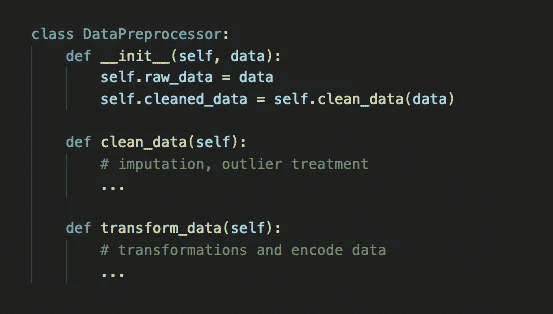

# 面向对象的数据科学：重构代码

> 原文：[`towardsdatascience.com/object-oriented-data-science-refactoring-code-5bcb4ae7ce72`](https://towardsdatascience.com/object-oriented-data-science-refactoring-code-5bcb4ae7ce72)

## 提升机器学习模型和数据科学产品的效率代码和 Python 类。

[](https://medium.com/@molly.ruby?source=post_page-----5bcb4ae7ce72--------------------------------)[](https://towardsdatascience.com/?source=post_page-----5bcb4ae7ce72--------------------------------) [Molly Ruby](https://medium.com/@molly.ruby?source=post_page-----5bcb4ae7ce72--------------------------------)

·发表于 [Towards Data Science](https://towardsdatascience.com/?source=post_page-----5bcb4ae7ce72--------------------------------) ·阅读时间 7 分钟·2023 年 8 月 24 日

--



图片由作者创建。

对于数据科学家来说，代码是分析和决策的核心。随着数据科学应用的复杂性增加，从嵌入在软件中的机器学习模型到协调大量信息的复杂数据管道，开发干净、组织良好且易于维护的代码变得至关重要。面向对象编程（OOP）解锁了灵活性和效率，使数据科学家能够敏捷地应对不断变化的需求。OOP 引入了类的概念，这些类作为创建对象的蓝图，这些对象封装了数据及其操作。这种范式转变使数据科学家能够超越传统的函数方法，促进模块化设计和代码重用。

在本文中，我们将探讨通过创建类和部署面向对象技术来重构数据科学代码的好处，以及这种方法如何增强模块化和可重用性。

# 数据科学中的类的力量

在传统的数据科学工作流中，函数是封装逻辑的方法。这通常足够，因为函数允许开发人员减少重复代码。然而，随着项目的发展，维护大量函数可能会导致代码难以导航、调试和扩展。

这时类发挥了作用。类是创建对象的蓝图，这些对象将数据和操作数据的函数（称为方法）捆绑在一起。通过将代码组织成类，开发人员可以实现以下几个优势：

1.  模块化和封装：类通过将相关功能组合在一起来促进模块化。每个类封装了自己的属性（数据）和方法（函数），减少了全局变量污染的风险和命名冲突的可能性。这有助于保持关注点的清晰分离，使代码更容易理解和修改。

1.  可重用性：类通过为项目的不同部分提供一致的接口来鼓励重用。一旦定义了一个类，它可以在需要时实例化，并且其方法可以用来实现一致的结果。

1.  4\. 继承和多态：继承允许开发人员创建子类，从父类继承属性和方法。这促进了代码重用，同时使得特定任务的定制成为可能。多态性，另一个面向对象编程的概念，让开发人员可以在不同类中使用相同的方法名称，根据具体实现调整行为。

1.  5\. 测试和调试：类促进了单元测试，因为测试用例可以针对类中的单独方法，这使得识别和修复问题变得更加容易，从而提高了代码库的整体健壮性。

# 将代码重构为类：一个理论例子

假设你正在进行一个涉及数据预处理、模型训练和评估的机器学习项目。最初，你可能会有一组用于每个步骤的函数：

```py
# Example: Using functions for data preprocessing

def load_data(file_path):
    # Load and preprocess data
    ...

def preprocess_data(data):
    # Clean, transform, and encode data
    ...

def train_model(preprocessed_data):
    # Train a machine learning model
    ...

def evaluate_model(trained_model, test_data):
    # Evaluate model performance
    ...
```

尽管功能分解有效，但随着时间的推移，预处理、训练和评估中可能会有许多步骤。这可能会使管理这些函数变得具有挑战性。

将代码重构为类：

```py
def load_data(self, file_path):
        # Load data
        ...

class DataPreprocessor:
    def __init__(self, data):
        self.raw_data = data
        self.cleaned_data = self.clean_data(data)

    def clean_data(self):
        # imputation, outlier treatment
        ...

    def transform_data(self):
        # transformations and encode data
        ...

class ModelTrainer:
    def __init__(self, preprocessed_data):
        self.model = self.train_model(preprocessed_data)

    def fit(self, preprocessed_data):
        # Train a machine learning model
        ...

    def predict(self, preprocessed_data):
        # Predict using the machine learning model
        ...

class ModelEvaluator:
    def __init__(self, predictions, actuals):
        self.performance_metrics = self.evaluate_model(predictions, actuals)

    def evaluate_model(self, predictions, actuals):
        # Evaluate model performance
        ...

    def calculate_rmse(self, predictions, actuals):
        # Evaluate root mean squared error

    def calculate_r_squared(self, predictions, actuals):
        # Evaluate r_squared of the model
```

通过将工作流程拆分为类，组织性得到了提升，结构也更易于阅读和维护。每个类处理过程的特定方面。它们可以被实例化为：

```py
data_preprocessor = DataPreprocessor('data.csv')
model_trainer = ModelTrainer(data_preprocessor.preprocessed_data)
model_evaluator = ModelEvaluator(model_trainer.model, test_data)
```

在这种情况下，类的引入提供了额外的结构和灵活性，改善了代码的工作流程和可用性。通过利用类的强大功能，这个示例创建了一个更为健壮和可扩展的代码库。

# 将代码重构为类：一个实际的例子

作为一个实际的例子，我最近将[这个代码库](https://github.com/mollyryanruby/sales_forecasting)三年前开发的代码重构到[一个新代码库](https://github.com/mollyryanruby/auto_forecast)中，以展示重构前后的代码差异。

在初始代码库中，许多函数涵盖了建模任务，因为训练和测试了多个不同的模型。在重构版本中，有一个名为 SalesForecasting 的模型类涵盖了所有建模任务。这更易于阅读，并且使得作为 SalesForecasting 部署包更为高效，并可以用不同的输入多次实例化。作为预览，这个类的样子如下：

```py
class SalesForecasting:
    """
    SalesForecasting class to train and predict sales using a variety of models. 
    """

    def __init__(self, model_list):
        """
        Initialize the SalesForecasting class with a list of models to train and predict.

        Args:
            model_list (list): list of models to train and predict. Options include:
                - LinearRegression
                - RandomForest
                - XGBoost
                - LSTM
                - ARIMA

        Returns:
            None
        """

        ...

    def fit(self, X_train, y_train):
        """
        Fit the models in model_dict to the training data.

        Args:
            X_train (pd.DataFrame): training data exogonous features for the model
            y_train (pd.Series): training data target for the model

        Returns:
            None
        """

        ...

    def __fit_regression_model(self, model):
        """
        Fit a regression model to the training data.

        Args:
            model (sklearn model): sklearn model to fit to the training data

        Returns:
            model (sklearn model): fitted sklearn model
        """
        ...

    def __fit_lstm_model(self, model):
        """
        Fit an LSTM model to the training data.

        Args:
            model (keras model): keras model to fit to the training data

        Returns:
            model (keras model): fitted keras model
        """

        ...

    def __fit_arima_model(self, model_name):
        """
        Fit an ARIMA model to the training data.

        Args:
            model_name (str): name of the model to fit to the training data

        Returns:
            model (pmdarima model): fitted pmdarima model
        """
        ...

    def predict(self, x_values, y_values=None, scaler=None, print_scores=False):
        """
        Predict values using the models in model_dict.

        Args:
            x_values (pd.DataFrame): exogenous features to predict on
            y_values (pd.Series): target values to compare predictions against
            scaler (sklearn scaler): scaler used to scale the data
            print_scores (bool): whether to print the scores for each model

        Returns:
            self (SalesForecasting): self with updated predictions
        """

        ...

    def __predict_regression_model(self, model):
        """
        Predict values using a regression model.

        Args:
            model (sklearn model): sklearn model to predict with

        Returns:
            predictions (np.array): array of predictions
        """
        ...

    def __predict_lstm_model(self, model):
        """
        Predict values using an LSTM model.

        Args:
            model (keras model): keras model to predict with

        Returns:
            predictions (np.array): array of predictions
        """
        ...

    def __predict_arima_model(self, model):
        """
        Predict values using an ARIMA model.

        Args:
            model (pmdarima model): pmdarima model to predict with
        Returns: 
            predictions (np.array): array of predictions
        """
        ...

    def __undo_scaling(self, values, scaler):
        """
        Undo scaling on a set of values.

        Args:
            values (np.array): array of values to unscale
            scaler (sklearn scaler): scaler to use to unscale the values

        Returns:
            unscaled_values (np.array): array of unscaled values
        """
        ...

    def get_scores(self, y_pred, y_true, model_name=None, print_scores=False):
        """
        Get the scores for a model. Scores include RMSE, MAE, and R2.

        Args:
            y_pred (np.array): array of predicted values
            y_true (np.array): array of true values
            model_name (str): name of the model to get scores for
            print_scores (bool): whether to print the scores for the model

        Returns:
            rmse (float): root mean squared error
            mae (float): mean absolute error
            r2 (float): r squared
        """
        ...

    def plot_results(self, model_list=None, figsize=p.FIG_SIZE, xlabel="Date", ylabel="Sales", title="Sales Forecasting Predictions"):
        """
        Plot the results of the predictions against the actual values.
        Generates a timeseries for predictions from each model in model_dict.

        Args:
            model_list (list): list of models to plot. If None, plots all models in model_dict
            figsize (tuple): tuple of figure size
            xlabel (str): label for x axis
            ylabel (str): label for y axis
            title (str): title for the plot

        Returns:
            fig (matplotlib figure): figure with the plot
        """

        ...

    def plot_errs(self, figsize=(13,3)):
        """
        Plot the errors for each model in model_dict. Errors include RMSE, MAE, and R2.

        Args:
            figsize (tuple): tuple of figure size

        Returns:
            fig (matplotlib figure): figure with the plot
        """
        ...
```

“SalesForecasting”类作为一个全面的蓝图，帮助数据驱动的企业通过应用各种预测模型来预测未来的销售趋势。在这个类中，数据科学家可以利用不同的建模技术，包括线性回归、随机森林、XGBoost、LSTM（长短期记忆）和 ARIMA（自回归积分滑动平均）。通过将预测工作流封装在这个类中，模型拟合、预测和评估的过程变得更加简化和一致。通过“SalesForecasting”类，数据科学家可以高效地实验不同的算法，并轻松维护代码库。

面向对象编程是数据科学家用来构建反映其分析的真实世界系统复杂性的代码的工具，使他们能够在最大化灵活性的同时提取有价值的洞察。虽然 python 旨在将类用于实例化和继承，上面的例子展示了一个初步步骤，其中类被用于模块化代码。随着数据科学能力的扩展和团队的增长，维护高效的代码是至关重要的。

[在这里查看完整的重构代码库。](https://github.com/mollyryanruby/auto_forecast/tree/main/auto_forecast)
