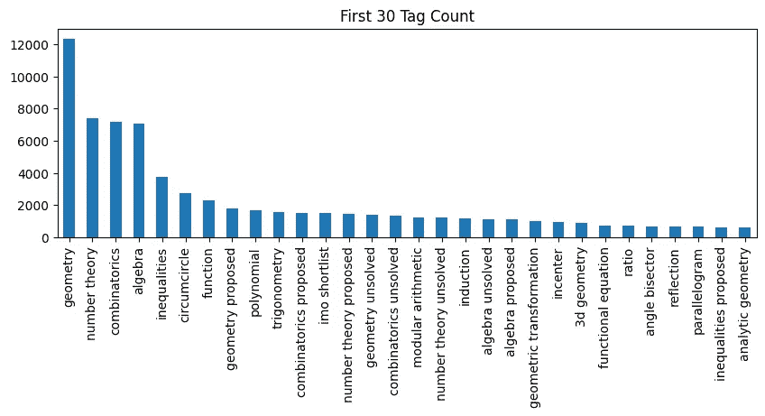
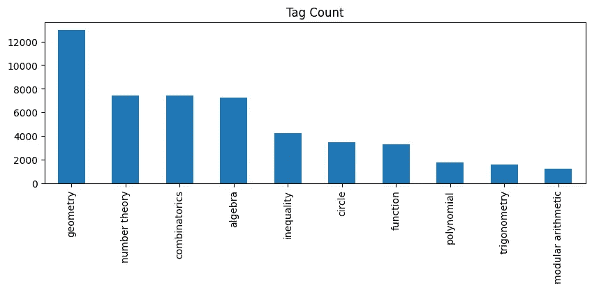
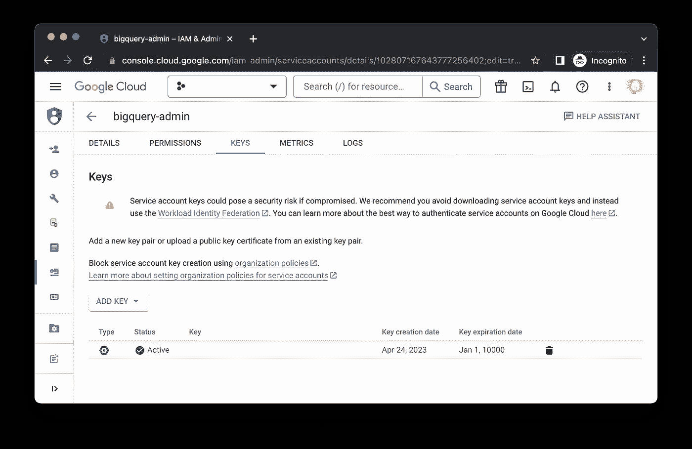
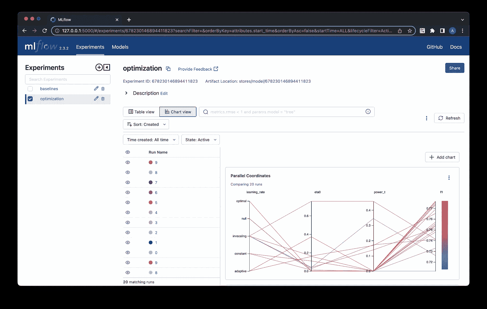

# 好的，你已经训练了最好的机器学习模型。接下来做什么？

> 原文：[`towardsdatascience.com/okay-youve-trained-the-best-machine-learning-model-what-s-next-e7b8f167006e`](https://towardsdatascience.com/okay-youve-trained-the-best-machine-learning-model-what-s-next-e7b8f167006e)

## 数据科学

## 一个超越 Jupyter Notebook 建模的 MLOps 项目

[](https://dwiuzila.medium.com/?source=post_page-----e7b8f167006e--------------------------------)[](https://towardsdatascience.com/?source=post_page-----e7b8f167006e--------------------------------) [Albers Uzila](https://dwiuzila.medium.com/?source=post_page-----e7b8f167006e--------------------------------)

·发表于 [Towards Data Science](https://towardsdatascience.com/?source=post_page-----e7b8f167006e--------------------------------) ·阅读时间 18 分钟·2023 年 6 月 4 日

--


图片来源：[Elena Mozhvilo](https://unsplash.com/@miracleday?utm_source=medium&utm_medium=referral) 于 [Unsplash](https://unsplash.com/?utm_source=medium&utm_medium=referral)

```py
***Table of Contents***
**·** **Initialize a Repository**
**·** **Migrate Your Codebase**
  ∘ config/config.py
  ∘ config/args.json
  ∘ tagolym/utils.py
  ∘ tagolym/data.py
  ∘ tagolym/train.py
  ∘ tagolym/predict.py
  ∘ tagolym/evaluate.py
  ∘ tagolym/main.py
**·** **Package Your Codebase** **·** **Setup Data Source Credential** **·** **Run Your Pipeline** **·** **Miscellaneous** **·** **Push Your Project to GitHub** **·** **Wrapping Up**
```

假设你正在构建一个数据科学项目，可能是为了工作、大学、作品集、爱好或其他任何目的。你已经花费了很多时间来解决问题陈述，并在 Jupyter notebooks 中进行实验。现在，你在想，“我怎么将我的工作部署成一个有用的产品？”。

具体来说，假设你有一个托管论坛的网站。用户可以给论坛中的线程添加标签，以方便在不同主题的论坛之间导航。你希望通过建议预定义的标签来改善用户体验，从而为讨论提供背景。

论坛可以是任何形式的，因此让我们更具体一点；它通常以一个 *帖子* 开始，解释一个数学问题，接着是围绕这个问题的想法、问题、提示或答案。以下是一个线程的样子及其三个标签，即 **induction**、**combinatorics unsolved** 和 **combinatorics**。


论坛中的一个帖子示例 | 图片由 [author](http://dwiuzila.medium.com/membership) 提供

此时，你已经在你的 notebooks 中完成了所有工作，从理解问题陈述、定义指标、查询数据、清理数据、预处理、EDA、构建模型到评估和优化模型。

你会注意到有[很多帖子](https://medium.com/towards-data-science/multilabel-text-classification-done-right-using-scikit-learn-and-stacked-generalization-f5df2defc3b5)有着大量的标签。为了简化，你只筛选了 10 个标签。你开发的模型是简单的线性分类器（SVM、逻辑回归等），前面经过 TF-IDF 向量化，并用[随机梯度下降](https://medium.com/towards-data-science/complete-step-by-step-gradient-descent-algorithm-from-scratch-acba013e8420)（SGD）进行训练。



前 30 个频繁标签计数 | 图片由[作者](http://dwiuzila.medium.com/membership)提供



最终的标签分布。注意几何标签是最常见的 | 图片由[作者](http://dwiuzila.medium.com/membership)提供

虽然笔记本非常好，并且可以帮助你非常快速地进行实验，但它们并不适合生产环境，并且有时很难维护。因此，你需要将代码迁移到独立的 Python 文件中，然后逐步添加其他工具，同时与团队成员合作。

这个故事将引导你通过简明的步骤完成这项工作。在此之前，你可能想要刷新一下关于线性模型、TF-IDF 和 SGD 的知识：

[](/understanding-3-classical-machine-learning-models-once-and-for-all-part-1-32a1ac52c0fd?source=post_page-----e7b8f167006e--------------------------------) ## 线性回归、逻辑回归和 SVM 在 10 分钟内

### 线性回归与逻辑回归和支持向量机有什么关系？

towardsdatascience.com [](/all-you-need-to-know-about-bag-of-words-and-word2vec-text-feature-extraction-e386d9ed84aa?source=post_page-----e7b8f167006e--------------------------------) ## 你需要了解的词袋模型和 Word2Vec — 文本特征提取

### 为什么 Word2Vec 更好，但为什么它还不够好

towardsdatascience.com [](/complete-step-by-step-gradient-descent-algorithm-from-scratch-acba013e8420?source=post_page-----e7b8f167006e--------------------------------) ## 从头开始的完整梯度下降算法步骤

### 以及其对常数学习率和线性搜索的实现

towardsdatascience.com

# 初始化一个仓库

首先，让我们在[GitHub](https://github.com/new)上创建一个名为[tagolym-ml](https://github.com/dwiuzila/tagolym-ml/tree/main)的新仓库，并配有`README.md`、`.gitignore`和`LICENSE`。


创建新的 GitHub 仓库 | 图片来源 [author](http://dwiuzila.medium.com/membership)

要使用这个代码库，请执行以下步骤：

1.  克隆代码库，将创建一个名为`tagolym-ml`的文件夹。

1.  将工作目录更改为此文件夹。

1.  创建一个名为`venv`的虚拟环境。

1.  激活环境。

1.  升级`pip`。

1.  可选地，你可以使用`pip list`检查当前环境中已安装的包，其中会有`pip`和`setuptools`。

1.  创建一个名为`code_migration`的新 git 分支并切换到它。

1.  创建一个`setup.py`文件。

1.  创建一些名为`config`、`tagolym`和`credentials`的新文件夹。

1.  在`config`文件夹内创建`config.py`和`args.json`文件。

1.  在`tagolym`文件夹内创建`main.py`、`utils.py`、`data.py`、`train.py`、`evaluate.py`和`predict.py`文件。

如果你不知道如何做这些，不用担心。这里是你可以在喜欢的终端上运行的所有命令：

```py
$ git clone https://github.com/dwiuzila/tagolym-ml.git
$ cd tagolym-ml
$ python3 -m venv venv
$ source venv/bin/activate
$ python3 -m pip install --upgrade pip
$ pip list
Package    Version
---------- -------
pip        23.1.2
setuptools 58.0.4
$ git checkout -b code_migration
$ touch setup.py
$ mkdir config tagolym credentials
$ touch config/config.py config/args.json
$ cd tagolym
$ touch main.py utils.py data.py train.py evaluate.py predict.py
$ cd ..
```

你现在有一个本地 git 仓库，已连接到 GitHub 上的远程仓库。当地仓库的目录将如下所示。

```py
config/
├── args.json        - preprocessing/training parameters
└── config.py        - configuration setup
credentials/         - keys and passwords
tagolym/
├── data.py          - data processing components
├── evaluate.py      - evaluation components
├── main.py          - training/optimization pipelines
├── predict.py       - inference components
├── train.py         - training components
└── utils.py         - supplementary utilities
venv/                - virtual environment
.gitignore           - files/folders that git will ignore
LICENSE              - project license
README.md            - longform description of the project
setup.py             - code packaging
```

目前几乎所有这些文件都是空的。你将一个一个地填写它们，从`config`文件夹开始。

# 迁移你的代码库

你的项目中有两个主要文件夹，即`config`和`tagolym`。你需要将笔记本中的必要代码复制到这些文件夹中的文件中。我们来做吧。

## config/config.py

在这里，你定义了与种子、目录、实验跟踪、预处理和标签名称相关的全局变量。

当这个文件在你的代码中被导入时，如果尚未创建，它将创建两个新文件夹：

1.  `data`，用于存储项目的标记数据，

1.  `stores/model`，用于存储模型注册，

然后将`stores/model`连接到用于实验跟踪的 MLflow 跟踪 URI。

你还在这里定义了停用词和额外的命令词。停用词将默认为`nltk`包中的词汇，而命令词为`["prove", "let", "find", "show", "given"]`，这些词经常出现在帖子中，但不提供任何有用的信号。

正则表达式用于预处理。它们看起来很吓人，但你不需要理解它们。它们的基本功能是捕捉任何[数学表达式](https://www.overleaf.com/learn/latex/Mathematical_expressions)和[渐近线语法](https://asymptote.sourceforge.io/)的 LaTeX，这些在数学问题的帖子中是基础和核心。

最后，记住你只选择了 10 个入围标签进行处理？你在这个文件中列出了所有这些标签。一些标签与您的标签有类似的含义（例如“inequalities” → “inequality”），因此你也有 10 个部分标签来捕获这些标签并用适当的标签替换它们。请参见下面的`tagolym/data.py`，了解如何操作。

## config/args.json

这是你存储整个过程的*初始*参数的地方。它们来自管道的不同部分。

它们是什么意思？

1.  `nocommand` 和 `stem` —— 处理帖子时的布尔值，是否排除命令词和实现[词干提取](https://en.wikipedia.org/wiki/Stemming)。

1.  `ngram_max_range` —— 在[TF-IDF 向量化](https://scikit-learn.org/stable/modules/generated/sklearn.feature_extraction.text.TfidfVectorizer.html)过程中提取不同*n*-gram 的*n*值范围的上限。

1.  `loss`、`l1_ratio`、`alpha`、`learning_rate`、`eta0`、`power_t` —— 用于[SGD 分类器](https://scikit-learn.org/stable/modules/generated/sklearn.linear_model.SGDClassifier.html)的模型的超参数。

## tagolym/utils.py

流水线有些复杂，因此你需要一些实用函数和 Python 类来简化代码。这个文件包含了这些：

1.  `load_dict` 和 `save_dict` —— 从 JSON 文件中加载字典，或将字典转储到 JSON 文件中。

1.  `NumpyEncoder` —— 将包含 Numpy 实例的对象编码为 Python 内置实例，用于`save_dict`。

1.  `IterativeStratification` —— 当你处理像这个项目这样的多标签分类时，普通的[训练-测试划分](https://scikit-learn.org/stable/modules/generated/sklearn.model_selection.train_test_split.html)方法对于数据并不理想。相反，你需要我们所说的[迭代分层](http://scikit.ml/stratification.html)，它旨在提供在给定阶数下标签关系证据的良好平衡分布。在这个项目中，阶数设置为 2。

## tagolym/data.py

与数据相关的所有函数都写在这个文件中，包括数据分割、预处理和转换。

1.  `preprocess` —— 从包含部分标签的标签创建映射到`config/config.py`中定义的 10 个标签之一，然后对所有帖子和标签进行文本处理。这个函数还会在文本处理后删除所有空帖子样本。

1.  `binarize` — 根据模型要求，如果你正在处理多标签分类问题，你可能需要对标签进行二值化。此函数将标签转换为一个大小为（#样本 × #标签）的二进制矩阵，指示标签中标签的存在。例如，包含两个标签`["algebra", "inequality"]`的标签将被转换为`[1, 0, 0, 0, 0, 1, 0, 0, 0, 0]`。除了返回转换后的标签，它还返回稍后使用的`[MultiLabelBinarizer](https://scikit-learn.org/stable/modules/generated/sklearn.preprocessing.MultiLabelBinarizer.html)`对象，特别是在将矩阵转换回标签时。

1.  `split_data` — 使用`tagolym/utils.py`中的`IterativeStratification`，此函数将帖子和标签拆分为 3 部分，比例为 70/15/15，分别用于模型训练、验证和测试。

## tagolym/train.py

最佳实践是将模型训练、验证和测试放在不同的文件中。正如文件名所示，你在这里进行所有的训练。由于你希望用户能自信地使用模型的标签推荐，你需要降低假阳性率。

另一方面，目前假阴性并不是你的首要任务。为了说明这一点，我们来看看一个极端的例子：模型将所有 10 个标签预测为负值，因此没有推荐标签，你会有大量的假阴性。但用户可以毫不犹豫地创建自己的标签。这没什么大不了的。

> 所以，你的目标是拥有一个高精度的模型。

现在，让我们讨论一下这个文件的内容：

1.  `train` — 预处理数据，将标签二值化，并使用`tagolym/data.py`中的函数拆分数据。然后，初始化一个模型，训练它，使用训练好的模型对所有三个数据拆分进行标签预测，并评估预测结果。这个函数接受`args`，其中包含`config/args.json`中的所有参数，返回时可能会添加一个额外的参数`threshold`。基本上，`threshold`是通过`tune_threshold`计算出的每个标签的最佳阈值列表。

1.  `objective` — f1 分数是[超参数调整](https://en.wikipedia.org/wiki/Hyperparameter_optimization)中选择的优化指标。使用试验中选择的`args`，此函数训练模型并返回验证集的 f1 分数。它还为试验设置了额外的属性，包括所有三个数据拆分的精确度、召回率和 f1 分数。

1.  `tune_threshold` — 二分类问题的默认决策边界是 0.5，但这可能并不是最优的，具体取决于问题。因此，除了调整`args`，你还需要在优化 f1 分数时调整每个标签的阈值。它的作用是尝试从 0 到 1 的网格中所有可能的阈值，并选择具有最大 f1 分数的阈值。

## tagolym/predict.py

模型训练之后该做什么？预测！这个文件中有两个函数：

1.  `custom_predict` — 如果模型具有 `predict_proba` 属性，则此函数将预测每个标签作为标签的概率。否则，使用 0.5 阈值直接预测标签。在前一种情况下，如果提供了真实标签，函数将使用 `tagolym/train.py` 中的 `tune_threshold` 来调整阈值。

1.  `predict` — 加载 `args`、标签二值化器和训练好的模型。然后，预处理给定的文本，并使用 `custom_predict` 对其进行预测。之后，将预测矩阵转换回标签。

## tagolym/evaluate.py

给定预测和真实标签矩阵，本文件的目的是计算精度、召回率、F1 分数和样本数量。性能是根据总体样本、每类样本和每个切片样本计算的。你考虑了 8 个切片：

1.  短帖，即经过预处理后少于 5 个单词的帖子，

1.  六个切片，其中帖子被标记为子主题但未标记为覆盖子主题的更大主题，以及

1.  不包含频繁出现的四字或更多字的帖子。

## tagolym/main.py

这是运行所有任务的主要文件。这里有 5 个函数和你需要在其中编写的指令：

1.  `elt_data` — 查询标记数据并以 JSON 格式保存到`data`文件夹中。

1.  `train_model` — 从`data`文件夹加载标记数据并训练模型。不要忘记使用 MLflow 记录指标、工件和参数。还要将 MLflow `run_id`和指标保存到`config`文件夹中。

1.  `optimize` — 从`data`文件夹加载标记数据并优化给定的参数。为了提高搜索效率，优化分为两个步骤：a) 预处理、向量化和建模中的超参数；b) 学习算法中的超参数。还要根据目标将最佳参数保存到`config`文件夹中，命名为`args_opt.json`。

1.  `load_artifacts` — 将特定 `run_id` 的工件加载到内存中，包括参数、指标、模型和标签二值化器。

1.  `predict_tag` — 给定特定的 `run_id`，使用预加载的工件预测接收到的每个文本的标签。

唷！你刚刚完成了所有迁移工作。现在，如何使用这些代码？


由 [Jason Strull](https://unsplash.com/@jasonstrull?utm_source=medium&utm_medium=referral) 提供的照片，来源于 [Unsplash](https://unsplash.com/?utm_source=medium&utm_medium=referral)

# 打包你的代码库

当你使用笔记本时，你有一个预加载的包集合用于实验。为了在本地重现并部署到生产环境，你希望明确地定义你的环境。

你在这个项目中导入了许多开源包，但你的环境中只有`pip`和`setuptools`。因此，在运行管道之前，你需要安装这些包。

下面是一个方便的命令来实现这一点。注意，我在最后添加了 `[pip-chill](https://pypi.org/project/pip-chill/)` 以便于后续清理生成的包要求文件。

```py
$ pip install mlflow nltk regex scikit-learn snorkel joblib optuna pandas google-cloud-bigquery google-auth numpy scipy pip-chill
```

`pip-chill` 的一个很酷的特点是，它可以生成一个不包含文件中依赖于其他包的包的要求文件，使得要求文件干净且准确。让我们运行一下。

```py
$ pip-chill --no-chill > requirements.txt
```

这将创建一个 `requirements.txt` 文件，包含你实际需要的所有包。请注意，因为这些包是已经列在文件中的包的依赖项，所以文件中没有 `pandas`、`scikit-learn`、`regex` 以及其他几个包。

现在你将使用 `setup.py` 打包你的代码库，将所有依赖项打包在一起。在这个文件中，加载你在 `requirements.txt` 中的所有库，并使用 `setuptools` 中的 `setup` 函数定义你的包。

你的包名将是 `tagolym`。你可以在下面的代码中看到其他细节，如版本和描述。你从 `requirements.txt` 中加载的库将用于 `install_requires` 参数，并成为 `tagolym` 的依赖项。

然后你可以使用下面的命令安装 `tagolym`。这将创建一个名为 `tagolym.egg-info` 的新文件夹，包含项目的元数据。

```py
$ python3 -m pip install -e .
```

请注意，`-e` 或 `--editable` 标志会从本地项目路径以可编辑模式安装包。换句话说，如果你在当前工作目录中使用一些函数，例如使用 `from tagolym import main`，然后对 `tagolym/main.py` 进行一些更改，你将能够使用这个更新版本，而无需使用 `pip install` 重新安装你的包。

# 设置数据源凭证

有一个小问题。这些项目中使用的数据是我自己的数据，存储在我的 [BigQuery](https://cloud.google.com/bigquery) 中。在创建并下载一个 [服务账户密钥](https://console.cloud.google.com/iam-admin/serviceaccounts) 后，我将其重命名为 `bigquery-key.json`，并将其放置在 `credentials` 文件夹中。

要访问数据，你需要我的凭证，但不幸的是，这些凭证不能共享。不过不用担心，我会提供样本供你使用。



创建服务账户密钥 | 图片由 [作者](http://dwiuzila.medium.com/membership) 提供

你需要做的很简单：下载样本 `labeled_data.json` [**在这里**](https://gist.github.com/dwiuzila/74dc99fe6f6d3901dbd1695f77977865) 并将文件保存在工作目录中名为 `data` 的文件夹里。

# 运行你的管道

现在你准备好了！在终端中输入 `python3` 命令，你就可以运行 Python 中的所有内容。你只需使用 `tagolym/main.py` 文件。

首先，我使用我的凭证和 `elt_data` 函数查询数据。当我看到 `✅ Saved data!` 时，我知道过程顺利完成。如上所述，你可以跳过这一步，手动将我提供的样本放入 `data` 文件夹中。

然后，您可以使用 `optimize` 函数来优化模型，通过读取初始参数 `config/args.json`。我将试验次数设置为 10，但您可以尝试其他设置。由于您有一个两步优化过程，所以将创建一个新的 MLflow 研究，总共 20 次试验。找到的最佳验证 f1 分数是 0.7730。

使用一组优化后的参数 `config/args_opt.json`，您可以再次使用 `train_model` 函数训练模型，并使用 `predict_tag` 函数对文本列表进行推断。您可以看到下面的预测非常准确！

```py
$ python3
>>> from pathlib import Path
>>> from config import config
>>> from tagolym import main
>>>
>>> # query data
>>> key_path = "credentials/bigquery-key.json"
>>> main.elt_data(key_path)
✅ Saved data!
>>>
>>> # optimize model
>>> args_fp = Path(config.CONFIG_DIR, "args.json")
>>> main.optimize(args_fp, study_name="optimization", num_trials=10)
2023/06/03 17:42:12 INFO mlflow.tracking.fluent: Experiment with name 'optimization' does not exist. Creating a new experiment.
[I 2023-06-03 17:41:45,657] A new study created in memory with name: optimization
[I 2023-06-03 17:42:12,343] Trial 0 finished with value: 0.7519199358796977 and parameters: {'nocommand': False, 'stem': True, 'ngram_max': 2, 'loss': 'modified_huber', 'l1_ratio': 0.6011150117432088, 'alpha': 0.001331121608073689}. Best is trial 0 with value: 0.7519199358796977.
[I 2023-06-03 17:42:38,441] Trial 1 finished with value: 0.7629559140596291 and parameters: {'nocommand': False, 'stem': True, 'ngram_max': 2, 'loss': 'modified_huber', 'l1_ratio': 0.43194501864211576, 'alpha': 7.476312062252303e-05}. Best is trial 1 with value: 0.7629559140596291.
[I 2023-06-03 17:42:57,713] Trial 2 finished with value: 0.7511576441724478 and parameters: {'nocommand': True, 'stem': False, 'ngram_max': 3, 'loss': 'hinge', 'l1_ratio': 0.5924145688620425, 'alpha': 1.3783237455007187e-05}. Best is trial 1 with value: 0.7629559140596291.
[I 2023-06-03 17:43:19,108] Trial 3 finished with value: 0.7106573336158825 and parameters: {'nocommand': True, 'stem': False, 'ngram_max': 4, 'loss': 'hinge', 'l1_ratio': 0.6842330265121569, 'alpha': 0.00020914981329035596}. Best is trial 1 with value: 0.7629559140596291.
[I 2023-06-03 17:43:37,349] Trial 4 finished with value: 0.741392879377292 and parameters: {'nocommand': False, 'stem': False, 'ngram_max': 2, 'loss': 'hinge', 'l1_ratio': 0.5467102793432796, 'alpha': 3.585612610345396e-05}. Best is trial 1 with value: 0.7629559140596291.
[I 2023-06-03 17:44:04,235] Trial 5 finished with value: 0.7426444422157734 and parameters: {'nocommand': True, 'stem': True, 'ngram_max': 3, 'loss': 'hinge', 'l1_ratio': 0.045227288910538066, 'alpha': 9.46217535646148e-05}. Best is trial 1 with value: 0.7629559140596291.
[I 2023-06-03 17:44:30,104] Trial 6 finished with value: 0.7337258988967691 and parameters: {'nocommand': True, 'stem': True, 'ngram_max': 2, 'loss': 'modified_huber', 'l1_ratio': 0.07455064367977082, 'alpha': 0.009133995846860976}. Best is trial 1 with value: 0.7629559140596291.
[I 2023-06-03 17:44:51,778] Trial 7 finished with value: 0.7700323704566581 and parameters: {'nocommand': True, 'stem': False, 'ngram_max': 4, 'loss': 'log_loss', 'l1_ratio': 0.3584657285442726, 'alpha': 2.2264204303769678e-05}. Best is trial 7 with value: 0.7700323704566581.
[I 2023-06-03 17:45:18,125] Trial 8 finished with value: 0.7559495178348377 and parameters: {'nocommand': True, 'stem': True, 'ngram_max': 2, 'loss': 'log_loss', 'l1_ratio': 0.8872127425763265, 'alpha': 0.00026100256506134784}. Best is trial 7 with value: 0.7700323704566581.
[I 2023-06-03 17:45:47,029] Trial 9 finished with value: 0.7730089901544794 and parameters: {'nocommand': False, 'stem': True, 'ngram_max': 4, 'loss': 'log_loss', 'l1_ratio': 0.02541912674409519, 'alpha': 2.1070472806578224e-05}. Best is trial 9 with value: 0.7730089901544794.
[I 2023-06-03 17:45:47,056] A new study created in memory with name: optimization
[I 2023-06-03 17:46:16,061] Trial 0 finished with value: 0.7730089901544794 and parameters: {'learning_rate': 'optimal'}. Best is trial 0 with value: 0.7730089901544794.
[I 2023-06-03 17:46:48,008] Trial 1 finished with value: 0.7701884982320516 and parameters: {'learning_rate': 'adaptive', 'eta0': 0.15930522616241014}. Best is trial 0 with value: 0.7730089901544794.
[I 2023-06-03 17:47:18,651] Trial 2 finished with value: 0.7331091235928242 and parameters: {'learning_rate': 'invscaling', 'eta0': 0.0265875439832727, 'power_t': 0.17272998688284025}. Best is trial 0 with value: 0.7730089901544794.
[I 2023-06-03 17:47:49,429] Trial 3 finished with value: 0.7196639813595901 and parameters: {'learning_rate': 'invscaling', 'eta0': 0.038234752246751866, 'power_t': 0.34474115788895177}. Best is trial 0 with value: 0.7730089901544794.
[I 2023-06-03 17:48:21,601] Trial 4 finished with value: 0.7727673901952036 and parameters: {'learning_rate': 'adaptive', 'eta0': 0.3718364180573207}. Best is trial 0 with value: 0.7730089901544794.
[I 2023-06-03 17:48:51,330] Trial 5 finished with value: 0.7576010292654753 and parameters: {'learning_rate': 'invscaling', 'eta0': 0.16409286730647918, 'power_t': 0.16820964947491662}. Best is trial 0 with value: 0.7730089901544794.
[I 2023-06-03 17:49:21,906] Trial 6 finished with value: 0.7428637006524251 and parameters: {'learning_rate': 'invscaling', 'eta0': 0.040665633135147955, 'power_t': 0.13906884560255356}. Best is trial 0 with value: 0.7730089901544794.
[I 2023-06-03 17:49:52,034] Trial 7 finished with value: 0.746701310091385 and parameters: {'learning_rate': 'constant', 'eta0': 0.011715937392307063}. Best is trial 0 with value: 0.7730089901544794.
[I 2023-06-03 17:50:21,383] Trial 8 finished with value: 0.7683160697730758 and parameters: {'learning_rate': 'constant', 'eta0': 0.10968217207529521}. Best is trial 0 with value: 0.7730089901544794.
[I 2023-06-03 17:50:51,373] Trial 9 finished with value: 0.7338062675694838 and parameters: {'learning_rate': 'invscaling', 'eta0': 0.7568292060167615, 'power_t': 0.4579309401710595}. Best is trial 0 with value: 0.7730089901544794.
Best value (f1): 0.7730089901544794
Best hyperparameters: {
  "nocommand": false,
  "stem": true,
  "ngram_max": 4,
  "loss": "log_loss",
  "l1_ratio": 0.02541912674409519,
  "alpha": 2.1070472806578224e-05,
  "learning_rate": "invscaling",
  "eta0": 0.7568292060167615,
  "power_t": 0.4579309401710595,
  "threshold": [
    0.59,
    0.79,
    0.55,
    0.7000000000000001,
    0.5,
    0.72,
    0.76,
    0.63,
    0.7000000000000001,
    0.77
  ]
}
>>>
>>> # train model
>>> args_fp = Path(config.CONFIG_DIR, "args_opt.json")
>>> main.train_model(args_fp, experiment_name="baselines", run_name="sgd")
2023/06/03 17:52:01 INFO mlflow.tracking.fluent: Experiment with name 'baselines' does not exist. Creating a new experiment.
Run ID: fbdba0c7cab640bc853611ba6cd75cee
>>> text = [
...     "Let $c,d \geq 2$ be naturals. Let $\{a_n\}$ be the sequence satisfying $a_1 = c, a_{n+1} = a_n^d + c$ for $n = 1,2,\cdots$.Prove that for any $n \geq 2$, there exists a prime number $p$ such that $p|a_n$ and $p \not | a_i$ for $i = 1,2,\cdots n-1$.",
...     "Let $ABC$ be a triangle with circumcircle $\Gamma$ and incenter $I$ and let $M$ be the midpoint of $\overline{BC}$. The points $D$, $E$, $F$ are selected on sides $\overline{BC}$, $\overline{CA}$, $\overline{AB}$ such that $\overline{ID} \perp \overline{BC}$, $\overline{IE}\perp \overline{AI}$, and $\overline{IF}\perp \overline{AI}$. Suppose that the circumcircle of $\triangle AEF$ intersects $\Gamma$ at a point $X$ other than $A$. Prove that lines $XD$ and $AM$ meet on $\Gamma$.",
...     "Find all functions $f:(0,\infty)\rightarrow (0,\infty)$ such that for any $x,y\in (0,\infty)$, $$xf(x²)f(f(y)) + f(yf(x)) = f(xy) \left(f(f(x²)) + f(f(y²))\right).$$",
...     "Let $n$ be an even positive integer. We say that two different cells of a $n \times n$ board are [b]neighboring[/b] if they have a common side. Find the minimal number of cells on the $n \times n$ board that must be marked so that any cell (marked or not marked) has a marked neighboring cell."
... ]
>>> main.predict_tag(text=text)
[
  {
    "input_text": "Let $c,d \\geq 2$ be naturals. Let $\\{a_n\\}$ be the sequence satisfying $a_1 = c, a_{n+1} = a_n^d + c$ for $n = 1,2,\\cdots$.Prove that for any $n \\geq 2$, there exists a prime number $p$ such that $p|a_n$ and $p \not | a_i$ for $i = 1,2,\\cdots n-1$.",
    "predicted_tags": [
      "number theory"
    ]
  },
  {
    "input_text": "Let $ABC$ be a triangle with circumcircle $\\Gamma$ and incenter $I$ and let $M$ be the midpoint of $\\overline{BC}$. The points $D$, $E$, $F$ are selected on sides $\\overline{BC}$, $\\overline{CA}$, $\\overline{AB}$ such that $\\overline{ID} \\perp \\overline{BC}$, $\\overline{IE}\\perp \\overline{AI}$, and $\\overline{IF}\\perp \\overline{AI}$. Suppose that the circumcircle of $\triangle AEF$ intersects $\\Gamma$ at a point $X$ other than $A$. Prove that lines $XD$ and $AM$ meet on $\\Gamma$.",
    "predicted_tags": [
      "geometry"
    ]
  },
  {
    "input_text": "Find all functions $f:(0,\\infty)\rightarrow (0,\\infty)$ such that for any $x,y\\in (0,\\infty)$, $$xf(x²)f(f(y)) + f(yf(x)) = f(xy) \\left(f(f(x²)) + f(f(y²))\right).$$",
    "predicted_tags": [
      "algebra",
      "function"
    ]
  },
  {
    "input_text": "Let $n$ be an even positive integer. We say that two different cells of a $n \times n$ board are [b]neighboring[/b] if they have a common side. Find the minimal number of cells on the $n \times n$ board that must be marked so that any cell (marked or not marked) has a marked neighboring cell.",
    "predicted_tags": [
      "combinatorics"
    ]
  }
]
>>> exit()
```

您可以在美观的 MLflow UI 中查看您的实验：

```py
$ mlflow ui --backend-store-uri stores/model
```



MLflow 用户界面 | 图片由 [作者](http://dwiuzila.medium.com/membership) 提供

这些过程中的一些在后台创建了新的文件，大多数是模型训练的输出。您可以在下一节中解释的 `README.md` 文件中查看当前的项目目录。

# 杂项

您项目的安全性至关重要。因此，凭据应仅存在于本地仓库中；您不希望将其推送到 GitHub。

作为预防措施，在 `.gitignore` 文件末尾添加 `credentials/`。这将忽略您在开发项目时对 `credentials` 文件夹所做的任何更改。

其他您可能想要添加到 `.gitignore` 的内容包括 `data/` 和 `stores/`，因为它们可能包含敏感信息或占用大量磁盘空间。如果您使用的是 macOS，还需添加 `.DS_Store`。这是一个存储其所在文件夹自定义属性的文件，对您的项目没有用处。

完成所有这些之后，您可以选择更新 `README.md` 中的项目描述。只需输入您在这个故事中完成的高层次过程，以便每个人都可以轻松复制您的工作。这可能看起来是这样的。

# 将您的项目推送到 GitHub

您的项目很酷，但它对其他人有用吗？要回答这个问题，您可以开源您的项目，以便每个人都可以从中受益，提供反馈，甚至贡献。这样做非常简单。

您需要的是下面的三个命令：

1.  将您所做的每一项更改添加到 Git 索引中。

1.  将索引中的更改提交到本地仓库，并

1.  将本地仓库推送到远程，这将创建一个新的分支 `code_migration` 在远程仓库中。

```py
$ git add .
$ git commit -m "Initial commit"
$ git push origin code_migration
```

您可以在 [**这里**](https://github.com/dwiuzila/tagolym-ml/tree/code_migration) 查看结果。

> 了解更多关于 Git 的信息：

[](/a-real-world-case-study-of-using-git-commands-as-a-data-scientist-e7775cccb4ba?source=post_page-----e7b8f167006e--------------------------------) ## 作为数据科学家使用 Git 命令的真实案例研究

### 完成分支说明

towardsdatascience.com

# 总结

恭喜你！🍻 你已经阅读完了这个故事。你学会了如何将你的数据科学实验从 Jupyter Notebook 转化为一个干净且可维护的项目。除此之外，你还知道了如何打包你的项目，运行整个数据管道，并使用 GitHub 和 BigQuery。

不过，这只是你 MLOps 旅程的开始。还有很长的路要走。敬请关注！📻


图片由 [Matese Fields](https://unsplash.com/@tesecreates?utm_source=medium&utm_medium=referral) 在 [Unsplash](https://unsplash.com/?utm_source=medium&utm_medium=referral) 提供


🔥 *你好！如果你喜欢这个故事并想支持我作为一个作家，可以考虑* [***成为会员***](https://dwiuzila.medium.com/membership)*。每月只需 $5，你就可以无限制访问 Medium 上的所有故事。如果你通过我的链接注册，我将获得一小笔佣金。*

🔖 *想了解更多关于经典机器学习模型如何运作以及如何优化其参数的信息？或者 MLOps 大型项目的示例？还有精选的顶尖文章？继续阅读：*


[Albers Uzila](https://dwiuzila.medium.com/?source=post_page-----e7b8f167006e--------------------------------)

## MLOps 大型项目 - 第二部分

[查看列表](https://dwiuzila.medium.com/list/mlops-megaproject-part-ii-0c6f23f2ddfa?source=post_page-----e7b8f167006e--------------------------------)3 篇故事！[](../Images/140d7ffae64707753b23e1c5e18dce62.png)

[Albers Uzila](https://dwiuzila.medium.com/?source=post_page-----e7b8f167006e--------------------------------)

## 从零开始的机器学习

[查看列表](https://dwiuzila.medium.com/list/machine-learning-from-scratch-b35db8650093?source=post_page-----e7b8f167006e--------------------------------)8 篇故事！[](../Images/4b97f3062e4883b24589972b2dc45d7e.png)

[Albers Uzila](https://dwiuzila.medium.com/?source=post_page-----e7b8f167006e--------------------------------)

## 高级优化方法

[查看列表](https://dwiuzila.medium.com/list/advanced-optimization-methods-26e264a361e4?source=post_page-----e7b8f167006e--------------------------------)7 篇故事！[](../Images/99e5c4ac661c0a5c6f0f386ae7986984.png)

[Albers Uzila](https://dwiuzila.medium.com/?source=post_page-----e7b8f167006e--------------------------------)

## 我的最佳故事

[查看列表](https://dwiuzila.medium.com/list/my-best-stories-d8243ae80aa0?source=post_page-----e7b8f167006e--------------------------------)10 个故事

[Albers Uzila](https://dwiuzila.medium.com/?source=post_page-----e7b8f167006e--------------------------------)

## R 中的数据科学

[查看列表](https://dwiuzila.medium.com/list/data-science-in-r-0a8179814b50?source=post_page-----e7b8f167006e--------------------------------)7 个故事
