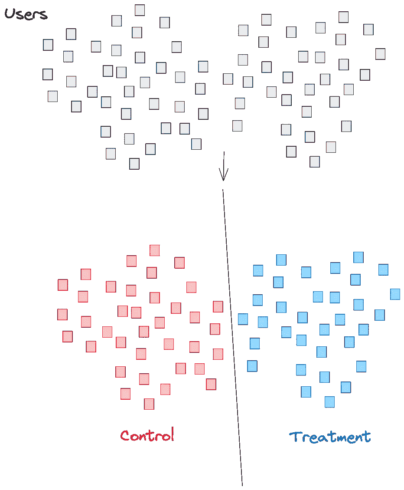
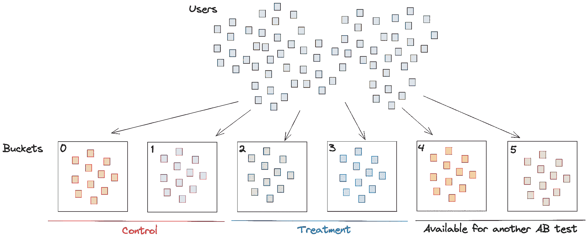
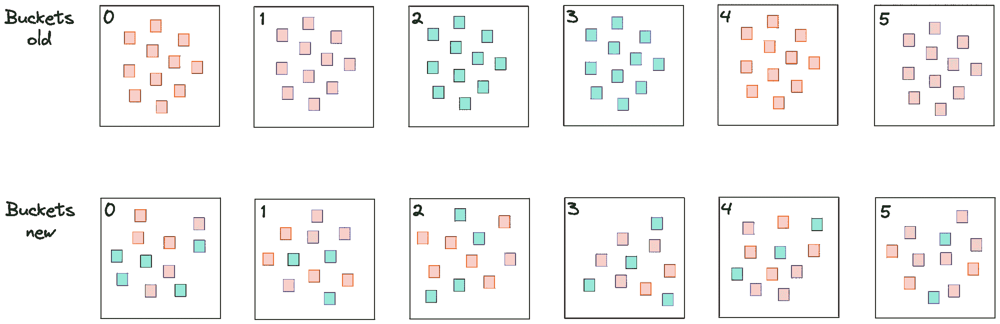
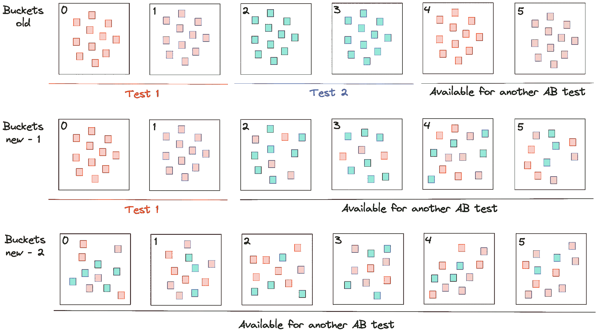

# 关于 A/B 测试和携带效应

> 原文：[`towardsdatascience.com/on-ab-tests-and-carryover-effect-43668dbd52e2?source=collection_archive---------11-----------------------#2023-05-23`](https://towardsdatascience.com/on-ab-tests-and-carryover-effect-43668dbd52e2?source=collection_archive---------11-----------------------#2023-05-23)


图片由 [Ron Hansen](https://unsplash.com/@ron_hansen?utm_source=medium&utm_medium=referral) 提供，来源于 [Unsplash](https://unsplash.com/?utm_source=medium&utm_medium=referral)

[](https://medium.com/@tearth?source=post_page-----43668dbd52e2--------------------------------)[](https://towardsdatascience.com/?source=post_page-----43668dbd52e2--------------------------------) [Denis Vorotyntsev](https://medium.com/@tearth?source=post_page-----43668dbd52e2--------------------------------)

·

[关注](https://medium.com/m/signin?actionUrl=https%3A%2F%2Fmedium.com%2F_%2Fsubscribe%2Fuser%2F12556e7f5251&operation=register&redirect=https%3A%2F%2Ftowardsdatascience.com%2Fon-ab-tests-and-carryover-effect-43668dbd52e2&user=Denis+Vorotyntsev&userId=12556e7f5251&source=post_page-12556e7f5251----43668dbd52e2---------------------post_header-----------) 发布于 [Towards Data Science](https://towardsdatascience.com/?source=post_page-----43668dbd52e2--------------------------------) · 7 分钟阅读 · 2023 年 5 月 23 日[](https://medium.com/m/signin?actionUrl=https%3A%2F%2Fmedium.com%2F_%2Fvote%2Ftowards-data-science%2F43668dbd52e2&operation=register&redirect=https%3A%2F%2Ftowardsdatascience.com%2Fon-ab-tests-and-carryover-effect-43668dbd52e2&user=Denis+Vorotyntsev&userId=12556e7f5251&source=-----43668dbd52e2---------------------clap_footer-----------)

--

[](https://medium.com/m/signin?actionUrl=https%3A%2F%2Fmedium.com%2F_%2Fbookmark%2Fp%2F43668dbd52e2&operation=register&redirect=https%3A%2F%2Ftowardsdatascience.com%2Fon-ab-tests-and-carryover-effect-43668dbd52e2&source=-----43668dbd52e2---------------------bookmark_footer-----------)

在复杂的数据驱动决策世界中，A/B 测试脱颖而出，成为一个强大的工具，帮助企业优化策略和改善用户体验。但当一个测试的效果渗透到下一个测试中时，会发生什么情况呢？这会使结果变得模糊不清，扭曲结果。

这种现象被称为“滞后效应”，可能对理解测试中变更的真实影响构成重大挑战。在本文中，我们将深入探讨 A/B 测试和滞后效应的细微差别，讨论有效管理这种现象的策略。我们将探索用户分组的机制、分桶技术以及如何识别和解决滞后效应，以确保你的 A/B 测试提供可靠的、可操作的结果。

# 用户与桶

AB 测试是比较两个版本功能的基础方法，通常用于确定哪一个表现更好。为了执行这些测试，我们通常将用户分成两个组——对照组和处理组，基于用户 ID。为了简化，我们可以将所有“偶数”用户分配给对照组，将所有“奇数”用户分配给处理组。



*直观的 AB 测试设置：所有用户被分成对照组和处理组*

初步步骤涉及估算样本大小——根据我们选择的指标（如点击率或每用户平均收入）来确定需要收集的用户或事件数量。这些估算考虑了方差（基于这些指标的历史观察）和预期效果（基于建议模型的离线结果）。在收集了足够的数据后，我们深入进行统计分析，如使用 t 检验比较对照组和处理组的平均收入，以确定表现更好的模型。

然而，这种方法面临几个障碍：

1.  **同时多重测试**：同时启动多个测试成为挑战。例如，如果一个新模型需要测试，没有剩余流量来容纳这个测试。解决方案是暂停当前的 AB 测试，并将用户分成三组。但如果我们不知道未来将运行多少个变体呢？

1.  **可扩展性问题**：处理广泛的用户基础时，扩展分析成为一项艰巨的任务。即使在用户级别缓存结果，对最近几天的 AB 测试进行统计计算也可能非常费力，尤其是在处理大量用户时。

为了绕过这些问题，我们采用了一种称为“分桶”的技术。

# 分桶方法

分桶将几个用户组合成一个称为“桶”的单元。你可以把这个桶看作是一个“元用户”。为了确定桶的 ID，我们使用以下公式：

```py
bucket_id = hash(user_id + salt) % number_of_buckets
```

在这里，***salt***是一个固定的随机字符串，而***number_of_buckets***是系统的预定义参数。根据系统设计，桶的 ID 可以实时计算（当用户访问网站时）或在用户访问网站时计算一次并存储在键值存储中。



*分桶理念：用户根据上述公式被分配到不同的桶中。处理是在用户级别应用的，但分析是在桶级别进行的。*

在启动 AB 测试之前，我们估算要分配给对照组和处理组的桶数量。例如，如果总桶数为 1000，我们将桶 0–99 的用户分配给对照模型，将桶 100–199 的用户分配给处理模型。这为两个模型提供了 10%的流量。

分桶允许我们在桶级别分析结果，而不是用户级别，这使我们可以在桶级别缓存指标，从而消除了繁重的重新计算需求。

# 了解延续效应

想象一个场景，你正在为一个大型电子商务网站设计一个新的推荐模型，使用高级神经网络。这个模型包括一个创新的功能，即 OpenAI GPT3 API 调用，用于生成商品标题的嵌入。该模型的离线结果显示出显著的性能提升，因此决定进行在线测试。

AB 测试的结构是跨越一周，将网站流量的 10%分配给对照组，10%分配给处理组。目标是比较两组之间的点击数量，以确定哪个模型表现更好。

然而，在 AB 测试上线几小时后，所有指标出现了令人担忧的下降。深入分析数据发现，由于复杂的模型，页面加载时间显著增加。这是一个意料之外的问题，在离线测试中没有遇到，也未在在线测试中考虑到。

针对加载时间缓慢的问题，分配到处理组的用户变得沮丧，导致一些用户减少使用或完全流失。这一不幸事件扰乱了用户在桶中的分布平衡，这是新 AB 测试中未考虑的一个方面。

这种持续的不平衡，即初始测试的直接后果，被称为“延续效应”。它发生在同一组用户在多个测试中不断经历变化时。本质上，由于分桶分配中使用了一致的盐或种子，桶“记住”了之前的 AB 测试，从而影响了后续测试的结果。

当用户行为因先前的处理而改变时，延续效应变得特别明显。例如，如果正在测试的新功能需要用户学习曲线，处理组的成员可能由于早期接触而更快适应，从而在其他组用户中获得优势。

在大规模和成熟的系统中，即使是 1%的微小变化也可能意味着数百万的收入，因此这一效应变得极为重要。数据科学家和机器学习工程师通常力求在指标上获得 0.1%的提升。然而，即使是轻微的延续效应也可能使多个 AB 测试失效，从而导致一个次优的模型被采纳或一个优质的模型因 AB 分组偏差而被弃用。

# 识别问题

为识别这一问题，数据科学家应定期进行 AA 测试。设计良好的 AB 测试系统应在 AA 测试中产生均匀的 p 值分布。AA 测试中 p 值直方图的不均匀性表明桶存在不平衡，可能由各种因素造成，包括带来的影响。

# 应对问题的策略

# 重排所有用户

避免桶内存储问题的最快且最简单的解决方案是定期更换盐值。这能确保用户在每次重排后在桶内随机分布，从而打破与先前分割的关联。然而，这种方法在进行 AB 测试期间并不实际，因为它扰乱了对照组和处理组之间的用户分布，破坏了 AB 测试的独立同分布（i.i.d.）前提，从而使结果无效。



简单重排：更改盐值将导致用户在桶之间重新分配

当同时进行多个 AB 测试时，这种方法也会带来挑战，协调所有测试的终止可能很困难，任何延误都可能代价高昂。此外，持续时间长的负面测试无法停止，否则会失去 AB 测试的进展。

# 重排非 AB 测试用户

另一种替代方案是对不涉及任何 AB 测试的用户进行重排。采用这种方法，在每次完成 AB 测试后，那些不参与任何测试的用户将被重新分配到可用的桶中。



*重排未参与 AB 测试的用户：在测试 2 结束后，来自桶 2、3、4 和 5 的用户被重排。测试 1 中的用户保持不变。在测试 1 结束后，所有桶中的用户都被重排。*

尽管这种方法不需要停止所有 AB 测试，但其实施更为复杂。我们需要跟踪实验中的用户并存储用户-ID 与桶的映射，频繁更新——这在大型系统中可能比较棘手。

# 结论

处理 AB 测试的复杂性，从用户设置和桶管理到处理带来的影响，需要精心规划和策略处理。理解这些复杂性可以帮助确保测试提供有价值的、可操作的见解，并对你正在进行的开发工作产生积极的贡献。通过采用有效的解决方案来克服潜在的障碍，你可以优化测试过程，提高用户体验，并最终优化产品的成功。

# 进一步阅读

为了深入理解带来的影响和 AB 测试的其他细微差别，这里有一些有价值的资源供进一步阅读：

[网页上的对照实验：调查与实用指南](https://www.researchgate.net/publication/220451900_Controlled_experiments_on_the_web_Survey_and_practical_guide) 对桶化设计进行了详细的探讨，这在执行对照网页实验中是一个关键要素。

[避免 A/B 测试中的三个陷阱的分离策略](https://www.ueo-workshop.com/wp-content/uploads/2014/04/Separation-strategies-for-three-pitfalls-in-AB-testing_withacknowledgments.pdf) 对分组设计进行了详细的讲解，分组设计是进行受控网络实验中的一个关键要素。

[如何解读 p 值直方图](http://varianceexplained.org/statistics/interpreting-pvalue-histogram/) 对 p 值直方图的解读进行了深入探讨，这在 AA 测试中至关重要。它有助于检测延续效应，使读者对 AB 测试的统计方面有更深入的理解。
