# 在代表性不足的群体面前的学习

> 原文：[`towardsdatascience.com/on-learning-in-the-presence-of-underrepresented-groups-8937434d3c85?source=collection_archive---------11-----------------------#2023-07-11`](https://towardsdatascience.com/on-learning-in-the-presence-of-underrepresented-groups-8937434d3c85?source=collection_archive---------11-----------------------#2023-07-11)

## 改变是困难的：对亚群体偏移的更深入了解 (ICML 2023)

 [Yuzhe Yang](https://yuzheyang.medium.com/?source=post_page-----8937434d3c85--------------------------------)

·

[关注](https://medium.com/m/signin?actionUrl=https%3A%2F%2Fmedium.com%2F_%2Fsubscribe%2Fuser%2Faae603d0709&operation=register&redirect=https%3A%2F%2Ftowardsdatascience.com%2Fon-learning-in-the-presence-of-underrepresented-groups-8937434d3c85&user=Yuzhe+Yang&userId=aae603d0709&source=post_page-aae603d0709----8937434d3c85---------------------post_header-----------) 发表在 [Towards Data Science](https://towardsdatascience.com/?source=post_page-----8937434d3c85--------------------------------) ·8 min read·2023 年 7 月 11 日

--

让我向您介绍我们最新的工作，这项工作已被 ICML 2023 会议接受：[**改变是困难的：对亚群体偏移的更深入了解**](https://arxiv.org/pdf/2302.12254.pdf)。机器学习模型在许多应用中表现出巨大的潜力，但它们在训练数据中***代表性不足***的***亚群体***上往往表现较差。理解导致这种*亚群体偏移*的机制变异，以及算法在大规模不同偏移下的泛化能力仍然是一个挑战。在这项工作中，我们旨在通过提供对亚群体偏移及其对机器学习算法影响的细致分析来填补这一空白。

我们首先提出了一个统一的框架，剖析并解释了子群体中常见的变化。此外，我们引入了一个[**综合基准**](https://github.com/YyzHarry/SubpopBench)，包含 20 种最先进的算法，我们在 12 个现实世界的数据集上对其进行了评估，这些数据集涵盖了*视觉*、*语言*和*医疗保健*领域。通过我们的分析和基准测试，我们提供了关于子群体变化及机器学习算法在这些现实世界变化下如何泛化的有趣观察和理解。代码、数据和模型已经在 GitHub 上开源：[`github.com/YyzHarry/SubpopBench`](https://github.com/YyzHarry/SubpopBench)。

# 背景与动机

机器学习模型在面对*分布变化*时通常表现出性能下降。这种变化发生在基础数据分布发生变化时（例如，训练分布与测试分布不同），导致模型部署时性能下降。构建对这些变化具有鲁棒性的机器学习模型对于在现实世界中安全部署这些模型至关重要。一种普遍存在的分布变化类型是**子群体变化**，其特征是在训练和部署之间某些子群体的比例发生变化。在这种情况下，模型可能在*总体*上表现良好，但在*稀有子群体*中表现较差。

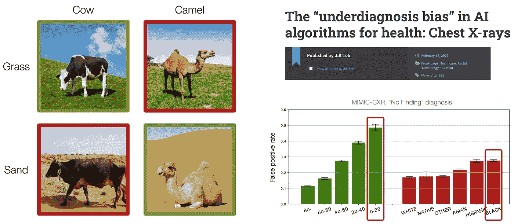

**左**：在牛与骆驼分类任务中，牛通常出现在绿色背景中，而骆驼则通常出现在黄色背景中。因此，模型在这些背景下表现良好，但无法泛化到背景颜色不同的图像中。 **右**：在医学诊断任务中，机器学习模型在代表性不足的年龄或种族群体上表现往往较差。（图片由作者提供）

例如，在牛和骆驼分类任务中，牛通常出现在绿色草地区域，而骆驼则通常出现在黄色沙地背景区域。然而，这种关联是***虚假的***，因为牛或骆驼的存在与背景颜色无关。因此，训练好的模型在上述图像上表现良好，但无法泛化到训练数据中稀少的不同背景颜色的动物，例如沙地上的牛或草地上的骆驼。

此外，研究发现，在医学诊断方面，机器学习模型在代表性不足的年龄或种族群体上表现往往较差，这引发了重要的公平性问题。

所有这些变化通常被称为***子群体变化***，但对于导致子群体变化的机制变异及算法如何在大规模的不同变化下泛化的了解甚少。那么，*如何建模子群体变化*？

# 子群体变化的统一框架

我们首先提供了一个统一的子群体转移建模框架。在经典分类设置中，我们有来自多个*类别*的训练数据（其中我们使用不同的颜色密度来表示每个类别中的样本数量）。然而，当涉及子群体转移时，除了类别之外还存在***属性***——例如在牛骆驼问题中的背景颜色。在这种情况下，我们可以根据**属性**和**标签**定义离散的*子群体*，而且在同一类别中，不同属性的样本数量也可能有所不同（见下图）。自然地，为了测试模型，类似于我们在*所有类别*中评估性能的分类设置，在子群体转移中我们测试模型在*所有子群体*上的表现，以确保所有子群体中的最差性能也足够好，或确保**所有组的性能都同样优秀**。

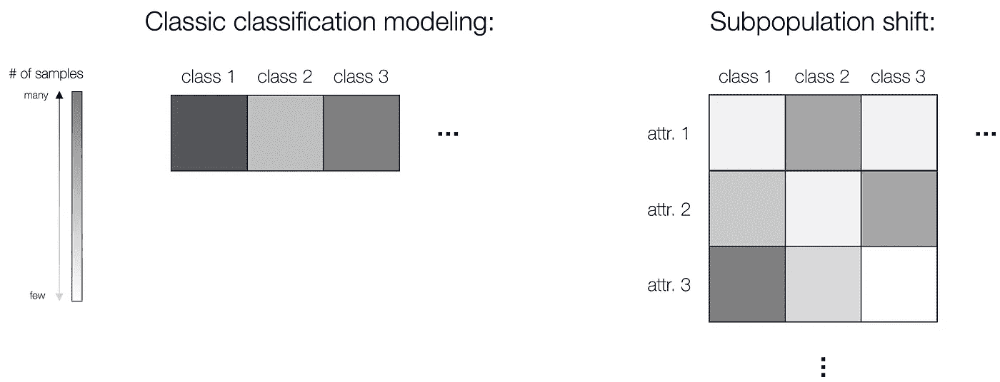

在子群体转移中，我们需要考虑属性，而不仅仅是类别标签。（图片由作者提供）

具体而言，为了提供一个通用的数学公式，我们首先使用贝叶斯定理重写分类模型。我们进一步将每个输入*x*视为由一组潜在核心特征（*X_core*）和一个属性列表（*a*）完全描述或生成。在这里，*X_core*表示与标签特定的、支持稳健分类的潜在不变成分，而属性*a*可能具有不一致的分布，并且不是标签特定的。因此，我们可以将这种建模整合回方程，并进一步分解为三项，如下所示：

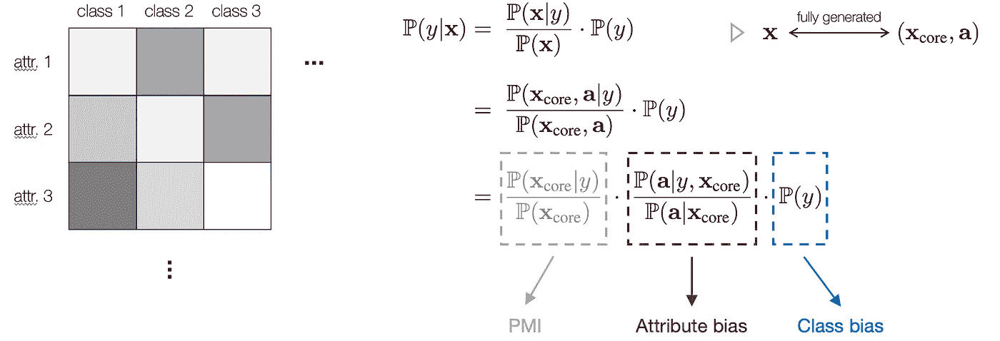

一个通用的子群体转移建模框架。（图片由作者提供）

具体而言，**第一**项表示*X_core*和*y*之间的点对点互信息（PMI），这是与潜在类别标签相关的稳健指标。**第二**项和**第三**项分别对应于**属性**分布和**标签**分布中可能出现的偏差。这种建模解释了属性和类别如何在子群体转移下影响结果。因此，给定训练和测试分布之间不变的*X_core*，我们可以忽略第一项的变化，关注***属性***和***类别***在子群体转移下如何影响结果。

基于此框架，我们正式定义并描述了四种基本的子群体转移类型：**虚假相关**、**属性不平衡**、**类别不平衡**和**属性泛化**。每种类型构成了子群体转移中可能出现的基本转移成分。

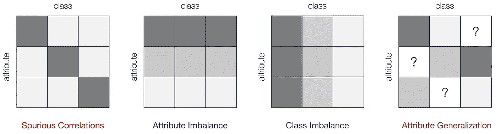

四种基本的子群体转移类型。（图片由作者提供）

首先，当某些属性在训练数据中与标签*y*存在虚假相关性，但在测试数据中没有时，这意味着**虚假相关性**。此外，当某些属性的采样概率远小于其他属性时，会引发**属性不平衡**。类似地，类别标签可能会表现出不平衡的分布，导致对少数标签的偏好较低，这将导致**类别不平衡**。最后，某些属性在训练中可能完全缺失，但在测试中对于某些类别却存在，这促使了**属性泛化**的需求。每种转移的属性/类别偏差来源及其对分类模型的影响总结在下面的表格中：

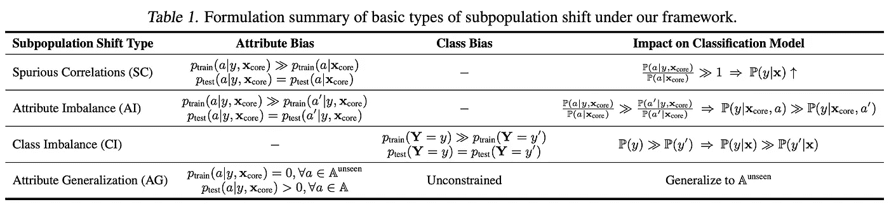

（图片由作者提供）

这四种情况构成了基本的转移组件，并且是解释真实数据中复杂子群体转移的重要元素。在实际应用中，数据集通常同时包含多种类型的转移，而不仅仅是一种。

# SubpopBench：子群体转移基准测试

在建立了公式后，我们提出了[SubpopBench](https://github.com/YyzHarry/SubpopBench)，这是一个包括在 12 个真实世界数据集上评估的最先进算法的综合基准测试。特别是，这些数据集来自各种模态和任务，包括视觉、语言和医疗保健应用，数据模态范围从自然图像、文本、临床文本到胸部 X 光。这些数据集还展现了不同的转移组件。

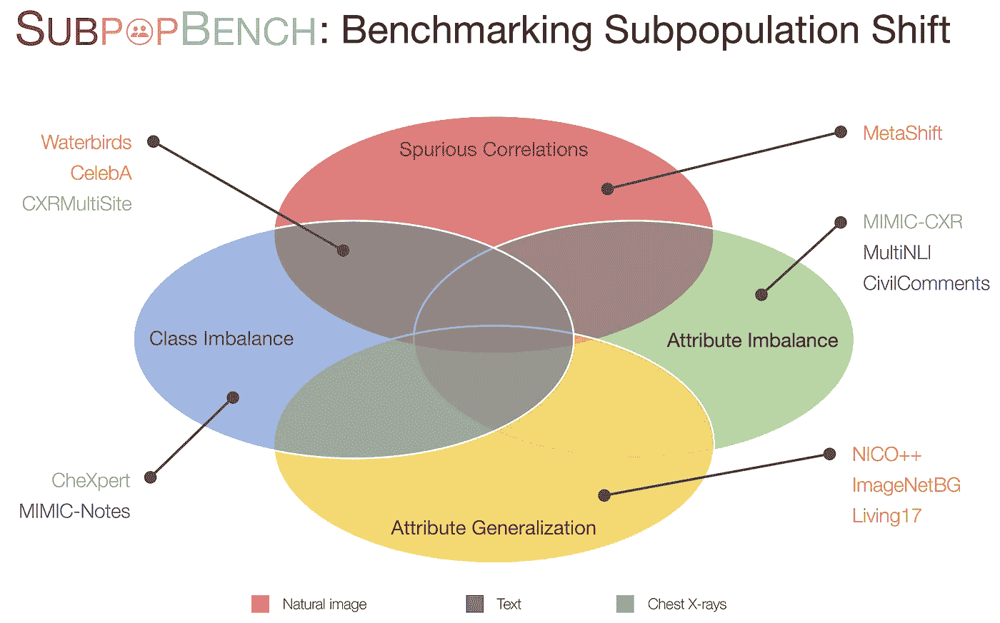

SubpopBench 基准测试。（图片由作者提供）

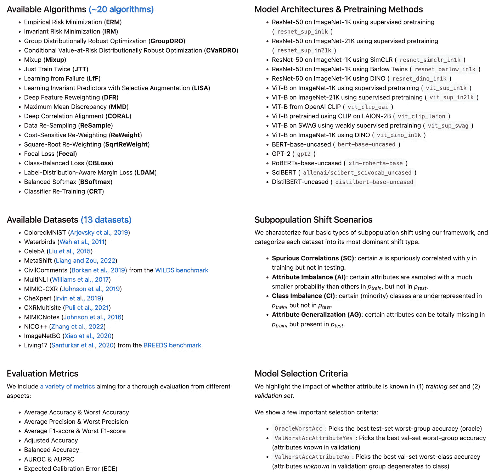

SubpopBench 基准测试。（图片由作者提供）

关于此基准测试的详细信息，请参阅我们的[论文](https://arxiv.org/pdf/2302.12254.pdf)。通过建立的基准测试和使用 20 种最先进算法训练的超过 10K 模型，我们揭示了未来研究中的一些有趣观察。

# 对子群体转移的细粒度分析

## SOTA 算法仅改善某些类型的转移

首先，我们观察到 SOTA 算法仅在某些类型的转移上改善子群体鲁棒性，而在其他类型的转移上则没有。

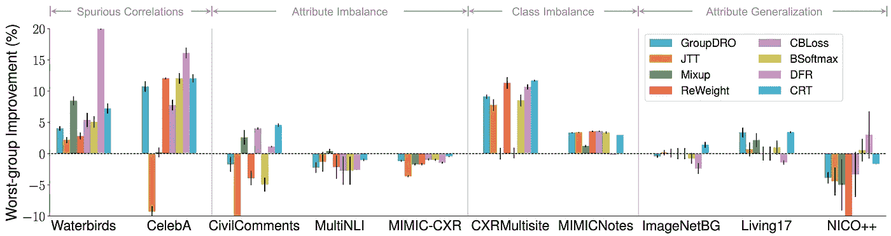

（图片由作者提供）

我们在这里绘制了各种 SOTA 算法相对于 ERM 的最差组准确性改进。对于*虚假相关性*和*类别不平衡*，现有算法可以提供相对于 ERM 的一致最差组增益，表明在解决这两种特定转移上已有进展。

然而，有趣的是，当涉及到*属性不平衡*时， across 数据集几乎没有观察到改进。此外，对于*属性泛化*，性能甚至变得更差。

这些发现强调了当前的进展仅针对**特定**的转移，而对于更具挑战性的转移，如 AG，**没有进展**。

## 表示和分类器的作用

此外，我们受到启发去探讨***表示***和***分类器***在子群体变化中的作用。具体来说，我们将整个网络分为两个部分：特征提取器*f*和分类器*g*，其中*f*从输入中提取潜在特征，而*g*输出最终预测。我们提出的问题是，*表示和分类器如何影响子群体性能*？

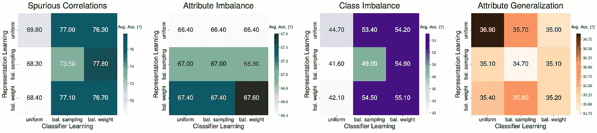

（作者提供的图片）

首先，给定一个基础的 ERM 模型，当**仅优化分类器学习**并固定表示时，可以显著提高*虚假相关*和*类别不平衡*的性能，这表明 ERM 学到的表示已经足够好。然而有趣的是，**改进表示学习而非分类器**可以带来显著的提升，特别是在*属性不平衡*方面，这表明我们可能需要更强大的特征来应对某些变化。最后，**无分层学习**的方式在*属性泛化*下没有性能提升。这突显了在面对现实中不同类型的变化时，***需要考虑模型管道设计***。

## 关于模型选择与属性可用性

此外，我们观察到***模型选择***和***属性可用性***对子群体变化评估有显著影响。

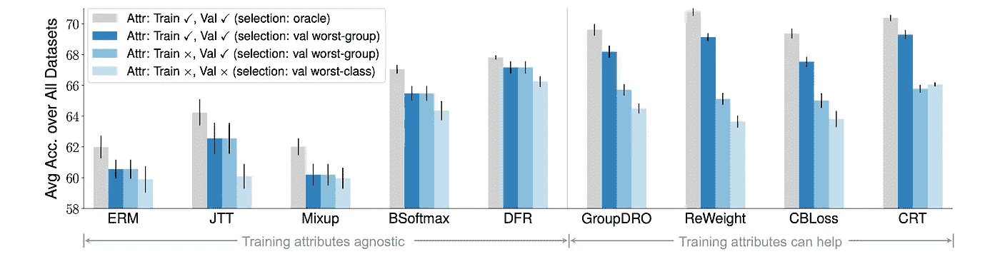

（作者提供的图片）

具体而言，当逐渐去除训练和/或验证数据中的属性注释时，所有算法的性能都出现了显著下降，特别是当训练和验证数据中**没有**属性可用时。

这表明**获取属性**仍在子群体变化中发挥重要作用，未来的算法应该**考虑更现实的场景**以进行模型选择和属性可用性。

## 超越最差组准确率的指标

最后，我们揭示了***基本的*** ***权衡***在评估指标之间。最差组准确率，或*WGA*，被认为是子群体评估的金标准。然而，*改善 WGA* ***是否总是提升其他有意义的指标***？

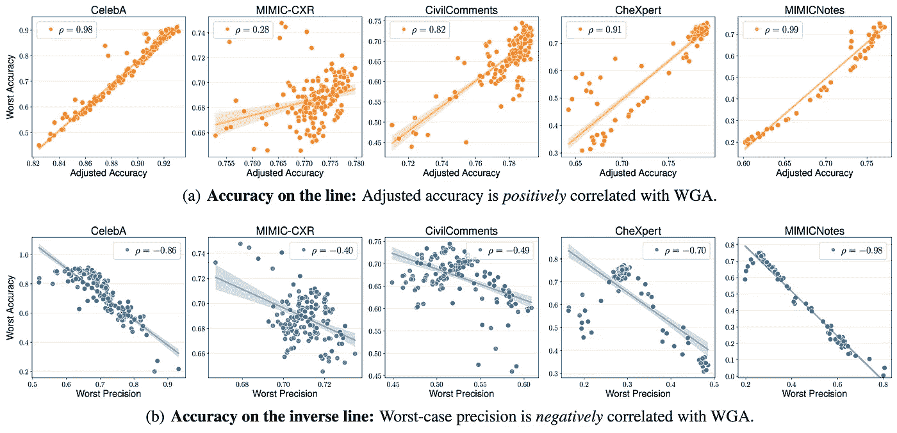

（作者提供的图片）

我们首先展示了改善 WGA 可能导致某些指标性能提升，例如这里显示的调整准确率。然而，如果我们进一步考虑最差情况精度，它却与 WGA 显示出非常强的负线性相关性。这揭示了使用 WGA 作为唯一指标来评估模型在子群体变化中的表现的***基本限制***：表现良好的模型具有高 WGA，但其最差类别精度可能**很低**，这在医疗诊断等关键应用中尤其令人担忧。

我们的观察强调了在子群体转移中需要更多**现实且广泛的评估指标**。我们还展示了许多在本文中与 WGA 呈负相关的其他指标。

# 结语

总结本文，我们系统地研究了子群体转移问题，形式化了一个统一的框架来定义和量化不同类型的子群体转移，并进一步建立了一个全面的基准，以便在真实世界数据中进行评估。我们的基准包括 20 种 SOTA 方法和 12 个来自不同领域的真实数据集。基于超过 10K 训练模型，我们揭示了子群体转移中的有趣特性，这些特性对未来的研究具有重要意义。我们希望我们的基准和发现能够促进现实和严格的评估，并激发子群体转移领域的新进展。最后，我附上了几篇相关论文的链接；感谢阅读！

**代码**: [`github.com/YyzHarry/SubpopBench`](https://github.com/YyzHarry/SubpopBench)

**项目页面**: [`subpopbench.csail.mit.edu/`](https://subpopbench.csail.mit.edu/)

**演讲**: [`www.youtube.com/watch?v=WiSrCWAAUNI`](https://www.youtube.com/watch?v=WiSrCWAAUNI)
