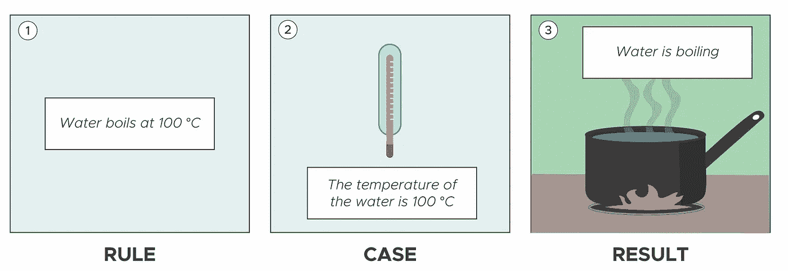
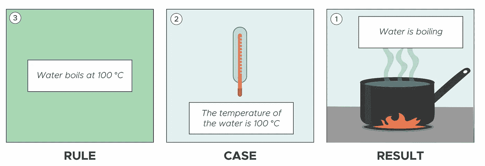
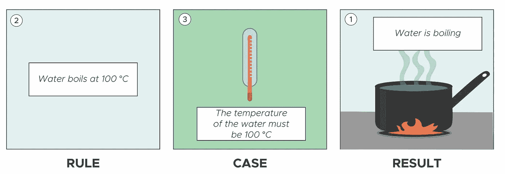
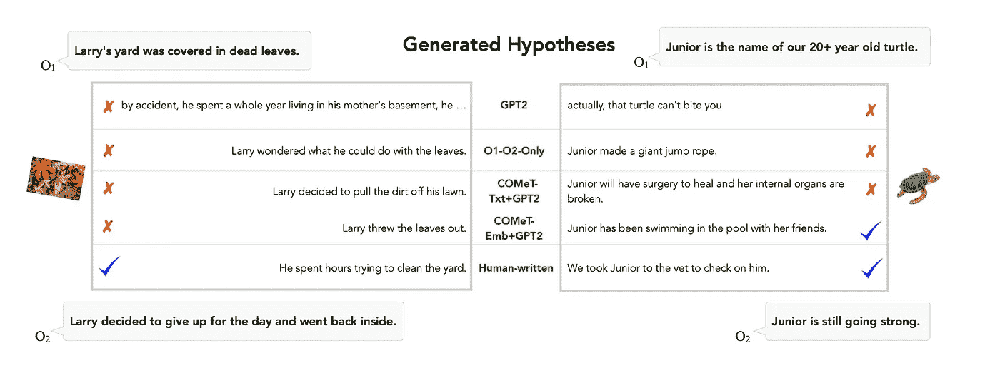

# 关于机器为何能够思考

> 原文：[`towardsdatascience.com/on-why-machines-can-think-40edafce293d?source=collection_archive---------2-----------------------#2023-12-06`](https://towardsdatascience.com/on-why-machines-can-think-40edafce293d?source=collection_archive---------2-----------------------#2023-12-06)

## 我们如何以最简单的方式思考**思维**呢？

 [Niya Stoimenova](https://medium.com/@niya.stoimenova?source=post_page-----40edafce293d--------------------------------)

·

[关注](https://medium.com/m/signin?actionUrl=https%3A%2F%2Fmedium.com%2F_%2Fsubscribe%2Fuser%2Fbacf8cf8265e&operation=register&redirect=https%3A%2F%2Ftowardsdatascience.com%2Fon-why-machines-can-think-40edafce293d&user=Niya+Stoimenova&userId=bacf8cf8265e&source=post_page-bacf8cf8265e----40edafce293d---------------------post_header-----------) 发表在 [Towards Data Science](https://towardsdatascience.com/?source=post_page-----40edafce293d--------------------------------) ·15 分钟阅读·2023 年 12 月 6 日

--

打开潘多拉的盒子（图片来源：作者）

在 17 世纪，[勒内·笛卡尔](https://en.wikipedia.org/wiki/Ren%C3%A9_Descartes)提出了一个相对较新的思想——“**我思故我在**”。这一简单的表述成为了西方哲学的基础，并定义了几个世纪以来我们对人类本质的理解。

从那时起，我们对作为人类的意义的理解发生了变化。然而，实际上，许多人仍然认为思考的能力是人性的最重要标志之一。

因此，ChatGPT（及类似模型）发布的瞬间，我们开始被大量讨论“它是否能够思考”的文章轰炸。

例如，《纽约客》思考了“[ChatGPT 有怎样的思维？](https://www.newyorker.com/science/annals-of-artificial-intelligence/what-kind-of-mind-does-chatgpt-have)”；《华盛顿邮报》宣称“[ChatGPT 可以通过逻辑测试，但别指望它具有创造力](https://www.washingtonpost.com/technology/2023/03/18/gpt4-review/)”；《大西洋月刊》则得出结论称[“ChatGPT 比你想象的更笨”](https://www.theatlantic.com/technology/archive/2022/12/chatgpt-openai-artificial-intelligence-writing-ethics/672386/)。我个人最喜欢的是这个[喜剧演员的视频](https://www.tiktok.com/@dragoscomedy/video/7229402346680339717)，他试图向一位从事人力资源工作的人解释 ChatGPT 是什么。

与任何其他容易引发猜测的复杂话题一样，人们对于 AI 模型的思维能力既过分夸大又不足代表。因此，让我们深入探讨一下。

# 思考就是推理

思维是一个复杂的构造，已经代表了许多不同的事物。因此，为了简单起见，我们可以假设思维或多或少与推理同义。

**推理**是一个定义得更清晰的概念，巧合的是，它正被[越来越多地用作**AI 的未来**](https://www.deeplearning.ai/the-batch/yoshua-bengio-wants-neural-nets-that-reason/?utm_campaign=The+Batch&utm_source=hs_email&utm_medium=email&_hsenc=p2ANqtz-865CMxeXG2eIMWb7rFgGbKVMVqV6u6UWP8TInA4WfSYvPjc6yOsNPeTNfS_m_et5Atfjyw)。它也是笛卡尔（在很大程度上）谈论思维时的意思。

> 所以，不如问“AI 能思考吗？”，不如问“AI 能推理吗？”。

简短的回答是**是的**。长答案是——它可以推理，但仅限于某些方式。

推理不是一个单一的概念。根据她试图完成的任务类型，有多种推理方式。因此，在这篇文章中，我们将首先简要介绍三种关键的推理类型，并检查机器的表现。然后，我们将探讨为什么机器无法进行常识推理以及在它们能做到之前需要回答什么问题。

# 推理入门

通常，当我们“思考”时，会使用三种主要的推理类型：**演绎**、**归纳**和**溯因**。

## 演绎

简而言之，演绎是从给定的规则和被假定为真的案例中得出结论的能力。

想象一下：你在锅里加水，打开炉子，然后放入一个温度计。由于你在学校学到的东西，你知道水（通常）在 100°C 时沸腾。因此，当有人告诉你温度已达到 100°C 时，你可以安全地推断出水正在沸腾（你不必亲眼看到它发生也能“相当确定”它确实发生了）。

这里有一个有用的结构需要记住。

> ***1.* 规则：** 水在达到 100°C 时沸腾
> 
> ***2.* 案例：** 水的温度是 100°C
> 
> ***3.* 结果：** 锅里的水在煮沸

因此，你从**规则**和**案例**推理到**结果**。

推理：从规则和案例推理到结果（图片由作者提供）

推理对我们进行科学研究至关重要。它也是机器最容易重现的推理类型。

按设计，几乎每台机器都执行某种形式的推理。你的简单的、毫不起眼的计算器每次你问 3+5 是多少时都会推导出答案。而它其中没有任何人工智能。

如果我们把它放在和上述水的例子相同的结构中，我们得到：

> **规则：** 计算器已经“提供”了规则**1+1 = 2**
> 
> **案例：** 你问了问题**3+5 = ?**
> 
> **结果：** 根据规则，它可以计算/推导出**3+5 = 8**

简单。

## 归纳

归纳是从给定的观察集合中概括规则的能力。它对我们进行科学研究至关重要，因为它使我们能够*定量*地识别新的模式/规则。

让我们坚持水的沸腾例子。假设你从未被告知水在 100°C 沸腾。因此，每次你将一锅水加热到沸腾时，你都放入一个温度计并测量温度——100 次，1,000 次，10,000 次。然后，你的朋友们也做同样的事——无论你做多少次，温度总是 100°C。因此，你可以**归纳**出规则：“*水在 100°C 沸腾*”。

> 1\. **结果：** 水在沸腾
> 
> 2\. **案例：** 每当你放入温度计时，它总是显示 100°C。
> 
> 3\. **规则：** 水在 100°C 沸腾。

归纳：从结果和案例推理到规则（图片由作者提供）

然后，你就根据你观察到的模式定量地识别出了一个新的规则。为此，你从**结果**和**案例**推理到**规则**。

这种推理类型当然并不总是正确的。著名的是，欧洲人曾认为所有天鹅都是白色的，直到他们航行到了澳大利亚。我们也知道水的沸点并不总是 100°C（大气压力也起作用）。

仅仅因为某件事发生了 10,000 次并不意味着它总是正确的。但 10,000 次通常是一个安全的选择。

归纳对机器来说要困难得多。你的计算器当然无法执行归纳。然而，机器学习模型可以。实际上，这正是它们的主要目标：从一组给定的结果中进行概括。

让我们举一个简单的例子。假设我们有一个监督分类模型，将用于垃圾邮件检测。首先，我们有标记的训练数据集——*垃圾邮件*或*非垃圾邮件*（即**结果**）。在这个数据集中，我们为每个结果编制了多个**案例**。基于这些案例，模型会归纳出自己的**规则**，这些规则可以在以后应用于一个它从未见过的案例。

> 1. **结果：** 垃圾邮件或非垃圾邮件
> 
> 2\. **案例：** 大样本，包括垃圾邮件和非垃圾邮件示例
> 
> 3. **规则**: 包含“这些模式和词语”的邮件很可能是垃圾邮件（在一定的概率范围内）

同样，当处理无监督模型如推荐系统时，过程也类似。我们首先向模型提供一个数据集，关于人们在超市购物时的倾向（**结果**）。一旦开始模型训练，我们会期望它首先聚类重复的模式（**案例**），然后引导出自己的**规则**，这些规则可以在*类似*的背景中应用。

> 1. **结果**: 关于人们购买的未标记数据
> 
> 2. **案例**: 模型在数据集中发现的类似购买（例如，每个人买鸡蛋的人也会买培根）。
> 
> 3. **规则**: 买鸡蛋的人也会买培根（在一定的概率范围内）

在这两种情况下，这些规则不一定对人类是可理解的。也就是说，我们知道计算机视觉模型“*关注*”图像的某个部分，但我们很少知道**为什么**。实际上，模型越复杂，我们了解其使用规则的机会就越小。

所以，这里我们可以看到——机器可以同时执行归纳和演绎推理。

## 演绎推理和归纳推理——科学的基石

广泛认为，*归纳*和*演绎*的结合是我们推理能力的驱动力。正如我们的例子所示，当代的机器学习模型，即使是简单的模型，也能执行这两种操作。

它们首先利用归纳推理从给定的数据集中生成规则。然后，它们将这些规则应用于新的**案例**。例如，一旦我们向模型提供*一张以前未见过的照片*，它会利用其**规则**来推断出具体的**结果**（例如，*它可以告诉我们提供的照片是倒置的*）。

> 尽管如此，大多数数据科学家会同意，即使是最先进的机器学习模型也无法进行推理。为什么？

水煮沸的例子可以简单地说明为什么仅依靠演绎推理和归纳推理并不足够。确实，我们需要它们来生成**规则**（*“水在 100°C 时沸腾”*），然后在各种案例中进行验证。然而，这种结合不足以解释我们是如何猜测到*煮沸*的**结果**与*温度*有关的。

除此之外，归纳和演绎推理的额外局限性也变得显而易见——它们在特定的上下文中有所限制，缺乏在不同领域之间转移知识的能力。这正是**演绎推理**发挥作用的地方，它提供了一个更全面的视角，展示了使我们能够进行直觉跃迁并将洞察力连接到不同领域的认知过程。

## 演绎推理

演绎推理是从单一惊讶的观察（即**结果**）中生成新假设的能力。我们每次依赖经验来解释某些事物时，都会这样做。

我们出去看到一条湿街。我们用之前可能下过雨的猜测来解释。我们不需要看到 1 万条湿街就知道下雨时街道会变湿。从技术上讲，我们甚至不需要以前遇到过湿街——我们只需知道当水接触物体时，会使物体变湿。

这意味着，如果我们回到水煮沸的例子，我们将有不同的推理方式：

> 1\. **结果**：水在煮沸
> 
> 2\. **规则**：水在 100°C 时煮沸
> 
> 3\. **案例**：水的温度必须是 100°C

溯因推理：从规则和结果推断到一个案例（作者插图）

我们从**结果**开始（就像我们进行归纳推理时一样），但我们将其与我们已知的**规则**结合（基于我们的世界知识和经验）。这两者的结合使我们能够得出一个**案例**（即，*水因温度变化而煮沸*）。

溯因推理是所有推理类型中最不可靠的。通过溯因推理得出的假设很可能是不正确的。例如，“湿街”的结果可能与雨无关——也许某个地方的管道在夜间破裂，或者有人认真地用水喷洒了街道。然而，雨似乎是一个合理的解释。

因此，溯因推理允许我们在日常情况中顺利前行，而不会陷入困境。也就是说，我们不需要尝试 1 万次来做出简单的决策。

据我了解，目前没有任何 AI 模型/算法能够进行**溯因推理**。不是以我刚刚描述的方式。

那些对 1960 年代和 1970 年代基于规则的系统熟悉的人，当然可以提到[MYCIN](https://en.wikipedia.org/wiki/Mycin)、[XCON](https://en.wikipedia.org/wiki/Xcon)和[SHRDLU](https://en.wikipedia.org/wiki/SHRDLU)，并声称它们能够进行溯因推理。其他人可能会提到斯坦福 AI 指数在[2022](https://aiindex.stanford.edu/wp-content/uploads/2022/03/2022-AI-Index-Report_Master.pdf)和[2023](https://aiindex.stanford.edu/wp-content/uploads/2023/04/HAI_AI-Index-Report_2023.pdf)中引用的溯因推理例子，认为这是未来研究中最有前景的领域之一（即，*溯因自然语言推理*）。

所以，如果机器在 1970 年代能够进行“溯因推理”，为什么它们仍然不能做我所称的溯因推理（即常识推理）？

# 为什么溯因推理仍然难以捉摸

即使是最先进的模型也无法进行溯因推理的原因有两个：**混淆**和**架构**。

## 混淆：溯因推理与最佳解释推理（IBE）不同

历史上，在计算机科学领域，许多人将 IBE 和推断这两个术语互换使用。即使是 ChatGPT 也会告诉你这两者是相同的，或者推断是 IBE 的一个子集（取决于你如何提问）。[斯坦福哲学百科全书](https://plato.stanford.edu/index.html)也反映了这种观点。实际上，你在计算机科学的相关领域阅读的几乎每一篇关于推断的论文，都告诉你它与 IBE 相同。

然而，这两者是*非常* *不同* 的构建。

一般来说，**推断**涵盖了生成新案例的行为（*将学习转移到不同的背景中*）。另一方面，IBE 是一种非常特殊且更具背景特定性的归纳形式，它不一定要求你定量地识别模式（即，你不需要观察一个模式 10,000 次来制定规则）。这些之间的具体区别是一个相当复杂的哲学讨论。如果你想深入了解这一点，我推荐[这篇论文](https://www.jstor.org/stable/10.2979/trancharpeirsoc.51.3.300)。

然而，就本文而言，帮助我们的是将其放在**规则**、**案例**和**结果**结构中进行思考，并使用像 MYCIN 和斯坦福 AI 指数引用的推断自然语言模型这样的具体例子。

MYCIN 是 20 世纪 70 年代在斯坦福开发的早期专家系统，旨在帮助医生诊断传染病。它依赖于一个知识库，其中每个**规则**都以条件（IF——即**案例**）和结论（THEN——即**结果**）的形式表达。然后它利用了[*逆向推理*](https://en.wikipedia.org/wiki/Backward_chaining)机制，使其能够从一组症状和病人数据（分别是**结果**和**案例**）中，向后推理以识别和分配*从 0 到 1 的启发式确定性评分*给那些可能最好地解释情况的**规则**。即，它从结果和案例推理到规则（即，归纳推理遵循的模式）。

斯坦福 AI 指数引用的作为*推断自然语言推理*的[例子](https://arxiv.org/abs/1908.05739)（无论是生成假设还是选择最合理的假设）有点棘手。但这仍然不是推断。事实上，我会说，它类似于 IBE，但它遵循与我们迄今讨论的其他机器学习模型相同的模式——归纳，接着是演绎。

背景：在 2020 年，Bhagavatula 及其同事*，对一个他们称之为 ART 的数据集（包含约 20K 由观察对（O1, O2）定义的叙事背景和 200K 解释性假设）训练了一个变换器模型。训练后，他们给模型提供了一组观察数据，并要求它生成一个合理的假设以匹配（见图 4）。

图 4：推测自然语言推理（该图取自 [arXiv:1908.05739](https://arxiv.org/abs/1908.05739)）

如图所示，当一个变压器模型（GPT-2+COMeT 嵌入）面对 O1（例如，*“Junior 是一只 20****+*** *岁的老海龟*”）和 O2（例如，*“Junior 仍然很强壮”*）时，它可以生成一个合理的假设（例如，*“Junior 一直在池塘里和她的朋友们一起游泳”*），这可能解释了为什么我们认为 Junior 仍然很强壮。

> 为什么这是 IBE 而不是推测？

让我们暂时从基础的 ML 模型中抽象出来，考虑一下人类如何执行这样的推理任务。首先，我们得到一个**结果**：*Junior 仍然很强壮*，并且我们被告知**案例**是什么（即，*Junior 是一只相对年长的海龟*）。然后，从这些中，我们会尝试找出一个潜在的（上下文相关的）**规则**，以解释这个案例和结果。例如，我们可以推导出*一只年老却仍然强壮的海龟*

1.  趋向于和朋友们玩耍 或

1.  有良好的食欲 或

1.  具有良好的生命体征

依此类推。

然后我们可以选择最符合我们判断的规则，并将其应用于“一个老海龟”的情况。这将允许我们假设 Junior *可能一直在和她的朋友们一起游泳*。

如前所述，从有限的观察中识别潜在规则表明了 IBE，而从这些规则中得出的结论则倾向于是一种较弱的推演形式。

我们*作为人类*理解到，当一个生物变老（无论是海龟还是人类）时，它们的活力往往会下降（可以说是）。这使我们能够生成相对“充满意义”的规则。然而，变压器模型无法做到这一点。它能做的，是通过归纳和推演来改善对最可能的单词组合的预测。模型没有基本理解，当 Junior 玩得开心时，她仍然很强壮。

实际上，有人甚至可以说*推测自然语言推理*的工作类似于 [链式思维](https://arxiv.org/abs/2201.11903) 提示。尽管如此，指令是以不同的方式呈现给变压器的。

希望所有这些例子突显出计算机科学所称的推测其实并不是推测。相反，它似乎是一种特定上下文的归纳变体。

## 架构：当代 ML 模型受限于归纳

状态最先进模型无法进行推测的第二个原因在于它们的架构。根据定义，机器学习模型是一个生成归纳的机器。这种倾向被它们所谓的**归纳偏差**进一步加强。

> 归纳偏差是机器学习中的一个重要概念，指的是模型对其应学习的函数类型所持有的固有假设或偏好。偏差通过限制可能的假设集来指导学习过程，从而提高学习的效率和准确性。

例如，*决策树*关注于层级结构和简单的决策边界。*支持向量机*旨在找到类别之间的宽边距。*卷积神经网络*强调图像中的平移不变性和层级特征学习。*递归神经网络*偏向于序列模式，*贝叶斯网络*建模概率关系，*正则化线性模型*通过惩罚大系数来偏好简单模型，而通用的*变换器*如 GPT-4 则以捕捉数据中的序列依赖性和关系为特征。这些偏差塑造了模型的行为及其对不同任务的适用性。它们还使得将学习成果从一个情境转移到另一个情境变得困难。

# 我们仍需的

好的，到目前为止，我们讨论了推理的基础知识，我们看到机器确实可以进行推理。它们能够执行演绎推理和归纳推理。然而，我们直观上所称为“思考”的过程是由归纳推理促进的，由于混淆和架构问题，它依然难以捉摸。

那么，我们还需要什么？

> 我们如何构建能够执行归纳推理的系统？

首先，我们需要能够准确地定义什么是归纳推理，并描述它是如何工作的。遗憾的是，这方面的研究不多。尤其是当涉及到归纳推理如何与演绎推理和归纳推理相关联时，或者它如何被机器操作化时。学者们唯一一致的观点是，归纳推理发生在演绎推理和归纳推理之前。

## **那么，什么是归纳推理？**

归纳推理并不是一个单一的构造。我个人遇到过大约 10 种不同类型，具体取决于它们所涉及的科学领域。即使是引入*归纳推理*概念的哲学家查尔斯·皮尔斯，也并没有以一致的方式提及它。

然而，有三种主要类型可以描述归纳推理所服务的基本功能。确切的功能及其形成过程过于复杂，无法在此文中详细讨论。所以，以下是简要说明。

首先，我们有最直接的归纳推理类型——*解释性*。就是我们迄今为止讨论的那种。使用它时，我们从一个观察（**结果**）和一个易于识别的**规则**开始。然后，这两者的组合使我们能够对**情况**做出猜测。这在水煮沸的例子中得到了很好的说明。

然后，我们有了*创新性推断*——一种允许我们从一个（期望的）**结果**推理到一对**案例**和**规则**的推断。也就是说，我们只知道我们想要创造什么结果，然后我们需要逐步定义一个**案例-规则**配对，这样才能实现所述结果。这种类型的推断通常用于生成新颖的想法。

最后，我认为我们有了最有趣的一种推断——*操控性推断*。我们在唯一知道**结果**（期望的或其他）部分的情况下使用它。此外，这个结果“存在”的背景由多个隐藏的相互依赖关系定义。因此，不能立刻开始寻找/生成合适的**案例-规则**配对。相反，我们需要更好地理解结果以及它与环境的关系，以便减少不确定性。

这就是所谓的*思维装置/认识中介*发挥作用的地方。这可以采取例如基本草图、原型或 3D 模型的形式，用于增强我们对问题的理解。通过在目标环境中操控这个*中介*，我们能更深入地理解背景。因此，我们能够更好地探索**规则**和**案例**的潜在组合。此外，它还使我们能够建立关联，帮助将知识从一个领域转移到另一个领域。这种思维的简化版本通常在立体几何中应用。

正如我所说，仍需要做大量工作来解释这些推断类型之间的关系及其与其他推理方法的相关性。然而，这项工作变得越来越关键，因为它有可能为不同领域之间的洞察力转移提供宝贵的见解。特别是在我们看到该领域对推理的新兴趣的背景下——无论是通过 IBE、“通过模拟和例子进行推理”，还是系统 1 和系统 2 思维。

在所有这些情况中，理解如何区分机器可以进行的不同类型的推理似乎尤为重要。因为，确实，机器是可以进行推理的。它们只是无法进行全方位的推理。

*关于 IBE 的其他有趣工作可以在[这篇论文中找到（他们确实将推断等同于 IBE）。](https://arxiv.org/abs/2305.14618)*
