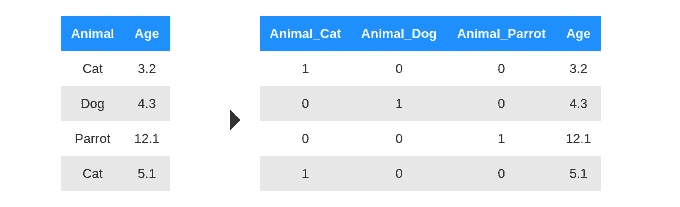
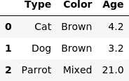
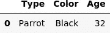
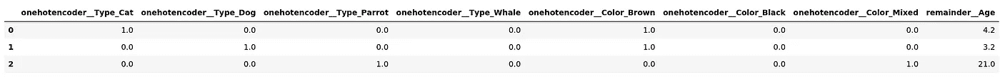
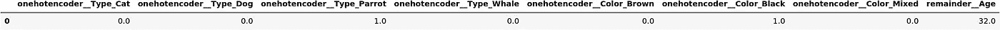
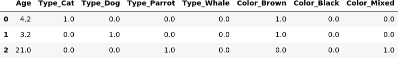
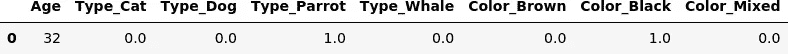
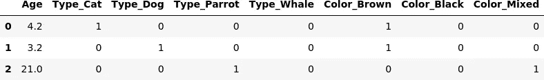
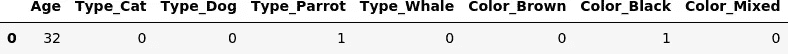
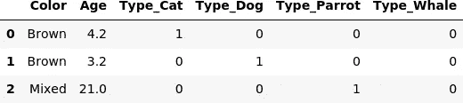

# One Hot 编码

> 原文：[`towardsdatascience.com/one-hot-encoding-scikit-vs-pandas-2133775567b8?source=collection_archive---------2-----------------------#2023-03-13`](https://towardsdatascience.com/one-hot-encoding-scikit-vs-pandas-2133775567b8?source=collection_archive---------2-----------------------#2023-03-13)

## Scikit Learn 还是 Pandas？

 [安德拉斯·盖费斯](https://medium.com/@andras.gefferth?source=post_page-----2133775567b8--------------------------------)

·

[关注](https://medium.com/m/signin?actionUrl=https%3A%2F%2Fmedium.com%2F_%2Fsubscribe%2Fuser%2Fa9dc9dafd198&operation=register&redirect=https%3A%2F%2Ftowardsdatascience.com%2Fone-hot-encoding-scikit-vs-pandas-2133775567b8&user=Andras+Gefferth&userId=a9dc9dafd198&source=post_page-a9dc9dafd198----2133775567b8---------------------post_header-----------) 发布于 [数据科学趋势](https://towardsdatascience.com/?source=post_page-----2133775567b8--------------------------------) ·8 分钟阅读·2023 年 3 月 13 日

--

One hot 编码是一种流行的表示分类数据的方法（所有图片均由作者提供）

# 摘要

[sklearn.preprocessing.OneHotEncoder](https://scikit-learn.org/stable/modules/generated/sklearn.preprocessing.OneHotEncoder.html)和[pandas.get_dummies](https://pandas.pydata.org/docs/reference/api/pandas.get_dummies.html)都是流行的选择（实际上是唯一的选择，除非你想自己实现）来执行**独热编码**。大多数科学家推荐使用`scikit`，因为它使用其 fit/transform 范式，提供了一种内置机制来学习训练集中的所有可能类别，并将其应用于验证或实际输入数据。因此，这种方法将防止在验证或实际输入数据中不包含所有类别或类别顺序不同引发的错误。

在本文中，我将争论，这场竞争没有明确的赢家。对于使用`pandas` DataFrame 的数据科学家来说，使用原生的`pandas get_dummies`函数有明显的好处，而且有一种非常简单的方法可以避免上述提到的问题。

# 介绍

## 什么是**独热编码**？

如果你已经知道这些内容，可以安全地跳过这一部分。

**独热编码**（以下简称**OHE**）是一种将分类数据编码为数值数据的技术。它主要用于机器学习应用。例如，假设你正在构建一个预测动物体重的模型。你的一个输入将是动物的类型，即猫/狗/鹦鹉。这是一个字符串值，因此像线性回归这样的模型无法处理它。

第一个想到的方法是给动物赋予整数标签，并用相应的整数表示替换每个字符串。但是，如果这样做，你会引入一些人为的排序（例如，鹦鹉对“动物”权重的影响是猫的三倍）。相反，OHE 为每种动物创建一个新的输入变量（即列），并根据动物是否是选定的那个，将该变量设置为 1 或 0。示例：

**独热编码**（所有图片由作者提供）

在这种分离之后，你的线性模型可以独立地为这些新列分配权重。实际上，你并不需要 3 列来表示这 3 种动物。你可以选择其中任何一列来丢弃。换句话说，如果它既不是狗也不是猫，那它就只能是鹦鹉。

# **Scikit**与**Pandas**

`scikit-learn`和`pandas`都提供了执行此操作的方法，数据科学家之间关于使用哪个方法的争论已经有很长的历史。如果你搜索一下，会找到很多相关文章。我重新讨论这个话题的原因是这两个库都在不断发展，有一些新的功能在决策时值得考虑。

## 文章范围

在编码时，可以指定几个选项，比如是否使用稀疏或密集的数据表示，或者是否保留所有新列或删除其中之一。这两个库都支持许多这样的功能，但在这篇文章中我不会关注它们。本文的重点是类别的处理，如下所述：

如果你进行训练/测试拆分（无论是手动还是使用`sklearn.model_selection.train_test_split`自动化），可能会出现训练数据集中不包含任何鹦鹉的情况。从理论上讲，这不一定是一个问题，如果某些类别缺失，你仍然可以进行预测，只是预测可能不够准确。但如果你的代码没有为这种差异做好准备，那么由于拟合数据中的列与用于预测的数据的列不一致，你的代码会出错。

在这篇文章中，我将关注以下几点：

+   如何告诉 OHE 所有类别的集合，并确保编码一致地应用于训练/测试/验证/实际数据？

+   如何将编码应用于 pandas DataFrame？

+   如何在 scikit 管道中集成编码器？

## Scikit-learn

通常的做法是使用`sklearn.preprocessing.OneHotEncoder`，因为通过其 fit/transform 范式，你可以使用训练数据集来“教会”类别，并将其应用于你的实际输入数据。

主要步骤如下：

其中 X_train 是你的训练输入数据，real_input 是你希望应用模型的真实输入数据（真是个惊喜！）。

如果你“幸运”，那么所有可能的类别都会出现在 X_train 中，编码器对象学习这些类别及其对应的映射，并会为真实输入生成正确的列和正确的列顺序。我们需要注意的是，`sklearn.preprocessing.OneHotEncoder`产生的是一个 numpy 数组，所以列的顺序很重要。

但你不应该假设自己总是会幸运。例如，如果你使用交叉验证来随机重复地将数据拆分为训练和测试部分，你可能会发现实际的训练数据缺少一些类别。这会导致错误，因为你无法转换测试集中的数据。

sklearn 为这种情况提供的解决方案是明确地向 OneHotEncoder 对象提供可能的类别，如下所示：

你需要在类别参数中提供一个列表的列表，以便为每个输入列指定类别。

使用 scikit 的另一个常见步骤是进行原始 numpy 数组和 pandas DataFrame 之间的转换。你可以使用`sklearn.compose.make_column_transformer`来实现，或者手动实现，使用 OneHotEncoder 的`.get_feature_names_out()`方法来获取新特征的列名。让我们来看一下这两种方法的示例。我将添加另一列，Color，以使示例更加信息丰富。

# 指定输入和编码器

# 列转换器方法

我们可以看到列转换器完成了部分工作，但如果我们想使用 DataFrames，还需要做额外的工作。我也不太喜欢这些列名，但除了手动后处理，没有其他方法可以调整它们。注意，列是为所有可能的类别创建的，而不仅仅是那些出现在输入中的类别。

# 手动方法

我称之为手动方法，因为我们直接使用 OneHotEncoder 对象，并自己处理选择和追加列的操作。

我们不得不做一点额外的手动工作，但列名更友好。此外，在较新的 scikit 版本（1.3 及以上）中，我们可以微调这些名称。

## 管道

一个 [scikit 管道](https://scikit-learn.org/stable/modules/generated/sklearn.pipeline.Pipeline.html) 是一种方便的方式来顺序应用一系列转换。你可以使用它来组装几个步骤，这些步骤可以一起进行交叉验证，同时设置不同的参数。

手动/原始方法通常不适合包含在管道中，因为需要额外的步骤来选择和添加列。而列转换器方法则适用于管道。我们所做的额外步骤仅仅是将 numpy 数组转换为 DataFrame，这对管道来说不是必需的。

# Pandas

pandas.get_dummies 函数不遵循 fit/transform 模型，也没有明确的输入参数来指定可用的类别。因此，可以得出结论，它不适合这个任务。然而，这个结论并不正确。

Pandas 本身支持通过 [pandas.CategoricalDtype](https://pandas.pydata.org/docs/reference/api/pandas.CategoricalDtype.html) 处理分类数据。你需要做好功课，并正确设置列的类别。一旦一致完成这些操作，你就不再需要拟合步骤了。

使用分类类型有额外的好处，例如减少存储空间或检查拼写错误。让我们看看这是如何做到的：

现在我们需要做的就是调用 get_dummies 函数。

正如我们所看到的，在类别正确设置之后，不需要额外的工作就可以获得一个漂亮的 DataFrame。实际上，我在上面有点作弊：默认情况下，get_dummies 会转换所有具有对象、字符串或类别数据类型的列。如果这不是我们想要的，我们可以通过使用 get_dummies 的 columns 参数显式指定要转换的列列表：

我们在上面提到了 scikit 管道。为了使变换器适用于管道，它必须实现 fit 和 transform 方法，而 get_dummies 函数显然没有做到这一点。幸运的是，为此任务创建一个自定义变换器非常简单：

现在我们可以像使用其他 scikit 变换器一样使用我们新的类，我们甚至可以将其嵌入到管道中。

在编写这个变换器时，我们假设相关列已经具有分类数据类型。但是，只需添加几行代码到 GetDummiesTransformer 中即可在 __init__ 函数中允许指定列。

# 结论

正如我们所见，明确指定 scikit OneHotEncoder 和 pandas get_dummies 方法的可用类别是可能的，也非常推荐。（记住：明确优于隐含！）这意味着**这两种方法都非常适合这个任务**，所以选择哪个方法是个人偏好。对于 scikit，明确的类别设置是通过将参数传递给 OneHotEncoder 类的构造函数实现的，而对于 pandas，我们必须设置分类数据类型。

+   使用**“原始”版本的 OneHotEncoder**（即没有列变换器）需要最多的手动调整，我在实际中仅在非常少见的情况下会使用这种方法。

+   如果你的过程依赖于 scikit 管道（这有许多优点），那么使用 scikit **OneHotEncoder 和列变换器似乎**是最自然的选择。

+   如果你喜欢逐步处理数据，从一个 DataFrame 到另一个 DataFrame（这在探索阶段可能是一个不错的选择），那么我一定会选择**pandas.get_dummies**方法。

就这样，希望你从我的帖子中学到了东西。像往常一样：点赞、订阅、分享、评论！
