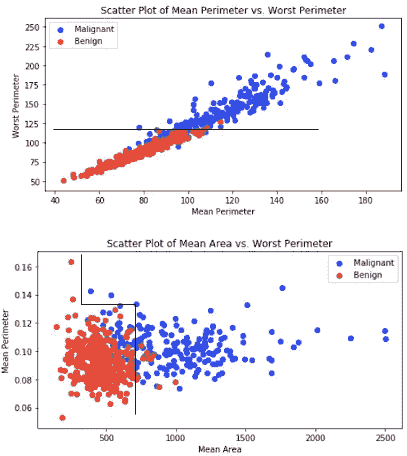
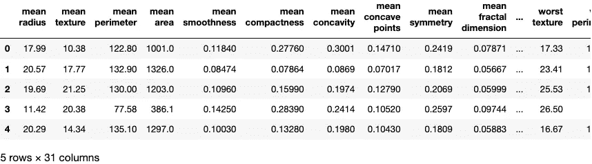
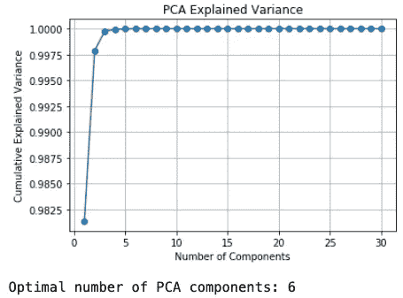
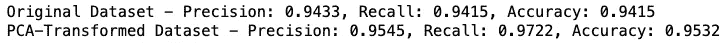
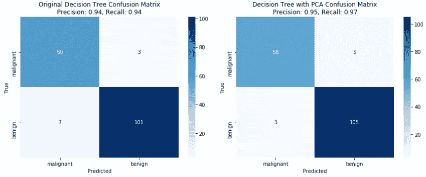
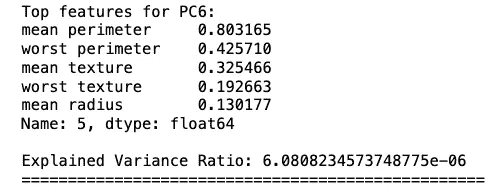

# 一步使决策树产生更好的结果

> 原文：[`towardsdatascience.com/one-step-to-make-decision-trees-produce-better-results-b0ccd6738200?source=collection_archive---------10-----------------------#2023-11-23`](https://towardsdatascience.com/one-step-to-make-decision-trees-produce-better-results-b0ccd6738200?source=collection_archive---------10-----------------------#2023-11-23)

## 背景、实施和模型改进

[](https://gabeverzino.medium.com/?source=post_page-----b0ccd6738200--------------------------------)[](https://towardsdatascience.com/?source=post_page-----b0ccd6738200--------------------------------) [Gabe Verzino](https://gabeverzino.medium.com/?source=post_page-----b0ccd6738200--------------------------------)

·

[关注](https://medium.com/m/signin?actionUrl=https%3A%2F%2Fmedium.com%2F_%2Fsubscribe%2Fuser%2Fb4abbbfdcbbb&operation=register&redirect=https%3A%2F%2Ftowardsdatascience.com%2Fone-step-to-make-decision-trees-produce-better-results-b0ccd6738200&user=Gabe+Verzino&userId=b4abbbfdcbbb&source=post_page-b4abbbfdcbbb----b0ccd6738200---------------------post_header-----------) 发表在 [Towards Data Science](https://towardsdatascience.com/?source=post_page-----b0ccd6738200--------------------------------) ·7 分钟阅读·2023 年 11 月 23 日[](https://medium.com/m/signin?actionUrl=https%3A%2F%2Fmedium.com%2F_%2Fvote%2Ftowards-data-science%2Fb0ccd6738200&operation=register&redirect=https%3A%2F%2Ftowardsdatascience.com%2Fone-step-to-make-decision-trees-produce-better-results-b0ccd6738200&user=Gabe+Verzino&userId=b4abbbfdcbbb&source=-----b0ccd6738200---------------------clap_footer-----------)

--

[](https://medium.com/m/signin?actionUrl=https%3A%2F%2Fmedium.com%2F_%2Fbookmark%2Fp%2Fb0ccd6738200&operation=register&redirect=https%3A%2F%2Ftowardsdatascience.com%2Fone-step-to-make-decision-trees-produce-better-results-b0ccd6738200&source=-----b0ccd6738200---------------------bookmark_footer-----------)

在树木中（作者提供的照片）

决策树（DT）被放弃得太快了。

就像这样发生的：

DT 已训练。自然过拟合出现。超参数调整（令人不满意）。最后，树被替换为随机森林。

尽管这可能是性能上的快速胜利，但这种替代更注重“黑匣子”算法。这并不理想。只有决策树能产生直观的结果，为业务领导提供比较权衡的能力，并在流程改进中起到关键作用。

如果你无法理解甚至解释某件事情，那么它就不会进入生产环节。在那些即使小的失败也会带来极端风险的行业中，这一点尤为真实，比如医疗保健领域。

*(旁注：人们经常问“随机森林生成特征重要性，这难道不解释了哪些特征是重要的吗？”并不完全如此。特征重要性几乎立即被解释为* ***因果*** *驱动因素（例如，具有与目标的依赖性的特征），但它们只是* ***模型*** *驱动因素。虽然在这方面对技术人员有所帮助，但特征重要性通常是：（1）在弱模型中无用（2）在具有高基数的特征中膨胀，以及（3）偏向于相关特征。这是另一条完全不同的探索路径，但基本上就是这样。)*

## 决策树如何做出决策

坚持使用决策树将保留您有效沟通结果的能力，但如何使它们性能卓越呢？超参数调整只能帮助到一定程度。无论如何，都应该进行深思熟虑的特征工程。

事实证明，特征数据的特定结构可能使其更好地适应底层的决策树算法，从而使决策树能够做出更好的决策。

在底层，决策树通过在您提供的所有数据中创建正交决策边界（垂直分割）来分离类别。它以一种贪婪的算法方式进行这一操作 —— 首先选择最佳分割的特征，然后转向其他特征中不那么优化的分割。

我们可以直观地检查我们的特征以寻找正交的决策边界。让我们查看以下公开可用的乳腺癌数据集中的特征。在下面的顶部图中，绘制“最差周长”和“平均周长”可以产生良好的正交决策边界，可以很好地分离恶性和良性类别。因此，这些特征将是 DT 模型中的很好的选择。



作者提供的图片

上图显示的底部显示了“平均面积”和“平均周长”，DT 生成了正交决策边界（因其固有性质），但这些是不必要复杂的。也许，对角线分隔在这里会更好，但这不是 DT 分类器的分割方式。此外，DT 对训练数据中甚至是小变化（如异常值）非常敏感，这些变化已知会产生完全不同的树结构。

为了适应决策树的这种独特和基础机制 —— 并最终改善性能和泛化能力 —— 可以应用主成分分析（PCA）。

PCA 在两个重要方面提升了 DT 的性能：

(1) 将关键特征定向在一起（解释最大方差的特征）

(2) 减少特征空间

实际上，PCA + DT 过程自然地展现了上述顶部图中您看到的“最差周长”和“平均周长”特征。这两个是最具*预测性*的变量，毫不奇怪地具有出色的正交决策边界。

## 实施过程

请记住，PCA 适用于连续数据。乳腺癌数据集完全由连续变量组成。*(另一方面的注释：我看到 PCA 被用于分类变量，不建议这样做。名义级别没有隐含的距离，序数级别并不总是等距离的，强制在离散特征上进行距离表示通常将变量重构为毫无意义的东西。另一个时间的另一个切入点。)*

让我们开始下载所需的软件包，并将我们的乳腺癌数据集转换为特征**X**和目标变量**y**。

```py
import numpy as np
from sklearn.tree import DecisionTreeClassifier
from sklearn.decomposition import PCA
from sklearn.datasets import load_breast_cancer
from sklearn.model_selection import train_test_split
from sklearn.metrics import accuracy_score, confusion_matrix, precision_score, recall_score
import matplotlib.pyplot as plt
import seaborn as sns

# Load the Breast Cancer dataset
data = load_breast_cancer()
X = data.data
y = data.target
```

可以调用此数据集的数据框架头部进行检查。

```py
cancer = load_breast_cancer()
df = pd.DataFrame(np.c_[cancer['data'], cancer['target']],
                  columns= np.append(cancer['feature_names'], ['target']))
df.head()
```



作者的图片

首先，在没有 PCA 的情况下训练 DecisionTreeClassifier，并收集这些预测（original_predictions）。

```py
# Split the data into training and testing sets
X_train, X_test, y_train, y_test = train_test_split(X, y, test_size=0.3, random_state=42)

# Fit a Decision Tree Classifier on the non-PCA-transformed dataset
original_tree = DecisionTreeClassifier(random_state=42)
original_tree.fit(X_train, y_train)

# Predictions on the original dataset
original_predictions = original_tree.predict(X_test)
```

现在，应用 PCA 来选择能够解释训练集中大部分方差的最小维数。而不是任意选择这个维数，可以使用“拐点法”来确定能够解释 99%方差的维数（如下所示硬编码）。

```py
# Finding the optimal number of PCA components using the elbow method
pca = PCA()
pca.fit(X_train)

explained_variance = pca.explained_variance_ratio_
cumulative_explained_variance = np.cumsum(explained_variance)

# Plot explained variance
plt.plot(range(1, len(cumulative_explained_variance) + 1), cumulative_explained_variance, marker='o')
plt.xlabel('Number of Components')
plt.ylabel('Cumulative Explained Variance')
plt.title('PCA Explained Variance')
plt.grid()
plt.show()

# Determine the optimal number of components (elbow point)
optimal_num_components = np.where(cumulative_explained_variance >= 0.99999)[0][0] + 1

print(f"Optimal number of PCA components: {optimal_num_components}")
```

基于图表形成“拐点”的视觉观察，发现 6 个 PCA 成分解释了训练集方差的 99%。



作者的图片

现在在训练集上应用 PCA 来捕获 6 个主成分。您可以使用奇异值分解（SVD）进行此操作，这是一种标准的矩阵分解技术（此处不涉及的过程）。与以前一样，在 PCA 转换的训练集上训练 DecisionTreeClassifier，并收集这些预测（pca_predictions）。

```py
# Apply PCA with the optimal number of components
pca = PCA(n_components=optimal_num_components, svd_solver="full")
X_train_pca = pca.fit_transform(X_train)
X_test_pca = pca.transform(X_test)

# Fit a Decision Tree Classifier on the PCA-transformed dataset
pca_tree = DecisionTreeClassifier(random_state=42)
pca_tree.fit(X_train_pca, y_train)

# Predictions on the PCA-transformed dataset
pca_predictions = pca_tree.predict(X_test_pca)
```

```py
# Confusion matrix
pca_cm = confusion_matrix(y_test, pca_predictions)

# Precision and Recall scores for the original dataset
original_precision = precision_score(y_test, original_predictions, average=’weighted’)
original_recall = recall_score(y_test, original_predictions, average='weighted')
original_accuracy = accuracy_score(y_test, original_predictions)

# Precision and Recall scores
pca_precision = precision_score(y_test, pca_predictions)
pca_recall = recall_score(y_test, pca_predictions)
pca_accuracy = accuracy_score(y_test, pca_predictions)

# Output precision and recall scores
print(f"Original Dataset - Precision: {original_precision:.4f}, Recall: {original_recall:.4f}, Accuracy: {original_accuracy:.4f}")
print(f"PCA-Transformed Dataset - Precision: {pca_precision:.4f}, Recall: {pca_recall:.4f}, Accuracy: {pca_accuracy:.4f}")
```

现在我们可以比较我们的原始预测（未经 PCA 转换）和 pca 预测（经 PCA 转换），观察我们评估指标（准确率、精确度和召回率）的任何相对改进。

与原始的决策树训练数据相比，当我们首先对数据集进行 PCA 转换，然后进行决策树训练时，我们在各方面都有所改进：



我们可以绘制混淆矩阵，显示两个决策树在恶性和良性肿瘤分类改进方面的相对改进。

```py
# Plot the confusion matrices
plt.figure(figsize=(12, 5))

plt.subplot(1, 2, 1)
sns.heatmap(original_cm, annot=True, fmt="d", cmap="Blues", xticklabels=data.target_names, yticklabels=data.target_names)
plt.title("Original Decision Tree Confusion Matrix\nPrecision: {:.2f}, Recall: {:.2f}".format(original_precision, original_recall))
plt.xlabel("Predicted")
plt.ylabel("True")

plt.subplot(1, 2, 2)
sns.heatmap(pca_cm, annot=True, fmt="d", cmap="Blues", xticklabels=data.target_names, yticklabels=data.target_names)
plt.title("Decision Tree with PCA Confusion Matrix\nPrecision: {:.2f}, Recall: {:.2f}".format(pca_precision, pca_recall))
plt.xlabel("Predicted")
plt.ylabel("True")

plt.tight_layout()
plt.show()
```



作者的图片

最后，识别生成 6 个主成分所使用的我们原始特征是很有价值的。从技术上讲，PCA 生成新的特征，这些特征是原始特征的线性组合。这些新特征彼此正交，并按解释的方差排序。但是，调用*components_attribute*可以识别用于创建这些组件的特征。

```py
# Get the explained variance ratio of each principal component
explained_variance_ratio = pca.explained_variance_ratio_

# Get the PCA components
pca_components = pca.components_

# Create a DataFrame to display the contributions of original features to each principal component
df_components = pd.DataFrame(data=pca_components, columns=data.feature_names)

# Print the top features contributing to each principal component
for i in range(optimal_num_components):
    print(f"Top features for PC{i+1}:")
    sorted_features = df_components.iloc[i].abs().sort_values(ascending=False)
    print(sorted_features.head())
    print("\nExplained Variance Ratio:", explained_variance_ratio[i])
    print("=" * 50)
```

因此，对于我们选择的 6 个主成分，模型使用以下 5 个特征创建了这些主成分：



作者的图片

## 结论

决策树往往被过早放弃，转而使用更高性能的算法。虽然最高性能很重要，但这可能不是最好的选择——这个决定最终取决于你的利益相关者需求以及解释模型为什么会建议特定结果（参见“[可解释人工智能](https://www.ibm.com/topics/explainable-ai)”）。

与其寻求最先进的技术算法，不如通过深思熟虑的特征工程和主成分分析来优化数据准备，从而给决策树提供最佳机会，以展示其直观的决策能力。

感谢阅读。很高兴在[LinkedIn](https://www.linkedin.com/in/gabe-verzino-71401137/)上与任何人建立联系！如果你想分享你当前面临的有趣的数据科学挑战，请留下评论或发私信，我会很乐意尝试探讨/撰写相关内容。

我最近的文章：

[**调试逻辑回归错误——它们的含义及修复方法**](https://medium.com/towards-data-science/how-to-fix-errors-in-logistic-regression-32b8dd9fe6d7)

[**使用贝叶斯网络预测医院辅助服务量**](https://medium.com/towards-data-science/using-bayesian-networks-to-forecast-ancillary-service-volume-in-hospitals-48968a978cb5)

[**为什么平衡类别被过分炒作**](https://medium.com/towards-data-science/why-balancing-classes-is-over-hyped-e382a8a410f7)
