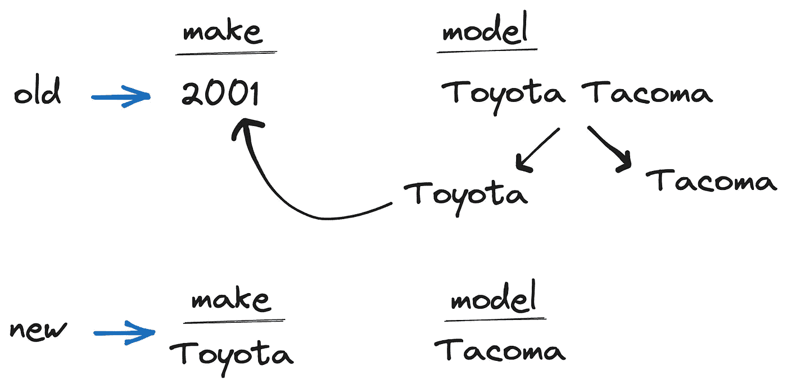
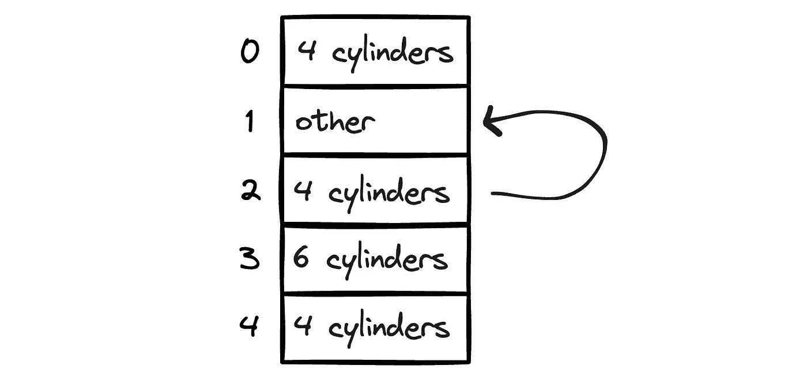

# 只有在你知道如何独立完成任务时才使用 LLMs

> 原文：[`towardsdatascience.com/only-use-llms-if-you-know-how-to-do-the-task-on-your-own-0d56e0d07572`](https://towardsdatascience.com/only-use-llms-if-you-know-how-to-do-the-task-on-your-own-0d56e0d07572)

## 否则，你可能会遭遇无声的错误或严重的后果

[](https://sonery.medium.com/?source=post_page-----0d56e0d07572--------------------------------)[](https://towardsdatascience.com/?source=post_page-----0d56e0d07572--------------------------------) [Soner Yıldırım](https://sonery.medium.com/?source=post_page-----0d56e0d07572--------------------------------)

·发表于 [Towards Data Science](https://towardsdatascience.com/?source=post_page-----0d56e0d07572--------------------------------) ·阅读时间 5 分钟·2023 年 10 月 25 日

--


(图片由作者使用 Midjourney 创建)

对于我们大多数人（或所有人）来说，LLMs 是神秘的盒子，能够令人惊讶地快速完成复杂的事情。只要它们给我们所需的，我们通常不关心“如何”部分。

ChatGPT 和其他大型语言模型无疑是生产力的提升者。它们可以轻松处理各种任务，否则这些任务将会枯燥且耗时。

然而，我们不能完全依赖它们。例如，在数据分析方面，我们如何确保 ChatGPT 对数据的见解是准确的？是的，它知道 Pandas 这个流行的数据分析库，但如果它犯了错误呢？或者，如果它部分完成了任务而未能完成剩余部分会怎样？

互补 ChatGPT 的最佳解决方案就是你自己。你需要知道如何独立完成任务，这样：

1.  你可以确保 ChatGPT 的解决方案是正确的。

1.  当 ChatGPT 无法执行或不知道如何执行时，你可以替代它。

在本文中，我将展示三个示例来支持我之前提到的两个主张。

## 示例 1：使用 Pandas 进行数据清理

我有一个包含二手车价格和其他一些属性的数据集。这是一个有点混乱的数据集，需要大量清理。我使用了 ChatGPT 高级数据分析（ADA）插件来完成这项任务。

大部分情况下，它表现良好。然而，有一个非常特定的操作 ChatGPT ADA 未能完成。因此，如果我自己不知道如何做，这项任务将无法完成。

让我首先解释 ChatGPT ADA 无法处理的部分。

可能由于数据输入错误，make（即汽车品牌或制造商）列中的一些行包含年份值。当我调查这些行时，我发现 make 值被记录在 model 列中。为了修复这一问题，需要从 model 列中提取 make 部分，并用来替换 make 列中的年份值。

这是如何修复它的：



（图片由作者提供）

我向 ChatGPT ADA 询问了几次，但它未能提供修复此问题的方法。它的最佳尝试是用“未知”替换这些年份值。

然后，我详细编写了以下提示，以便让 ChatGPT ADA 给我提供解决任务所需的 Python 代码：

> 对于实际是年份值的 make 列中的行，model 列包括正确的 make 值。对于这些行，从 model 列中提取第一个词，并用它替换 make 列中的年份值。

这是 ChatGPT ADA 为这个特定问题编写的代码：

```py
# Identify rows where 'make' is a year value
is_year = data['make'].str.isnumeric() & data['make'].str.len() == 4

# For these rows, split the 'model' column and get the first word
correct_make = data.loc[is_year, 'model'].str.split().str.get(0)

# Update the 'make' column with the correct values
data.loc[is_year, 'make'] = correct_make
```

虽然这不是最优解，但它完成了任务。

## 示例 2：替换缺失值

我试图清理的数据集中有缺失值（用“其他”、“未知”或 None 表示）在一列中。我要求 ChatGPT 用该列中最频繁的值替换它们。



（图片由作者提供）

这是 ChatGPT 的回复：

```py
most_common_cylinder = data['cylinders'].mode()[0]
data['cylinders'] = data['cylinders'].apply(lambda x: most_common_cylinder if "cylinders" not in x else x)
```

这个方法是正确的，因为它用最常见的值替换了不包含“cylinders”的值。然而，它包含了 `apply` 函数的使用，这在处理大数据集时是不建议的。`apply` 函数不是向量化操作，可能成为性能瓶颈。

更好的方法是使用以下向量化操作：

```py
df.loc[~df["cylinders"].str.contains("cylinders"), "cylinders"] = df["cylinders"].mode()[0]
```

如果我不知道 Pandas，我可能无法意识到 `apply` 函数的使用可能会导致性能问题，并寻找替代解决方案。

## 示例 3：以更符合 Python 风格的方式编写单元测试

我想测试 ChatGPT 是否能改进单元测试或使其更符合 Python 风格。

我编写了以下单元测试，实际上非常简单：

```py
def test_query(submission):
    query = submission.query
    assert query.lower().count("where") == 1
```

当我要求 ChatGPT 改进它时，我期望的更新如下：

```py
def test_query(submission):
    assert submission.query.lower().count("where") == 1
```

第二个版本消除了创建不必要的中间变量 `query`。

在第一次尝试中，ChatGPT 编写了如下单元测试：

```py
# first solution
def test_query(submission):
    query = submission.query
    assert query.count("where", flags=re.IGNORECASE) == 1
```

这是错误的。`count` 方法没有 `flags` 参数。另外，这比我的第一次尝试更简单（或更符合 Python 风格）吗？

第二次尝试是正确的，但仍然没有更简单。

```py
# second solution
import re

def test_query(submission):
    query = submission.query
    assert len(re.findall(r'where', query, flags=re.IGNORECASE)) == 1
```

然后，我告诉 ChatGPT 这不比我的解决方案更简单，并建议使用以下方法（这正是我所考虑的）：

```py
def test_query(submission):
    assert submission.query.lower().count("where") == 1
```

ChatGPT 批准了我的新建议，接受了它更简洁且符合 Python 风格。

## 最后的思考

我在这篇文章中展示的示例用例并没有降低 ChatGPT 或其他 LLM 的实用性。我已经用它完成了许多不同的任务，并得到了令人满意的结果。

我想强调的是，他们可能会犯错误。这些错误有些是明显的，有些则可能是隐性的。为了确保你获得准确的结果，留意 ChatGPT 的操作方式。我建议不要完全依赖你不了解的工具。你仍然可以用它来学习新工具，但在进行任何重要操作之前，一定要进行测试。

*如果你喜欢这篇文章，请记得点赞和评论，以帮助我获得更多的支持。* [*关注我*](https://medium.com/@sonery) *以获取更多关于 Python、数据科学、机器学习和人工智能的内容。*

感谢阅读。如果你有任何反馈，请告诉我。
