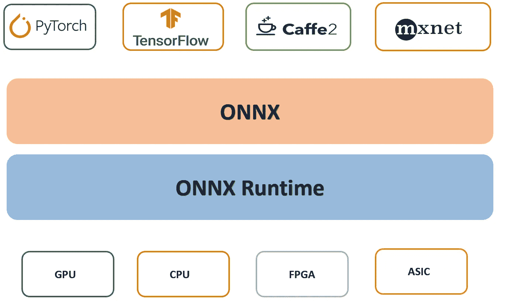

# ONNX：用于可互操作深度学习模型的标准

> 原文：[`towardsdatascience.com/onnx-the-standard-for-interoperable-deep-learning-models-a47dfbdf9a09`](https://towardsdatascience.com/onnx-the-standard-for-interoperable-deep-learning-models-a47dfbdf9a09)


图片由[Jonny Caspari](https://unsplash.com/@jonnyuiux?utm_source=medium&utm_medium=referral)在[Unsplash](https://unsplash.com/?utm_source=medium&utm_medium=referral)上提供

## 了解使用 ONNX 标准在框架和硬件平台之间部署模型的好处

[](https://medium.com/@marcellopoliti?source=post_page-----a47dfbdf9a09--------------------------------)[](https://towardsdatascience.com/?source=post_page-----a47dfbdf9a09--------------------------------) [Marcello Politi](https://medium.com/@marcellopoliti?source=post_page-----a47dfbdf9a09--------------------------------)

·发表在[Towards Data Science](https://towardsdatascience.com/?source=post_page-----a47dfbdf9a09--------------------------------) ·5 分钟阅读·2023 年 1 月 24 日

--

我第一次听说 ONNX 是在 INRIA 实习期间。我当时在用 Julia 语言开发神经网络剪枝算法。那时还没有很多预训练模型可以使用，因此利用 ONNX 导入其他语言和框架开发的模型可能是一个解决方案。

在本文中，我想介绍 ONNX，并通过一个实际示例来解释其巨大的潜力。

## ONNX 是什么？

ONNX，即开放神经网络交换，是一个用于表示深度学习模型的开源标准。它由 Facebook 和 Microsoft 开发，旨在使研究人员和工程师能够更轻松地在不同的深度学习框架和硬件平台之间迁移模型。

ONNX 的一个主要优势是它允许模型轻松地**从一个框架（如 PyTorch）导出，并导入到另一个框架（如 TensorFlow）**。这对于那些想尝试不同框架来训练和部署模型的研究人员，或者需要在不同硬件平台上部署模型的工程师尤其有用。


框架互操作性（图片由作者提供）

ONNX 还提供了一套工具，用于优化和量化模型，这有助于减少模型的内存和计算需求。这对于在边缘设备和其他资源受限环境中部署模型尤其有用。

另一个 ONNX 的重要特点是它得到了广泛的公司和组织的支持。这不仅包括 Facebook 和 Microsoft，还包括像 Amazon、NVIDIA 和 Intel 这样的公司。这种广泛的支持确保了 ONNX 将继续得到积极开发和维护，使其成为一个稳健和稳定的深度学习模型表示标准。

## ONNX Runtime

**ONNX Runtime 是一个开源推断引擎，用于执行 ONNX**（开放神经网络交换）**模型**。它被设计为**高性能**且轻量级，使其非常适合**在各种硬件平台上部署**，包括边缘设备、服务器和云服务。

ONNX Runtime 提供了 C++ API、C# API 和 Python API 来执行 ONNX 模型。它还支持多种后端，包括 CUDA 和 OpenCL，这使得它可以在各种硬件平台上运行，如 NVIDIA GPUs 和 Intel CPUs。

ONNX Runtime 非常有用，因为你可以在任何硬件上使用模型进行推断，无论你使用的是 CPU、GPU、FPGA 还是其他设备，而无需实际重写代码！



ONNX Runtime（图片来源于作者）

ONNX Runtime 的主要优点之一是其性能。它使用多种技术，如即时编译（JIT）、内核融合和子图分区来优化模型性能。它还支持线程池和节点间通信进行分布式部署，使其成为大规模部署的合适选择。

我将在未来的文章中解释所有这些高级功能！

ONNX Runtime 还支持多种模型，包括传统的机器学习模型和深度学习模型。这使得它成为一个多功能的推断引擎，可以用于从计算机视觉和自然语言处理到语音识别和自动驾驶等各种应用。

## 让我们开始编码吧！

现在让我们来看一个示例，我们将**使用**经典的**scikit-learn**来**创建一个机器学习模型**，然后**将**这个模型**转换**为 ONNX 格式，以便我们可以**与 ONNX Runtime 一起使用**。

首先，我们导入必要的库，将模型拉入 sklearn 并导出为经典的 pickle 格式。我们将使用鸢尾花数据集。

```py
from sklearn.datasets import load_iris
from sklearn.model_selection import train_test_split
from sklearn.ensemble import RandomForestClassifier
import joblib

#import data
iris = load_iris()
x,y = iris.data, iris.target
x_train, x_test, y_train, y_test = train_test_split(x, y)

#train and save model
clr = RandomForestClassifier()
clr.fit(x_train, y_train)
joblib.dump(clr, 'model.pkl', compress = 9)
```

现在我们已经训练并保存了模型，我们可以重新导入它并将其转换为 ONNX 模型。**每个框架都有其自己的转换库**。因此，如果你是在 PyTorch 或 TensorFlow 中开发的模型，你需要使用其他库。在这种情况下，库叫做**skl2onnx**。

所以我们导入了必要的库。

```py
%%capture
!pip install skl2onnx
from skl2onnx import convert_sklearn
from skl2onnx.common.data_types import FloatTensorType
import joblib
```

现在我们终于可以进行转换了。我们应该指定`inital_type`，然后可以创建一个名为*model.onnx*的文件，用于保存 onnx 模型。

```py
clr = joblib.load('model.pkl')
initial_type = [('float_input', FloatTensorType([None, 4]))]
onx = convert_sklearn(clr, initial_types = initial_type)
with open('model.onnx' , 'wb') as f:
  f.write(onx.SerializeToString()) 
```

现在我们已经有了 ONNX 格式的模型，我们可以导入它，并在一些数据上使用它进行推理。

然后我们安装 ONNX Runtime。

```py
%%capture
!pip install onnxruntime
import onnxruntime as rt
import numpy as np
```

现在我们创建数据，并导入模型，从而创建一个会话。我们指定输入和输出名称（标签），然后在数据上运行会话！

```py
data = np.array([[5.4, 6.3, 2.6, 7.4], [3.4, 6.2, 7.4, 2.3],[5.2, 6.4, 4.2,5.6]])

sess = rt.InferenceSession('model.onnx')
input_name = sess.get_inputs()[0].name
label_name = sess.get_outputs()[0].name
pred_onx = sess.run([label_name], {input_name: data.astype(np.float32)})[0]
print(pred_onx)
```

好吧，你通过利用 ONNX Runtime 得到了结果。这只需要几个简单的命令！

这只是对 ONNX 的一个介绍，你当然可以做更多，但我希望你发现这个例子有用。

## 最后的想法

ONNX 是一个开源标准，它使得在不同框架和硬件平台之间移动深度学习模型变得容易。它提供了一套优化和量化模型的工具，并且得到了众多公司和组织的支持。因此，ONNX 正在成为深度学习的重要标准，使得共享模型和跨平台部署变得简单。

# 结束

*Marcello Politi*

[Linkedin](https://www.linkedin.com/in/marcello-politi/)，[Twitter](https://twitter.com/_March08_)，[CV](https://march-08.github.io/digital-cv/)
