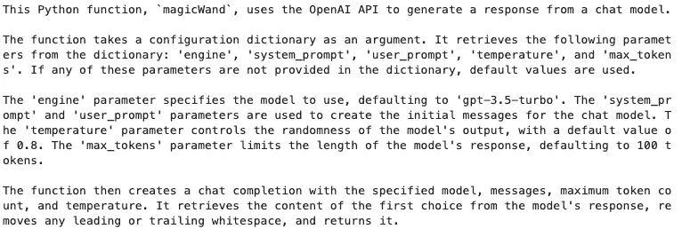
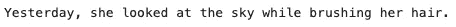
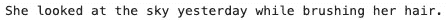
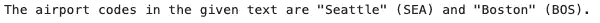
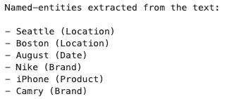
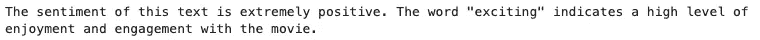
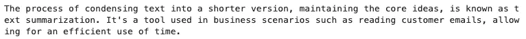
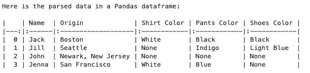
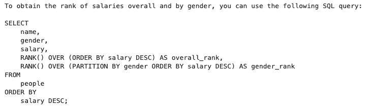
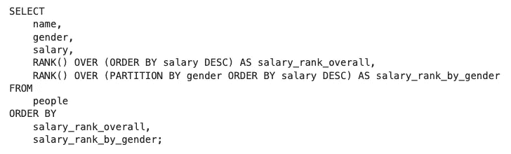

# OpenAI API — ChatGPT 背后的模型介绍与实现

> 原文：[`towardsdatascience.com/openai-api-intro-11-practical-implementation-examples-of-the-models-behind-chatgpt-18601f68b51b`](https://towardsdatascience.com/openai-api-intro-11-practical-implementation-examples-of-the-models-behind-chatgpt-18601f68b51b)

## 使用 ChatGPT 背后的模型的编程方法。

[](https://medium.com/@fmnobar?source=post_page-----18601f68b51b--------------------------------)[](https://towardsdatascience.com/?source=post_page-----18601f68b51b--------------------------------) [Farzad Mahmoodinobar](https://medium.com/@fmnobar?source=post_page-----18601f68b51b--------------------------------)

·发表于 [Towards Data Science](https://towardsdatascience.com/?source=post_page-----18601f68b51b--------------------------------) ·19 分钟阅读·2023 年 11 月 7 日

--


图片由 [Freddy Castro](https://unsplash.com/@readysetfreddy?utm_content=creditCopyText&utm_medium=referral&utm_source=unsplash) 提供，来源于 [Unsplash](https://unsplash.com/photos/black-twist-pen-near-white-teacup-u3ajSXhZM_U?utm_content=creditCopyText&utm_medium=referral&utm_source=unsplash)

现如今 ChatGPT 不需要进一步介绍，在这篇文章中，我们将更深入地探讨如何通过官方的 [OpenAI API](https://openai.com/blog/openai-api)（OpenAI 是 ChatGPT 背后的公司）以编程方式与 ChatGPT（如 GPT-4、GPT-3.5、DALL·E 等）背后的模型和引擎互动。机器学习科学家和工程师通常更喜欢使用 API 而不是图形用户界面，例如 ChatGPT，因为 API 提供了更高的灵活性和定制性，正如我们将在实现示例中看到的，这在商业环境中是必需的。

为了使用 OpenAI 的 API，我们将设置并激活一个 Python 虚拟环境（这是一项推荐但可选的步骤），安装 OpenAI Python 库，并开始实现 11 个实际示例。这些示例是我在众多探索过的示例中最喜欢的，将包括以下内容：

1.  解释代码

1.  图像生成

1.  表情符号翻译（即我们提供文本描述，模型返回描述该文本的表情符号！）

1.  语法错误纠正

1.  机场代码提取器

1.  命名实体提取器

1.  机器翻译

1.  情感分析

1.  文本摘要

1.  解析非结构化数据

1.  编写 SQL 查询

我会在逐步讲解每项任务时提供更多细节，但现在既然我们知道了大纲，让我们开始吧！

# 1\. 设置 Python

这一步只是为了创建一个虚拟环境，以便你可以将本文中创建和使用的内容与其他 Python 工作隔离开来。正如我在文章中提到的，使用虚拟环境是可选的，但通常是机器学习从业者和程序员推荐的最佳实践之一。有多种方法可以创建虚拟环境，下面是我使用的一种方法。我们将创建虚拟环境，然后激活它，再安装 OpenAI 的 Python 库（即使你决定跳过虚拟环境步骤，安装 OpenAI 的 Python 库仍然是必需的步骤）。

Mac 用户打开你的终端，Windows 用户打开命令提示符（说明见下方，以防你对这一步不熟悉），并跟随操作！

> **提示：** 如何打开“终端”（在 Mac 上）或“命令提示符”（在 Windows 上）如下：
> 
> **- Mac 用户：** 前往“应用程序”文件夹或使用“Spotlight”搜索“终端”（Command + Space 打开“Spotlight”）
> 
> **- Windows 用户：** 在开始菜单中搜索“cmd”以打开“命令提示符”

## 1.1\. 虚拟环境

打开终端或命令提示符，我们可以使用以下命令创建名为`openai-env`的虚拟环境：

`python -m venv openai-env`

一旦虚拟环境创建完成，我们可以使用下面的命令激活它：

`source openai-env/bin/activate`

现在我们在新创建并激活的虚拟环境中。接下来，我们将安装 OpenAI 的 Python 库。

## 1.2\. 安装 OpenAI Python 库

请注意，虽然虚拟环境的使用是可选的，但安装 OpenAI Python 库是实现的必需步骤。以下命令安装最新的 OpenAI Python 库：

`pip install — upgrade openai`

# 2\. 设置 API 密钥

使用 OpenAI API 需要设置一个 OpenAI 账户并获取 OpenAI API 密钥——我将带你完成这两个步骤。

设置 OpenAI 账户可以通过 [OpenAI 注册网站](https://platform.openai.com/signup) 完成。创建 OpenAI 账户后，你可以访问 [API 密钥页面](https://platform.openai.com/account/api-keys) 并点击“创建新的密钥”。你需要将其保存在安全的地方，并且通常不想与他人分享你的 API 密钥。

一旦设置好 API 密钥，我们将按如下方式导入它，将 `YOUR_API_KEY` 替换为你最近创建的 OpenAI API 密钥：

```py
 # Import libraries
import os
import openai

# Pass API Key
os.environ['OPENAI_API_KEY'] = 'YOUR_API_KEY'
openai.api_key = os.getenv("OPENAI_API_KEY")
```

在准备工作完成后，我们终于可以专注于创建一个函数来调用 OpenAI 的 API，并开始实现示例的有趣部分！

# 3\. 调用函数

在本节中，我们将创建一个函数来调用 OpenAI 的 API，我将其命名为`magicWand`！调用 OpenAI 的 API 需要传递一组变量（如下所述）。创建此函数将简化过程，以便我们不需要为每个示例重复相同的步骤。

对于所有示例，除了图像生成外，我们将使用 OpenAI 的[聊天完成](https://platform.openai.com/docs/api-reference/chat/create)，并在请求中使用以下变量。目前无需了解这些变量的详细信息。我们将在逐步示例中学习它们的工作原理，但我已经提供了一个概述以供参考。

+   `engine`：识别将要使用的模型，例如`gpt-4`或`gpt-3.5-turbo`

+   `system_prompt`：用于提供任务高层次指导的系统级提示

+   `user_prompt`：用于提供任务更详细说明的用户级提示

+   `temperature`：这是介于 0 和 2 之间的采样温度。较高的数字（例如 0.8）将确保输出更随机生成，而较低的数字（例如 0.2）将使其更具确定性

+   `max_tokens`：模型将生成的最大令牌数量（这有助于限制响应长度）

我们将在示例中将这些变量作为配置字典的值，格式如下：

```py
config = {
 ‘engine’: ‘ENGINE_NAME’,
 ‘system_prompt’: ‘SYSTEM_PROMPT’,
 ‘user_prompt’: ‘USER_PROMPT’,
 ‘temperature’: TEMPERATURE,
 ‘max_tokens’: MAX_TOKENS
}
```

让我们创建我们的函数！此时，不必完全理解函数的内容。我们将请求 GPT-4 解释代码，这是第一个示例！

```py
# Import libraries
import openai

# Define the call function
def magicWand(config):
    # Extract variables from the config dictionary
    engine = config.get('engine', 'gpt-3.5-turbo')  # Default to 'gpt-3.5-turbo'
    system_prompt = config.get('system_prompt', '')
    user_prompt = config.get('user_prompt', '') 
    temperature = config.get('temperature', 0.8)
    max_tokens = config.get('max_tokens', 100)

    # Create an array of message objects
    messages = [
        {"role": "system", "content": system_prompt},
        {"role": "user", "content": user_prompt}
    ]

    # Make the API call
    response = openai.ChatCompletion.create(
        model=engine,
        messages=messages,
        max_tokens=max_tokens,
        temperature=temperature
    )

    # Extract and return the generated text
    return response.choices[0].message['content'].strip()
```

# 4\. 任务实施

现在我们有了函数，让我们尝试第一个任务，即代码解释。

## 4.1\. 解释代码

正如之前承诺的那样，让我们请 GPT-4 解释我们的代码，以便更好地理解该函数！

为了做到这一点，我们将使用刚刚创建的`magicWand`函数，并按如下方式传递值。请注意，主要指令是`system_prompt`，我们向 GPT-4 解释任务为：`您将获得一段代码，您的任务是以简洁的方式解释它`。

让我们实施这个任务并查看结果。

```py
# Create the config dictionary
config = {
    'system_prompt': 'You will be provided with a piece of code, and your task is to explain it in a concise way.',
    'engine': 'gpt-4',
    'temperature': 0,
    'max_tokens': 2000,
    'user_prompt': '''
import openai

def magicWand(config):
    engine = config.get('engine', 'gpt-3.5-turbo')
    system_prompt = config.get('system_prompt', '')
    user_prompt = config.get('user_prompt', '') 
    temperature = config.get('temperature', 0.8)
    max_tokens = config.get('max_tokens', 100)

    messages = [
        {"role": "system", "content": system_prompt},
        {"role": "user", "content": user_prompt}
    ]

    response = openai.ChatCompletion.create(
        model=engine,
        messages=messages,
        max_tokens=max_tokens,
        temperature=temperature
    )

    return response.choices[0].message['content'].strip()
    '''
}

# Use the config to get the result
result = magicWand(config)

# Print the result
print(result)
```

结果：



GPT-4 对`magicWand`函数的解释

我发现这些结果既令人印象深刻又迷人。它逐步解释了我们的`magciWand`函数变量是什么以及它们的目的是什么。阅读完结果后，我们接下来就生成一个图像吧！

## 4.2\. 图像生成

如名字所示，这次我们将生成一张图像。这是唯一一个我们不使用 OpenAI 的聊天完成，而是使用 OpenAI 的 DALL·E 模型的示例。使用案例非常直接——我们只需在`prompt`中提供图像描述，`n`为图像数量，`size`为图像大小。让我们请求`一只黑色的苏格兰折耳猫，带有浅金色眼睛，躺在白色床单上`，并查看生成的图像！

```py
# Import libraries
from IPython.display import display, Image
import requests

# Generate the response
response = openai.Image.create(
  prompt="A black Scottish fold cat with light golden eyes laying down on white sheets",
  n=1,
  size="512x512"
)

# Save the image URL
image_url = response['data'][0]['url']

# Fetch the image
response = requests.get(image_url)

# Display the image
img = Image(data=response.content)
display(img)
```

结果：


通过 OpenAI 的 API 生成的猫咪图像

这是一个相当不错的图像，并且与我们的提示一致。接下来，我们将处理一个有趣的请求——我们将要求 GPT-4 将自然语言输入（即文本）翻译成表情符号！

## 4.3\. 表情符号翻译

这可能是我最喜欢的例子！我们将要求 GPT-4 使用我们自己的`magicWand`函数将文本翻译成表情符号。我们将提供给 GPT4 的总体指示作为`system_prompt`，即`你将会收到文本，你的任务是将其翻译成表情符号。不要使用任何常规文本。仅使用表情符号尽力而为`，然后提供需要从文本翻译成表情符号的`user_prompt`为`数据科学文章很有趣`。让我们看看结果！

```py
# Create the config dictionary
config = {
    'engine': 'gpt-4',
    'system_prompt': 'You will be provided with text, and your task is to translate it into emojis. Do not use any regular text. Do your best with emojis only.',
    'user_prompt': 'Data science articles are fun',
    'temperature': 0.8,
    'max_tokens': 128
}

# Use the config to get the result
result = magicWand(config)

# Print the results
print(result)
```

结果：


GPT-4 的文本到表情符号的翻译

这非常有趣！我能看到前半部分的表情符号与数据和科学相关，后半部分的表情符号则与乐趣相关。

接下来，我们将要求 GPT 模型纠正给定句子中的语法错误。

## 4.4\. 语法错误纠正

机器学习模型的一个应用场景是纠正句子中的语法错误。这在商业环境中可以带来许多好处。例如，处理客户沟通的企业需要人类代表阅读、审查并回复这些客户沟通。人类代表的成本相当高，如果收到的消息难以理解，这样的沟通将需要额外的工作来让人类理解和回复。作为替代方案，企业可以依赖语法错误纠正模型来首先清理传入的沟通，然后将修正后的沟通版本发送给人类代表进行审查和处理。我以前写过关于另一种语法错误纠正模型的独立帖子（见下文链接），所以我决定使用相同的句子来看看 GPT 模型的表现！

[](/grammatical-error-correction-with-machine-learning-overview-and-implementation-ccd0b50a1700?source=post_page-----18601f68b51b--------------------------------) ## 机器学习中的语法错误纠正 — 概述与实现

### 使用语法错误纠正：标记，而不是重写（GECTor）

towardsdatascience.com

我们将指示`gpt-4`或`gpt-3.5-turbo`纠正句子中的语法错误`她昨天看天空时梳头`，然后比较它们的表现。请注意，句子中有故意的拼写和语法错误供模型纠正。为此，我们将使用`system_prompt`为`你将会收到陈述，你的任务是将其转换为标准英语`来给这两个模型，然后将句子提供为`user_prompt`。

首先，让我们使用 GPT-3.5 实现并查看结果：

```py
config = {
    'engine': 'gpt-3.5-turbo',
    'system_prompt':'You will be provided with statements, and your task is to convert them to standard English.',
    'user_prompt':'she looks at sky yesterday whil brushed her hair',
    'max_tokens':256
}

result = magicWand(config)

print(result)
```

结果：



GPT-3.5 修正后的句子

现在让我们用 GPT-4 来实现：

```py
config = {
    'engine': 'gpt-4',
    'system_prompt':'You will be provided with statements, and your task is to convert them to standard English.',
    'user_prompt':'she looks at sky yesterday whil brushed her hair',
    'max_tokens':256
}

result = magicWand(config)

print(result)
```

结果：



GPT-4 修正后的句子

首先的观察是，两种模型在修正语法错误和提高原句可读性方面表现都非常好。第二个观察是，`gpt-3.5-turbo`的表现几乎与`gpt-4`一样，考虑到`gpt-4`的更高成本，也许我们可以在未来的语法错误修正中仅使用`gpt-3.5-turbo`。

在下一个例子中，我们将要求 GPT 识别句子中的机场代码！

## 4.5\. 机场代码提取器

我必须承认这个任务有点奇怪，是我个人无法立即完成的，但我们将要求 GPT 从文本中返回机场代码，`system_prompt`为`你将获得一段文本，你的任务是从中提取机场代码`，`user_prompt`为`我在八月从西雅图飞往波士顿`。让我们使用`gpt-4`或`gpt-3.5-turbo`并比较结果，从 GPT-3.5 开始。

```py
config = {
    'engine': 'gpt-3.5-turbo',
    'system_prompt':'You will be provided with a text, and your task is to extract the airport codes from it.',
    'user_prompt':'I flew from Seattle to Boston in August.',
    'max_tokens':256
}

result = magicWand(config)

print(result)
```

结果：



GPT-3.5 提取的机场名称

然后让我们用 GPT-4 来实现：

```py
config = {
    'engine': 'gpt-4',
    'system_prompt':'You will be provided with a text, and your task is to extract the airport codes from it.',
    'user_prompt':'I flew from Seattle to Boston in August.',
    'max_tokens':256
}

result = magicWand(config)

print(result)
```

结果：


GPT-4 尝试提取的机场名称

正如你所看到的，结果在“技术上”都是正确的，但也非常不同。`gpt-3.5-turbo`准确地返回了句子中西雅图和波士顿这两个城市名称的实际机场代码，尽管机场代码在提示中并未明确包含，正如`gpt-4`所说。我的假设是`gpt-3.5-turbo`经过微调，能够返回机场代码，而`gpt-4`则更字面地对待任务，没有检索出机场代码——这两者都很有趣。

接下来，让我们继续识别提供文本中的命名实体。

## 4.6\. 命名实体提取器

命名实体识别是一个常见的自然语言处理（NLP）任务，其中识别命名实体，如名称、地点、地址、组织等。通过一个例子，这将变得更容易理解。我们将给`gpt-4`和`gpt-3.5-turbo`提供`system_prompt`为`你将获得一段文本，你的任务是从中提取命名实体`和`user_prompt`为`我在八月从西雅图飞往波士顿。我记得我穿着崭新的耐克鞋，因为我对它们非常兴奋，以至于把我的 iPhone 忘在了黄色的凯美瑞出租车里`。我们期望模型能识别出如西雅图、波士顿、八月、耐克、iPhone 和凯美瑞等命名实体，但让我们先看看模型的表现，从 GPT-3.5 开始。

```py
config = {
    'engine': 'gpt-3.5-turbo',
    'system_prompt':'You will be provided with a text, and your task is to extract the named-entities from it.',
    'user_prompt':'I flew from Seattle to Boston in August. I remember I was wearing my brand new Nike shoes because I was so excited about them that I ended up leaving my iPhone in the yellow Camry cab.',
    'max_tokens':256
}

result = magicWand(config)

print(result)
```

结果：



GPT-3.5 提取的命名实体

接下来让我们实现并查看 GPT-4 的结果：

```py
config = {
    'engine': 'gpt-4',
    'system_prompt':'You will be provided with a text, and your task is to extract the named-entities from it.',
    'user_prompt':'I flew from Seattle to Boston in August. I remember I was wearing my brand new Nike shoes because I was so excited about them that I ended up leaving my iPhone in the yellow Camry cab.',
    'max_tokens':256
}

result = magicWand(config)

print(result)
```

结果：


GPT-4 提取的命名实体

结果非常好！两个模型都能够识别所有命名实体，而与`gpt-4`不同，`gpt-3.5-turbo`还能够返回命名实体的类型（例如，Seattle 和 Boston 是地点等）。因此，如果我有命名实体识别的任务，我更可能使用`gpt-3.5-turbo`，因为它能够返回识别出的命名实体的类型，并且比`gpt-4`便宜。

让我们进入下一个任务，请模型为我们进行翻译！

## 4.7\. 机器翻译

这个任务不言而喻。我们将包含一个`system_prompt`为`You will be provided with a text, and your task is to translate it to French`，然后提供一个`user_prompt`为`Can you help me with this task?`，需要翻译成法语。我测试了两个 GPT 模型，结果相同，所以下面仅包含其中一个作为参考。

```py
config = {
    'engine': 'gpt-4',
    'system_prompt':'You will be provided with a text, and your task is to translate it to French.',
    'user_prompt':'Can you help me with this task?',
    'max_tokens':128
}

result = magicWand(config)

print(result)
```

结果：


GPT-4 的英法翻译结果

这是一个预期中的好翻译！随意调整`system_prompt`，让模型将`user_prompt`翻译成其他语言吧！

接下来，我们将查看情感分析。

## 4.8\. 情感分析

情感分析是另一项常见的 NLP 任务。在最基本的形式中，它告诉我们一个句子是带有积极、消极还是中立的情感。这对企业理解客户反馈非常有用。例如，一个模型可以处理所有的餐馆、产品或服务的客户评论，并返回正面、中性或负面的评论百分比，并用作该餐馆、产品或服务的总体评分！

让我们给`gpt-4`一个`system_prompt`为`You will be provided with a text, and your task is to provide a nuanced sentiment analysis`和`user_prompt`为`That was such an exciting movie`。请注意，这句话听起来非常积极，因此我们想看看情感分析结果是否与预期一致。

让我们看看结果吧！

```py
config = {
    'engine': 'gpt-4',
    'system_prompt':'You will be provided with a text, and your task is to provide a nuanced sentiment analysis.',
    'user_prompt':'That was such an exciting movie!',
    'max_tokens':128
}

result = magicWand(config)

print(result)
```

结果：



GPT-4 的情感分析结果

正如预期的那样，`gpt-4`也认为这个句子是积极的，并添加了一个听起来像是模型决策背后理由的第二句。需要注意的是，“推理”可能真实也可能不真实，因为像 GPT-4 这样的 LLM 并不是完全确定性的——它仅仅表明模型将“激动人心”与享受、参与和积极情感关联起来——我们对于这些模型生成内容的方式知之甚少，但这是另一个话题。

接下来的任务，让我们请模型总结一个文本！

## 4.9\. 文本摘要

文本摘要是另一项不言自明的任务。想象一下，当我们拨打客户支持热线时，代表希望阅读之前关于这个话题的客户支持与客户之间的通信。与其阅读整个通信记录，不如使用模型总结过去通信中的最重要部分，然后客户支持代表只需阅读模型提供的摘要。这为客户和服务提供商节省了宝贵的时间。

为了实现这一点，让我们向 GPT-4 提供 `system_prompt` 为 `你将会收到一段文本，你的任务是对其进行总结，不使用原文中的词语`，并提供一段较长的文本作为 `user_prompt`，其内容为 `文本摘要是自动总结文本输入的任务，同时仍传达主要观点和要点。需要这种总结模型的商业直觉之一是人们阅读收到的文本通信（例如客户电子邮件），并且使用总结模型可以节省人工时间`。

让我们看看结果吧！

```py
config = {
    'engine': 'gpt-4',
    'system_prompt':'You will be provided with a text, and your task is to provide a summary of it, without using the original words.',
    'user_prompt':'Text summarization is the task of automatically summarizing textual input, while still conveying the main points and gist of the incoming text. One example of the business intuition behind the need for such summarization models is the situations where humans read incoming text communications (e.g. customer emails) and using a summarization model can save human time.',
    'max_tokens':256
}

result = magicWand(config)

print(result)
```

结果：



GPT-4 的文本摘要结果

这似乎是对提供文本的一个很好的总结！我认为我自己也未必能做得更好。

接下来的任务是处理数据分析的那些人，即解析非结构化数据。

## 4.10\. 解析非结构化数据

对于那些需要处理大量非结构化数据的用户，这个结果非常有用。我们可以让模型处理文本，然后将数据组织成不同的组。让我们看一个例子来更好地理解这一点。

我们将向 GPT-4 提供 `system_prompt` 为 `你将会收到非结构化数据，你的任务是将其解析成一个 Pandas 数据框`，然后提供非结构化数据作为 `user_prompt`，内容为 `几天前我在火星上散步时，遇到了一群亚马逊员工。第一个人，杰克，来自波士顿，穿着黑色裤子、白色衬衫和黑色跑鞋。另一个人，吉尔，穿着长款靛蓝色连衣裙，脚踩浅蓝色凉鞋，来自西雅图。第三个人名叫约翰。我不记得他穿了什么，但我特别记得约翰来自新泽西州的纽瓦克。最后一个人是珍娜，她来自旧金山。珍娜穿着白色 T 恤和蓝色裤子，但我不记得她穿了什么鞋子`。

你可以看到 `user_prompt` 包括了个人的名字和他们穿的衣物。让我们看看模型如何组织这些信息。

```py
config = {
    'engine': 'gpt-3.5-turbo',
    'system_prompt':'You will be provided with unstructured data, and your task is to parse it into a Pandas dataframe.',
    'user_prompt':'As I was walking around Mars a few days ago, I came across a group of Amazon employees. The first one, Jack, was originally from Boston and wore black pants with a white shirt and black running shoes. Another one, Jill, had a long indigo-colored dress on with light blue sandals and was originally from Seattle. The third one was named John. I cannot remember what he was wearing but I particularly recall that John was from Newark, New Jersey. The last individual was Jenna and she was from San Francisco. Jenna had a white t-shirt and blue pants on but I cannot recall her shoes.',
    'max_tokens':1024
}

result = magicWand(config)

print(result)
```

结果：



GPT-3.5 对非结构化输入的结构化输出

这非常令人印象深刻，做得很好！正如你所看到的，GPT-3.5 能够处理提供的文本，并将其组织（即解析）成每个人的相关列。这种解析在过去大多是手动完成的，当人们希望以表格格式分析数据时，这会非常有帮助。

作为最后的任务，我们将要求模型为我们编写一个 SQL 查询！

## 4.11\. 编写 SQL 查询

我个人对 GPT 模型的 SQL 编写能力非常好奇，因为我在工作中频繁使用 SQL，并且在 Medium 上发布过以下 SQL 教程。

[## SQL 教程 + 备忘单](https://medium.com/@fmnobar/sql-requirements-for-a-data-scientist-in-amazon-cheat-sheet-b1e24004ede7?source=post_page-----18601f68b51b--------------------------------)

### 介绍

[medium.com](https://medium.com/@fmnobar/sql-requirements-for-a-data-scientist-in-amazon-cheat-sheet-b1e24004ede7?source=post_page-----18601f68b51b--------------------------------)

为了评估 GPT 模型的能力，我选择了我在 SQL 帖子中使用的一个示例，并要求 `gpt-3.5-turbo` 编写我自己准备的查询。为此，我们希望将要查询的表定义为 `system_prompt` 的一部分，然后像往常一样在 `user_prompt` 中定义任务。让我们看看这个示例的实现，然后是结果和与我自己编写的查询的比较。

```py
config = {
    'engine': 'gpt-3.5-turbo',
    'user_prompt':'Write a SQL query which returns a rank of the salaries overall and also by gender from highest to the lowest salary.',
    'max_tokens':1024,
    'system_prompt':'''
Given the following SQL tables, your job is to write queries given a user’ s request.

DROP TABLE IF EXISTS salary;

CREATE TEMPORARY TABLE salary(city VARCHAR(30), average_salary int);

INSERT INTO
salary
VALUES
    ('san_francisco', '54500'),
    ('seattle', '54100'),
    ('new_york', '34400'),
    ('phoenix', '31800');

DROP TABLE IF EXISTS people;

CREATE TEMPORARY TABLE people(
    person_id int,
    name VARCHAR(30),
    gender VARCHAR(30),
    location VARCHAR(30),
    birth_year int,
    birth_month VARCHAR(30),
    birth_day int,
    job_title VARCHAR(30),
    salary int
);

INSERT INTO
people
VALUES
    (
        '1',
        'james',
        'male',
        'seattle',
        '1984',
        '9',
        '15',
        'software_developer',
        '115000'
    ),
    (
        '2',
        'mary',
        'female',
        'new_york',
        '1992',
        '1',
        '13',
        'financial_analyst',
        '183000'
    ),
    (
        '3',
        'john',
        'male',
        'san_francisco',
        '1971',
        '4',
        '22',
        'data_scientist',
        '165000'
    ),
    (
        '4',
        'patricia',
        'female',
        'phoenix',
        '1971',
        '8',
        '15',
        'physician',
        '215000'
    ),
    (
        '5',
        'michael',
        'male',
        'new_york',
        '1966',
        '1',
        '13',
        'retired',
        '25000'
    ),
    (
        '6',
        'jennifer',
        'female',
        'phoenix',
        '1994',
        '12',
        '12',
        'data_scientist',
        '165000'
    );
'''
}

result = magicWand(config)

print(result)
```

结果：



GPT-3.5 的查询

这非常令人印象深刻！这个查询涉及使用窗口函数，这些函数是 SQL 中较具挑战性的概念之一，但模型处理得相当好。以下是我在上面帖子中提供的解决方案作为参考，你可以看到模型的响应整体结构与我编写的查询非常相似！



我自己的查询

# 5\. 结论

在这篇文章中，我们介绍了 OpenAI 的 API，它提供了对后台模型的访问，使 ChatGPT 能够执行各种任务。然后，我们使用 OpenAI 的 API 实现了 11 个聊天完成和图像生成的示例，并比较了 `gpt-4` 和 `gpt-3.5-turbo` 在这些任务中的表现。总体而言，我发现这两个 GPT 模型都非常强大，并认为它们是我个人使用的有用工具，而 DALL·E 是一个令人印象深刻的图像生成器。

# 感谢阅读！

如果你觉得这篇文章对你有帮助，请 [关注我在 Medium 上](https://medium.com/@fmnobar) 和 [订阅](https://medium.com/@fmnobar/subscribe) 以接收我的最新帖子！

（所有图片，除非另有说明，均由作者提供。）
