# 通过物理启发的 DeepONet 进行算子学习：从头开始实现

> 原文：[`towardsdatascience.com/operator-learning-via-physics-informed-deeponet-lets-implement-it-from-scratch-6659f3179887`](https://towardsdatascience.com/operator-learning-via-physics-informed-deeponet-lets-implement-it-from-scratch-6659f3179887)

## 深入探讨 DeepONets、物理启发的神经网络以及物理启发的 DeepONets

[](https://shuaiguo.medium.com/?source=post_page-----6659f3179887--------------------------------)[](https://towardsdatascience.com/?source=post_page-----6659f3179887--------------------------------) [Shuai Guo](https://shuaiguo.medium.com/?source=post_page-----6659f3179887--------------------------------)

·发表于 [Towards Data Science](https://towardsdatascience.com/?source=post_page-----6659f3179887--------------------------------) ·阅读时间 23 分钟·2023 年 7 月 7 日

--

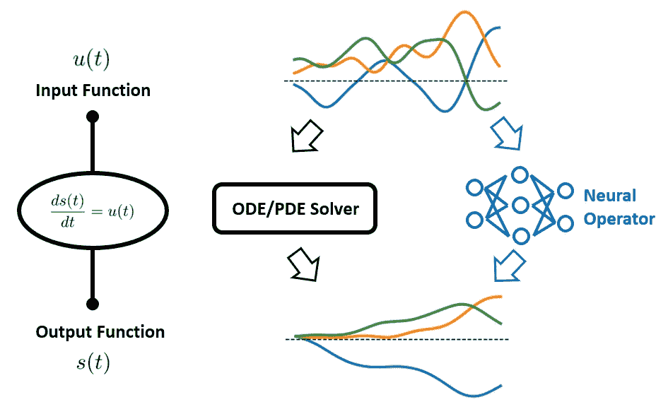

图 1\. ODE/PDEs 广泛用于描述系统过程。在许多情况下，这些 ODE/PDEs 接受一个函数（例如，强迫函数 u(t)）作为输入，并输出另一个函数（例如，s(t)）。传统上，数值求解器用于连接输入和输出。最近，**神经算子**的开发大大提高了处理效率。（图像由作者提供）

常微分方程（ODEs）和偏微分方程（PDEs）是许多科学和工程学科的基础，从物理学和生物学到经济学和气候科学。它们是描述物理系统和过程的基本工具，捕捉了数量随时间和空间的连续变化。

然而，这些方程的一个独特特点是它们不仅接受单一数值作为输入，还接受函数。例如，考虑预测建筑物因地震而产生的振动。地面的震动随时间变化，可以表示为一个函数，该函数作为描述建筑物运动的微分方程的输入。同样，在音乐厅中声波传播的情况下，乐器产生的声波可以是一个随时间变化的音量和音调的输入函数。这些变化的输入函数从根本上影响了结果输出函数——建筑物的振动和音乐厅的声学场。

传统上，这些 ODEs/PDEs 通常使用有限差分或有限元方法等数值求解器来解决。然而，这些方法存在一个瓶颈：每当有新的输入函数时，求解器必须重新运行一次。这个过程可能计算密集且缓慢，尤其是在复杂系统或高维输入情况下。

为了应对这一挑战，**Deep Operator Network**（简称**DeepONet**）的创新框架由[Lu et al.](https://arxiv.org/abs/1910.03193)于 2019 年提出。DeepONets 旨在学习将输入函数映射到输出函数的**算子**，本质上是学习预测这些 ODEs/PDEs 在任意给定输入函数下的输出，而不需要每次都重新运行数值求解器。

尽管 DeepONets 很强大，但它们继承了数据驱动方法面临的共同问题：我们如何确保网络的预测与包含在控制方程中的已知物理定律一致？

进入**物理信息化学习**领域。

物理信息化学习是一个迅速发展的机器学习分支，它将物理原理与数据科学结合起来，以增强对复杂物理系统的建模和理解。它涉及利用特定领域的知识和物理定律来指导学习过程，提高机器学习模型的准确性、泛化能力和可解释性。

在这个框架下，2021 年，[Wang et al.](https://arxiv.org/abs/2103.10974)提出了 DeepONets 的新变种：**物理信息化 DeepONet**。这种创新方法在 DeepONets 的基础上，通过将我们对物理定律的理解融入学习过程中，进行改进。我们不再只是让模型从数据中学习，而是用源于几个世纪科学探究的原理来指导它。

这看起来是一个非常有前景的方法！但是我们应该如何在实践中实现它？这正是我们今天要探讨的内容🤗

在这篇博客中，我们将讨论物理信息化 DeepONet 背后的理论，并逐步讲解如何从零开始实现它。我们还将把我们开发的模型付诸实践，通过实际案例展示其强大能力。

> 如果你也有兴趣使用物理信息化 DeepONet 解决逆问题，可以查看我的新博客：利用物理信息化 DeepONet 解决逆问题：带代码实现的实用指南

让我们开始吧！

**内容表**

· 1\. 案例研究

· 2\. 物理信息化 DeepONet

∘ 2.1 DeepONet：概述

∘ 2.2 物理信息化神经网络（PINNs）

∘ 2.3 物理信息化 DeepONet

· 3\. 物理信息化 DeepONet 的实现

∘ 3.1 定义架构

∘ 3.2 定义 ODE 损失

∘ 3.3 定义梯度下降步骤

· 4. 数据生成与组织

∘ 4.1 u(·) 轮廓生成

∘ 4.2 数据集生成

∘ 4.3 数据集组织

· 5. 训练物理信息深度运算网络

· 6. 结果讨论

· 7. 重点总结

· 参考文献

# 1. 案例研究

让我们在一个具体的例子中扎根讨论。在这篇博客中，我们将重现 [Wang et al.](https://arxiv.org/abs/2103.10974) 原论文中考虑的第一个案例研究，即由以下常微分方程（ODE）描述的初值问题：

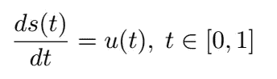

具有初始条件 s(0) = 0。

在这个方程中，u(*t*) 是随时间变化的输入函数，而 s(*t*) 是我们感兴趣的在时间 *t* 的系统状态。在物理场景中，u(*t*) 可能代表施加在系统上的力，而 s(*t*) 可能代表系统的响应，比如位移或速度，具体取决于上下文。**我们这里的最终目标是学习强迫项 u(*t*) 与 ODE 解 s(*t*) 之间的映射关系。**

传统的数值方法，如欧拉方法或龙格-库塔方法，可以有效地求解此方程。然而，请注意，强迫项 u(*t*) 可以采取各种轮廓，如下图所示：

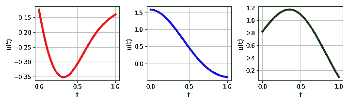

图 2. u(t) 的示例轮廓。 （作者提供的图片）

因此，每当 u(*t*) 变化时，我们需要重新运行整个模拟以获取相应的 s(*t*)（如图 3 所示），这可能会计算密集且效率低下。

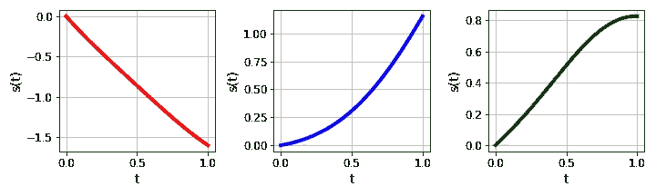

图 3. s(t) 的相应轮廓。它们是通过使用 RK45 算法求解 ODE 计算得出的。 （作者提供的图片）

那么，我们如何更高效地解决这种问题呢？

# 2. 物理信息深度运算网络

如介绍中所述，物理信息 DeepONet 是解决我们目标问题的有前途的解决方案。在这一部分，我们将详细解析其基本概念，使其更易于理解。

我们将首先讨论原始 DeepONet 的基础原则。接着，我们将探索物理信息神经网络的概念及其如何为问题解决提供额外的维度。最后，我们将展示如何将这两个想法无缝集成以构建物理信息 DeepONet。

## 2.1 DeepONet：概述

DeepONet，简而言之就是深度运算网络，代表了深度学习的新前沿。与传统的机器学习方法将一组输入值映射到输出值不同，DeepONet 旨在将整个函数映射到其他函数。这使得 DeepONet 在处理自然涉及函数输入和输出的问题时特别强大。那么它是如何实现这一目标的呢？

为了符号化我们想要实现的目标：

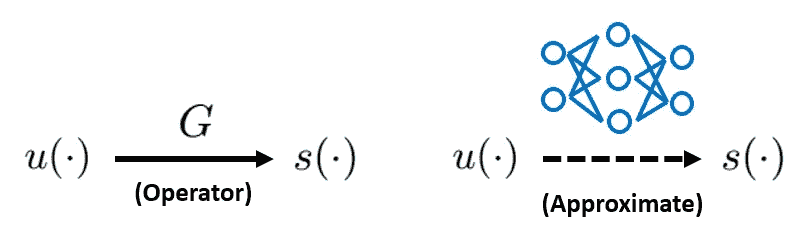

图 4\. 我们的目标是训练一个神经网络，以近似将强迫项 u(·)映射到目标输出 s(·)的算子，这两者都是时间的函数。（图片由作者提供）

左边是将输入函数 u(·)映射到输出函数 s(·)的*算子*G。右边，我们希望使用神经网络来*近似*算子 G。一旦实现了这一点，我们可以利用训练好的神经网络在给定任何 u(·)的情况下快速计算 s(·)。

对于当前的案例研究，输入函数 u(·)和输出函数 s(·)都将时间坐标*t*作为唯一参数。因此，我们希望构建的神经网络的“输入”和“输出”应如下所示：

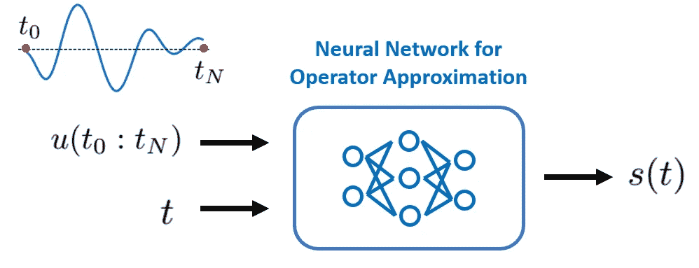

图 5\. 我们希望训练的神经网络模型的输入和输出。（图片由作者提供）

实质上，我们的神经网络应接受 u(*t*)的**整个轮廓**作为第一个输入，以及一个特定时间点*t*作为第二个输入。随后，它应输出在时间点*t*评估的目标输出函数 s(·)，即 s(*t*)。

为了更好地理解这一设置，我们认识到 s(*t*)的值首先依赖于 s(·)的轮廓，而 s(·)的轮廓又依赖于 u(·)，其次依赖于 s(·)被评估的时间点。这也是时间坐标*t*需要作为输入之一的原因。

目前我们需要弄清楚两个问题：首先，我们应该如何将 u(·)的连续轮廓输入网络？其次，我们应该如何拼接这两个输入，即*t*和 u(·)。

1️⃣ 我们应该如何输入 u(·)的*连续*轮廓？

实际上，我们并不这样做。一种直接的解决方案是离散表示函数 u(·)。更具体地说，我们只是评估 u(·)在足够但有限的多个位置的值，然后将这些离散的 u(·)值输入到神经网络中：

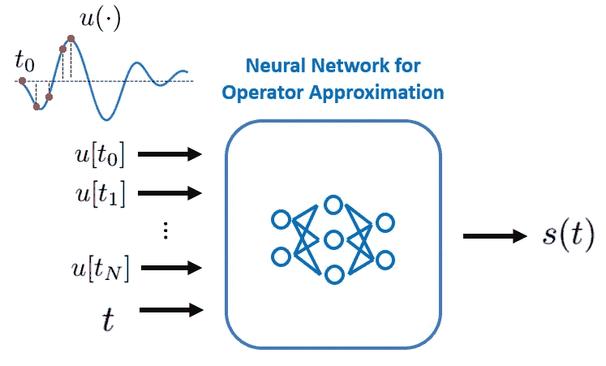

图 6\. 在被输入到神经网络之前，u(·)轮廓被离散化。（图片由作者提供）

这些位置在原始 DeepONet 论文中被称为**传感器**。

2️⃣ 我们应该如何将输入*t*和 u(·)拼接在一起？

初看之下，我们可能会想直接在输入层将它们拼接起来。然而，事实证明，这种简单的方法不仅会限制我们可以使用的神经网络类型，而且在实践中会导致次优的预测准确度。不过，还有更好的方法。现在是介绍**DeepONet**的时候了。

总之，DeepONet 提出了一种用于算子学习的新网络架构：它由两个主要组件组成：**分支网络**和**主干网络**。分支网络将离散函数值作为输入，并将其转换为特征向量。同时，主干网络将坐标（在我们当前的案例研究中，坐标仅为*t*。对于 PDE，将包括时间和空间坐标）作为输入，并将其也转换为相同维度的特征向量。这两个特征向量然后通过点积进行合并，最终结果用作在输入坐标处评估 s(·)的预测值。

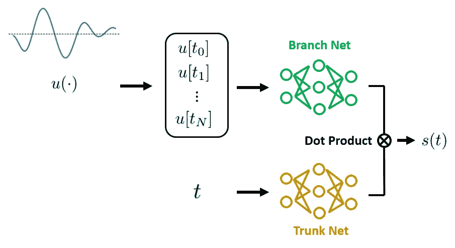

图 7\. DeepONet 包括一个**分支网络**来处理输入函数 u(·)和一个**主干网络**来处理时间/空间坐标。两个网络的输出具有相同的维度，并通过点积进行合并。可选地，可以在点积后添加一个偏置项以进一步提高模型的表达能力。（图片由作者提供）

在原始 DeepONet 论文中，作者指出，这种在“分支”和“主干”网络中体现的“分而治之”策略受到*算子通用逼近定理*的启发，旨在为算子学习引入强的归纳偏置。这也是作者声称使 DeepONet 成为有效解决方案的关键点。

> 如果你想了解更多关于 DeepONet 理论基础的内容，请参考原始论文的附录 A。

DeepONet 的主要优势之一是其效率。一旦训练完成，DeepONet 可以实时推断新的输入函数的输出函数，无需进一步训练，只要新的输入函数在其训练过的输入函数范围内。这使 DeepONet 成为需要实时推断的应用中的强大工具。

DeepONet 的另一个显著优势在于其灵活性和多功能性。虽然主干网络和分支网络最常见的选择是全连接层，但 DeepONet 框架允许高度的架构自定义。根据输入函数 u(·)和坐标的特征，可以采用各种神经网络架构，如 CNN、RNN 等。这种适应性使 DeepONet 成为一个高度多功能的工具。

然而，尽管存在这些优势，DeepONet 的局限性也很明显：作为一种纯数据驱动的方法，DeepONet 不能保证其预测结果会遵循描述所考虑物理系统的先验知识或控制方程。因此，DeepONet 可能无法很好地泛化，尤其是当面对位于训练数据分布之外的输入函数，即*分布外*（OOD）输入时。对此的一个常见解决方案是准备大量训练数据，但在实际中这可能并不总是可行，特别是在数据收集可能昂贵或耗时的科学和工程领域。

那么我们应该如何解决这些局限性呢？是时候讨论*物理信息学习*，更具体地说，是*物理信息神经网络*（PINNs）了。

## 2.2 物理信息神经网络（PINNs）

在传统的机器学习模型中，我们主要依赖数据来学习潜在的模式。然而，在许多科学和工程领域，捕捉我们对动态系统的先验知识的控制方程（ODE/PDE）是可用的，它们提供了除了观察数据之外的另一种信息来源。如果正确地将这一额外的知识源纳入模型中，它可能会改善模型的性能和泛化能力，特别是在处理有限或噪声数据时。这就是**物理信息学习**的作用所在。

当我们将物理信息学习与神经网络的概念结合时，我们将得到**物理信息神经网络**（PINNs）。

PINNs 是一种神经网络，其中网络不仅仅是拟合数据，还要尊重由微分方程描述的已知物理定律。这是通过引入**ODE/PDE 损失**来实现的，它测量了控制微分方程的违反程度。通过这种方式，我们将物理定律注入网络训练过程，使其*物理信息化*。

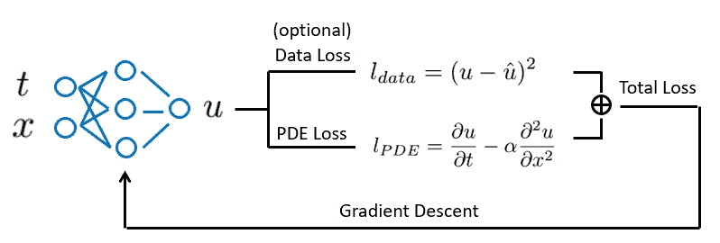

图 8\. 物理信息神经网络的损失函数包括 PDE 损失的贡献项，这有效地测量了预测解是否满足控制微分方程。注意，由于**自动微分**的存在，相对于输入的输出的导数可以很容易地计算出来。（图片来源：作者）

尽管 PINNs 在许多应用中已被证明有效，但它们也不是没有局限性。PINNs 通常是针对特定的输入参数（例如边界和初始条件、外部强迫等）进行训练的。因此，每当输入参数发生变化时，我们就需要重新训练 PINN。因此，它们在不同操作条件下的实时推断效果不是特别好。

还记得哪个方法是专门用于处理变化的输入参数的吗？没错，就是 DeepONet！现在是将物理信息学习的理念与 DeepONet 结合的时候了。

## 2.3 物理信息 DeepONet

*物理信息 DeepONet*的主要思想是结合 DeepONets 和 PINNs 的优点。就像 DeepONet 一样，物理信息 DeepONet 能够将一个函数作为输入，并产生一个函数作为输出。这使得它在实时推断新输入函数时非常高效，无需重新训练。

另一方面，像 PINN 一样，物理信息 DeepONet 在学习过程中融入了已知的物理定律。这些定律作为额外的约束引入到训练过程中的损失函数中。这种方法使得模型即使在处理有限或嘈杂数据时，也能做出物理一致的预测。

我们如何实现这种整合呢？类似于 PINNs，我们增加一个额外的损失项，以衡量模型的预测如何符合已知的微分方程。通过优化这个损失函数，模型学会进行数据一致（如果在训练过程中提供了测量数据）和物理一致的预测。

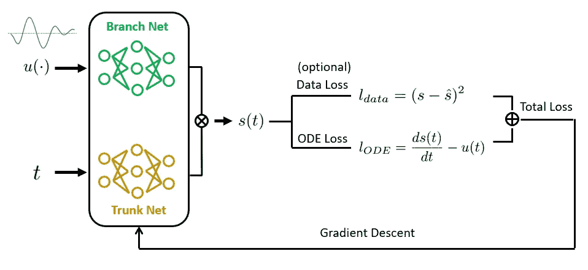

图 10\. 物理信息 DeepONet 使用 DeepONet 作为骨干架构，同时利用物理信息学习的概念来训练模型。这样，训练后的物理信息 DeepONet 既数据一致又物理一致。（图像由作者提供）

总结来说，物理信息 DeepONet 是一个强大的工具，结合了两者的优势：DeepONet 的高效性和物理信息学习的准确性。它代表了一种有前景的方法，用于解决那些实时推断和物理一致性都至关重要的复杂问题。

在下一部分，我们将开始进行案例研究，并将理论转化为实际代码。

# 3\. 物理信息 DeepONet 的实现

在这一部分，我们将详细讲解如何定义一个物理信息 DeepONet 模型，以解决我们的目标案例研究。我们将使用 TensorFlow 来实现它。让我们先导入必要的库：

```py
import numpy as np
import matplotlib.pyplot as plt

import tensorflow as tf
from tensorflow import keras
tf.random.set_seed(42)
```

## 3.1 定义架构

如前所述，物理信息 DeepONet 与原始 DeepONet 具有相同的架构。以下函数定义了 DeepONet 的架构：

```py
def create_model(mean, var, verbose=False):
    """Definition of a DeepONet with fully connected branch and trunk layers.

    Args:
    ----
    mean: dictionary, mean values of the inputs
    var: dictionary, variance values of the inputs
    verbose: boolean, indicate whether to show the model summary

    Outputs:
    --------
    model: the DeepONet model
    """

    # Branch net
    branch_input = tf.keras.Input(shape=(len(mean['forcing'])), name="forcing")
    branch = tf.keras.layers.Normalization(mean=mean['forcing'], variance=var['forcing'])(branch_input)
    for i in range(3):
        branch = tf.keras.layers.Dense(50, activation="tanh")(branch)

    # Trunk net
    trunk_input = tf.keras.Input(shape=(len(mean['time'])), name="time")
    trunk = tf.keras.layers.Normalization(mean=mean['time'], variance=var['time'])(trunk_input)   
    for i in range(3):
        trunk = tf.keras.layers.Dense(50, activation="tanh")(trunk)

    # Compute the dot product between branch and trunk net
    dot_product = tf.reduce_sum(tf.multiply(branch, trunk), axis=1, keepdims=True)

    # Add the bias
    output = BiasLayer()(dot_product)

    # Create the model
    model = tf.keras.models.Model(inputs=[branch_input, trunk_input], outputs=output)

    if verbose:
        model.summary()

    return model 
```

在上面的代码中：

1.  我们假设主干网络和分支网络都是完全连接的网络，每个网络有 3 个隐藏层，每层包含 50 个神经元，并且使用 tanh 激活函数。这个架构是基于初步测试选择的，并且应该作为这个问题的一个良好的起点。然而，可以很容易地用其他架构（例如 CNN、RNN 等）和其他层超参数进行替换。

1.  主干网络和分支网络的输出通过点积合并。正如[原始 DeepONet 论文](https://arxiv.org/abs/1910.03193)中建议的，我们添加了一个偏置项以提高预测准确性。`BiasLayer()`是一个自定义定义的类，用于实现这个目标：

```py
class BiasLayer(tf.keras.layers.Layer):
    def build(self, input_shape):
        self.bias = self.add_weight(shape=(1,),
                                    initializer=tf.keras.initializers.Zeros(),
                                    trainable=True)
    def call(self, inputs):
        return inputs + self.bias
```

## 3.2 定义 ODE 损失

接下来，我们定义一个函数来计算 ODE 损失。回顾一下我们的目标 ODE 是：


因此，我们可以按如下方式定义该函数：

```py
@tf.function
def ODE_residual_calculator(t, u, u_t, model):
    """ODE residual calculation.

    Args:
    ----
    t: temporal coordinate
    u: input function evaluated at discrete temporal coordinates
    u_t: input function evaluated at t
    model: DeepONet model

    Outputs:
    --------
    ODE_residual: residual of the governing ODE
    """

    with tf.GradientTape() as tape:
        tape.watch(t)
        s = model({"forcing": u, "time": t})

    # Calculate gradients
    ds_dt = tape.gradient(s, t)

    # ODE residual
    ODE_residual = ds_dt - u_t

    return ODE_residual
```

在上面的代码中：

1.  我们使用`tf.GradientTape()`来计算 s(·)相对于*t*的梯度。请注意，在 TensorFlow 中，`tf.GradientTape()`作为上下文管理器使用，任何在 tape 上下文中执行的操作都会被 tape 记录。在这里，我们显式地观察变量*t*。因此，TensorFlow 会自动跟踪涉及*t*的所有操作，在这种情况下，它是 DeepONet 模型的前向传播。之后，我们使用 tape 的`gradient()`方法来计算 s(·)相对于*t*的梯度。

1.  我们包括了一个额外的输入参数`u_t`，它表示在*t*时刻评估的输入函数 u(·)的值。这构成了我们目标 ODE 的右侧项，并且它是计算 ODE 残差损失所需的。

1.  我们使用`@tf.function`装饰器将我们刚刚定义的常规 Python 函数转换为 TensorFlow 图。这是有用的，因为梯度计算可能非常昂贵，并且在图模式下执行可以显著加速计算。

## 3.3 定义梯度下降步骤

接下来，我们定义一个函数来编译总损失函数并计算总损失相对于网络模型参数的梯度：

```py
@tf.function
def train_step(X, X_init, IC_weight, ODE_weight, model):
    """Calculate gradients of the total loss with respect to network model parameters.

    Args:
    ----
    X: training dataset for evaluating ODE residuals
    X_init: training dataset for evaluating initial conditions
    IC_weight: weight for initial condition loss
    ODE_weight: weight for ODE loss
    model: DeepONet model

    Outputs:
    --------
    ODE_loss: calculated ODE loss
    IC_loss: calculated initial condition loss
    total_loss: weighted sum of ODE loss and initial condition loss
    gradients: gradients of the total loss with respect to network model parameters.
    """
    with tf.GradientTape() as tape:
        tape.watch(model.trainable_weights)

        # Initial condition prediction
        y_pred_IC = model({"forcing": X_init[:, 1:-1], "time": X_init[:, :1]})

        # Equation residual
        ODE_residual = ODE_residual_calculator(t=X[:, :1], u=X[:, 1:-1], u_t=X[:, -1:], model=model)

        # Calculate loss
        IC_loss = tf.reduce_mean(keras.losses.mean_squared_error(0, y_pred_IC))
        ODE_loss = tf.reduce_mean(tf.square(ODE_residual))

        # Total loss
        total_loss = IC_loss*IC_weight + ODE_loss*ODE_weight

    gradients = tape.gradient(total_loss, model.trainable_variables)

    return ODE_loss, IC_loss, total_loss, gradients
```

在上面的代码中：

1.  我们只考虑两个损失项：与初始条件相关的损失`IC_loss`和 ODE 残差损失`ODE_loss`。`IC_loss`通过将模型预测的 s(*t*=0)与已知的初始值 0 进行比较来计算，`ODE_loss`通过调用我们之前定义的`ODE_residual_calculator`函数来计算。如果有可用的测量 s(*t*)值（在上面的代码中未实现），数据损失也可以计算并添加到总损失中。

1.  通常，总损失是`IC_loss`和`ODE_loss`的加权和，其中权重控制在训练过程中对这些单独损失项的重视程度或优先级。在我们的案例研究中，将`IC_weight`和`ODE_weight`都设置为 1 就足够了。

1.  类似于我们计算`ODE_loss`的方式，我们也采用了`tf.GradientTape()`作为上下文管理器来计算梯度。然而，这里我们计算的是总损失相对于网络模型参数的梯度，这对于执行梯度下降是必要的。

在继续之前，让我们快速总结一下我们到目前为止所开发的内容：

1️⃣ 我们可以使用`create_model()`函数初始化一个 DeepONet 模型。

2️⃣ 我们可以计算 ODE 残差，以评估模型预测与所治理 ODE 的契合程度。这是通过`ODE_residual_calculator`函数实现的。

3️⃣ 我们可以使用`train_step`计算总损失及其相对于网络模型参数的梯度。

现在准备工作完成了一半🚀 在下一节中，我们将讨论数据生成和数据组织的问题（上述代码中的奇怪`X[:, :1]`会在那时变得清晰）。之后，我们终于可以训练模型并查看其表现。

# 4\. 数据生成和组织

在本节中，我们讨论合成数据的生成及其在训练 Physics-informed DeepONet 模型中的组织方式。

## 4.1 生成 u(·)特征

用于训练、验证和测试的数据将是合成生成的。这样做的理由有两个：不仅方便，而且可以完全控制数据的特征。

在我们的案例研究中，我们将使用零均值的**高斯过程**生成输入函数 u(·)，并使用径向基函数（RBF）核。

> 高斯过程是一种强大的数学框架，常用于机器学习中建模函数。RBF 核是捕捉输入点之间相似性的热门选择。通过在高斯过程中使用 RBF 核，我们确保生成的合成数据表现出平滑和连续的模式，这在各种应用中通常是有利的。如需了解更多关于高斯过程的内容，请随时查看我之前的[博客](https://medium.com/towards-data-science/implement-a-gaussian-process-from-scratch-2a074a470bce)。

在 scikit-learn 中，这可以通过几行代码实现：

```py
from sklearn.gaussian_process import GaussianProcessRegressor
from sklearn.gaussian_process.kernels import RBF

def create_samples(length_scale, sample_num):
    """Create synthetic data for u(·)

    Args:
    ----
    length_scale: float, length scale for RNF kernel
    sample_num: number of u(·) profiles to generate

    Outputs:
    --------
    u_sample: generated u(·) profiles
    """

    # Define kernel with given length scale
    kernel = RBF(length_scale)

    # Create Gaussian process regressor
    gp = GaussianProcessRegressor(kernel=kernel)

    # Collocation point locations
    X_sample = np.linspace(0, 1, 100).reshape(-1, 1) 

    # Create samples
    u_sample = np.zeros((sample_num, 100))
    for i in range(sample_num):
        # sampling from the prior directly
        n = np.random.randint(0, 10000)
        u_sample[i, :] = gp.sample_y(X_sample, random_state=n).flatten()  

    return u_sample
```

在上面的代码中：

1.  我们使用`length_scale`来控制生成函数的形状。对于 RBF 核，图 11 展示了不同核长度尺度下的 u(·)特征。

1.  请记住，我们需要在将 u(·)输入 DeepONet 之前对其进行离散化。这是通过指定`X_sample`变量来完成的，该变量在我们感兴趣的时间域内分配 100 个均匀分布的点。

1.  在 scikit-learn 中，`GaussianProcessRegressor`对象提供了一个`sample_y`方法，用于从具有长度尺度指定核的高斯过程抽取随机样本。注意，我们在使用`GaussianProcessRegressor`对象之前并没有调用`.fit()`，这与我们通常对其他 scikit-learn 回归器的做法不同。这是故意的，因为我们希望`GaussianProcessRegressor`使用我们提供的**精确**`length_scale`。如果你调用`.fit()`，`length_scale`将被优化为另一个值以更好地拟合给定的数据。

1.  输出`u_sample`是一个维度为 sample_num * 100 的矩阵。`u_sample`的每一行表示一个 u(·)的特征，其中包含 100 个离散值。

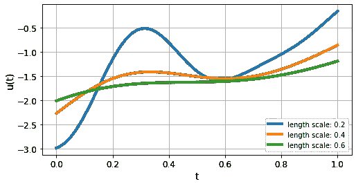

图 11\. 在不同核长度尺度下的合成 u(·) 轮廓。（图片来源：作者）

## 4.2 数据集生成

现在我们已经生成了 u(·) 轮廓，让我们关注如何组织数据集，以便它可以输入到 DeepONet 模型中。

请记住，我们在上一节中开发的 DeepONet 模型需要 3 个输入：

1.  时间坐标 *t*，这是介于 0 和 1 之间的标量（暂时不考虑批量大小）；

1.  u(·) 的轮廓，这是一个由在预定义的、固定的时间坐标（介于 0 和 1 之间）下评估的 u(·) 值组成的向量；

1.  u(*t*) 的值，这也是一个标量。这个 u(*t*) 值用于在时间坐标 *t* 下计算 ODE 损失。

因此，我们可以这样构建一个单一的样本：

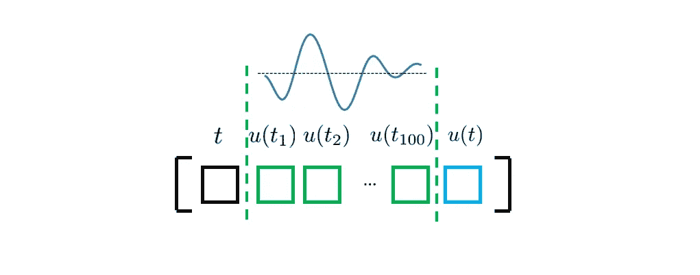

（图片来源：作者）

当然，对于每个 u(·) 轮廓（在上图中标记为绿色），我们应考虑多个 *t*（及其对应的 u(*t*)）来评估 ODE 损失，以更好地施加物理约束。理论上，*t* 可以取考虑的时间域内的任何值（即在我们案例研究中为 0 和 1 之间）。然而，为了简化，我们只考虑在 u(·) 轮廓离散化的相同时间位置的 *t*。因此，我们更新后的数据集将如下所示：

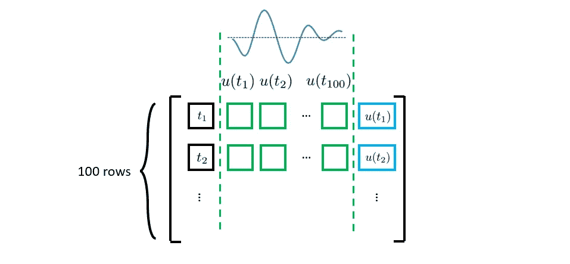

（图片来源：作者）

请注意，上述讨论仅考虑了单一的 u(·) 轮廓。如果我们考虑所有的 u(·) 轮廓，我们的最终数据集将如下所示：

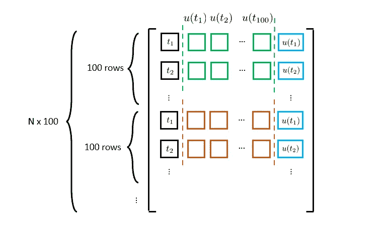

（图片来源：作者）

其中 N 代表 u(·) 轮廓的数量。现在有了这个前提，让我们看看一些代码：

```py
from tqdm import tqdm
from scipy.integrate import solve_ivp

def generate_dataset(N, length_scale, ODE_solve=False):
    """Generate dataset for Physics-informed DeepONet training.

    Args:
    ----
    N: int, number of u(·) profiles
    length_scale: float, length scale for RNF kernel
    ODE_solve: boolean, indicate whether to compute the corresponding s(·)

    Outputs:
    --------
    X: the dataset for t, u(·) profiles, and u(t)
    y: the dataset for the corresponding ODE solution s(·)
    """

    # Create random fields
    random_field = create_samples(length_scale, N)

    # Compile dataset
    X = np.zeros((N*100, 100+2))
    y = np.zeros((N*100, 1))

    for i in tqdm(range(N)):
        u = np.tile(random_field[i, :], (100, 1))
        t = np.linspace(0, 1, 100).reshape(-1, 1)

        # u(·) evaluated at t
        u_t = np.diag(u).reshape(-1, 1)

        # Update overall matrix
        X[i*100:(i+1)*100, :] = np.concatenate((t, u, u_t), axis=1)

        # Solve ODE
        if ODE_solve:
            sol = solve_ivp(lambda var_t, var_s: np.interp(var_t, t.flatten(), random_field[i, :]), 
                            t_span=[0, 1], y0=[0], t_eval=t.flatten(), method='RK45')
            y[i*100:(i+1)*100, :] = sol.y[0].reshape(-1, 1)

    return X, y
```

在上述代码中，我们添加了一个选项，用于计算给定 u(·) 轮廓的相应 s(·)。**虽然我们在训练中不会使用 s(·) 值，但我们仍然需要它们来测试模型性能。** s(·) 的计算是通过使用 `scipy.integrate.solve_ivp` 实现的，这是一个来自 SciPy 的 ODE 求解器，专门设计用于解决初值问题。

现在我们可以生成训练、验证和测试数据集。请注意，对于本案例研究，我们将使用 0.4 的长度尺度生成 u(·) 轮廓，并训练物理信息 DeepONet。

```py
# Create training dataset
N_train = 2000
length_scale_train = 0.4
X_train, y_train = generate_dataset(N_train, length_scale_train)

# Create validation dataset
N_val = 100
length_scale_test = 0.4
X_val, y_val = generate_dataset(N_val, length_scale_test)

# Create testing dataset
N_test = 100
length_scale_test = 0.4
X_test, y_test = generate_dataset(N_test, length_scale_test, ODE_solve=True)
```

## 4.3 数据集组织

最后，我们将 NumPy 数组转换为 TensorFlow 数据集对象，以便于数据输入。

```py
# Determine batch size
ini_batch_size = int(2000/100)
col_batch_size = 2000

# Create dataset object (initial conditions)
X_train_ini = tf.convert_to_tensor(X_train[X_train[:, 0]==0], dtype=tf.float32)
ini_ds = tf.data.Dataset.from_tensor_slices((X_train_ini))
ini_ds = ini_ds.shuffle(5000).batch(ini_batch_size)

# Create dataset object (collocation points)
X_train = tf.convert_to_tensor(X_train, dtype=tf.float32)
train_ds = tf.data.Dataset.from_tensor_slices((X_train))
train_ds = train_ds.shuffle(100000).batch(col_batch_size)

# Scaling 
mean = {
    'forcing': np.mean(X_train[:, 1:-1], axis=0),
    'time': np.mean(X_train[:, :1], axis=0)
}

var = {
    'forcing': np.var(X_train[:, 1:-1], axis=0),
    'time': np.var(X_train[:, :1], axis=0)
}
```

在上面的代码中，我们创建了两个不同的数据集：一个用于评估 ODE 损失（`train_ds`），另一个用于评估初始条件损失（`ini_ds`）。我们还预先计算了 *t* 和 u(·) 的均值和方差。这些值将用于标准化输入。

数据生成和组织的部分就到这里。接下来，我们将启动模型训练并查看其表现。

# 5\. 训练物理信息 DeepONet

作为第一步，让我们创建一个自定义类来跟踪损失演变：

```py
from collections import defaultdict

class LossTracking:

    def __init__(self):
        self.mean_total_loss = keras.metrics.Mean()
        self.mean_IC_loss = keras.metrics.Mean()
        self.mean_ODE_loss = keras.metrics.Mean()
        self.loss_history = defaultdict(list)

    def update(self, total_loss, IC_loss, ODE_loss):
        self.mean_total_loss(total_loss)
        self.mean_IC_loss(IC_loss)
        self.mean_ODE_loss(ODE_loss)

    def reset(self):
        self.mean_total_loss.reset_states()
        self.mean_IC_loss.reset_states()
        self.mean_ODE_loss.reset_states()

    def print(self):
        print(f"IC={self.mean_IC_loss.result().numpy():.4e}, \
              ODE={self.mean_ODE_loss.result().numpy():.4e}, \
              total_loss={self.mean_total_loss.result().numpy():.4e}")

    def history(self):
        self.loss_history['total_loss'].append(self.mean_total_loss.result().numpy())
        self.loss_history['IC_loss'].append(self.mean_IC_loss.result().numpy())
        self.loss_history['ODE_loss'].append(self.mean_ODE_loss.result().numpy())
```

然后，我们定义了主要的训练/验证逻辑：

```py
# Set up training configurations
n_epochs = 300
IC_weight= tf.constant(1.0, dtype=tf.float32)   
ODE_weight= tf.constant(1.0, dtype=tf.float32)
loss_tracker = LossTracking()
val_loss_hist = []

# Set up optimizer
optimizer = keras.optimizers.Adam(learning_rate=1e-3)

# Instantiate the PINN model
PI_DeepONet= create_model(mean, var)
PI_DeepONet.compile(optimizer=optimizer)

# Configure callbacks
_callbacks = [keras.callbacks.ReduceLROnPlateau(factor=0.5, patience=30),
             tf.keras.callbacks.ModelCheckpoint('NN_model.h5', monitor='val_loss', save_best_only=True)]
callbacks = tf.keras.callbacks.CallbackList(
                _callbacks, add_history=False, model=PI_DeepONet)

# Start training process
for epoch in range(1, n_epochs + 1):  
    print(f"Epoch {epoch}:")

    for X_init, X in zip(ini_ds, train_ds):

        # Calculate gradients
        ODE_loss, IC_loss, total_loss, gradients = train_step(X, X_init, 
                                                            IC_weight, ODE_weight,
                                                            PI_DeepONet)
        # Gradient descent
        PI_DeepONet.optimizer.apply_gradients(zip(gradients, PI_DeepONet.trainable_variables))

        # Loss tracking
        loss_tracker.update(total_loss, IC_loss, ODE_loss)

    # Loss summary
    loss_tracker.history()
    loss_tracker.print()
    loss_tracker.reset()

    ####### Validation
    val_res = ODE_residual_calculator(X_val[:, :1], X_val[:, 1:-1], X_val[:, -1:], PI_DeepONet)
    val_ODE = tf.cast(tf.reduce_mean(tf.square(val_res)), tf.float32)

    X_val_ini = X_val[X_val[:, 0]==0]
    pred_ini_valid = PI_DeepONet.predict({"forcing": X_val_ini[:, 1:-1], "time": X_val_ini[:, :1]}, batch_size=12800)
    val_IC = tf.reduce_mean(keras.losses.mean_squared_error(0, pred_ini_valid))
    print(f"val_IC: {val_IC.numpy():.4e}, val_ODE: {val_ODE.numpy():.4e}, lr: {PI_DeepONet.optimizer.lr.numpy():.2e}")

    # Callback at the end of epoch
    callbacks.on_epoch_end(epoch, logs={'val_loss': val_IC+val_ODE})
    val_loss_hist.append(val_IC+val_ODE)

    # Re-shuffle dataset
    ini_ds = tf.data.Dataset.from_tensor_slices((X_train_ini))
    ini_ds = ini_ds.shuffle(5000).batch(ini_batch_size)

    train_ds = tf.data.Dataset.from_tensor_slices((X_train))
    train_ds = train_ds.shuffle(100000).batch(col_batch_size)
```

这是一段相当长的代码，但它应该是自解释的，因为我们已经覆盖了所有重要部分。

为了可视化训练性能，我们可以绘制损失收敛曲线：

```py
# History
fig, ax = plt.subplots(1, 3, figsize=(12, 4))
ax[0].plot(range(n_epochs), loss_tracker.loss_history['IC_loss'])
ax[1].plot(range(n_epochs), loss_tracker.loss_history['ODE_loss'])
ax[2].plot(range(n_epochs), val_loss_hist)
ax[0].set_title('IC Loss')
ax[1].set_title('ODE Loss')
ax[2].set_title('Val Loss')
for axs in ax:
    axs.set_yscale('log')
```

训练结果如下所示：

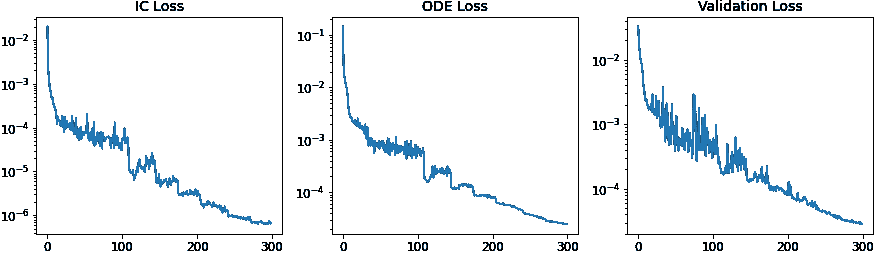

图 12\. 损失收敛图。（图像由作者提供）

此外，我们还可以看到在训练过程中某一特定目标 s(·)的预测准确性如何变化：

在训练开始时，我们可以看到模型预测与真实值之间存在明显的差异。然而，到训练结束时，预测的 s(·)已经收敛到真实值。这表明我们的物理信息深度网络学习得很充分。

# 6\. 结果讨论

一旦训练完成，我们可以重新加载保存的权重并评估性能。

在这里，我们随机挑选了三个 u(·)轮廓从测试数据集中，并将其对应的 s(·)与我们的物理信息深度网络预测的结果以及由数值 ODE 求解器计算的真实值进行了比较。我们可以看到，预测结果与真实值几乎无法区分。

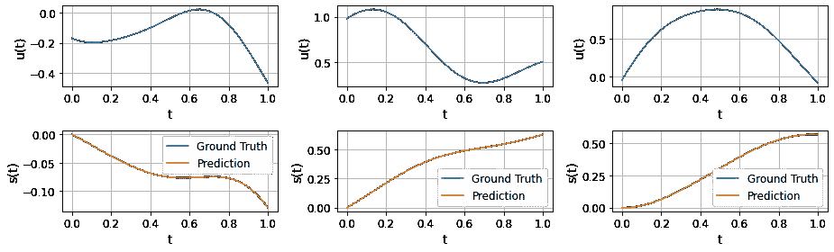

图 13\. 从测试数据集中随机选择了三个 u(·)轮廓，这些轮廓显示在上排。下排显示了对应的 s(·)轮廓。我们可以看到，物理信息深度网络预测的结果与由数值 ODE 求解器计算的真实值几乎无法区分。（图像由作者提供）

这些结果相当令人惊讶，考虑到我们甚至没有使用任何 s(·)的观测数据（除了初始条件）来训练 DeepONet。这表明控制 ODE 本身为模型提供了足够的“监督”信号，以做出准确的预测。

另一个有趣的评估点是所谓的“分布外”预测能力。由于我们在训练 DeepONet 时强制执行了控制方程，我们可以预期训练得到的物理信息深度网络在 u(·)轮廓超出训练 u(·)分布时仍能做出不错的预测。

为了测试这一点，我们可以使用不同的长度尺度生成 u(·)轮廓。以下结果显示了使用 0.6 长度尺度生成的三个 u(·)轮廓，以及预测的 s(·)。这些结果相当不错，考虑到物理信息深度网络是用 0.4 的长度尺度训练的。

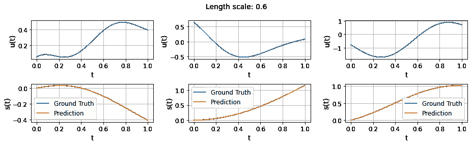

图 14\. 训练得到的物理信息深度网络显示了一定程度的分布外预测能力。（图像由作者提供）

然而，如果我们继续将长度尺度减小到 0.2，我们会注意到明显的差异开始出现。这表明训练得到的物理信息深度网络（DeepONet）在泛化能力上存在限制。

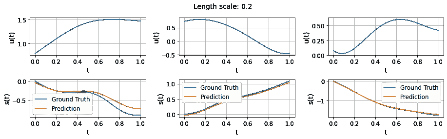

图 15\. 物理信息深度 ONet 的泛化能力是有限的。（作者提供的图像）

较小的长度尺度通常会导致更复杂的 u(·)轮廓，这与用于训练的 u(·)轮廓可能有很大不同。这可以解释为何训练后的模型在较小长度尺度区域预测准确性遇到挑战。

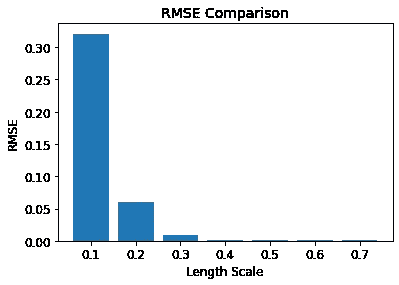

图 16\. 我们训练的模型在泛化到较小长度尺度区域时面临挑战，因为 u(·)轮廓更复杂，与训练数据有较大区别。（作者提供的图像）

总的来说，我们可以说开发的物理信息深度 ONet 能够在仅有 ODE 约束的情况下正确学习系统动态和从输入函数到输出函数的映射。此外，物理信息深度 ONet 在处理“超分布”预测方面显示出一定的能力，这表明训练模型与控制 ODE 对齐可以提高模型的泛化能力。

# 7\. 收获

我们在探索物理信息深度 ONet 的过程中走了很长一段路。从理解深度 ONet 和物理信息学习的基本概念，到通过代码实现看到它们的实际应用，我们已经详细讲解了这一强大方法在求解微分方程中的应用。

这里有几点关键的收获：

1️⃣ **深度 ONet**是一个强大的操作符学习框架，得益于其创新的分支和主干网络架构。

2️⃣ **物理信息学习**明确地将动态系统的控制微分方程纳入学习过程，从而具有提高模型解释性和泛化能力的潜力。

3️⃣ **物理信息深度 ONet**结合了深度 ONet 和物理信息学习的优势，呈现出作为学习功能映射的有前景工具，同时遵循相关的控制方程。

希望你喜欢这次对**物理信息深度 ONet**的深入探讨。接下来，我们将转向使用物理信息深度 ONet 解决逆问题。敬请关注！

如果你觉得我的内容有用，可以在[这里](https://www.buymeacoffee.com/Shuaiguo09f)请我喝杯咖啡🤗 非常感谢你的支持！

> 你可以在[这里](https://github.com/ShuaiGuo16/PI-DeepONet/tree/main)找到包含完整代码的辅助笔记本 *💻*
> 
> 如果你也对使用物理信息深度 ONet 解决逆问题感兴趣，请随时查看我的新博客：使用物理信息深度 ONet 解决逆问题：带代码实现的实用指南
> 
> 如果你想了解最新的物理知识学习最佳实践，请查看我目前正在进行的设计模式系列：[揭示物理知识驱动神经网络的设计模式](https://medium.com/towards-data-science/unraveling-the-design-pattern-of-physics-informed-neural-networks-series-01-8190df459527)
> 
> 你也可以订阅我的[通讯](https://shuaiguo.medium.com/subscribe)或者在[Medium](https://shuaiguo.medium.com/)上关注我。

# 参考文献

[1] Lu 等人，DeepONet：基于算子通用近似定理的非线性算子学习，用于识别微分方程。arXiv, 2019。

[2] Wang 等人，学习参数偏微分方程的解算符，基于物理知识的 DeepOnets。arXiv, 2021。
