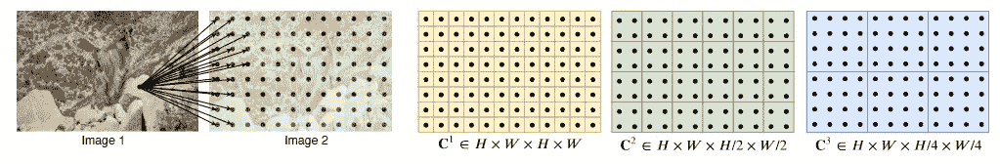

# Optical Flow with RAFT: 第一部分

> 原文：[`towardsdatascience.com/optical-flow-with-raft-part-1-f984b4a33993?source=collection_archive---------1-----------------------#2023-10-03`](https://towardsdatascience.com/optical-flow-with-raft-part-1-f984b4a33993?source=collection_archive---------1-----------------------#2023-10-03)

## 深入探讨光流的深度学习

[](https://medium.com/@itberrios6?source=post_page-----f984b4a33993--------------------------------)[](https://towardsdatascience.com/?source=post_page-----f984b4a33993--------------------------------) [Isaac Berrios](https://medium.com/@itberrios6?source=post_page-----f984b4a33993--------------------------------)

·

[关注](https://medium.com/m/signin?actionUrl=https%3A%2F%2Fmedium.com%2F_%2Fsubscribe%2Fuser%2Ffbadc8e8ee44&operation=register&redirect=https%3A%2F%2Ftowardsdatascience.com%2Foptical-flow-with-raft-part-1-f984b4a33993&user=Isaac+Berrios&userId=fbadc8e8ee44&source=post_page-fbadc8e8ee44----f984b4a33993---------------------post_header-----------) 发布于 [Towards Data Science](https://towardsdatascience.com/?source=post_page-----f984b4a33993--------------------------------) ·14 分钟阅读·2023 年 10 月 3 日[](https://medium.com/m/signin?actionUrl=https%3A%2F%2Fmedium.com%2F_%2Fvote%2Ftowards-data-science%2Ff984b4a33993&operation=register&redirect=https%3A%2F%2Ftowardsdatascience.com%2Foptical-flow-with-raft-part-1-f984b4a33993&user=Isaac+Berrios&userId=fbadc8e8ee44&source=-----f984b4a33993---------------------clap_footer-----------)

--

[](https://medium.com/m/signin?actionUrl=https%3A%2F%2Fmedium.com%2F_%2Fbookmark%2Fp%2Ff984b4a33993&operation=register&redirect=https%3A%2F%2Ftowardsdatascience.com%2Foptical-flow-with-raft-part-1-f984b4a33993&source=-----f984b4a33993---------------------bookmark_footer-----------)

照片由 [Zdeněk Macháček](https://unsplash.com/@zmachacek?utm_source=medium&utm_medium=referral) 提供，发布于 [Unsplash](https://unsplash.com/?utm_source=medium&utm_medium=referral)

在这篇文章中，我们将学习一种旗舰级深度学习方法，这种方法在 2020 年获得了[ECCV](https://en.wikipedia.org/wiki/European_Conference_on_Computer_Vision)最佳论文奖，并被引用超过 1000 次。它也是许多顶级模型在[KITTI 基准测试](https://www.cvlibs.net/datasets/kitti/eval_scene_flow.php?benchmark=flow)中的基础。这个模型叫做[RAFT: Recurrent All-Pairs Field Transforms for Optical Flow](https://arxiv.org/pdf/2003.12039.pdf)，可以在[PyTorch](https://pytorch.org/vision/stable/auto_examples/plot_optical_flow.html)或[GitHub](https://github.com/princeton-vl/RAFT/tree/master)上轻松获取。实现使其非常易于获取，但模型复杂，理解起来可能会令人困惑。在这篇文章中，我们将把 RAFT 分解为其基本组成部分，并详细了解它们。然后，我们将学习如何在 Python 中使用它来估计光流。在[第二部分](https://medium.com/towards-data-science/optical-flow-with-raft-part-2-f0376a972c25)中，我们将探索隐秘的细节并可视化不同的模块，以便深入理解它们的工作原理。

+   **介绍**

+   **RAFT 的基础**

+   **视觉相似性**

+   **迭代更新**

+   **如何使用 RAFT**

+   **结论**

# 介绍

## 光流

光流是图像序列中像素的表观运动。为了估计光流，场景中物体的运动必须有相应的亮度位移。这意味着图像中的一个移动的红球在下一张图像中应具有相同的亮度和颜色，这使我们能够确定它在像素上的移动量。图 1 展示了一个光流的例子，其中一个逆时针旋转的天花板风扇被一系列图像捕捉到。


图 1\. 图像序列的光流估计。帧 1，帧 2，帧 1 和帧 2 之间计算的光流。来源：作者。

最右边的彩色图像包含了从帧 1 到帧 2 的每个像素的表观运动，它的颜色编码方式使得不同的颜色表示像素运动的不同水平和垂直方向。这是一个密集光流估计的例子。

对***稠密光流***的估计为每个像素分配一个二维流向量，描述其在时间间隔内的水平和垂直位移。在***稀疏光流***中，这个向量仅分配给对应于强特征（如角点和边缘）的像素。*为了使流向量存在，该像素在时间 t 的亮度必须与时间 t+1 时相同，这被称为* ***亮度一致性假设***。*位置*(x,y)* 在时间*t* 的图像强度或亮度由 *I(x,y,t)* 给出。下面的图 2 展示了已知像素位移的示例，其中 *dx* 和 *dy* 是水平和垂直图像位移，*dt* 是帧之间的时间差。


图 2。像素从时间 t 到 t+dt 的位移。亮度一致性假设意味着该像素在两个帧中具有相同的颜色和强度。来源：作者。

> 亮度一致性假设意味着在 (x,y,t) 处的像素在 (x+dx, y+dy, t+dy) 处将具有相同的强度。因此：**I(x, y, t) = I(x+dx, y+dy, t+dt)**。

从亮度一致性假设出发，我们可以通过在*(x, y, t)* 周围展开右侧的 1ˢᵗ阶泰勒近似来推导光流方程[[1](http://image.diku.dk/imagecanon/material/HornSchunckOptical_Flow.pdf)]。


光流方程的推导。来源：作者。

水平和垂直梯度 *Iₓ* 和 *Iᵧ* 可以通过 [Sobel 算子](https://en.wikipedia.org/wiki/Sobel_operator) 进行近似，时间梯度 *Iₜ* 是已知的，因为我们有时间 *t* 和 *t+1* 的图像。流方程有两个未知数 *u* 和 *v*，分别是时间 *dt* 内的水平和垂直位移。一个方程中的两个未知数使这个问题成为一个 [欠定](https://en.wikipedia.org/wiki/Underdetermined_system) 问题，许多尝试都旨在解决 *u* 和 *v*。RAFT 是一种深度学习方法，用于估计 *u* 和 *v*，但实际上，它比仅仅基于两帧预测光流要复杂得多。它经过精心设计，以准确估计光流场，下一节我们将深入探讨它的复杂细节。

# RAFT 的基础

RAFT 是一个深度神经网络，能够估计给定一对连续图像的密集光流*I₁*和*I₂*。它估计一个流位移场*(****f¹****,* ***f²****)*，将每个像素*(u, v)*在*I₁*中映射到*I₂*中对应的像素*(u’, v’)*，其中*(u’, v’) = (u +* ***f¹****(u), v +* ***f²****(v))*。它通过提取特征、寻找其相关性，然后以模拟优化算法的方式迭代更新流。初始流要么初始化为全 0，要么可以使用向前投影的先前流估计来初始化，这被称为温启动。整体架构如下所示。


图 3\. RAFT 的架构。修改自[源](https://arxiv.org/pdf/2003.12039.pdf)。

请注意，它包含三个主要模块：特征编码器模块、视觉相似性模块和迭代更新模块。RAFT 架构有两个版本，一个大版本有 480 万参数，一个小版本有 100 万参数，在这篇文章中我们将重点关注大版本，但理解小版本在理解大版本后意义不大。

## 特征提取

RAFT 通过一个包含六个残差块的卷积神经网络（CNN）对两个输入图像进行特征提取，并将每个图像下采样到 1/8 分辨率，具有 D 个特征图。


图 4\. RAFT 的编码块。修改自[源](https://arxiv.org/pdf/2003.12039.pdf)。

特征编码器网络*g*在两个图像上使用共享权重进行操作，而上下文编码器网络*f*仅在*I₁*上操作，并提取作为流估计的主要参考的特征。除了细微的差异外，两个网络的整体架构几乎相同。上下文网络使用批归一化，而特征网络使用实例归一化，上下文网络提取*C = c + h*特征图，其中*c*是上下文特征图的数量，*h*是将初始化迭代更新模块隐藏状态的隐藏特征图数量。


特征网络 f 和上下文网络 g 的函数映射。来源：作者。

> 注意：原始论文中经常使用特征图大小 H/8xW/8 的简写符号：HxW。这可能会令人困惑，因此我们将遵循 H’ = H/8 的约定，使特征图大小为 H’xW’。我们也将提及从 I₁ *a*s g*¹*中提取的特征图张量，I₂亦然。

# 视觉相似性

## 相关体积

视觉相似性是一个 4D H’xW’xH’xW’的全对关联体积**C**，通过计算特征图的点积得到。


4D 相关体积的计算。修改自[源](https://arxiv.org/pdf/2003.12039.pdf)。

在相关体积中，来自特征图*g¹*的每个像素与特征图*g²*中的每个像素都有一个计算得到的相关性，我们称这些相关性中的每一个为***2D 响应映射*** *(见图 5)*。想象在 4D 空间中可能有些挑战，所以可以将体积的前两个维度展平：*(H’xW’)xH’xW’*，现在我们得到一个 3D 体积，其中*g¹*的每个像素都有自己的 2D 响应映射，显示其与*g²*的每个像素位置的相关性。由于特征是从图像中提取的，响应映射实际上指示了*I₁*的给定像素与*I₂*的每个像素的相关程度。

> **视觉相似性**是一种全对 Correlation Volume，通过计算每个像素位置处的每个特征图的相关性，将*I₁*的像素与*I₂*的每个单一像素联系起来

## 相关金字塔

相关体积有效地提供了关于小像素位移的信息，但可能难以捕捉较大的位移。为了捕捉大和小的像素位移，需要多个级别的相关性。为此，我们构建了一个包含多个相关体积级别的**相关金字塔**，其中不同级别的相关体积通过对相关体积的最后两个维度进行平均池化来生成。平均池化操作在体积的最后两个维度产生了*I₂*的粗略相关特征，这使得*I₁*的精细特征能够与*I₂*的逐渐粗略的特征相关联。每个金字塔级别包含越来越小的 2D 响应映射。



图 5。左：*I₁*中单个像素与*I₂*所有像素的关系。右：相关金字塔中各种相关体积的 2D 响应映射。[来源](https://arxiv.org/pdf/2003.12039.pdf)。

图 5 显示了不同平均池化级别的不同 2D 响应映射。相应的相关体积的尺寸被堆叠到一个 5D 相关金字塔中，其中包含四个级别的核大小：1、2、4 和 8。该金字塔提供了关于大和小位移的强大信息，同时保持对*I₁*的高分辨率。

## 相关查找

**相关查找运算符** *L꜀* 通过在每个级别的相关金字塔中索引特征来生成新的特征图。给定当前的光流估计*(****f¹****,* ***f²****)*，*I₁*的每个像素：*x = (u, v)*映射到其在*I₂*中估计的**对应关系**：*x’ = (u + f¹(u) + v + f²(v))*。我们定义了*x’*周围的局部邻域：


以像素*x’ = (u’, v’)*为中心的半径*r*的邻域。来源：作者。

> **对应关系**是基于其流估计的*I₂*像素的新位置

所有金字塔层级上的常量半径意味着更大的上下文将被纳入到较低层级中。 *即，半径为 4 对应于原始分辨率下的 256 像素。*

实际上，这个邻域是围绕每个细分分辨率像素中心的正方形网格，r = 4 时，我们在每个像素周围得到一个 9x9 的网格，其中每个维度的长度为 *(2r + 1)*。我们通过 [双线性重采样](https://en.wikipedia.org/wiki/Bilinear_interpolation#Application_in_image_processing) 在网格定义的位置周围对每个像素的相关性特征进行重采样（边缘位置使用零填充）。由于流偏移和平均池化，邻域网格值可能是浮点数，双线性重采样通过对附近像素的 2x2 子邻域进行加权平均来处理这一点。换句话说，重采样将提供 [亚像素](https://dsp.stackexchange.com/questions/34103/subpixel-what-is-it) 精度。我们在金字塔的每一层的所有像素位置进行重采样，这可以通过 PyTorch 的 [F.grid_sample()](https://pytorch.org/docs/stable/generated/torch.nn.functional.grid_sample.html) 高效完成。这些重采样后的特征被称为 **相关性特征**，并输入到更新块中。

## 高效的相关性查找（可选）

相关性查找的复杂度为 *O(N²)*，其中 *N* 是像素数量，这可能会成为大图像的瓶颈，但存在一种等效操作，其复杂度为 *O(NM)*，其中 *M* 是金字塔层数。该操作将相关性金字塔与查找相结合，利用了内积和平均池化的线性特性。下图显示了在 *2ᵐx2ᵐ* 网格上的平均相关性响应 Cᵐ（金字塔层级 m）。


等效的相关性实现。[来源](https://arxiv.org/pdf/2003.12039.pdf)。

对于给定的金字塔层级 *m*，我们不需要对特征图 *g¹* 进行求和，这意味着可以通过将特征图 *g¹* 与平均池化后的特征图 *g²* 进行内积来计算相关性，这具有 *O(N)* 的复杂度。由于这仅适用于单个金字塔层级 *m*，我们必须为每一层计算这个内积，使其复杂度为 *O(M)*，总复杂度为 *O(NM)*。我们不是预计算金字塔的相关性，而是只预计算池化特征图，并在查找发生时按需计算相关性值。

# 迭代更新

更新操作符估计一系列光流：***{f₀***, ***f*₁ *,…, f*ₙ*}*** 从初始起点 ***f₀*** 开始，该起点可以是全 0 或向前投影的先前光流估计（热启动）。在每次迭代 *k* 中，它产生一个光流更新方向 *Δf*，该方向被加到当前估计中：*fₖ₊₁ = fₖ + Δfₖ*。更新操作符模仿优化算法，并经过训练以提供更新，使得估计的光流序列收敛到一个固定点：***fₖ → f****。

## 更新块

更新块的输入包括：相关特征、当前光流估计、上下文特征和隐藏特征。其结构及突出显示的子块如下所示。


图 6\. 大型架构的 RAFT 更新块，不同子块突出显示。蓝色-特征提取块，红色 — 递归更新块，绿色 — 光流头。改编自 [来源](https://arxiv.org/pdf/2003.12039.pdf)。

更新块中的子块包括：

+   ***特征提取块*** — 从相关性、光流和 *I₁*（上下文网络）中提取运动特征。

+   ***递归更新块*** — 递归计算光流更新

+   ***光流头*** — 最终卷积层，将光流估计重新调整为 H/8 x W/8 x 2

如图 6 所示，递归更新块的输入是光流、相关性和上下文特征的连接。潜在的隐藏状态由上下文网络中的隐藏特征初始化。（上下文网络提取了一堆 2D 特征图，然后将其分离为上下文特征图和隐藏特征图）。递归更新块由 2 个可分离的 ConvGRU 组成，这些 ConvGRU 可以在不显著增加网络规模的情况下增加感受野。在每次更新时，递归更新块中的隐藏状态被传递到光流头，以获得尺寸为 H/8 x W/8 x 2 的光流估计。该估计随后使用凸上采样进行上采样。

## 凸上采样

RAFT 的作者实验了 [双线性](https://en.wikipedia.org/wiki/Bilinear_interpolation) 和凸上采样，并发现凸上采样提供了显著的性能提升。


图 7\. 双线性 VS 凸上采样的比较。 [来源](https://arxiv.org/pdf/2003.12039.pdf)。

> **凸上采样** 估计每个细像素为其相邻 3x3 粗像素的 [凸组合](https://www.math.ucla.edu/~baker/149/handouts/cc_convex/node4.html)

让我们分解一下凸上采样的工作原理，下面的图 8 提供了一个很好的视觉示例。


图 8\. 单个全分辨率像素（紫色）的凸上采样示例。 [来源](https://arxiv.org/pdf/2003.12039.pdf)。

首先，我们假设一个细分分辨率的像素是其最近的粗分辨率邻居的[凸组合](https://www.math.ucla.edu/~baker/149/handouts/cc_convex/node4.html)。这一假设意味着粗分辨率像素的加权和必须等于真实的细分分辨率像素，且权重之和为一且非负。由于我们是按八倍因子上采样的，每个粗分辨率像素必须分解成 64 个(8x8)的细分像素（图 8 中的视觉效果不按比例）。我们还注意到 3x3 网格中心的每个 64 个像素都需要自己的权重集，总共需要的权重数为：(H/8 x W/8 x (8x8x9))。

实际上，权重由神经网络参数化，凸上采样块使用两个卷积层来预测一个(H/8 x W/8 x (8x8x9))的掩码，然后对九个邻居的权重进行 softmax，得到形状为(H/8 x W/8 x (8x8))的掩码。然后我们使用这个掩码来获得邻域的加权组合，并重新调整以得到 HxWx2 的流场。

## 训练

RAFT 的目标函数能够捕捉所有迭代的流预测。形式上，它是流预测和真实值之间加权的*l1*距离的总和，权重以指数形式增长。


RAFT 的损失，γ = 0.8。 [来源](https://arxiv.org/pdf/2003.12039.pdf)。

# 如何使用 RAFT

我们可以使用 RAFT 来估计我们自己图像上的密集光流。首先，我们需要克隆[GitHub 仓库](https://github.com/princeton-vl/RAFT/tree/master)并下载模型。此教程的代码在[GitHub](https://github.com/itberrios/CV_projects/blob/main/RAFT/RAFT_exploration.ipynb)上。

```py
!git clone https://github.com/princeton-vl/RAFT.git

%cd RAFT
!./download_models.sh
%cd ..
```

预训练的 RAFT 模型有几种不同的版本，根据[作者](https://github.com/princeton-vl/RAFT/issues/67)，它们是：

+   **raft-chairs** — 在 FlyingChairs 上训练

+   **raft-things** — 在 FlyingChairs + FlyingThings 上训练

+   **raft-sintel** — 在 FlyingChairs + FlyingThings + Sintel + KITTI 上训练（用于提交的模型）

+   **raft-kitti** — raft-sintel 在仅 KITTI 上微调

+   **raft-small** — 在 FlyingChairs + FlyingThings 上训练

接下来，我们将 RAFT 的核心添加到路径中

```py
sys.path.append('RAFT/core')
```

现在，我们需要一些辅助函数来与 RAFT 类接口。注意：这些辅助函数仅为 CUDA 编写，但你可以通过[Colab](https://colab.research.google.com/)轻松访问 GPU。

```py
import torch
from raft import RAFT
from utils import flow_viz
from utils.utils import InputPadder

def process_img(img, device='cuda'):
    return torch.from_numpy(img).permute(2, 0, 1).float()[None].to(device)

def load_model(weights_path, args):
    """ Loads model to CUDA only """
    model = RAFT(args)
    pretrained_weights = torch.load(weights_path, map_location=torch.device("cpu"))
    model = torch.nn.DataParallel(model)
    model.load_state_dict(pretrained_weights)
    model.to("cuda")
    return model

def inference(model, frame1, frame2, device='cuda', pad_mode='sintel',
              iters=12, flow_init=None, upsample=True, test_mode=True):

    model.eval()
    with torch.no_grad():
        # preprocess
        frame1 = process_img(frame1, device)
        frame2 = process_img(frame2, device)

        padder = InputPadder(frame1.shape, mode=pad_mode)
        frame1, frame2 = padder.pad(frame1, frame2)

        # predict flow
        if test_mode:
          flow_low, flow_up = model(frame1,
                                    frame2,
                                    iters=iters,
                                    flow_init=flow_init,
                                    upsample=upsample,
                                    test_mode=test_mode)
          return flow_low, flow_up

        else:
            flow_iters = model(frame1,
                               frame2,
                               iters=iters,
                               flow_init=flow_init,
                               upsample=upsample,
                               test_mode=test_mode)

            return flow_iters

def get_viz(flo):
    flo = flo[0].permute(1,2,0).cpu().numpy()
    return flow_viz.flow_to_image(flo)
```

注意到*inference()*中的输入填充，我们需要确保所有图像的尺寸都能被 8 整除。raft.py 代码可以从命令行轻松访问，但如果我们想要与之接口，我们需要重写部分代码，或者可以创建一个特殊的类来传递参数。

```py
# class to interface with RAFT
class Args():
  def __init__(self, model='', path='', small=False, 
               mixed_precision=True, alternate_corr=False):
    self.model = model
    self.path = path
    self.small = small
    self.mixed_precision = mixed_precision
    self.alternate_corr = alternate_corr

  """ Sketchy hack to pretend to iterate through the class objects """
  def __iter__(self):
    return self

  def __next__(self):
    raise StopIteration
```

Args 类的默认初始化将直接与任何大型 RAFT 模型进行接口。为了演示 RAFT，我们将使用一个慢速旋转的天花板风扇视频的帧。现在我们可以加载一个模型并估算光流。

```py
model = load_model("RAFT/models/raft-sintel.pth", args=Args())
flow_low, flow_up = inference(model, frame1, frame2, device='cuda', test_mode=True)
```

测试模式将返回 1/8 分辨率光流以及凸性上采样光流。


图 9\. 上：RAFT 的输入图像序列。下：1/8 分辨率和上采样的光流估计。图片来源于作者。来源：作者。

再次，我们可以看到凸性上采样的显著优势，现在让我们来看看额外迭代的优势。图 10 展示了一个风扇图像上的 20 次迭代的 GIF 动画。

```py
 flow_iters = inference(model, frame1, frame2, device='cuda', pad_mode=None, iters=20, test_mode=False)
```


图 10\. 光流估计的渐进迭代。来源：作者。

我们可以看到前几次迭代的明显好处，在这种情况下，模型能够在约 10 次迭代中收敛。现在我们将尝试使用温初始化，将前一个 1/8 分辨率的流估计传递给推理函数。

```py
# get previous estimate at 1/8 res
flow_lo, flow_up = inference(model, frame1, frame2, device='cuda', pad_mode=None, iters=20, test_mode=True)

# 0 initialization
flow_lo_cold, flow_up_cold = inference(model, frame2, frame3, device='cuda', pad_mode=None, flow_init=None, iters=20, test_mode=True)

# warm initialization
flow_lo_warm, flow_up_warm = inference(model, frame2, frame3, device='cuda', pad_mode=None, flow_init=flow_lo, iters=20, test_mode=True)
```


图 11\. 在第 2 和第 3 帧之间进行 0 VS 温初始化的光流估计。来源：作者。

在这种情况下，我们并未看到任何改善，右侧的温初始化实际上看起来比初始化为 0 的流还要糟糕。对于这个视频序列来说，温启动的好处似乎微乎其微，但在不同的环境中可能会有用。

# 结论

在本文中，我们了解了 RAFT，一个能够估算准确流场的先进模型。RAFT 能够通过计算从提取的特征图中的所有像素的全对相关体积来捕捉所有像素之间的关系。建立相关金字塔以捕捉大和小的像素位移。查找运算符基于当前流估计从相关金字塔中提取新的相关特征。更新块使用相关特征和当前流估计提供迭代更新，收敛到最终的流估计，然后使用凸性上采样进行上采样。在[第二部分](https://medium.com/towards-data-science/optical-flow-with-raft-part-2-f0376a972c25)，我们将详细探讨网络并了解一些关键块的工作方式。

# 参考资料

[1] Horn, B. K. P., & Schunck, B. G. (1981). 确定光流。*人工智能*, *17*(1–3), 185–203\. [`doi.org/10.1016/0004-3702(81)90024-2`](https://doi.org/10.1016/0004-3702(81)90024-2)

[2] Teed, Z., & Deng, J. (2020). Raft: 循环全对场变换用于光流。*计算机视觉 — ECCV 2020*, 402–419\. [`doi.org/10.1007/978-3-030-58536-5_24`](https://doi.org/10.1007/978-3-030-58536-5_24)
