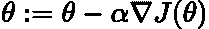
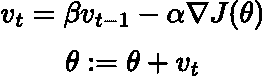
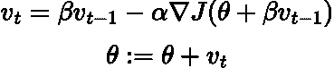
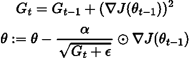
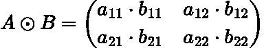
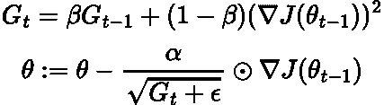
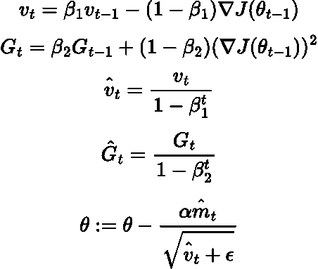
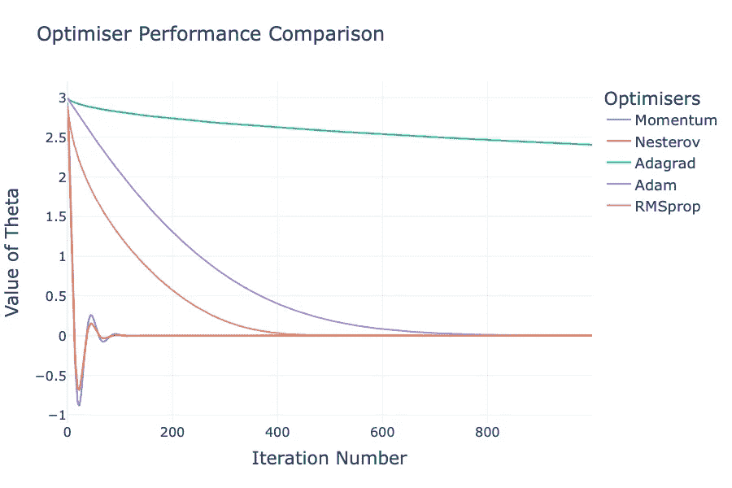

# 深度学习中的神经网络优化

> 原文：[`towardsdatascience.com/optimisation-algorithms-neural-networks-101-256e16a88412`](https://towardsdatascience.com/optimisation-algorithms-neural-networks-101-256e16a88412)

## 如何超越“普通”梯度下降算法改进训练

[](https://medium.com/@egorhowell?source=post_page-----256e16a88412--------------------------------)[](https://towardsdatascience.com/?source=post_page-----256e16a88412--------------------------------) [Egor Howell](https://medium.com/@egorhowell?source=post_page-----256e16a88412--------------------------------)

·发表于 [Towards Data Science](https://towardsdatascience.com/?source=post_page-----256e16a88412--------------------------------) ·8 分钟阅读·2023 年 11 月 24 日

--


[`www.flaticon.com/free-icons/neural-network`](https://www.flaticon.com/free-icons/neural-network).神经网络图标。神经网络图标由 andinur 创作 — Flaticon.

# 背景

在我上一篇文章中，我们讨论了如何通过***超参数调整***来提高神经网络的性能：

[](/hyperparameter-tuning-neural-networks-101-ca1102891b27?source=post_page-----256e16a88412--------------------------------) ## 超参数调整：神经网络基础

### 如何通过调整超参数来改善神经网络的“学习”和“训练”

towardsdatascience.com

这是一个过程，通过对学习率和隐藏层数量等最佳超参数进行“调整”，以找到对我们的网络性能最优的参数。

不幸的是，对于大型深度神经网络（[***深度学习***](https://en.wikipedia.org/wiki/Deep_learning)），这种调整过程极其缓慢。改进的一种方法是使用比传统“普通”梯度下降方法更*快速的优化器*。在这篇文章中，我们将深入探讨最流行的优化器和***梯度下降***的变体，这些可以提升训练速度以及收敛性，并在 PyTorch 中进行比较！

# 回顾：梯度下降

在深入之前，让我们快速复习一下梯度下降及其背后的理论。

梯度下降的目标是通过减去参数关于损失函数的梯度（偏导数）来更新模型的参数。学习率 ***α*** 用于调节此过程，以确保参数的更新在合理范围内进行，避免过度或不足地达到最优值。



梯度下降。方程由作者提供。

+   ***θ*** 是模型的参数。

+   ***J(θ)*** 是损失函数。

+   ***∇J(θ)*** 是损失函数的梯度。***∇*** 是梯度算子，也称为 [***nabla***](https://en.wikipedia.org/wiki/Nabla_symbol)。

+   ***α*** 是学习率。

我曾写过一篇关于梯度下降及其工作原理的文章，如果你想对它有更多了解，可以参考一下：

[](/why-gradient-descent-is-so-common-in-data-science-def3e6515c5c?source=post_page-----256e16a88412--------------------------------) ## 线性回归：梯度下降与解析解

### 解释了为什么梯度下降在数据科学中经常使用，并提供了 C 语言的实现

towardsdatascience.com

# 动量

梯度下降通常被可视化为一个球体在山坡上滚动。当它到达山谷底部时，它已经收敛到最小值，即最优值。一个持续向下滚动的球体会获得一定的 *动量*，然而，普通梯度下降是在每次迭代基础上进行的，并不了解之前的更新。

通过在梯度下降更新中包含动量，它为算法提供了关于先前计算的梯度的信息。

从数学上讲，我们得到的是：



动量梯度下降。方程由作者提供。

其中：

+   ***v_t*** 是当前的速度。

+   ***β*** 是动量系数，值在 0 和 1 之间。这有时也被解释为“*摩擦力*”。你需要找到最佳的 ***β*** 值，但通常 ***0.9*** 是一个不错的基准***。***

+   ***t*** 是当前的时间步长或迭代次数。

+   ***v_{t*−1}​*** 是前一步的速度（上一次计算的值）。

> 其余术语与之前对普通梯度下降的定义相同！

注意，我们利用了先前梯度的信息来‘加速’当前梯度的方向。这提高了收敛速度，并减少了普通梯度下降中可能出现的任何振荡。

动量在 [***PyTorch***](https://pytorch.org/docs/stable/optim.html) 中也很容易实现。

```py
optimizer = torch.optim.SGD([theta], lr=learning_rate, momentum=momentum)
```

# Nesterov 加速梯度

[***Nesterov 加速梯度***](https://golden.com/wiki/Nesterov_momentum-YX9WPE5) ***(NAG)***，或称为 Nesterov 动量，是对动量算法的轻微修改，通常能导致更好的收敛效果。

NAG 测量相对于损失函数的梯度时略微超前于 ***θ.*** 这改善了收敛性，因为 *动量* 值通常会朝着最优点前进。因此，每次允许算法略微前进一步可以使其更快收敛。



Nesterov 加速梯度下降。方程由作者编写。

其中 ***∇J(θ+βv_{t−1}​)*** 是在当前 ***θ*** 前稍微一点的损失函数的梯度。

> 上述方程中的所有术语与之前的优化器相同，因此我不会再次列出所有术语！

Nesterov 加速梯度也可以在 [***PyTorch***](https://pytorch.org/docs/stable/optim.html) 中轻松实现***：***

```py
optimizer = torch.optim.SGD([theta], lr=learning_rate, momentum=momentum, nesterov=True)
```

# AdaGrad

[***自适应梯度算法（Adagrad）***](https://optimization.cbe.cornell.edu/index.php?title=AdaGrad) 是一种梯度下降算法，它使用自适应学习率，如果特征/参数更新得更频繁，学习率会变得更小。换句话说，它对更陡峭的梯度比对较浅的梯度衰减更多。



Adagrad。方程由作者编写。

这里：

+   ***G***​ 是一个对角矩阵，积累了每个参数在时间步长内所有梯度的平方。

+   ***ϵ*** 是一个小的平滑项，用于避免当 ***G*** 非常小时的除零问题。

+   ***⊙*** 表示逐元素乘法。这是 [***Hadamard 乘积***](https://en.wikipedia.org/wiki/Hadamard_product_%28matrices%29)

> 上述方程中的其余术语与之前的优化器相同，因此我不会再次列出所有术语！

元素级矩阵乘法的一个例子，假设 ***A*** 和 ***B*** 都是 ***2x2***：



Hadamard 乘积的一个例子。方程由作者用 LaTeX 编写。

正如我们所看到的，***G*** 的值越大，对参数的更新就越小。它基本上是平方梯度的移动平均。这确保了学习过程变慢，不会超过最优点。

Adagrad 的一个问题是，它有时会使学习率衰减得太多，导致神经网络过早停止学习并陷入停滞。因此，通常不推荐在训练神经网络时使用 Adagrad。

```py
optimizer = torch.optim.Adagrad([theta], lr=learning_rate)
```

# RMSProp

[***RMSProp（均方根传播）***](https://deepchecks.com/glossary/rmsprop/#:~:text=RMSprop%20is%20an%20innovative%20stochastic,and%20other%20Machine%20Learning%20techniques.) 通过只考虑最近的梯度来解决 Adagrad 过早结束训练的问题。它通过引入另一个超参数 ***β*** 来做到这一点，从而缩小对对角矩阵 ***G*** 内部值的影响：



RMSProp。方程由作者用 LaTeX 编写。

> 上述方程中的所有项都与之前优化器的相同，所以我不会再次列出它们！

像其他优化器一样，RMSProp 在 PyTorch 中实现起来很简单：

```py
optimizer = torch.optim.RMSprop([theta], lr=learning_rate, alpha=alpha, eps=eps)
```

# Adam

我们将要看的最终优化器是[***自适应矩估计***](https://arxiv.org/abs/1412.6980)，更为人知的是*Adam*。该算法结合了动量和 RMSProp，因此可以说是两者的最佳结合。不过，它有几个额外的步骤：



Adam 优化器。公式由作者以 LaTeX 呈现。

前两个步骤和最后一步几乎是我们之前展示的动量和 RMSProp 算法。第三步和第四步是修正***v_t***和***G_t***的偏差，因为它们在开始时被初始化为 0。

Adam 是*自适应学习率*算法，类似于 RMSProp，因此使用此优化器时不一定需要调节学习率。

> 上述方程中的其他项与之前优化器相同，所以我不会再次列出它们！

以下是如何在 PyTorch 中应用 Adam：

```py
optimizer = torch.optim.Adam([theta], lr=learning_rate)
```

# 其他优化器

这里有许多其他梯度下降优化器，我们考虑的只是*一阶导数*，这些被称为[***雅可比矩阵***](https://en.wikipedia.org/wiki/Jacobian_matrix_and_determinant)。还有一种二阶导数，称为[***赫西矩阵***](https://en.wikipedia.org/wiki/Hessian_matrix)***,*** 但其计算复杂度为***O²***，而一阶导数的计算复杂度仅为***O***。

实际上，深度神经网络有数万到数百万行数据，因此赫西梯度下降方法很少使用。大多数情况下，金标准确实是 Adam 或 Nestorov。

还有批量、小批量和随机梯度下降，这些会影响网络的计算速度。我在[之前的文章中](https://medium.com/towards-data-science/hyperparameter-tuning-neural-networks-101-ca1102891b27)写过这些算法。

其他一些常用优化器包括：

+   [*Adamax*](https://arxiv.org/abs/1412.6980)

+   [*Nadam*](https://openreview.net/pdf?id=OM0jvwB8jIp57ZJjtNEZ)

+   [*ADAMW*](https://openreview.net/forum?id=rk6qdGgCZ)

完整的综合列表可以在[这里](https://github.com/harsh306/awesome-nn-optimization)找到。

# 性能比较

下面的代码是对我们之前讨论的不同优化器的比较，针对***J(θ) = θ²***损失函数。最小值在***θ = 0:***

```py
import torch
import plotly.graph_objects as go

# Function to perform optimisation and log theta
def optimize(optimizer_class, theta_init, lr, iterations, **kwargs):
    theta_values = []
    theta = torch.tensor([theta_init], requires_grad=True)
    optimizer = optimizer_class([theta], lr=lr, **kwargs)
    for _ in range(iterations):
        optimizer.zero_grad()
        loss = theta.pow(2)
        loss.backward()
        optimizer.step()
        theta_values.append(theta.item())
    return theta_values

# Initial values
theta_init = 3.0
learning_rate = 0.01
iterations = 1000

# Optimiser configurations
optim_configs = {
    "Momentum": {"optimizer_class": torch.optim.SGD, "lr": learning_rate, "momentum": 0.9},
    "Nesterov": {"optimizer_class": torch.optim.SGD, "lr": learning_rate, "momentum": 0.9, "nesterov": True},
    "Adagrad": {"optimizer_class": torch.optim.Adagrad, "lr": learning_rate},
    "Adam": {"optimizer_class": torch.optim.Adam, "lr": learning_rate},
    "RMSprop": {"optimizer_class": torch.optim.RMSprop, "lr": learning_rate}
}

# Run optimization for each optimizer and collect theta values
results = {}
for name, config in optim_configs.items():
    results[name] = optimize(**config, theta_init=theta_init, iterations=iterations)

# Plot the results
fig = go.Figure()

for optimiser, theta_values in results.items():
    fig.add_trace(go.Scatter(x=list(range(iterations)), y=theta_values, mode='lines', name=optimiser))

fig.update_layout(title="Optimiser Performance Comparison",
                  xaxis_title="Iteration Number",
                  yaxis_title="Value of Theta",
                  legend_title="Optimisers",
                  template="plotly_white",
                  width=900,
                  height=600,
                  font=dict(size=18),
                  xaxis=dict(tickfont=dict(size=16)),
                  yaxis=dict(tickfont=dict(size=16)),
                  title_font_size=24)

fig.show()
```



优化器比较。由作者使用 Python 绘制的图。

这个图很有趣，有几个关键点要指出：

+   *动量和 Nestorov 都超出了* ***θ.*** *的最优值。*

+   *Adagrad 非常慢。这与我们之前讨论的情况一致，即学习率迅速衰减，导致训练过早停止和学习停滞。*

+   *Adam 和 RMSProp 似乎是最好的，其中 RMSProp 更快地达到最优值。*

当然，这只是一个简单的示例，在实际问题中，最佳的优化器可能会有所不同。因此，尝试各种不同的优化器并选择表现最佳的往往是非常值得的。

这段代码可以在我的 GitHub 上找到：

[](https://github.com/egorhowell/Medium-Articles/blob/main/Neural%20Networks/optimisers.py?source=post_page-----256e16a88412--------------------------------) [## Medium-Articles/Neural Networks/optimisers.py at main · egorhowell/Medium-Articles

### 在我的中等博客/文章中使用的代码。通过创建帐户来贡献开发…

github.com](https://github.com/egorhowell/Medium-Articles/blob/main/Neural%20Networks/optimisers.py?source=post_page-----256e16a88412--------------------------------)

# 摘要与进一步的思考

在这篇文章中，我们看到了几种加速和提高普通梯度下降性能的方法。这两种方法类型是基于动量的，使用来自先前梯度的信息，以及基于自适应的，依据计算出的梯度调整学习率。在文献中，Adam 优化器通常是最推荐和最常用于研究的优化器。然而，尝试不同的优化器总是值得的，以确定哪种最适合你的模型。

# 另一个话题！

我有一个免费的新闻通讯，[**分析数据**](https://dishingthedata.substack.com/)，我每周分享成为更好的数据科学家的技巧。没有“虚 fluff”或“点击诱饵”，只有来自实践数据科学家的纯粹可操作的见解。

[](https://newsletter.egorhowell.com/?source=post_page-----256e16a88412--------------------------------) [## 分析数据 | Egor Howell | Substack

### 如何成为更好的数据科学家。点击阅读《分析数据》，由 Egor Howell 编写，Substack 出版…

[新闻通讯](https://newsletter.egorhowell.com/?source=post_page-----256e16a88412--------------------------------)

# 与我联系！

+   [**YouTube**](https://www.youtube.com/@egorhowell)

+   [**LinkedIn**](https://www.linkedin.com/in/egor-howell-092a721b3/)

+   [**Twitter**](https://twitter.com/EgorHowell)

+   [**GitHub**](https://github.com/egorhowell)

# 参考文献与进一步阅读

+   [*Andrej Karpathy 神经网络课程*](https://www.youtube.com/watch?v=i94OvYb6noo)

+   [*PyTorch 官网*](https://pytorch.org/)

+   [*动手机器学习：Scikit-Learn、Keras 和 TensorFlow，第 2 版。Aurélien Géron。2019 年 9 月。出版社：O’Reilly Media, Inc. ISBN: 9781492032649*](https://www.oreilly.com/library/view/hands-on-machine-learning/9781492032632/)*.*

+   *关于优化神经网络的优秀博客*

这是我关于神经网络的其他一些可能感兴趣的博客：

[](/activation-functions-non-linearity-neural-networks-101-ab0036a2e701?source=post_page-----256e16a88412--------------------------------) ## 激活函数与非线性：神经网络 101

### 解释神经网络为何能学习（几乎）任何事物和一切

[towardsdatascience.com [](/forward-pass-backpropagation-neural-networks-101-3a75996ada3b?source=post_page-----256e16a88412--------------------------------) ## 前向传播与反向传播：神经网络基础

### 通过手动和代码（使用 PyTorch）解释神经网络如何“训练”和“学习”数据中的模式

[towardsdatascience.com
