# 优化：Python 中的容量限制设施选址问题

> 原文：[`towardsdatascience.com/optimization-capacitated-facility-location-problem-in-python-57c08f259fe0`](https://towardsdatascience.com/optimization-capacitated-facility-location-problem-in-python-57c08f259fe0)

## 查找最佳的仓库数量和位置以降低成本并满足需求

[](https://nicolo-albanese.medium.com/?source=post_page-----57c08f259fe0--------------------------------)[](https://towardsdatascience.com/?source=post_page-----57c08f259fe0--------------------------------) [Nicolo Cosimo Albanese](https://nicolo-albanese.medium.com/?source=post_page-----57c08f259fe0--------------------------------)

·发表于 [Towards Data Science](https://towardsdatascience.com/?source=post_page-----57c08f259fe0--------------------------------) ·阅读时间 12 分钟·2023 年 2 月 28 日

--

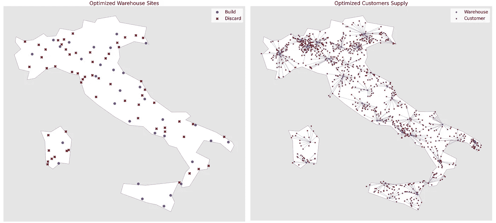

图片由作者提供。

# 目录

1.  简介

1.  问题陈述

1.  实现

    3.1\. 数据集

    3.2\. 客户、仓库和需求

    3.3\. 供应和固定成本

    3.4\. 运输成本

    3.5\. 优化

1.  探索结果

1.  结论

# 1\. 引言

*设施选址问题（FLPs）* 是经典的优化任务。它们的目标是确定仓库或工厂的最佳潜在位置。

仓库可能有或没有容量限制。这将 *有容量（CFLP）* 与 *无容量（UFLP）* 问题变体区分开来。

业务目标是找到一组能够最小化成本的仓库位置。原始问题定义由 [Balinski (1965)](https://doi.org/10.1287/mnsc.12.3.253) 提出了两个（年度）成本因素之和的最小化：

+   运输成本

+   仓库固定成本

运输成本指的是从仓库位置到客户的费用。仓库固定成本是特定于位置的。它可能包括如租金、税费、电费和维护等费用。

*设施选址* 是一个众所周知的主题，具有相当丰富的文献。因此，存在许多问题变体以及方法。这篇文章介绍了经典的 CFLP 公式，并分享了一个使用 [PuLP](https://coin-or.github.io/pulp/) 的实际 Python 示例。

# 2\. 问题陈述

CFLP 的目标是确定能够满足客户需求的仓库数量和位置，同时降低固定和运输成本。因此，我们可以将问题表述为以下目标函数的最小化：

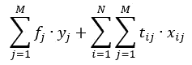

在前一个表达式中：

+   `N`是客户地点的集合。

+   `M`是候选仓库地点的集合。

+   `fⱼ`表示仓库`j`的年固定成本。

+   `tᵢⱼ`表示从仓库`j`到客户`i`的运输成本。

+   `xᵢⱼ`是从仓库`j`到客户`i`的单位数。

+   `yⱼ`是一个二进制变量`yⱼ ∈ {0,1}`，表示是否在位置`j`建立仓库（`yⱼ = 1`）或不建立（`yⱼ = 0`）。

现在让我们考虑将**约束**添加到目标函数中。

由于我们正在建模一个*有容量限制*的问题，每个设施`j`可以供应的年最大容量为`Cⱼ`。因此，交付给客户的单位数`xᵢⱼ`不能超过此值：

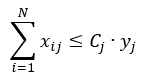

从仓库`j`到客户`i`的年交付单位数必须在零到`dᵢ`之间，其中`dᵢ`是客户`i`的年需求：

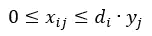

最后但同样重要的是，我们必须满足客户的需求。在这个示例中，我们规定每个服务客户地点的仓库必须完全满足其需求：

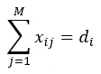

总之，我们可以如下定义问题：

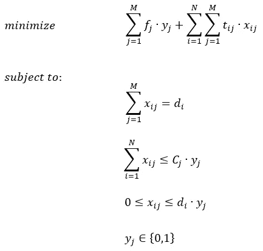

图片由作者提供。

# 3\. 实施

让我们导入所需的库：

+   `NumPy`、`Pandas`用于数据处理。

+   `math`用于特定的数学函数。

+   `GeoPandas`用于地理空间表示。

+   `Matplotlib`用于数据可视化。

+   `PuLP`用于优化。

```py
import numpy as np
import pandas as pd
import geopandas
from math import sin, cos, asin, acos, radians

from pulp import LpProblem, LpMinimize, LpVariable, LpBinary, lpSum, LpStatus, value

import matplotlib.pyplot as plt
plt.style.use('ggplot')
```

## 3.1\. 数据集

我们在意大利设定优化问题。

起始数据集可以在 [simplemaps.com](https://simplemaps.com/) 上获得。我们可以从[这里](https://simplemaps.com/data/it-cities)下载输入 csv 文件，并在[MIT 许可证](https://opensource.org/license/mit/)下[个人和商业用途均可自由使用](https://simplemaps.com/data/it-cities)。

```py
# Load dataframe
df = pd.read_csv(
    './it.csv', 
    usecols = ['city', 'lat', 'lng', 'population', 'capital', 'admin_name'])
```

我们感兴趣的是以下列：

+   `city`: 城镇名称；

+   `lat`: 纬度；

+   `lng`: 经度；

+   `population`: 居民数量；

+   `capital`: 表示城市是否是主要城市或行政中心；

+   `admin_name`: [最高级别行政区域](https://en.wikipedia.org/wiki/Regions_of_Italy)的名称。

## 3.2\. 客户、仓库和需求

在创建客户、设施和需求时，我们假设：

+   客户是输入城市的一部分（30%）。

+   设施只能在行政中心建立。作为起始条件，我们假设我们可以在意大利 80%的主要城市建立仓库。

+   需求是恒定且全年已知的。它等于客户城镇人口的一个部分（2%）加上一个误差项。

```py
RANDOM_STATE = 2          # For reproducibility
FRACTION_CUSTOMERS = 0.3  # Fraction of cities we want to keep as customers
FRACTION_WAREHOUSES = 0.8 # Fraction of cities we want to keep as warehouse locations
FRACTION_DEMAND = 0.02    # Fraction of citizens of a city that may order a product  

# List of the 20 regions of Italy
REGION_LIST = [
    'Lombardy', 'Veneto', 'Emilia-Romagna', 'Sicilia', 'Campania', 'Piedmont', 'Puglia', 
    'Lazio', 'Calabria', 'Tuscany', 'Sardegna', 'Marche', 'Friuli-Venezia Giulia', 'Abruzzo',
    'Umbria', 'Trentino-Alto Adige', 'Liguria', 'Basilicata', 'Molise', 'Valle d’Aosta']

# Demand is composed of: 
#   1\. A fraction of the population
#   2\. An error term of uniform distribution
# Note: demand is approximated to the closest int 
# as its physical meaning denies decimals
df['demand'] = np.floor(
    FRACTION_DEMAND * df.population + np.random.uniform(-10, 10, size=(df.shape[0],)))

# Create the warehouses dataframe:
#   1\. Filter the 20 regions of Italy
#   2\. Filter capitals as candidate warehouse locations
#   3\. Sample a fraction of the original cities
facility_df = df.\
                loc[df.admin_name.isin(REGION_LIST)].\
                loc[df.capital.isin(['admin', 'minor'])].\
                sample(frac=FRACTION_WAREHOUSES, random_state=RANDOM_STATE, ignore_index=True)

# Create the customers dataframe:
#   1\. Filter the 20 regions of Italy
#   2\. Sample a fraction of the original cities
customer_df = df.\
                loc[df.admin_name.isin(REGION_LIST)].\
                sample(frac=FRACTION_CUSTOMERS, random_state=RANDOM_STATE, ignore_index=True)

# Customers IDs list
customer_df['customer_id'] = range(1, 1 + customer_df.shape[0])
```

***注意***：在在线数据集中，区域名称`Valle d'Aosta`包含的是排版（弯曲）撇号（U+2019），而不是打字机（直线）撇号（U+0027）。如果复制此代码，请考虑到这一点。

尽管这对于优化任务不是必需的，但我们可能希望在地图上观察我们的地点。`geopandas`简化了这一任务。可以使用`points_from_xy`方法轻松创建一个充满地理空间信息的`GeoDataFrame`：

```py
def add_geocoordinates(df, lat='lat', lng='lng'):
    '''
    Add column "geometry" with <shapely.geometry.point.Point> objects 
        built from latitude and longitude values in the input dataframe

    Args:
        - df: input dataframe
        - lat: name of the column containing the latitude (default: lat)
        - lng: name of the column containing the longitude (default: lng)
    Out:
        - df: same dataframe enriched with a geo-coordinate column
    '''
    assert pd.Series([lat, lng]).isin(df.columns).all(),\
        f'Cannot find columns "{lat}" and/or "{lng}" in the input dataframe.'
    return geopandas.GeoDataFrame(
        df, geometry=geopandas.points_from_xy(df.lng, df.lat))

customer_df = add_geocoordinates(customer_df)
facility_df = add_geocoordinates(facility_df)
```

我们可以通过`geopandas`访问意大利的地图，并绘制客户和潜在的仓库位置：

```py
# Prepare country plot
world = geopandas.read_file(geopandas.datasets.get_path('naturalearth_lowres'))

# Extract and plot the shape of Italy
italy = world[world.name == 'Italy']
ax = italy.plot(color='white', edgecolor='black', figsize=(10, 10))

# Plot customers as points
customer_df.\
    plot(ax=ax, marker='X', color='red', markersize=30, alpha=0.5, label='Customer')

# Plot potential facility locations as points
facility_df.\
    plot(ax=ax, marker='D', color='blue', markersize=30, alpha=0.5, label='Potential warehouse')

# Add legend
plt.legend(facecolor='white', title='Location')

# Add title
plt.title('Customer and potential warehouses')

# Remove ticks from axis
plt.xticks([])
plt.yticks([])

# Show plot
plt.show()
```

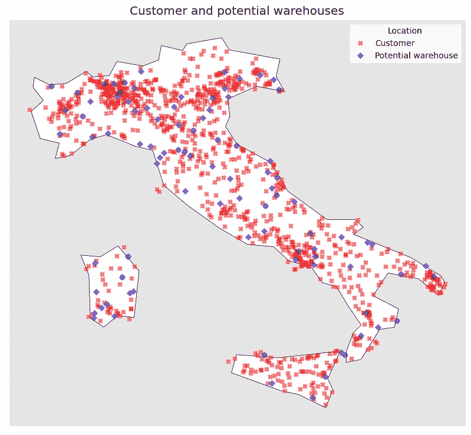

图片由作者提供。

同样，我们可以观察到 20 个意大利地区的平均需求：

```py
# Prepare region dataframe:
#   1\. Filter the 20 regions of Italy
#   2\. Group by region
#   3\. Calculate:
#      - Mean regional latitude
#      - Mean regional longitude
#      - Sum of regional demand
region_df = df.\
             loc[df.admin_name.isin(REGION_LIST)].\
             groupby(['admin_name']).\
             agg({'lat': 'mean', 'lng': 'mean', 'demand': 'sum'}).\
             reset_index()

# Add geo-coordinates
region_df = add_geocoordinates(region_df)

# Plot the shape of Italy
ax = italy.plot(color='white', edgecolor='black', figsize=(10, 10))

# Plot region area colored based on demand
region_df.\
    plot(ax=ax, column='demand', marker='o', c='demand', cmap='plasma', markersize=2500, alpha=0.6)

# Add region 'center' as red dots
region_df.\
    plot(ax=ax, marker='o', c='red', markersize=25, alpha=0.8, label='Customer location')

# Add region name above the center
for i, row in region_df.iterrows():
    plt.annotate(
        row.admin_name, xy=(row.lng, row.lat+0.2), horizontalalignment='center')

# Add color bar with demand scale
plt.colorbar(ax.get_children()[1], ax=ax, label='Annual Demand', fraction=0.04, pad=0.04) 

# Add title
plt.title('Annual demand by region')

# Remove ticks from axis
plt.xticks([])
plt.yticks([])

# Show plot
plt.show()
```

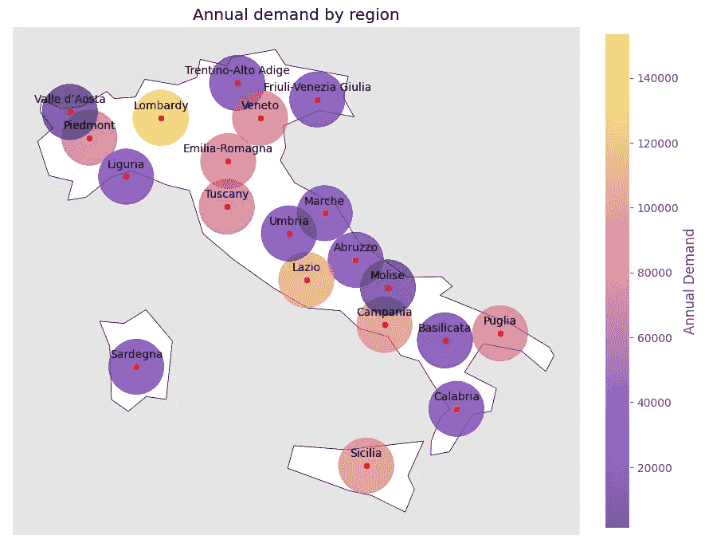

图片由作者提供。

为了方便以后使用`PuLP`，让我们将需求数据存储在`customer-demand`对的字典中：

```py
# Dictionary of cutomer id (id) and demand (value)
demand_dict = { customer : customer_df['demand'][i] for i, customer in enumerate(customer_df['customer_id']) }
```

## 3.3\. 供应和固定成本

为了建模供应和固定成本，我们假设：

+   每个仓库可以满足的最大年度供应量等于平均区域需求的 3 倍。

+   每个仓库都有一个固定的年成本为 100.000,00 €，与其位置无关。

与需求相同，我们将供应和固定成本存储在字典中：

```py
# Assumptions: 
#    1\. Each warehouse has an annual cost of 100.000,00 euros: rent, electricity, ...
#    2\. Each warehouse can meet 3 times the regional average annual demand
COST_PER_WAREHOUSE = 100_000
SUPPLY_FACTOR_PER_WAREHOUSE = 3
SUPPLY_PER_WAREHOUSE = region_df.demand.mean() * SUPPLY_FACTOR_PER_WAREHOUSE

# Warehouses list
facility_df['warehouse_id'] = ['Warehouse ' + str(i) for i in range(1, 1 + facility_df.shape[0])]

# Dictionary of warehouse id (id) and max supply (value)
annual_supply_dict = { warehouse : SUPPLY_PER_WAREHOUSE for warehouse in facility_df['warehouse_id'] }

# Dictionary of warehouse id (id) and fixed costs (value)
annual_cost_dict = { warehouse : COST_PER_WAREHOUSE for warehouse in facility_df['warehouse_id'] }
```

## 3.4\. 运输成本

运输成本的估算需要：

+   不同位置之间的距离，以及

+   每单位距离的成本函数。

我们可以使用[哈弗森公式](https://en.wikipedia.org/wiki/Haversine_formula)来近似两个位置之间的距离：

```py
def haversine_distance(lat1, lon1, lat2, lon2):
    '''
    Calculate distance between two locations given latitude and longitude.

    Args:
       - lat1: latitude of the first location
       - lon1: longitude of the first location
       - lat2: latitude of the second location
       - lon2: longitude of the second location
    Out:
       - Distance in Km

    Ref: 
       - https://en.wikipedia.org/wiki/Haversine_formula
    '''
    return 6371.01 *\
            acos(sin(radians(lat1))*sin(radians(lat2)) +\
            cos(radians(lat1))*cos(radians(lat2))*cos(radians(lon1)-radians(lon2)))
```

让我们在两个城市上尝试一下：

+   米兰（纬度：45.4654219，经度：9.18854）

+   贝尔加莫（纬度：45.695000，经度：9.670000）

```py
haversine_distance(45.4654219, 9.1859243, 45.695000, 9.670000)
```

```py
45.508144765533906
```

我们得到的距离为 45.5 公里。不幸的是，这个度量与我们在汽车导航系统上看到的距离不一致，因为我们没有考虑路线：

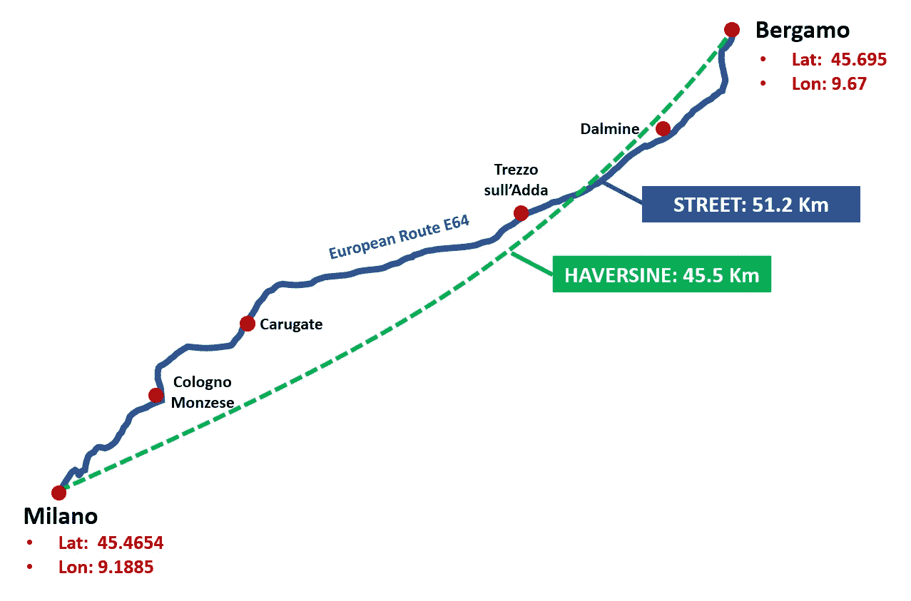

米兰和贝尔加莫之间的哈弗森距离和路线距离。图片由作者提供。

尽管如此，我们可以使用我们的估算作为任务的合理近似。

最后，我们需要将距离转换为成本度量。目前在写作时，意大利的平均汽油价格为 1.87 €/L（[来源](https://www.cargopedia.net/europe-fuel-prices)）。一辆 EURO VI 卡车的平均耗油量约为 0.38 L/Km（[来源](https://www.transportenvironment.org/wp-content/uploads/2021/07/2015_06_Comparing_US_EU_truck_fuel_economy_explantory_note_Final.pdf)）。通过一个简单但合理的近似，我们可以估算在意大利土地上每公里的平均成本为 0.71 €：

```py
def traveling_cost(distance_in_km):
    '''
    Return traveling cost in euros given a distance in Km.

    Args:
      - distance_in_km: travel distance in Km
    Out:
      - cost of the trip in euros
    '''
    return 0.71 * distance_in_km
```

现在我们可以计算每个仓库-客户对的旅行成本，并将其存储在字典中：

```py
# Dict to store the distances between all warehouses and customers
transport_costs_dict = {}

# For each warehouse location
for i in range(0, facility_df.shape[0]):

    # Dict to store the distances between the i-th warehouse and all customers
    warehouse_transport_costs_dict = {}

    # For each customer location
    for j in range(0, customer_df.shape[0]):

        # Distance in Km between warehouse i and customer j
        d = 0 if facility_df.city[i]==customer_df.city[j] else haversine_distance(
            facility_df.lat[i], facility_df.lng[i], customer_df.lat[j], customer_df.lng[j])

        # Update costs for warehouse i
        warehouse_transport_costs_dict.update({customer_df.customer_id[j]: traveling_cost(d)})

    # Final dictionary with all costs for all warehouses
    transport_costs_dict.update({facility_df.warehouse_id[i]: warehouse_transport_costs_dict})
```

## 3.5\. 优化

让我们回顾一下优化问题：


图片由作者提供。

我们可以定义两个决策变量`xᵢⱼ`和`yⱼ`，目标函数和约束条件如下：

```py
# Define linear problem
lp_problem = LpProblem('CFLP', LpMinimize)

# Variable: y_j (constraint: it is binary)
created_facility = LpVariable.dicts(
    'Create_facility', facility_df['warehouse_id'], 0, 1, LpBinary)

# Variable: x_ij
served_customer = LpVariable.dicts(
    'Link', [(i,j) for i in customer_df['customer_id'] for j in facility_df['warehouse_id']], 0)

# Objective function 
objective = lpSum(annual_cost_dict[j]*created_facility[j] for j in facility_df['warehouse_id']) +\
            lpSum(transport_costs_dict[j][i]*served_customer[(i,j)] \
                  for j in facility_df['warehouse_id'] for i in customer_df['customer_id'])

lp_problem += objective

# Costraint: the demand must be met
for i in customer_df['customer_id']:
    lp_problem += lpSum(served_customer[(i,j)] for j in facility_df['warehouse_id']) == demand_dict[i]

# Constraint: a warehouse cannot deliver more than its capacity limit
for j in facility_df['warehouse_id']:
    lp_problem += lpSum(served_customer[(i,j)] for i in customer_df['customer_id']) <= annual_supply_dict[j] * created_facility[j]

# Constraint: a warehouse cannot give a customer more than its demand
for i in customer_df['customer_id']:
    for j in facility_df['warehouse_id']:
        lp_problem += served_customer[(i,j)] <= demand_dict[i] * created_facility[j]
```

我们可以解决优化问题：

```py
lp_problem.solve()
```

我们可以如下检查结果：

```py
print('Solution: ', LpStatus[lp_problem.status])
```

```py
Solution: Optimal
```

我们现在对探索决策变量感兴趣：我们需要多少个仓库？它们的位置在哪里？

# 4\. 探索结果

首先，让我们考虑商业目标：最小化成本。我们可以检查目标函数的值：

```py
value(lp_problem.objective)
```

```py
8964323.323646087
```

这是在给定约束条件下我们可以实现的最低成本。任何其他仓库数量或位置的选择都会导致目标函数值更高。

我们可以通过`varValue`属性访问决策变量。例如，我们可以查看`yⱼ`在`j = 仓库 1`时的值：

```py
created_facility['Warehouse 1'].varValue
```

```py
1.0
```

由于`yⱼ = 1`，我们应在该位置建立一个仓库。我们可以轻松地操作变量并计算所需设施的数量：

```py
# List of the values assumed by the binary variable created_facility
facility_values = [i.varValue for i in created_facility.values()]

# Count of each distinct value of the list
[[i, facility_values.count(i)] for i in set(facility_values)]
```

```py
[[0.0, 59], [1.0, 32]]
```

**只需建造最初预算的 91 个地点中的 32 个**即可。35.1%（32 / 91）的潜在仓库足以满足在给定约束条件下的需求。

我们可以将决策变量保存到初始数据框中，并观察所选择的位置：

```py
# Create dataframe column to store whether to build the warehouse or not 
facility_df['build_warehouse'] = ''

# Assign Yes/No to the dataframe column based on the optimization binary variable
for i in facility_df['warehouse_id']:
    if created_facility[i].varValue == 1:
        print('Build site at: ', i)
        facility_df.loc[facility_df['warehouse_id'] == i, 'build_warehouse'] = 'Yes'
    else:
        facility_df.loc[facility_df['warehouse_id'] == i, 'build_warehouse'] = 'No'
```

```py
Build site at:  Warehouse 1
Build site at:  Warehouse 2
Build site at:  Warehouse 3
Build site at:  Warehouse 4
Build site at:  Warehouse 7
Build site at:  Warehouse 8
Build site at:  Warehouse 16
Build site at:  Warehouse 18
Build site at:  Warehouse 20
Build site at:  Warehouse 21
Build site at:  Warehouse 22
Build site at:  Warehouse 23
Build site at:  Warehouse 25
Build site at:  Warehouse 26
Build site at:  Warehouse 27
Build site at:  Warehouse 29
Build site at:  Warehouse 33
Build site at:  Warehouse 35
Build site at:  Warehouse 38
Build site at:  Warehouse 48
Build site at:  Warehouse 49
Build site at:  Warehouse 55
Build site at:  Warehouse 56
Build site at:  Warehouse 57
Build site at:  Warehouse 58
Build site at:  Warehouse 63
Build site at:  Warehouse 66
Build site at:  Warehouse 70
Build site at:  Warehouse 74
Build site at:  Warehouse 82
Build site at:  Warehouse 83
Build site at:  Warehouse 84
```

```py
colors = ['#990000', '#0059b3']

facility_df.build_warehouse.value_counts().plot.barh(
  title='Warehouse sites to be established', xlabel='Number of sites', color=colors, ylabel='Establish', figsize=(7,6)) 

for i, v in enumerate(facility_df.build_warehouse.value_counts()):
    plt.text(v, i, ' '+str(round(v,3)), color=colors[i], va='center', fontweight='bold')
```

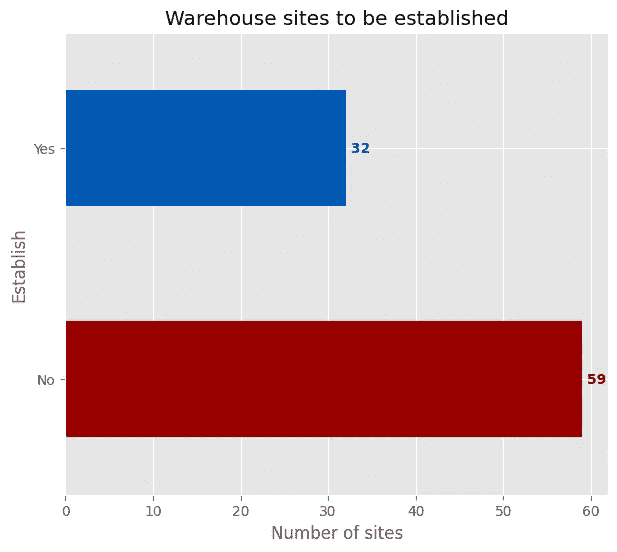

图片来源于作者。

```py
# Plot the shape of Italy
ax = italy.plot(color='white', edgecolor='black', figsize=(10, 10))

# Plot sites to establish
facility_df.\
    loc[facility_df.build_warehouse =='Yes'].\
    plot(ax=ax, marker='o', c='#0059b3', markersize=50, label='Build')

# Plot sites to discard
facility_df.\
    loc[facility_df.build_warehouse =='No'].\
    plot(ax=ax, marker='X', c='#990000', markersize=40, label='Discard')

# Add title
plt.title('Optimized Warehouse Sites')

# Add legend
plt.legend(title='Warehouse Site', facecolor='white')

# Remove ticks from axis
plt.xticks([])
plt.yticks([])

# Show plot
plt.show()
```

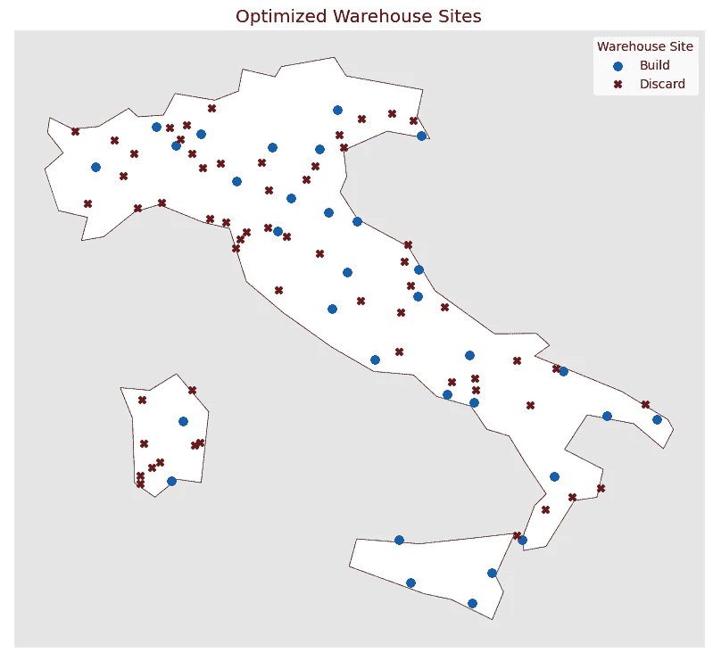

图片来源于作者。

同样，我们可以遍历决策变量`xᵢⱼ`，找到优化解中每个仓库服务的客户：

```py
def get_linked_customers(input_warehouse):
    '''
    Find customer ids that are served by the input warehouse.

    Args:
        - input_warehouse: string (example: <Warehouse 21>)
    Out:
        - List of customers ids connected to the warehouse
    '''
    # Initialize empty list
    linked_customers = []

    # Iterate through the xij decision variable
    for (k, v) in served_customer.items():

            # Filter the input warehouse and positive variable values
            if k[1]==input_warehouse and v.varValue>0:

                # Customer is served by the input warehouse
                linked_customers.append(k[0])

    return linked_customers

# Warehouses to establish
establish = facility_df.loc[facility_df.build_warehouse =='Yes']

# Plot the shape of Italy
ax = italy.plot(color='white', edgecolor='black', figsize=(30, 30))

# Plot sites to establish
establish.\
    plot(ax=ax, marker='o', c='#0059b3', markersize=100, label='Warehouse')

# Plot customers
customer_df.\
    plot(ax=ax, marker='X', color='#990000', markersize=80, alpha=0.8, label='Customer')

# For each warehouse to build
for w in establish.warehouse_id:

    # Extract list of customers served by the warehouse
    linked_customers = get_linked_customers(w)

    # For each served customer
    for c in linked_customers:

        # Plot connection between warehouse and the served customer
        ax.plot(
         [establish.loc[establish.warehouse_id==w].lng, customer_df.loc[customer_df.customer_id==c].lng],
         [establish.loc[establish.warehouse_id==w].lat, customer_df.loc[customer_df.customer_id==c].lat],
         linewidth=0.8, linestyle='--', color='#0059b3')

# Add title
plt.title('Optimized Customers Supply', fontsize = 35)

# Add legend
plt.legend(facecolor='white', fontsize=30)

# Remove ticks from axis
plt.xticks([])
plt.yticks([])

# Show plot
plt.show()
```

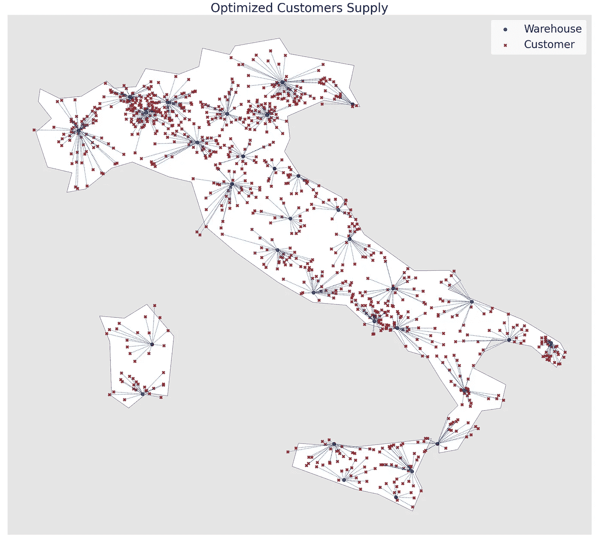

图片来源于作者。

# 5. 结论

在这篇文章中，我们介绍了一个经典的优化挑战：**容量受限设施选址问题**（CFLP）。我们描述了它的推导过程，并分享了一个实用的 Python 示例。特别地，由于我们从一个原始的地理位置数据集开始，我们覆盖了所有框架问题和求解问题所需的必要步骤和假设。
