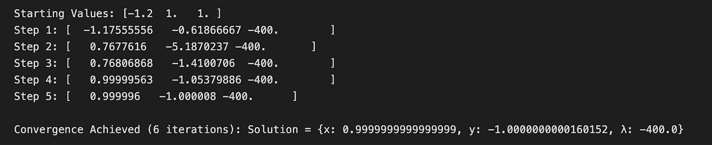
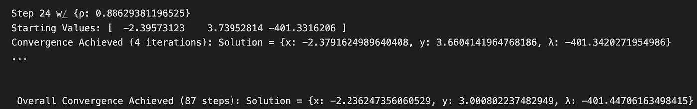

# 优化、牛顿法与利润最大化：第二部分——约束优化理论

> 原文：[`towardsdatascience.com/optimization-newtons-method-profit-maximization-part-2-constrained-optimization-theory-dc18613c5770?source=collection_archive---------9-----------------------#2023-02-02`](https://towardsdatascience.com/optimization-newtons-method-profit-maximization-part-2-constrained-optimization-theory-dc18613c5770?source=collection_archive---------9-----------------------#2023-02-02)


作者提供的所有图片

## 了解如何扩展牛顿法并解决约束优化问题

[](https://medium.com/@jakepenzak?source=post_page-----dc18613c5770--------------------------------)[](https://towardsdatascience.com/?source=post_page-----dc18613c5770--------------------------------) [Jacob Pieniazek](https://medium.com/@jakepenzak?source=post_page-----dc18613c5770--------------------------------)

·

[关注](https://medium.com/m/signin?actionUrl=https%3A%2F%2Fmedium.com%2F_%2Fsubscribe%2Fuser%2F6f0948d99b1c&operation=register&redirect=https%3A%2F%2Ftowardsdatascience.com%2Foptimization-newtons-method-profit-maximization-part-2-constrained-optimization-theory-dc18613c5770&user=Jacob+Pieniazek&userId=6f0948d99b1c&source=post_page-6f0948d99b1c----dc18613c5770---------------------post_header-----------) 发表在 [Towards Data Science](https://towardsdatascience.com/?source=post_page-----dc18613c5770--------------------------------) ·13 分钟阅读·2023 年 2 月 2 日[](https://medium.com/m/signin?actionUrl=https%3A%2F%2Fmedium.com%2F_%2Fvote%2Ftowards-data-science%2Fdc18613c5770&operation=register&redirect=https%3A%2F%2Ftowardsdatascience.com%2Foptimization-newtons-method-profit-maximization-part-2-constrained-optimization-theory-dc18613c5770&user=Jacob+Pieniazek&userId=6f0948d99b1c&source=-----dc18613c5770---------------------clap_footer-----------)

--

[](https://medium.com/m/signin?actionUrl=https%3A%2F%2Fmedium.com%2F_%2Fbookmark%2Fp%2Fdc18613c5770&operation=register&redirect=https%3A%2F%2Ftowardsdatascience.com%2Foptimization-newtons-method-profit-maximization-part-2-constrained-optimization-theory-dc18613c5770&source=-----dc18613c5770---------------------bookmark_footer-----------)

> 这篇文章是一个三部分系列中的**第二部分**。在[第一部分](https://medium.com/towards-data-science/optimization-newtons-method-profit-maximization-part-1-basic-optimization-theory-ff7c5f966565)中，我们研究了基本的优化理论。现在，在第二部分中，我们将把这一理论扩展到受限优化问题。最后，在第三部分中，我们将应用所涵盖的优化理论，以及计量经济学和经济理论，来解决一个利润最大化问题。

考虑以下问题：你想确定在特定金融工具上投资多少资金以最大化你的投资回报。然而，单纯最大化投资回报的问题过于宽泛和简单。由于其简单性，解决方案就是将*所有*资金投入到回报潜力最高的金融工具中。显然，这不是一个好的投资策略；那么，我们如何改进呢？*通过对投资决策施加约束，我们的选择变量。* 例如，我们可以指定约束条件，比如 1) 限制我们愿意承担的金融风险量（见[现代投资组合理论](https://en.wikipedia.org/wiki/Modern_portfolio_theory)），或者 2) 指定我们投资组合中每类金融工具（如股票、债券、衍生品等）的分配比例——可能性无穷无尽。注意，当我们添加约束时，这个问题变得显著更具可处理性。尽管这是一个简单的例子，但它有助于捕捉受限优化的一个基本动机：

> 受限优化的本质在于为无约束优化问题提供一种适用性和解决复杂现实世界问题的能力。

受限优化被定义为“在变量受到约束的情况下，对目标函数进行优化的过程。”[1] 添加对变量的约束将一个无约束的、或许是难以处理的优化问题转化为一个有助于建模和解决现实世界问题的问题。然而，添加约束可能将一个简单的优化问题转变为一个不再是微不足道的问题。在这篇文章中，我们将深入探讨一些可以添加到我们工具箱中的技术，以扩展在[第一部分](https://medium.com/towards-data-science/optimization-newtons-method-profit-maximization-part-1-basic-optimization-theory-ff7c5f966565)中学习的无约束优化理论，从而解决受限优化问题。

> 在 [第一部分](https://medium.com/towards-data-science/optimization-newtons-method-profit-maximization-part-1-basic-optimization-theory-ff7c5f966565)中，我们介绍了基本的优化理论——包括 1) 解析设置和解决一个简单的单变量优化问题，2) 迭代优化方案——即梯度下降法和牛顿法，以及 3) 手动和使用 Python 实现牛顿法用于多维优化问题。本文旨在使那些已经熟悉 [第一部分](https://medium.com/towards-data-science/optimization-newtons-method-profit-maximization-part-1-basic-optimization-theory-ff7c5f966565) 中内容的读者能够轻松理解。

## 约束优化基础（& [第一部分](https://medium.com/towards-data-science/optimization-newtons-method-profit-maximization-part-1-basic-optimization-theory-ff7c5f966565) 回顾）

一个数学优化问题可以抽象地表示如下：


(1)

在这里，我们选择 **x** 的实际值，以最小化 *目标函数* *f*(**x**)（或最大化 -*f*(**x**）），同时满足 *不等式约束* *g*(**x**) 和 *等式约束* *h*(**x**)。在 [第一部分](https://medium.com/towards-data-science/optimization-newtons-method-profit-maximization-part-1-basic-optimization-theory-ff7c5f966565) 中，我们讨论了如何在没有 *g*(**x**) 和 *h*(**x**) 的情况下解决这些问题，现在我们将这些约束重新引入到我们的优化问题中。首先，让我们简明扼要地回顾如何实现牛顿法用于无约束问题。

回顾一下，我们可以使用泰勒级数展开来近似最小值的一阶必要条件：


(2)

其中 **H**(**x**) 和 **∇***f*(**x**) 分别表示 **f**(**x**) 的 Hessian 矩阵和梯度。每次迭代增加的 delta, **Δ,** 是对最优值 **x*** 的预期更好近似。因此，每次使用牛顿法的迭代步骤可以表示如下：


(3) 牛顿法迭代方案

我们执行这个方案直到在以下一个或多个标准上达到收敛：


(4) 迭代优化方案的收敛标准

将其转化为 Python 代码，我们使用 [SymPy](https://www.sympy.org/en/index.html) —— 一个用于符号数学的 Python 库 —— 并创建可泛化的函数来计算梯度、计算 Hessian 矩阵，并实现牛顿法用于 *n* 维函数：

```py
import sympy as sm
import numpy as np

def get_gradient(
    function: sm.core.expr.Expr,
    symbols: list[sm.core.symbol.Symbol],
    x0: dict[sm.core.symbol.Symbol, float],
) -> np.ndarray:
    """
    Calculate the gradient of a function at a given point.

    Args:
        function (sm.core.expr.Expr): The function to calculate the gradient of.
        symbols (list[sm.core.symbol.Symbol]): The symbols representing the variables in the function.
        x0 (dict[sm.core.symbol.Symbol, float]): The point at which to calculate the gradient.

    Returns:
        numpy.ndarray: The gradient of the function at the given point.
    """
    d1 = {}
    gradient = np.array([])

    for i in symbols:
        d1[i] = sm.diff(function, i, 1).evalf(subs=x0)
        gradient = np.append(gradient, d1[i])

    return gradient.astype(np.float64)

def get_hessian(
    function: sm.core.expr.Expr,
    symbols: list[sm.core.symbol.Symbol],
    x0: dict[sm.core.symbol.Symbol, float],
) -> np.ndarray:
    """
    Calculate the Hessian matrix of a function at a given point.

    Args:
    function (sm.core.expr.Expr): The function for which the Hessian matrix is calculated.
    symbols (list[sm.core.symbol.Symbol]): The list of symbols used in the function.
    x0 (dict[sm.core.symbol.Symbol, float]): The point at which the Hessian matrix is evaluated.

    Returns:
    numpy.ndarray: The Hessian matrix of the function at the given point.
    """
    d2 = {}
    hessian = np.array([])

    for i in symbols:
        for j in symbols:
            d2[f"{i}{j}"] = sm.diff(function, i, j).evalf(subs=x0)
            hessian = np.append(hessian, d2[f"{i}{j}"])

    hessian = np.array(np.array_split(hessian, len(symbols)))

    return hessian.astype(np.float64)

def newton_method(
    function: sm.core.expr.Expr,
    symbols: list[sm.core.symbol.Symbol],
    x0: dict[sm.core.symbol.Symbol, float],
    iterations: int = 100,
) -> dict[sm.core.symbol.Symbol, float] or None:
    """
    Perform Newton's method to find the solution to the optimization problem.

    Args:
        function (sm.core.expr.Expr): The objective function to be optimized.
        symbols (list[sm.core.symbol.Symbol]): The symbols used in the objective function.
        x0 (dict[sm.core.symbol.Symbol, float]): The initial values for the symbols.
        iterations (int, optional): The maximum number of iterations. Defaults to 100.

    Returns:
        dict[sm.core.symbol.Symbol, float] or None: The solution to the optimization problem, or None if no solution is found.
    """

    x_star = {}
    x_star[0] = np.array(list(x0.values()))

    # x = [] ## Return x for visual!

    print(f"Starting Values: {x_star[0]}")

    for i in range(iterations):
        # x.append(dict(zip(x0.keys(),x_star[i]))) ## Return x for visual!

        gradient = get_gradient(function, symbols, dict(zip(x0.keys(), x_star[i])))
        hessian = get_hessian(function, symbols, dict(zip(x0.keys(), x_star[i])))

        x_star[i + 1] = x_star[i].T - np.linalg.inv(hessian) @ gradient.T

        if np.linalg.norm(x_star[i + 1] - x_star[i]) < 10e-5:
            solution = dict(zip(x0.keys(), x_star[i + 1]))
            print(f"\nConvergence Achieved ({i+1} iterations): Solution = {solution}")
            break
        else:
            solution = None

        print(f"Step {i+1}: {x_star[i+1]}")

    return solution
```

为了解决无约束优化问题，我们可以运行以下代码：

```py
import sympy as sm

# Define Symbols
x, y = sm.symbols('x y') 
Gamma = [x,y] 

# Define Objective Function (Rosenbrock's Parabolic Valley)
objective = 100*(y-x**2)**2 + (1-x)**2

# Specify starting values
Gamma0 = {x:-1.2,y:1}

# Call function
newton_method(objective, Gamma, Gamma0)
```

及其对应的输出：


如果上述所有材料感觉非常陌生，那么我建议查看[part 1](https://medium.com/towards-data-science/optimization-newtons-method-profit-maximization-part-1-basic-optimization-theory-ff7c5f966565)，它将更深入地探讨上述内容并帮助你跟上进度！话不多说，让我们深入实施优化问题中的约束。

> 注意：所有以下约束优化技术都可以且应该在适用时与梯度下降算法结合使用！

## 求解带约束的优化问题

如我们上面讨论的，目标函数可能有两种约束——等式约束和不等式约束。注意，对于每种类型的约束，都有不同的方法，具有不同的优缺点。有关不同方法的进一步讨论，请参见[2]。不过，我们将重点关注两种方法，一种用于等式约束，另一种用于不等式约束，这些方法在性能上可靠，对新手易于理解，并且可以很容易地集成到一个有机的问题中。

**等式约束 — 拉格朗日**

首先，我们将处理带有等式约束的优化问题。即，具有以下形式的优化问题：


(5)

假设我们正在处理 Rosenbrock 的抛物谷，如[part 1](https://medium.com/towards-data-science/optimization-newtons-method-profit-maximization-part-1-basic-optimization-theory-ff7c5f966565)中所述，但现在添加了等式约束 x² - y = 2：


(6) 带有等式约束的 Rosenbrock 的抛物谷 **（问题 1）**

注意，为了简化和一致性，等式约束应写成等于零的形式。现在我们的优化问题看起来像：


Rosenbrock 的抛物谷（紫黄色色图）和等式约束曲线（黑色）

在这里，***可行区域***的最优值位于等式约束曲线与我们上面的目标函数的***交点***之一。

约瑟夫-路易·拉格朗日开发了一种方法，将等式约束直接纳入目标函数中——创建***拉格朗日函数***——以便可以继续应用传统方法使用一阶和二阶导数。[2][3] 形式上，拉格朗日函数具有以下形式：


(7) 拉格朗日函数的正式定义

其中 *f*(**x**) 和 *h*(**x**) 分别是目标函数和等式约束。**Λ** 是与每个等式约束 *j* 对应的 ***拉格朗日乘子***。拉格朗日乘子被视为拉格朗日函数中的新选择变量。正好，**x*** 作为等式约束问题的最小值的*必要条件*是 **x*** 对应于拉格朗日函数的驻点 (**x***, **Λ***). 即，


(8) 拉格朗日一阶条件

对于上述示例——等式约束的 Rosenbrock 抛物线谷（公式 1）——我们可以将拉格朗日函数写为：


(9)

然后我们可以使用牛顿法求解这个拉格朗日函数，但现在需要将拉格朗日乘子作为附加选择变量。

```py
import sympy as sm

x, y, λ  = sm.symbols('x y λ')

Langrangian_objective = 100*(y-x**2)**2 + (1-x)**2 + λ*(x**2-y-2)
Gamma = [x,y,λ]
Gamma0 = {x:-1.2,y:1,λ:1}

newton_method(Langrangian_objective,Gamma,Gamma0)
```

对应的输出为：



可以很容易验证解满足我们的等式约束。就这样！这还不算太难，对吧？这种方法可以扩展以添加任何数量的等式约束——只需添加另一个拉格朗日乘子。现在我们继续讨论如何纳入不等式约束。

**不等式约束—对数障碍函数**

现在我们将处理带有不等式约束的优化问题。即，具有如下形式的优化问题：


(10)

再次假设，我们在处理 Rosenbrock 的抛物线谷，但现在有不等式约束 x ≤ 0 和 y ≥ 3：


(11) 带有不等式约束的 Rosenbrock 抛物线谷 **（问题 2）**

现在我们的优化问题变成了：


Rosenbrock 的抛物线谷（紫黄色色彩图）和不等式约束平面（黑色）

最优值的***可行区域***位于由红星标记的约束所界定的象限中。

由于这些约束没有严格的等式，我们无法将它们直接纳入目标函数。然而，我们可以动脑筋——我们可以做的是增强目标函数，在目标函数中加入一个“障碍”，对接近不等式约束边界的解值进行惩罚。这些方法被称为“内点法”或“障碍法”[4][5]。像拉格朗日函数一样，我们可以通过引入障碍函数（在我们这个案例中是对数障碍函数）将原来的约束优化问题转化为无约束优化问题，从而创建***障碍函数***。形式上，对数障碍函数的特点是：


(12) 对数障碍函数的正式定义

其中*ρ*是一个小的正标量——称为障碍参数。随着*ρ* → 0，障碍函数*B*(**x**,*ρ*)的解应收敛到我们原始约束优化函数的解。注意，*c*(**x**)表示，根据我们如何制定不等式约束（大于或小于零），将决定我们使用该约束的负值或正值。我们知道 y=log(x)在 x ≤ 0 时未定义，因此我们需要将约束制定为始终≥0。

你可能会问，对数障碍法究竟是如何工作的？首先，在使用障碍法时，我们必须选择位于可行区域的起始值。随着最优值接近由约束定义的“障碍”，该方法依赖于对数函数在值接近零时趋向负无穷的特性，从而惩罚目标函数值。随着*ρ* → 0，惩罚减小（见下图），我们逐渐收敛到解。然而，需要从足够大的*ρ*开始，以确保惩罚足够大，防止“跳出”障碍。因此，该算法比牛顿法多了一个额外的循环——即，我们选择一个起始值*ρ*，使用牛顿法优化障碍函数，然后通过缓慢减小*ρ*（*ρ* → 0）来更新*ρ*，直到收敛。


不同值的*ρ*的对数障碍

回到我们之前的例子——不等式约束的罗森布罗克抛物谷（公式 2）——我们可以将障碍函数写为：


(13)

记住 log(a) + log(b) = log(ab)，以及我们的一个约束 x ≤ 0 → -x ≥ 0。我们必须更新我们的代码以适应障碍法算法：

```py
import sympy as sm
import numpy as np

def constrained_newton_method(
    function: sm.core.expr.Expr,
    symbols: list[sm.core.symbol.Symbol],
    x0: dict[sm.core.symbol.Symbol, float],
    iterations: int = 100,
) -> dict[sm.core.symbol.Symbol, float] or None:
    """
    Performs constrained Newton's method to find the optimal solution of a function subject to constraints.

    Parameters:
        function (sm.core.expr.Expr): The function to optimize.
        symbols (list[sm.core.symbol.Symbol]): The symbols used in the function.
        x0 (dict[sm.core.symbol.Symbol, float]): The initial values for the symbols.
        iterations (int, optional): The maximum number of iterations. Defaults to 100.

    Returns:
        dict[sm.core.symbol.Symbol, float] or None: The optimal solution if convergence is achieved, otherwise None.
    """
    x_star = {}
    x_star[0] = np.array(list(x0.values())[:-1])

    optimal_solutions = []
    optimal_solutions.append(dict(zip(list(x0.keys())[:-1], x_star[0])))

    for step in range(iterations):
        # Evaluate function at rho value
        if step == 0:  # starting rho
            rho_sub = list(x0.values())[-1]

        rho_sub_values = {list(x0.keys())[-1]: rho_sub}
        function_eval = function.evalf(subs=rho_sub_values)

        print(f"Step {step} w/ {rho_sub_values}")  # Barrier method step
        print(f"Starting Values: {x_star[0]}")

        # Newton's Method
        for i in range(iterations):
            gradient = get_gradient(
                function_eval, symbols[:-1], dict(zip(list(x0.keys())[:-1], x_star[i]))
            )
            hessian = get_hessian(
                function_eval, symbols[:-1], dict(zip(list(x0.keys())[:-1], x_star[i]))
            )

            x_star[i + 1] = x_star[i].T - np.linalg.inv(hessian) @ gradient.T

            if np.linalg.norm(x_star[i + 1] - x_star[i]) < 10e-5:
                solution = dict(zip(list(x0.keys())[:-1], x_star[i + 1]))
                print(
                    f"Convergence Achieved ({i+1} iterations): Solution = {solution}\n"
                )
                break

        # Record optimal solution & previous optimal solution for each barrier method iteration
        optimal_solution = x_star[i + 1]
        previous_optimal_solution = list(optimal_solutions[step - 1].values())
        optimal_solutions.append(dict(zip(list(x0.keys())[:-1], optimal_solution)))

        # Check for overall convergence
        if np.linalg.norm(optimal_solution - previous_optimal_solution) < 10e-5:
            print(
                f"\n Overall Convergence Achieved ({step} steps): Solution = {optimal_solutions[step]}\n"
            )
            overall_solution = optimal_solutions[step]
            break
        else:
            overall_solution = None

        # Set new starting point
        x_star = {}
        x_star[0] = optimal_solution

        # Update rho
        rho_sub = 0.9 * rho_sub

    return overall_solution
```

我们现在可以用上述代码求解障碍函数（注意：确保起始值在不等式约束的可行范围内，如果跳出不等式约束，可能需要增加*ρ*的起始值）：

```py
import sympy as sm

x, y, ρ = sm.symbols('x y ρ')

Barrier_objective = 100*(y-x**2)**2 + (1-x)**2 - ρ*sm.log((-x)*(y-3))
Gamma = [x,y,ρ] # Function requires last symbol to be ρ!
Gamma0 = {x:-15,y:15,ρ:10}

constrained_newton_method(Barrier_objective,Gamma,Gamma0)
```

其对应的输出为：


很明显，解满足指定的不等式约束。就是这样。我们现在已经处理了优化问题中的不等式约束。最后，让我们将一切整合起来，继续处理具有混合约束的约束优化问题——这只是我们上述工作组合的结果。

**汇总**

现在，让我们通过结合上述的等式和不等式约束来解决我们的优化问题。也就是说，我们想要解决一个形式的优化问题：


(14)

我们只需要将拉格朗日函数和障碍函数结合成一个函数。因此，我们可以创建一个通用函数，称之为 *O*，用于处理具有等式和不等式约束的优化问题：


(15) 可推广的约束优化问题的函数

其中，如前所述，**Λ** 是拉格朗日乘子向量，*ρ* 是障碍参数。因此，结合我们上面的受限（公式 6）和无约束问题（公式 11），我们可以将我们的混合受限优化问题表述如下：


(16)

在 Python 中，

```py
import sympy as sm

x, y, λ, ρ = sm.symbols('x y λ ρ')

combined_objective = 100*(y-x**2)**2 + (1-x)**2 + λ*(x**2-y-2) - ρ*sm.log((-x)*(y-3))
Gamma = [x,y,λ,ρ] # Function requires last symbol to be ρ!
Gamma0 = {x:-15,y:15,λ:0,ρ:10}

constrained_newton_method(combined_objective,Gamma,Gamma0)
```

以及相应的输出：



我们可以验证这个解确实符合约束条件。具体来说，x ≤ 0，y ≥ 3，& x² - y = 2。令人满意，不是吗？

## 结论

哎呀。深呼吸一下——你值得拥有。希望到目前为止，你对将约束条件融入优化问题的技术有了更好的理解。我们仍然只是触及了数学优化中各种工具和技术的表面。

敬请关注**系列的第三部分**，即最后一部分，我们将应用到目前为止学到的优化材料，并结合计量经济学和经济理论来解决利润最大化问题。我的目标是第三部分将总结我们所涵盖的内容，并展示一个实际应用案例。像往常一样，我希望你能像我写作时一样享受阅读这篇文章！

## 资源

[1] [`en.wikipedia.org/wiki/Constrained_optimization`](https://en.wikipedia.org/wiki/Constrained_optimization)

[2] Snyman, J. A., & Wilke, D. N. (2019). *实用数学优化：基本优化理论与基于梯度的算法*（第 2 版）。Springer。

[3] [`en.wikipedia.org/wiki/Lagrange_multiplier`](https://en.wikipedia.org/wiki/Lagrange_multiplier)

[4] [`en.wikipedia.org/wiki/Interior-point_method`](https://en.wikipedia.org/wiki/Interior-point_method)

[5] [`en.wikipedia.org/wiki/Barrier_function`](https://en.wikipedia.org/wiki/Barrier_function)

*通过这个 GitHub 仓库访问所有代码：* [`github.com/jakepenzak/Blog-Posts`](https://github.com/jakepenzak/Blog-Posts)

*感谢你阅读我的文章！我在 Medium 上的文章旨在探索利用* ***计量经济学*** *和* ***统计/机器学习*** *技术的现实世界和理论应用。此外，我还希望通过理论和模拟提供各种方法论的理论基础。最重要的是，我写作是为了学习！我希望能让复杂的话题对所有人更易于理解。如果你喜欢这篇文章，请考虑* [***在 Medium 上关注我***](https://medium.com/@jakepenzak)*！*
