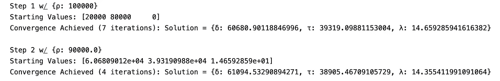
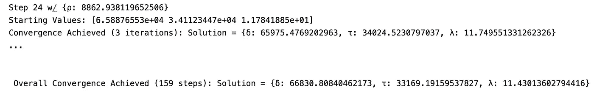

# 优化、牛顿法与利润最大化：第三部分 — 应用利润最大化

> 原文：[`towardsdatascience.com/optimization-newtons-method-profit-maximization-part-3-applied-profit-maximization-23a8c16167cd?source=collection_archive---------15-----------------------#2023-03-01`](https://towardsdatascience.com/optimization-newtons-method-profit-maximization-part-3-applied-profit-maximization-23a8c16167cd?source=collection_archive---------15-----------------------#2023-03-01)


所有图片由作者提供

## 学习如何应用优化和计量经济学技术来解决实际利润最大化问题

[](https://medium.com/@jakepenzak?source=post_page-----23a8c16167cd--------------------------------)[](https://towardsdatascience.com/?source=post_page-----23a8c16167cd--------------------------------) [Jacob Pieniazek](https://medium.com/@jakepenzak?source=post_page-----23a8c16167cd--------------------------------)

·

[关注](https://medium.com/m/signin?actionUrl=https%3A%2F%2Fmedium.com%2F_%2Fsubscribe%2Fuser%2F6f0948d99b1c&operation=register&redirect=https%3A%2F%2Ftowardsdatascience.com%2Foptimization-newtons-method-profit-maximization-part-3-applied-profit-maximization-23a8c16167cd&user=Jacob+Pieniazek&userId=6f0948d99b1c&source=post_page-6f0948d99b1c----23a8c16167cd---------------------post_header-----------) 发表在 [Towards Data Science](https://towardsdatascience.com/?source=post_page-----23a8c16167cd--------------------------------) ·19 分钟阅读·2023 年 3 月 1 日[](https://medium.com/m/signin?actionUrl=https%3A%2F%2Fmedium.com%2F_%2Fvote%2Ftowards-data-science%2F23a8c16167cd&operation=register&redirect=https%3A%2F%2Ftowardsdatascience.com%2Foptimization-newtons-method-profit-maximization-part-3-applied-profit-maximization-23a8c16167cd&user=Jacob+Pieniazek&userId=6f0948d99b1c&source=-----23a8c16167cd---------------------clap_footer-----------)

--

[](https://medium.com/m/signin?actionUrl=https%3A%2F%2Fmedium.com%2F_%2Fbookmark%2Fp%2F23a8c16167cd&operation=register&redirect=https%3A%2F%2Ftowardsdatascience.com%2Foptimization-newtons-method-profit-maximization-part-3-applied-profit-maximization-23a8c16167cd&source=-----23a8c16167cd---------------------bookmark_footer-----------)

> 本文是**第三**篇，也是最后一篇，在这个三部分系列中。在[第一部分](https://medium.com/towards-data-science/optimization-newtons-method-profit-maximization-part-1-basic-optimization-theory-ff7c5f966565)中，我们研究了基本优化理论。然后，在[第二部分](https://medium.com/towards-data-science/optimization-newtons-method-profit-maximization-part-2-constrained-optimization-theory-dc18613c5770)中，我们将这一理论扩展到约束优化问题。现在，在第三部分中，我们将应用所涉及的优化理论，以及计量经济学和经济学理论，来解决利润最大化问题。

假设，作为公司的一名数据科学家，你的任务是估算最佳的资金分配，以最大化某产品线的整体利润。此外，假设你在这些分配决策上有一些约束条件，例如必须分配的总花费上限和/或必须在某些渠道上花费的最低金额。在本文中，我们将结合[第一部分](https://medium.com/towards-data-science/optimization-newtons-method-profit-maximization-part-1-basic-optimization-theory-ff7c5f966565)和[第二部分](https://medium.com/towards-data-science/optimization-newtons-method-profit-maximization-part-2-constrained-optimization-theory-dc18613c5770)中涉及的优化理论，以及额外的经济学和计量经济学理论，来处理这种理论上的利润最大化问题——我们将在本文中进一步详细阐述。

本文的目标是将我们迄今为止学到的知识结合起来，我希望能激励和启发读者如何将这些技术应用到实际环境中。本文并非针对所讨论问题的全面解决方案，因为细微差别和特性当然会使理论示例复杂化。此外，许多涉及的技术在 Python 中通过像[pyomo](https://www.pyomo.org/)、[SciPy](https://docs.scipy.org/doc/scipy/tutorial/optimize.html)等包有更优化的实现。尽管如此，我希望能提供一个构建应用优化问题的强大框架。让我们深入探讨吧！

*在*[*第一部分*](https://medium.com/towards-data-science/optimization-newtons-method-profit-maximization-part-1-basic-optimization-theory-ff7c5f966565)*中，我们涵盖了基本的优化理论 — 包括 1) 设置并通过分析解决一个简单的单变量优化问题，2) 迭代优化方案 — 即，梯度下降和牛顿法，和 3) 通过手工和 python 实现牛顿法解决多维优化问题。在*[*第二部分*](https://medium.com/towards-data-science/optimization-newtons-method-profit-maximization-part-2-constrained-optimization-theory-dc18613c5770)*中，我们涵盖了有约束优化理论 — 包括 1)将等式约束和 2)将不等式约束纳入我们的优化问题中，并通过牛顿法解决它们。本文旨在为那些已经熟悉*[*第一部分*](https://medium.com/towards-data-science/optimization-newtons-method-profit-maximization-part-1-basic-optimization-theory-ff7c5f966565)*和*[*第二部分*](https://medium.com/towards-data-science/optimization-newtons-method-profit-maximization-part-2-constrained-optimization-theory-dc18613c5770)*中涵盖的内容的人士提供帮助。**

## 优化理论（[第一部分](https://medium.com/towards-data-science/optimization-newtons-method-profit-maximization-part-1-basic-optimization-theory-ff7c5f966565) & [第二部分](https://medium.com/towards-data-science/optimization-newtons-method-profit-maximization-part-2-constrained-optimization-theory-dc18613c5770) 总结）

一个数学优化问题可以抽象地表述如下：


(1)

我们选择使向量**x**的实值最小化*目标函数**f**(**x**)（或最大化-*f**(**x**)），受*不等式约束**g**(**x**)和*等式约束**h**(**x**)约束。在第二部分中，我们讨论了如何将这些约束直接纳入我们的优化问题中。值得注意的是，使用拉格朗日乘子和对数障碍函数，我们可以构建一个新的*目标函数***O***(**x, Λ*,*** *ρ*):


(2) 有约束优化问题的泛化函数

其中**Λ**是与每个*等式约束* *h*(**x**)相关的拉格朗日乘子向量，而*ρ*是与所有*不等式约束* *g*(**x**)相关的障碍参数。然后我们可以通过选择一个初始值*ρ*（*注意，目标函数的大功能值会要求更大的初始值ρ以调整惩罚*），使用牛顿法迭代优化新目标函数，接着通过逐渐减小*ρ*（*ρ* → 0）来更新*ρ*，并重复直到收敛 — 牛顿法迭代方案如下：


(3) 牛顿法迭代方案

其中**H**(**x**)和**∇***f*(**x**)分别表示我们的*目标函数* ***O***(**x, Λ*,*** *ρ*)的海森矩阵和梯度。当我们达到以下一个或多个标准的收敛时，即表示收敛：


(4) 迭代优化方案的收敛标准

在 Python 中，利用[SymPy](https://www.sympy.org/en/index.html)，我们有 4 个函数。一个函数用于获取我们的 SymPy 函数的梯度，一个函数用于获取我们的 SymPy 函数的海森矩阵，一个函数通过牛顿法解决无约束优化问题，另一个函数通过牛顿法解决根据广义方程（2）的有约束优化问题（有关该材料的更详细覆盖，请参见[第一部分](https://medium.com/towards-data-science/optimization-newtons-method-profit-maximization-part-1-basic-optimization-theory-ff7c5f966565)和[第二部分](https://medium.com/towards-data-science/optimization-newtons-method-profit-maximization-part-2-constrained-optimization-theory-dc18613c5770)）。有关这些函数，请参见附录。

要解决一个有约束的优化问题，我们可以运行以下代码（确保起始值在不等式约束的可行范围内！）：

```py
import sympy as sm

x, y, λ, ρ = sm.symbols('x y λ ρ')

# f(x): 100*(y-x**2)**2 + (1-x)**2 
# h(x): x**2 - y = 2
# g_1(x): x <= 0
# g_2(x) y >= 3

objective = 100*(y-x**2)**2 + (1-x)**2 + λ*(x**2-y-2) - ρ*sm.log((y-3)*(-x))
symbols = [x,y,λ,ρ] # Function requires last symbol to be ρ (barrier parameter)
x0 = {x:-15,y:15,λ:0,ρ:10}

constrained_newton_method(objective,symbols,x0)
```

对应的输出为：


如果上述材料感觉陌生或需要更详细的回顾，建议查看本系列的[第一部分](https://medium.com/towards-data-science/optimization-newtons-method-profit-maximization-part-1-basic-optimization-theory-ff7c5f966565)和第二部分，这些将提供更深入的材料概述。对于本文的其余部分，我们将首先讨论基本的利润最大化和计量经济学理论，然后进入理论示例的解决方案。

## 应用利润最大化

*假设我们有一个$100,000 的广告预算，并且必须全部花费。我们的任务是选择最优的预算分配到两种广告渠道（数字广告和电视广告），以最大化某一产品线的整体利润。此外，假设我们必须至少分配$20,000 到电视广告和$10,000 到数字广告。*

**理论公式**

现在我们将数学地制定我们寻求解决的利润最大化问题：


(5) [链接](https://math.embed.fun/8uidE7jJM8PZVuegURC75K)

*π(*⋅)表示利润函数，*δ*表示数字广告支出，*τ*表示电视广告支出，(⋅)是额外变量的占位符。请注意，我们在最小化*π(*⋅)的负值，这等同于最大化*π(*⋅)。利润函数定义如下：


(6) [链接](https://math.embed.fun/nUyUXLuje8daREdpVGejco)

*p*表示价格，*q(δ, τ,* ⋅)表示需求量函数，C*(q(⋅), δ, τ)*表示成本函数，直观上，它是数量的直接函数（如果我们生产更多，成本会增加）以及广告支出的多少。成本函数还可以接受额外输入，但为了演示，我们将其保持为数量和广告费用的函数。请注意，我们选择的*δ*和*τ*通过其对需求量和成本函数的影响直接影响利润函数。为了增加优化问题的可操作性，我们需要使用计量经济学技术来估计我们的需求量函数。一旦我们指定了成本函数并估计了需求量函数，我们可以按如下方式解决优化问题：


(7) [链接](https://math.embed.fun/adaiCXKX3TzPu72P89yg2E)

其中 *q_hat* 是我们对需求量的经济计量模型的估计。在我们阐述需求量模型的经济计量规格之前，有必要讨论一个关于优化问题所需假设的重要说明，以证明其可操作性。我们必须获得数字广告和电视广告对需求量的 *因果估计*。用经济学术语来说，数字广告和电视广告在经济计量模型中需要是 *外生* 的。也就是说，它们与模型中的误差不相关。外生性可以通过两种方式实现：1）我们有正确的经济计量模型结构规范，以衡量数字广告和电视广告对需求量的影响（即，我们包括所有与需求量以及数字和电视广告支出相关的变量）；*或* 2）我们有随机变化的数字和电视广告支出（这可以通过随时间随机变化的支出来观察需求的响应）。

直观上，外生性是必需的，因为需要捕捉广告支出变化的因果影响——也就是说，如果我们改变广告支出的数值，平均而言会发生什么。如果我们估计的效果 *不是* 因果的，那么我们对广告支出的变化 *不会* 对应于需求量的真实变化。注意，模型不需要为需求量做出最佳预测，而是需要准确捕捉因果关系。请参阅我的 [前一篇文章](https://medium.com/towards-data-science/controlling-for-x-9cb51652f7ad)，其中更深入地讨论了外生性假设。

现在假设我们为按时间 *t* 索引的需求量指定以下经济计量模型：


(8) [链接](https://math.embed.fun/ivouwfcw3QYx3ojZMXNt6n)

其中 *β* 和 *γ* 分别是数字广告支出自然对数的影响估计值 *δ* 和电视广告支出的影响估计值 *τ*。此外，*α* 是我们的截距，*ϕ*1 和 *ϕ2* 是需求量的 [自回归](https://en.wikipedia.org/wiki/Autoregressive_model) 组件的估计值，***S*** 表示季节性，**X** 是所有相关协变量和滞后协变量的集合及其系数估计矩阵 **Ω**，*ϵ* 是误差项。此外，假设数字和电视广告在 **X**、***S*** 和我们模型中的自回归组件 *条件下* 满足外生性假设。也就是说，


(9) [链接](https://math.embed.fun/qaR3eKYoxckpQ16jLtVR2R)

你可能会问，为什么使用数字和电视广告支出的自然对数？这并不是在此背景下的必需或决定性的选择，但我旨在展示变量变换如何捕捉我们选择变量与感兴趣结果之间的关系。以我们的案例为例，假设我们假设广告支出的影响最初急剧增加，但逐渐趋于平稳（即收益递减法则）。这正是对数变换允许我们建模的内容。请观察：


注意，成本函数的形式通常可以在内部更容易得知。因此，我们也来指定我们的成本函数的形式：


(10) [链接](https://math.embed.fun/bmuMitXmNJ8yHcHiLp2QuY)

在这里，我们可以看到每生产一个单位都有一个成本*ζ*，并且随着生产量的增加，这个成本会得到折扣（可以理解为对大合同的折扣或[规模经济](https://en.wikipedia.org/wiki/Economies_of_scale)）。我们还简单地将数字广告支出和电视广告支出合并到我们的总成本中。

现在我们已经为我们的计量经济学利润最大化问题建立了理论基础，让我们来模拟一些数据并将其带入 Python！

**数据模拟（可选）**

请注意，本节可以跳过而不会丢失主要内容。

首先，我们来模拟 10 年期间的每月需求量数据，其中包括以下变量：

```py
import pandas as pd

df = pd.DataFrame()

## Digital Advertising - ln(δ) 
df['log_digital_advertising'] = np.log(np.random.normal(loc=50000,scale=15000,size=120).round())

## Television Advertising - ln(τ)
df['log_television_advertising'] = np.log(np.random.normal(loc=50000,scale=15000,size=120).round())

## Matrix X of covariates

# Lag Digital Advertising
df['log_digital_advertising_lag1'] = df['log_digital_advertising'].shift(1)
df['log_digital_advertising_lag2'] = df['log_digital_advertising'].shift(2)

# Lag Television Advertising
df['log_television_advertising_lag1'] = df['log_television_advertising'].shift(1)
df['log_television_advertising_lag2'] = df['log_television_advertising'].shift(2)

# Price
df['price'] = np.random.normal(loc=180,scale=15,size=120).round()
df['price_lag1'] = df['price'].shift(1)
df['price_lag2'] = df['price'].shift(2)

# Competitor Price
df['comp_price'] = np.random.normal(loc=120,scale=15,size=120).round()
df['comp_price_lag1'] = df['comp_price'].shift(1)
df['comp_price_lag2'] = df['comp_price'].shift(2)

# Seasonality 
from itertools import cycle

months = cycle(['Jan','Feb','Mar','Apr','May','June','July','Aug','Sep','Oct','Nov','Dec'])
df['months'] = [next(months) for m in range(len(df))]

one_hot = pd.get_dummies(df['months'], dtype=int)
one_hot = one_hot[['Jan','Feb','Mar','Apr','May','June','July','Aug','Sep','Oct','Nov','Dec']]
df = df.join(one_hot).drop('months',axis=1)

## Constant
df['constant'] = 1

# Drop NaN (Two lags)
df = df.dropna()
```

注意，我们包括滞后变量，因为今天的需求量很可能是许多变量滞后值的函数。我们还通过引入每月的虚拟变量来控制季节性效应（这只是将季节性纳入模型的多种方式之一）。然后我们指定与每个变量相关的参数（请注意，这些参数按数据框的列顺序指定！）：

```py
params = np.array(
    [10_000, # β
    5_000, # γ
    2_000, # Ω
    1_000, # Ω
    3_000, # Ω
    1_000, # Ω
   -1_000, # Ω
   -500,   # Ω
   -100,   # Ω
    500,   # Ω
    300,   # Ω
    100,   # Ω
    25_000, # S
    15_000, # S 
    15_000, # S
    10_000, # S
    10_000, # S
    10_000, # S
    15_000, # S
    15_000, # S
    25_000, # S
    35_000, # S
    35_000, # S
    40_000, # S
    50_000  # α
    ])
```

然后我们可以通过运行`quantity_demanded = np.array(df) @ params`来模拟我们的计量经济学规范（方程 8）中的需求量。然而，请注意我们缺少自回归成分，因此我们还希望需求量遵循上述的[自回归过程](https://en.wikipedia.org/wiki/Autoregressive_model)。也就是说，需求量也是其自身滞后值的函数。我们在这里包括 2 个滞后期（AR(2)过程），其系数分别为*ϕ1*和*ϕ2*。注意，我们可以通过以下系统用初始条件*q0*和*q-1*来模拟：


(11) [链接](https://math.embed.fun/mwCEwVTYD8Q824KTYYCyon)

```py
def quantity_ar2_process(T, ϕ1, ϕ2, q0, q_1, ϵ, df, params):

    Φ = np.identity(T)  # The T x T identity matrix

    for i in range(T):

        if i-1 >= 0:
            Φ[i, i-1] = -ϕ1

        if i-2 >= 0:
            Φ[i, i-2] = -ϕ2

    B = np.array(df) @ params + ϵ

    B[0] = B[0] + ϕ1 * q0 + ϕ2 * q_1
    B[1] = B[1] + ϕ2 * q0

    return np.linalg.inv(Φ) @ B

## Quantity Demand AR(2) component process

# Parameters
T = 118 # Time periods less two lags 
ϕ1 = 0.3 # Lag 1 coefficient (ϕ1)
ϕ2 = 0.05 # Lag 2 coefficient (ϕ2)
q_1 = 250_000 # Initial Condition q_-1
q0 = 300_000 # Initial Condition q_0
ϵ = np.random.normal(0, 5000, size=T) # Random Error (ϵ)

quantity_demanded_ar = quantity_ar2_process(T,ϕ1,ϕ2,q0,q_1,ϵ,df,params)

# Quantity_demanded target variable
df['quantity_demanded'] = quantity_demanded_ar

# Additional covariates of lagged quantity demanded
df['quantity_demanded_lag1'] = df['quantity_demanded'].shift(1)
df['quantity_demanded_lag2'] = df['quantity_demanded'].shift(2)
```

**计量经济学估计与优化**

首先使用我们在方程（2）中的框架，将我们在方程（7）中的约束优化问题转化为一个可以利用我们上面提到的函数`constrained_newton_method()`来解决的问题：


(12) [链接](https://math.embed.fun/v1egYNfHrCeA6fX6PMv8vX)

如前所述，我们需要估计我们的需求量，*q_hat*。让我们看看在模拟的 10 年中我们的需求量是什么样的：


我们可以清楚地看到，在年末时出现了一些季节性现象，且我们似乎在处理一个[平稳过程](https://en.wikipedia.org/wiki/Stationary_process)（这一切都是由构造决定的）。现在假设我们有以下观察变量：


在方程 8 中，我们的计量经济学规范中，*quantity_demanded* 是我们的结果 *q*，*log_digital_advertising* 是我们的 ln(δ)，*log_television_advertising* 是我们的 ln(τ)，*constant* 是我们的 *α*，*quantity_demanded_lag1* 和 *quantity_demanded_lag2* 是我们的自回归组件 *q_t-1* 和 *q_t-2*，其余是我们的额外协变量 **X**，包括季节性 ***S***。

现在，有了这些数据，我们试图估计方程 8 中的计量经济学规范。我们可以使用最小二乘法（OLS）来估计这个结构模型。为此，我们将使用[statsmodels](https://www.statsmodels.org/stable/index.html#)。

> 一个很好的练习是使用我们构建的牛顿法代码来解决线性回归，并将结果与 statsmodels 进行比较。提示：线性回归中的目标是最小化[残差平方和](https://en.wikipedia.org/wiki/Residual_sum_of_squares)。请注意，我们编写的代码绝非解决线性回归的高效方法，但它更多地用于在模型拟合（回归）背景下说明优化理论。相关代码将在文章末尾提供！

注意，我们删除了前两个观察值，因为这些是我们的前两个滞后项，同时我们删除了七月作为参考月份：

```py
import statsmodels.api as stats

## Fit Econometric model using OLS

df = df[2:] # Drop first two lagged values

y = df['quantity_demanded']
X = df.drop(['quantity_demanded','July'],axis=1)

mod = stats.OLS(y,X)
results = mod.fit()

print(results.summary())
```


现在我们有了我们对需求量的估计计量经济学规范！几点观察：

1.  数字广告支出和电视广告支出的对数增加与需求量的增加相关

1.  价格的增加与需求量的减少相关（这是预期的行为）

1.  我们看到在 9 月到 12 月期间有明显的季节性需求增长，这与我们上面的时间序列一致

1.  我们看到需求量的第一个滞后项对现在有预测作用，这支持自回归过程

+   *上面的结果可以通过数据模拟部分的数据显示和比较来验证*

现在让我们为优化问题指定我们的符号变量（δ、τ、λ 和 ρ），设定时间 *t* 上的当前变量值，并从数据中获取滞后值。这样我们就有了构建优化问题所需的一切：

```py
# Build Symbolic Functions with all variables in function
δ, τ, λ, ρ  = sm.symbols('δ τ λ ρ')

## Values of current variables
price = 180
comp_price = 120
Jan = 1

## Obtain Lagged Values
log_digital_advertising_lag1 = df['log_digital_advertising_lag1'].iloc[-1]
log_digital_advertising_lag2 = df['log_digital_advertising_lag2'].iloc[-2]
log_television_advertising_lag1 = df['log_television_advertising_lag1'].iloc[-1]
log_television_advertising_lag2 = df['log_television_advertising_lag2'].iloc[-2]
price_lag1 = df['price_lag1'].iloc[-1]
price_lag2 = df['price_lag2'].iloc[-2]
comp_price_lag1 = df['comp_price_lag1'].iloc[-1]
comp_price_lag2 = df['comp_price_lag2'].iloc[-2]
quantity_demanded_lag1 = df['quantity_demanded_lag1'].iloc[-1]
quantity_demanded_lag2 = df['quantity_demanded_lag2'].iloc[-2]

variables = [sm.log(δ),
            sm.log(τ),
            log_digital_advertising_lag1,
            log_digital_advertising_lag2,
            log_television_advertising_lag1,
            log_television_advertising_lag2,
            price,
            price_lag1,
            price_lag2,
            comp_price,
            comp_price_lag1,
            comp_price_lag2,
            Jan,0,0,0,0,0,0,0,0,0,0, # All Months less July 
            1, # Constant
            quantity_demanded_lag1,
            quantity_demanded_lag2
            ]

# Quantity Demanded
quantity_demanded = np.array([variables]) @ np.array(results.params) # params from ols model
quantity_demanded = quantity_demanded[0]

print(quantity_demanded)
```

我们从方程 8 得到的估计需求量为：


估计需求量函数

现在我们可以构建我们的收入、成本，并将它们结合起来构建我们的利润函数。这里我们生产每单位的成本为 $140 基础，并且每生产一个额外单位的折扣为 $0.0001：

```py
Revenue = price * quantity_demanded
Cost = quantity_demanded * (140 - 0.0001*quantity_demanded) + τ + δ
profit = Revenue - Cost

print(profit)
```


估计利润函数

将我们的利润绘制为数字广告支出和电视广告支出的函数，*π(*δ、τ)：


现在我们使用 python 按照方程 12 中的公式解决我们的优化问题，利用我们在[第一部分](https://medium.com/towards-data-science/optimization-newtons-method-profit-maximization-part-1-basic-optimization-theory-ff7c5f966565)和[第二部分](https://medium.com/towards-data-science/optimization-newtons-method-profit-maximization-part-2-constrained-optimization-theory-dc18613c5770)中学到的优化理论。*注意，ρ 的极高值是为了考虑到我们的目标函数值极大，因此我们需要确保惩罚足够大，以避免“跳出”约束。*

```py
## Optimization Problem

objective = -profit + λ*(τ + δ - 100_000) - ρ*sm.log((τ-20_000)*(δ-10_000))

symbols = [δ, τ, λ, ρ]
x0 = {δ:20_000, τ:80_000, λ:0, ρ:100000}

results = constrained_newton_method(objective,symbols,x0,iterations=1000)
```

以及相应的输出：



因此，我们的解决方案是将大约 $66,831 用于数字广告支出，将大约 $33,169 用于电视广告支出。这些数值对应于：

```py
digital_ad = results[δ]
television_ad = results[τ]

quantity = quantity_demanded.evalf(subs={δ:digital_ad,τ:television_ad})
revenue = Revenue.evalf(subs={δ:digital_ad,τ:television_ad})
cost = Cost.evalf(subs={δ:digital_ad,τ:television_ad})
profit = revenue - cost

print(f"Quantity: {int(quantity):,}")
print(f"Total Revenue: ${round(revenue,2):,}")
print(f"Total Cost: ${round(cost,2):,}")
print(f"Profit: ${round(profit,2):,}")
```


就这样！

## 结论

在本文中，利润最大化问题绝非完全综合的解决方案。实际上，我们甚至不需要对这么简单的优化问题使用牛顿法！但是，随着优化问题在复杂性和维度上的增加，这在现实世界中非常常见，这些工具变得越来越相关。我们的目标是利用我们在[第一部分](https://medium.com/towards-data-science/optimization-newtons-method-profit-maximization-part-1-basic-optimization-theory-ff7c5f966565)和第二部分中学到的知识，进行一次有趣的探索，以了解优化理论的无数应用之一。

如果你读到这里，感谢你抽出时间阅读我的文章，并向那些阅读了系列中所有 3 部分的读者表示特别的感谢。我希望你现在对基本的多维优化理论和涉及目标函数约束的扩展有很好的理解。一如既往，我希望你像我写这篇文章时那样享受阅读。如果你对这篇文章和整个系列有任何想法，请告诉我！

## **附加内容 — 线性回归的数值和解析解**

如上所承诺，本节将提供利用牛顿方法解决线性回归问题的代码，并将该结果与解析解（statsmodels 使用的解）进行比较。请回忆，解决线性回归的目标是最小化 [残差平方和](https://en.wikipedia.org/wiki/Residual_sum_of_squares)。也就是说，就矩阵而言，


(A1) 最小化残差平方和

因此，使用我们的牛顿方法函数和框架，我们得到：

```py
# Pull all variables in X and create them as SymPy symbols
variablez = list(df.drop(['quantity_demanded','July'],axis=1).columns)
symbols = []
for i in variablez:
    i  = sm.symbols(f'{i}')
    symbols.append(i)

# Create vectors and matrices of outcome (y), covariates (X), and parameters(β) 
y = np.array(df['quantity_demanded'])
X = np.array(df.drop(['quantity_demanded','July'],axis=1))
β = np.array(symbols)

# Specify objective function and starting values 
objective = (y - X@β).T @ (y - X@β) # Residual Sum of Squares
β_0 = dict(zip(symbols,[0]*len(symbols))) # Initial guess (0 for all)

β_numerical = newton_method(objective,symbols,β_0)
```

输出如下：


接下来我们将计算解析解。也就是说，如果我们对等式 (A1*)* 求导并将其设为零并解出 *β*，我们得到：


(A2) OLS 解析解

编写代码如下 *(我们还提供了与 statsmodels 比较的解析标准误差，但不再进一步探讨 — 如果你感兴趣，请参见 OLS* [*维基百科页面*](https://en.wikipedia.org/wiki/Ordinary_least_squares#Estimation) *）*：

```py
# OLS Analytical Solution
β_analytical = np.linalg.inv(X.T @ X) @ X.T @ y 

# Compute standard errors
df_residuals = len(X)-len(β_analytical)
σ2 = 1/df_residuals*((y-X@β_analytical).T @ (y-X@β_analytical)) # MSE 
Σ =  σ2 * np.linalg.inv(X.T @ X)
standard_errors = np.sqrt(np.diag(Σ))
```

与 statsmodels 的所有结果进行比较：

```py
ols_results = pd.DataFrame()

ols_results['variable'] = variablez
ols_results['β_numerical'] = list(β_numerical.values())
ols_results['β_analytical'] = β_analytical
ols_results['std_err_analytical'] = standard_errors
ols_results['β_statsmodels'] = list(results.params) # from statsmodels code above
ols_results['std_err_statsmodels'] = list(results.bse) # from statsmodels code above
ols_results = ols_results.set_index('variable')

ols_results
```


## 附录 — 代码

```py
import sympy as sm
import numpy as np

def get_gradient(
    function: sm.core.expr.Expr,
    symbols: list[sm.core.symbol.Symbol],
    x0: dict[sm.core.symbol.Symbol, float],
) -> np.ndarray:
    """
    Calculate the gradient of a function at a given point.

    Args:
        function (sm.core.expr.Expr): The function to calculate the gradient of.
        symbols (list[sm.core.symbol.Symbol]): The symbols representing the variables in the function.
        x0 (dict[sm.core.symbol.Symbol, float]): The point at which to calculate the gradient.

    Returns:
        numpy.ndarray: The gradient of the function at the given point.
    """
    d1 = {}
    gradient = np.array([])

    for i in symbols:
        d1[i] = sm.diff(function, i, 1).evalf(subs=x0)
        gradient = np.append(gradient, d1[i])

    return gradient.astype(np.float64)

def get_hessian(
    function: sm.core.expr.Expr,
    symbols: list[sm.core.symbol.Symbol],
    x0: dict[sm.core.symbol.Symbol, float],
) -> np.ndarray:
    """
    Calculate the Hessian matrix of a function at a given point.

    Args:
    function (sm.core.expr.Expr): The function for which the Hessian matrix is calculated.
    symbols (list[sm.core.symbol.Symbol]): The list of symbols used in the function.
    x0 (dict[sm.core.symbol.Symbol, float]): The point at which the Hessian matrix is evaluated.

    Returns:
    numpy.ndarray: The Hessian matrix of the function at the given point.
    """
    d2 = {}
    hessian = np.array([])

    for i in symbols:
        for j in symbols:
            d2[f"{i}{j}"] = sm.diff(function, i, j).evalf(subs=x0)
            hessian = np.append(hessian, d2[f"{i}{j}"])

    hessian = np.array(np.array_split(hessian, len(symbols)))

    return hessian.astype(np.float64)

def newton_method(
    function: sm.core.expr.Expr,
    symbols: list[sm.core.symbol.Symbol],
    x0: dict[sm.core.symbol.Symbol, float],
    iterations: int = 100,
) -> dict[sm.core.symbol.Symbol, float] or None:
    """
    Perform Newton's method to find the solution to the optimization problem.

    Args:
        function (sm.core.expr.Expr): The objective function to be optimized.
        symbols (list[sm.core.symbol.Symbol]): The symbols used in the objective function.
        x0 (dict[sm.core.symbol.Symbol, float]): The initial values for the symbols.
        iterations (int, optional): The maximum number of iterations. Defaults to 100.

    Returns:
        dict[sm.core.symbol.Symbol, float] or None: The solution to the optimization problem, or None if no solution is found.
    """

    x_star = {}
    x_star[0] = np.array(list(x0.values()))

    # x = [] ## Return x for visual!

    print(f"Starting Values: {x_star[0]}")

    for i in range(iterations):
        # x.append(dict(zip(x0.keys(),x_star[i]))) ## Return x for visual!

        gradient = get_gradient(function, symbols, dict(zip(x0.keys(), x_star[i])))
        hessian = get_hessian(function, symbols, dict(zip(x0.keys(), x_star[i])))

        x_star[i + 1] = x_star[i].T - np.linalg.inv(hessian) @ gradient.T

        if np.linalg.norm(x_star[i + 1] - x_star[i]) < 10e-5:
            solution = dict(zip(x0.keys(), x_star[i + 1]))
            print(f"\nConvergence Achieved ({i+1} iterations): Solution = {solution}")
            break
        else:
            solution = None

        print(f"Step {i+1}: {x_star[i+1]}")

    return solution

def constrained_newton_method(
    function: sm.core.expr.Expr,
    symbols: list[sm.core.symbol.Symbol],
    x0: dict[sm.core.symbol.Symbol, float],
    iterations: int = 100,
) -> dict[sm.core.symbol.Symbol, float] or None:
    """
    Performs constrained Newton's method to find the optimal solution of a function subject to constraints.

    Parameters:
        function (sm.core.expr.Expr): The function to optimize.
        symbols (list[sm.core.symbol.Symbol]): The symbols used in the function.
        x0 (dict[sm.core.symbol.Symbol, float]): The initial values for the symbols.
        iterations (int, optional): The maximum number of iterations. Defaults to 100.

    Returns:
        dict[sm.core.symbol.Symbol, float] or None: The optimal solution if convergence is achieved, otherwise None.
    """
    x_star = {}
    x_star[0] = np.array(list(x0.values())[:-1])

    optimal_solutions = []
    optimal_solutions.append(dict(zip(list(x0.keys())[:-1], x_star[0])))

    for step in range(iterations):
        # Evaluate function at rho value
        if step == 0:  # starting rho
            rho_sub = list(x0.values())[-1]

        rho_sub_values = {list(x0.keys())[-1]: rho_sub}
        function_eval = function.evalf(subs=rho_sub_values)

        print(f"Step {step} w/ {rho_sub_values}")  # Barrier method step
        print(f"Starting Values: {x_star[0]}")

        # Newton's Method
        for i in range(iterations):
            gradient = get_gradient(
                function_eval, symbols[:-1], dict(zip(list(x0.keys())[:-1], x_star[i]))
            )
            hessian = get_hessian(
                function_eval, symbols[:-1], dict(zip(list(x0.keys())[:-1], x_star[i]))
            )

            x_star[i + 1] = x_star[i].T - np.linalg.inv(hessian) @ gradient.T

            if np.linalg.norm(x_star[i + 1] - x_star[i]) < 10e-5:
                solution = dict(zip(list(x0.keys())[:-1], x_star[i + 1]))
                print(
                    f"Convergence Achieved ({i+1} iterations): Solution = {solution}\n"
                )
                break

        # Record optimal solution & previous optimal solution for each barrier method iteration
        optimal_solution = x_star[i + 1]
        previous_optimal_solution = list(optimal_solutions[step - 1].values())
        optimal_solutions.append(dict(zip(list(x0.keys())[:-1], optimal_solution)))

        # Check for overall convergence
        if np.linalg.norm(optimal_solution - previous_optimal_solution) < 10e-5:
            print(
                f"\n Overall Convergence Achieved ({step} steps): Solution = {optimal_solutions[step]}\n"
            )
            overall_solution = optimal_solutions[step]
            break
        else:
            overall_solution = None

        # Set new starting point
        x_star = {}
        x_star[0] = optimal_solution

        # Update rho
        rho_sub = 0.9 * rho_sub

    return overall_solution
```

*通过此 GitHub 仓库访问所有代码：* [`github.com/jakepenzak/Blog-Posts`](https://github.com/jakepenzak/Blog-Posts)

*感谢你阅读我的帖子！我在 Medium 上的帖子旨在探索利用* ***计量经济学*** *和* ***统计/机器学习*** *技术的实际和理论应用。此外，我还通过理论和模拟提供关于各种方法学的理论基础的帖子。最重要的是，我写作是为了学习！我希望使复杂的话题对所有人稍微更易于理解。如果你喜欢这篇文章，请考虑* [***关注我在 Medium 上的账号***](https://medium.com/@jakepenzak)*！*
