# 优化连接：图中的数学优化

> 原文：[`towardsdatascience.com/optimizing-connections-mathematical-optimization-within-graphs-7364e082a984`](https://towardsdatascience.com/optimizing-connections-mathematical-optimization-within-graphs-7364e082a984)


断开的图。图片由作者用 Dall-E 2 创建。

## 图论及其应用简介

[](https://hennie-de-harder.medium.com/?source=post_page-----7364e082a984--------------------------------)[](https://towardsdatascience.com/?source=post_page-----7364e082a984--------------------------------) [Hennie de Harder](https://hennie-de-harder.medium.com/?source=post_page-----7364e082a984--------------------------------)

·发表在 [Towards Data Science](https://towardsdatascience.com/?source=post_page-----7364e082a984--------------------------------) ·13 min read·2023 年 7 月 28 日

--

**在这篇文章中，我们将深入探讨图中的数学优化，探索关键概念、算法和实际应用。图问题可以在许多地方找到。显而易见的例子有物流或社交网络分析，比如寻找一个配送公司的最佳路线或两个个体之间的最少连接数。但你知道图也适用于城市规划、疾病传播建模、欺诈检测、推荐引擎和网络安全吗？通过利用专为图设计的优化算法，数据科学家可以发现最佳解决方案，高效分配资源，并做出数据驱动的决策。**

首先，我们将从介绍部分开始，以解释图的基础知识。然后，我们将深入探讨常见的图问题和算法，尝试解决这些问题。

# 图的基础知识

作为回顾，以下是图论的基础知识。

## 什么是图？

图由顶点（或节点）和边组成。如果顶点以某种方式相关，它们就通过边连接。要定义一个图，你需要所有顶点的名称，并且需要知道哪些顶点是连接的。

下面是一个具有顶点 {A, B, C, D, E} 和边 {{A, D}, {A, E}, {B, C}, {B, D}, {C, D}} 的图。

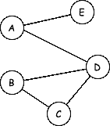

简单图。图片由作者提供。

有时，图中可能包含*回路*。回路是一条起点和终点相同的边（一个节点与自身连接）。

图论中还需了解的其他术语：

+   图的*顺序*等于其顶点数。

+   图的*大小*是边的数量（有时加上顶点数量）。

+   顶点的*度数*是它拥有的边的数量（一个回路在起点和终点处都算作两次）。

## 常见变体

之前的图示例也被称为*简单图*，因为它只包含顶点和（无向）边。但你可以通过提供额外的信息使它变得稍微复杂一些，通常更有趣。

下面是一个*有向图*（即 digraph）的示例，其中边指向特定方向：

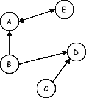

有向图。图像由作者提供。

另一种适用于多种情况的图是*加权图*。在加权图中，边与一个权重相关联：这可以是任何东西，例如长度或成本。

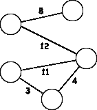

加权图。图像由作者提供。

这里讨论的最后一种有趣的图形变体是*多重图*。在多重图中，同一条边可以出现多次：

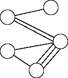

多重图。图像由作者提供。

> 注意：有许多特殊类型的图形及其自身的属性。例如，一个每对顶点都用边连接的图称为完全图。

# 从问题到图

如何从问题创建图？让我们通过一些示例来探讨：

## **位置和距离**

一个经典问题是有位置和位置之间距离的问题。在下面的*邻接*矩阵中，提供了位置之间的距离（如果距离大于 0，则有一条边）。从这个矩阵中，你可以轻松地创建一个图。

```py
 A B C D E F G H I
A 0 3 1 2 0 0 0 0 0
B 3 0 1 0 4 3 0 0 0
C 1 1 0 0 0 3 0 0 0
D 2 0 0 0 0 1 0 6 0
E 0 4 0 0 0 0 2 0 0
F 0 3 3 1 0 0 3 1 0
G 0 0 0 0 2 3 0 0 1
H 0 0 0 6 0 1 0 0 5
I 0 0 0 0 0 0 1 5 0
```

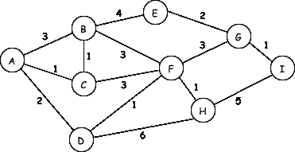

从矩阵创建的图。图像由作者提供。

你也可以从图中创建矩阵，常见的有*关联*矩阵和*度数*矩阵。

让我们用边的名称替换权重：

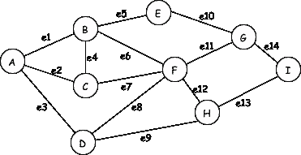

现在我们可以创建关联矩阵，它有一行对应每个节点，一列对应每条边。它显示了哪些节点通过边连接：

```py
 1  2  3  4  5  6  7  8  9 10 11 12 13 14
A  1  1  1  0  0  0  0  0  0  0  0  0  0  0
B  1  0  0  1  1  1  0  0  0  0  0  0  0  0
C  0  1  0  1  0  0  1  0  0  0  0  0  0  0
D  0  0  1  0  0  0  0  1  1  0  0  0  0  0
E  0  0  0  0  1  0  0  0  0  1  0  0  0  0
F  0  0  0  0  0  1  1  1  0  0  1  1  0  0
G  0  0  0  0  0  0  0  0  0  1  1  0  0  1
H  0  0  0  0  0  0  0  0  1  0  0  1  1  0
I  0  0  0  0  0  0  0  0  0  0  0  0  1  1
```

对于加权图，我们可以用相应边的权重替换一。

度矩阵是对角矩阵，计算附加到每个节点的边的数量。一个回路算作两次。对于之前的图，度矩阵将是：

```py
 A B C D E F G H I
A 3 0 0 0 0 0 0 0 0
B 0 4 0 0 0 0 0 0 0
C 0 0 3 0 0 0 0 0 0
D 0 0 0 3 0 0 0 0 0
E 0 0 0 0 2 0 0 0 0
F 0 0 0 0 0 5 0 0 0
G 0 0 0 0 0 0 3 0 0
H 0 0 0 0 0 0 0 3 0
I 0 0 0 0 0 0 0 0 2
```

> 注意：官方矩阵形式没有索引行和索引列。为了清晰起见，已添加。

## **流量**

有向图常用于网络流动。例如在数据传输网络、交通运输或管道中。如果你知道两个节点之间的最大容量，你可以创建一个网络流图：

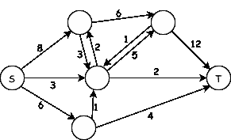

有源点(S)和汇点(T)的有向图。图像由作者提供。

源点(s)和汇点(t)是流的起点和终点。边是有向的，它们显示了节点之间流动的方向。

## **树图**

一种特殊类型的图是树图。你可以在许多不同的地方找到它们：比赛日程、家谱、组织结构图和进化树。树是*无向*、*无环*和*连通*的。它不应包含循环或有向边，所有节点都与树相连。

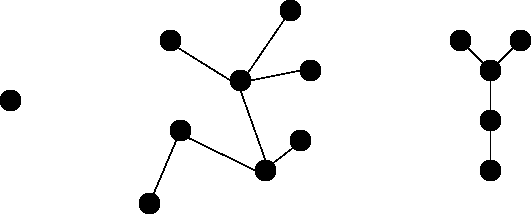

三个树图。作者提供的图像。

树具有有趣的属性：

+   它总是有`n-1`条边（其中`n`是节点的数量）。

+   树中的任意一对节点之间都有一条唯一的路径。

+   移除一条边将使图断开（将图分成两部分）。

## 社交网络

人与人之间的联系在图中可视化起来很美好。通过分析和可视化关系，你可以提取有价值的见解。这里是 7 个人的一个例子，如果他们在社交媒体上相互连接，他们就通过一条边连接：

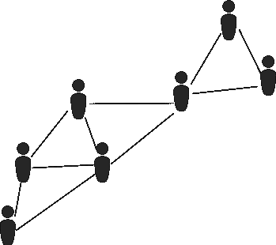

人员网络。作者提供的图像。

通过查看此图表可能会出现的问题是：

+   谁是最重要的人物？

+   哪些人最相似？

+   我们可以预测缺失的链接吗？

+   我们如何以最佳方式对这些人进行聚类？

# 应用于图的常见算法

在将情况建模为图后，你可以解决手头的问题。对于上一段中的不同示例，我们将应用算法来寻找最短路径、计算最大流和最小割、确定最小生成树，并触及图分析中的话题。

## 最短路径

第一个问题是最短路径问题：我们应该如何从 A 到 B，同时保持路径尽可能短？

让我们考虑以下图表：

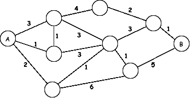

图。如何从 A 找到到 I 的最短路线？作者提供的图像。

一个常用于解决此问题的算法是 Dijkstra 算法。其工作方式如下：

**步骤 1.** 起始节点的距离为 0。将其余节点的距离设置为无穷大，这是它们的暂定距离。节点有三种类型：*已访问*、*未访问*和*当前*节点。在第一次运行中，当前节点是起始节点。

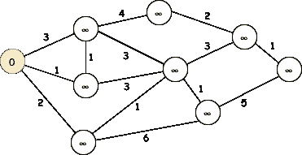

起始节点是黄色节点，距离为 0。所有其他距离设置为无穷大。作者提供的图像。

**步骤 2.** 查看当前节点的直接邻居，并计算到它们的距离（通过当前节点）。如果这个距离小于迄今为止的最小距离，则用新距离替换旧距离。为了发现最快的路线，如果距离被接受，则标记新路线（并在存在时删除之前标记的路线）。

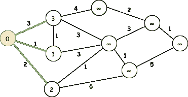

查看当前节点的所有邻居，如果新距离更小，则用新距离替换暂定距离。将“接受的”路线（距离较短的路线）标记为绿色。作者提供的图像。

**步骤 3。** 现在可以将第一个节点标记为已访问（绿色），新的当前节点将是距离最短的未访问节点（下图中的黄色节点距离为 1）。对该节点继续执行步骤 2，并重复步骤 2 和 3，直到达到终点。

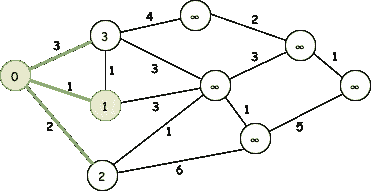

新的当前节点标记为黄色。以前的黄色节点标记为已访问。图片作者。

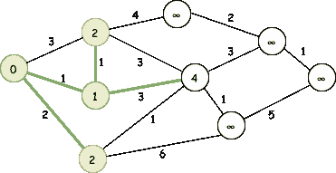

对第二个节点应用步骤 2。上面的节点得到新的距离 2，1+1（因为这比其暂定距离 3 更短）。我们可以在两个黄色节点中选择一个来再次应用步骤 2。图片作者。

如果我们重复这些步骤，最终解决后的图形如下所示：

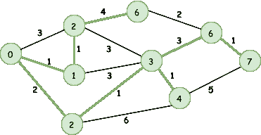

使用 Dijkstra 算法寻找最短路径。图片作者。

现在我们找到了从起始节点到每个其他节点的最短距离，并附上了相应的路径（绿色边）！Dijkstra 算法被广泛应用并且受欢迎，因为它高效且避免了不必要的计算。

还有许多有趣的最短路径问题，例如[中国邮差问题](https://en.wikipedia.org/wiki/Chinese_postman_problem)，在这个问题中，你需要在访问所有边的同时发现最短路径，或者旅行推销员问题，在这个问题中你需要访问所有节点。旅行推销员问题可以通过许多不同的方法来解决，例如使用混合整数规划（示例 2）或使用模拟退火（示例 1）。

## 最大流与最小割

在流图中，一个重要的问题是：从源点到汇点可以发送多少流量？边的权重对应于边的容量，这些容量永远不会被超过。每个节点的流入流量应该等于流出流量（源点和汇点除外）。

以下是一个最大流问题的示例：


带有源点（S）和汇点（T）的有向图。图片作者。

我们如何解决这个问题，并发现有多少流量可以到达汇点？对此有几种不同的算法。我们使用 Ford-Fulkerson 算法来解决这个问题。

**步骤 1。** 将所有边的初始容量设置为 0。

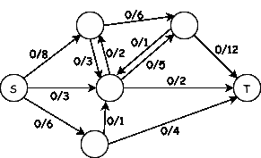

将所有边的初始容量设置为 0。图片作者。

**步骤 2。** 找到一个*增广路径*从源点到汇点。这是一条所有边的未使用容量大于 0 的路径，起点是源点，终点是汇点。你可以通过例如广度优先搜索或深度优先搜索来找到增广路径。

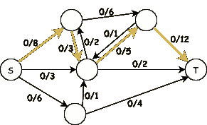

从源点到汇点的增广路径。图片作者。

**步骤 3.** 对于步骤 2 中的增广路径，我们可以找到*瓶颈*，即剩余容量最小的边。我们用这个值增加增广路径上所有边的容量。

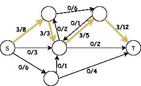

容量增加了 3（瓶颈边的值）。图像由作者提供。

**步骤 4\.** 继续执行步骤 2 和 3，直到没有增广路径。

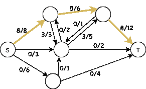

另一个增广路径，更新后的容量为 5。5 是边缘中剩余容量最低的，因此容量更新为 5。图像由作者提供。

在继续这样做之后，最终不会再有增广路径。最终结果可能如下所示：

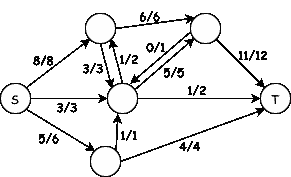

已解决！还存在其他可能的解决方案，可以得到相同的结果。图像由作者提供。

最大流量可以通过计算 11 + 1 + 4 = 16 很容易得到。这些是指向汇点的边的流量。这个问题也可以通过线性规划来解决。

与最大流相关的是*最小割*。最小割是找到将网络分成两个独立部分所需断开的连接的权重总和的最小值。它与最大流密切相关，因为当你找到了最大流的解决方案时，你也可以推导出最小割。它们是相等的。

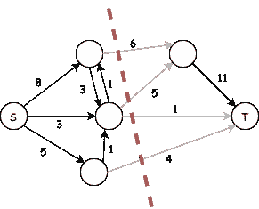

最小割。将图分成两部分，同时尽量减少移除边的权重总和。这个图像中移除的边的权重就是最小割，这与最大流的值相同，在这个例子中为 16。图像由作者提供。

最小割用于图像分割，例如将对象与背景分离。最小割的另一个重要应用是分析复杂网络的可靠性，例如电网或通信网络，通过识别关键边缘，这些边缘的故障可能导致网络断开或性能下降。

## 最小生成树

想象一下你是一个铁路公司的老板，你想要找出如何用最少的铁路连接七个城市。在这种情况下，你要找的是*最小生成树*。如果我们可视化这个问题，它看起来像这样：

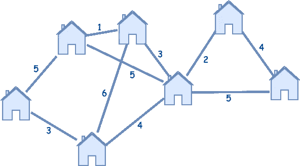

连接的城市。图像由作者提供。

我们如何计算这个图中的最小生成树？我们可以使用 Prim 算法，这是一种贪心算法，比较容易理解。

**步骤 1\.** 随意选择图中的一个节点作为起点。这个节点是树的第一部分。

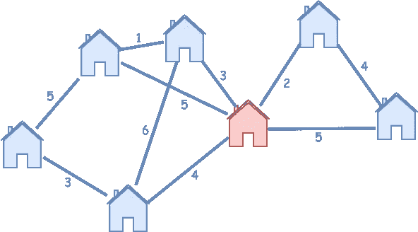

选择红色房子作为起点。

**步骤 2.** 通过一条边扩展树。选择与树连接的所有边中权重最小的边。

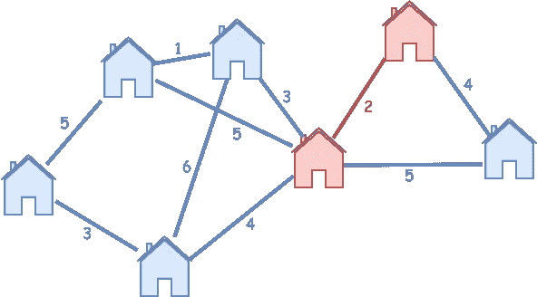

选择的边。来自中心城市的最小边。右上角的房子也在树中。图片来源于作者。

**步骤 3.** 重复步骤 2，直到所有节点都在树中。

接下来我们选择的边是权重为 3 的边：

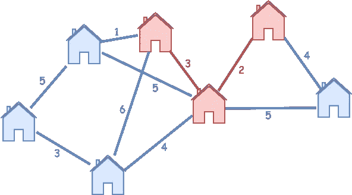

树在生长中…… 图片来源于作者。

最终，我们找到了总长度为 17 的最小生成树。

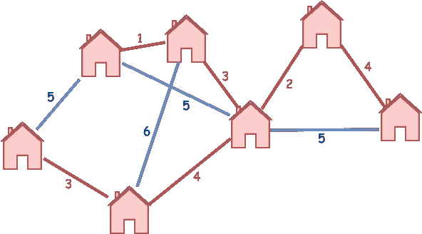

最终的树用红色表示。图片来源于作者。

最小生成树有许多不同的应用。最直接的应用是网络设计，当一个网络必须以最低的权重完全连接时。这样的网络例子包括电信网络、计算机网络、电力分配系统和交通网络。你知道最小生成树也用于分类学、聚类分析、计算机视觉中的特征提取和手写识别吗？如果你深入研究最小生成树的应用，你会发现还有很多其他应用！

## 中心性与相似性

图分析利用图论中开发的工具和技术，以在不同领域（如社交网络、交通网络、计算机网络、生物学等）获得洞察力和做出明智的决策。

中心性和相似性是图分析中的两个核心概念。你可能听说过谷歌搜索使用的[PageRank 算法](https://en.wikipedia.org/wiki/PageRank)。PageRank 是一种中心性算法，用于测量网络中节点的重要性或影响力，特别是在网页排名和超链接分析中。它根据每个节点的入链数量和质量分配一个数值评分，从而帮助识别网络中的关键节点。

*介数中心性*是另一种中心性测量方法。具有最高介数中心性的节点在所有其他节点之间充当最重要的桥梁。要找出一个节点的介数中心性，我们需要查看所有节点对，计算每个节点出现在两个其他节点之间的最短路径上的次数。出现在最多最短路径上的节点就是具有最高介数中心性的节点。

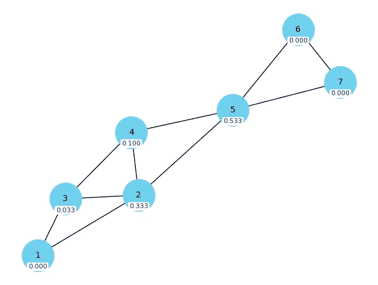

带有节点及每个节点的介数中心性的图。图片来源于作者。

在社交网络或现实世界系统中，具有高介数中心性的节点（例如，人员、地点或实体）在维持网络中不同部分之间的通信和连接方面发挥着至关重要的作用。它们充当重要的中介，确保高效的沟通并保持网络连接。

了解某些节点的相似性也很有用。这可以通过计算*节点相似性*来完成。Jaccard 相似度通常用于无权图。它通过计算两个节点共享的共同邻居数量与它们拥有的唯一邻居总数之比来衡量相似性。

让我们计算图中节点 2 和 4 的 Jaccard 相似度。它们共享 2 个邻居（节点 3 和 5），总的唯一邻居数量是 5（节点 1、2、3、4 和 5）。2 除以 5 得到的 Jaccard 相似度为 0.4。

节点相似性用于协同过滤技术，通过根据用户偏好的相似性向用户推荐项目。它还可以用于预测网络中的缺失或未来链接，或者用于检测簇和社区。

# 下一步是什么？

这只是图论和图分析世界的一瞥。在我们探索的内容之外，还有许多更多令人兴奋的问题和应用等待发现。图论的美在于其多样性；它提供了一种通过将现实世界挑战转化为可用巧妙算法解决的图形谜题的方式。

从社交网络到物流，许多现实世界的问题在图的领域中找到完美的匹配。揭示社区、发现隐藏的联系以及探索不同图类型的独特属性是图论中有趣的方面。

在数据科学领域，图成为盟友，使得创建可以对模型性能产生巨大影响的特征成为可能。图嵌入是解锁广泛数据集中新维度理解的关键。

希望这篇文章能激发你对图论奇妙世界的好奇心！

## 相关内容

[## 五种数学优化与机器学习结合的方法](https://towardsdatascience.com/four-ways-to-combine-mathematical-optimization-and-machine-learning-8cb874276254?source=post_page-----7364e082a984--------------------------------)

### 结合两种力量的实际例子。

[## 约束编程解释](https://towardsdatascience.com/constraint-programming-explained-2882dc3ad9df?source=post_page-----7364e082a984--------------------------------)

### 约束编程求解器的核心及其与混合整数编程的关系

[## 强大优化技术介绍：模拟退火](https://towardsdatascience.com/an-introduction-to-a-powerful-optimization-technique-simulated-annealing-87fd1e3676dd?source=post_page-----7364e082a984--------------------------------)

### 解释、参数、优点、缺点和使用案例

[关于模拟退火——一种强大的优化技术介绍](https://towardsdatascience.com/an-introduction-to-a-powerful-optimization-technique-simulated-annealing-87fd1e3676dd?source=post_page-----7364e082a984--------------------------------)
