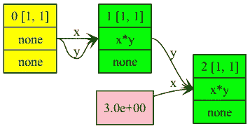

# 使用 C 优化 LLM，并在您的笔记本电脑上运行 GPT、Llama 和 Whisper

> 原文：[`towardsdatascience.com/optimizing-llms-with-c-and-running-gpt-lama-whisper-on-your-laptop-460c8bdd047e`](https://towardsdatascience.com/optimizing-llms-with-c-and-running-gpt-lama-whisper-on-your-laptop-460c8bdd047e)

## 在这篇文章中，我们将深入了解由 Georgi Gerganov 创建的出色张量库`ggml`。它是如何工作的？张量创建过程是什么？我们可以从一些简单的例子开始吗？

[](https://stefanobosisio1.medium.com/?source=post_page-----460c8bdd047e--------------------------------)[](https://towardsdatascience.com/?source=post_page-----460c8bdd047e--------------------------------) [Stefano Bosisio](https://stefanobosisio1.medium.com/?source=post_page-----460c8bdd047e--------------------------------)

·发表于 [Towards Data Science](https://towardsdatascience.com/?source=post_page-----460c8bdd047e--------------------------------) ·15 分钟阅读·2023 年 9 月 23 日

--


图片来源：[Aryo Yarahmadi](https://unsplash.com/@aryo_yarahmadi) 在 [Unsplash](https://unsplash.com/photos/ylMP3TetKoQ)

## 目录

1.  实现一个简单的数学函数

    1.1 上下文的定义

    1.2 初始化张量

    1.3 前向计算和计算图

    1.4 编译和运行

1.  对第一部分的最终备注

1.  支持我的写作

大型语言模型（LLMs）正随处引起关注。报纸上充斥着大量的文字描述这个即将到来的新世界，保证“AI 终于来了”。尽管 LLMs 对我们的生活产生了切实的影响，但我们必须保持冷静，并对整个情况进行批判性分析。LLMs 的炒作让我想起了几年前“数据科学家”职位的炒作。2014 年，当我开始攻读博士学位时，我看到数据科学家职位的稳步增加，直到 2018 年左右达到顶峰。当时，新闻再次炒作，写道：“数据科学家：100 万美元的职业”或“21 世纪最性感的工作”——这些标题是否让你联想到 LLM 的标题？

一方面，LLM（大语言模型）是一项伟大的技术，是迈向更通用 AI 框架的一步。这些模型是深入 AI 的起点，我相信有一天大多数应用程序和技术将依赖于这些模型。然而，我常常在 Medium 上看到，对于这些模型，有时缺乏明确性。尽管这些模型的能力和惊人的成果无可置疑，但它们过于庞大，不易运行或训练。因此，公司在决定任何战略业务方向之前，需要对 LLM 有非常透彻的了解。最尖锐的问题之一是这些模型的巨大内存成本、大规模基础设施需求以及推理时所需的昂贵基础设施。

如果我们考虑基本的 LLM 结构，即转换器，我们可以识别出经典的编码器-解码器结构。在推理时，解码器需要有一个内存机制来确定给特定输入标记分配多少注意力分数。这个分数基于标记在句子中的可能位置以及它与剩余上下文的一致性。这种机制称为 KV 缓存。鉴于这个矩阵的大小，对于简单模型而言，2048 的上下文长度很容易就会占用 3TB 的内存。为了进一步加速计算，我们需要在 GPU 上运行。最后，整个解码器结构很难并行化。

鉴于此前言，我们是否可以找到一种折衷或权衡的解决方案，使我们能够在更简单的基础设施上运行这些计算？本文展示了 Georgi Gerganov 如何实现一个新的优化的基于 C 的张量库，称为`ggml`。我在文中提到的提交是提交[0f4e99b](https://github.com/ggerganov/ggml/commit/0f4e99b1cc357cfff21178dfd5027e70162d7ed6)，这是 2022 年 9 月的提交，标志着`ggml`冒险的开始。其逻辑是使用基础代码，以便让你对整个包有一个强有力的理解。

# 实现一个简单的数学函数

在跳到 LLM 之前（它将在第二篇文章中介绍），让我们尝试分解库的关键元素，以便计算一个非常简单的函数，如：*f = ax²*。

## 上下文的定义

`ggml`中的一切都始于一个上下文。上下文定义了内存要求，以适应给定模型中的所有张量。上下文是从全局状态开始创建的：

```py
// global state
struct ggml_state g_state;

struct ggml_state {
    struct ggml_context_container contexts[GGML_MAX_CONTEXTS];
};
```

全局状态构建为一个`context_container`，它是：

```py
struct ggml_context_container {
    bool used;

    struct ggml_context context;
};
```

在容器中，我们可以注意到`ggml`第一个版本的核心元素，即`ggml_context`的存在：

```py
struct ggml_context {
    size_t mem_size;
    void * mem_buffer;
    bool   mem_buffer_owned;

    int n_objects;

    struct ggml_object * objects_begin;
    struct ggml_object * objects_end;
};
```

`ggml_context`包含了有关我们可以使用多少内存以及内存缓冲区的所有信息，以便在我们不知道张量可能占用多少字节的情况下，我们可以拥有足够的内存。

然后，上下文用于初始化整个过程。`ggml_init`启动初始化过程并返回：

```py
*ctx = (struct ggml_context) {
        .mem_size         = params.mem_size,
        .mem_buffer       = params.mem_buffer ? params.mem_buffer : malloc(params.mem_size),
        .mem_buffer_owned = params.mem_buffer ? false : true,
        .n_objects        = 0,
        .objects_begin    = NULL,
        .objects_end      = NULL,
    };
```

`*ctx`是一个新的上下文指针。我们可以使用`GGML_PRINT`在源代码中调查`*ctx`的输入对象，例如：

```py
GGML_PRINT("%s: context %p with %zu bytes of memory\n", __func__, (void *) ctx, ctx->mem_size);
GGML_PRINT("%s: context %p with %d objects\n", __func__, (void *) ctx, ctx->n_objects);
GGML_PRINT("%s: context %p with %p object starting position\n", __func__, (void *) ctx, (void *) ctx->objects_begin);
GGML_PRINT("%s: context %p with %p object ending position\n", __func__, (void *) ctx, (void *) ctx->objects_end);
```

在我的 Apple MacBook M2 Pro 上，上下文已经初始化为 16 GB 内存、0 个对象，并且内存布局是`objects_begin`和`objects_end`的地址为 0x0。

`objects_begin`和`objects_end`确实是下一步，即在`ggml_context`中创建张量的内存地址。

## 初始化张量

对于`ggml`中的所有函数，总会找到一个协议实现，例如：

`function_with_attribute` → `function_general` → `function_implementation`

`function_with_attribute`是具有特定任务的函数，例如`ggml_new_tensor_1d`或`ggml_new_tensor_2d`，分别生成 1D 或 2D 张量。这个特定函数调用`function_general`，即实现的通用布局，例如`ggml_new_tensor_Xd`将调用`ggml_new_tensor`。最后，`function_general`调用实现`function_implementation`。这样，每次需要修改代码时，我们只需对实现进行操作，而不是修改所有特定函数。

要创建一个 1D 张量，我们可以使用`ggml_new_tensor1d`。从实现协议中，我们可以看到`ggml_new_tensor_1d`的代码如下：

```py
struct ggml_tensor * ggml_new_tensor_impl(
        struct ggml_context * ctx,
        enum   ggml_type type,
        int    n_dims,
        const int* ne,
        void*  data) {
    // always insert objects at the end of the context's memory pool
    struct ggml_object * obj_cur = ctx->objects_end;

    const size_t cur_offset = obj_cur == NULL ? 0 : obj_cur->offset;
    const size_t cur_size   = obj_cur == NULL ? 0 : obj_cur->size;
    const size_t cur_end    = cur_offset + cur_size;

    size_t size_needed = 0;

    if (data == NULL) {
        size_needed += GGML_TYPE_SIZE[type];
        GGML_PRINT("Size needed %zu ", size_needed);
        for (int i = 0; i < n_dims; i++) {
            size_needed *= ne[i];
        }
        // align to GGML_MEM_ALIGN
        size_needed = ((size_needed + GGML_MEM_ALIGN - 1)/GGML_MEM_ALIGN)*GGML_MEM_ALIGN;

    }
    size_needed += sizeof(struct ggml_tensor);

    if (cur_end + size_needed + GGML_OBJECT_SIZE > ctx->mem_size) {
        GGML_PRINT("\n%s: not enough space in the context's memory pool\n", __func__);
        assert(false);
        return NULL;
    }

    char * const mem_buffer = ctx->mem_buffer;

    struct ggml_object * const obj_new = (struct ggml_object *)(mem_buffer + cur_end);

    *obj_new = (struct ggml_object) {
        .offset = cur_end + GGML_OBJECT_SIZE,
        .size   = size_needed,
        .next   = NULL,
    };

    if (obj_cur != NULL) {
        obj_cur->next = obj_new;
    } else {
        // this is the first object in this context
        ctx->objects_begin = obj_new;
    }

    ctx->objects_end = obj_new;

    struct ggml_tensor * const result = (struct ggml_tensor *)(mem_buffer + obj_new->offset);

    ggml_assert_aligned(result);

    *result = (struct ggml_tensor) {
        /*.type         =*/ type,
        /*.n_dims       =*/ n_dims,
        /*.ne           =*/ { 1, 1, 1, 1 },
        /*.nb           =*/ { 0, 0, 0, 0 },
        /*.op           =*/ GGML_OP_NONE,
        /*.is_param     =*/ false,
        /*.grad         =*/ NULL,
        /*.src0         =*/ NULL,
        /*.src1         =*/ NULL,
        /*.n_tasks      =*/ 0,
        /*.perf_runs    =*/ 0,
        /*.perf_cycles  =*/ 0,
        /*.perf_time_us =*/ 0,
        /*.data         =*/ data == NULL ? (void *)(result + 1) : data,
        /*.pad          =*/ { 0 },
    };

    ggml_assert_aligned(result->data);

    for (int i = 0; i < n_dims; i++) {
        result->ne[i] = ne[i];
    }

    result->nb[0] = GGML_TYPE_SIZE[type];
    for (int i = 1; i < GGML_MAX_DIMS; i++) {
        result->nb[i] = result->nb[i - 1]*result->ne[i - 1];
    }

    ctx->n_objects++;

    return result;
}

struct ggml_tensor * ggml_new_tensor(
        struct ggml_context * ctx,
        enum   ggml_type type,
        int    n_dims,
        const int* ne) {
    return ggml_new_tensor_impl(ctx, type, n_dims, ne, NULL);
}

struct ggml_tensor * ggml_new_tensor_1d(
        struct ggml_context * ctx,
        enum   ggml_type type,
        int    ne0) {
    return ggml_new_tensor(ctx, type, 1, &ne0);
}
```

如你所见，我们有`ggml_new_tensor_1d`调用`ggml_new_tensor`，然后调用实现`ggml_new_tensor_impl`。新张量的创建类似于列表的创建。正如 Georgi 所述，所有的新张量对象将*放置在当前内存池的末尾*，给定一个上下文，上下文的末尾将是对象指向的位置，其中`ggml_object`定义为：

```py
struct ggml_object {
    size_t offset;
    size_t size;

    struct ggml_object * next;

    char padding[8];
};
```

起初，所有张量都初始化为`data == NULL`。核心是数据类型，在`ggml`中可以是：`sizeof(int8_t), sizeof(int16_t), sizeof(int32_t)`或`sizeof(float)`。这些大小决定了在上下文中所需的内存量，因此每个张量都在内存段中得到了完美分配。

最后，创建了一个包含所有检索信息的对象：

```py
*obj_new = (struct ggml_object) {
      .offset = cur_end + GGML_OBJECT_SIZE,
      .size   = size_needed,
      .next   = NULL,
  };
```

一旦计算出新张量的数据缓冲区`struct ggml_tensor* const result = (struct ggml_tensor*)(memb_buffer + obj_new-> offset);`，就会返回分配的张量：

```py
*result = (struct ggml_tensor) {
        /*.type         =*/ type,
        /*.n_dims       =*/ n_dims,
        /*.ne           =*/ { 1, 1, 1, 1 },
        /*.nb           =*/ { 0, 0, 0, 0 },
        /*.op           =*/ GGML_OP_NONE,
        /*.is_param     =*/ false,
        /*.grad         =*/ NULL,
        /*.src0         =*/ NULL,
        /*.src1         =*/ NULL,
        /*.n_tasks      =*/ 0,
        /*.perf_runs    =*/ 0,
        /*.perf_cycles  =*/ 0,
        /*.perf_time_us =*/ 0,
        /*.data         =*/ data == NULL ? (void *)(result + 1) : data,
        /*.pad          =*/ { 0 },
    };
```

让我们看一个简单的示例，操作 1D 张量，通过定义一个数学函数*f = ax²*：

```py
#include "ggml/ggml.h"
#include "utils.h"

int main(int argc, char ** argv) {
    // define the memory parameters e.g. 16GB memory 
    struct ggml_init_params params = {.mem_size=16*1024*1024,
                                      .mem_buffer=NULL,
                                      };
    // create a computational context 
    struct ggml_context * ctx = ggml_init(params);
    // define the input tensors
    struct ggml_tensor *x = ggml_new_tensor_1d(ctx, GGML_TYPE_F32, 1);
    // x is a variable parameters in our context
    ggml_set_param(ctx, x);
    // define a constant a
    struct ggml_tensor *a = ggml_new_tensor_1d(ctx, GGML_TYPE_F32, 1);
    // return x²
    struct ggml_tensor *x2 = ggml_mul(ctx, x, x);
    // compute f = ax²
    struct ggml_tensor *f = ggml_mul(ctx, a, x2);

    return 0;
}
```

在定义输入张量之前，我们需要指定内存参数。在这种情况下，我们假设要使用 16 GB 的内存，并且这将成为上下文`ggml_context * ctx`的一部分。然后，我们可以开始定义第一个张量`x`，它将是参考变量（例如，我们想计算相对于`x`的梯度）。为了让`ggml`知道`x`是我们的主要变量，我们可以将其作为参数添加到上下文中`ggml_set_param(ctx, x);`

目前我们没有执行任何计算。我们只是指示 `ggml` 关于我们的函数（或模型）及张量如何相互作用。需要理解的是，每个张量都有一个特定的 `.op` 操作。所有新张量初始化时都为 `GGML_OP_NONE`。一旦我们对张量调用任何新操作，这一点会被修改。这会进入计算图，以便用户可以决定是否计算函数值或相对于输入变量的函数梯度（例如，在我们的案例中，我们可以要求计算相对于 `x` 的梯度）。

例如，`ggml_mul` 执行输入张量操作的变体。最初，`tensor -> op` 从 `GGML_NONE` 转换为 `GGML_OP_MUL`：

```py
struct ggml_tensor * ggml_mul_impl(
        struct ggml_context * ctx,
        struct ggml_tensor * a,
        struct ggml_tensor * b,
        bool inplace) {
    assert(ggml_are_same_shape(a, b));

    bool is_node = false;

    if (!inplace && (a->grad || b->grad)) {
        is_node = true;
    }

    if (inplace) {
        assert(is_node == false);
    }

    struct ggml_tensor * result = inplace ? ggml_view_tensor(ctx, a) : ggml_dup_tensor(ctx, a);
    // Here we are transforming the operation 
    result->op   = GGML_OP_MUL;
    result->grad = is_node ? ggml_dup_tensor(ctx, result) : NULL;
    result->src0 = a;
    result->src1 = b;

    return result;
}

struct ggml_tensor * ggml_mul(
        struct ggml_context * ctx,
        struct ggml_tensor  * a,
        struct ggml_tensor  * b) {
    return ggml_mul_impl(ctx, a, b, false);
}
```

这些计算被封装在一个图计算结构中，该结构在推理时为我们处理的每个模型提供 `forward` 计算。

## 前向计算和计算图

目前我们只实现了函数 *f = ax²*。要执行实际操作，我们需要创建图计算。具体操作如下：

```py
struct ggml_cgraph gf = ggml_build_forward(f);
// set initial params
ggml_set_f32(x, 2.0f);
ggml_set_f32(a, 3.0f);
// compute
ggml_graph_compute(ctx, &gf);
printf("k=%f\n", ggml_get_f32_1d(f,0));
```

`ggml_build_forward` 构建前向计算图。在前向步骤中，我们正在构建实际的计算图，这个图遍历所有节点并返回一个结构 `ggml_cgraph`：

```py
struct ggml_cgraph result = {
        /*.n_nodes      =*/ 0,
        /*.n_leafs      =*/ 0,
        /*.n_threads    =*/ 0,
        /*.work_size    =*/ 0,
        /*.work         =*/ NULL,
        /*.nodes        =*/ { NULL },
        /*.grads        =*/ { NULL },
        /*.leafs        =*/ { NULL },
        /*.perf_runs    =*/ 0,
        /*.perf_cycles  =*/ 0,
        /*.perf_time_us =*/ 0,
    };
```

对于上述示例，代码返回一个包含 3 个节点的图，分别是 `x`、`x²` 和 `a*x²` 以及 1 个叶子。可以通过 `ggml_graph_dump_dot` 函数获得图的可视化表示：

```py
// without defining `gf` above run this:
struct ggml_cgraph gf = ggml_build_forward(f);
ggml_graph_dump_dot(&gf, &gf, "name_of_your_graph");
```

其中 `&gf` 是对图结构的引用，“name_of_your_graph” 指代 `ggml` 生成的 `dot` 文件的名称。如果你想将其转换为图像，只需运行：

```py
dot -Tpng name_of_your_graph -o name_of_your_graph.png && open name_of_your_graph.png
```

对于我们的示例，图形为：



图 1：函数 f=ax² 的计算图。第一个节点是输入参数 x，然后 x 乘以自身，最后与变量 a 相乘。变量 a 是图中的一个叶子，其值为 3.00

如后面所述，我们可以给变量赋值（例如在此情况下 `a = 3.0`），我们可以看到图形具有以下内容：

1.  一个初始的黄色节点，具有 `GGML_OP_NONE` 操作以定义 `x`

1.  一个 `GGML_OP_MUL` 操作，即 `x*x`

1.  一个粉色的叶子，指代另一个变量的值 (`a`)

1.  最终节点，绿色，另一个 `GGML_OP_MUL` 操作为 `a*x²`

一旦所有张量被分配，我们将拥有一个最终的图，其中包含所有操作，从参数变量 `x` 开始。

## 计算图中的操作

`ggml_compute_forward` 是所有计算运行的地方。

此函数的输入参数是 `struct ggml_compute_params * params, struct ggml_tensor * tensor`。`params` 指定了图中与张量相关联的操作。通过 `switch...case` 循环调用任何前向操作：

```py
switch (tensor->op) {
        case GGML_OP_DUP:
            {
                ggml_compute_forward_dup(params, tensor->src0, tensor);
            } break;
        case GGML_OP_ADD:
            {
                ggml_compute_forward_add(params, tensor->src0, tensor->src1, tensor);
            } break;
        case GGML_OP_SUB:
            {
                ggml_compute_forward_sub(params, tensor->src0, tensor->src1, tensor);
            } break;
        case GGML_OP_MUL:
            {
                ggml_compute_forward_mul(params, tensor->src0, tensor->src1, tensor);
            } break;
            ...
...
```

每个操作都是根据张量的输入类型编码的：

```py
void ggml_compute_forward_mul(
        const struct ggml_compute_params * params,
        const struct ggml_tensor * src0,
        const struct ggml_tensor * src1,
        struct ggml_tensor * dst) {
    switch (src0->type) {
        case GGML_TYPE_F32:
            {
                ggml_compute_forward_mul_f32(params, src0, src1, dst);
            } break;
        case GGML_TYPE_I8:
        case GGML_TYPE_I16:
        case GGML_TYPE_I32:
        case GGML_TYPE_F16:
        case GGML_TYPE_COUNT:
            {
                assert(false);
            } break;
    }
}
```

对于[0f4e99b](https://github.com/ggerganov/ggml/commit/0f4e99b1cc357cfff21178dfd5027e70162d7ed6)提交，仅实现了`GGML_TYPE_F32`。这调用了主要的乘法实现。

```py
 void ggml_compute_forward_mul_f32(
        const struct ggml_compute_params * params,
        const struct ggml_tensor * src0,
        const struct ggml_tensor * src1,
        struct ggml_tensor * dst) {
    assert(params->ith == 0);
    assert(ggml_are_same_shape(src0, src1) && ggml_are_same_shape(src0, dst));

    if (params->type == GGML_TASK_INIT || params->type == GGML_TASK_FINALIZE) {
        return;
    }

    const int n  = ggml_nrows(src0);
    const int nc = src0->ne[0];

    assert( dst->nb[0] == sizeof(float));
    assert(src0->nb[0] == sizeof(float));
    assert(src1->nb[0] == sizeof(float));

    for (int i = 0; i < n; i++) {
        float * x = (float *) ((char *) dst->data  + i*( dst->nb[1]));
        float * y = (float *) ((char *) src0->data  + i*( dst->nb[1]));
        float * z = (float *) ((char *) src1->data  + i*( dst->nb[1]));

        ggml_vec_mul_f32(nc,
                (float *) ((char *) dst->data  + i*( dst->nb[1])),
                (float *) ((char *) src0->data + i*(src0->nb[1])),
                (float *) ((char *) src1->data + i*(src1->nb[1])));
    }
}
```

操作的核心在于`for`循环。在这个循环中，我们处理结果张量`x`、乘法项`src0`和乘数`src1`。特别是：

+   `(char *) dst->data`将`dst`的数据指针转换为`char*`。这样做是因为指针算术应以字节为单位进行，而`char*`是最灵活的类型。

+   `i * (dst->nb[1])`计算当前行的字节偏移量。由于`i`在每次迭代中递增，这实际上是根据步幅信息移动到内存中的下一行。

+   最后，使用`(float *)`将结果强制转换回`float*`，以确保这些指针被解释为指向浮点值的指针。

在数值计算和张量操作的上下文中，步幅指的是沿张量的特定维度连续元素之间的步长，通常以字节为单位。理解和正确处理步幅对于高效的张量操作和内存管理至关重要。

操作`ggml_vec_mul_f32`执行最终的乘法如下：

```py
inline static void ggml_vec_mul_f32 (const int n, float * z, const float * x, const float * y) { for (int i = 0; i < n; ++i) z[i]  = x[i]*y[i];   }
```

内联函数是 C 语言提供的一种机制（通过`inline`关键字），用于建议编译器在调用点“原地”展开特定函数，而不是作为单独的函数调用。当你调用一个常规函数时，会有一些开销。这包括将参数压入栈中、设置新的栈帧以及执行返回操作。对于非常小且频繁使用的函数，这些开销可能相对昂贵。内联消除了这些开销，因为代码直接插入调用点。内联允许编译器执行在正常调用情况下不可能进行的优化。例如，当函数被内联时，编译器可以在调用者的上下文中查看其代码并进行相应优化。这可能包括常量折叠、死代码消除和其他优化，从而使代码运行得更快。

## 最终的简单代码

我们现在准备在`ggml`中实现一个完整的代码，计算某些值的函数*f = ax²*。在`examples`文件夹下，我们可以创建一个名为`simple_example`的新文件夹。在那里，我们将有主文件`main.cpp`：

```py
#include "ggml/ggml.h"
#include "utils.h"

int main(int argc, char ** argv) {
    struct ggml_init_params params = {.mem_size=16*1024*1024,
                                      .mem_buffer=NULL,
                                      };
    // params set up
    struct ggml_context * ctx = ggml_init(params);
    // tensors
    struct ggml_tensor *x = ggml_new_tensor_1d(ctx, GGML_TYPE_F32, 1);
    // x as a parameter
    ggml_set_param(ctx, x);
    struct ggml_tensor *a = ggml_new_tensor_1d(ctx, GGML_TYPE_F32, 1);
    struct ggml_tensor *x2 = ggml_mul(ctx, x, x);
    struct ggml_tensor *f = ggml_mul(ctx, a, x2);

    // build the graph for the operations
    struct ggml_cgraph gf = ggml_build_forward(f);
    // set initial params
    ggml_set_f32(x, 2.0f);
    ggml_set_f32(a, 3.0f);
    // compute
    ggml_graph_compute(ctx, &gf);
    printf("k=%f\n", ggml_get_f32_1d(f,0));
    // print the graph
    ggml_graph_print(&gf);
    // save the graph
    ggml_graph_dump_dot(&gf, &gf, "final_graph");

    return 0;
}
```

在同一文件夹中，我们需要一个`CMakeLists.txt`文件，以便我们可以使用`ggml`库编译代码：

```py
#
# simple_example

set(TEST_TARGET simple_example)
add_executable(${TEST_TARGET} main.cpp)
target_link_libraries(${TEST_TARGET} PRIVATE ggml ggml_utils)
```

最后，在文件`examples/CMakeLists.txt`的末尾添加以下行：`add_subdirectory(simple_example)`

现在，一切都是相互关联的，并且可以正确编译和运行。

## 编译和运行

回到`ggml`文件夹，按照`README.md`文件中的说明，创建一个名为`build`的文件夹并运行以下命令：

```py
mkdir build
cd build
cmake ../
make simple_example
```

这将编译`ggml`库，并生成一个`simple_example`示例代码的二进制文件。我们只需输入`./bin/simple_example`即可运行我们的代码。代码将执行计算，并打印出图形信息的形式，包括所有节点和叶子及其相关操作。对于每个操作，将给出计算时间的估算。记住，如果你想绘制最终图形，你需要运行`dot -Tpng final_graph -o final_graph.png && open final_graph.png`

# 第一部分的最终说明

在这篇第一篇文章中，我们开始深入了解`ggml`的工作原理及其基本理念。特别是，我们深入探讨了：

+   `ggml_context`以及在`ggml`库中如何初始化和使用内存

+   如何初始化一个新的 1D 张量以及`ggml`中的协议实现

+   图形计算如何工作，检索图形计算并绘制出来

+   一个简单的示例，初始化一个数学函数并获取其计算图

在下一篇文章中，我们将处理 LLM，特别是 GPT。我们将看到如何在`ggml`中实现和使用它们，最后，在我们的笔记本电脑上运行 GPT 模型。

# 支持我的写作

如果你喜欢我的文章，请通过以下链接支持我的写作，加入 Medium 的会员计划 :)

[](https://stefanobosisio1.medium.com/membership?source=post_page-----460c8bdd047e--------------------------------) [## 通过我的推荐链接加入 Medium - Stefano Bosisio

### 作为 Medium 会员，你的一部分会员费用会用于你阅读的作者，同时你可以获得对每个故事的完全访问权限…

stefanobosisio1.medium.com](https://stefanobosisio1.medium.com/membership?source=post_page-----460c8bdd047e--------------------------------)
