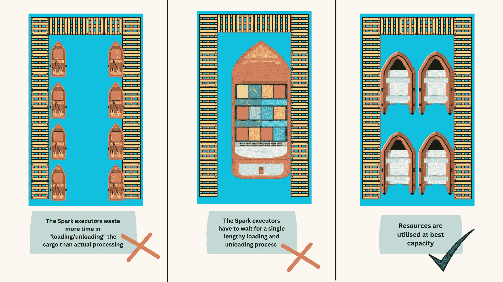
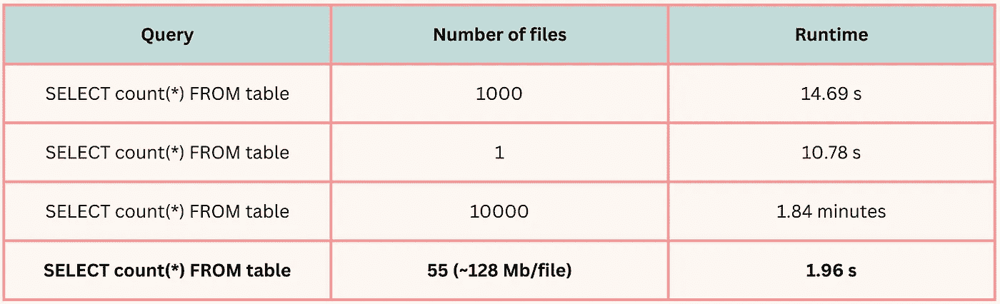
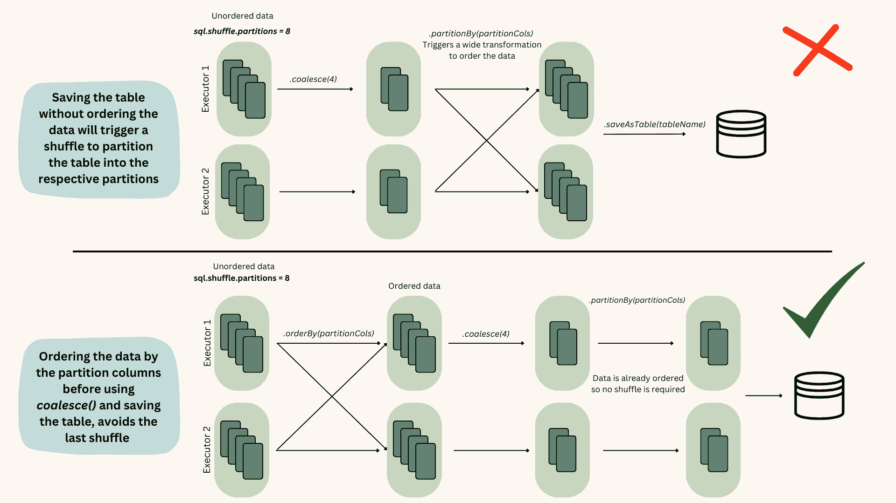

# 在 Apache Spark 中优化输出文件大小

> 原文：[`towardsdatascience.com/optimizing-output-file-size-in-apache-spark-5ce28784934c?source=collection_archive---------0-----------------------#2023-08-11`](https://towardsdatascience.com/optimizing-output-file-size-in-apache-spark-5ce28784934c?source=collection_archive---------0-----------------------#2023-08-11)

## 关于管理分区、重新分区和合并操作的全面指南

[](https://medium.com/@gianpiero.colonna?source=post_page-----5ce28784934c--------------------------------)[](https://towardsdatascience.com/?source=post_page-----5ce28784934c--------------------------------) [Gianpi Colonna](https://medium.com/@gianpiero.colonna?source=post_page-----5ce28784934c--------------------------------)

·

[关注](https://medium.com/m/signin?actionUrl=https%3A%2F%2Fmedium.com%2F_%2Fsubscribe%2Fuser%2F5767480ab9f9&operation=register&redirect=https%3A%2F%2Ftowardsdatascience.com%2Foptimizing-output-file-size-in-apache-spark-5ce28784934c&user=Gianpi+Colonna&userId=5767480ab9f9&source=post_page-5767480ab9f9----5ce28784934c---------------------post_header-----------) 发表在 [Towards Data Science](https://towardsdatascience.com/?source=post_page-----5ce28784934c--------------------------------) ·6 min read·2023 年 8 月 11 日[](https://medium.com/m/signin?actionUrl=https%3A%2F%2Fmedium.com%2F_%2Fvote%2Ftowards-data-science%2F5ce28784934c&operation=register&redirect=https%3A%2F%2Ftowardsdatascience.com%2Foptimizing-output-file-size-in-apache-spark-5ce28784934c&user=Gianpi+Colonna&userId=5767480ab9f9&source=-----5ce28784934c---------------------clap_footer-----------)

--

[](https://medium.com/m/signin?actionUrl=https%3A%2F%2Fmedium.com%2F_%2Fbookmark%2Fp%2F5ce28784934c&operation=register&redirect=https%3A%2F%2Ftowardsdatascience.com%2Foptimizing-output-file-size-in-apache-spark-5ce28784934c&source=-----5ce28784934c---------------------bookmark_footer-----------)

照片由 [zhao chen](https://unsplash.com/@zhaochen1975?utm_source=medium&utm_medium=referral) 提供，来源于 [Unsplash](https://unsplash.com/?utm_source=medium&utm_medium=referral)

想象一下你在掌管一个大型 Spark 数据处理操作。在 Spark 优化讨论中，一个经常提到的经验法则是，为了获得最佳的 I/O 性能和增强的并行性，每个数据文件的大小应接近 128Mb，这也是读取文件时的默认分区大小 [[1]](https://aws.amazon.com/blogs/big-data/top-10-performance-tuning-tips-for-amazon-athena/)。

想象你的文件像在数据处理海洋中航行的船只。如果船只太小，它们会浪费很多时间停靠和重新起航，这比喻为执行引擎花费额外时间打开文件、列出目录、获取对象元数据、设置数据传输和读取文件。相反，如果你的船只太大且未使用港口的许多码头，它们不得不等待单一的长时间装卸过程，这比喻为查询处理等待直到一个读者完成读取整个文件，这会减少并行性[图 1]。



图 1 — 作者提供的图片

为了生动地说明文件大小优化的重要性，请参阅下图。在这个特定的例子中，每个表包含 8 GB 的数据。



然而，驾驭这种微妙的平衡并非易事，特别是在处理大型批处理作业时。你可能会觉得你失去了对输出文件数量的控制。本指南将帮助你重新获得控制权。

# 理解的关键：分区

**写操作执行时，保存到磁盘的输出文件数量等于 Spark 执行器中的分区数量。** 然而，在执行写操作之前评估分区数量可能很棘手。

在读取表时，Spark 默认读取最大大小为 128Mb 的块（尽管你可以使用`sql.files.maxPartitionBytes`来更改这一点）。因此，分区的数量依赖于输入的大小。然而，实际上，分区的数量很可能等于`sql.shuffle.partitions`参数。这个数字默认为 200，但对于较大的工作负载，这通常是不够的。查看[这个](https://youtu.be/daXEp4HmS-E?t=1200)视频以了解如何设置理想的洗牌分区数量。

如果在 ETL 过程中至少有一个宽变换，Spark 执行器中的分区数量等于`sql.shuffle.partitions`。如果仅应用窄变换，则分区数量将与读取文件时创建的分区数量相匹配。

设置洗牌分区的数量仅在处理未分区的表时可以高层次地控制总分区数量。一旦进入分区表的领域，改变`sql.shuffle.partitions`参数不会轻易地调整每个数据文件的大小。

# 转轮：重新分区与合并

我们有两种主要的方法来管理运行时的分区数量：`repartition()`和`coalesce()`。以下是简要说明：

+   `**重新分区**`：`repartition(partitionCols, n_partitions)` 是一种延迟转换，具有两个参数——分区数和分区列。当执行时，Spark 会根据分区列在集群中重新排列分区。然而，**一旦表被保存，关于重新分区的信息会丢失。** 因此，在读取文件时，这个有用的信息将不会被使用。

```py
df = df.repartition("column_name", n_partitions)
```

+   `**合并**`：`coalesce(num_partitions)` 也是一种延迟转换，但只需一个参数——分区数。**重要的是，合并操作不会在集群中洗牌数据——因此比** `**重新分区**`**更快。** 此外，合并只能减少分区数，如果试图增加分区数则无效。

```py
df = df.coalesce(num_partitions)
```

**主要的见解是，使用合并方法通常更有利。** 这并不是说重新分区没有用；它确实有用，特别是当我们需要在运行时调整数据框的分区数时。

在我处理多个大小不一的表，并进行复杂转换和连接的 ETL 过程中，我发现 `sql.shuffle.partitions` 并不能提供我所需的精确控制。例如，在相同的 ETL 中，为两个小表和两个大表使用相同数量的洗牌分区会很低效——导致小表的分区过多或大表的分区不足。重新分区还有助于我避开倾斜连接和倾斜数据的问题 [2]。

话虽如此，重新分区在将表写入磁盘之前较不适用，并且在大多数情况下，可以用合并替代。在写入磁盘之前，合并比重新分区更具优势，原因有几个：

1.  它防止了不必要的数据在集群中的重新洗牌。

1.  它允许根据逻辑启发式排序数据。在写入之前使用重新分区方法时，数据在集群中重新洗牌，导致顺序丢失。另一方面，使用合并可以保留数据的顺序，因为数据是被收集在一起而不是重新分配。

让我们看看为什么数据排序至关重要。

# 未来的排序：数据排序的重要性

我们上面提到，当我们应用 `repartition` 方法时，Spark 不会将分区信息保存到表的元数据中。然而，在处理大数据时，这是一条至关重要的信息，原因有二：

1.  它允许在查询时更快地扫描表。

1.  它允许更好的压缩——如果处理的是可压缩格式（如 parquet、CSV、Json 等）。[这篇文章](https://medium.com/datadenys/how-to-improve-clickhouse-table-compression-697ef8f4ccb3) 是理解原因的好资料。

关键要点是**在保存之前排序数据**。这些信息将保存在元数据中，并在查询时使用，从而使查询速度更快。

现在让我们探讨一下保存到非分区表和分区表之间的区别，以及为什么保存到分区表需要额外的调整。

# 管理分区表中的文件大小

对于非分区表，在保存操作过程中管理文件数量是一个直接的过程。无论数据是否排序，使用 `coalesce` 方法在保存之前都能完成任务。

```py
# Example of using coalesce method before saving a non-partitioned table
df.coalesce(10).write.format("parquet").save("/path/to/output")
```

然而，当处理分区表时，这种方法并不有效，除非在合并之前数据已经被排序。为了理解为什么会这样，我们需要深入探讨在 Spark 执行器中数据排序与未排序时发生的操作 [fig.2]。



图 2 — 作者提供的图片

因此，保存数据到分区表的标准流程应该是：

```py
# Example of using coalesce method after ordering the data in a partitioned table
df.orderBy("columnName").coalesce(10).write.format("parquet").save("/path/to/output_partitioned")
```

# 其他导航工具

除了 `repartition` 和 `coalesce`，你可能会发现 `maxnumberofrecords` 很有用。这是一个防止文件过大的实用方法，并可以与上述方法一起使用。

```py
df.write.option("maxRecordsPerFile", 50000).save("file_path")
```

# 最终思考

在 Spark 作业中掌握文件大小通常涉及试错。在存储空间便宜且处理能力触手可及的时代，容易忽视优化。但随着数据处理量达到 tera 和 petabytes，忘记这些简单的优化技巧可能会在金钱、时间和环境方面产生重大成本。

我希望这篇文章能帮助你有效调整 ETL 过程。愿你像经验丰富的海船船长一样，自信且清晰地驾驭 Spark 的海洋。
