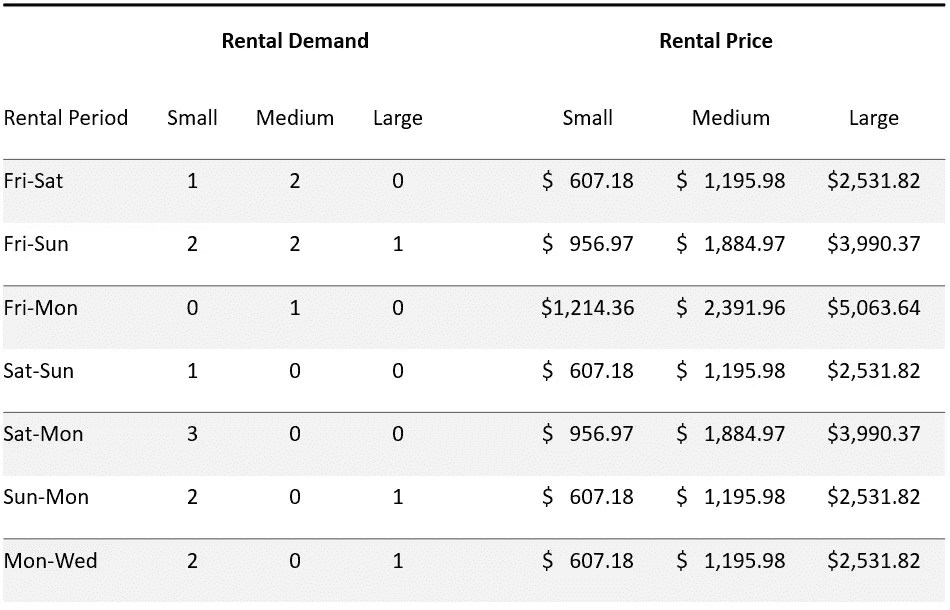

# 优化度假小屋租赁收入

> 原文：[`towardsdatascience.com/optimizing-vacation-cabin-rental-revenues-730d2847a2ed?source=collection_archive---------13-----------------------#2023-03-08`](https://towardsdatascience.com/optimizing-vacation-cabin-rental-revenues-730d2847a2ed?source=collection_archive---------13-----------------------#2023-03-08)

## 简要了解收益管理科学及其 Python 演示

 [Chris Garcia](https://medium.com/@cgarcia_80823?source=post_page-----730d2847a2ed--------------------------------)

·

[关注](https://medium.com/m/signin?actionUrl=https%3A%2F%2Fmedium.com%2F_%2Fsubscribe%2Fuser%2F8a75b360a94b&operation=register&redirect=https%3A%2F%2Ftowardsdatascience.com%2Foptimizing-vacation-cabin-rental-revenues-730d2847a2ed&user=Chris+Garcia&userId=8a75b360a94b&source=post_page-8a75b360a94b----730d2847a2ed---------------------post_header-----------) 发表在 [Towards Data Science](https://towardsdatascience.com/?source=post_page-----730d2847a2ed--------------------------------) ·9 分钟阅读·2023 年 3 月 8 日

--

图片由 [Evelyn Paris](https://unsplash.com/de/@evelynparis?utm_source=medium&utm_medium=referral) 提供，来源于 [Unsplash](https://unsplash.com/?utm_source=medium&utm_medium=referral)

如果你曾经购买过机票，你一定意识到时间对价格的影响。一个提前六个月购票的休闲旅客可能只需支付$200，而一个前一天才买票的商务旅客则需支付$3,300。类似的情况也会出现在我们预订酒店房间、租车或安排高尔夫球场的开球时间时。如果你曾经想知道背后的原理以及它是如何运作的，答案就是收益管理。

收入管理是一个数据驱动的企业，将客户细分、预测分析与机器学习、实验设计和数学优化以协调的方式结合起来，以最大化利用现有容量获得的收入。通过理解收入管理的原则，数据科学家可以运用他们的技能帮助公司和客户实现收入的显著增长。

## **收入管理的科学**

收入管理（RM）是预测微观市场层面上实时客户需求的科学，并优化产品或服务的价格和可用性[1]。RM 由美国航空公司在 1980 年代首次提出，回应了新兴低票价竞争对手 People Express 的威胁。美国航空的 RM 系统在休闲和商务乘客之间区分了价格。它还使用优化算法来决定多少座位开放给早期预订的低票价乘客，多少座位保护给后期预订的高票价商务乘客。这种方法非常成功，恢复了美国航空的盈利能力，同时最终导致了 People Express 的关闭。因此，许多其他行业也开始采用 RM。

RM 的目标是通过正确的渠道在正确的时间以正确的价格向正确的客户提供合适的产品或服务。传统上，RM 是为在少数条件下运营的企业开发的：

+   *固定容量：* 例如，航空公司有固定的机队规模，酒店有固定数量的房间。

+   *易腐产品或服务：* 例如，某一日期的未售座位或酒店房间无法在以后销售。

+   *客户提前预订资源*（例如，预订航班或酒店房间）

如今，RM 技术正在超越这些假设，适用于电子商务等新兴行业。然而，总体而言，RM 涉及四个相互关联的活动：

关键的收入管理活动

*1\. 市场细分*

首先的活动是根据使用模式或需求识别不同的客户群体。例如，航空公司将客户分为早期预订的休闲乘客和后期预订的商务乘客，而租车公司则根据客户是否需要紧凑型、中型或豪华车辆进行划分。

*2\. 确定价格响应*

在进行细分后，我们必须确定价格响应，并根据情况选择最佳价格。如果我们将某个细分市场的价格定得过低，可能会轻松销售，但也会错失收入。相反，如果价格定得过高，我们可能会因顾客拒绝我们的报价而损失收入。因此，我们必须确定每个细分市场愿意支付的最佳价格，以及价格上涨对需求的影响。这通常通过定价实验来完成，也可以结合竞争对手和行业数据。实验应在真实市场条件下进行，并定期重复，因为通货膨胀、工资增长、假期和新竞争者等因素都可能影响价格响应。

*3\. 预测需求*

为了开始应用收益管理，我们需要指定一个时间范围，然后预测该时间范围内每个细分市场在每个使用时段的需求。由于收益管理在微观经济层面运作，时间范围通常是短期的，并且持续时间较短。一个使用时段可能是航空行业的航班段，或者是酒店行业的周五至周日住宿。因此，例如，我们预测每个航班段的休闲和商务乘客的需求，或者每个可预订时间间隔的小房间和大房间的需求。

*4\. 优化容量分配*

一旦我们估算了每个细分市场的需求，就需要确定如何分配我们的容量，以在整个时间范围内最大化收入。这告诉我们，例如，应该卖出多少座位给休闲乘客，留出多少座位给商务乘客，或者在每个时间段内要使用多少辆车来满足紧凑需求，多少辆车来满足豪华需求。这手动进行可能会非常困难，因为使用时段可能会重叠，导致相同资源无法同时使用。当有利时，还可以进行替代（例如，将大房间提供给请求小房间的客人），进一步增加了复杂性。因此，容量分配通常通过[整数规划](https://medium.com/hackernoon/mixed-integer-programming-a-straight-forward-tutorial-41cc50fb9c23)来完成。

这四项活动应该被视为关键要素，而不是过程中的严格步骤。一些收益管理系统主要关注容量分配，在销售期间之前固定价格，而其他系统则根据不断变化的市场条件频繁更新价格。这些活动需要根据每个应用的具体情况进行协调，以实现最佳的投资回报。

## **示例场景：优化度假小屋租赁收入**

我们将展示一个 RM 活动，即容量分配，并展示它对收入的影响。这个示例可以在 Jupyter notebook [**这里**](https://nbviewer.org/github/chrisgarcia001/Notebooks/blob/master/cabin_rental_revenue_management/Cabin%20Rental%20Revenue%20Management.ipynb) 查看。这个示例的源代码和数据文件可以在 [**这里**](https://github.com/chrisgarcia001/Notebooks/tree/master/cabin_rental_revenue_management)** 找到**。

一家度假小屋租赁公司拥有以下资源：

+   3 个小型舱位

+   5 个中型舱位

+   3 个大型舱位

我们将假设我们已经确定了即将到来的长周末的最佳价格和准确的需求预测，如下所示：

目标是确定每种舱位类型分配到不同需求时间段的数量，以最大化收入。我们从导入关键库和读取数据开始：

## **建模问题**

我们将制定并解决一个整数规划（IP）模型，将容量分配到需求预测中，以最大化获得的收入。这个模型将舱位分配到需求时间段，形式为（*时间区间，舱位大小*）对，并使用二进制指示器来指定允许的替代。我们从定义模型输入开始：

接下来，我们定义我们的决策变量：

优化模型现在可以表述如下：

在上述模型中，目标函数 (1) 只是所有收入在期间内的总和。约束条件 (2) 确保我们不会对任何舱位类型进行超额预订。我们通过确保对于任何舱位类型 *i* 和时间段 *j*，分配到时间段 *j* 或任何与 *j* 起始时间重叠的时间段的 *i* 类型舱位的总数不会超过可用的 *i* 类型舱位数量来实现这一点。约束条件 (3) 确保我们不会为任何时间段分配超过需求的舱位。约束条件 (4) 确保我们不会通过将舱位分配到无法满足的时间段而做出无效替换。最后，约束条件 (5) 确保决策变量的值为非负整数。

下面我们定义一个 Python 函数，从输入数据构建这个整数规划（IP）模型的实例：

## **获得最佳容量分配计划**

现在我们将创建一个优化函数来解决模型，该函数将确定我们的最佳销售计划和获得的收入。为此，我们首先需要创建一些辅助函数，将原始数据转换为模型所需的格式。

现在我们可以优化并查看根据销售计划得到的收入。在这个示例中，我们将允许较大的舱位替代较小的舱位。

运行上述代码将得到如下结果：

有趣的是，当我们查看这个**最优分配计划**时，我们注意到经常发生将较大的舱位替换为较小舱位的情况。正如我们将看到的，允许这些类型的替换对收入有很大的影响。

## **以人为方式解决问题：先到先得**

将最优政策与一个人可能在没有 RM 的情况下实施的政策进行比较是很有启发性的。在这种情况下，代理将根据请求的到达顺序（先到先得）简单地出售舱位预订。在这种情况下使用替换也没有多大意义，因为我们永远不知道下一个请求是否会是带来更多收入的较大舱位。

FCFS 产生的收入对请求的顺序非常敏感；这些请求可能以一种恰好把我们的舱位绑在非常不理想的方式的顺序到达，或者我们可能会运气好，得到一个接近最大收入的顺序。下面的代码实现了 FCFS 政策，并附带一个预处理函数，将原始数据转换为算法所需的形式。在预处理函数中，我们随机排列预订请求，以模拟它们在现实世界中的到达方式。

## **比较政策**

下面我们将比较两种优化变体（一个不允许替换，另一个允许较大的舱位替换较小的舱位）与 FCFS 的收入影响。我们将运行 FCFS 100 次，每次随机排列预订请求，并将最差、中位（即典型）和最佳情况与两种优化结果进行比较。

运行这个会产生以下结果：

比较政策时，我们看到 FCFS 通常会留下未利用的收入——如果运气不好，这可能是一个相当大的数额。只有在最好的情况下，FCFS 才能达到在不允许替换的情况下的最大收入（这总是由优化 B 政策实现的）。然而，通过允许替换和优化，我们可以大幅提升收入——在最坏情况下增加超过 22%（或周末超过 4,000 美元）。此外，这额外的收入是利用现有容量赚取的，没有产生额外的成本，因此完全是利润。这一比较展示了 RM 的影响。

最后需要指出的是，有效的容量分配依赖于准确的需求预测，以作为优化输入。有些周我们的预测可能会失误。然而，假设预测通常可以 reasonably 精确，使用 RM 的系统将整体上优于不使用的系统。

## **结论**

收入管理是一门能够显著提高现有容量收入的科学。通过将 RM 的元素纳入销售过程，公司可以开始在不产生额外运营成本的情况下增加收入。

*除非另有说明，所有数据和图片均由作者提供。*

## **参考文献**

[1] Cross, R.B. (1997). *收入管理：市场主导的硬核策略*. 纽约：百老汇书籍，第 276 页。
