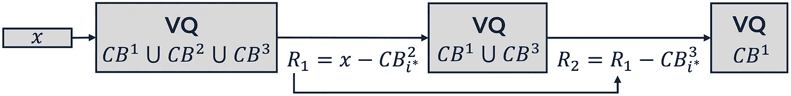
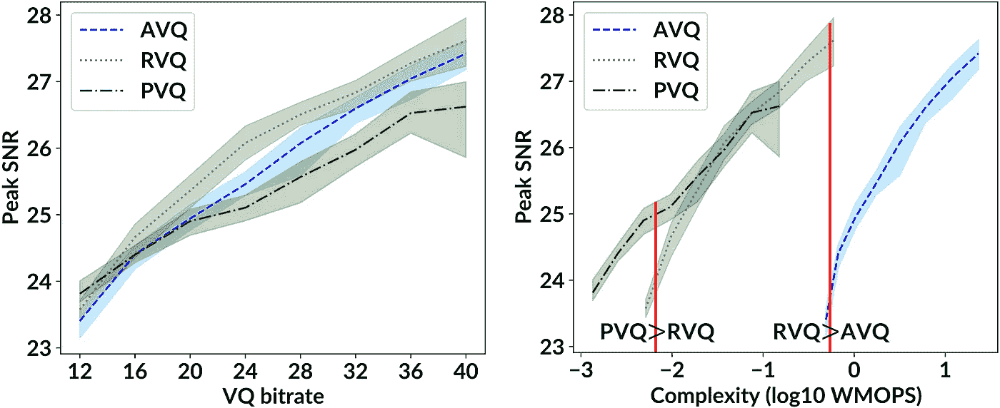

# 优化向量量化方法的机器学习算法

> 原文：[`towardsdatascience.com/optimizing-vector-quantization-methods-by-machine-learning-algorithms-77c436d0749d?source=collection_archive---------4-----------------------#2023-05-17`](https://towardsdatascience.com/optimizing-vector-quantization-methods-by-machine-learning-algorithms-77c436d0749d?source=collection_archive---------4-----------------------#2023-05-17)

## 本文简要解释了我们在 ICASSP 2023 会议上发表的论文 [1]。有关更多详细信息，请查看[此链接](https://ieeexplore.ieee.org/abstract/document/10096204)中的论文。

 [Mohammad Hassan Vali](https://medium.com/@mohammad.vali?source=post_page-----77c436d0749d--------------------------------)

机器学习优化向量量化方法，用于神经网络的端到端训练

[关注](https://medium.com/m/signin?actionUrl=https%3A%2F%2Fmedium.com%2F_%2Fsubscribe%2Fuser%2F840f2c687344&operation=register&redirect=https%3A%2F%2Ftowardsdatascience.com%2Foptimizing-vector-quantization-methods-by-machine-learning-algorithms-77c436d0749d&user=Mohammad+Hassan+Vali&userId=840f2c687344&source=post_page-840f2c687344----77c436d0749d---------------------post_header-----------) 发表在 [Towards Data Science](https://towardsdatascience.com/?source=post_page-----77c436d0749d--------------------------------) ·10 分钟阅读·2023 年 5 月 17 日

--

> 

·

照片由 [Alina Grubnyak](https://unsplash.com/@alinnnaaaa?utm_source=unsplash&utm_medium=referral&utm_content=creditCopyText) 提供，发布于 [Unsplash](https://unsplash.com/photos/ZiQkhI7417A?utm_source=unsplash&utm_medium=referral&utm_content=creditCopyText)

# 向量量化

向量量化（VQ）是一种数据压缩技术，类似于 k-means 算法，可以对任何数据分布进行建模。向量量化已被广泛应用于语音、图像和视频数据，如图像生成 [2]、语音和音频编码 [3]、语音转换 [4,5]、音乐生成 [6] 和文本到语音合成 [7,8]。下图展示了向量量化（VQ）的工作原理。对于 VQ 过程，我们需要一个包括多个代码字的码本。对数据点（灰色点）应用 VQ 意味着将其映射到最近的代码字（蓝色点），即用最近代码字的值替换数据点的值。每个 Voronoi 单元（黑线）包含一个代码字，使得该单元中所有的数据点都将映射到该代码字，因为它是该 Voronoi 单元中数据点的最近代码字。

向量量化操作（作者提供的图像）

换句话说，向量量化通过以下公式将输入向量 x 映射到码本（CB）中的最近代码字：

VQ 的计算复杂度随着码本大小（VQ 比特率的增加）的增加而呈指数增长。因此，这种简单形式的 VQ 仅适用于有限的比特率（有限的码本大小）。为了解决这一挑战并将 VQ 应用于更高的比特率和更高维的数据，我们使用了 VQ 的一些变体，如残差 VQ、加法 VQ 和乘积 VQ。这些方法考虑了多个码本来对数据应用 VQ。我们将在下文中解释这三种 VQ 方法。

# **残差向量量化（RVQ）**

残差 VQ 通过对输入向量 x 应用 M 个连续的 VQ 模块来进行量化。根据下图，假设 M=3。我们使用第一个码本（CB¹）对输入向量 x 应用第一个 VQ 模块。然后，在找到第一个码本中的最近代码字后，我们计算剩余值（R1）。接着，我们将 R1 作为输入传递给使用第二个码本（CB²）的下一个 VQ 模块。这个过程将持续 M 个阶段，其中我们会找到来自不同码本的三个最近代码字。最后，我们将输入向量 x 量化为 M 个最近代码字的总和。

# **加法向量量化（AVQ）**

类似于残差 VQ，加法 VQ 通过应用 M 个连续的 VQ 模块来量化输入向量 x。然而，加法 VQ 采用复杂的束搜索算法来找到量化过程中的最接近代码字（你可以在这篇论文 [9] 中找到束搜索算法的详细信息）。根据下图，我们假设 M=3。在加法 VQ 中，我们首先从所有三个代码本的联合中搜索最接近的代码字（这里是 CB¹、CB²、CB³）。然后，假设我们从 CB² 找到最佳代码字。接下来，我们计算残差 (R1) 并将其作为输入传递给下一个 VQ 模块。由于第一个代码字是从 CB² 中选择的，现在我们在 CB¹ 和 CB³ 的联合中搜索最接近的代码字。在计算残差 R2 后，我们将其作为输入传递给最后的 VQ 模块，在这里我们使用尚未参与量化过程的最后一个代码本（在此例中是 CB¹）进行搜索。最后，我们将输入向量 x 量化为 M 个最接近代码字的和。

# **产品向量量化（PVQ）**

产品 VQ 将维度为 D 的输入向量 x 拆分为 M 个独立的维度为 D/M 的子空间。然后，它对这些子空间应用 M 个独立的 VQ 模块。最后，产品 VQ 将输入向量 x 量化为 M 个最接近的代码字的连接（每个代码本一个）。下图展示了 M=3 时的产品 VQ。

# **代码本优化**

向量量化（VQ）训练意味着优化代码本，使其以一种模型数据分布的方式来最小化数据点与代码本元素之间的量化误差（如均方误差）。为了优化上述三种 VQ 变体（残差 VQ、加法 VQ 和产品 VQ）的代码本，有不同的方法，我们将在后文中提到。

## 1\. K-均值算法（传统方法）：

根据文献综述，在大多数论文中，这三种 VQ 方法的代码本都是通过 [K-均值算法](https://en.wikipedia.org/wiki/K-means_clustering) 进行优化的。

## 2\. 随机优化（机器学习算法）：

机器学习优化算法是基于梯度计算的。因此，使用机器学习优化来优化向量量化方法是不可能的，因为向量量化函数中的 argmin 函数（上面的第一个方程）是不可微的。换句话说，我们无法在反向传播中将梯度传递过向量量化函数。这里我们提到了两种解决这个问题的方法。

## 2.1\. 直接估计器（STE）

STE [10] 通过在反向传播过程中简单地将梯度完整地复制到 VQ 模块中来解决问题。因此，它没有考虑向量量化的影响，从而导致梯度与 VQ 函数的真实行为之间的不匹配。

## 2.2\. 矢量量化中的噪声替代 (NSVQ):

NSVQ 技术 [11] 是我们最近提出的方法，其中通过向输入向量添加噪声来模拟矢量量化误差，使得模拟噪声获得原始 VQ 误差分布的形状（你可以简要阅读关于 NSVQ 的内容 [在这篇文章中](https://medium.com/towards-data-science/improving-vector-quantization-in-vector-quantized-variational-autoencoders-vq-vae-915f5814b5ce)）。

NSVQ 技术 [11] 相较于 STE 方法 [10] 具有以下优势。1) NSVQ 为 VQ 函数提供更准确的梯度。2) NSVQ 实现了 VQ 训练（代码本优化）的更快收敛。3) NSVQ 无需对 VQ 训练进行额外的超参数调整（不需要在全局优化损失函数中添加额外的损失项）。

# 实验

在我们的论文中，我们使用了我们最近提出的 NSVQ 技术 [11] 来优化上述三种 VQ 变体。为了评估这三种 VQ 方法的性能，并研究它们在准确性、比特率和复杂性之间的权衡，我们进行了四种不同场景的实验。我们将在以下部分解释这些实验场景。

## 1\. 近似最近邻（ANN）搜索

在这个实验中，我们通过在 SIFT1M 数据集 [12]（128-D 图像描述符）上训练三种 VQ 方法来建模其分布。SIFT1M 图像描述符数据集 [12] 包括 10⁶ 个基向量、10⁵ 个学习向量和 10⁴ 个测试用的查询向量。实际的最近邻集合从基向量到查询向量。在 ANN 搜索中，我们首先使用在学习集上训练的对应学习到的代码本来压缩基向量。然后，对于每个查询向量，我们通过进行穷尽搜索来从压缩的基向量中找到近似的最近邻。为了评估数据压缩的质量，我们在不同的 ***T*** 参数值下计算 *召回率度量*，该度量显示实际最近邻（从实际数据中）是否存在于前 ***T*** 个计算的最近邻中。下图展示了使用我们提出的 NSVQ 技术优化的三种 VQ 变体与基线方法在 *召回率度量* 下的比较。一般来说，所有三种基于机器学习优化的 VQ 方法在召回率值上与基线相当（在 RVQ 的情况下甚至略好）。

比较我们提出的 VQ 方法和基线方法在 64 位（每个 8 个代码本，每个有 256 个码字）下对 SIFT1M 数据集的压缩召回值；Recall@T 显示实际最近邻（从实际数据中）是否存在于 T 个计算的最近邻中。（图片由作者提供）

## 2\. 使用 VQ-VAE 的图像压缩

在这个实验中，我们在 CIFAR10 数据集的训练集上训练了一个向量量化变分自编码器（VQ-VAE）以进行压缩。为了在 VQ-VAE 的瓶颈中应用向量量化，我们使用了这三种 VQ 方法中的每一种。训练后，我们使用训练好的编码器、解码器和学习到的码本重建了 CIFAR10 的测试图像。为了评估重建图像的质量，我们使用了峰值信噪比（Peak SNR）指标。此外，我们使用加权每秒百万操作（WMOPS）指标计算了每种 VQ 方法的复杂度，该指标符合[ITU-T 标准](https://en.wikipedia.org/wiki/ITU-T)。下图展示了这个实验的结果。

在图像压缩场景下，提出的 VQ 方法在 15k 训练批次和 10 次单独实验中的峰值 SNR 和复杂度；线条表示均值，对应的填充区域表示其 95%分位数。对于所有 VQ 比特率，我们使用了四个码本，即 M=4。（图像由作者提供）

根据复杂度图（右侧），我们发现，对于相同的计算资源使用（左侧垂直红线）和较高的比特率，乘积 VQ 比残差 VQ 表现更好。此外，对于相同的计算资源使用（右侧垂直红线）和较高的比特率，残差 VQ 比加法 VQ 表现更好。因此，根据可用的计算资源，我们可以得出最适合使用的 VQ 方法。

## 3\. 语音编码

在这个实验中，我们使用[13]中提出的语音编解码器，通过三种 VQ 方法对语音信号的谱包络进行建模。为了评估解码后语音信号的质量，我们使用了语音质量感知评估（PESQ）和感知加权信噪比（pSNR）作为客观指标。下图展示了所有三种 VQ 方法在 PESQ 和 pSNR 标准下的表现。根据结果，我们观察到，在这两个指标中，加法 VQ 的均值更高且方差更低，相比于残差 VQ 和乘积 VQ。

提出的 VQ 方法在语音编码场景下，针对 16 位 VQ（具有 4 个码本，即 M=4）在总体比特率为 8, 9.6, 13.2, 16.4, 24.4 和 32 kbit/s 时，PESQ 和 pSNR 指标的性能；实线表示 PESQ 和 pSNR 的均值，对应的填充区域表示其 95%分位数。（图像由作者提供）

## 4\. 示例

在这个实验中，我们打算比较三种 VQ 方法在数据相关性方面的表现。因此，我们准备了两个维度为 64 的相关和不相关的数据集。然后，我们使用这三种 VQ 方法对这些数据集进行压缩。为了评估性能，我们计算了每个数据集及其量化版本之间的均方误差（MSE）。下图展示了这个实验的结果。

使用三种提出的 VQ 方法（数据维度=64，所有 VQ 比特率使用了四个码本，即 M=4）对相关和无关数据集进行的向量量化误差。（图片由作者提供）

在相关数据集的情况下，由于残差 VQ 和加法 VQ 考虑了所有数据维度之间的相关性，它们的量化误差远低于乘积 VQ，符合预期。另一方面，对于无关的数据，乘积 VQ 的表现优于加法 VQ 和残差 VQ，因为数据维度之间没有相关性，这正是乘积 VQ 的假设。

# 结论

使用诸如残差 VQ、加法 VQ 和乘积 VQ 等向量量化（VQ）变体，允许将 VQ 应用于高比特率和高维数据。这些 VQ 方法目前已经通过经典的期望最大化和 k-均值算法进行了优化。在本文中，我们通过机器学习优化来优化这些 VQ 方法，采用了我们最近提出的向量量化噪声替代（NSVQ）[11]技术。此外，NSVQ 还允许在神经网络中对 VQ 方法进行端到端优化。我们还研究了这三种 VQ 方法之间比特率、准确性和复杂性的权衡。因此，我们的开源实现[14]有助于为特定用例选择最佳的 VQ 方法。

# GitHub 存储库

我们在以下网页提供了这些 VQ 方法的 PyTorch 实现。

[## GitHub - MHVali/Additive-Residual-Product-Vector-Quantization-Methods](https://github.com/MHVali/Additive-Residual-Product-Vector-Quantization-Methods.git?source=post_page-----77c436d0749d--------------------------------)

### 通过创建一个帐户来为 MHVali/Additive-Residual-Product-Vector-Quantization-Methods 的开发做出贡献…

[github.com](https://github.com/MHVali/Additive-Residual-Product-Vector-Quantization-Methods.git?source=post_page-----77c436d0749d--------------------------------)

## 致谢

特别感谢我的博士项目导师[Prof. Tom Bäckström](https://research.aalto.fi/en/persons/tom-bäckström)，他支持了我并为这项工作作出了贡献。

# **参考文献**

[1] M. H. Vali 和 T. Bäckström，“向量量化方法在语音和图像处理中的随机优化”，载于 *ICASSP 会议论文集*，2023 年。

[2] A. Razavi、A. van den Oord 和 O. Vinyals，“使用 VQ-VAE-2 生成多样化的高保真图像”，载于 *NeurIPS 会议论文集*，2019 年。

[3] C. Gârbacea、A. van den Oord、Y. Li、F. S. C. Lim、A. Luebs、O. Vinyals 和 T. C. Walters，“使用 VQ-VAE 和 Wavenet 解码器的低比特率语音编码”，载于 *ICASSP 会议论文集*，2019 年。

[4] B. van Niekerk、L. Nortje 和 H. Kamper，“用于零语音 2020 挑战中的声学单元发现的向量量化神经网络”，载于 *Interspeech 会议论文集*，2020 年。

[5] S. Ding 和 R. Gutierrez-Osuna，“用于非平行语音转换的向量量化变分自编码器的群体潜在嵌入，”见于 *Interspeech 会议录*，2019 年。

[6] P. Dhariwal, H. Jun, C. Payne, J. W. Kim, A. Radford 和 I. Sutskever，“Jukebox: 一种音乐生成模型，” *arXiv 预印本 arXiv:2005.00341*，2020 年。

[7] A. Tjandra, B. Sisman, M. Zhang, S. Sakti, H. Li 和 S. Nakamura，“VQVAE 无监督单元发现及多尺度 code2spec 逆变器用于 Zerospeech 挑战 2019，”见于 *Interspeech 会议录*，2019 年。

[8] X. Wang, S. Takaki, J. Yamagishi, S. King 和 K. Tokuda，“用于统计参数语音合成的向量量化变分自编码器 (VQ-VAE) 自回归神经 F0 模型，” *IEEE 音频、语音与语言处理学报*，2020 年。

[9] A. Babenko 和 V. Lempitsky，“极端向量压缩的加性量化，”见于 *CVPR 会议录*，2014 年。

[10] Y. Bengio, N. Léonard 和 A. Courville，“通过随机神经元估计或传播梯度以进行条件计算，” *arXiv 预印本 arXiv:1308.3432*，2013 年。

[11] M. H. Vali 和 T. Bäckström，“NSVQ: 机器学习中向量量化的噪声替代，” *IEEE Access*，第 10 卷，2022 年。

[12] H. Jegou, M. Douze 和 C. Schmid，“用于最近邻搜索的产品量化，” *IEEE 计算机学会模式分析与机器智能学报*，第 33 卷，第 1 期，页码 117–128，2010 年。

[13] M. H. Vali 和 T. Bäckström，“端到端优化的多阶段光谱包络向量量化用于语音和音频编码，”见于 *Interspeech 会议录*，2021 年。

[14] [`gitlab.com/speech-interaction-technology-aalto-university/vq-variants`](https://gitlab.com/speech-interaction-technology-aalto-university/vq-variants)
