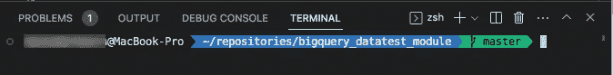
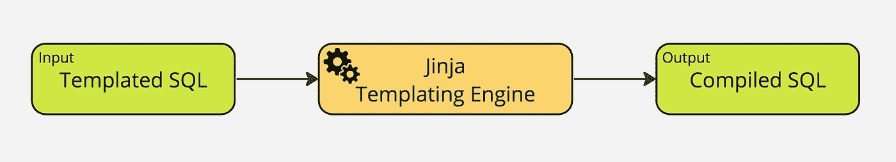
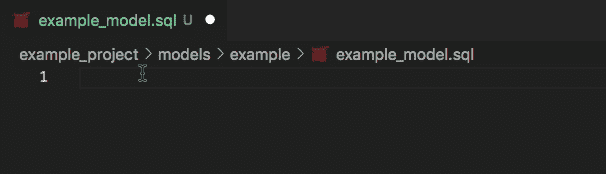
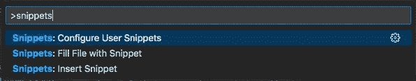
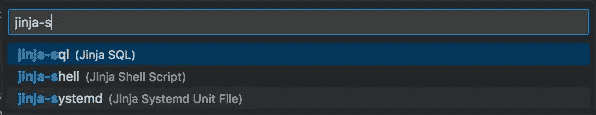
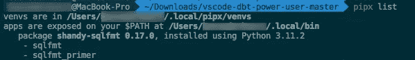
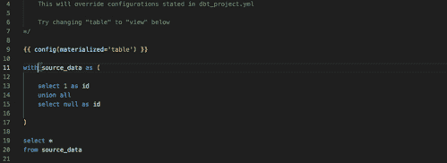
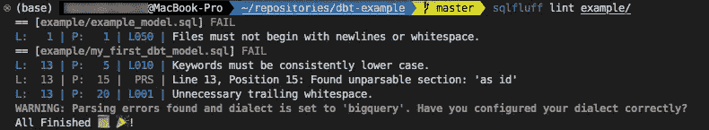

# 在 Mac 上优化 VS Code 以适应 dbt

> 原文：[`towardsdatascience.com/optimizing-vs-code-for-dbt-on-mac-a56dd27ba8d5?source=collection_archive---------7-----------------------#2023-04-05`](https://towardsdatascience.com/optimizing-vs-code-for-dbt-on-mac-a56dd27ba8d5?source=collection_archive---------7-----------------------#2023-04-05)

## 在 Visual Studio Code 中最大化你的 dbt 生产力指南

[](https://medium.com/@sebasn?source=post_page-----a56dd27ba8d5--------------------------------)[](https://towardsdatascience.com/?source=post_page-----a56dd27ba8d5--------------------------------) [Bas Nederkoorn](https://medium.com/@sebasn?source=post_page-----a56dd27ba8d5--------------------------------)

·

[关注](https://medium.com/m/signin?actionUrl=https%3A%2F%2Fmedium.com%2F_%2Fsubscribe%2Fuser%2F37a0396260cd&operation=register&redirect=https%3A%2F%2Ftowardsdatascience.com%2Foptimizing-vs-code-for-dbt-on-mac-a56dd27ba8d5&user=Bas+Nederkoorn&userId=37a0396260cd&source=post_page-37a0396260cd----a56dd27ba8d5---------------------post_header-----------) 发表在 [Towards Data Science](https://towardsdatascience.com/?source=post_page-----a56dd27ba8d5--------------------------------) ·9 分钟阅读·2023 年 4 月 5 日[](https://medium.com/m/signin?actionUrl=https%3A%2F%2Fmedium.com%2F_%2Fvote%2Ftowards-data-science%2Fa56dd27ba8d5&operation=register&redirect=https%3A%2F%2Ftowardsdatascience.com%2Foptimizing-vs-code-for-dbt-on-mac-a56dd27ba8d5&user=Bas+Nederkoorn&userId=37a0396260cd&source=-----a56dd27ba8d5---------------------clap_footer-----------)

--

[](https://medium.com/m/signin?actionUrl=https%3A%2F%2Fmedium.com%2F_%2Fbookmark%2Fp%2Fa56dd27ba8d5&operation=register&redirect=https%3A%2F%2Ftowardsdatascience.com%2Foptimizing-vs-code-for-dbt-on-mac-a56dd27ba8d5&source=-----a56dd27ba8d5---------------------bookmark_footer-----------)

（图片来自[Unsplash](https://unsplash.com/photos/PqRvLsjD_TU)）

如果你在使 VS Code 和 dbt 良好协同工作方面遇到困难，你并不孤单。将它们集成可能具有挑战性，但它将提高你的建模效率。这就是我分享对我有效的设置的原因。

在本文中，我将涵盖诸如升级终端以便快速回忆命令、利用可以更快构建模型的扩展，以及设置格式化和检查以清理代码和发现 SQL 中的错误等主题。

如果你实施本文中的提示，你将减少在输入代码、运行模型、清理代码和寻找错误上浪费的时间。这些节省下来的时间你可以用来创建增加价值的数据模型。虽然我在写这篇文章时以 Mac 用户为目标，但许多这些提示对 Windows 用户也同样适用。

**开始所需：**

+   Visual Studio Code

+   `homebrew`包管理器。安装说明 [在这里](https://docs.brew.sh/Installation)

+   Python 3.7 或更高版本以及安装了`dbt`的虚拟环境。有关详细信息，请参阅[官方文档](https://docs.getdbt.com/docs/core/pip-install)。

+   一个 dbt 项目。本文不详细介绍如何设置 dbt 项目。如果你没有这方面的经验，我建议你首先完成官方的 dbt [jaffle shop 教程](https://docs.getdbt.com/docs/quickstarts/dbt-core/quickstart)。

让我们深入了解吧！

# 1\. 优化你的终端

你可以改善你内部的 VS Code 终端，使其看起来和行为更像[iTerm](https://iterm2.com/)。安装[Oh-My-Zsh](https://ohmyz.sh/)和一些附加软件包可以解锁以下好处：

+   **自动补全**，在你想快速调用`dbt run -m {specific_model_you_ran_a_while_ago}`时非常有用

+   **Git 分支可视化**

+   **语法高亮**，例如检查你输入的命令是否存在于`$PATH`中

如果你没有`zsh`（较新的 Mac 已预装），请运行：

```py
brew install zsh
```

运行以下命令来安装 Oh-My-Zsh：

```py
sh -c "$(curl -fsSL https://raw.github.com/ohmyzsh/ohmyzsh/master/tools/install.sh)"
```

现在你可以选择一个主题。我最喜欢的是*Agnoster*，因为它具有良好的 git 分支可视化。选择主题可以在你家目录中的 zsh 配置文件中完成。通过运行以下命令打开这个文件：

```py
code ~/.zshrc
```

修改`ZSH_THEME`以设置你喜欢的主题。保存并关闭。`.zshrc`中的更改将在你重新启动终端时显示。

> ***注意*** *要刷新当前终端窗口的设置，你可以运行：* `*source ~/.zshrc*`

Git 分支可视化使用了一些特定的图标，你可以通过所谓的“Nerd Font”在终端中显示这些图标。我喜欢 Dejavu Sans Mono Nerd Font，你可以使用`homebrew`安装它[[1]](#ce33)：

```py
brew tap homebrew/cask-fonts && brew install --cask font-dejavu-sans-mono-nerd-font
```

接下来，确保你的 VS Code 终端使用新字体。转到命令面板（**Cmd + Shift + P**）并通过输入*open settings*打开`settings.json`。在文件中添加以下行：

```py
 "terminal.integrated.fontFamily": "DejaVuSansMono Nerd Font",
```

> ***注意：*** *确保选择的是通用* 用户设置 *文件，而不是项目特定的* 工作区设置 *文件。稍后，当配置与 dbt 相关的设置时，我们将使用工作区设置。*

你的 VS Code 终端现在应该看起来像这样：



（作者截图）

最后的步骤是安装`zsh-autocompletion`和`zsh-syntax-highlighting`软件包[2]，[3]。通过运行以下命令来安装它们：

```py
git clone https://github.com/zsh-users/zsh-autosuggestions ${ZSH_CUSTOM:-~/.oh-my-zsh/custom}/plugins/zsh-autosuggestions && \

git clone https://github.com/zsh-users/zsh-syntax-highlighting.git ${ZSH_CUSTOM:-~/.oh-my-zsh/custom}/plugins/zsh-syntax-highlighting
```

将它们添加到`~/.zshrc`文件中的`plugins`变量中：

```py
plugins=(git zsh-autosuggestions zsh-syntax-highlighting)
```

> ***终端的最终说明：*** *我简要提到过* [*iTerm*](https://iterm2.com/)*，这是默认 macOS 终端的一个替代品。如果你还没有安装，建议你试试。*

# 2\. 扩展

到目前为止，我们已经涵盖了一些通用 VS Code 设置的优化。现在是时候讨论一些更具体的 dbt 配置，从一个非常强大的 VS Code 扩展开始，叫做 dbt Power User。

[](https://marketplace.visualstudio.com/items?itemName=innoverio.vscode-dbt-power-user&source=post_page-----a56dd27ba8d5--------------------------------) [## dbt Power User - Visual Studio Marketplace

### 这个扩展使得 vscode 可以无缝地与 dbt 配合使用。

marketplace.visualstudio.com](https://marketplace.visualstudio.com/items?itemName=innoverio.vscode-dbt-power-user&source=post_page-----a56dd27ba8d5--------------------------------)

我常用的这个扩展的主要功能有：

+   预览编译后的 SQL (**Cmd + ‘**)

+   从源 `yml` 生成基础模型

+   模型引用的自动补全

+   执行模型特定的测试

## SQL & Jinja 模板化



SQL 模板化的概念（图片来源于作者）

dbt 成为如此强大的数据建模工具的原因之一是它支持 *模板化* SQL 代码，使用 [Jinja](https://jinja.palletsprojects.com/en/3.1.x/)。它允许你使用类似 Python 的逻辑（例如 if 语句或 for 循环）来创建 SQL 查询。实际中，一个 *模板化的* SQL 文件可能看起来像这样：

```py
-- Set Variable


-- Use Variable
select *
from {{ ref('model_x') }}
where date > '{{min_date}}'
```

编译器返回以下 *编译后的* SQL 文件：

```py
select *
from `your_project`.`your_dataset`.`model_x`
where date > '2021-01-01'
```

编译后的查询结果可能会因使用的数据库不同而有所不同。模板化允许你用几行代码构建复杂的 SQL 模型。

dbt 中的模板化是一个独立的话题，要了解如何在模型中使用模板化，请参考 [官方文档](https://docs.getdbt.com/docs/build/jinja-macros)。

## vscode-dbt

一个可以帮助你加速编写 Jinja 模板化 SQL 代码的工具是 `vscode-dbt`。这个扩展为你的工具集添加了一些有用的 Jinja 片段。例如：`for`，`ref` 和 `source`。

[](https://marketplace.visualstudio.com/items?itemName=bastienboutonnet.vscode-dbt&source=post_page-----a56dd27ba8d5--------------------------------) [## vscode-dbt — Visual Studio Marketplace

### 提供 dbt 和 Jinja 函数在 SQL、YAML 和 Markdown 中的片段。酷炫提示：为了实现更丰富的集成……

marketplace.visualstudio.com](https://marketplace.visualstudio.com/items?itemName=bastienboutonnet.vscode-dbt&source=post_page-----a56dd27ba8d5--------------------------------)

为了使片段被识别，你需要在工作区的 `settings.json` 中添加以下行：

```py
"files.associations": {
    "*.sql": "jinja-sql"
},
```

## **添加自定义片段**



创建自定义代码片段（图片来源于作者）

如果你发现自己不断重复输入相同的内容，创建自定义片段会更快。例如；在每个模型的顶部，我喜欢*导入*所有的*依赖项*作为 CTE，这类似于你在 Python 代码中所做的。

你可以通过打开命令面板（**Cmd + Shift + P**）并导航到*配置用户片段*来添加代码片段。



转到配置用户片段（截图由作者提供）



打开 jinja-sql 片段文件（截图由作者提供）

添加片段后，文件会变成这样：

```py
{
   "Generate Import" : {
      "prefix" : "import",
      "body" : "$1 as (select * from {{ ref($2) }})"
     }
}
```

这是一个简单的示例，仅用于说明目的，我鼓励你在适合的地方创建自己的代码片段。

# 3\. Jinja-SQL 格式化：sqlfmt

为了格式化 Jinja-SQL，我使用 `sqlfmt`，这是一个专门为 dbt 逻辑设计的格式化工具，并与 dbt Power User 集成。`sqlfmt` 是一个*有主见的格式化工具*，你可以调整最大行长度，但在自定义格式化行为方面没有太多空间。这是好事，因为它减少了关于代码美学的讨论空间。这种简单性也对格式化的可靠性和速度产生了积极影响。

安装 `sqlfmt` 的最简单方法（如 [4] 中推荐的）是使用 `pipx`。

如果你没有 `pipx`，请运行以下命令安装：

```py
brew install pipx
```

`ensurepath` 命令将 `pipx` 的二进制文件添加到你的 `PATH` 中，这样你就可以从任何地方调用 `sqlfmt` → 在我们的例子中就是从 dbt Power User。

```py
pipx ensurepath
```

要安装 `sqlfmt`，请运行：

```py
pipx install 'shandy-sqlfmt[jijnafmt]'
```

结果是 `sqlfmt` 被安装并暴露在你的 `$PATH` 中：



（图片由作者提供）

最后的步骤是在 VS Code 中配置 Jinja SQL 的默认格式化工具。将以下几行添加到工作区的 `settings.json` 中：

```py
"[jijna-sql]": {
  "editor.defaultFormatter": "innoverio.vscode-dbt-power-user" 
  "editor.formatOnSave": false //Optional, I prefer to format manually.
} 
```

> ***注意：*** *如果你阅读 sqlfmt 的手册，你会发现可以通过使用* `*# fmt: off / on*` *来排除代码的某些部分，或者定义要排除的文件夹。*

# 4\. 使用 SQLFluff 进行 Linting



使用 SQLFluff 进行 Linting（图片由作者提供）

## 什么是 Linting？

Linting 是分析代码以查找错误、漏洞和样式问题的过程。你可以将 lint 工具视为代码的语法检查器。

格式化和 linting 是两种不同的技术，可以一起使用来改进你的代码。格式化将改善代码的外观，而 linting 将帮助你捕捉代码中的更复杂的错误和问题。

我使用的 linter 是 [SQLFluff](https://sqlfluff.com/)。它适用于大多数 SQL 方言，更重要的是；它与 Jinja 模板化的 SQL 兼容。在撰写时，我发现这是最先进的 SQL linter。

通过运行以下命令安装：

```py
brew install sqlfluff
```

要将 SQLFluff 与 VS Code 集成，你可以下载[sqlfluff 扩展](https://marketplace.visualstudio.com/items?itemName=dorzey.vscode-sqlfluff)。为避免`sqlfluff`、`sqlfmt`和 dbt Jinja 逻辑之间的冲突，请在你的工作区`settings.json`中添加以下行：

```py
 "sqlfluff.dialect": "bigquery", // Depends on your database
    "sqlfluff.executablePath": "/usr/local/bin/sqlfluff", // Check your path by running `which sqlfluff`
    "sqlfluff.linter.diagnosticSeverity": "error",
    "sqlfluff.linter.run": "onSave",
    "sqlfluff.config": "${workspaceFolder}/.sqlfluff",
```

此外，在你的工作区文件夹中创建一个`.sqlfuff`文件。添加以下行：

```py
[sqlfluff]
# Double, but needed if you run from terminal
dialect = bigquery

exclude_rules = L003, L018, L022, L036,

# Conflict sqlfmt:
# L003 : Indentation
# L018 : CTE closing bracket position
# L036 : Amount of columns in one line (1 vs. how many fit within line length)

# Personal Preference
# L022 : Blank line after CTE 
# (conflicts with creating select * cte's of dependencies at the top of a file)

[sqlfluff:rules]
# Use the same linelength as sqlfmt to prevent conflicts
max_line_length = 100
capitalisation_policy = lower
extended_capitalisation_policy = lower

[sqlfluff:indentation]
indented_joins = False
indented_using_on = True
template_blocks_indent = False

[sqlfluff:rules:L052]
multiline_newline = True
```

> ***注意：*** *上述提到的`*.sqlfluff*`基于 *[*5**] 但稍作扩展。如何设置 linting 规则取决于你的个人（以及你团队的）偏好。*

安装了`vscode-sqlfluff`扩展后，你无需再从命令行进行 lint 检查。然而，我仍然喜欢从终端调用`sqlfluff lint {path_to_model_sub_folder}`，因为它能清楚地概览你代码中的任何问题。



（截图由作者提供）

除了`lint`命令，SQLFluff 还有一个类似格式化的`fix`命令。你可以使用它来修复 SQLFluff 提出的一些代码问题。然而，我建议谨慎使用此功能，因为它也可能会破坏你的代码。如前所述，我倾向于使用较少复杂的`sqlfmt`进行格式化。

为了忽略由于模板化 dbt 函数导致的 lint 错误，比如下面的那个，你可以在`.sqlfluff`文件中添加`ignore = templating`。

```py
L:  25 | P:  15 |  TMP | Undefined jinja template variable: 'dbt_utils'
```

要进一步自定义 linting 行为，请参阅官方文档[6]。

完成！

# 结论

如果你按照步骤操作并且已经完成了这些，应该现在你有了一个**优化**的工作区来使用 dbt！我们涵盖了如升级 VS Code 终端、使用哪些扩展以及如何格式化和 lint Jinja 模板化 SQL 等主题。这些提示将节省你的时间和精力，让你专注于构建更好的数据模型。

目标是不断提高效率。如果你在寻找下一个更高级的步骤，我建议你探索[dbt 的宏](https://docs.getdbt.com/docs/build/jinja-macros)。如果你有任何问题或对未来的文章有想法，请随时联系我。

感谢阅读，祝建模愉快！

## 觉得这篇文章有用吗？

*如果你觉得这篇文章有帮助，记得* [*关注我*](https://medium.com/@sebasn) *以便了解我最新的关于数据建模、编码等的文章。*

## **参考文献**

[1] 通过 homebrew 安装字体 **| |** [*链接*](https://gist.github.com/davidteren/898f2dcccd42d9f8680ec69a3a5d350e)

[2] 安装 zsh-syntax-higlighting | | [*链接*](https://github.com/zsh-users/zsh-syntax-highlighting/blob/master/INSTALL.md)

[3] 安装 zsh-autocomplete **| |** [*链接*](https://github.com/zsh-users/zsh-autosuggestions/blob/master/INSTALL.md)

[4] 安装 sqlfmt ***| |*** [*链接*](https://docs.sqlfmt.com/getting-started/installation)

[5] 集成`sqlfmt`和`sqlfluff` | | [*链接*](https://docs.sqlfmt.com/integrations/sqlfluff)

[6] 默认配置 SQLFluff | | [*链接*](https://docs.sqlfluff.com/en/stable/configuration.html#default-configuration)
