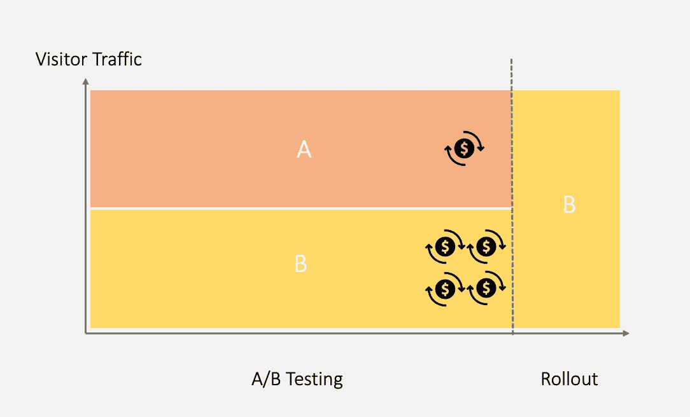
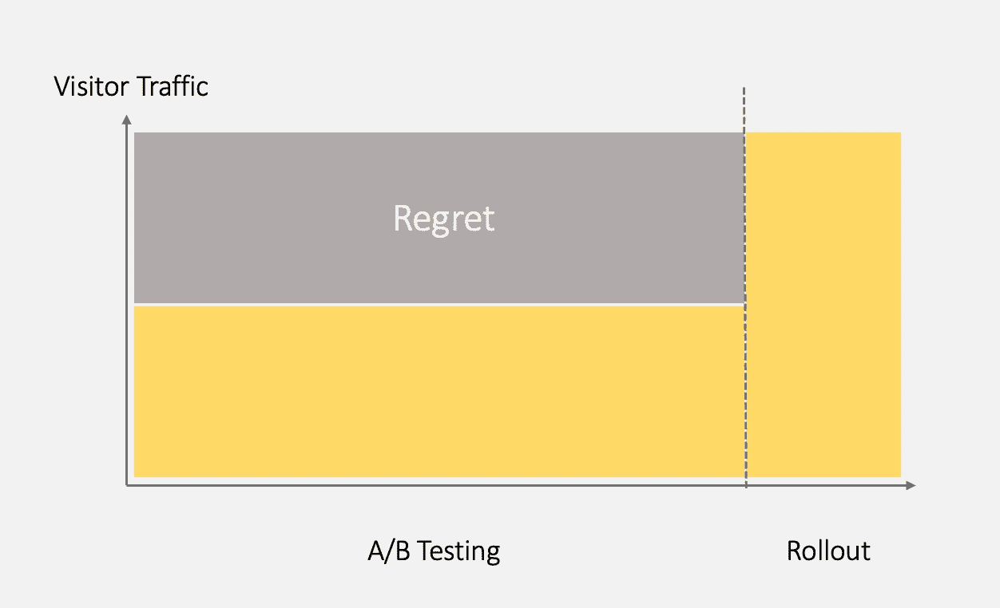
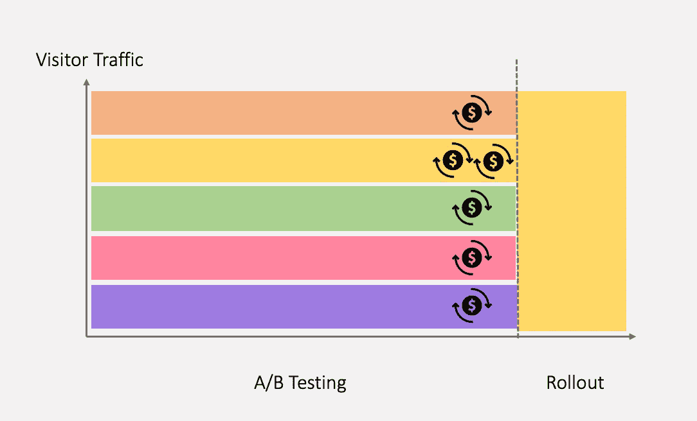
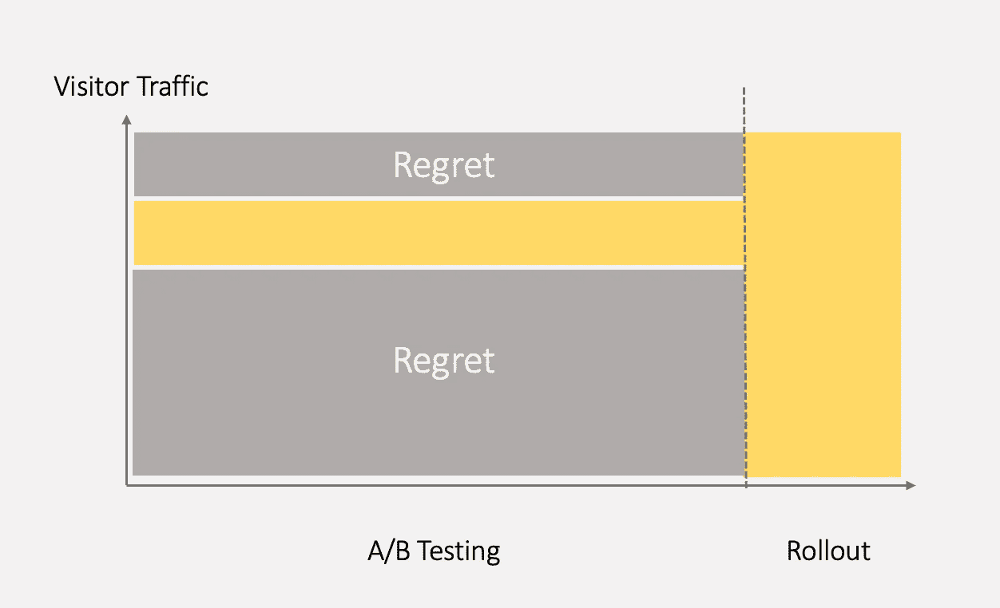
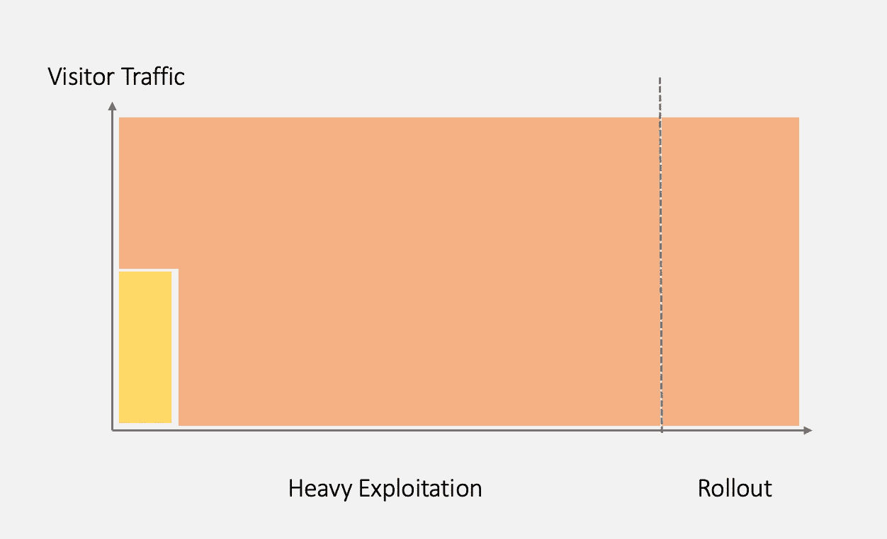
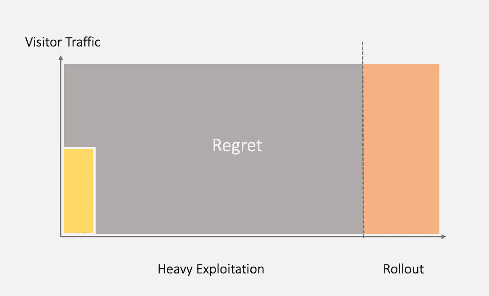
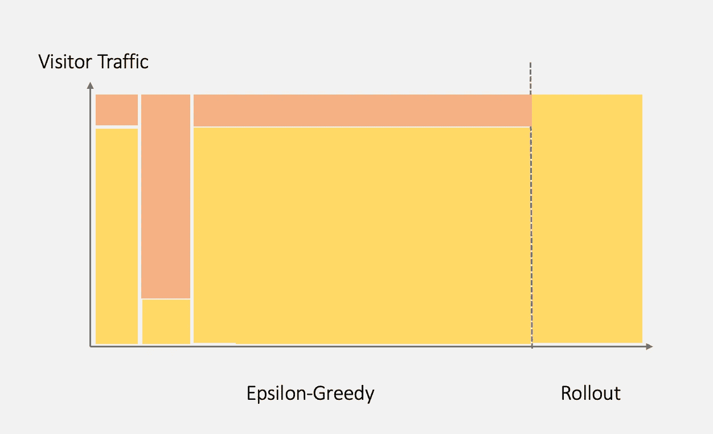

# 优化您的策略：超越 A/B 测试的方法

> 原文：[`towardsdatascience.com/optimizing-your-strategies-with-approaches-beyond-a-b-testing-bf11508f8930?source=collection_archive---------18-----------------------#2023-07-24`](https://towardsdatascience.com/optimizing-your-strategies-with-approaches-beyond-a-b-testing-bf11508f8930?source=collection_archive---------18-----------------------#2023-07-24)

## 对经典 A/B 测试的深入解释：Epsilon-greedy、Thompson Sampling、Contextual Bandits 等

 [John Leung](https://medium.com/@johnleungTJ?source=post_page-----bf11508f8930--------------------------------)

·

[关注](https://medium.com/m/signin?actionUrl=https%3A%2F%2Fmedium.com%2F_%2Fsubscribe%2Fuser%2F6125e8835d3b&operation=register&redirect=https%3A%2F%2Ftowardsdatascience.com%2Foptimizing-your-strategies-with-approaches-beyond-a-b-testing-bf11508f8930&user=John+Leung&userId=6125e8835d3b&source=post_page-6125e8835d3b----bf11508f8930---------------------post_header-----------) 发布于 [Towards Data Science](https://towardsdatascience.com/?source=post_page-----bf11508f8930--------------------------------) · 7 分钟阅读 · 2023 年 7 月 24 日

--

在数字营销的世界中，竞争激烈。每家公司都希望制定出最高价值的营销策略——提升客户留存、增强客户满意度，或实现其他商业目标。然而，并没有一种完美的营销策略适用于所有客户。相反，我们可以努力找到改进版的营销策略。这就是 A/B 测试的用武之地。

简而言之，A/B 测试是一种实验，它通过随机将观众分成两组，并比较两种策略的版本来查看哪一种表现更好。这是做出数据驱动决策的传统且经过统计验证的方法。

## 何时使用 A/B 测试

想象你和你的伙伴经营了一段时间的玩具电子商店。一天，你的伙伴对着陆页的背景颜色提出了担忧。他认为当前的颜色未能有效推动访客的转化率（即购买商品的访客百分比）。

+   当前使用（策略 A）：橙色

+   你的伙伴的建议（策略 B）：黄色

你立即识别出 A/B 测试是一个很好的实验设计。因为相对直接地根据测量结果（即每个策略的转化率）来确定“赢家”或“输家”，展示了哪一版本的网站最吸引访客。

下图展示了示例情况。

A/B 测试（图像由作者提供）

## A/B 测试的问题是什么

A/B 测试的结果确认，黄色着陆页（策略 B）上的网站访问者在电子商店中的转化率更高。因此，你决定将黄色着陆页推向所有访客群体。然而，你很快意识到这种测试方法带来了成本：由于 A/B 测试有严格定义的开始和结束点，整个测试期间，半数流量被分配给表现较差的策略 A。

> 选择较差策略 A 和最理想选项（在这种情况下为策略 B）之间的成本差异可以用**遗憾**来表示。

A/B 测试中的遗憾成本（图像由作者提供）

这个 A/B 测试可以总结为以下特点：

+   这强调了**探索**的价值：收集足够的信息来确定策略 A 还是 B 在整个测试中是最优的。

+   这超越了**利用**的价值：在测试过程中不通过减少流量来实现更高的转化率，即使收集到的信息表明策略 B 的表现更好。

听到 A/B 测试的结果后，你的伙伴对他建议更好策略的成功感到兴奋。他想进一步了解其他背景颜色，包括绿色、红色和紫色，是否能提高转化率。你可以预见到使用当前测试方法的情况会变得更糟，因为当涉及到更多策略时，A/B 测试的遗憾可能会更高。

多种策略在 A/B 测试中的情况（图像由作者提供）

多种策略在 A/B 测试中的遗憾成本（图像由作者提供）

## 超越 A/B 测试

我们欢迎新策略，因为它们可能使我们更接近商业目标。然而，我们通常会怀疑是否在测试过程中浪费了大量有限的时间和资源在糟糕的策略上。

**在经典的 A/B 测试中，我们保持在探索模式，忽略了策略是否表现优异或较差。** 如果我们采取相反的方式，专注于利用会怎样呢？操作方式如下：当只有少数访客在电子商店进行购买时，我们会快速选择看似最优的策略，然后在测试剩余时间里将所有访客都引导到这个策略上。这种方法具有较高的风险，因为样本量可能不足以根据策略的表现得出正确的结论。

高度利用（图片由作者提供）

高度利用的遗憾成本（图片由作者提供）

现在，我们理解了单独的探索或单独的利用都不是好的主意。我们需要在探索和利用之间取得平衡。此外，无可争议的是，我们应该在测试过程中不断将更多流量分配给当前最优策略。

> 换句话说，我们更倾向于采取能够最大化估计**回报**的行动。

## Epsilon-Greedy

Epsilon-Greedy 算法基于类似的理念，通过在每位访客的流量中随机选择探索和利用。假设我们希望 90%的流量集中于利用，10%的流量用于探索。算法遵循以下步骤：

当访客到达电子商店时，

1.  确定当前的最优策略

1.  90%的机会进行利用：将访客引导至当前最优策略。或者，有 10%的机会进行探索：将访客引导至剩余策略中的一个。

随着时间的推移，我们贪婪地在不同的策略中进行选择以进行利用，并逐渐做出一个一致的当前最优策略的决策。**然而，我们并不会放弃尝试其他策略的机会，即使在测试接近最终阶段时也是如此。** 通过在每次行动中最大化估计的回报，这种方法的总体遗憾成本可能比经典的 A/B 测试要小。

Epsilon-Greedy（图片由作者提供）

## 托普森采样

Epsilon-Greedy 看起来很有前景，但它是否还能进一步改进？让我们考虑两个场景：

(A) 当只有少数访客到达时，我们能否自信地为整个群体确定最优策略？

*可能不能。我们担心这些样本可能是异常值。由于仍然存在较高的不确定性，探索仍然是必要的。*

(B) 当成千上万的访客到达或我们处于测试的后期阶段时，我们现在是否有更大的信心？

*最有可能的是，由于更多的样本提供了更高的统计能力，使我们能够识别出在真实人群中表现优于其他策略的策略。*

现在，让我们优化我们的策略。为了根据我们的信心水平在探索和利用之间做出选择，我们可以实施汤普森采样。

**这种方法选择具有最高可能性将访客转化为买家的策略，而不是仅仅专注于最大化预期奖励。** 每次访客访问电子商店时，这种方法都会跟踪每种策略的总买家和非买家数量，并构建它们各自的贝塔分布。其优点包括：

+   当样本量较小时，即使是转化率较低的策略也可能被选择（优先考虑探索）。

+   随着证据变得更加明显，具有更高转化率的策略将在大多数情况下被选择（优先考虑利用）。

## 上下文赌博机

汤普森采样是一种有效的方法，因为它在整个测试过程中动态调整探索和利用之间的平衡。虽然它允许我们在客户到达时做出有关应用哪种策略的明智决策，但这些决策不会针对不同的客户群体进行个性化。

照片由[Justin Lim](https://unsplash.com/@justinlim?utm_source=medium&utm_medium=referral)拍摄，发布在[Unsplash](https://unsplash.com/?utm_source=medium&utm_medium=referral)上

让我们考虑两个访客：Peter 和 Mary。Peter 喜欢每个周末与孩子一起观看《神偷奶爸》的视频，而 Mary 对这些没有兴趣。即使在测试的早期阶段，我们也可以预测 Peter 更倾向于访问黄色的玩具电子商店页面（《神偷奶爸》的主要颜色！），并且更有可能进行购买。

这个例子突出了考虑访客上下文数据的重要性。通过利用上下文赌博机，我们可以更系统地应用算法决策。在现实场景中，上下文可能包括关于每位客户的历史数据，如网站点击、过去的购买、打开个性化邮件的频率，甚至是他们当前会话的数据，例如最近的搜索查询。**然后，算法可以学习将不同的上下文与最有可能导致转化的策略关联起来。**

## 任何新的创意

我们已经讨论了各种方法，包括经典 A/B 测试、Epsilon-Greedy 算法、汤普森采样和上下文赌博机。

+   经典的 A/B 测试：涉及保持在探索模式中。

+   Epsilon-Greedy 算法：随机平衡探索和利用。

+   汤普森采样：随着每种策略的样本量增加，更多强调利用。

+   上下文赌博机：根据访客的上下文（附加信息）提供个性化和最优的策略

这些方法在最近的研究论文中得到了进一步的精炼和讨论。以下是一些例子：

+   [“具有深度表示和浅层探索的神经上下文强盗算法](https://openreview.net/forum?id=xnYACQquaGV)”：神经上下文强盗算法依赖于在整个网络参数空间中进行的探索，这对于大规模网络通常效率低下。该论文提出了一种具有浅层探索和设定遗憾界限的新算法。

+   [“联邦上下文强盗算法的实证评估](https://paperswithcode.com/paper/an-empirical-evaluation-of-federated)”：本文探讨了将联邦学习（一种去中心化的机器学习模型训练方法）与上下文强盗算法相结合的问题。它解决了与联邦学习整合相关的关注点，例如利用少量预训练数据。

## 在你离开之前

如果你喜欢这篇阅读，我邀请你关注 [我的 Medium 页面](https://medium.com/@johnleungTJ)。通过这样做，你可以随时了解有关数据科学、项目管理和自我提升的精彩内容。
