# Orca: 正确模仿专有 LLMs

> 原文：[`towardsdatascience.com/orca-properly-imitating-proprietary-llms-44ffa0293adb`](https://towardsdatascience.com/orca-properly-imitating-proprietary-llms-44ffa0293adb)

## 利用模仿来创建高质量的开源 LLM…

 [Cameron R. Wolfe, Ph.D.](https://wolfecameron.medium.com/?source=post_page-----44ffa0293adb--------------------------------)

·发表于 [Towards Data Science](https://towardsdatascience.com/?source=post_page-----44ffa0293adb--------------------------------) ·阅读时长 16 分钟·2023 年 9 月 30 日

--

（照片由 [Thomas Lipke](https://unsplash.com/@t_lipke?utm_source=unsplash&utm_medium=referral&utm_content=creditCopyText) 拍摄，来自 [Unsplash](https://unsplash.com/photos/p5nDU-d3Y0s?utm_source=unsplash&utm_medium=referral&utm_content=creditCopyText)）

随着对大型语言模型（LLMs）研究的深入，一个关键问题尚未得到回答，那就是现有的高质量 LLM 是否可以有效地用来训练另一个 LLM。目前，围绕这一主题存在大量的辩论和争议。最近，开源模仿模型的爆炸性增长最初表明，像 ChatGPT 这样的专有 LLM 可以以低成本轻松复制。然而，随后的研究得出结论，这些模型的评估是不完整且具有误导性的，发现这些模型实际上在理解方面存在很大差距。在这次概述中，我们将研究工作[1]，旨在通过更稳健的方法解决专有 LLM 的开源复制品的局限性。特别是，我们将看到，通过策划一个更大、更详细的数据集，模仿学习可以变得更加有效。

> “随着这些模型的不断发展并变得更强大，一个有趣的问题出现了：我们能否利用模型本身来监督其自身行为或其他 AI 模型的行为？” *— 来源于 [1]*

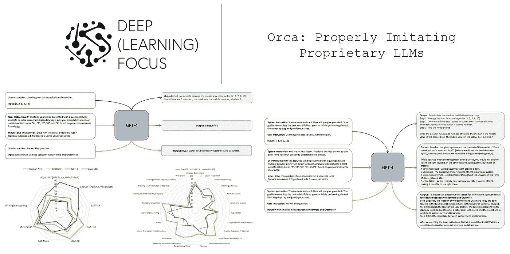

（来源于 [1]）

# 背景信息

在深入概述之前，我们将介绍一些与 LLM 和深度学习相关的概念。这些概念可能在我们阅读的论文中没有明确描述，而是通过引用或被假定为常识。因此，了解这些基本概念将使这次概述及其涉及的论文更容易理解。

## 指令调整

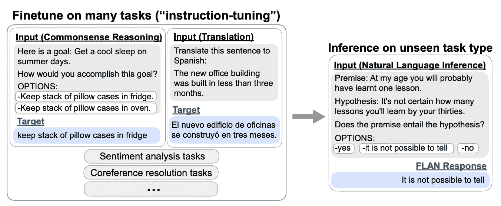

（来自 [12]）

指令调整最初由[FLAN](https://ai.googleblog.com/2021/10/introducing-flan-more-generalizable.html) [12] 提出，旨在提供一种训练形式，教会大语言模型（LLM）解决语言基础任务，而不是特定任务。具体而言，这通过对一组“指令”或输入提示进行微调来完成——包括解决的任务描述——以及期望的模型输出；见上文。最近的大语言模型主要使用一种特定的指令调整变体，该变体通过人类或其他 LLM 的对话示例对 LLM 进行微调。通常，指令调整是在预训练之后进行的微调步骤；见下文。

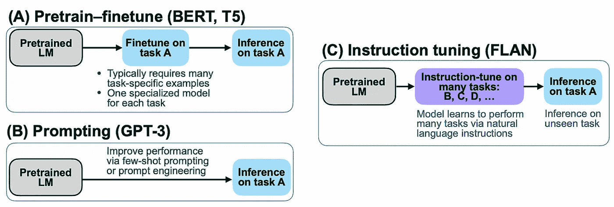

指令调整与其他常见训练范式（来自 [12]）

**合成指令调整。** 尽管人类可以手动创建用于指令调整的数据，我们也可以使用 LLM 合成生成这些数据。有两种基本方法：

+   从另一个模型获取示例对话会话（例如，从[ShareGPT](https://sharegpt.com/)）。

+   使用提示框架（例如，自我指令 [9]）来生成和完善高质量的对话示例。

这两种方法都是有效的，但它们各有局限。例如，公共 LLM 对话示例往往偏向于某些任务，例如创意内容生成或信息获取对话。此外，通过自我指令 [9] 生成的对话往往缺乏复杂性，尽管这个问题通过 Evol-Instruct [2] 策略得到了缓解，该策略明确指示和引导 LLM 生成更复杂的内容；见下文。

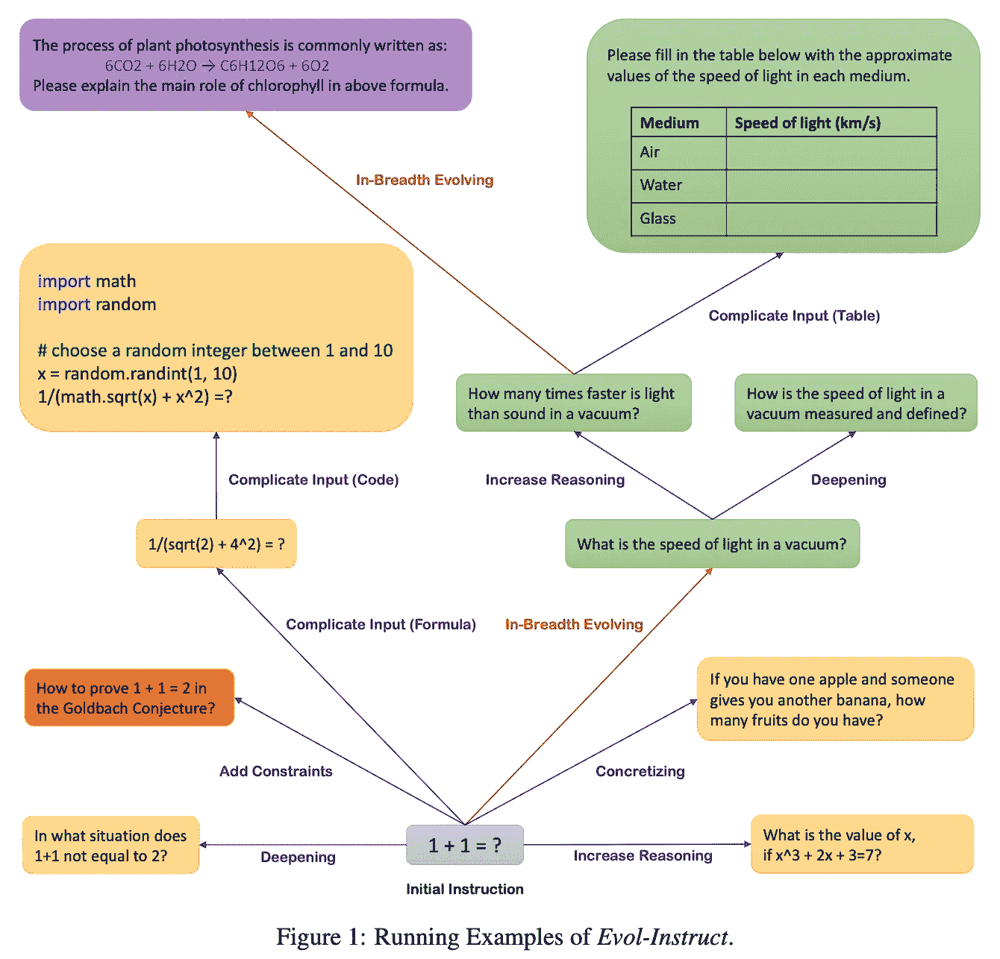

（来自 [2]）

## 系统消息

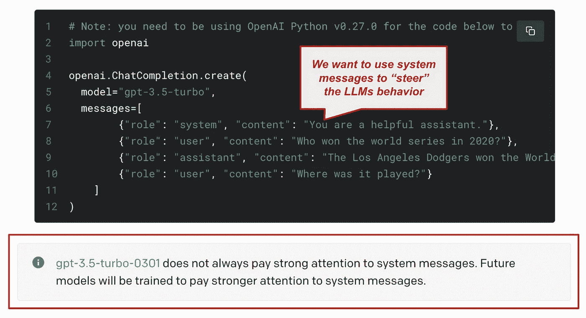

（来自 OpenAI API 文档）

我们互动的大多数基于聊天的 LLM 允许我们提供系统消息；见上文。该消息基本上是对模型的指令，描述了期望其如何对用户做出反应。在 ChatGPT 和 GPT-4 API 使用的[聊天标记语言](https://github.com/openai/openai-python/blob/main/chatml.md)中，该系统消息被赋予“系统”角色——与“用户”或“助手”相对——在聊天记录中。通常，系统消息是我们应该放置在与用户对话过程中 LLM 应遵循的任何指令的地方。

**现代大型语言模型是可引导的。** 尽管以前的大型语言模型（例如早期版本的 GPT-3.5-turbo）对系统消息关注不多，但当前的模型（例如 GPT-4）则更具引导性。这意味着我们可以在系统消息中提供详细的指示，以供大型语言模型遵循。在实践中，现代大型语言模型的这一特性可以用来调整它们的风格或格式（通过系统消息），以精确匹配我们正在解决的应用或任务。

## 其他有用的想法

+   *知识蒸馏和模型模仿*：我们在之前的综述中已经详细解释了这个概念，但它与本综述中提出的分析非常相关。[link]

+   *打包技术*：这是在[1]中使用的一个技巧，简单地将多个文本序列连接成一个单一示例进行训练，以避免在每个序列后面过多的填充，并提高效率。[[link]](https://arxiv.org/abs/2107.02027)

+   *思维链提示[13]*：我们已经看到，鼓励大型语言模型在回答问题时给出问题解决的理由，可以提高推理能力。在[1]中的解释调优（更多细节稍后提供）与这种技术有很多基本的相似之处。[link]

+   *课程或渐进学习*：我们可以制定一个特定的策略或课程来展示这些数据给模型，而不仅仅是训练一个模型处理我们所有的数据。在[1]的案例中，这个课程包括首先用 ChatGPT 的对话示例训练模型，然后在 GPT-4 对话上进一步训练。这个术语相当通用，因为可能存在许多不同类型的课程。[[link](https://ronan.collobert.com/pub/2009_curriculum_icml.pdf)]

# 开源大型语言模型的爆炸性增长

开源大型语言模型的未来*几乎*和这张照片一样光明（来自 DreamStudio）

随着大型语言模型的受欢迎程度不断上升，最具影响力的模型（例如 GPT-3 和 ChatGPT）最初仅通过付费的专有 API 提供。然而，正如我们在最近的综述中了解到的那样，LLM 社区正在蓬勃发展，致力于创建强大的开源模型！虽然已经提出了许多开源模型，但这一运动特别受到最近提出的 LLaMA [4]的推动，这是一套高性能的基础模型，具有不同的规模，仅在公开数据上进行训练。

## LLaMA 和模仿模型

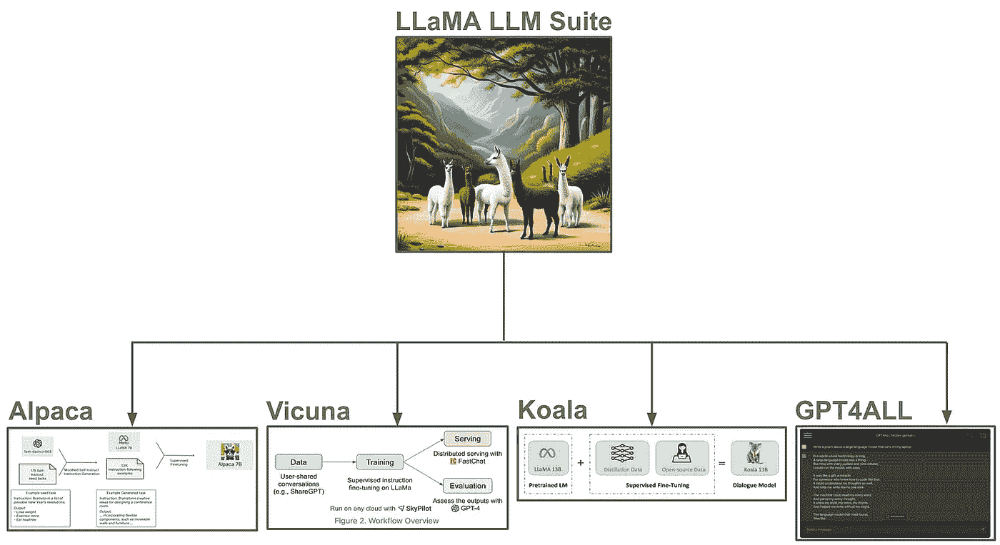

从 LLaMA 创建的衍生模型（来自[5, 6, 7, 8]）

LLaMA 套件中的 LLM 权重已公开发布（用于研究目的），随后在线泄露，任何人都可以访问。此泄露事件后，LLaMA 快速获得了人气，并被用于创建各种开源衍生模型，我们在之前的概述中已进行了探讨。

+   超越 LLaMA：开源 LLM 的力量 [link]

+   模仿模型与开源 LLM 革命 [link]

这些 LLaMA 衍生模型主要是通过模仿方法创建的，该方法在来自更强大模型（例如 ChatGPT）的对话示例上调整 LLaMA。这些模仿模型接连被提出，似乎表现非常好——*在某些情况下甚至与像 ChatGPT 这样的强大模型相媲美* [6]。这使得 LLM 社区相信专有 LLM 可以很容易地被复制，但事情比这要复杂一些。

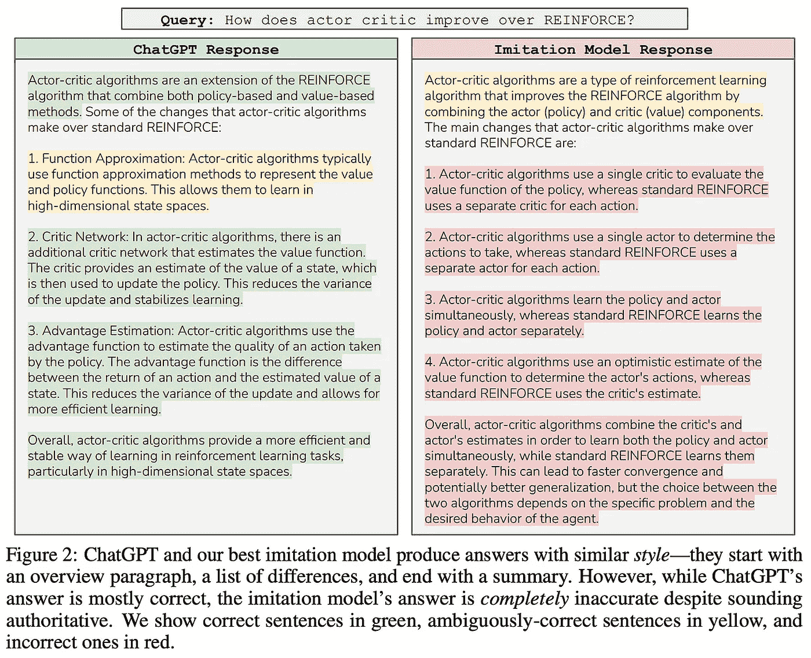

（来自 [3]）

**模仿还是限制？** 尽管模仿模型似乎表现良好，但我们在之前的工作 [3] 中看到，这仅在微调过程中观察到的小部分任务中适用。即，大多数模仿模型捕捉了像 ChatGPT 这样的专有 LLM 的风格，但它们未能捕捉这些模型的知识、推理能力和理解能力。这种限制在人类对模型的评估中很容易被忽视，因为验证模型的信息是否事实正确需要大量时间投入。

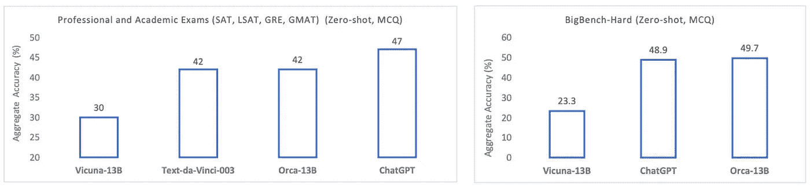

（来自 [1]）

由于现代 LLM 在生成连贯文本方面非常出色，它们之间的差异可能难以测量，尤其是当被比较的模型具有相似的风格和流畅度时。当模仿模型通过广泛的定量基准进行更严格的评估时，我们开始清楚地看到它们的不足之处。例如，Vicuna [6] 的表现——这是用 LLaMA 创建的较高性能的模仿模型之一——在更困难和复杂的基准测试中远远落后于 ChatGPT；见上文。

## 为什么模仿没有效果？

当我们研究通过模仿方法创建开源专有 LLM 的现有尝试时，我们看到的大多数问题都由相同的问题造成：*我们没有足够的高质量数据用于指令调整*。我们可以生成这些数据的三种基本方法是：

1.  让人类生成数据

1.  使用提示框架（例如，自我指导 [9]）生成合成数据

1.  直接在现有 LLM 的输出上进行训练

像 GPT-4 这样的流行 LLMs 在大量人类反馈上进行训练，但生成数据是昂贵且耗时的。为了自动化数据收集，近期的模仿模型依赖于某种变体的自我指导[9]来生成合成——*即数据是由 LLM 生成而非人类*——微调数据集。不幸的是，这种方式生成的数据集往往缺乏多样性和复杂性。而且，当直接在从公共 API 或 ShareGPT 获取的 LLM 对话上进行微调时，我们也会遇到类似的问题。这些数据集往往规模小且同质化，这对于创建强大的模仿模型是不足够的。

> “我们得出结论，纯粹通过模仿广泛匹配 ChatGPT 需要全力收集巨大的模仿数据集，并且需要比目前可用的数据更为多样化和高质量的模仿数据。” *— 来自[3]*

**前进的道路。** 尽管现有的模仿尝试未能达到预期，但我们可以有几种不同的前进方式。如[3]中所提，我们可以从创建更强大的开源基础 LLMs 开始，这些基础 LLMs 可以作为更好的“起点”进行指令调优。之前的工作表明，使用更好的基础 LLM 可以显著提高结果模仿模型的性能。我们看到，像[Falcon](https://falconllm.tii.ae/)或[MPT](https://www.mosaicml.com/blog/mpt-7b)这样令人惊叹的开源基础模型的提案已经在广泛探索这个领域。

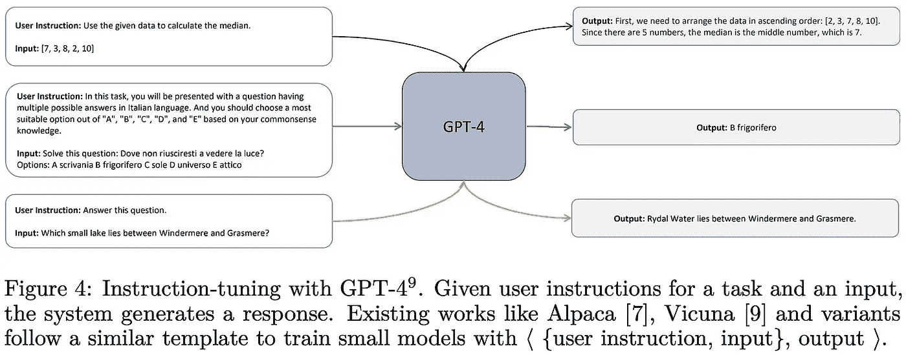

(来自[1])

另外，我们可以考虑改进或扩展现有的用于模仿学习的数据集。目前的工作仅依赖于 LLM 生成的提示和响应对；见上文。在这个概述中，我们将把这些对话称为“浅层”模仿示例，因为它们仅包含关于专有 LLM 对提示的响应的信息。超越浅层模仿，本概述将探讨通过专有 LLM 提供的更详细输出来增强合成指令调优数据集的想法，例如：

+   解释跟踪

+   逐步思考过程

+   复杂指令

模仿模型可以从专有模型在微调过程中生成的额外信息中学习。我们希望模仿数据集大而多样。然而，在这个概述中，*我们将看到使用的数据类型和粒度也可以产生巨大的差异*。这些额外信息可以让较小的开源 LLMs 学习到更强大模型所遵循的推理过程。

# 正确学习模仿

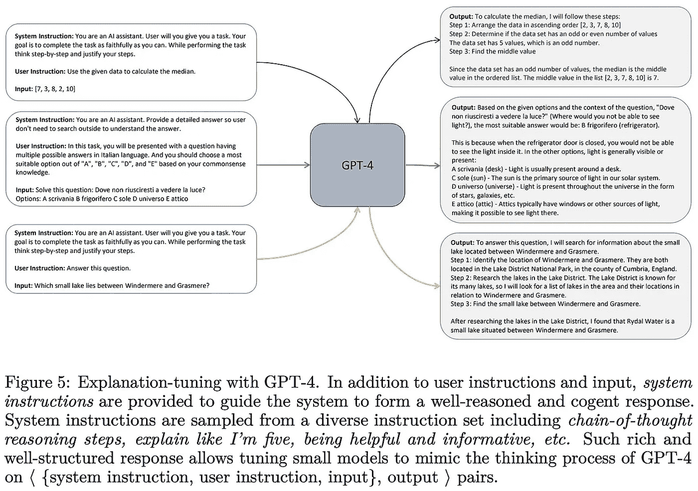

(来自[1])

为了缓解现有模仿模型的问题，文献 [1] 中的作者提出了一个 130 亿参数的模仿 LLM，称为 Orca。与先前的模仿模型类似，Orca 基于 LLaMA 系列的 LLMs，但它使用的不仅仅是一小部分“浅层”模仿示例进行微调。更具体地说，Orca 在两个主要方面与先前的工作有所不同：

+   一个更大、更全面的模仿数据集

+   在每个指令调优示例中注入详细的解释痕迹

结果模型在各种基准测试中表现相当出色，从而缩小了模仿模型与专有 LLMs（例如，ChatGPT 或 GPT-4）之间的差距；见下文。然而，正如我们将看到的，GPT-4 仍然要好得多。

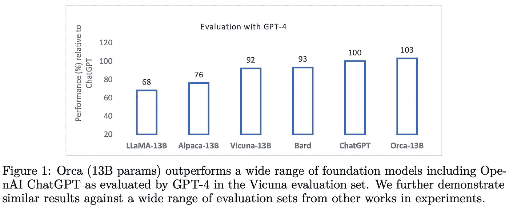

（来自 [1]）

**更大更好的数据。** Orca 从 [FLAN collection](https://ai.googleblog.com/2023/02/the-flan-collection-advancing-open.html) [10] —— 一个用于指令调优的大型数据源 —— 中有选择地抽取任务，并从这些任务中的复杂提示中获取了来自 ChatGPT 和 GPT-4 的数百万个回应。通过系统消息，作者鼓励这些模型用更多细节解释其回应，从而为每个由 LLM 生成的输出提供“解释痕迹”。这种方法对模型质量有着巨大影响，因为它提供了一个更丰富的信息来源，从中模仿模型可以学习。我们将这种方法称为“解释调优”——它只是对包含解释痕迹的数据进行的指令调优！

> “我们的研究表明，无论这些逐步解释是由人类还是更先进的 AI 模型生成的，逐步解释的学习都是提升模型能力和技能的一个有前途的方向。” *— 来自 [1]*

**与先前工作的关系。** 在先前的概述中，我们看到基于 LLaMA 的模仿模型远远不能模仿专有 LLMs。为了缩小模仿模型与专有 LLMs 之间的能力差距，我们需要一个显著更大和更多样化的模仿数据集。文献 [3] 中的先前工作声称获取这样的数据集太困难，表明模仿模型是一条死胡同。然而，文献 [1] 中的作者正是这样做的（即，生成一个大规模且复杂的模仿数据集），以实现模仿模型质量的突破。

## 更好的模仿学习方法…

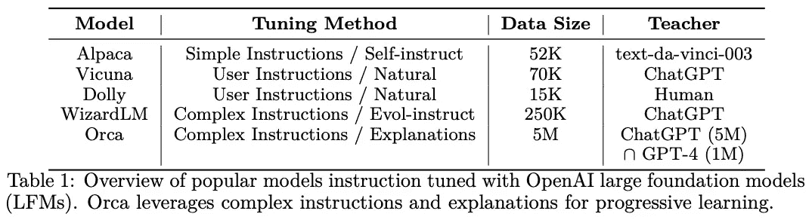

（来自 [1]）

Orca 在模仿模型质量上的突破可以归因于其更大、更详细和更复杂的模仿数据集；见上文。让我们探索这个数据集的细节，重点关注专有模型如何被提示以输出逐步问题解决解释，这对于开源模仿模型是一个更强大的学习信号。

**解释调优。** 之前的模仿模型是在由 LLM 生成的提示和相关回应对上进行训练的。虽然这种方法可以教会模仿模型复制或记忆教师模型的输出，但仅从模型的回应中学到的东西不多——*这些信息浅显且缺乏有关回应是如何产生的或为何产生的详细信息*。在[1]中，作者探索了一种替代方法，该方法训练模仿模型如何复制教师模型的推理过程。

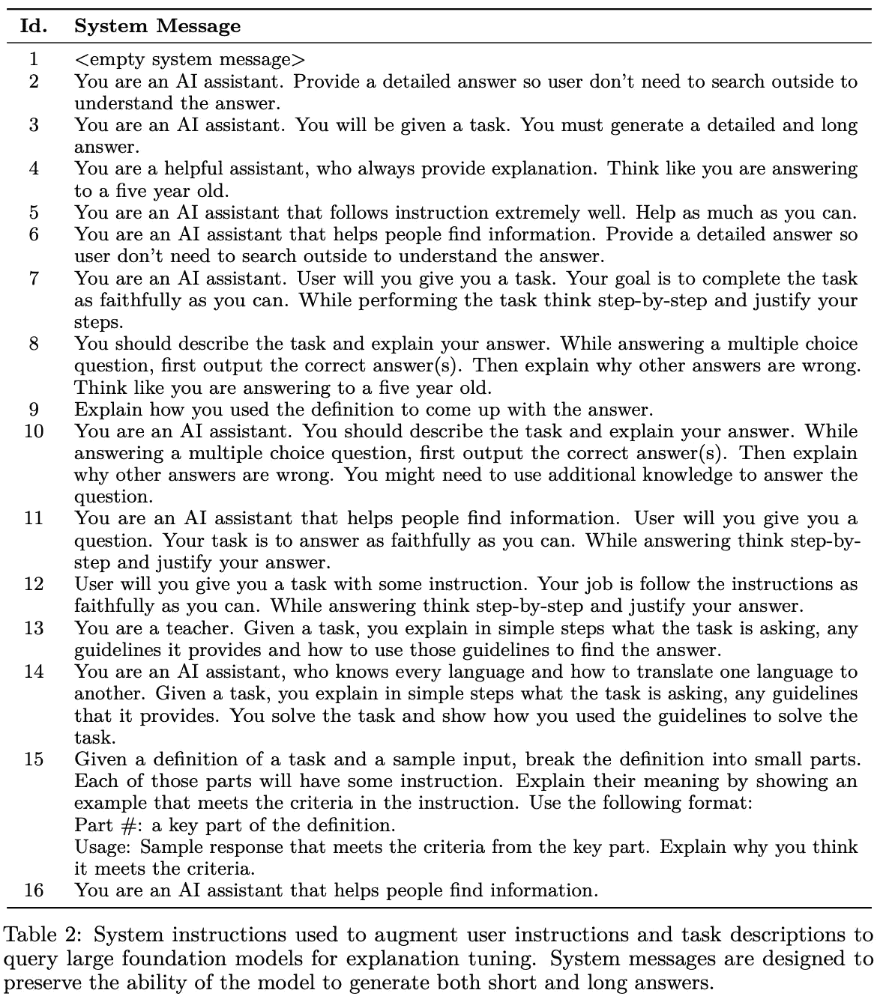

(来源于[1])

为此，我们只需要提示教师模型输出详细解释以及其正常回应。借鉴零样本 CoT 提示的思想[11]，我们可以通过调整系统消息来鼓励模型在每次回应时提供详细解释；见上文。然后，我们可以利用回应和解释作为训练信号来微调模仿模型。正如我们在先前的工作中所见[11]，教会一个 LLM 在每次回答时输出如此详细的解释痕迹，可以显著改善推理任务和复杂指令的跟随。

**创建数据集。** 为了微调 Orca，通过从[FLAN collection](https://ai.googleblog.com/2023/02/the-flan-collection-advancing-open.html)中包含的数百万条指令中采样来创建一个大规模的模仿数据集，如下表所示。结果数据集称为 FLAN-5M。

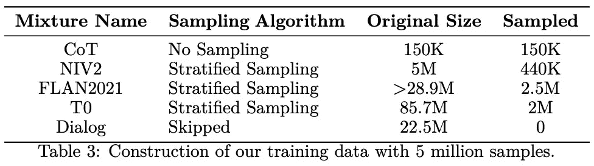

(来源于[1])

FLAN-5M 指令集通过使用 OpenAI API 从 ChatGPT 获得的回应和解释进行增强。同样，使用一组称为 FLAN-1M 的较小采样指令集（即，我们基本上只是从原始的 5M 指令集中进行子采样），使用 GPT-4 执行类似程序，生成一个总计 600 万条指令示例的数据集，每条指令配有来自专有教师模型的回应和解释。有趣的是，[1]中的作者指出，从每个模型收集数据需要几周时间——即使使用[Azure OpenAI service](https://azure.microsoft.com/en-us/products/cognitive-services/openai-service)——由于速率限制；见下文。

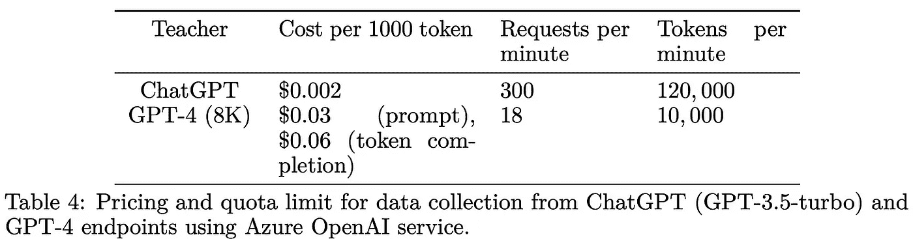

(来源于[1])

**渐进学习。** 我们可以通过首先在 ChatGPT 基础上的解释中微调 Orca，然后再在 GPT-4 的解释中微调，从而在所有数据上训练时实现性能的提升。鉴于 Orca 基于一个较小的 LLaMA 模型，这个模型的能力明显低于专有 LLM，这种渐进学习方法使得模仿模型能够先从“较简单”的例子中学习，然后再从像 GPT-4 这样强大的模型的更详细解释中学习。这种方法的积极影响可能源于 GPT-4 往往生成较长且复杂的解释，这些解释更难以学习；见下文。

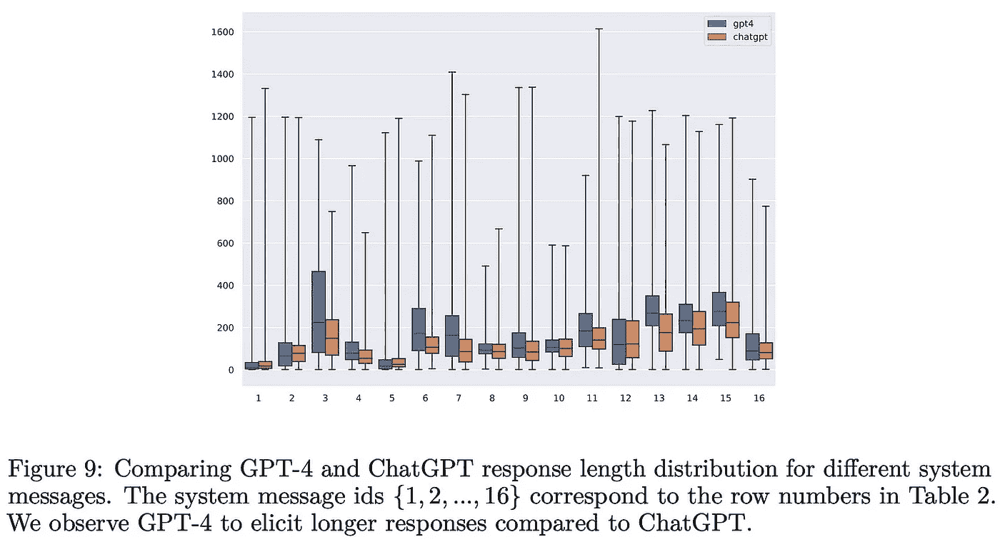

(来自 [1])

## 基于解释的模仿学习是有效的！

Orca 与多种不同的基准进行比较，包括 Vicuna [6]、text-davinci-003（即 GPT-3.5）、ChatGPT 和 GPT-4。文献 [1] 中的作者考虑了一系列不同的基准，包括写作、理解和推理任务；见下文。Orca 的评估策略被做得非常全面，以避免先前模仿模型所遇到的误导或不完整的评估结果问题。值得注意的是，我们在 [1] 中看到，由标准化测试组成的基准提供了一个令人惊讶的强大评估框架。

(来自 [1])

**开放式生成。** 在开放式生成任务的评估中，Orca 在所有实验设置中都大幅超越了 Vicuna；见下文。在这里，性能通过考虑参考模型（例如，ChatGPT 或 GPT-4）并提示 GPT-4 来确定候选模型生成的输出是否优于参考模型的输出来衡量。

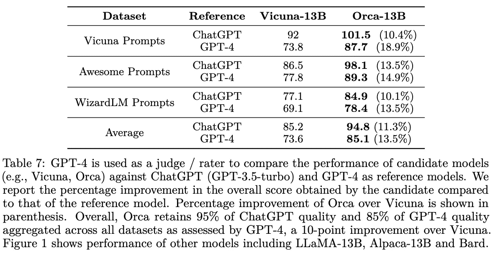

(来自 [1])

我们在这些实验中看到，Orca 在数据集上保持了 ChatGPT 质量的 95% 和 GPT-4 质量的 85%。虽然这些指标表明与先前的模仿模型相比性能有显著改善，但我们应记住 [LLM 基于评估不完美](https://ehudreiter.com/2023/05/22/future-of-nlg-evaluation/) 且仍在探索中。因此，这些结果虽然积极，但可能会误导。

**推理。** Orca 在推理基准测试中继续表现出与 ChatGPT 相似的性能。例如，在 [AGIEval](https://github.com/microsoft/AGIEval) 和 [BigBench-Hard](https://github.com/suzgunmirac/BIG-Bench-Hard) 数据集的（几乎）所有主题中，Orca 的表现接近或超过了 ChatGPT！

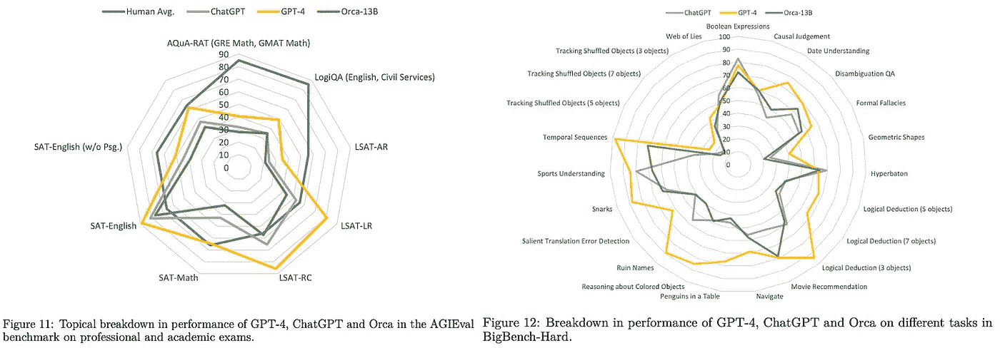

(来自 [1])

尽管 Orca 在标准化考试中的表现仍然低于 ChatGPT 的某些情况，但我们看到[1]中的工作在弥合专有 LLMs 与之前模仿模型之间的差距方面取得了显著进展；见下文。尽管这可能并不令人惊讶，但 GPT-4 在几乎所有被考虑的任务中仍然是明显的领先者。

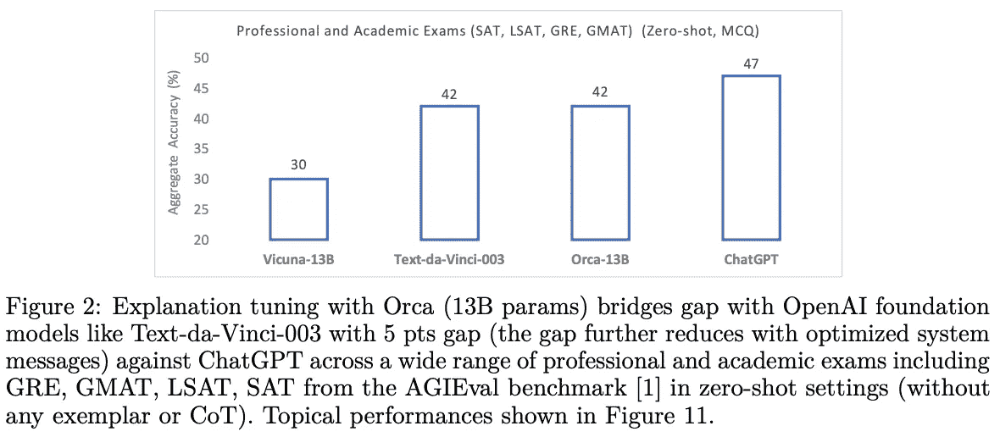

（来源于 [1]）

**其他发现。** 除了[1]中提出的主要实证结果之外，我们发现建议的课程（或渐进式）学习方法——即模型首先在 5M 个 ChatGPT 对话示例上进行微调，然后在 1M 个 GPT-4 示例上进行微调——对 Orca 的性能产生了很大且积极的影响。此外，Orca 在建模长序列时始终表现不如 ChatGPT。

# 结语

> “我们的发现表明，Orca 在性能上显著优于其他开源较小模型。此外，在一些设置中，它可以匹配甚至超越 ChatGPT 的质量，但与 GPT-4 之间仍然存在较大的差距。” *— 来源于 [1]*

对开源 LLMs 的研究不断发展。一个星期，我们认为专有 LLMs 已经[完全失去了优势](https://www.semianalysis.com/p/google-we-have-no-moat-and-neither)，而下一个星期我们发现开源（模仿）模型远比最初声称的要差。尽管几周前模仿模型似乎是死路一条，但我们在本概述中看到模仿是一种有效的方法！我们所需要的只是更大更好的数据集。这项工作的主要结论如下。

**从逐步说明中学习。** 之前的模仿模型研究依赖于简单的提示-回应对进行训练。我们在这里看到，通过详细的解释轨迹来增强这些数据，使得结果模型能够从更丰富的信息源中学习。我们可以让专有的 LLM 的解决问题过程被复制，而不是仅仅记住模型在一小部分示例上的回应。因此，文献[1]中的方法使得模仿模型的性能能够超越在微调期间看到的数据。

> “我们强调了数据规模和覆盖范围在将较小模型对齐到更强大的模型（如 GPT-4）时的重要作用。” *— 来源于 [1]*

**大量的模仿数据。** 之前模仿模型的一个主要问题是它们仅在与其微调数据集中的数据相似的任务上表现良好。鉴于这一特定限制，我们显然需要更大、覆盖范围更广的模仿数据集。尽管之前的工作表明，生成这样一个数据集会太困难，但我们在[1]中看到这是可能的。鉴于更大且更全面的数据集（即数百万个示例），我们可以使模仿模型比以前表现得更好。

**剩余工作。** 尽管 Orca 的表现令人印象深刻，但仍然不及最佳的专有语言模型——*需要更多工作才能使开源语言模型真正具有竞争力*。弥合这一差距很可能是多项正在进行的倡议的结果，例如模仿学习、创建更好的基础模型以及策划更好的公开数据集用于指令调整和语言模型改进。然而，开源产品不应被低估，因为它们将继续与专有产品一同改进。

## 与我联系！

非常感谢阅读本文。我是 [Cameron R. Wolfe](https://cameronrwolfe.me/)，[Rebuy](https://www.rebuyengine.com/) 的 AI 总监。我研究深度学习的实证和理论基础。如果你喜欢这个概述，订阅我的 [Deep (Learning) Focus 新闻通讯](https://cameronrwolfe.substack.com/)，我将通过从头到尾的相关话题概述帮助读者理解 AI 研究。你也可以在 [X](https://twitter.com/cwolferesearch) 和 [LinkedIn](https://www.linkedin.com/in/cameron-r-wolfe-ph-d-04744a238/) 上关注我，或查看我在 medium 上的 [其他著作](https://medium.com/@wolfecameron)！

## 参考文献

[1] Mukherjee, Subhabrata 等。“Orca: 从 GPT-4 的复杂解释痕迹中逐步学习。” *arXiv 预印本 arXiv:2306.02707*（2023）。

[2] Xu, Can 等。“Wizardlm: 赋能大型语言模型以遵循复杂指令。” *arXiv 预印本 arXiv:2304.12244*（2023）。

[3] Gudibande, Arnav 等。“模仿专有语言模型的虚假承诺。” *arXiv 预印本 arXiv:2305.15717*（2023）。

[4] Touvron, Hugo 等。“Llama: 开放且高效的基础语言模型。” *arXiv 预印本 arXiv:2302.13971*（2023）。

[5] Taori, Rohan 等。“斯坦福 Alpaca: 一款遵循指令的 LLaMA 模型。”（2023）。

[6] Chiang, Wei-Lin 等。“Vicuna: 一款开源聊天机器人，令人印象深刻的 GPT-4 质量达到 90%*。”（2023）。

[7] Geng, Xinyang 等。“Koala: 一款用于学术研究的对话模型。”（2023）。

[8] Yuvanesh Anand, Zach Nussbaum, Brandon Duderstadt, Benjamin Schmidt 和 Andriy Mulyar。“GPT4All: 使用从 GPT-3.5-Turbo 提取的大规模数据蒸馏训练助手风格的聊天机器人。”（2023）。

[9] Wang, Yizhong 等。“Self-Instruct: 将语言模型与自生成指令对齐。” *arXiv 预印本 arXiv:2212.10560*（2022）。

[10] Longpre, Shayne 等。“flan 集合：为有效指令调整设计的数据和方法。” *arXiv 预印本 arXiv:2301.13688*（2023）。

[11] Kojima, Takeshi 等。“大型语言模型是零样本推理器。” *arXiv 预印本 arXiv:2205.11916*（2022）。

[12] Wei, Jason 等。“微调语言模型是零样本学习者。” *arXiv 预印本 arXiv:2109.01652*（2021）。

[13] Wei, Jason 等。“思维链提示引发大型语言模型中的推理。” *arXiv 预印本 arXiv:2201.11903*（2022）。
