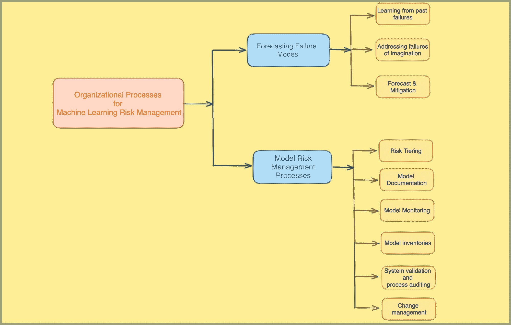

# 机器学习风险管理的组织流程

> 原文：[`towardsdatascience.com/organizational-processes-for-machine-learning-risk-management-14f4444dd07f?source=collection_archive---------5-----------------------#2023-09-23`](https://towardsdatascience.com/organizational-processes-for-machine-learning-risk-management-14f4444dd07f?source=collection_archive---------5-----------------------#2023-09-23)

## 负责任的人工智能

## *组织流程是机器学习系统可靠性的关键非技术决定因素。*

 [Parul Pandey](https://pandeyparul.medium.com/?source=post_page-----14f4444dd07f--------------------------------)

·

[关注](https://medium.com/m/signin?actionUrl=https%3A%2F%2Fmedium.com%2F_%2Fsubscribe%2Fuser%2F7053de462a28&operation=register&redirect=https%3A%2F%2Ftowardsdatascience.com%2Forganizational-processes-for-machine-learning-risk-management-14f4444dd07f&user=Parul+Pandey&userId=7053de462a28&source=post_page-7053de462a28----14f4444dd07f---------------------post_header-----------) 发表在 [Towards Data Science](https://towardsdatascience.com/?source=post_page-----14f4444dd07f--------------------------------) ·7 min read·Sep 23, 2023

--

作者提供的图片

在我们关于机器学习风险管理的系列文章中，我们一直在研究一些确保机器学习（ML）系统可靠性的关键要素。在我们的第一部分中，我们详细讨论了[**机器学习风险管理中的文化能力**](https://example.org/cultural-competencies-for-machine-learning-risk-management-c38616c2ccdf?sk=8ed4f0c5e9624e21d9f6dae9017d5bed)**，**。其中提供的见解为我们当前的探索奠定了基础，因此，我强烈建议你在继续阅读本文之前，先阅读前一部分。

[## 机器学习风险管理中的文化能力](https://example.org/cultural-competencies-for-machine-learning-risk-management-c38616c2ccdf?source=post_page-----14f4444dd07f--------------------------------) 

### 组织文化是负责任的人工智能（AI）的一个重要方面。

[towardsdatascience.com](https://example.org/cultural-competencies-for-machine-learning-risk-management-c38616c2ccdf?source=post_page-----14f4444dd07f--------------------------------)

在第二篇文章中，我们将把焦点转向机器学习系统中的另一个重要要素：**组织流程**。尽管技术细节常常掩盖了这些流程，但它们是确保机器学习模型安全性和性能的关键。正如我们认识到文化能力的重要性一样，我们现在也承认组织流程是…
